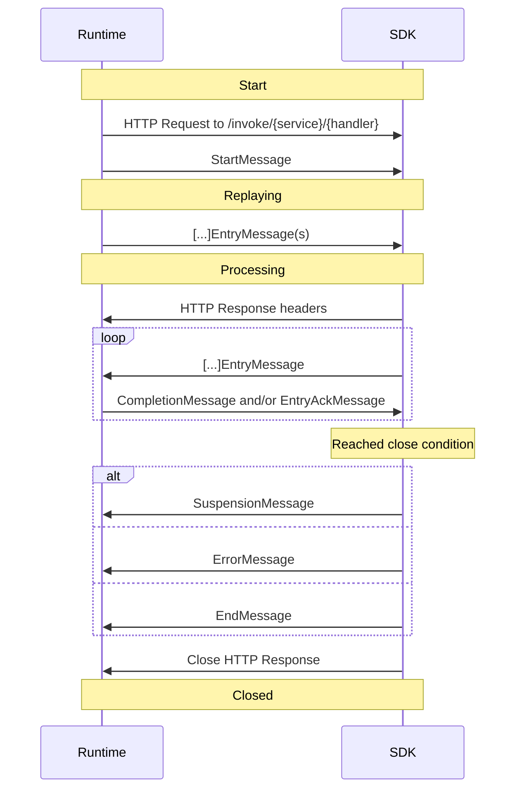

# Restate Service Protocol — raw source extracts (group: restate-spec)

Faithful collection only. No analysis, no interpretation. All quoted blocks are verbatim from the
fetched sources; anything not in a quote block is a source/date label written by the aggregator.

Fetch date: 2026-08-20

## Sources fetched (HTTP 200)

| # | URL | Notes |
|---|-----|-------|
| S1 | https://raw.githubusercontent.com/restatedev/service-protocol/main/README.md | archived stub, 3 lines |
| S2 | https://raw.githubusercontent.com/restatedev/service-protocol/main/service-invocation-protocol.md | 493-line prose spec (V1–V3 era, CompletionMessage/EntryAckMessage model) |
| S3 | https://raw.githubusercontent.com/restatedev/service-protocol/main/dev/restate/service/protocol.proto | legacy repo proto (V1–V3), 513 lines |
| S4 | https://raw.githubusercontent.com/restatedev/restate/main/service-protocol/dev/restate/service/protocol.proto | CURRENT proto (V1–V7), 817 lines |
| S5 | https://raw.githubusercontent.com/restatedev/restate/main/service-protocol/dev/restate/service/discovery.proto | discovery protocol versions |
| S6 | https://raw.githubusercontent.com/restatedev/restate/main/service-protocol/dev/restate/service/legacy.proto | SuspensionMessageV6 |
| S7 | https://github.com/restatedev/restate/tree/main/service-protocol (+ /dev/restate/service) | directory listings only |

Directory listing observed at S7 (2026-08-20): `service-protocol/` contains
`endpoint_manifest_schema.json` and `dev/restate/service/`; `dev/restate/service/` contains
`discovery.proto`, `legacy.proto`, `protocol.proto`.

## S1 — legacy repo README (verbatim, complete)

```markdown
# Restate Service Protocol

ARCHIVED: all the content about the restate service protocol was moved in https://github.com/restatedev/restate/tree/main/service-protocol
```

Note: despite the ARCHIVED stub, the legacy repo's `service-invocation-protocol.md` and
`dev/restate/service/protocol.proto` still resolve on `main` and were fetched (S2, S3).

---

# Part A — Prose spec (S2), verbatim extracts

Source: https://raw.githubusercontent.com/restatedev/service-protocol/main/service-invocation-protocol.md
Fetched 2026-08-20.

## A1. Architecture / journal (verbatim)

> # Restate Service Invocation Protocol
>
> The following specification describes the protocol used by Restate to invoke remote Restate services.
>
> Each invocation is modeled by the protocol as a state machine, where state transitions can be caused either by user code
> or by _Runtime events_.
>
> Every state transition is logged in the _Invocation journal_, used to implement Restate's durable execution model. The
> journal is also used to suspend an invocation and resume it at a later point in time. The _Invocation journal_ is
> tracked both by Restate's runtime and the service deployment.
>
> Runtime and service deployment exchange _Messages_ containing the invocation journal and runtime events through an HTTP
> message stream.

State machine diagram (verbatim):



## A2. Replaying / Processing invariants (verbatim)

> Both runtime and SDKs transition the message stream through 2 states:
>
> - _Replaying_, that is when there are journal entries to replay before continuing the execution.
> - _Processing_, that is after the _replaying_ state is over.
>
> There are a couple of properties that we enforce through the design of the protocol:
>
> - Runtime and service deployment both have their view of the journal
> - The source of truth of the journal and its ordering is:
>   - The runtime, when the invocation is not in _processing_ state
>   - The service deployment, when the invocation is in _processing_ state
> - When in _replaying_ state, the service deployment cannot create new journal entries.
> - When in _processing_ state, only the service deployment can create new journal entries, picking their order.
>   Consequently, it might have newer entries that the runtime is not aware of. It’s also the responsibility of the
>   service deployment to make sure the runtime has the same ordered view of the journal it has.
> - Only in processing state the runtime can send
>   [`CompletionMessage`](#completable-journal-entries-and-completionmessage)

Syscalls (verbatim):

> Depending on the specific syscall, the Restate runtime generates as response either:
>
> - A completion, that is the response to the syscall
> - An ack, that is a confirmation the syscall has been persisted and **will** be executed
> - Nothing
>
> Each syscall defines a priori whether it replies with an ack or a completion, or doesn't reply at all.

## A3. Message stream + duplex vs request/response fallback + terminal discipline (verbatim)

> The protocol is composed by messages that are sent back and forth between runtime and the service deployment. The
> protocol mandates the following messages:
>
> - `StartMessage`
> - `[..]EntryMessage`
> - `CompletionMessage`
> - `SuspensionMessage`
> - `EntryAckMessage`
> - `EndMessage`
>
> ### Message stream
>
> In order to execute an invocation, service deployment and restate Runtime open a single stream between the runtime and
> the service deployment. Given 10 concurrent invocations to a service deployment, there are 10 concurrent streams, each
> of them mapping to a specific invocation.
>
> Every unit of the stream contains a Message serialized using the
> [Protobuf encoding](https://protobuf.dev/programming-guides/encoding/), using the definitions in
> [`protocol.proto`](dev/restate/service/protocol.proto), prepended by a [message header](#message-header).
>
> This stream is implemented using HTTP, and depending on the deployment environment and the HTTP version it can operate
> in two modes:
>
> - Full duplex (bidirectional) stream: Messages are sent back and forth on the same stream at the same time. This option
>   is supported only when using HTTP/2.
> - Request/Response stream: Messages are sent from runtime to service deployment, and later from service deployment to
>   runtime. Once the service deployment starts sending messages to the runtime, the runtime cannot send messages anymore
>   back to the service deployment.
>
> A message stream MUST start with `StartMessage` and MUST end with either:
>
> - One [`SuspensionMessage`](#suspension)
> - One [`ErrorMessage`](#failures)
> - One `EndMessage`
>
> If the message stream does not end with any of these two messages, it will be considered equivalent to sending an
> `ErrorMessage` with an [unknown failure](#failures).
>
> The `EndMessage` marks the end of the invocation lifecycle, that is the end of the journal.

## A4. Initiating the stream: method, path, content-type/version negotiation, echo rule (verbatim)

> ### Initiating the stream
>
> As described above, the runtime opens an HTTP request to the SDK to initiate the message stream.
>
> #### Method
>
> The request method used is always `POST`.
>
> #### Path
>
> The request path has the following format:
>
> ```
> /invoke/{serviceName}/{handlerName}
> ```
>
> For example:
>
> ```
> /invoke/counter.Counter/Add
> ```
>
> An arbitrary path MAY prepend the aforementioned path format.
>
> In case the path format is not respected, or `serviceName` or `handlerName` is unknown, the SDK MUST close the stream
> replying back with a `404` status code.
>
> #### Content type and protocol version
>
> The request contains the content-type `application/vnd.restate.invocation.vX` where `X` is the service protocol version
> chosen by the runtime, e.g.:
>
> ```http request
> content-type: application/vnd.restate.invocation.v1
> ```
>
> The service protocol version is defined by `ServiceProtocolVersion` in
> [`protocol.proto`](dev/restate/service/protocol.proto).
>
> The SDK MUST return back the same content-type in the successful response case. If the SDK doesn't support the
> content-type, It SHOULD close the stream replying back with a `415` status code.
>
> #### Stream ready
>
> To notify that the stream is ready to be used, the SDK MUST reply with `200` status code.
>
> #### SDK version
>
> The SDK MAY send back the response header `x-restate-server`:
>
> ```http request
> x-restate-server: <sdk-name> / <sdk-version>
> ```
>
> E.g.:
>
> ```http request
> x-restate-server: restate-sdk-java/0.8.0
> ```
>
> This header is used for observability purposes by the Restate observability tools.

## A5. Message header framing (verbatim)

> ### Message header
>
> Each message is sent together with a message header prepending the serialized message bytes.
>
>     0                   1                   2                   3
>     0 1 2 3 4 5 6 7 8 9 0 1 2 3 4 5 6 7 8 9 0 1 2 3 4 5 6 7 8 9 0 1
>     +-+-+-+-+-+-+-+-+-+-+-+-+-+-+-+-+-+-+-+-+-+-+-+-+-+-+-+-+-+-+-+-+
>     |              Type             |            Reserved           |
>     +-+-+-+-+-+-+-+-+-+-+-+-+-+-+-+-+-+-+-+-+-+-+-+-+-+-+-+-+-+-+-+-+
>     |                             Length                            |
>     +-+-+-+-+-+-+-+-+-+-+-+-+-+-+-+-+-+-+-+-+-+-+-+-+-+-+-+-+-+-+-+-+
>
> The message header is a fixed 64-bit number containing:
>
> - (MSB) Message type: 16 bit. The type of the message. Used to deserialize the message. The first 6 bits are used as the
>   message namespace, to categorize the different message types.
> - Message reserved bits: 16 bit. These bits can be used to send flags and other information, and are defined per message
>   type/namespace.
> - Message length: 32 bit. Length of serialized message bytes, excluding header length.

StartMessage header (verbatim): type `0x0000`, "Flags: - 16 bits: Reserved".

Journal-entry header flags (verbatim):

>     |              Type             |A|          Reserved         |C|
>
> Flags:
>
> - 1 bit (MSB) `A`: [`REQUIRES_ACK` flag](#acknowledgment-of-stored-entries). Mask: `0x0000_8000_0000_0000`
> - 14 bits: Reserved
> - 1 bit `C`: `COMPLETED` flag (only Completable journal entries). Mask: `0x0000_0001_0000_0000`

`CompletionMessage` header type: `0x0001`. `EntryAckMessage` header type: `0x0004`.
`ErrorMessage` header type: `0x0003`.

## A6. Completable entries and CompletionMessage (verbatim)

> Entries can be:
>
> - Completable or not: These represent actions the runtime will perform, and for which consequently provide a completion
>   value. All these entries have a `result` field defined in the message descriptor, defining the different variants of
>   the completion value, and have a `COMPLETED` flag in the header.
> - Fallible or not: These can be rejected by the runtime when trying to commit them. The failure is not recorded in the
>   journal, thus the runtime will abort the stream after receiving an invalid entry from the SDK.

> There are three situations where a completable journal entry can be completed:
>
> - At creation time: when the SDK creates a completable journal entry, it can fill its `result` field and set the
>   `COMPLETED` flag before sending the entry to the runtime. When replaying, the same `result` will be used.
> - At suspension time: when the invocation is suspended, meaning there is no in-flight message stream, the runtime might
>   internally complete a journal entry filling its `result` field.
> - During the invocation processing: when the message stream is active and in [Full duplex mode](#message-stream), the
>   runtime can notify a completion by sending a `CompletionMessage`.
>
> A `CompletionMessage` holds the `result` of the JournalEntry and its `entry_index`. [...] After the completion is
> notified, the SDK MUST NOT send any additional messages related to this specific entry. On subsequent replays, the
> runtime automatically fills the `result` field of this entry, without sending a subsequent `CompletionMessage`.
>
> The runtime can send `CompletionMessage` in a different order than the one used to store journal entries.

Acknowledgment (verbatim):

> If the SDK needs an acknowledgment that a journal entry, of any type, has been persisted, it can set the `REQUIRES_ACK`
> flag in the header. When set, as soon as the entry is persisted, the runtime will send back a `EntryAckMessage` with the
> index of the corresponding entry.

Entry names (verbatim):

> Every Journal entry has a field `string name = 12`, which can be set by the SDK when recording the entry. This field is
> used for observability purposes by Restate observability tools.

## A7. Journal entries reference table with type codes (verbatim, V1–V3 era)

| Message                           | Type     | Completable | Fallible | Description                                                                                                                                                      |
|-----------------------------------|----------|-------------|----------|------------------------------------------------------------------------------------------------------------------------------------------------------------------|
| `InputEntryMessage`               | `0x0400` | No          | No       | Carries the invocation input message(s) of the invocation.                                                                                                       |
| `GetStateEntryMessage`            | `0x0800` | Yes         | No       | Get the value of a service instance state key.                                                                                                                   |
| `GetStateKeysEntryMessage`        | `0x0804` | Yes         | No       | Get all the known state keys for this service instance. Note: the completion value for this message is a protobuf of type `GetStateKeysEntryMessage.StateKeys`.  |
| `SleepEntryMessage`               | `0x0C00` | Yes         | No       | Initiate a timer that completes after the given time.                                                                                                            |
| `CallEntryMessage`                | `0x0C01` | Yes         | Yes      | Invoke another Restate service.                                                                                                                                  |
| `AwakeableEntryMessage`           | `0x0C03` | Yes         | No       | Arbitrary result container which can be completed from another service, given a specific id. See [Awakeable identifier](#awakeable-identifier) for more details. |
| `OneWayCallEntryMessage`          | `0x0C02` | No          | Yes      | Invoke another Restate service at the given time, without waiting for the response.                                                                              |
| `CompleteAwakeableEntryMessage`   | `0x0C04` | No          | Yes      | Complete an `Awakeable`, given its id. See [Awakeable identifier](#awakeable-identifier) for more details.                                                       |
| `OutputEntryMessage`              | `0x0401` | No          | No       | Carries the invocation output message(s) or terminal failure of the invocation.                                                                                  |
| `SetStateEntryMessage`            | `0x0800` | No          | No       | Set the value of a service instance state key.                                                                                                                   |
| `ClearStateEntryMessage`          | `0x0801` | No          | No       | Clear the value of a service instance state key.                                                                                                                 |
| `ClearAllStateEntryMessage`       | `0x0802` | No          | No       | Clear all the values of the service instance state.                                                                                                              |
| `RunEntryMessage`                 | `0x0C05` | No          | No       | Run non-deterministic user provided code and persist the result.                                                                                                 |
| `GetPromiseEntryMessage`          | `0x0808` | Yes         | No       | Get or wait the value of the given promise. If the value is not present yet, this entry will block waiting for the value.                                        |
| `PeekPromiseEntryMessage`         | `0x0809` | Yes         | No       | Get the value of the given promise. If the value is not present, this entry completes immediately with empty completion.                                         |
| `CompletePromiseEntryMessage`     | `0x080A` | Yes         | No       | Complete the given promise. If the promise was completed already, this entry completes with a failure.                                                           |
| `CancelInvocationEntryMessage`    | `0x0C06` | No          | Yes      | Cancel the target invocation id or the target journal entry.                                                                                                     |
| `GetCallInvocationIdEntryMessage` | `0x0C07` | Yes         | Yes      | Get the invocation id of a previously created call/one way call.                                                                                                 |
| `AttachInvocationEntryMessage`    | `0x0C08` | Yes         | Yes      | Attach to an existing invocation. If the invocation is still in-flight, this entry will be completed when the target invocation completes.                       |
| `GetInvocationOutputEntryMessage` | `0x0C09` | Yes         | Yes      | Get output of an existing invocation. If the invocation is still in-flight, this entry will be completed with `empty` value.                                     |

Awakeable identifier (verbatim):

> The id format is a string starts with `prom_1` concatenated with a
> [Base64 URL Safe string](https://datatracker.ietf.org/doc/html/rfc4648#section-5) encoding of a byte array that
> concatenates:
>
> - `StartMessage.id`
> - The index of the Awakeable entry, encoded as unsigned 32 bit integer big endian.
>
> An example of a valid identifier would look like `prom_1NMyOAvDK2CcBjUH4Rmb7eGBp0DNNDnmsAAAAAQ`

## A8. Suspension (verbatim)

> As mentioned in [Replaying and processing](#replaying-and-processing), an invocation can be suspended while waiting for
> some journal entries to complete. When suspended, no message stream is in-flight for the given invocation.
>
> To suspend an invocation, the SDK MUST send a `SuspensionMessage` containing entry indexes of the journal entry results
> required to continue the computation. This set MUST contain only indexes of completable journal entries that are not
> completed and that have been sent to the runtime. After sending the `SuspensionMessage`, the stream MUST be closed.
>
> The runtime will resume the invocation as soon as at least one of the given indexes is completed.

## A9. Failures (verbatim)

> There are a number of failures that can incur during a service invocation, including:
>
> - Transient network failures that interrupt the message stream
> - SDK bugs
> - Protocol violations
> - Business logic bugs
> - User thrown retryable errors
>
> To notify a failure, the SDK can either:
>
> - Close the stream with `ErrorMessage` as last message. This message is used by the runtime for accurate reporting to
>   the user.
> - Close the stream without `EndMessage` or `SuspensionMessage` or `ErrorMessage`. This is equivalent to sending an
>   `ErrorMessage` with unknown reason.
>
> The runtime takes care of retrying to execute the invocation after such failures occur, following a defined set of
> policies. When retrying, the previous stored journal will be reused. Moreover, the SDK MUST NOT assume that every
> journal entry previously sent on the same message stream has been correctly stored.
>
> The SDK can allow users to end/terminate invocations with an exceptional return value. This is done in a similar fashion
> to the successful return value case, by generating a `OutputStreamEntry` with the `failure` variant set, sending it and
> closing the stream afterward.

## A10. Endpoint discovery (verbatim)

> Restate expects SDKs to provide reflective information about the exposed services and the supported protocol versions at
> `/discovery`. These reflective information are propagated through an _endpoint manifest_. This document MUST follow the
> schema defined in [endpoint_manifest_schema.json](./endpoint_manifest_schema.json) and is identified by the content-type
> string `application/vnd.restate.endpointmanifest.vX+json`, where `X` is the manifest version.
>
> When sending the discovery request, the Restate runtime might specify a set of supported endpoint manifest schemas in
> the [`Accept`](https://httpwg.org/specs/rfc9110.html#field.accept) header, for example:
>
> ```http
> accept: application/vnd.restate.endpointmanifest.v2+json, application/vnd.restate.endpointmanifest.v1+json
> ```
>
> When replying, the content-type MUST contain the chosen endpoint manifest type/version:
>
> ```http
> content-type: application/vnd.restate.endpointmanifest.v1+json
> ```
>
> The service discovery protocol version is defined by `ServiceDiscoveryProtocolVersion` in
> [`discovery.proto`](dev/restate/service/discovery.proto).

## A11. Optional features — custom entries, eager state (verbatim)

> ### Custom entry messages
>
> The protocol allows the SDK to register an arbitrary entry type within the journal. The type MUST be `>= 0xFC00`. The
> runtime will treat this entry as any other entry, persisting it and sending it during replay in the correct order.
>
> Custom entries MAY have the entry name field `12`, as described in [entry names](#entry-names).
>
> The field numbers 13, 14 and 15 MUST not be used, as they're reserved for completable journal entries, as described in
> [completable journal entries](#completable-journal-entries-and-completionmessage).

Custom-entry header flags (verbatim): "- 1 bit (MSB) `A`: `REQUIRES_ACK` flag. Mask:
`0x0000_8000_0000_0000` - 15 bits: Reserved"; "- Type MUST be `>= 0xFC00`".

> SDKs MAY optimize the state access operations by reading the `partial_state` and `state_map` fields within the
> [`StartMessage`](#startmessage). The `state_map` field contains key-value pairs of the current state of the service
> instance. When `partial_state` is set, the `state_map` is partial/incomplete, meaning there might be entries stored in
> the Runtime that are not part of `state_map`. When `partial_state` is unset, the `state_map` is complete, thus if an
> entry is not within the map, the SDK can assume it's not stored in the runtime either.

---

# Part B — Current protocol.proto (S4), verbatim extracts

Source: https://raw.githubusercontent.com/restatedev/restate/main/service-protocol/dev/restate/service/protocol.proto
Fetched 2026-08-20. File is 817 lines; the following blocks are verbatim.

## B1. Version enum incl. yanked versions (verbatim, complete)

```proto
// Service protocol version.
enum ServiceProtocolVersion {
  SERVICE_PROTOCOL_VERSION_UNSPECIFIED = 0;
  // initial service protocol version
  V1 = 1;
  // Added
  // * Entry retry mechanism: ErrorMessage.next_retry_delay, StartMessage.retry_count_since_last_stored_entry and StartMessage.duration_since_last_stored_entry
  V2 = 2;
  // **Yanked**
  V3 = 3;
  // **Yanked**
  V4 = 4;
  // Immutable journal. Added:
  // * New command to cancel invocations
  // * Both Call and Send commands now return an additional notification to return the invocation id
  // * New field to set idempotency key for Call/Send commands
  // * New command to attach to existing invocation
  // * New command to get output of existing invocation
  V5 = 5;
  // Added:
  // * StartMessage.random_seed
  // * Failure.metadata
  V6 = 6;
  // Added:
  // * Future & AwaitingOnMessage + Changed the SuspensionMessage
  // * CallCommandMessage.scope and CallCommandMessage.limit_key
  // * OneWayCallCommandMessage.scope and OneWayCallCommandMessage.limit_key
  // * WorkflowTarget.scope
  // * IdempotentRequestTarget.scope
  // * StartMessage.scope, StartMessage.limit_key and StartMessage.idempotency_key
  // * Semantic changes to Run proposal response, introduced ProposeRunCompletionAckMessage
  // * ErrorMessage.behavior to customize retry behavior
  V7 = 7;
}
```

Header of the same file (verbatim):

```proto
package dev.restate.service.protocol;

option java_package = "dev.restate.generated.service.protocol";
option go_package = "restate.dev/sdk-go/pb/service/protocol";
```

## B2. Message type registry — type codes as declared in-file (verbatim comment → message name)

Core frames (namespace `0x0000`):

| Type comment (verbatim) | Message |
|---|---|
| `// Type: 0x0000 + 0` | `StartMessage` |
| `// Type: 0x0000 + 1` | `SuspensionMessage` |
| `// Type: 0x0000 + 2` | `ErrorMessage` |
| `// Type: 0x0000 + 3` | `EndMessage` |
| `// Type: 0x0000 + 4` | `CommandAckMessage` |
| `// Type: 0x0000 + 5` | `ProposeRunCompletionMessage` |
| `// Type: 0x0000 + 6` | `AwaitingOnMessage` |
| `// Type: 0x0000 + 7` | `ProposeRunCompletionAckMessage` |

Commands (namespace `0x0400`) and notifications (namespace `0x8000`):

| Type comment (verbatim) | Message |
|---|---|
| `// Type: 0x0400 + 0` | `InputCommandMessage` |
| `// Type: 0x0400 + 1` | `OutputCommandMessage` |
| `// Type: 0x0400 + 2` | `GetLazyStateCommandMessage` |
| `// Type: 0x8000 + 2` | `GetLazyStateCompletionNotificationMessage` |
| `// Type: 0x0400 + 3` | `SetStateCommandMessage` |
| `// Type: 0x0400 + 4` | `ClearStateCommandMessage` |
| `// Type: 0x0400 + 5` | `ClearAllStateCommandMessage` |
| `// Type: 0x0400 + 6` | `GetLazyStateKeysCommandMessage` |
| `// Type: 0x8000 + 6` | `GetLazyStateKeysCompletionNotificationMessage` |
| `// Type: 0x0400 + 7` | `GetEagerStateCommandMessage` |
| `// Type: 0x0400 + 8` | `GetEagerStateKeysCommandMessage` |
| `// Type: 0x0400 + 9` | `GetPromiseCommandMessage` |
| `// Type: 0x8000 + 9` | `GetPromiseCompletionNotificationMessage` |
| `// Type: 0x0400 + A` | `PeekPromiseCommandMessage` |
| `// Type: 0x8000 + A` | `PeekPromiseCompletionNotificationMessage` |
| `// Type: 0x0400 + B` | `CompletePromiseCommandMessage` |
| `// Type: 0x8000 + B` | `CompletePromiseCompletionNotificationMessage` |
| `// Type: 0x0400 + C` | `SleepCommandMessage` |
| `// Type: 0x8000 + C` | `SleepCompletionNotificationMessage` |
| `// Type: 0x0400 + D` | `CallCommandMessage` |
| `// Type: 0x8000 + D` | `CallCompletionNotificationMessage` |
| `// Type: 0x8000 + E` | `CallInvocationIdCompletionNotificationMessage` |
| `// Type: 0x0400 + E` | `OneWayCallCommandMessage` |
| `// Type: 0x04000 + 10` | `SendSignalCommandMessage` (note: `0x04000` is exactly as written in the source; all sibling commands use `0x0400`) |
| `// Type: 0x0400 + 11` | `RunCommandMessage` |
| `// Type: 0x8000 + 11` | `RunCompletionNotificationMessage` |
| `// Type: 0x0400 + 12` | `AttachInvocationCommandMessage` |
| `// Type: 0x8000 + 12` | `AttachInvocationCompletionNotificationMessage` |
| `// Type: 0x0400 + 13` | `GetInvocationOutputCommandMessage` |
| `// Type: 0x8000 + 13` | `GetInvocationOutputCompletionNotificationMessage` |
| `// Type: 0x0400 + 14` | `CompleteAwakeableCommandMessage` |
| `// Type: 0xFBFF` | `SignalNotificationMessage` |

Per-message Completable/Fallible annotations (verbatim comment lines, in file order):
`InputCommandMessage` "Completable: No / Fallible: No"; `OutputCommandMessage` "Completable: No /
Fallible: No"; `GetLazyStateCommandMessage` "Completable: Yes / Fallible: No";
`SetStateCommandMessage`, `ClearStateCommandMessage`, `ClearAllStateCommandMessage` "Completable: No
/ Fallible: No"; `GetLazyStateKeysCommandMessage` "Completable: Yes / Fallible: No";
`GetEagerStateCommandMessage`, `GetEagerStateKeysCommandMessage` "Completable: No / Fallible: No";
`GetPromiseCommandMessage`, `PeekPromiseCommandMessage`, `CompletePromiseCommandMessage`,
`SleepCommandMessage` "Completable: Yes / Fallible: No"; `CallCommandMessage` "Completable: Yes (two
notifications: one with invocation id, then one with the actual result) / Fallible: Yes";
`OneWayCallCommandMessage` "Completable: Yes (only one notification with invocation id) / Fallible:
Yes"; `SendSignalCommandMessage` "Completable: No / Fallible: Yes"; `RunCommandMessage`
"Completable: Yes / Fallible: No"; `AttachInvocationCommandMessage`,
`GetInvocationOutputCommandMessage` "Completable: Yes / Fallible: Yes";
`CompleteAwakeableCommandMessage` "Completable: No / Fallible: Yes".

## B3. Terminal / control frames (verbatim)

```proto
// Type: 0x0000 + 1
// Implementations MUST send this message when suspending an invocation.
message SuspensionMessage {
  // These used to be the old waiting_ fields. Reserved to simplify parsing.
  reserved 1, 2, 3;
  // Describes the await point.
  Future awaiting_on = 4;
}

// Type: 0x0000 + 2
message ErrorMessage {
  // The code can be any HTTP status code, as described https://www.iana.org/assignments/http-status-codes/http-status-codes.xhtml.
  // In addition, we define the following error codes that MAY be used by the SDK for better error reporting:
  // * JOURNAL_MISMATCH = 570, that is when the SDK cannot replay a journal due to the mismatch between the journal and the actual code.
  // * PROTOCOL_VIOLATION = 571, that is when the SDK receives an unexpected message or an expected message variant, given its state.
  uint32 code = 1;
  // Contains a concise error message, e.g. Throwable#getMessage() in Java.
  string message = 2;
  // The exception stacktrace, if available.
  string stacktrace = 3;

  // Command that caused the failure. This may be outside the current stored journal size.
  // If no specific entry caused the failure, the current replayed/processed entry can be used.
  optional uint32 related_command_index = 4;
  // Name of the entry that caused the failure.
  optional string related_command_name = 5;
  // Command type.
  optional uint32 related_command_type = 6;

  // Delay before executing the next retry, specified as duration in milliseconds.
  // If provided, it will override the default retry policy used by Restate's invoker ONLY for the next retry attempt.
  //
  // This field is relevant only if behavior = RETRY.
  optional uint64 next_retry_delay = 8;

  // What to do in case of an ErrorMessage
  ErrorBehavior behavior = 9;
}

// What to do in case of an ErrorMessage.
enum ErrorBehavior {
  // Retry this invocation.
  //
  // When retrying, next_retry_delay will be used if set, otherwise the runtime will follow the currently used retry policy.
  //
  // We use 0 for this so that unset `behavior` field is interpreter as RETRY,
  // which matches the default behavior in previous service protocols.
  RETRY = 0;
  // Pause the invocation.
  PAUSE = 1;
  // Fail this invocation, without retrying.
  FAIL = 2;
}

// Type: 0x0000 + 3
// Implementations MUST send this message when the invocation lifecycle ends.
message EndMessage {
}

// Type: 0x0000 + 4
message CommandAckMessage {
  uint32 command_index = 1;
}
```

## B4. Suspension await-point tree: Future / CombinatorType / AwaitingOnMessage (verbatim)

```proto
// Defines how a set of child futures are combined.
enum CombinatorType {
  // Should be treated as FIRST_COMPLETED.
  COMBINATOR_TYPE_UNKNOWN = 0;
  // Resolve as soon as any one child future completes with success, or with failure (same as JS Promise.race).
  FIRST_COMPLETED = 1;
  // Wait for every child to complete, regardless of success or failure (same as JS Promise.allSettled).
  ALL_COMPLETED = 2;
  // Resolve on the first success; fail only if all children fail (same as JS Promise.any).
  FIRST_SUCCEEDED_OR_ALL_FAILED = 3;
  // Resolve when all children succeed; short-circuit on the first failure (same as JS Promise.all).
  ALL_SUCCEEDED_OR_FIRST_FAILED = 4;
}

message Future {
  repeated uint32 waiting_completions = 1;
  repeated uint32 waiting_signals = 2;
  repeated string waiting_named_signals = 3;
  repeated Future nested_futures = 4;
  CombinatorType combinator_type = 5;
}

// Type: 0x0000 + 6
// The SDK MAY send this message to the runtime when inside an await point, to notify what the user code is currently blocked awaiting on.
// This information SHOULD be considered outdated by the runtime as soon as a notification in the future tree is sent over.
message AwaitingOnMessage {
  // Describes the await point.
  Future awaiting_on = 1;
  // True if any of the notifications the SDK is awaiting on are side effects the SDK is currently executing.
  bool executing_side_effects = 2;
}
```

Leading comment on `Future` (verbatim): "Recursively describes an await point as a tree of future
combinators. Leaf data is the set of notification IDs this node is waiting for. For representation
purposes, the list of notification ids is flattened in 3 lists to avoid a per-element oneof wrapper.
Inner nodes combine their children (leaves + nested) via `combinator_type`." The file then gives a
worked example: `Promise.all([completion_3, Promise.race([signal_1, signal_2])])` becomes a
`ALL_SUCCEEDED_OR_FIRST_FAILED` Future with `waiting_completions: [3]` and one nested
`FIRST_COMPLETED` Future with `waiting_signals: [1, 2]`.

## B5. Commands / notifications model + Run proposal protocol (verbatim)

```proto
// --- Commands and Notifications ---

// The Journal is modelled as commands and notifications.
// Commands define the operations executed, while notifications can be:
// * Completions to commands
// * Unnamed signals
// * Named signals
//
// An individual command can produce 0 or more completions, where the respective completion id(s) are defined in the command message.

// A notification message follows the following duck-type:
//
message NotificationTemplate {
  reserved 12;

  oneof id {
    uint32 completion_id = 1;
    uint32 signal_id = 2;
    string signal_name = 3;
  }

  oneof result {
    Void void = 4;
    Value value = 5;
    Failure failure = 6;

    // Used by specific commands
    string invocation_id = 16;
    StateKeys state_keys = 17;
  };
}
```

```proto
// Type: 0x0000 + 5
//
// This is a special control message to propose ctx.run completions to the runtime.
// This won't be written to the journal immediately, but will appear later as a new notification (meaning the result was stored).
//
// In response to this message, the SDK expects the runtime to either:
// * if requested_ack = true -> Send back ProposeRunCompletionAckMessage with the related completion_id
// * if requested_ack = false -> Send back the whole notification just proposed
message ProposeRunCompletionMessage {
  uint32 result_completion_id = 1;
  oneof result {
    bytes value = 14;
    Failure failure = 15;
  };
}

// Type: 0x0000 + 7
//
// This is a message sent as response to ProposeRunCompletionMessage to acknowledge the proposal was correctly stored and replicated.
//
// Its ordering is considered to be "relative" to the ordering of notifications.
// In other words, the SDK expects that on replay the RunCompletionMessage,
// to which the ProposeRunCompletionAckMessage relates to,
// is sent in the same order relative to the other notifications.
//
// [worked ordering example elided by aggregator: the ack at id = 3 seen between two
//  SleepCompletionMessages is, on replay, replaced in the same position by RunCompletionMessage id = 3]
//
// This message will only ever be sent as response to ProposeRunCompletionMessage, and will be sent only in the PROCESSING phase of the protocol, never during REPLAY.
message ProposeRunCompletionAckMessage {
  uint32 completion_id = 1;
}
```

## B6. Cancellation mechanics as defined in the current proto (verbatim)

```proto
// Completable: No
// Fallible: Yes
// Type: 0x04000 + 10
message SendSignalCommandMessage {
  string target_invocation_id = 1;

  oneof signal_id {
    uint32 idx = 2;
    string name = 3;
  }

  oneof result {
    Void void = 4;
    Value value = 5;
    Failure failure = 6;
  };

  // Cannot use the field 'name' here because used above
  string entry_name = 12;
}
```

```proto
// Notification message for signals
// Type: 0xFBFF
message SignalNotificationMessage {
  // See NotificationMessage above
  reserved 1, 12, 16, 17;

  oneof signal_id {
    uint32 idx = 2;
    string name = 3;
  }

  oneof result {
    Void void = 4;
    Value value = 5;
    Failure failure = 6;
  };
}
```

```proto
enum BuiltInSignal {
  SIGNAL_UNKNOWN = 0;
  CANCEL = 1;
  reserved 2 to 15;
}
```

Backward-compat awakeable command (verbatim):

```proto
// We have this for backward compatibility, because we need to parse both old and new awakeable id.
// Completable: No
// Fallible: Yes
// Type: 0x0400 + 14
message CompleteAwakeableCommandMessage {
  string awakeable_id = 1;

  oneof result {
    Value value = 2;
    Failure failure = 3;
  };

  // Cannot use the field 'name' here because used above
  string name = 12;
}
```

## B7. StartMessage in current proto (verbatim, abridged)

```proto
// Type: 0x0000 + 0
message StartMessage {
  message StateEntry {
    bytes key = 1;
    // If value is an empty byte array,
    // then it means the value is empty and not "missing" (e.g. empty string).
    bytes value = 2;
  }

  // Unique id of the invocation. This id is unique across invocations and won't change when replaying the journal.
  bytes id = 1;
  // Invocation id that can be used for logging.
  string debug_id = 2;
  // This is the sum of known commands + notifications
  uint32 known_entries = 3;
  repeated StateEntry state_map = 4;
  bool partial_state = 5;
  string key = 6;
  // Retry count since the last stored entry.
  // Please note that this count might not be accurate, as it's not durably stored,
  // thus it might get reset in case Restate crashes/changes leader.
  uint32 retry_count_since_last_stored_entry = 7;
  // Duration since the last stored entry, in milliseconds.
  uint64 duration_since_last_stored_entry = 8;
  // Random seed to use to seed the deterministic RNG exposed in the context API.
  // This will be stable across restarts.
  uint64 random_seed = 9;
  // Since V7
  optional string scope = 10;
  // Since V7
  optional string limit_key = 11;
  // Since V7
  optional string idempotency_key = 12;
}
```

## B8. Call / OneWayCall commands, scope + limit key (verbatim, abridged to the V7-relevant fields)

```proto
message CallCommandMessage {
  string service_name = 1;
  string handler_name = 2;
  bytes parameter = 3;
  repeated Header headers = 4;
  string key = 5;
  // If present, it must be non empty.
  optional string idempotency_key = 6;
  // Scope for the invocation target. Empty string means no scope (unscoped invocation).
  // Since V7.
  optional string scope = 7;
  // Limit key for the invocation. Empty string means no limit key.
  // A limit key is only valid if scope is set.
  // Since V7.
  optional string limit_key = 8;

  uint32 invocation_id_notification_idx = 10;
  uint32 result_completion_id = 11;
  string name = 12;
}
```

`OneWayCallCommandMessage` carries the same shape plus `uint64 invoke_time = 4` with the verbatim
comment: "Time when this BackgroundInvoke should be executed. The time is set as duration since UNIX
Epoch. If this value is not set, equal to 0, or past in time, the runtime will execute this
BackgroundInvoke as soon as possible." (Its `scope`/`limit_key` are fields 8 and 9, and it has no
`result_completion_id`.)

## B9. Nested types (verbatim)

```proto
message StateKeys { repeated bytes keys = 1; }

message Value { bytes content = 1; }

// This failure object carries user visible errors,
// e.g. invocation failure return value or failure result of an InvokeCommandMessage.
message Failure {
  // The code can be any HTTP status code, as described https://www.iana.org/assignments/http-status-codes/http-status-codes.xhtml.
  uint32 code = 1;
  // Contains a concise error message, e.g. Throwable#getMessage() in Java.
  string message = 2;
  // Error metadata
  repeated FailureMetadata metadata = 3;
}

message FailureMetadata { string key = 1; string value = 2; }
message Header { string key = 1; string value = 2; }

message WorkflowTarget {
  string workflow_name = 1;
  string workflow_key = 2;
  // Scope for the invocation target. Empty string means no scope (unscoped invocation).
  // Since V7.
  optional string scope = 3;
}

message IdempotentRequestTarget {
  string service_name = 1;
  optional string service_key = 2;
  string handler_name = 3;
  string idempotency_key = 4;
  // Since V7.
  optional string scope = 5;
}

message Void {}
```

(Whitespace in this block was compacted for length; field numbers, types, names, and retained
comments are verbatim.)

---

# Part C — discovery.proto (S5), verbatim complete enum

Source: https://raw.githubusercontent.com/restatedev/restate/main/service-protocol/dev/restate/service/discovery.proto
Fetched 2026-08-20.

```proto
package dev.restate.service.discovery;

option java_package = "dev.restate.generated.service.discovery";
option go_package = "restate.dev/sdk-go/pb/service/discovery";

// Service discovery protocol version.
enum ServiceDiscoveryProtocolVersion {
  SERVICE_DISCOVERY_PROTOCOL_VERSION_UNSPECIFIED = 0;
  // initial service discovery protocol version using endpoint_manifest_schema.json
  V1 = 1;
  // add custom metadata and documentation for services/handlers
  V2 = 2;
  // add options for private service, journal retention, idempotency retention, workflow completion retention, inactivity timeout, abort timeout, enable lazy state
  V3 = 3;
  // add lambda compression
  V4 = 4;
}
```

---

# Part D — legacy.proto (S6), verbatim complete

Source: https://raw.githubusercontent.com/restatedev/restate/main/service-protocol/dev/restate/service/legacy.proto
Fetched 2026-08-20.

```proto
package dev.restate.service.legacy;

option java_package = "dev.restate.generated.service.legacy";
option go_package = "restate.dev/sdk-go/pb/service/legacy";

// Type: 0x0000 + 1
//
// SuspensionMessage for V6 service protocol
// this message type has been replaced by the new
// SuspensionMessage introduced in V7
message SuspensionMessageV6 {
  repeated uint32 waiting_completions = 1;
  repeated uint32 waiting_signals = 2;
  repeated string waiting_named_signals = 3;
}
```

---

# Part E — legacy repo protocol.proto (S3)

Source: https://raw.githubusercontent.com/restatedev/service-protocol/main/dev/restate/service/protocol.proto
Fetched 2026-08-20 (513 lines). This is the V1–V3 generation matching the prose spec in Part A. Its
`ServiceProtocolVersion` declares only V1, V2, V3 (V3 documented there as adding "invocation
cancellation, invocation ID retrieval, and idempotency keys for call entries" — the same V3 that the
current file in Part B marks `**Yanked**`). Core frame codes in that generation:
`StartMessage` 0x0000+0, `CompletionMessage` 0x0000+1, `SuspensionMessage` 0x0000+2,
`ErrorMessage` 0x0000+3, `EntryAckMessage` 0x0000+4, `EndMessage` 0x0000+5; journal-entry namespaces
0x0400 (input/output), 0x0800 (state access), 0x0C00 (syscalls) — matching the table quoted in A7.
Full file retained locally at the scratchpad path
`/tmp/claude-0/-home-user-netscript/0fecab26-ef91-59e2-b5b7-bd06fb8a6b7c/scratchpad/old-protocol.proto`.

---

# Part F — Secondary (search-result) statements, NOT primary spec text

From WebSearch over docs.restate.dev (2026-08-20); the primary page
`https://docs.restate.dev/references/service-protocol` returned 404, so these are search-snippet
level only and are recorded as unverified against a fetched page:

- "During registration, the SDKs declare a range from minimum (included) to maximum (included)
  Service Protocol supported version."
- Error condition described: "The server can't establish an invocation stream because the SDK does
  not support the service protocol version negotiated during discovery."
- Error condition described: "the service endpoint does not support any of the supported service
  protocol versions of the server."

Referenced pages surfaced by that search (not fetched): https://docs.restate.dev/references/errors,
https://docs.restate.dev/operate/versioning/, https://docs.restate.dev/services/versioning.

---

# Unreachable / non-existent URLs (404 at fetch time, 2026-08-20)

- https://docs.restate.dev/references/service-protocol (404)
- https://raw.githubusercontent.com/restatedev/restate/main/service-protocol/README.md (404)
- https://raw.githubusercontent.com/restatedev/restate/main/service-protocol/CHANGELOG.md (404)
- https://raw.githubusercontent.com/restatedev/restate/main/service-protocol/service-invocation-protocol.md (404)
- https://raw.githubusercontent.com/restatedev/restate/main/service-protocol/protocol.md (404)
- https://raw.githubusercontent.com/restatedev/restate/main/service-protocol/service-protocol.md (404)
- https://raw.githubusercontent.com/restatedev/restate/main/service-protocol/dev/restate/service/protocol.md (404)
- https://raw.githubusercontent.com/restatedev/restate/main/crates/service-protocol/README.md (404)
- https://raw.githubusercontent.com/restatedev/restate/main/crates/service-protocol-v4/src/message/header.rs (404)
- https://raw.githubusercontent.com/restatedev/restate/main/docs/service-invocation-protocol.md (404)
- https://raw.githubusercontent.com/restatedev/service-protocol/main/CHANGELOG.md (404)
- https://raw.githubusercontent.com/restatedev/sdk-typescript/main/packages/restate-sdk-core/src/index.ts (404)
- https://api.github.com/repos/restatedev/restate/contents/service-protocol (403 — GitHub API access not enabled for this session)

## Collection gaps (stated, not filled by invention)

- No prose (Markdown) spec matching the current V5–V7 command/notification model was found in either
  repository at the paths probed above; the only prose spec located is the V1–V3-era
  `service-invocation-protocol.md` in the archived repo (Part A). The V7 content-type/echo and
  request-response-fallback rules quoted in A3/A4 are therefore from that older document; whether
  they are restated unchanged for V7 was not verifiable from a fetched primary source.
- Numeric u16 code constants (as opposed to the `0x0400 + N` comment form) were not located in a
  fetchable file; the `0x04000 + 10` typo in `SendSignalCommandMessage` is reproduced as written.
