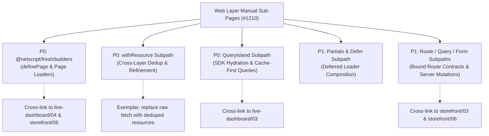

# Competitive Tutorial Benchmark & Gap Analysis (NetScript #1210 Phase 3 — S2)

## Executive Summary
This benchmark analyzes NetScript's tutorial corpus against canonical getting-started and tutorial flows from major web frameworks: **Next.js**, **Nuxt**, **SvelteKit**, and **Laravel / Ruby on Rails** (batteries-included framework class). The goal is to evaluate how competitor tutorial structures educate developers, identify where NetScript undersells its web layer and backend capabilities, pinpoint NetScript's unique differentiators with no direct peer equivalent, and map actionable recommendations to the #1210 per-API web-layer documentation sub-pages.

---

## 1. Per-Competitor Canonical Tutorial Analysis

### 1.1 Next.js (App Router Tutorial & Getting Started)
* **Official Docs URLs**: [Next.js Learn (Dashboard App)](https://nextjs.org/learn/dashboard-app), [Next.js Getting Started Installation](https://nextjs.org/docs/getting-started/installation)
* **Structure & Steps**:
  Next.js structures its flagship canonical tutorial ("Learn Next.js") into a 16-chapter guided course building the "Acme Dashboard" full-stack web application:
  1. *Getting Started*: Project setup (`create-next-app`) and directory structure exploration (`app/`).
  2. *CSS Styling*: Global styles and Tailwind CSS integration.
  3. *Optimizing Fonts & Images*: `next/font` and `<Image>` component performance defaults.
  4. *Layouts and Pages*: File-system routing, nested layouts (`layout.tsx`), and root page components (`page.tsx`).
  5. *Navigating Between Pages*: Client-side navigation with `<Link>` and automatic route prefetching.
  6. *Setting Up Your Database*: Provisioning a Vercel Postgres/Neon database and running seed scripts.
  7. *Fetching Data*: Server Components (RSC) pattern for direct database querying on the server without API routes.
  8. *Static & Dynamic Rendering*: Explaining build-time static generation vs request-time dynamic rendering.
  9. *Streaming*: Improving TTFB using Suspense boundaries and UI loading skeletons (`loading.tsx`).
  10. *Search and Pagination*: Managing search state and pagination via URL search parameters (`useSearchParams`, `usePathname`, `useRouter`).
  11. *Mutating Data*: Server Actions for data mutations, form submissions, and cache revalidation (`revalidatePath`).
  12. *Handling Errors*: Handling unexpected errors (`error.tsx`) and 404s (`not-found.tsx`).
  13. *Improving Accessibility*: Server-side form validation (`useActionState`, Zod) and ARIA standards.
  14. *Adding Authentication*: NextAuth.js (Auth.js) integration for middleware-protected routes and login logic.
  15. *Adding Metadata*: Dynamic metadata generation for SEO and OpenGraph tags.
  16. *Next Steps*: Deployment on Vercel and production checklist.
* **First-Win Moment**: Chapter 1/4 — Running `npm run dev` immediately presents a stylized dashboard template with instant hot module reloading (HMR) and layout rendering.
* **How Early Differentiators Are Shown**: Next.js introduces file-system nested layouts in Chapter 4 and React Server Components (RSC) zero-bundle server fetching in Chapter 7. Server Actions are presented in Chapter 11 as the native alternative to traditional API routes.
* **Cross-Linking Reference Docs**: Every chapter embeds explicit links to API reference documentation (e.g., `<Image>` props, `revalidatePath` API, `next/font` configuration), allowing developers to drill down into exact technical specifications.

### 1.2 Nuxt (Nuxt 3/4 Getting Started)
* **Official Docs URLs**: [Nuxt Getting Started Introduction](https://nuxt.com/docs/getting-started/introduction), [Nuxt Installation Guide](https://nuxt.com/docs/4.x/getting-started/installation)
* **Structure & Steps**:
  Nuxt organizes its tutorial experience as a topic-oriented "Getting Started" track:
  1. *Installation*: `npx nuxi@latest init <project-name>` scaffold, dependency installation, and `npm run dev`.
  2. *Configuration*: Project-wide configuration via `nuxt.config.ts`, environment variables with `runtimeConfig`, and public app state with `app.config.ts`.
  3. *Views*: Directory conventions — `app/pages/` for file routing, `app/layouts/` for structural wrappers, and auto-imported components from `components/`.
  4. *Routing*: Page navigation using `<NuxtLink>`, dynamic parameter matching (`[id].vue`), and route middleware for navigation guards.
  5. *Data Fetching*: Unified SSR-to-client data fetching using composables: `useFetch`, `useAsyncData`, and `$fetch`.
  6. *State Management*: SSR-friendly reactive state sharing across components using `useState()`.
  7. *Assets & Deployment*: Handling static assets in `public/` or `assets/` and building server outputs (`nuxi build`) for serverless or Node environments.
* **First-Win Moment**: Step 1 (*Installation*) — Executing `npx nuxi@latest init` and `npm run dev` displays the interactive Nuxt Welcome page in the browser within seconds.
* **How Early Differentiators Are Shown**: Auto-imports (zero boilerplate for components, composables, and utility functions) are highlighted on the welcome screen and in Chapter 3 (*Views*). Hybrid rendering modes (`ssr: true`, `swr`, `prerender`) are introduced in the *Configuration* step (`nuxt.config.ts`).
* **Cross-Linking Reference Docs**: Deep contextual callouts cross-link directly to composable reference APIs (e.g., `useFetch()` API reference, `nuxi` CLI commands, and `defineNuxtConfig` reference).

### 1.3 SvelteKit (Interactive Tutorial & Docs)
* **Official Docs URLs**: [SvelteKit Documentation Introduction](https://svelte.dev/docs/kit/introduction), [SvelteKit Routing Guide](https://svelte.dev/docs/kit/routing), [SvelteKit Loading Data](https://svelte.dev/docs/kit/load), [SvelteKit Form Actions](https://svelte.dev/docs/kit/form-actions), [Svelte Interactive Tutorial](https://learn.svelte.dev)
* **Structure & Steps**:
  SvelteKit divides its canonical tutorial into an interactive in-browser engine ([learn.svelte.dev](https://learn.svelte.dev)) coupled with topic docs (`/docs/kit`):
  1. *Project Structure*: `src/routes/` file-system routing conventions (`+page.svelte`, `+layout.svelte`, `+server.js`).
  2. *Routing*: Page routes, layout hierarchies, parameters (`[slug]`), and route groups.
  3. *Loading Data*: Page and layout data loading using server-only `load` functions (`+page.server.js` / `+page.js`).
  4. *Form Actions*: Server-side form handling (`export const actions`), form submission handling, and progressive enhancement (`use:enhance`).
  5. *Page Options & Adapters*: Configuring SSR/prerendering options and deploying with SvelteKit adapters (`@sveltejs/adapter-auto`, `@sveltejs/adapter-node`).
* **First-Win Moment**: The interactive playground at `learn.svelte.dev` allows developers to edit SvelteKit code in-browser with real-time preview instantly. In CLI setups (`npx sv create`), `npm run dev` yields an active route rendered by `+page.svelte`.
* **How Early Differentiators Are Shown**: SvelteKit presents its signature server loading paradigm (`+page.server.js` `load()`) and progressive enhancement form handling (`+page.server.js` `actions`) in the initial chapters, establishing server-driven UI before introducing client state management.
* **Cross-Linking Reference Docs**: Auto-generated `$types` (e.g., `PageServerData`, `ActionData`) are linked directly from tutorial code snippets to their technical definitions in the reference manual.

### 1.4 Laravel Bootcamp / Rails Guides (Batteries-Included Class)
* **Official Docs URLs**: [Laravel Bootcamp](https://bootcamp.laravel.com), [Laravel Getting Started Docs](https://laravel.com/docs/getting-started), [Ruby on Rails Getting Started Guide](https://guides.rubyonrails.org/getting_started.html)
* **Structure & Steps**:
  *Laravel Bootcamp (Chirper App Track)*:
  1. *Installation*: Environment setup via Laravel Installer / Composer and local server boot.
  2. *Creating Chirps*: Setting up HTTP routes, Artisan resource controllers, Eloquent ORM models, and database migrations.
  3. *Validation & Saving*: Form validation rules, storing records in Postgres/MySQL, and flash messaging.
  4. *Displaying & Editing Chirps*: Listing models in views (Blade or Inertia/Vue/React), update routes, and model binding.
  5. *Notifications & Email*: Event listeners, mailables, and queuing background jobs.
  6. *Authorization*: Securing update/delete actions using Laravel Authorization Policies (`ChirpPolicy`).
  *Rails Guides (Building a Blog)*:
  1. *Installation & Project Creation*: `rails new blog` scaffold and database configuration (`config/database.yml`).
  2. *Hello Rails*: Routing incoming HTTP requests (`config/routes.rb`), creating controllers (`ArticlesController`), and rendering views.
  3. *MVC & CRUD*: Database migrations, ActiveRecord models, CRUD controller actions, and RESTful routing.
  4. *Validations & Partials*: Model validations, refactoring view templates into reusable partials (`_form.html.erb`).
  5. *Nested Resources & Auth*: Adding nested comment resources and authenticating users (`has_secure_password`).
  6. *Deployment*: Production deployment orchestration using Kamal.
* **First-Win Moment**: `laravel new` or `rails new` followed by `php artisan serve` / `rails server` displays a fully operational framework welcome dashboard with pre-configured database connections in under 3 minutes.
* **How Early Differentiators Are Shown**: Artisanal CLI code generation (`php artisan make:controller ChirpController -r -m`), built-in database migrations, Eloquent/ActiveRecord ORM relationships, and starter authentication kits (Breeze / Devise) are demonstrated immediately in the first 2-3 chapters.
* **Cross-Linking Reference Docs**: Comprehensive callouts deep-link into detailed domain guides (e.g., Eloquent ORM relationships, Blade component syntax, Action Mailer, and Database Migrations guide).

---

## 2. Gap Analysis A — NetScript Tutorial Undersell Analysis

Comparing NetScript's tutorial corpus ([`docs/site/quickstart.vto`](file:///home/codex/repos/ns-docs-orch/docs/site/quickstart.vto), [`docs/site/tutorials/index.md`](file:///home/codex/repos/ns-docs-orch/docs/site/tutorials/index.md), and all 5 tracks in `docs/site/tutorials/*`) against competitor benchmarks reveals several key framework capabilities where NetScript's documentation currently **undersells** features that peers celebrate loudly.

### 2.1 NetScript Web Layer Data Loading & Composition (`definePage`, `QueryIsland`, `withResource`)
* **Peer Contrast**: Next.js (Ch 7 RSC Data Fetching), SvelteKit (`+page.server.js` `load()`), and Nuxt (`useFetch`) showcase server-side data fetching and page loading in the very first or second chapter of their canonical tracks.
* **NetScript Current State**: NetScript's Fresh web layer page builder (`definePage`), `withResource` cross-layer deduplication, and cache-first `QueryIsland` patterns are deferred until Track 4 ([`docs/site/tutorials/live-dashboard/04-definePage-QueryIsland.md`](file:///home/codex/repos/ns-docs-orch/docs/site/tutorials/live-dashboard/04-definePage-QueryIsland.md)) or buried behind client-side fetch calls in Track 1 ([`docs/site/tutorials/storefront/06-storefront-ui.md`](file:///home/codex/repos/ns-docs-orch/docs/site/tutorials/storefront/06-storefront-ui.md)). A developer reading the Quickstart or Storefront track sees raw service RPCs, but is not taught NetScript's idiomatic server-side page loader ergonomics early.
* **Belongs In**:
  - [`docs/site/quickstart.vto`](file:///home/codex/repos/ns-docs-orch/docs/site/quickstart.vto#L146-L170): Add a concrete `definePage` loader example alongside `defineService`.
  - [`docs/site/tutorials/storefront/06-storefront-ui.md`](file:///home/codex/repos/ns-docs-orch/docs/site/tutorials/storefront/06-storefront-ui.md#L1-L60): Upgrade Chapter 6 to explicitly teach `definePage` loader composition and `withResource` dedup instead of raw client fetches.
  - [`docs/site/tutorials/live-dashboard/04-definePage-QueryIsland.md`](file:///home/codex/repos/ns-docs-orch/docs/site/tutorials/live-dashboard/04-definePage-QueryIsland.md): Front-load the `definePage` page builder mental model as the standard web entry point.

### 2.2 Ingress, Form Submissions & Server Mutations
* **Peer Contrast**: Next.js (Server Actions in Ch 11), SvelteKit (Form Actions with `use:enhance`), and Laravel/Rails (Form Requests & RESTful mutations) emphasize seamless server-side form handling and progressive enhancement without boilerplate API endpoints.
* **NetScript Current State**: NetScript possesses type-safe RPC procedures and `@netscript/fresh/builders` form/route subpaths. However, in [`docs/site/tutorials/storefront/06-storefront-ui.md`](file:///home/codex/repos/ns-docs-orch/docs/site/tutorials/storefront/06-storefront-ui.md), cart updates and mutations are demonstrated as manual client-side JavaScript calls inside islands, obscures NetScript's built-in form builder subpath and server-side mutation story.
* **Belongs In**:
  - [`docs/site/tutorials/storefront/03-cart-contracts.md`](file:///home/codex/repos/ns-docs-orch/docs/site/tutorials/storefront/03-cart-contracts.md): Introduce typed form contracts alongside standard procedure definitions.
  - [`docs/site/tutorials/storefront/06-storefront-ui.md`](file:///home/codex/repos/ns-docs-orch/docs/site/tutorials/storefront/06-storefront-ui.md): Teach progressive form submission using NetScript's bound route/form builder subpaths.

### 2.3 End-to-End Type Safety & Derived SDK Experience
* **Peer Contrast**: SvelteKit highlights auto-generated `$types` at step 1 of route creation, and Nuxt highlights automatic type inference for `useFetch`.
* **NetScript Current State**: NetScript features contract-derived end-to-end typing (from shared oRPC contracts to backend services and `@netscript/sdk` client hooks). However, [`docs/site/tutorials/storefront/02-catalog-service.md`](file:///home/codex/repos/ns-docs-orch/docs/site/tutorials/storefront/02-catalog-service.md) and [`03-cart-contracts.md`](file:///home/codex/repos/ns-docs-orch/docs/site/tutorials/storefront/03-cart-contracts.md) focus on contract creation and server implementation without immediately showing the instant client-side SDK autocomplete DX. The SDK client experience is delayed until Track 4 ([`docs/site/tutorials/live-dashboard/03-sdk-cache-first-query.md`](file:///home/codex/repos/ns-docs-orch/docs/site/tutorials/live-dashboard/03-sdk-cache-first-query.md)).
* **Belongs In**:
  - [`docs/site/tutorials/storefront/03-cart-contracts.md`](file:///home/codex/repos/ns-docs-orch/docs/site/tutorials/storefront/03-cart-contracts.md#L45-L65): Show instant typed client SDK consumption immediately following contract definition.
  - [`docs/site/tutorials/live-dashboard/02-contract-to-service.md`](file:///home/codex/repos/ns-docs-orch/docs/site/tutorials/live-dashboard/02-contract-to-service.md): Highlight contract-to-service type propagation as a core workflow step.

### 2.4 Authorization & Middleware Seam (`.withAuthz()`)
* **Peer Contrast**: Laravel Bootcamp and Rails Guides introduce user authentication and authorization policies in early chapters as essential framework capabilities.
* **NetScript Current State**: NetScript's pluggable authentication and fluent `.withAuthz()` route middleware seam are sequestered in Track 2 ([`docs/site/tutorials/workspace/02-auth.md`](file:///home/codex/repos/ns-docs-orch/docs/site/tutorials/workspace/02-auth.md) and [`05-route-authz.md`](file:///home/codex/repos/ns-docs-orch/docs/site/tutorials/workspace/05-route-authz.md)). Developers working through the Storefront or Live Dashboard tracks never encounter NetScript's `.withAuthz()` seam.
* **Belongs In**:
  - [`docs/site/tutorials/storefront/04-checkout-saga.md`](file:///home/codex/repos/ns-docs-orch/docs/site/tutorials/storefront/04-checkout-saga.md): Add a cross-link and brief note on securing checkout routes via `.withAuthz()`.
  - [`docs/site/tutorials/workspace/05-route-authz.md`](file:///home/codex/repos/ns-docs-orch/docs/site/tutorials/workspace/05-route-authz.md): Emphasize `.withAuthz()` as NetScript's universal security seam across HTTP, RPC, and page routes.

---

## 3. Gap Analysis B — NetScript Unique Differentiators (No Peer Equivalent)

NetScript possesses several architectural capabilities that have **no direct equivalent** in competitor frameworks. This analysis contrasts each differentiator with what peers offer instead and defines how loudly NetScript's documentation should celebrate it.

| NetScript Differentiator | What Competitors Offer Instead | Documentation Treatment & Recommendation |
| :--- | :--- | :--- |
| **1. Contract-Derived End-to-End Typing (OpenAPI + Client SDK + Service Handlers)** | **Next.js / Nuxt**: Require manual wiring of third-party libraries (tRPC, Orval, OpenAPI specs, Zod).  **SvelteKit**: Offers page-bound `$types`, but lacks multi-service RPC contract derivation and OpenAPI schema generation. | **Loudest Treatment**: Highlight in [`quickstart.vto`](file:///home/codex/repos/ns-docs-orch/docs/site/quickstart.vto) step 3 and [`docs/site/tutorials/storefront/02-catalog-service.md`](file:///home/codex/repos/ns-docs-orch/docs/site/tutorials/storefront/02-catalog-service.md). Emphasize that defining an oRPC contract automatically yields typed backend handlers, client SDK hooks, and OpenAPI endpoints simultaneously. |
| **2. Durable Saga & Worker Runtimes in the Same Workspace (`@netscript/sagas`, `@netscript/workers`)** | **Next.js / Nuxt / SvelteKit**: Zero built-in durable execution engine. Developers must integrate external cloud platforms (Temporal, Inngest, Trigger.dev, BullMQ).  **Laravel / Rails**: Provide basic background queues (Sidekiq, Laravel Queues), but lack stateful sagas with step replay and automated compensation. | **Headline Differentiator**: Feature prominently in [`docs/site/tutorials/storefront/04-checkout-saga.md`](file:///home/codex/repos/ns-docs-orch/docs/site/tutorials/storefront/04-checkout-saga.md) and [`docs/site/tutorials/erp-sync/02-import-job.md`](file:///home/codex/repos/ns-docs-orch/docs/site/tutorials/erp-sync/02-import-job.md). Emphasize that multi-step workflows (e.g., payment → inventory → shipping) execute durably within the same Deno workspace without third-party SaaS dependencies. |
| **3. Aspire Observed Resource Graph (AppHost + Postgres + Redis + Tracing)** | **Next.js**: Relies on Vercel cloud dashboard or manual `docker-compose.yml`.  **Nuxt / SvelteKit**: Leave infrastructure orchestration entirely to the user.  **Laravel / Rails**: Offer CLI tools (Sail / Foreman), but lack unified OpenTelemetry distributed tracing and metrics dashboards out-of-the-box. | **First-Class Operational Feature**: Emphasize in [`quickstart.vto`](file:///home/codex/repos/ns-docs-orch/docs/site/quickstart.vto) step 3 and every track's deploy chapter ([`storefront/07-deploy.md`](file:///home/codex/repos/ns-docs-orch/docs/site/tutorials/storefront/07-deploy.md), [`live-dashboard/06-deploy.md`](file:///home/codex/repos/ns-docs-orch/docs/site/tutorials/live-dashboard/06-deploy.md)). Frame `aspire start` as a zero-config local environment that boots databases, caches, and telemetry automatically. |
| **4. `withResource` Cross-Layer Deduplication & Type Refinement (`@netscript/fresh/builders`)** | **Next.js**: React `cache()` memoization or fetch cache tags.  **Nuxt**: `useNuxtData` keys.  **SvelteKit**: Passing data down layout trees via `await parent()`.  *None provide a unified resource builder pattern for cross-layer dedup + type refinement.* | **Primary Web Layer Idiom**: Feature in the upcoming #1210 Web Layer manual sub-pages and cross-link from [`docs/site/tutorials/live-dashboard/04-definePage-QueryIsland.md`](file:///home/codex/repos/ns-docs-orch/docs/site/tutorials/live-dashboard/04-definePage-QueryIsland.md). Demonstrate how `withResource` eliminates duplicate database/RPC fetches across nested layouts, partials, and islands. |
| **5. Built-in Partials + Deferred-Loader Composition (`@netscript/fresh`)** | **Next.js**: React `<Suspense>` boundaries with streaming RSC.  **Nuxt**: `<NuxtClientFallback>` / `lazy` options.  **SvelteKit**: Un-awaited promises in `load` functions (`streamed: Promise`). | **Core Performance Pattern**: Showcase in #1210 per-API sub-pages and [`docs/site/tutorials/live-dashboard/04-definePage-QueryIsland.md`](file:///home/codex/repos/ns-docs-orch/docs/site/tutorials/live-dashboard/04-definePage-QueryIsland.md). Teach how HTML partial replacement combined with deferred page loaders delivers fast TTFB without client-side bundle bloat. |

---

## 4. Prioritized Recommendations Mapped to #1210 Per-API Sub-Pages

To address the findings of this competitive benchmark, the following prioritized recommendations map directly to the per-API sub-pages planned under the **Web Layer Manual** (issue #1210 phase 3):

### Priority 0 (P0) — High-Impact Web Layer Core Sub-Pages
1. **`@netscript/fresh/builders` — Page Builder (`definePage`) Sub-Page**
   * *Target API*: `definePage` entry point and page loader options.
   * *Documentation Task*: Author dedicated sub-page showing how `definePage` replaces bare Fresh 2 handlers with a unified page builder.
   * *Tutorial Cross-Links*: Insert cross-links at first point of contact in [`docs/site/tutorials/live-dashboard/04-definePage-QueryIsland.md`](file:///home/codex/repos/ns-docs-orch/docs/site/tutorials/live-dashboard/04-definePage-QueryIsland.md#L1-L30) and [`docs/site/tutorials/storefront/06-storefront-ui.md`](file:///home/codex/repos/ns-docs-orch/docs/site/tutorials/storefront/06-storefront-ui.md#L1-L40).
2. **`withResource` Subpath — Cross-Layer Deduplication & Refinement Sub-Page**
   * *Target API*: `@netscript/fresh/builders/withResource`.
   * *Documentation Task*: Detail the `withResource` exemplar pattern, demonstrating how data loaded in parent layouts or services is deduplicated and refined for child partials and islands without redundant network requests.
   * *Tutorial Cross-Links*: Add cross-links in [`docs/site/tutorials/live-dashboard/04-definePage-QueryIsland.md`](file:///home/codex/repos/ns-docs-orch/docs/site/tutorials/live-dashboard/04-definePage-QueryIsland.md#L31-L60) and [`docs/site/tutorials/storefront/02-catalog-service.md`](file:///home/codex/repos/ns-docs-orch/docs/site/tutorials/storefront/02-catalog-service.md).
3. **`QueryIsland` Subpath — Client SDK Hydration & Cache-First Queries Sub-Page**
   * *Target API*: `@netscript/fresh/builders/QueryIsland`.
   * *Documentation Task*: Teach how `QueryIsland` seamlessly hydrates server-fetched state into interactive Preact islands using `@netscript/sdk` cache-first queries.
   * *Tutorial Cross-Links*: Cross-link from [`docs/site/tutorials/live-dashboard/03-sdk-cache-first-query.md`](file:///home/codex/repos/ns-docs-orch/docs/site/tutorials/live-dashboard/03-sdk-cache-first-query.md#L1-L40) and [`docs/site/tutorials/chat/03-chat-ui.md`](file:///home/codex/repos/ns-docs-orch/docs/site/tutorials/chat/03-chat-ui.md).

### Priority 1 (P1) — Advanced Web & Form Ergonomics Sub-Pages
4. **Partials & Deferred Composition (`defer`) Sub-Page**
   * *Target API*: `@netscript/fresh/builders/defer`.
   * *Documentation Task*: Document partial HTML replacement alongside deferred server page loaders, providing a clear alternative to heavy client-side JavaScript bundles.
   * *Tutorial Cross-Links*: Cross-link from [`docs/site/tutorials/live-dashboard/04-definePage-QueryIsland.md`](file:///home/codex/repos/ns-docs-orch/docs/site/tutorials/live-dashboard/04-definePage-QueryIsland.md) and [`docs/site/tutorials/live-dashboard/05-live-stream.md`](file:///home/codex/repos/ns-docs-orch/docs/site/tutorials/live-dashboard/05-live-stream.md).
5. **Route / Query / Form Subpaths — Bound Contracts & Progressive Form Submissions Sub-Page**
   * *Target API*: `@netscript/fresh/builders/form`, `@netscript/fresh/builders/route`, and `@netscript/fresh/builders/query`.
   * *Documentation Task*: Document type-safe form binding, server mutation handling, and progressive enhancement.
   * *Tutorial Cross-Links*: Cross-link from [`docs/site/tutorials/storefront/03-cart-contracts.md`](file:///home/codex/repos/ns-docs-orch/docs/site/tutorials/storefront/03-cart-contracts.md) and [`docs/site/tutorials/storefront/06-storefront-ui.md`](file:///home/codex/repos/ns-docs-orch/docs/site/tutorials/storefront/06-storefront-ui.md).

### Priority 2 (P2) — Monorepo Architecture Integration
6. **Cross-Layer Workflow Integration (Contracts → Web → Sagas/Workers)**
   * *Documentation Task*: Provide comprehensive architectural diagrams and narrative guides connecting web layer route handlers and forms directly to durable sagas (`@netscript/sagas`), background workers (`@netscript/workers`), and the Aspire telemetry graph.
   * *Tutorial Cross-Links*: Add cross-links in [`docs/site/quickstart.vto`](file:///home/codex/repos/ns-docs-orch/docs/site/quickstart.vto), [`docs/site/tutorials/storefront/04-checkout-saga.md`](file:///home/codex/repos/ns-docs-orch/docs/site/tutorials/storefront/04-checkout-saga.md), and [`docs/site/tutorials/workspace/05-route-authz.md`](file:///home/codex/repos/ns-docs-orch/docs/site/tutorials/workspace/05-route-authz.md).
