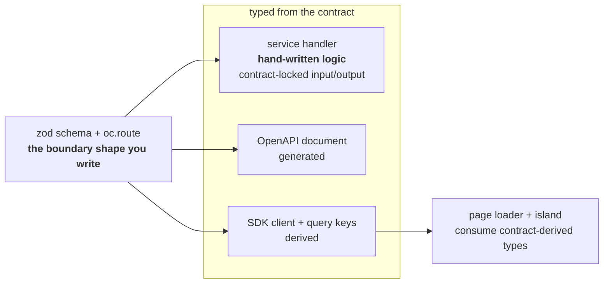

# Adversarial review — main-pages remap

**Branch reviewed:** `docs/main-pages-remap`  
**Commit reviewed:** `2b9d9e6171bb1887aff5e00ae0ddcda6265f6ace`  
**Final verdict:** **FIX_FIRST**

The remap fixes the previous draft's largest positioning error: the homepage now leads with
NetScript as a meta-framework, not with sagas or any other single plugin. The four-page route is
also substantially better: identify the system on the homepage, decide whether it fits on Why,
run it in Quickstart, then learn its layers in Concepts.

It is not ready to approve. The homepage's central proof contains two source-verifiable falsehoods:
it puts hand-written handler logic inside a group labelled “never written by hand,” and its page
tab claims island hydration while only reading a server cache entry. The Concepts opening also
collapses every framework seam into “a typed contract,” which is not true of plugin manifests,
Aspire resource wiring, or telemetry. These are not taste disputes; they misstate the architecture
at the exact points where this remap is supposed to establish it.

## Evidence base

- Compared the four pages with `docs/site/explanation/contracts.md` and
  `docs/site/services-sdk/sdk.md`.
- Read the public implementations for `definePage`, `defineService`, and the SDK query factory in
  `packages/fresh`, `packages/service`, and `packages/sdk`; also inspected the public surface with
  `deno doc`.
- Checked the init flags, prompt bypass, scaffold defaults, generated client, generated AppHost, and
  edit target under `packages/cli/src`.
- Compared both Mermaid sources with the committed SVGs actually embedded by the pages.
- Ran the repository's internal-doc validator: **102 docs, 0 broken links, 0 broken anchors, 0
  orphans**.
- Confirmed that none of the four pages references `architecture-overview.svg`.

## 1. True to NetScript the meta-framework — **FIX_FIRST**

### What works

The homepage now answers all three positioning questions directly:

- **Principle:** define a boundary once and carry it through the stack (`index.vto:7–8`).
- **What NetScript brings:** Fresh, Hono, oRPC, Aspire, contract derivation, a generated resource
  graph, and durable plugin runtimes (`index.vto:8,24–39`).
- **What that enables:** aligned service/caller types, coordinated startup and telemetry, and work
  that can outlive a request (`index.vto:15–39`).

This is unmistakably a meta-framework homepage. Sagas appear only in the general durable-runtime
list; no plugin owns the story.

The named framework APIs are real. `oc.route().input().output()` and `implement(...).handler(...)`
match `explanation/contracts.md:44–61,80–106`; `defineService(router, { name, version })` is exported
by `@netscript/service`; `@netscript/fresh/builders` exports `definePage()`, and `.withRoute()`,
`.withLayer()`, `.withLayout()`, and `.build()` are real builder methods. The SDK exposes
`getCachedEntry()` and `queryOptions()`. I found no invented NetScript method or import subpath in
the tabs.

### Where it fails

The first proof is nevertheless technically false in two ways.

1. `index.vto:27`, the diagram, and its caption say that the handler is one of three surfaces “you
   never write by hand.” The diagram literally places `service handler` inside `derived — never
   written by hand` (`_diagrams/contract-flow.mmd:6–10`). The contract guide says the opposite:
   “the handler is the only place you write logic” (`explanation/contracts.md:101–106`). The
   contract derives and checks the handler's input/output types; it does not derive its business
   logic.
2. The page tab calls only `getCachedEntry()` and returns `undefined` on a cold cache
   (`index.vto:63`). The source implementation reads the cache and does not invoke the client
   (`packages/sdk/src/query/query-factory.ts:124–135`). The canonical SDK example explicitly falls
   back to `queryOptions(...).queryFn()` (`services-sdk/sdk.md:185–190`). The comment's “same query
   key the island hydrates from” is also wrong: the SDK documents distinct server `key()` and
   client `clientKey()` surfaces (`services-sdk/sdk.md:63–66,134–140`), and the tab neither creates
   nor dehydrates TanStack Query state. It passes layer props to an island; that is valid, but it is
   not query hydration.

These defects block approval because the homepage code moment is the evidence for the product
claim, not an incidental example.

## 2. Enterprise-grade entry point — **FIX_FIRST**

The audience coverage is mostly present:

- An experienced developer gets named foundations, the ownership boundary, a contract flow, and
  explicit trade-offs immediately.
- A stakeholder gets the integration-cost argument, fit/disqualification criteria, and the fact
  that NetScript is pre-1.0 and not a hosted platform.
- A technical enthusiast gets concrete code, a runnable path, diagrams, and links to the deeper
  mechanics.

Why is the strongest page in this respect. Its first screen identifies the target team and names
the freedom/coordination trade without hiding the disqualifying cases. Quickstart also opens with a
clear intended payoff and states its Deno, Aspire, and Docker prerequisites before commands.

The register is not yet consistently at the level of `explanation/contracts.md`. That inner page
defines each term, distinguishes shape from runtime, and states exactly which artifacts are
derived. In contrast:

- the homepage substitutes aphorisms and absolutes (“What you did not write cannot drift,” “across
  five tools”) for the narrower claim its sources prove;
- Concepts says every seam is a typed contract and tells readers they “should never need this page
  again” (`concepts.vto:16–21`); and
- Quickstart promises “Ten minutes” without a measured gate and says “any request” has a trace
  (`quickstart.vto:7,62–64`).

The first-screen information architecture is sound. Accuracy and register, especially in Concepts,
still prevent this from being an enterprise-grade entry point.

## 3. Storyline and cross-linking — **FIX_FIRST**

### Links: pass

There are no mechanical dead ends. The pages link both to one another and into contracts, services
and discovery, the web layer, plugins, durable workflows, orchestration, observability, database
migrations, tutorials, and reference. The repository validator found no broken destination or
anchor. Each page also gives a next action: homepage choice strip, Why → Quickstart, Quickstart's
next-step list, and Concepts' focused deep links.

### Story: one major contradiction remains

The intended arc is good:

1. Homepage — see the meta-framework and its proof.
2. Why — decide whether the integration tax and constraints match the system.
3. Quickstart — run one concrete instance.
4. Concepts — map that instance to the five layers and leave for deeper docs.

But the definition of the meta-framework changes between pages. The homepage presents contracts,
resource orchestration, observability, and durable runtimes as coordinated seams. Why then says
there are exactly two expensive architecture decisions, that logging can be added later, and that
the meta-framework “earns its keep exactly here” (`why.vto:35–47`). Concepts narrows further and
says the seam is *always* a typed contract (`concepts.vto:16–21`). Resource discovery, an Aspire
resource reference, a plugin manifest, and OTLP configuration are typed/configured boundaries, but
they are not all an oRPC contract. The prose needs one definition across all four pages.

## 4. Diagrams — **FIX_FIRST**

### Giant overview: pass

The old architecture-overview diagram is gone from all four pages. This requirement is satisfied.

### Contract flow: meaningful placement, inaccurate content

The flow belongs exactly where it is: immediately before the three contract/service/page tabs. It
is explanatory rather than decorative. Its current grouping is false, however: the hand-written
handler is inside “derived — never written by hand.” The direct dashed handler → page arrow also
suggests that the page's types derive from the handler; the shared contract and derived SDK are the
type path. The same errors exist in the committed SVG, so this is not merely stale Mermaid source.

### Aspire resource graph: meaningful placement, mismatched narration

Putting a resource graph at the start of the observability section is useful. The diagram itself is
a coherent *plugin topology*: an orders API, worker, and saga runner share Postgres and Redis while
Aspire starts them and the dashboard observes them (`_diagrams/aspire-resource-graph.mmd:7–40`).

The surrounding text describes a different picture. The alt text says the diagram contains a Fresh
app and shows discovery and OTLP injection into each process (`concepts.vto:71`); the diagram has no
Fresh app and no discovery/OTLP injection edges. The caption likewise says it shows injection “into
every process.” The underlying AppHost generators do wire apps/services with OTEL and discovery
values, so the prose is a supportable general claim; it is not an accurate description of this
particular visual. Either expand the diagram or narrow its alt/caption and distinguish the pictured
plugin slice from the general resource graph.

## 5. Quickstart — **PASS WITH TARGETED FIXES**

This is no longer disastrous. It has a promise, an observable payoff, a deliberate first edit, and
a clean handoff to a tutorial where contract propagation is actually exercised.

The commands and flags are honest:

- `deno install --global --allow-all --name netscript ...` matches the published CLI path used by
  the rest of the docs.
- `netscript init my-app --db postgres --service --yes` uses real options
  (`init-command.ts:71–91`). `--yes` bypasses prompts (`init-interactive.ts:23–27`). Defaults are
  `dashboard`, `users`, cache enabled, and Redis (`scaffold-defaults.ts:4–14`).
- The generated app constructs a service client and query factory from the contract
  (`assets/app/lib/example-service.ts.template:1–27`), so the opening payoff is real.
- The edit target and quoted sentence exist exactly as documented
  (`home-view.tsx.template:17–31`).
- `aspire restore`, `aspire start`, the printed one-time dashboard token, and
  `aspire stop --apphost ./apphost.mts` match the repository's Aspire doctrine and generated
  AppHost location.
- `--no-aspire` is the real opt-out spelling and is disclosed before the reader starts.

The remaining issues are credibility nicks, not command failures: remove the unmeasured ten-minute
promise and do not promise a trace for literally every request.

## 6. AI slop — **FIX_FIRST**

There are no hollow superlatives such as “powerful,” “seamless,” or “enterprise-grade,” and Why's
trade-off language generally sounds authored. The set still contains generated-feeling rhetorical
compression:

- “one” is used as a drumbeat rather than information: one definition, one workspace, one graph,
  one command, one dashboard, one principle five times;
- “What you did not write cannot drift” is punchy but false once it includes handler logic;
- “the seam is always the same thing” converts an analogy into an architecture assertion;
- “you should never need this page again” is rhythm-only bravado;
- “across five tools” invents a count for cadence; and
- “observability is wired in from the first minute, not bolted on later” is stock contrast copy.

The cure is not to flatten the voice. Keep the direct language in Why (“unrelated tools pretending
to be one system”) and Quickstart's honest “one-line edit is deliberately unspectacular”; remove
only the claims whose rhythm outruns their evidence.

## Blocking findings

### B1 — The homepage says hand-written handler logic is derived

**Evidence:** `index.vto:27,42–47`; `_diagrams/contract-flow.mmd:6–10`;
`explanation/contracts.md:80–106`.

**Required prose replacement (`index.vto:27`):**

> A zod schema and an oRPC route define the operation once. A service handler supplies the business
> logic with contract-locked input and output types; OpenAPI and the SDK client are derived from the
> same definition, so the boundary shape is not declared again.

**Required caption replacement (`index.vto:44`):**

> The principle in one picture: declare the boundary once; write the handler against it; derive the
> OpenAPI document and client from it; consume those types in the page.

**Required Mermaid correction:**



Regenerate the committed SVG after changing the Mermaid source.

### B2 — The page tab claims a fetch/hydration path it does not implement

**Evidence:** `index.vto:61–64`; `services-sdk/sdk.md:63–66,134–140,185–195`;
`packages/sdk/src/query/query-factory.ts:124–150`.

Replace the loader body and its comment with a cache-first path that actually reaches the client on
a miss, and describe layer props rather than TanStack hydration:

```tsx
loader: async (ctx) => {
  // Same contract action and input/output types. The server loader
  // reads the cache; the island receives the result as layer props.
  const input = { limit: ctx.search.limit };
  const entry = await api.users.list.getCachedEntry(input);
  if (entry) return { users: entry.data, cachedAt: entry.cachedAt };

  return {
    users: await api.users.list.queryOptions(input).queryFn(),
    cachedAt: Date.now(),
  };
},
```

If the desired claim is genuinely TanStack hydration, the example instead needs to show the query
client prefetch/dehydrate path and the island's matching `queryOptions()` call. Merely mentioning a
“same query key” is not enough. Since the code is labelled as a route module, also finish the route
surface after `.build()`:

```ts
export const { default: page } = usersPage;
export { page as default };
```

## Major findings

### M1 — Concepts falsely equates every seam with a typed contract

**Evidence:** `concepts.vto:16–21`; its own plugin and observability sections at `45–55,69–82`.

Replace the lede with:

> The five layers solve different boundary problems. Contracts define operation inputs and outputs;
> services implement those operations; plugin manifests declare additional runtime resources; the
> web layer carries typed results to users; and Aspire connects the processes, dependencies, and
> telemetry. Read the sections in order for the map, then follow each section into the detailed
> documentation.

This preserves the five-layer spine without pretending that a manifest or an OTLP endpoint is an
oRPC contract.

### M2 — The Aspire diagram's alt text and caption describe nodes and edges that are absent

**Evidence:** `concepts.vto:69–77`; `_diagrams/aspire-resource-graph.mmd:7–40`.

If the diagram remains unchanged, replace its text with:

> **Alt:** An Aspire AppHost starts Postgres, Redis, and an orders plugin's API, worker, and saga
> runner; the dashboard observes each resource, while the three processes share database and cache
> connections.
>
> **Caption:** One plugin can become several observed resources. Aspire starts its API and
> background processors alongside their shared infrastructure.

Then begin the following paragraph with this transition:

> The diagram zooms into one plugin. At workspace scale, the generated AppHost can also compose web
> apps and ordinary services, and it injects the configured discovery and OTLP values into executable
> resources.

### M3 — Why narrows the meta-framework to two decisions and trivializes observability retrofits

**Evidence:** `why.vto:35–47`, compared with `index.vto:24–39` and `concepts.vto:24–82`.

Replace the first paragraph under “What a meta-framework changes” with:

> NetScript does not replace the underlying primitives — Fresh renders, Hono serves, and Postgres
> stores as they would without it. It standardizes boundaries that become expensive after they have
> spread through an application: shared contracts keep handlers and callers aligned, durable
> runtimes make long-running work explicit, and generated resource wiring keeps processes,
> dependencies, and telemetry in one operational model. These constraints cost flexibility; their
> value is that a team does not redesign the same seams independently in every service.

Delete “logging, by contrast, can still be added at any point” and “earns its keep exactly here.”
Adding a logger later is possible; retrofitting consistent context propagation, resource identity,
and traces across processes is not the cheap contrast that sentence implies.

### M4 — First-screen credibility is weakened by unsupported absolutes

Apply these exact replacements:

- `index.vto:15–21`:

  > Frameworks can supply the web layer, service layer, and orchestrator while leaving their
  > boundaries to the application. Those boundaries are where request types diverge, durable work
  > is reduced to local retry loops, and incident evidence is split across tools. NetScript gives an
  > operation one contract definition, then uses it to type the handler and client and to generate
  > the OpenAPI description.

- `quickstart.vto:7–10`:

  > From an empty directory to a running workspace: scaffold a typed example service, a Fresh app
  > that consumes it through a derived client, Postgres, a shared cache, and the Aspire dashboard
  > that observes those resources. This page runs one instance of the model described in Core
  > concepts.

- `quickstart.vto:62–64`:

  > The dashboard is the operational view of the workspace. Open a resource to inspect its logs;
  > after exercising an instrumented path, use the trace view to follow work across processes. See
  > Observability for the telemetry model.

## Minor findings

### m1 — The homepage tab introduction erases authored code

`index.vto:46–47` says tab 1 is “the only shape you write,” which is defensible, but the dash clause
reads as if tabs 2 and 3 are generated. Replace it with:

> The same operation at three authored points in the stack. Tab 1 is the only place its input and
> output shapes are declared; the handler and page remain application code, but their boundary types
> come from that contract.

### m2 — “Five tools” is an invented count

Replace “an archaeology session across five tools” (`index.vto:18`) with “an investigation across
disconnected logs, resource state, and traces.” The latter names the actual evidence split without
manufacturing a stable number.

### m3 — The resource diagram's database edge label conflates two mechanisms

`_diagrams/aspire-resource-graph.mmd:28–30` labels Postgres edges “connection string / service
discovery.” The generated infrastructure wiring supplies database configuration; service URL
discovery is used between executable resources. Label these edges `database connection` unless the
diagram adds the distinct executable-to-executable discovery edges.

## Final verdict

**FIX_FIRST.** The remap has the right product frame, audience route, command path, and link graph.
Approval is blocked by the false handler-derivation claim and the non-hydrating, cache-miss-broken
homepage page tab. Correct those, align Concepts and Why to one technically honest meta-framework
definition, and make the Aspire visual describe what it actually shows. The remaining prose fixes
are narrow and should not require another structural rewrite.

## Re-verdict

**Commit re-reviewed:** `ccad29c3c8ad83fa8f7973abf1ded7a79811f29f`  
**Final re-verdict:** **FIX_FIRST**

| Finding | Status | Verification |
| --- | --- | --- |
| **B1 — handler logic presented as derived** | **FIXED** | `index.vto` now distinguishes hand-written business logic from contract-derived OpenAPI/client surfaces. `_diagrams/contract-flow.mmd` labels the handler “hand-written logic” inside “typed from the contract,” removes the handler → page arrow, and the committed SVG contains the same corrected nodes and edges. |
| **B2 — cache read presented as fetch/hydration** | **FIXED** | The page loader now returns a cache hit or calls `queryOptions(input).queryFn()` on a miss, describes island layer props rather than TanStack hydration, and exports the built Fresh page as the route default. |
| **M1 — every seam called a typed contract** | **FIXED** | The Concepts lede now assigns distinct boundary roles to contracts, services, plugin manifests, the web layer, and Aspire; the “always the same thing” and “never need this page again” claims are gone. |
| **M2 — Aspire diagram narration did not match the visual** | **FIXED** | The alt text and caption now describe the pictured orders API/worker/saga slice, Postgres, Redis, and dashboard. The following paragraph explicitly transitions from that plugin zoom to the workspace-scale claim. |
| **M3 — Why narrows the meta-framework to two decisions** | **NOT-FIXED** | The replacement paragraph correctly names contracts, durable runtimes, and resource/telemetry wiring, and the logging contrast is gone. The very next paragraph still begins, “The rest of NetScript makes **those two decisions** operational” (`why.vto:44`), restoring the count and contradicting the new three-part account. Replace it with: “NetScript makes those boundaries operational. Services serve the contract at request time, plugin runtimes own the work that outlives a request, and Aspire brings up the resources with their telemetry connected.” |
| **M4 — unsupported first-screen absolutes/duration** | **NOT-FIXED** | The homepage lede, Quickstart promise, and trace guidance were corrected. However, the homepage exit strip still says “Run a workspace in **ten minutes**” (`index.vto:79`), preserving the same unmeasured duration elsewhere in the four-page set. Replace it with “Scaffold and run a workspace.” |
| **m1 — tab introduction erases authored code** | **FIXED** | It now says “three authored points” and explicitly states that handler and page remain application code. |
| **m2 — invented five-tool count** | **FIXED** | The count is gone; the prose names disconnected logs, resource state, and traces instead. |
| **m3 — database edge conflates connection and service discovery** | **FIXED** | All three Mermaid edges now say `database connection`, and the regenerated Aspire SVG carries the same labels. |

### Gates and hygiene

- `cd docs/site && deno task build` — **PASS**, exit 0; 596 files generated and all 21 diagram asset references verified.
- `deno task docs:links` — **PASS**, exit 0; 102 docs, 0 broken links, 0 broken anchors, 0 orphans.
- The build caused Deno to add one dependency entry to the root `deno.lock`; that build-only insertion was removed. The reviewed worktree is again clean, and neither lock file has a diff.

### Final re-verdict

**FIX_FIRST.** Seven findings are fully fixed, including both original blockers and both rendered
diagram corrections. M3 and M4 each retain one direct textual residue. The M3 residue is a major
cross-page definition contradiction, so this cannot be approved as-is. Both remaining corrections
are single-line prose changes; no structural or API work remains.

**Final verdict after `b89eeba793a4e463b9209dd80c4a1e07305206a4`: APPROVE — M3 and M4 are now fixed at `why.vto:44–46` and `index.vto:79`; all nine findings are resolved.**
