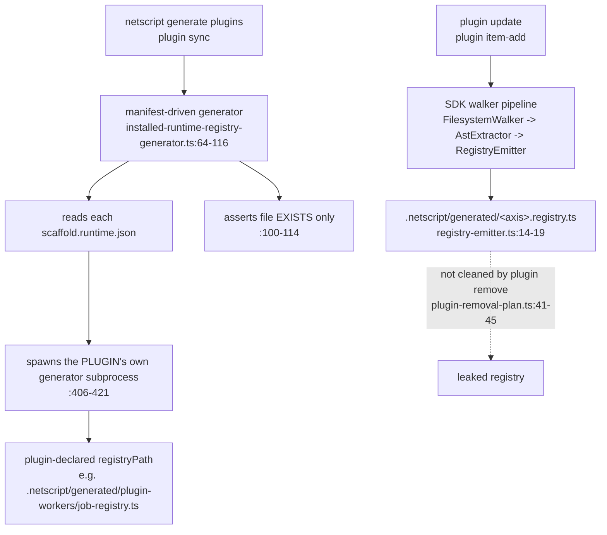

## Current state — what exists, what does not

Everything this RFC proposes is measured against this section. It is the as-is picture at baseline
`main` @ `2256a67bf`, cited to `path:line`, to a stage-B corpus file under
`.llm/runs/plan-devtools-contribution--seed/research/`, or to a drift entry. Where a corpus claim was
later corrected, **the drift entry is authoritative and is cited in its place**.

### 1. There is no plugin→UI channel of any kind

No plugin can contribute a page, a route, an island, a panel, a menu entry, or a Vite plugin to a
NetScript app. This is not "weakly supported" — the mechanism does not exist.

- `capabilities.hasRoutes` on the installer manifest is **service HTTP endpoints**, by its own doc
  comment: *"Whether the plugin scaffolder adds service routes or HTTP endpoints"*
  (`packages/plugin/src/protocol/manifest.ts:20-21`). Its only producer sets it from the plugin
  archetype (`new-plugin-use-case.ts:309`); no consumer maps it to a Fresh route (`r1` F9).
- **No `runtimeRegistries` kind emits UI.** The generated registries are runtime registries — jobs,
  sagas, triggers — declared per plugin in `scaffold.runtime.json`
  (`plugins/workers/scaffold.runtime.json:24-55`; `r1` F10).
- **No plugin can extend the Vite plugin chain.** The chain is static template text in the app's
  `vite.config.ts` (`packages/cli/src/kernel/assets/app/vite.config.ts.template:41-56`); a repo-wide
  grep for `createNetScriptVitePlugin` hits only the package, the template, its tests and docs — no
  plugin (`r1` F6).
- `grep -rn "devtools|_devtools|DevTools"` across `packages`, `plugins`, `docs/site` → **zero
  matches** (`r1` F14). There is no DevTools host, path, mode flag, or feature branch to extend.

**The real mechanism today is three hardcoded Vite aliases.** A plugin's client code reaches the app
because the scaffold template hardcodes them, verbatim:

```ts
// packages/cli/src/kernel/assets/app/vite.config.ts.template:20-32
{ find: '@plugins/workers/streams',  replacement: resolve(workspaceRoot, 'plugins/workers/streams/mod.ts') },
{ find: '@plugins/sagas/streams',    replacement: resolve(workspaceRoot, 'plugins/sagas/streams/mod.ts') },
{ find: '@plugins/triggers/streams', replacement: resolve(workspaceRoot, 'plugins/triggers/streams/mod.ts') },
```

Adding a plugin does not add an alias; the list is template text, and the app author must then write
the import by hand (`r1` F11). The second and only other UI distribution path is **copy, not
import**: the `ui:add` registry writes files into the app under a five-entry alias table
(`@ui/ → components/ui/`, `@islands/ → islands/ui/`, …,
`packages/cli/src/kernel/application/ui/registry.ts:67-73`), and the plugin installer manifest has
**no UI, registry, component, theme, or token field at all** (`r2` F10).

Consequence for this RFC: there is no existing channel to extend, deprecate, or stay
backward-compatible with. Every seam the later sections specify is new construction. See **The
DevTools contribution family** and **The five frontend contribution surfaces**.

### 2. The plugin manifest is two disjoint shapes

NetScript has two manifests that do not reference each other, and the same plugin declares its
service twice — once per model (`plugins/workers/scaffold.plugin.json:49-71` vs
`plugins/workers/src/public/mod.ts:63-68`; `r3` summary).

| | TS runtime manifest | JSON installer manifest |
| --- | --- | --- |
| Type | `PluginManifest` (`packages/plugin/src/config/domain/plugin-manifest.ts:7-34`) | `PluginInstallerManifest` (`packages/plugin/src/protocol/manifest.ts:139-164`) |
| File | built by `definePlugin` in `src/public/mod.ts` | `scaffold.plugin.json` |
| Versioning | **none** — no contract-version field exists | `schemaVersion: z.literal(1)` (`manifest.ts:271`) |
| Validation of payloads | `contributions` reduced to `z.record(z.string(), z.unknown())` (`config/validators/manifest-schema.ts:22`) — payloads **unvalidated at the boundary** | `.strict()` (`manifest.ts:282`) |
| Unknown key behavior | **silently dropped**, no diagnostic (`config/application/contribution-merger.ts:6-26`; `r3` F9) | **hard reject** — parsing fails, plugin does not load |
| Carries UI | no | no (`r2` F10) |

The `.strict()` fact is load-bearing and corrects a merged claim elsewhere. **Drift D-6**: RFC #890's
contract C8 asserts that a manifest pointer block "bumps additively; older CLIs ignore the block".
They do not — Zod `.strict()` hard-rejects any unknown top-level key, so an older CLI fails manifest
parsing outright and takes the whole plugin down rather than degrading
(`drift.md` D-6; `packages/plugin/src/protocol/manifest.ts:271,282`). A third file,
`scaffold.runtime.json`, *looks* versioned — `"schemaVersion": 1`
(`plugins/workers/scaffold.runtime.json:2`) — but `readRuntimeManifest` never reads it
(`installed-runtime-registry-generator.ts:320-359`), so incompatible runtime manifests are silently
accepted (`r3` F5, D5).

### 3. The contribution-axis model, and its provable closedness

Ten names in the axis enum (`packages/plugin/src/domain/constants.ts:16-40`), **twelve keys** on the
actual interface (`packages/plugin/src/config/domain/plugin-contributions.ts:11-40`) — `cli` and
`doctor` have no axis name, and nothing type-level enforces the correspondence (`r3` F2, D2).
`isContributionAxis` (`config/validators/contribution-axis-validator.ts:3-5`) is a plain `includes()`
with no non-test caller in `packages/cli`.

The single sharpest piece of evidence that the axis set is **closed to third parties** is a type:

```ts
// packages/plugin/src/config/domain/plugin-contributions.ts:13-16
readonly cli?: {
  /** Host doctor checks contributed by this plugin. */
  readonly doctorChecks?: readonly 'auth-backend'[];
};
```

A third-party plugin cannot name a doctor check without editing `@netscript/plugin`. Four further
properties make the closedness structural rather than incidental:

1. **Dead axes.** Of twelve keys, only `services`, `runtimeConfigTopics` (as a presence bit),
   `doctor`, and `cli` are read by the CLI registry normalizer
   (`packages/cli/src/kernel/adapters/config/plugin-registry.ts:461-471`).
   `streamTopics`, `databaseSchemas`, `contractVersions`, `e2e`, `telemetry`, `migrations`, and
   `backgroundProcessors` have **no non-test consumer found** outside `verify-plugin` (`r3` F2 table).
   Even `services` reads only `[0]` — extra services are silently dropped (`plugin-registry.ts:462-468`).
2. **`mergeContributions` silently drops `cli`.** It rebuilds nine array axes plus `aspire`/`doctor`
   and never copies `cli` (`config/application/contribution-merger.ts:4-27`), so `cli.doctorChecks`
   is erased on the host-loader path and survives only on the separate registry path — a real
   divergence between two host paths (`r3` F3).
3. **Uninvoked lifecycle hooks.** `setup` / `beforeGenerate` / `afterGenerate` / `teardown` are typed
   (`config/domain/plugin-lifecycle-hooks.ts:8-10`), enumerated (`domain/constants.ts:43-51`),
   produced by workers (`plugins/workers/src/public/mod.ts:108-122`), and **invoked by nothing** —
   the one non-test hit is the builder storing them (`config/builders/plugin-builder.ts:326`;
   `r3` F4).
4. **Silent duplicate-identity collapse.** `PluginRegistry.register` throws `DuplicatePluginError`
   (`packages/plugin/src/application/plugin-registry.ts:9-14`) but is **not on the load path**.
   `loadRegisteredPlugins` builds a `Record` keyed by `resolvePluginLocalName` — last path segment
   with a leading `plugin-` stripped — so `@a/plugin-ai` and `@b/plugin-ai` collide and one
   **silently overwrites** the other (`kernel/adapters/config/plugin-registry.ts:67-72,150-159`;
   `r3` F9). Duplicate `aspire`/`doctor` contributions are last-writer-wins with no diagnostic
   (`contribution-merger.ts:24-25`). The only fail-first duplicate guard in the whole surface is on
   runtime-config topics (`generate-runtime-schemas.ts:163-170`).

Ordering, not collision, is therefore the open problem for any new family — see
**The DevTools contribution family**.

### 4. What a contributor must edit today to add a kind

The motivation in concrete form. For a *first-party* new plugin kind with a new contribution axis,
the minimum edit set is six framework files, in two packages the contributor does not own
(`r4` F11, `installed-runtime-registry-generator` path excepted):

| # | File | Why |
| - | ---- | --- |
| 1 | `packages/cli/src/kernel/adapters/plugin/kinds/<kind>.kind.ts` (new) | the `PluginKindProvider` itself (`kernel/domain/plugin-kind.ts:52-138`) |
| 2 | `packages/cli/src/kernel/adapters/plugin/kinds/plugin-kind-providers.ts` | barrel export |
| 3 | `packages/cli/src/kernel/application/registries/plugin-kind-registry.ts` | compiled-in default map — today literally `['api', apiKindProvider]` (`:12-17`) |
| 4 | `packages/cli/src/public/features/plugins/install/plugin-package-resolver.ts` | bare alias, else `plugin install <kind>` resolves nothing and hard-fails (`install-plugin.ts:145-153`) |
| 5 | `packages/plugin/src/sdk/discovery/ast-extractor.ts` | the axis table, if a new contribution axis |
| 6 | `packages/cli/src/public/features/plugins/list/list-plugins-command.ts` | a second, independent plugin→axis map (`:24-28`) |

Two of those six are duplicated maps of the same fact (5 and 6). Only the manifest-driven runtime
path needs no CLI edit, because the plugin declares its own `runtimeRegistries` in
`scaffold.runtime.json` — that is the one existing open seam, and it emits runtime code, never UI.

### 5. Generation: two divergent generators, a regex "AstExtractor", non-transactional writes



- **Two generators, two output paths.** `generate plugins` / `plugin sync` use the manifest-driven
  generator; `plugin update` and `plugin item-add` use the walker. One plugin's registry can be
  written by both mechanisms to different paths, and nothing decides which is authoritative
  (`r4` F3, D4; `r4` open question 1).
- **`AstExtractor` is not an AST parse.** It is regex over comment/string-stripped text
  (`packages/plugin/src/sdk/discovery/ast-extractor.ts:36-62`) recognizing exactly three hardcoded
  builders:

  ```ts
  // packages/plugin/src/sdk/discovery/ast-extractor.ts:4-8
  const CONTRIBUTION_BUILDERS = [
    { callee: 'defineJob', axis: 'jobs' },
    { callee: 'defineSaga', axis: 'sagas' },
    { callee: 'defineWebhook', axis: 'triggers' },
  ] as const;
  ```

- **Writes are not transactional.** The plugin's generator does `Deno.mkdir` then `Deno.writeTextFile`
  per target — no temp file, no rename (`plugins/workers/src/cli/runtime-registry-generator.ts:88-95`);
  a crash between targets leaves a partially-updated registry set. The host then verifies only that
  each declared path **exists**; content is never checked
  (`installed-runtime-registry-generator.ts:100-114`). `generate runtime-schemas` writes file-by-file
  in a loop, so a mid-loop failure leaves earlier files written
  (`generate-runtime-schemas.ts:119-131`) (`r3` F8; `r4` F3).
- **Walker output leaks on removal.** `plugin remove` deletes `.netscript/generated/<name>` and
  `plugin-<name>` only, so `.netscript/generated/<axis>.registry.ts` survives removal
  (`remove/plugin-removal-plan.ts:41-47`; `r4` F10).
- **The generator subprocess is spawned with whole-filesystem read and write.** **Drift D-7** corrects
  the stage-B corpus here: the flags are bare `'--allow-read'` and `'--allow-write'` with no `=<path>`
  value, and a valueless Deno permission flag grants the permission globally — not project-root scope
  as `r3` F10 recorded. Mitigating and equally verified: no `--allow-net` and no `--allow-env` appear
  in the same argument list, so Deno's default-deny blocks network exfiltration from that subprocess
  (`drift.md` D-7; `installed-runtime-registry-generator.ts:416-417`). The manifest's own declared
  `scaffolder.requiredPermissions {net, read, write}` (`protocol/manifest.ts:7-14`) are never
  translated into the spawn — they are advisory metadata today.

A related write primitive — `resolveTarget` accepting absolute and escaping-relative copy targets
with no containment assertion (`kernel/application/ui/registry.ts:283`; `r2` D3) — is inert while
only first-party items exist and is analysed in **Trust, security, and the threat model**.

### 6. The `/design` precedent

A dev-facing, in-app, host-owned route tree already ships in every scaffolded project, and it is the
closest structural precedent for a DevTools surface:

- 13 template files under `packages/cli/src/kernel/assets/app/routes/(design)/design/` — `_layout`,
  `index`, `tokens`, `components`, `composition`, plus `(_components)`, `(_islands)`, `(_shared)` —
  all registered in `packages/cli/src/kernel/assets/manifest.ts:4-35` (`r5` F30).
- It renders a `SidebarShell` with its own navigation groups and `ThemeToggle`/`SidebarToggle` islands
  (`(design)/design/_layout.tsx.template:1-50`), and its routes are seeded into the typed router as
  `$route: '/design'`, `'/design/tokens'`, … (`kernel/application/scaffold/writers/app-route-seeds.ts:24-26`).
- **It is not a plugin contribution.** It is scaffold template text the app owns after generation.
- **It has no dev-only gate.** Nothing in the layout or the route seeds checks `MODE`/`NODE_ENV`; the
  only `MODE` read in the scaffold is a log line (`main.ts.template:17`) (`r1` F13). Whether `/design`
  reaches production users today is an **open question** carried from stage B
  (`research.md` § Open questions 3) — it is not a claim this RFC may assert either way.

Routing constraint inherited from the same precedent: a `routes/_devtools/…` directory or a
`routes/(_devtools)/…` group is **invisible** to the route-manifest walker, which treats `_*` and
`(_*)` as helper paths (`packages/fresh/src/application/route/manifest.ts:53-55,74-86`). A visible
tree must take the `(design)/design` shape. See **The DevTools host**.

### 7. The data plane that already exists — consume, do not rebuild

These are shipped, typed assets. Rebuilding any of them would repeat the exact trap the charter
forbids, and one generated file already fell into it.

| Asset | Surface | Evidence |
| --- | --- | --- |
| `TelemetryQueryPort` | 7 methods — `queryTraces`, `getTrace`, `querySpans`, `queryLogs`, `queryMetrics`, `queryResources`, `exportTraces`; published as `@netscript/telemetry/query`, factory `createTelemetryQuery` | `packages/telemetry/src/ports/telemetry-query-port.ts:15-79`; `packages/telemetry/query.ts:53` (`r5` F10) |
| 22 typed MCP tools | `TOOL_NAMES` with **input *and* output** JSON schemas keyed exhaustively by `ToolName`, a `ToolKind = 'read' \| 'mutate' \| 'meta'` safety classification, and a discriminated `ToolSuccess \| ToolFailure` with stable `error.code` | `packages/mcp/src/domain/tool-types.ts:3-26,32,34-58`; `tool-contracts.ts:353,361` (`r5` F17-F18) |
| `@netscript/mcp/openapi-projection` | pure, IO-free: `indexOpenApiOperations`, `resolveCanonicalOperation`, `describeOpenApiOperation`, `projectOperationSchemaViews`, `SCHEMA_VIEW_NAMES` — usable by an API explorer **without running MCP** | `packages/mcp/openapi-projection.ts:1-38` (`r5` F21) |
| `netscript.correlation.id` | the single correlation floor; the join key that stitches job → saga → trigger → stream across spans, under 15 declared `netscript.*` domains | `packages/telemetry/src/domain/telemetry-convention.ts:32-56` (`r5` F12-F13) |
| Endpoint resolution | `resolveTelemetryEndpoint` reports its own `source` (`explicit \| netscript_env \| aspire_port \| default`) — exactly the "where is my data coming from" affordance a panel needs | `packages/mcp/src/domain/telemetry-endpoint.ts:22-39` (`r5` F22) |
| Scalar / OpenAPI | fixed mounts `/api/openapi.json`, `/api/docs`, `/api/docs/scalar.js`; Scalar JS vendored inline (3,475,795 bytes), no CDN | `packages/service/src/builder/service-builder-impl.ts:468,477-484`; `primitives/scalar.generated.ts` (`r5` F26, F28) |

Two hard limits on that plane, both cited:

- **MCP is newline-delimited stdio only.** The package exports a single `runNewlineStdio`
  (`packages/mcp/src/infrastructure/stdio-transport.ts:4`); there is no HTTP or SSE transport, so a
  browser client cannot speak to it directly (`r5` F23). Whether it *can* be exposed over HTTP/SSE, or
  whether a DevTools surface must compose the flows in-process, is **open**
  (`research.md` § Open questions 4).
- **The SSE helpers are not exported for this purpose.** `SSE` is one of the fifteen declared
  `netscript.*` telemetry attribute domains (`telemetry-convention.ts:32-49`), but no streaming
  transport for a DevTools client exists on any published subpath. Treated as absent below; see
  **The data plane**.

And the warning already in the repo: the scaffolded `examples/telemetry` page **bypasses**
`@netscript/telemetry/query` and hand-rolls OTLP JSON interfaces plus its own `fetch` against
`${base}/api/telemetry/traces`, re-implementing nano-duration math and `service.name` extraction
(`packages/cli/src/kernel/assets/app/routes/examples/telemetry/(_shared)/telemetry-trace.ts.template:39-141`;
`r5` drift candidate 1). It also disagrees with MCP on scheme — `https://localhost:${ASPIRE_DASHBOARD_PORT ?? 18888}`
vs MCP's four-arm resolver (`r5` drift candidate 2), a silent fetch failure under the default
unsecured local transport. That is user-visible generated code reimplementing a shipped port.

Finally: **no deep-link helper exists anywhere in `packages/`** for Aspire or Scalar, despite both URL
grammars being stable. The only `dashboardUrl` consumers in the repo are e2e-gate files under
`packages/cli/e2e/` (`r5` F7-F9, drift candidate 5), and `ScalarDocsOptions` is `{specUrl, title?,
theme?}` with no per-operation anchor helper (`packages/service/src/primitives/openapi.ts:48-56`). The
hand-off thesis has no implementation seam today.

### 8. Capability matrix

`exists` = shipped and consumed. `partial` = shipped but unreachable, unconsumed, or scoped narrower
than the capability name implies. `absent` = verified negative (grep or read).

| Capability | State | Citation |
| --- | --- | --- |
| Plugin contributes a page / route / island to the app | **absent** | no registry kind emits routes/pages/islands (`plugins/workers/scaffold.runtime.json:24-55`); `r1` F10-F11 |
| Plugin contributes a Vite plugin | **absent** | chain is static template text; repo-wide grep for `createNetScriptVitePlugin` finds no plugin (`vite.config.ts.template:41-56`; `r1` F6) |
| Any DevTools host, path, or mode flag | **absent** | `grep -rn "devtools\|DevTools"` over `packages`/`plugins`/`docs/site` → 0 (`r1` F14) |
| Plugin client code reaches the app | **partial** — three hardcoded aliases + a manual import | `vite.config.ts.template:20-32` |
| UI distribution to an app | **exists**, by **copy** only (`ui:add`, five alias prefixes) | `kernel/application/ui/registry.ts:67-73`; `r2` F4-F5 |
| Plugin contributes a UI/registry item | **absent** — installer manifest has no UI/registry/theme/token field; `--registry-root` **replaces**, never merges | `packages/plugin/src/protocol/manifest.ts:17-140`; `registry.ts:203-214`; `r2` F10 |
| Versioned contribution envelope | **absent in code** — `FrontendManifestEnvelope` is design text only, in an unimplemented RFC | `.llm/runs/plan-frontend-contrib--seed/design/canonical/01-contracts.md:62-110`; `r3` F6 |
| Additive manifest evolution | **absent** — `.strict()` hard-rejects unknown top-level keys | `drift.md` D-6; `protocol/manifest.ts:271,282` |
| Third-party contribution axis | **absent** — `cli.doctorChecks: readonly 'auth-backend'[]`; six framework files to add a kind | `plugin-contributions.ts:13-16`; `r4` F11 |
| Plugin lifecycle hooks | **partial** — declared, typed, produced, invoked by nothing | `r3` F4; `plugin-builder.ts:326` |
| Duplicate-plugin-identity guard | **partial** — exists (`DuplicatePluginError`) but off the load path; silent last-wins | `application/plugin-registry.ts:9-14` vs `kernel/adapters/config/plugin-registry.ts:150-159` |
| Transactional registry writes | **absent** — per-file `writeTextFile`, existence-only verification | `runtime-registry-generator.ts:88-95`; `installed-runtime-registry-generator.ts:100-114` |
| Single authoritative registry generator | **absent** — two generators, two paths, no precedence rule | `r4` F3, D4 |
| AST-based contribution extraction | **absent** — regex over stripped text, three hardcoded builders | `ast-extractor.ts:4-8,36-62` |
| Scoped permissions on the generator subprocess | **absent** — valueless `--allow-read --allow-write` = whole filesystem (no `--allow-net`/`--allow-env`) | `drift.md` D-7; `installed-runtime-registry-generator.ts:416-417` |
| Copy-target containment | **absent** — `resolveTarget` accepts absolute and `../` targets | `kernel/application/ui/registry.ts:283`; `r2` D3 |
| `plugin dev` / watch loop | **absent** — zero watch loops in the CLI; regeneration is always command-triggered | `r4` F6 |
| In-app dev-facing route tree precedent | **exists** (`/design`, 13 templates), **ungated** | `assets/manifest.ts:4-35`; `r1` F13 |
| Dev-only / production gating of a dev surface | **absent** — no `MODE`/`NODE_ENV` check in the `(design)` group | `r1` F13; `r5` open question 5 |
| Typed telemetry read model | **exists** — `TelemetryQueryPort`, published | `telemetry-query-port.ts:15-79` |
| Typed framework-state tool surface | **exists** — 22 MCP tools, input+output schemas, `ToolKind` | `tool-types.ts:3-26,32`; `tool-contracts.ts:353,361` |
| Browser-reachable MCP transport | **absent** — `runNewlineStdio` only | `stdio-transport.ts:4` |
| IO-free OpenAPI schema projection | **exists** — `@netscript/mcp/openapi-projection` | `packages/mcp/openapi-projection.ts:1-38` |
| Cross-domain correlation key | **exists** — `netscript.correlation.id` | `telemetry-convention.ts:54-56` |
| SSE helpers exported for a client | **absent** — `SSE` is a telemetry attribute domain, not a transport export | `telemetry-convention.ts:32-49`; `r5` F23 |
| Aspire / Scalar deep-link helper | **absent** in `packages/`; `dashboardUrl` read only by e2e gates | `r5` F7-F9, drift candidate 5 |
| Generated code consuming the framework's own telemetry port | **absent** — the scaffolded example hand-rolls OTLP instead | `telemetry-trace.ts.template:39-141`; `r5` drift candidate 1 |
