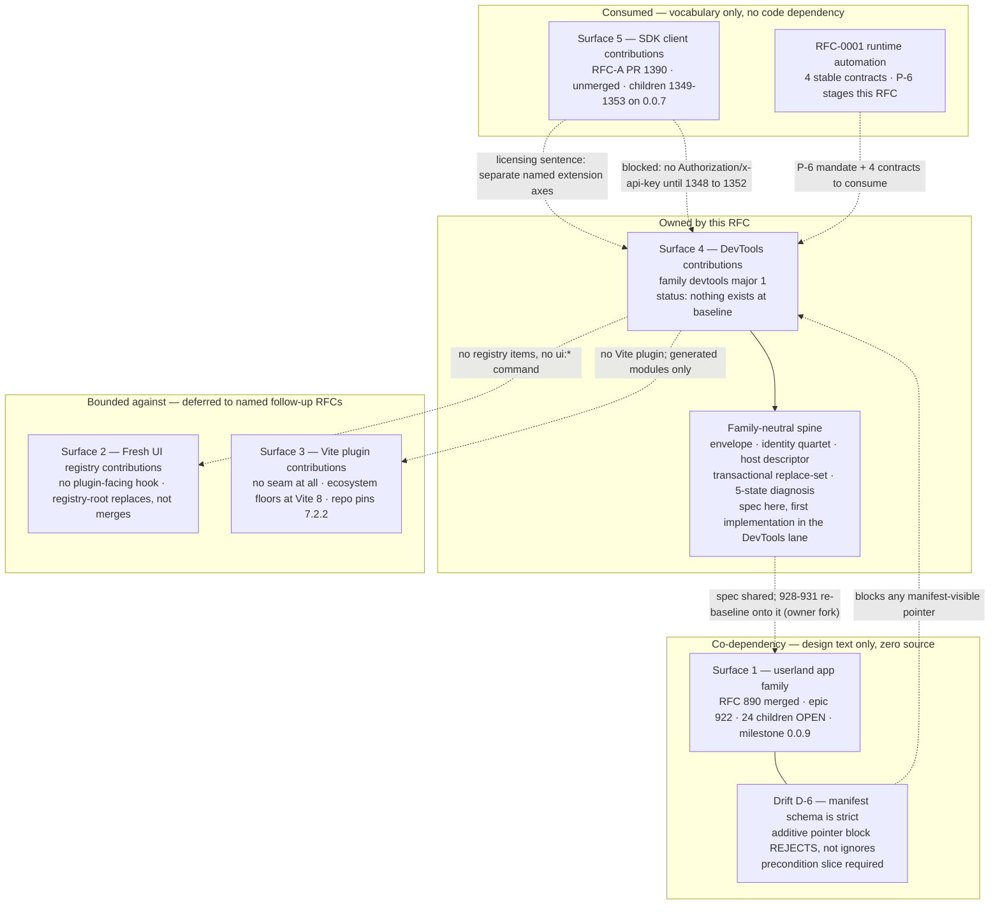

## The five frontend contribution surfaces

### The taxonomy is the owner's, not this RFC's

This RFC does not invent the surface map it is scoped against. RFC-0001 (Runtime-Versioned
Automation, PR #1446 @ `6cb79675c`) enumerates it under owner directive D-9, at `RFC:497-502`:

> "(1) userland UI via the `app` family; (2) Fresh UI registry/component/style-dictionary extensions
> generated into userland (potentially extending the CLI's fresh-ui commands); (3) deferred Vite
> plugin contribution; (4) a first-class **DevTools contribution family/host**; (5) SDK
> contribution, owned by its separate RFC. **This runtime RFC designs none of those general
> mechanisms.** It consumes (1) and stages (4)."

The same five-surface wording appears verbatim in that run's drift log at severity `architectural`
(`/home/codex/repos/ns-rfc-runtime-versioned-automation/.llm/runs/docs-rfc-runtime-versioned-automation--supervisor/drift.md:15`,
2026-08-11) — cited via `research/p2-rfc-1446-runtime-automation.md` F4.

**This RFC ratifies surface (4) and only surface (4).** That assignment is `inference`: RFC-0001
stages (4) behind its P-6 row and hands it to a DevTools RFC (`RFC:638`, `p2` F1), but no document
assigns (2) or (3) to any owner. Surfaces (2) and (3) are therefore *bounded against* here — this
RFC states what it will not do to them and what a future RFC inherits — and the reassignment of
either to this RFC is an owner fork (**Fork S-A**, below).

One clarification the map does not make on its own: RFC-0001's decision sentence — "production
operator management and developer diagnostics are two distinct hosts and two distinct contribution
surfaces — not one ambiguous 'cockpit'" (`RFC:491-493`, `p2` F3) — is **not a sixth surface**. It
splits *hosts* across surfaces (1) and (4): the production admin console is a consumer of the
userland `app` family (RFC-0001 slice A7, `RFC:503-513`), and DevTools is surface (4). The sentence
is a boundary, and this RFC treats it as a binding constraint rather than an open question (stage-C
resolution R3).

### The map

| # | Surface | Current owner | Current state at `main` @ `2256a67bf` | This RFC's disposition |
| - | ------- | ------------- | ------------------------------------- | ---------------------- |
| 1 | Userland frontend code — routes/islands/nav/theme/zones | RFC #890 (merged) → epic #922, children #923–#946, milestone `0.0.9` | **Design-only.** #890's changeset is 32 files: `.github/labels.yml` plus `.llm/runs/plan-frontend-contrib--seed/**` — zero `packages/`, `plugins/`, `apps/`, `docs/` lines (`gh pr view 890 --json files`; `p1` F1). Epic + all 24 children OPEN at `status:plan`; not even the disposable Wave-0 proofs (S1–S5, #923–#927) have run (`p1` F4, F5) | **Co-depend, do not consume.** Adopt its payload-agnostic spine *as a specification* and build the first implementation in the DevTools lane; never assert it as an existing surface. See "The DevTools contribution family" |
| 2 | Fresh UI registry / component / style-dictionary contributions | Unassigned (`p2` F4 inference); mechanically owned by `packages/fresh-ui` + the five `ui:*` CLI commands | **No plugin-facing hook exists.** The registry is a single hardcoded TS manifest (`packages/fresh-ui/registry.manifest.ts`, 74 `name:` keys) inlined into a generated embed; the plugin installer manifest has no UI/registry field; the only extension seam is `--registry-root`, which **replaces** the manifest wholesale rather than merging, with silent last-wins collision at three layers (`r2` summary, F11) | **Bound against + defer** to a named follow-up RFC with entry criteria. This RFC contributes **no** registry items, adds **no** `ui:*` command, and does not widen `RegistryItemKind` |
| 3 | Vite plugin contributions | Unassigned (`p2` F4 inference); mechanically owned by `packages/fresh`'s build pipeline | **No contribution seam of any kind.** `vite.config.ts` is static template text with three hardcoded aliases; no plugin references `createNetScriptVitePlugin` (`r1` F6, F11 — the "real mechanism" fact behind `research.md` F1). The ecosystem's shape (`@vitejs/devtools-kit`, `Plugin.devtools.setup(ctx)`) floors at **Vite 8** while NetScript pins **7.2.2** (`deno.json:248`, `packages/fresh/deno.json:56`; `m1` F28/D2) | **Bound against + defer**, and design v1 so it never becomes a retroactive prerequisite: DevTools contributions enter the build as **generated source modules**, so no third-party code joins the Vite plugin chain (T7 recommendation 1; see "Build and dev integration") |
| 4 | **DevTools contributions** | **This RFC** (staged by RFC-0001 as P-6, `RFC:638`) | **Nothing exists.** `grep -rn "devtools\|DevTools"` across `packages/`, `plugins/`, `docs/site` → **0 matches**; there is no plugin→UI channel of any kind (`research.md` F1) | **Own.** Host, family, kinds, data plane, trust model, build integration, IA, and acceptance are specified in the sections that follow |
| 5 | SDK contributions | RFC-A, PR #1390 / issue #1348 | **Accepted-in-principle, unmerged, unbuilt.** PR #1390 is DRAFT/OPEN, still numbered `0000`; FCP disposition **accept** with objection deadline **2026-08-15 22:00 Europe/Zurich** (open as of 2026-08-11); implementation children #1349–#1353 all OPEN on milestone `0.0.7`; `rg 'SdkClientContribution\|contributions' packages/sdk/src` → 0 matches (`p3` F1, F2, F12) | **Consume the vocabulary, never duplicate the axis.** Align on `protocol {family, major}`, namespaced ids, duplicate rejection, and static module references — the only part available before merge (`p3` F13) |

### Why the seams do not overlap

The non-overlap argument is not "different names for different things" — it is that each surface
produces a **different artifact**, consumed by a **different host**, at a **different phase**. Two
contributions overlap only if all three columns collide.

| # | Contribution artifact | Consuming host | Execution phase | Disjointness proof |
| - | --------------------- | -------------- | --------------- | ------------------ |
| 1 | Route / island / zone / nav / theme payloads under `{ family: 'app', major: 1 }` | The **scaffolded userland Fresh app**, via its `HostSurfaceDescriptor` (`host: 'app'`, zones `app.topbar.end` / `app.dashboard.panels` / `app.home.cards` / `app.footer`) | App request/render | A host only mounts contributions whose `(family, major)` is inside its declared window; anything else quarantines (`p1` C2, C4). The `app` host does not declare `devtools` and vice versa, so the same envelope cannot land in both hosts by accident — the negotiation *is* the proof, and it is testable |
| 2 | **Files copied into the user's source tree** (`copyOwnership: 'app-owned-after-copy'`) | The developer's editor and, after copy, the app's own build — no runtime host at all | `ui:add` / `ui:update`, install-time only | A registry item is not a mounted contribution: after copy it is app-owned source with no identity, no envelope, and nothing to negotiate (`r2` F1, summary). DevTools never copies files into userland in import-mode; if the P-1 island probe forces copy-mode, the materialized files are *host-owned and regenerated*, not `app-owned-after-copy` (T7 §Island registration) |
| 3 | A **Vite plugin object** in the bundler's plugin chain | Vite itself, at config/transform time | Build/config, before any app code exists | DevTools contributions never enter this phase: they are generated modules referenced by literal specifiers from a transactionally generated replace-set, so Vite never learns DevTools exists (T7 recommendation 1). A contribution therefore cannot reconfigure the bundler, break the `preact`/`@preact/signals` dedupe singleton (`r1` F16), or transform app code |
| 4 | DevTools panels/inspectors/actions/diagnostics under `{ family: 'devtools', major: 1 }` | The **DevTools host**, with its own descriptor and closed zone vocabulary | DevTools request/render, development only | Same `(family, major)` negotiation as row 1, plus a host that refuses to serve outside development via two independent mechanisms (see "The DevTools host"). Its IA is additionally constrained by acceptance line 1 — no surface ships that Aspire or Scalar already owns (`b1` F3) |
| 5 | An outbound **request-header preparation descriptor** `{ protocol, id, context, headerKeys, responseCache, prepare }` | `@netscript/sdk`'s HTTP client, per call | Request preparation, per logical call epoch | RFC-A's descriptor has no `fetch`, `link`, `plugins`, `interceptors`, or error-map field, no response hook, and is HTTP-only with a normative MessagePort rejection (`p3` F4, F11, F14 — `rfc:954-968`, `rfc:983-998`). It cannot express a UI contribution, and RFC-A says so itself (next section) |

Two consequences worth stating as rules rather than observations:

- **R-SURFACE-1.** A single plugin may contribute to several surfaces at once; it does so by
  exporting several envelopes, one per family — #890's ratified multi-family export form is a plain
  array (`export default [defineFrontend(appDefinition), defineFrontend(devtoolsDefinition)];`,
  `01-contracts.md:109-114` via `p1` C1). There is no universal envelope and no widened union. The
  widened-union model in `#890`'s own `design/examples/dashboard.md:74-78`
  (`DashboardContribution = FrontendContribution | …`) contradicts #890's ratified decision D3 and
  is recorded drift inside its merged record (`p1` F11, D-4) — **it must not be copied.**
- **R-SURFACE-2.** No surface may be extended by widening another surface's payload union. Adding a
  kind to an existing family is a **new major of that family** (`p1` C2); adding a *surface* is a
  new family with its own host descriptor. This is what keeps the map five entries long instead of
  one god interface (doctrine AP-3, `b2` F5 via `research.md` F13).

### The two hard dependencies

#### D1 — #890's spine is unbuilt: a co-dependency, not reuse

Any sentence of the form "DevTools reuses #890's envelope" is false at this baseline. #890 merged
**documentation only** — 32 files, all under `.llm/runs/plan-frontend-contrib--seed/` plus
`.github/labels.yml`, `additions: 3976`, zero source (`gh pr view 890 --json files`; `p1` F1). Every
named artifact is absent, checkably:

| Designed artifact | Baseline check | Result |
| ----------------- | -------------- | ------ |
| `@netscript/plugin-frontend-core` | `ls packages/` | absent |
| `.withFrontend()` | `rtk grep -rn "withFrontend" packages/ plugins/` | 0 hits |
| `defineFrontend` / `FrontendManifestEnvelope` / `frontend.registry` | `rtk grep -rln … packages/ plugins/ apps/ docs/` | 0 files |
| `frontend` contribution axis | `packages/plugin/src/domain/constants.ts:16-40` | not in `CONTRIBUTION_AXES` |
| `@netscript/fresh/plugins` subpath | `packages/fresh/deno.json` `exports` | absent |
| any plugin-shipped UI | `find plugins -name "*.tsx"` | empty |

(Table from `p1` F1.) Consequences this RFC carries rather than hides:

1. **The spine is a specification, not an import.** What transfers is payload-agnostic by
   construction — envelope, identity quartet, host-surface descriptor, transactional replace-set,
   five-state diagnosis taxonomy (`p1` F14) — and this RFC pins it in a family-neutral home whose
   first implementation is a DevTools slice. The dependency direction, the package home, and the
   re-baselining obligation on #922's spine children (#928–#931) are decided in "The DevTools
   contribution family"; this section only records that the edge is a *co-dependency*.
2. **Wave-0 proving risk is real and unassigned.** #922's own sequencing law is "Wave-0 proofs
   (S1–S5) land before any public contract freezes"; none has run (`p1` F5). Whoever implements the
   staged-check-swap emitter first absorbs that risk.
3. **#890's compatibility claim about manifest evolution is false at baseline, and DevTools must not
   inherit it.** C8 states `PLUGIN_MANIFEST_SCHEMA_VERSION` "bumps additively; older CLIs ignore the
   block". `PluginInstallerManifestSchema` ends in **`.strict()`**
   (`packages/plugin/src/protocol/manifest.ts:282`) and pins `schemaVersion: z.literal(1)` (`:271`),
   so an unknown top-level key does not degrade — it **fails manifest parsing outright**, taking the
   whole plugin down (drift **D-6**; corroborated by `r3` F5). Any manifest-visible DevTools pointer
   therefore requires an explicit **schema-evolution precondition slice** — a `.passthrough()`/
   `catchall` relaxation with its own compatibility test, or a `schemaVersion` bump with a documented
   migration — sequenced *before* the pointer lands. This is also a live defect in #890's ratified
   compatibility story affecting slice #929, escalated to the owner as a cross-RFC finding; this run
   does not edit that epic's board.

#### D2 — RFC-A does not close the host→panel loop, but licenses one

RFC-A's chain terminates at "a statically generated services map plus a caller-supplied context
object": the plugin exports a descriptor and declares an `SdkClientContributionReference`; a
generator or the application author writes a literal `defineServices({ … contributions: [...] as
const })`; call sites pass context per call (`p3` F8, from `rfc:1136-1176`). It explicitly rejects a
registry, a locator, and any ambient client ("Rejected: fluent client builder or global registry",
`rfc:1501-1506`), states "No runtime scans installed packages, filesystem manifests, globals, or
environment variables" (`rfc:1176`), and contains **zero occurrences of "devtool"**. A
plugin-contributed panel therefore has no RFC-A-sanctioned way to *obtain* a client.

The licensing sentence is RFC-A's own (`rfc:1179-1187`):

> "UI contributions and SDK request contributions are separate named extension axes, not one
> universal envelope."

Read precisely, that sentence does two things: it **forbids** DevTools from solving its data problem
by widening the SDK axis, and it **licenses** a separate host→panel seam owned by the UI side. This
RFC takes the license: the host→panel context contract is specified in "The DevTools data plane",
not bolted onto `SdkClientContribution`.

What it must *not* do is depend on RFC-A's code. Availability risk is high and shape risk is low
(`p3` F13): nothing exists to import, the chain to a credential-bearing typed client runs FCP close
(earliest 2026-08-15) → #1350 → an **unfiled** procedure-metadata child (FCP disposition 6, `p3`
drift 4) → #1351's stable-v1.15.0 family move → #1349 → #1352, all on milestone `0.0.7`. Two facts
follow and are carried as constraints elsewhere in this RFC: `createServiceClient` cannot send
`Authorization` or `x-api-key` today (`b2` F10 via `research.md` F15), so any panel needing a
credential-bearing client renders a **blocked state naming #1348→#1352** rather than a bespoke
bypass; and RFC-A's redaction law (header values, input, and context MUST NOT be recorded, **not
even in debug mode** — `rfc:1091-1110`) binds what a DevTools panel may display, while query-key
`partition` values are explicitly declared non-secret and "intentionally visible in query keys and
developer tools" (`rfc:1117-1119`).

### Dependency diagram

Edge semantics: solid = build-order dependency; dotted = contract, constraint, or explicit
non-dependency. The only solid edge out of surface 4 is to the spine it specifies and builds — that
is what makes DevTools v1 shippable while surfaces 1, 2, 3, and 5 are unbuilt.

### What "defer" means here — no vague deferrals

Surfaces 2 and 3 are deferred to follow-up RFCs, each with named consumed contracts, entry criteria,
and an owning implementation dependency; the full table (including the deployment/remote-DevTools
and MCP-transport RFCs, and the one seam **declined** rather than deferred) is in "Staged follow-up
RFCs". Two constraints belong here because they are non-overlap guarantees, not scheduling:

- Surface 2's follow-up RFC cannot enter until the `resolveTarget` containment gap is fixed with a
  test. `resolveTarget` accepts absolute and escaping-relative targets with no containment
  assertion — inert while every registry item is first-party, an **arbitrary-write primitive** the
  moment a third party contributes one (`r2` D3 via `research.md` F19). This RFC does not fix it and
  does not build on it.
- Surface 3's follow-up RFC inherits this RFC's production-polarity rule and the transactional
  replace-set write law, and cannot enter before a trust ruling for build-time third-party code —
  which is strictly more privileged than any runtime contribution. Related and already corrected in
  this run: the plugin-authored registry generator subprocess is spawned with bare `--allow-read`
  and `--allow-write` **with no `=<path>` value**, which in Deno grants whole-**filesystem** read and
  write, not project-root scope (drift **D-7**, superseding `r3` F10's wording;
  `packages/cli/src/public/features/generate/plugins/installed-runtime-registry-generator.ts:416-417`).
  Mitigating and equally verified: no `--allow-net` and no `--allow-env` appear in that argument
  list. The narrowing seam is delivered by this RFC's build design; the enforcement decision is in
  "The trust model".

### Owner forks surfaced by this section

| Fork | Question | Default recorded here |
| ---- | -------- | --------------------- |
| **S-A** | Surfaces (2) and (3) are unratified and unassigned by RFC-0001 (`p2` F4, OQ3). Does this RFC own them, or bound against and defer them? | **Bound against + defer.** Owning them would triple this RFC's scope and make DevTools v1 wait on a Vite-8 migration that has not been decided |
| **S-B** | The #890 spine dependency: wait for #928–#931, build a fully self-contained family, or spec a neutral spine and build it in the DevTools lane | Decided in "The DevTools contribution family"; recorded here only as the co-dependency edge. Note the board consequence: re-baselining #928–#931 onto a neutral package is a mutation only the owner can ratify |
| **S-C** | Does a DevTools pointer become manifest-visible at all, given drift D-6? If yes, the schema-evolution precondition slice must be sequenced first, and #890/#922 should be told their own C8 claim is false | Precondition slice required; cross-RFC finding escalated, board not edited by this run |
