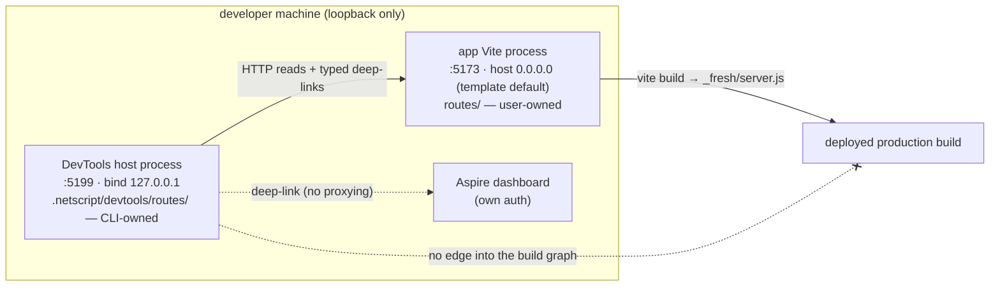

## The DevTools host

**Decision (H-1).** NetScript DevTools is a **separate first-party host process**: a
NetScript-owned Fresh application whose thin root is generated by the CLI into
`<projectRoot>/.netscript/devtools/`, run as its **own** Vite process on its **own** port, bound to
**loopback**, serving its **own** route tree. It is composed with the user's application by HTTP
reads and typed deep-links only. It is never mounted into the application's `routes/` tree, and it
takes no `@netscript/fresh` subpath.

The host runtime and the first-party panels live in `packages/plugin-devtools-core`
(**Archetype 2**); `plugins/devtools` is the thin **Archetype 5** installable glue. Archetype
rationale, gate columns, and the `SCOPE-frontend` overlay obligation are stated in *Contribution
kinds* and *Build and development mechanics*; this section fixes only the host's process, network,
and route boundaries.

### Why a separate process, not the two alternatives

| Rejected shape | Fatal property | Evidence |
| --- | --- | --- |
| App-mounted route group (`routes/(devtools)/devtools/…`, the `/design` shape) | Ships to production by default — the existing `(design)` group proves the omission is real; panel client state is reset by any app route edit (Fresh's full-reload HMR channel); the tree is user-owned, so DevTools updates become app-migration events | `packages/cli/src/kernel/assets/app/routes/(design)/design/` exists with **zero** `import.meta.env` / `NODE_ENV` / `DENO_ENV` / `development` matches (verified in-session, `grep -rn` over that directory → no matches); `r1` F7/F8/F13 |
| `@netscript/fresh/devtools` subpath (the RFC #890 host shape) | Inherits the unresolved A3-vs-A4 archetype label and its ambiguous gate set, and deepens a package carrying a **Restructure** verdict against doctrine's own stop conditions; #890's host shape is merged design text with **zero source** | `b2` D3 (`docs/architecture/doctrine/06-archetypes.md:376` says A4); `b2` F6 (`10-codebase-verdict-and-handoff.md:39,184-195`); research.md F2 |

Positive precedent for H-1: #1446 P-6's decision sentence — *"production operator management and
developer diagnostics are two distinct hosts and two distinct contribution surfaces — not one
ambiguous 'cockpit'"* (research.md F3, RFC:519-522); the ratified dashboard precedent's fat-core +
thin-plugin + CLI-launch shape (`b2` F1); and Aspire's own trajectory toward a fixed separate
dashboard host (research.md F26, `m4` F15).

### H-2 — Local development behavior (normative)

```
<projectRoot>/.netscript/devtools/          # CLI-generated, CLI-owned, git-ignorable
  main.ts          # first statement is the mode refusal (H-4, mechanism 2)
  client.ts
  vite.config.ts   # fresh({ islandSpecifiers }) + createNetScriptVitePlugin
  routes/          # the HOST's own tree — vertical feature slices
    _layout.tsx
    index.tsx
    traces/  runtime/  contracts/
  islands/
```

- **Sibling of `.netscript/generated/`** — the same CLI-owned workspace region (`r1` F10), so the
  user's tracked source gains nothing.
- **Launch:** `deno run -A npm:vite --configLoader native`, the same task shape the scaffolded app
  already uses (`r1` F15; `packages/cli/.../generate-app-deno-json.ts:112-119`).
- **Port:** `NETSCRIPT_DEVTOOLS_PORT`, default **5199** — deliberately distinct from the app's
  `NETSCRIPT_VITE_PORT ?? PORT ?? 5173`
  (`packages/cli/src/kernel/assets/app/vite.config.ts.template:36`, read in-session).
- **Bind:** `127.0.0.1`. This is a **deliberate divergence from the app template**, which binds
  `NETSCRIPT_VITE_HOST ?? '0.0.0.0'` (same file, `:37`, read in-session). The app's permissive
  default is not inherited; see H-5.
- **Routes:** un-prefixed on the host's own origin (`http://127.0.0.1:5199/`, `/traces`, …). No
  `/__devtools` prefix is specified, because a separate origin already is the namespace.
- **Isolation consequence:** the user's `routes/` gains zero DevTools entries, so app route edits
  do not reset DevTools client state and DevTools edits do not reload the user's app. Both hazards
  are properties of the shared Vite process the app-mounted shape would have used (`r1` F7/F8).
- **Never:** `routes/_devtools/` or `routes/(_devtools)/` in the user app. Both are Fresh's
  *invisible-helper* conventions (`r1` F4, `manifest.ts:53-55`) — they are a trap, not an option.



### H-3 — Package-shipped panel islands ride the upstream seam

The generated `vite.config.ts` passes island specifiers through upstream's own configuration field
rather than a bespoke mechanism (AGENTS.md rule 3):

```ts
// .netscript/devtools/vite.config.ts (generated)
import { fresh } from '@fresh/plugin-vite'

export default defineConfig({
  server: { port: Number(Deno.env.get('NETSCRIPT_DEVTOOLS_PORT') ?? '5199'), host: '127.0.0.1' },
  plugins: [fresh({ islandSpecifiers: devtoolsIslandSpecifiers })],
})
```

`FreshViteConfig.islandSpecifiers?: string[]` is documented upstream as *"Treat these specifiers as
island files. This is used to declare islands from remote packages"*
(`jsr.io/@fresh/plugin-vite/1.1.2/src/utils.ts:59-63`, consumed at `src/mod.ts:234-237`; the
version is pinned at `packages/cli/src/kernel/constants/scaffold/scaffold-app-catalog.ts:10`, read
in-session). **`unverified`:** the seam is a documented config contract with **no in-repo
consumer**, and it has not been exercised end-to-end with JSR specifiers under Deno resolution. It
is carried as a named Wave-0 probe with a fallback (generated re-export stubs under
`.netscript/devtools/islands/`), not as a proven capability.

### H-4 — Deployed production: absent, by two independent mechanisms

DevTools has **no production tier**. Absence is enforced twice, and the two mechanisms **MUST NOT
share a signal** — TanStack explicitly distrusted a single signal because hosting providers set
build command and mode inconsistently (research.md F24; `m2` F6-F7).

1. **Structural absence.** The app's production build graph is rooted at `client.ts`, the `routes/`
   walk, and `main.ts` (`r1` F4 `manifest.ts:289,407`; F15 `vite build` → `_fresh/server.js`).
   Nothing under `.netscript/devtools/` is reachable from any of those roots, so the deploy artifact
   **cannot contain** DevTools code. There is no in-app injection point that could fail open —
   see H-6.
2. **Fail-safe runtime refusal.** The generated `main.ts`'s first statement refuses to serve unless
   the mode is *literally* `'development'`, and exits with a named error. Polarity is deliberate:

   ```ts
   // .netscript/devtools/main.ts — first statement, generated
   const mode = Deno.env.get('NETSCRIPT_MODE') ?? Deno.env.get('NODE_ENV')
   if (mode !== 'development') {
     throw new DevToolsRefusedError(
       `NetScript DevTools refuses to serve: mode=${mode ?? '<unset>'} (expected 'development')`,
     )
   }
   ```

   The test is `!== 'development'`, **not** `=== 'production'`. An unset, misspelled, or
   provider-injected third value must refuse. The `=== 'production'` polarity fails open on exactly
   the inputs that occur in practice, which is the failure this decision is designed against
   (`m2` F6 via research.md F24).

**Stricter than upstream, deliberately.** Vite DevTools does not strip in production — it
*re-targets*: `build.withApp: true` writes DevTools output into the app's build directory, RPC
results are pre-computed into `__rpc-dump/*.json`, and in build mode **client authentication is
disabled by construction** (`DTK0008`: *"Client authentication is disabled. Any browser can connect
to the devtools and access your server and filesystem."*) — `m1` F10/F11/D4. NetScript declines that
target entirely. There is **no build-mode or static-dump output in v1**; the `__rpc-dump` design is
recorded as prior art in *Prior art and market architecture study*, not as scope.

**Claim discipline.** Both mechanisms are **UNPROVEN at baseline** — no gate exists today. The gate
that proves them (a production-build e2e asserting the mount 404s *and* no devtools specifier
appears in build output, plus a unit test asserting the refusal, scored as two assertions, one per
mechanism) is specified as INV-4/G-5 in *Trust, security, and the threat model* and must land in the
same slice as the host.

### H-5 — Remote exposure

| Reachability | Rule |
| --- | --- |
| Loopback (`127.0.0.1`) | Default. No token required — the OS user already owns the process. |
| Non-loopback (LAN, tunnel, codespace forward) | Refused **unless** an explicit operator flag (`--host`) is passed **and** the host has minted a session browser token. Links take the shape `{publicUrl}/login?t={token}` — Aspire's shipped, sanctioned automation path (`m4` F12/F17-19). |
| Deployed production | Not a tier; excluded upstream of this question by H-4. |

The gate this section fixes is single and absolute: **no token ⇒ no non-loopback bind.** Token
minting, revocation, origin verification, and the mutating-endpoint discipline are specified in
*Trust, security, and the threat model* (tiers DT0/DT1/DT-none, INV-5). #890's T0 posture is not
inherited by default: #890 itself parks its T1/T2 tiers "in the dashboard epic" — i.e. hands the
question here (`p1` F10, C9).

**Open risk (`unverified`).** Non-loopback binding exposes not only the Fresh routes but the Vite
dev server's own endpoints — the HMR WebSocket and `/@fs`, which the Fresh dev middleware passes
through untouched (`IGNORE_URLS` in `dev_server.ts`). No gate proves those are covered by the token
check. What would prove it: an e2e that binds non-loopback with auth enabled and asserts
`/@fs/<path outside project>` and the HMR WS handshake both 401/403 without the token. The loopback
default keeps this risk off the default path but does not resolve it.

### H-6 — Decided fact: the Vite-injection mount was never available

Research open question 1 is **closed from source**. NetScript is squarely in Vite DevTools'
documented `transformIndexHtml` silent-no-op bucket (`m1` F9), for three independent reasons:

1. **Fresh renders the app HTML; Vite never does.** `@fresh/plugin-vite@1.1.2`'s `fresh:dev_server`
   plugin installs a catch-all Connect middleware in `configureServer` that, for every URL which is
   not Vite-internal (`/@vite|/@fs|/@id|/.vite`), a module-graph hit, or a static file, runs
   `await server.ssrLoadModule("fresh:server_entry")` and `await mod.default.fetch(req)` — Fresh's
   own `App.fetch` produces the HTML `Response`, post-processed only by a manual
   `html.replace("</head>", styles + "</head>")` CSS collection
   (`jsr.io/@fresh/plugin-vite/1.1.2/src/plugins/dev_server.ts`).
2. **Zero `transformIndexHtml` anywhere.** Negative probe across all 18 files of the pinned plugin →
   zero uses; its only `index.html` handling is serving a *static-dir* `index.html` verbatim. A
   repo-wide `rg -c "transformIndexHtml"` over this worktree (excluding `.llm/`) returns **no
   matches** (run in-session).
3. **The scaffold ships no `index.html`.** `packages/cli/src/kernel/assets/app/` contains
   `client.ts.template`, `main.ts.template`, `router.ts.template`, `utils.ts.template`,
   `vite.config.ts.template`, and the `routes/`, `components/`, `assets/` directories — and no HTML
   entry (directory listing, read in-session).

**Consequence.** Every mounting decision in this RFC is NetScript-owned by necessity, not by
preference. The upstream escape hatch — a manual `import '@vitejs/devtools/client/inject'` guarded
by a user-written `if (import.meta.env.DEV)` — is refused on its own terms: it relocates the
production guard into user code, which is precisely the fail-open H-4 exists to prevent (`m1` F9).

### H-7 — Vite 8 is an explicit non-goal, with a re-entry condition

NetScript pins Vite **7.2.2** (`deno.json:248`, `packages/fresh/deno.json:56`); Vite DevTools,
`@nuxt/devtools` v4, and `vite-plugin-inspect` v12 all floor at Vite 8 (`m1` F28, D2). Adopting
`@vitejs/devtools-kit` is therefore impossible at this baseline — stage-C resolution **R4**.

This design does not merely tolerate that; it is **Vite-version-independent**. The host mounts
nothing through Vite's HTML pipeline (H-6 shows that pipeline was never available), so a Vite-8
migration is neither a prerequisite, nor a scheduled follow-up, nor a hidden dependency of any
decision in this RFC.

**Re-entry condition.** If adoption of `@vitejs/devtools-kit` (or any Vite-8-floored devtools
ecosystem package) is ever wanted, a **Vite 8 migration RFC is a hard prerequisite and separate
work**; it does not enter through this RFC's waves. Until then the kit is imitated at the contract
layer only — the shapes carried forward are named in *The DevTools contribution family* and
*Contribution kinds*.

### H-8 — `/design` is recorded as an existing ungated surface, not fixed here

The scaffolded app ships `routes/(design)/design/` — `index`, `_layout`, `tokens`, `components`,
`composition`, and a `(_shared)` group — with **no dev-mode gate**: zero matches for
`import.meta.env`, `NODE_ENV`, `DENO_ENV`, or `development` across that directory (verified
in-session). It is therefore reachable in a deployed production build of a scaffolded app.

This is **the same defect class H-4 exists to prevent**, in a surface that predates this RFC. It is
recorded, not fixed: repairing `/design` is out of scope here and belongs in its own issue, whose
acceptance is the INV-4 two-mechanism treatment applied to that route group. `unverified`: whether
any deployed NetScript app currently exposes `/design` to end users — nobody has checked, and this
RFC does not claim it either way.

### Owner forks raised by this section

| # | Fork | Recommendation |
| - | ---- | -------------- |
| H-F1 | **Auto-launch policy** — does `netscript dev` auto-start the DevTools host (the #424 precedent), or is `netscript devtools` always explicit? | Explicit in v1; a launcher affordance later (`m1` F15). |
| H-F2 | **Distribution** — is `plugins/devtools` installed by default at scaffold time, or opt-in via `netscript plugin add devtools`? | Opt-in; `plugin doctor` advertises it. Keeps the scaffold minimal. |
| H-F3 | **Ratify the Vite-8 non-goal (H-7) and the production posture (H-4)** — no build-mode target, two independent exclusion mechanisms. | Ratify as stated. |
| H-F4 | **`/design` retro-gating (H-8)** — same wave, or its own issue? | Own issue; not this RFC's scope. |
| H-F5 | **Port collision policy on 5199** — fail loudly, or increment to the next free port? | Fail loudly; a silently moved DevTools port breaks the deep-links other tools print. |
