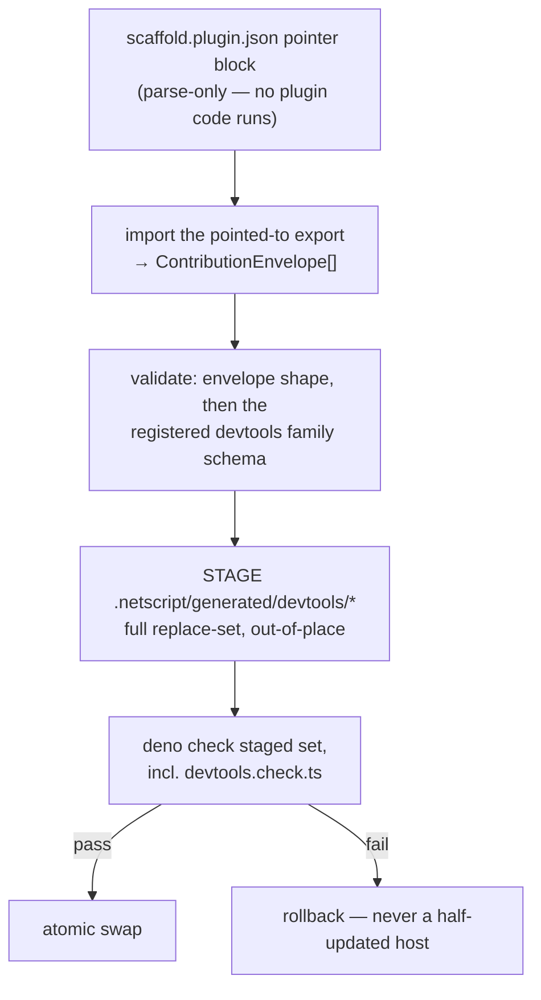

## The DevTools contribution family

This section is normative. It specifies how a plugin tells a NetScript DevTools host what it
contributes, how the host validates and orders those contributions, and what happens across
install, update, and remove. It does **not** enumerate the contribution kinds (see *Contribution
kinds*), the host's mount path and routing (see *Host shape*), the data channel a panel reads from
(see *Data plane*), or the trust posture (see *Trust model*).

**Nothing specified here exists at baseline `2256a67bf`.** There is no plugin→UI channel of any
kind: `capabilities.hasRoutes` means service HTTP endpoints, no registry kind emits routes, pages,
or islands, and `grep -rn "devtools\|DevTools"` across `packages/`, `plugins/`, and `docs/site`
returns zero matches (`research.md` F1; `packages/plugin/src/protocol/manifest.ts:20-21`). Every
TypeScript block below is a proposed contract, not a description of shipped code.

### Decision

DevTools ships as a **sibling payload family** — `{ family: 'devtools', major: 1 }` — riding a
**family-neutral envelope spine** that this RFC pins and the DevTools lane implements first. The
envelope, identity quartet, host-descriptor negotiation, and transactional replace-set are adopted
as a *specification* from RFC #890's merged design record (contracts C1–C5, C8); they are
payload-agnostic by construction, so adopting them costs nothing and diverging from them would
manufacture a second dialect.

Of the three seams already claiming this axis, **#890's pointer axis wins**: #427's thinness law
(no dashboard-specific field in the plugin manifest) survives intact under it, and **#734 is
superseded** — it proposes exactly the in-manifest axis #427 forbids and the pointer makes
unnecessary (`research.md` F10; `b1-dashboard-board.md` D2, F4). Ratification of that arbitration
is Owner fork **O-1**; the supersession section carries the board mechanics.

### Owner fork O-1 (restated) and Owner fork O-2 — the #890 dependency decision

This is a real fork with a default, stated openly rather than smuggled in as structure.

RFC #890 merged **design text only** — 32 files, all under `.llm/runs/` plus `labels.yml`, zero
source. All 24 children and epic #922 are OPEN at `status:plan`, milestone `0.0.9`, and not even
the disposable Wave-0 proofs have run (`research.md` F2; `p1-rfc-890-frontend-contrib.md` F1, F4,
F5). "Reuse #890's envelope" therefore means co-depending on unbuilt, unproven work.

| Option | Shape | Price |
| --- | --- | --- |
| **(a)** Hard-depend on #890's spine | DevTools waits for #928–#931 | Serialized behind 24 unstarted issues four milestones out; DevTools becomes the first consumer of a spine whose own proofs never ran (`p1` F4, F5) |
| **(b)** Fully self-contained DevTools envelope | Own envelope, own emitter | Creates a **fourth** seam on one axis; two emitters that must later converge or stay duplicated forever |
| **(b′)** Shared spec, DevTools-built spine — **default** | This RFC pins the neutral contracts; the DevTools lane implements them scoped to `devtools`; #890's `app` family re-bases onto the neutral package when its waves run | DevTools absorbs the Wave-0-class proving risk #922 scheduled for itself; #928–#931 must be re-baselined to *consume* the neutral package — a board mutation only the owner can ratify |

**(b′) is licensed by #890's own ratified decision D3**: a second family "extends nothing at the
schema level; it shares the envelope, discovery pipeline, identity model, and host-surface
negotiation" (`plan-frontend-contrib--seed/design/canonical/01-contracts.md:84-87`). Sibling
payload, not widened union.

**Reversibility (the reason this is a fork and not a foundation).** The devtools payload schema,
host descriptor, ordering rule, and diagnosis taxonomy below are byte-identical under (a), (b), and
(b′). Only two things move with the choice: the neutral package's home and name, and which lane
builds the emitter first. The decision stays reversible until the first emitter slice merges.

**Owner fork O-2 — the neutral package's home and name.** `@netscript/contribution-core`
(proposed) vs `@netscript/plugin-frontend-core` (#890's own fork F3, never arbitrated —
`p1` F9). A1 small-contract archetype either way. Also in scope: whether the manifest pointer block
reuses #890's `frontend` name verbatim (default — a devtools panel *is* UI, and renaming
re-litigates a settled name) or takes a family-neutral name while nothing is built.

**Owner fork O-3 — spine ownership transfer.** Under (b′), #922's spine children re-baseline to
consume the DevTools-built neutral package. This inverts that epic's build order and is a board
mutation this run may propose but not perform.

### The envelope

```ts
// @netscript/contribution-core/contracts/v1   (home/name = owner fork O-2)

export interface FamilyRef {
  readonly family: string; // 'app' | 'devtools' | future siblings
  readonly major: number;
}

export interface ContributionEnvelope {
  /** Family + major — the handshake. Hosts register the family schemas they support. */
  readonly contract: FamilyRef;
  readonly pluginKind: string;
  /** Preferred mount base. The devtools family IGNORES it (info diagnostic — see Collision). */
  readonly base?: string;
  /** Family payload. Validated ONLY by the family's registered schema, never by the envelope. */
  readonly contributions: readonly unknown[];
  readonly requires?: ContributionRequires; // ports/procedures — see Data plane
  readonly budgets?: ContributionBudgets;   // see Budgets
}
```

The only generalization over #890 C1 is that `contract` is `FamilyRef` rather than a union that
privileges the `'app'` literal (`p1` C1, quoting `01-contracts.md:68-81`). Kept otherwise identical
so #890 re-bases with a type alias, not a migration.

**AP-3 guard, normatively.** `contributions` is `readonly unknown[]` and **the envelope validates
nothing about the payload** — only the registered family schema does. A single
`DevToolsContribution` interface or union spanning pages, panels, inspectors, actions, and data
sources is precisely the god-interface shape doctrine forbids: "an interface with more than three
or four methods that is 'the contract for everything our adapter does'… Remediation: split by
behavior" (`docs/architecture/doctrine/09-anti-patterns-and-fitness-functions.md:46-52`). Kinds are
separate interfaces owned by the family package; the *Contribution kinds* section enumerates them,
each against a real first-party consumer.

**AP-24 guard, normatively.** Hosts consume contributions through a **typed kind registry**
populated at composition — never `switch (contribution.kind)` in a renderer
(`09-anti-patterns-and-fitness-functions.md:165-183`, which names switch-over-tagged-union as the
anti-pattern and the registry as its remediation).

```ts
export interface DevtoolsKindRegistry {
  register<K extends DevtoolsKind>(kind: K, renderer: DevtoolsRenderer<K>): void;
  resolve(kind: string): DevtoolsRenderer<DevtoolsKind> | undefined;
}
```

Because the neutral package then owns two extension axes (family-schema registration and kind
registration), it exports a single `extension-points.ts` per `R-COMP-EXT-MANIFEST`
(`docs/architecture/doctrine/07-composition-and-extension.md:254-266`).

### Identity and the family binding

```ts
/** Identity quartet — one string cannot serve provenance, URLs, scoping, and authorization
 *  (01-contracts.md:36-55). The host-assigned mountId is THE key for every generated artifact. */
export interface ContributionIdentity {
  readonly packageName: string;    // '@netscript/plugin-workers' — provenance + version drift
  readonly pluginKind: string;     // 'workers' — installer canonicalName idiom
  readonly installationId: string; // host-assigned at install; = pluginKind unless multi-instance
  readonly mountId: string;        // host-assigned; derives registry keys, routes, CSS scope
}
```

```ts
// @netscript/plugin-devtools-core/contracts/v1   (A2 core package; kinds are the kinds section)
export const DEVTOOLS_FAMILY = { family: 'devtools', major: 1 } as const;

/** Base fields every devtools kind extends. */
export interface DevtoolsContributionBase {
  /** Unique within (plugin, family). Pattern ^[a-z][a-z0-9-]*$ .
   *  Fully-qualified form is `<mountId>/<id>`. */
  readonly id: string;
  readonly title: string;  // plain string; the devtools family pins English (p1 F10, i18n row)
  readonly icon?: string;  // fresh-ui IconName
  readonly order?: number; // hint, clamped to [-100, 100] — see Ordering
}
```

**Targeting law.** Every kind that occupies a host surface names a target id drawn from the
**host's** descriptor vocabulary (zone id, nav group). Plugins cannot mint targets. This is
Medusa's actual model — a closed, core-owned vocabulary validated at build time — not the
plugin-minted model, which is Strapi's (`m3-admin-consoles.md` M-2, X-1; `research.md` F22).

### Negotiation

A host accepts an envelope **iff `envelope.contract` matches a declared `(family, major)` window in
its descriptor**. Evolution rules, adopted from #890 C2 (`01-contracts.md:88-92`):

| Change | Classification |
| --- | --- |
| New optional field on an existing kind | **minor** — family payload schemas are `.passthrough()` at the boundary; validators must ignore unknown fields |
| New kind, or a new discriminant value | **new major** of the family — "a union member added to a strict schema is not additive: old validators reject it, exhaustive consumers break" (`01-contracts.md:62-67`) |
| Envelope outside the declared window | **`window-mismatch` quarantine** — never a crash, never a silent drop |

The devtools host serves at most **two consecutive majors**, through a one-major deprecation
window. This is deliberately narrower than Grafana's open-ended concurrent serving
(`m2-tanstack-grafana.md` F16): Grafana pays for indefinite compatibility because its plugin
authors are third parties on independent release trains; a first-party dev-process family does not
buy that. Old-host/new-plugin and new-host/old-plugin each get a contract test.

### The pointer — and the manifest-strictness precondition

Pointer mechanics are #890's, unchanged (C8, `01-contracts.md:336-344`): `@netscript/plugin` learns
one **parse-only** block `{ export, framework: 'fresh' }`; the pointed-to module default-exports
`ContributionEnvelope | ContributionEnvelope[]`; the family/major handshake lives once, in the
envelope, derived at generate time. A DevTools envelope is simply **another array member behind the
same export** — zero new manifest fields. That is how #427's thinness law survives and why #734's
in-manifest axis is unnecessary.

**#890's compatibility claim for this block is false at baseline, and this RFC does not inherit
it.** C8 states that `PLUGIN_MANIFEST_SCHEMA_VERSION` "bumps additively; older CLIs ignore the
block, and because the older host also lacks the frontend generate step, ignoring is safe (no
half-wired state)" (`p1` C8, quoting `01-contracts.md:336-344`). The shipped installer schema pins
`schemaVersion: z.literal(PLUGIN_MANIFEST_SCHEMA_VERSION)` and terminates in `.strict()`
(`packages/plugin/src/protocol/manifest.ts:271,283`, read at baseline). Zod `.strict()` **hard-
rejects any unknown top-level key**. An older CLI therefore does not ignore a new pointer block —
it **fails the whole manifest parse**, taking the entire plugin down rather than degrading. This is
recorded as run drift **D-6** and escalated as a cross-RFC finding against #890/#922 slice #929.
(D-6 cites the `.strict()` call as `:282`; at baseline it is `:283` — `:282` is
`linking: linkingSchema.optional()`. The finding is unaffected.)

**Normative consequence.** Any manifest-visible DevTools pointer is blocked behind an explicit
**schema-evolution precondition slice**, sequenced before the pointer lands. Two acceptable shapes,
owner's choice (**Owner fork O-5**):

1. Relax `PluginInstallerManifestSchema` to tolerate declared optional extension blocks
   (`.passthrough()` or a `catchall` on a reserved namespace), with a compatibility test asserting
   that an unknown block parses rather than throws; or
2. Bump `PLUGIN_MANIFEST_SCHEMA_VERSION` with a documented migration and a **structured** old-CLI
   error ("plugin requires manifest schema v2; upgrade the CLI") in place of a raw zod issue list.

Until one of those merges, additive manifest evolution is not available to any family. This is a
precondition, not a footnote.

### Discovery and the generated registry

The devtools family uses the **manifest-driven, host-emitted** pipeline: the generator imports the
plugin's pointed-to export in-process and the **host** writes every artifact.



Two available generators are **rejected** for this family:

- The **SDK walker** (`plugin update` / `item-add` path): its `AstExtractor` is a regex over
  stripped text recognizing three hardcoded builders, and walker-emitted registries **leak on
  `plugin remove`** (`r4-cli-plugin-flows.md` F3, D4, F10; `research.md` F17).
- The **plugin-owned generator subprocess**: it is spawned with bare valueless `--allow-read` and
  `--allow-write` flags, which in Deno grant those permissions **globally — whole-filesystem, not
  project-scoped** (`packages/cli/src/public/features/generate/plugins/installed-runtime-registry-generator.ts:416-417`;
  run drift **D-7**, which corrects the corpus's weaker project-root wording). Its writes are also
  non-transactional per target (`r3-plugin-contribution-axes.md` F8).

Host emission closes both holes and adds the containment invariant the shipped code lacks:
**every emitted path is host-derived from `mountId` under `.netscript/generated/devtools/`; a
plugin never names a filesystem target.** A test asserts path containment. The `resolveTarget`
arbitrary-write class — absolute and escaping-relative targets accepted with no containment
assertion (`r2-fresh-ui-pipeline.md` D3; `research.md` F19) — is thereby impossible for this family
*by construction*. That is a claim about this family's emitter and its containment test only; it is
not a claim that `resolveTarget` is fixed. The broader posture is the *Trust model* section's.

Discovery source is the same resolved plugin set as `generate plugins` (config-declared specs,
`r3` F7a). The `appsettings.json` JSR-scan path is never an authority for this family, because the
two discovery sets can disagree (`r3` F7b).

The replace-set is emitted deterministically, **even when empty**, so removal can never dangle an
import:

| File | Contents |
| --- | --- |
| `devtools.registry.ts` | identities, contributions in final order, literal lazy loaders, **quarantine entries as data** |
| `devtools.islands.ts` | island specifiers for the vite feed |
| `devtools.routes.ts` | typed route refs for contributed pages |
| `devtools.check.ts` | static-import module referencing every referenced module — the type gate's teeth |
| `devtools.diagnosis.json` | machine-readable five-state record, consumed by the doctor check |

Lazy loaders are **literal, never computed**, so the staged `deno check` can see them
(`03-discovery-and-registry.md:43-53`):

```ts
load: () => import('@acme/plugin-crons/devtools/panels/queue')
  .then(normalizeFreshRouteModule),
```

**Determinism law.** Sort keys and emission order derive only from envelope data and the host
descriptor — never from discovery order, filesystem enumeration, or map insertion. Gate: shuffle
the envelope input order and the emitted registry is byte-identical. Generation is idempotent
(byte-identical output is skipped).

### Host capabilities — the descriptor

```ts
export interface DevtoolsHostDescriptor {
  readonly host: 'devtools';
  /** Supported (family, major) windows. v1: [DEVTOOLS_FAMILY]. */
  readonly families: readonly FamilyRef[];
  readonly zones: readonly DevtoolsZoneDescriptor[];
  readonly navGroups: readonly string[];
  /** '/_fresh', the devtools base itself, the gateway prefix — collision inputs for the mount. */
  readonly reservedPaths: readonly string[];
  /** Volume cap per plugin across the whole host. */
  readonly limitPerPlugin?: number; // default 16
}

export interface DevtoolsZoneDescriptor {
  /** Version-suffixed, host-owned id: 'devtools.capability.panel/v1'. The suffix versions the
   *  ZONE's props/context contract independently of the family major. */
  readonly id: string;
  readonly capacity?: number;
  /** Host-curated order pins: fully-qualified '<pluginKind>/<contributionId>' entries. */
  readonly anchors?: readonly string[];
}
```

**Adding a zone is a data change, not a contract change** (`01-contracts.md:243-246`) — that, not
schema openness, is what makes surface growth additive. Zone ids carry a version suffix because
Grafana derived its whole compatibility story from version-suffixed contribution ids
(`m2` F13, F16); the suffix is kept exactly where it uniquely earns its place — versioning a host
slot's props/context contract — and rejected as a per-contribution compatibility mechanism, where
the `(family, major)` handshake already does the job with quarantine semantics Grafana lacks.

### Ordering

Ordering is **net-new design**. No surveyed system solved it: Grafana concatenates in plugin load
order with no priority API (`m2` F21), TanStack's contribution identity is positional-index-based
(`m2` F3), and Medusa documents nothing and *deprecated* ordering-in-the-id — the `.before`/`.after`
suffixes were walked back in v2.17.2 (`m3` M-3, M-8). #890's `(order, mountId, id)` triple
(`03-discovery-and-registry.md:58`) is already ahead of that field but leaves the host's own
product surface hostage to plugin-chosen integers.

The devtools rule is **host-anchored, two-tier, and fully deterministic**:

1. **Tier 1 — host anchors.** Each zone descriptor may pin fully-qualified contribution ids in a
   host-curated sequence (`anchors`). Anchored contributions render first, in anchor order. The
   shell's tab strip is thus a **host product decision expressed as descriptor data**; pinning a
   panel's canonical position is a data change.
2. **Tier 2 — the clamped triple.** Unanchored contributions follow, sorted by
   `(order ?? 0, mountId, id)`. `order` is clamped to `[-100, 100]`; **a value outside that range
   is a generate-time error, not a silent clamp** — that is what kills priority-inflation wars
   before they start. Ties break on `mountId`, then `id`, in code-unit lexicographic order, never
   locale-sensitive collation.
3. **Determinism.** As the determinism law above.
4. **Host policy overlay.** Registry order is the *initial* order. A shell may persist per-user
   reordering client-side, but a fresh profile must reproduce registry order exactly.

```ts
export function orderContributions(
  zone: DevtoolsZoneDescriptor,
  items: readonly ResolvedContribution[],
): readonly ResolvedContribution[] {
  const rank = new Map(zone.anchors?.map((fq, i) => [fq, i]));
  const anchored: ResolvedContribution[] = [];
  const rest: ResolvedContribution[] = [];
  for (const item of items) {
    (rank.has(item.fullyQualifiedId) ? anchored : rest).push(item);
  }
  anchored.sort((a, b) =>
    rank.get(a.fullyQualifiedId)! - rank.get(b.fullyQualifiedId)!
  );
  rest.sort((a, b) =>
    (a.order ?? 0) - (b.order ?? 0) ||
    (a.identity.mountId < b.identity.mountId ? -1 : a.identity.mountId > b.identity.mountId ? 1 : 0) ||
    (a.id < b.id ? -1 : a.id > b.id ? 1 : 0)
  );
  return [...anchored, ...rest];
}
```

Rationale: determinism is a hard requirement of the idempotent transactional emitter; the tab strip
is host IA under epic #400's ratified ownership thesis (`b1` F3, F8); and both implicit ordering
(Grafana) and ordering-encoded-in-ids (Medusa, deprecated) are demonstrated dead ends. Anchors plus
a bounded hint is the smallest mechanism that avoids both.

**Owner fork O-6 — anchor governance.** Anchors give the descriptor owner (the devtools host
package) final say over first positions. Confirm that power balance, versus a pure-triple ordering
with no host curation.

### Collision

Collision is **largely a non-problem here, and this RFC deliberately does not overspend on it**.
Under a host-owned closed zone vocabulary, zone-name collision is impossible by construction:
plugins cannot mint a zone, so there is no namespace for two plugins to fight over. That is
Medusa's real model; the plugin-minted model that *does* need collision machinery is Strapi's, and
it drags in a two-phase register/bootstrap lifecycle plus caller-side `if (plugin)` guards
(`m3` M-2, S-1, S-3, X-1; `research.md` F22, R5). First-party contributors in one workspace do not
need an open namespace.

What remains, each with a specified outcome:

| Collision | Outcome |
| --- | --- |
| Duplicate contribution `id` within (plugin, family) | generate-time error naming both |
| Duplicate fully-qualified id across plugins | impossible — namespaced by unique `mountId` |
| Duplicate `mountId` | generate-time error |
| Route collision between plugins | impossible — the host **forces** namespacing under `<devtoolsBase>/p/<mountId>/…`; envelope `base` is ignored with an info diagnostic (a deliberate inversion of #890's unarbitrated plugin-preferred-base fork F2, which is userland-UX-motivated — `p1` F9, F14). The exact base string is the *Host shape* section's decision. |
| Zone capacity exceeded | deterministic overflow — winners are the first `capacity` in final order; losers are named in the report |

The `mountId` rule has teeth only if identity never round-trips through
`resolvePluginLocalName`, whose lossy last-segment collapse silently merges `@a/plugin-ai` and
`@b/plugin-ai` (`packages/cli/src/kernel/adapters/config/plugin-registry.ts:150-159`; `r3` F9).
The family keys on host-assigned `mountId` only.

### Quarantine

The five-state taxonomy is adopted verbatim as **product surface, not internal vocabulary**
(`03-discovery-and-registry.md:89-95`):

| # | State | Class | Meaning |
| - | --- | --- | --- |
| 1 | `unknown-zone` | excluded + error | target id not in the host descriptor (typo) |
| 2 | `known-but-unmounted` | info only — **not** quarantine | zone valid for the family, absent from this host; skipped |
| 3 | `capacity-rejected` | excluded + overflow report | volume/capacity loser, named |
| 4 | `window-mismatch` | **quarantine** | `(family, major)` outside the host window |
| 5 | `load-failure` | **quarantine** | staged check or import failed |

Quarantine entries are emitted into `devtools.registry.ts` **as data**, so the shell renders each
as a card deep-linking `netscript plugin doctor`. Each contribution additionally renders inside a
**per-contribution error boundary** whose polarity is inverted from Grafana's: Grafana logs loudly
and renders `null` in production (`m2` F23), but here the developer *is* the audience, so a render
throw flips that contribution to a loud diagnostic card and never takes the shell down. TanStack
has no boundary anywhere on its mount path — a documented gap, not a model (`m2` F11).

**Quarantine rides the existing `plugin doctor` contributed-check path — no framework edits.**
`doctor` already dynamically imports a plugin's `doctor` entrypoint and runs
`adapter.doctor.extraChecks[].run(ctx)` under a read-only context whose `writeText` rejects with
"Doctor checks are read-only."
(`packages/cli/src/public/features/plugins/doctor/doctor-plugin-use-case.ts:299-312`). The DevTools
host plugin ships exactly one contributed check: it reads `devtools.diagnosis.json` and the
generated registry, replays the five states as doctor rows, and flags staleness (registry entries
with no installed plugin).

**Honest limitation.** A contributed check returns `{ name, ok, message }` and is mapped
`status: check.ok ? 'healthy' : 'error'` — **binary, with no warning tier**
(`doctor-plugin-use-case.ts:314-318`). So states 1, 3, 4, and 5 report as `ok: false`, and state 2
reports as `ok: true` with an informational message. A capacity loser and a load failure are
therefore indistinguishable by severity in the doctor summary; the detail lives only in the
message text. Widening `ok` to a tri-state is a candidate one-line framework improvement and is
explicitly **not** required by this design.

### Budgets

```ts
export interface ContributionBudgets { // envelope-level, family-interpreted
  readonly initialJsKb?: number;
  readonly islands?: number;
  readonly panelRenderMs?: number;
}
```

Three dials, three enforcement points: (1) envelope `budgets`, asserted by the family test kit and
surfaced by doctor; (2) per-zone `capacity` in the descriptor, with the deterministic overflow of
quarantine state 3; (3) host-level `limitPerPlugin`, default 16 — the small volume cap Grafana
found sufficient (`m2` F15). The numbers are owner-tunable defaults, not contract. **No budget
here is a performance guarantee**: `panelRenderMs` is an asserted ceiling in the family test kit,
and any claim that the shell stays responsive under N panels requires that gate to exist and pass
before it may be made.

### Install, update, remove

| Verb | Behavior |
| --- | --- |
| `plugin install` | Regenerate the replace-set → staged `deno check` → atomic swap. **Advisory-install policy:** a devtools-family validation failure (bad zone, window mismatch, broken module) **never fails the install** — the offending contribution or envelope is excluded, recorded in `devtools.diagnosis.json`, and the swap proceeds with the valid remainder. An emitter or transaction failure still rolls back wholesale; transactionality is not advisory. |
| `plugin update` | Same regeneration. Contract drift surfaces as `window-mismatch` quarantine with the remediation command printed. |
| `plugin remove` | Regeneration emits the deterministic empty set for departed plugins. **Family law: the devtools family scaffolds no starter files.** Every artifact is either generated (removed by regeneration) or lives in the plugin package (removed with it). Removal is total, with zero orphans by construction. |

The advisory-install policy **diverges from #890 deliberately**, and the divergence is the point:
#890's `app` family fails the install on a broken contribution, which is correct there — a broken
user-facing page is real breakage. The devtools family is auxiliary diagnostics, so failing a
plugin install over an optional panel is disproportionate, and the market's
host-degrades-never-crashes posture (`m2` F18) applies doubly to a tool whose job is diagnosing
failures. **Owner fork O-4**: confirm exclude-and-diagnose for this family, and decide whether it
becomes a per-family `onInvalid` knob on the neutral spine rather than a hardcoded family
difference.

The no-starter-files law is also a simplification over #890 C7's app-owned-starter provenance
machinery (orphan detection that reports but never deletes), and it is the direct fix for the
walker-leak defect (`r4` F10).

### Owner forks raised by this section

| # | Fork | Default |
| - | --- | --- |
| O-1 | Seam arbitration: pointer axis wins; #427 folds in; **#734 closes as superseded** | as stated |
| O-2 | Neutral package home/name, and whether the manifest block keeps #890's `frontend` name | `@netscript/contribution-core`; reuse `frontend` |
| O-3 | Spine ownership transfer — #922's spine children re-baseline onto the DevTools-built package | (b′) |
| O-4 | Advisory-install for the devtools family; per-family `onInvalid` knob or hardcoded | advisory-install, knob deferred |
| O-5 | Manifest schema-evolution precondition slice — relax `.strict()` or bump `schemaVersion` | required before any pointer lands |
| O-6 | Anchor governance — host curation of first positions vs pure-triple ordering | anchors retained |

### Open risks

| Risk | What would prove it |
| --- | --- |
| The pointer block cannot land at all until the manifest schema evolves; every downstream slice inherits that dependency (drift D-6) | The precondition slice of O-5, with an old-CLI/new-manifest compatibility test |
| "Containment by construction" for the emitter is a design property with no gate yet | The path-containment test on the host emitter, asserting every emitted path resolves under `.netscript/generated/devtools/` |
| Determinism is asserted, not gated | The shuffle test: permuted envelope input ⇒ byte-identical registry |
| Two-major serving is a policy, not a mechanism | The old-host/new-plugin and new-host/old-plugin contract tests named under Negotiation |
| Doctor's binary `ok` cannot express the five states' severity spread | Either accept the message-only detail, or the tri-state widening (explicitly out of scope here) |
