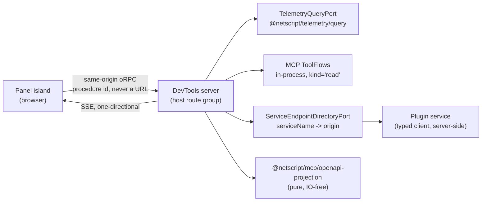

## The data plane

**Charter Q6.** How a DevTools panel — first-party or plugin-contributed — obtains data, without
ever holding a service address, a credential, or a fetch capability.

Citation convention for this section: `path:line` are baseline paths at `main` @ `2256a67bf`;
`rfc:NNN` is RFC-A (#1390) text at `14b5c858c` per corpus `research/p3-rfc-1390-sdk.md`; `RFC:NNN`
is RFC-0001 (#1446) at `6cb79675c` per `research/p2-rfc-1446-runtime-automation.md`. Claims marked
**verified** were re-checked by reading baseline source in this session.

### D-6.1 — The host is the single data edge

**Decision.** Panels receive **capabilities, never addresses**. At mount a panel is handed a typed
context object assembled by the DevTools host from the panel's manifest-declared needs. Every read
travels a **host-owned, enumerated devtools contract** served **same-origin** by the DevTools
server. The server side of that contract delegates to surfaces that already exist rather than
reimplementing them (see the consume-vs-build table, D-6.8).

This is the seam RFC-A licenses but does not define: *"UI contributions and SDK request
contributions are separate named extension axes, not one universal envelope"* (rfc:1179-1187, `p3`
F14; research F4). RFC-A's own chain terminates at a statically generated services map plus
caller-supplied context and explicitly rejects a registry, a locator, and any ambient client
(rfc:1501-1506) — so a host→panel context is additive to RFC-A, not a second SDK.

The host shape that serves this contract, and the route group it lives in, are decided in
§ *The host shape*; the trust posture that keeps it dev-only is § *The trust model*; which panels
exist is § *Information architecture and staging*.

### D-6.2 — The confused-deputy shape is removed by construction

Stated plainly, because it is the security-relevant claim of this section:

> **No URL-shaped input exists anywhere in the data plane.** No devtools procedure, event, manifest
> field, or context method accepts a URL, an origin, a host, a port, or a path as input.
> `serviceName → origin` resolution happens **server-side only**, through the identity-bound
> `ServiceEndpointDirectoryPort`.

A deputy is confused when *the caller chooses the target* and *the server supplies the authority*.
Here the authority (an Aspire dashboard API key today; an authenticated principal in v2/v3) is held
server-side, and the target set is **closed at generation time**: the caller chooses only a name
from an enumerated vocabulary. Both halves of the confused-deputy precondition are therefore absent,
not merely policed.

The resolver is `createServiceEndpointDirectory`
(`packages/mcp/src/application/service-endpoint-directory.ts:49-70`, **verified**), which composes
four fixed-precedence sources — `override`, `aspire-cli`, `run-manifest`, `appsettings` — and binds
the run-manifest source to an `expectedRunId` (`r5` F19-F20). Panels never see its output as an
origin: the client context carries no endpoint strings at all (D-6.9, rejection 9).

The precedent this forecloses is TanStack's dev-server plugin, which accepts an `install-devtools`
event **from the panel** and installs an npm package on the developer's machine, gated only on "dev
server only" with no per-plugin permission concept (`m2` F10; research F25).



### D-6.3 — Contracts: host→panel server context

Working home `@netscript/devtools-core` (contracts only). The package name and archetype are locked
in § *The host shape* / § *The contribution family* — do not treat the name here as normative.

```ts
/** Protocol handshake. RFC-A's `{family, major}` vocabulary (rfc:405-408, rfc:1179-1187). */
export interface DevtoolsDataProtocol {
  readonly family: 'netscript.devtools-data';
  readonly major: 1;
}

/** `<pluginId>/<panel>/v<major>` — version-suffixed ids, Grafana's compatibility story (m2 F16). */
export type DevtoolsPanelId = `${string}/${string}/v${number}`;

/** `<namespace>:<kebab-name>` — closed vocabulary, enumerated at generation time. Never a URL. */
export type DevtoolsProcedureId = `${string}:${string}`;

/** Discriminated result mirroring MCP's ToolSuccess | ToolFailure
 *  (packages/mcp/src/domain/tool-types.ts:34-58, verified). */
export type DevtoolsProcedureResult<TOut> =
  | { readonly ok: true; readonly value: TOut }
  | {
    readonly ok: false;
    readonly error: { readonly code: DevtoolsErrorCode; readonly message: string };
  };

/** What a DevTools route handler / server-rendered panel section receives. */
export interface DevtoolsServerPanelContext {
  readonly protocol: DevtoolsDataProtocol;
  readonly panelId: DevtoolsPanelId;
  /** Consumed, not rebuilt: packages/telemetry/src/ports/telemetry-query-port.ts:23-71 (verified). */
  readonly telemetry: TelemetryQueryPort;
  /** In-process invoker bound to read-kind MCP flows only (D-6.4). */
  readonly tools: DevtoolsToolInvoker;
  /** Names, sources, and conflicts — for display. Origins never cross into client context. */
  readonly endpoints: Pick<ServiceEndpointDirectoryPort, 'list'>;
  /** Typed Aspire/Scalar deep-link builders over the verified URL grammars (m4 F6-F11). */
  readonly links: DevtoolsDeepLinks;
  /** The journey join key, as data:
   *  packages/telemetry/src/domain/telemetry-convention.ts:51-53 (verified). */
  readonly correlation: { readonly attribute: 'netscript.correlation.id' };
  readonly signal: AbortSignal;
}
```

### D-6.4 — Contracts: host→panel client context

```ts
/** What an island panel receives. No ports, no env, no module-scope `window` reads —
 *  RFC-A's environment-neutral construction rule (rfc:321-324). */
export interface DevtoolsClientPanelContext {
  readonly protocol: DevtoolsDataProtocol;
  readonly panelId: DevtoolsPanelId;
  /** Same-origin, typed, closed-vocabulary query invoker. */
  readonly query: DevtoolsQueryInvoker;
  /** SSE-backed, one-directional event feed (D-6.6). */
  readonly events: DevtoolsEventFeed;
  readonly links: DevtoolsDeepLinks;
}

export interface DevtoolsQueryInvoker {
  invoke<TOut = unknown>(
    procedure: DevtoolsProcedureId,
    input: unknown,
    options?: { readonly signal?: AbortSignal },
  ): Promise<DevtoolsProcedureResult<TOut>>;
  /** TanStack Query bridge; keys are ['devtools', procedure, input] (D-6.7). */
  queryOptions<TOut = unknown>(
    procedure: DevtoolsProcedureId,
    input: unknown,
  ): DevtoolsQueryOptions<TOut>;
}

/** Server-side only. Bound to ToolKind 'read' (packages/mcp/src/domain/tool-types.ts:32, verified). */
export interface DevtoolsToolInvoker {
  invoke<N extends DevtoolsReadToolName>(
    name: N,
    input: ToolInputOf<N>,
    options?: { readonly signal?: AbortSignal },
  ): Promise<ToolExecutionResult>;
}

/** The ONLY way a plugin extends the procedure vocabulary. Mirrors RFC-A's
 *  SdkClientContributionReference discipline (rfc:1136-1159): a static module+export
 *  reference that "does not contain a serialized function and does not automatically
 *  activate it" — declarative, never a callable smuggled through a manifest. */
export interface DevtoolsProcedureReference {
  readonly protocol: DevtoolsDataProtocol;
  /** MUST be prefixed `<pluginId>:` — enforced at generation, not advisory (m2 F13). */
  readonly id: DevtoolsProcedureId;
  readonly module: string; // plugin-package module specifier
  readonly export: string; // named export of an oRPC contract procedure binding
  readonly kind: 'read'; // v1 is read-only; 'mutate' is owner fork OF-D3
}
```

**Contract laws** (normative):

1. **Duplicate ids are rejected at generation time**, never last-wins. Silent last-wins collision is
   an already-shipped defect class in this repo at three layers (research F19, `r2` F10-F11) and in
   plugin identity (research F18); RFC-A's construction law is the fix pattern (rfc:830-846).
2. **Context is assembled per panel from declared needs.** No ambient client, no locator, no
   `useDevtoolsClient()` — the exact shapes RFC-A rejects for the SDK (rfc:1501-1506) stay rejected
   here, for the same reasons.
3. **Redaction is inherited verbatim.** Results and events never carry header values, request input
   echoes, contribution context, or credentials; RFC-A forbids recording these *even in debug mode*
   (rfc:1091-1110). The single deliberate exception is cache partition values, which RFC-A declares
   "intentionally visible in query keys and developer tools" (rfc:1117-1119) — that sentence is both
   the licence for a cache-inspector panel and its boundary.
4. **Per-panel error boundary.** A failing procedure returns the discriminated failure; a failing
   panel renders a boundary — loud, because the audience is a developer (Grafana's boundary polarity
   inverted, `m2` F23; TanStack has no boundary anywhere on its mount path, research F24). The host
   degrades; it never crashes.

### D-6.5 — Transport decision

**Decision: same-origin HTTP (oRPC) for reads, one-directional SSE for push, MCP composed
in-process and read-kind-only. No WebSocket. No MessagePort. No MCP over HTTP.**

| Leg | Decision | Reason |
| --- | --- | --- |
| Panel → data | Same-origin oRPC on the host's route group | Matches RFC-A's normative transport posture; same-origin is what the framework's own SSE consumer documents as the sanctioned pattern, because native `EventSource` cannot attach authorization headers (`packages/fresh/src/runtime/streams/create-stream-event-source.ts`) |
| Host → MCP | **In-process** composition of exported flow factories | `packages/mcp/mod.ts` publicly exports `createToolRegistry`, `createDoctorFlow`, `createServiceEndpointDirectory`, `createListApiServicesFlow`, `createGetOperationSchemaFlow`, `createExportSurfaceFlows` — composable API, no transport needed. **This settles research open question 4 in favour of in-process.** |
| MCP over HTTP/SSE | **Rejected** | An HTTP-exposed tool registry carries `execute_command` and `record_drift` — mutate/meta tools — into browser reach. In-process binding lets the host allowlist on the existing `ToolKind = 'read' \| 'mutate' \| 'meta'` axis (`tool-types.ts:32`, **verified**). MCP is stdio-only today (`r5` F23, research F5); adding a second transport means versioning two agent surfaces forever. Aspire's own 13.3 trajectory removed in-dashboard agent UI and redirected agents to the CLI/MCP server (`m4` F15, research F26) — dashboard = fixed human viewer, MCP = external agent API. |
| Push | **SSE, one-directional** | One-directionality is a *structural* property, not a policy: a panel physically cannot send an action down the feed, which forecloses the `install-devtools` failure class rather than gating it. Mutations, if ever allowed, must be named POST procedures — enumerable, deny-by-default, auditable. SSE also needs no new port under Aspire. |
| WebSocket / bidirectional channel | **Rejected** | The panel→server direction is precisely where TanStack's channel became privileged (`m2` F10). TanStack's triple stack (browser `EventTarget` + WS on 4206 + SSE/fetch fallback) is the "pick one transport" anti-pattern the corpus already flags. |
| MessagePort / in-process browser transport | **Rejected** | Normatively rejected by RFC-A for the SDK (rfc:983-998). A MessagePort seam requires its own RFC; a desktop DevTools host inherits this as a later, separate question. |
| Typing | oRPC contract + MCP input/output schemas | The 22 MCP tools declare JSON input **and** output schemas keyed by `ToolName` (`packages/mcp/src/domain/tool-contracts.ts:353,361`, `r5` F18), so re-exposing selected read flows makes panel-side typing free. |

**Not the #934 gateway.** RFC-0001 scopes that deny-by-default procedure gateway's sufficiency claim
to Surface 1, "for this surface only" (RFC:503-508, `p2` F6), and is silent for DevTools. **Decision:
DevTools does not ride the #934 gateway** — sharing a production, RBAC-principaled data edge with a
dev-only, absent-from-production surface recouples the two postures RFC-0001's own decision sentence
separates (RFC:491-493). The devtools contract nonetheless **copies its shape discipline**:
deny-by-default, enumerated procedures, no bespoke Fresh seam, no direct service URLs. This is
**owner fork OF-D1**, because the counter-argument — two generated data planes is duplication — is
real.

### D-6.6 — Live updates

No admin console surveyed models a push contract to contributed UI; Medusa's typed-prop flow is
request/response only (`m3` data-freshness row). The **contract** is therefore net-new design. The
**primitives** are not:

- **Server half exists and is unexported.** `packages/fresh/src/runtime/server/sse.ts` ships
  `createSSEStream` (`:148`), `createKvWatchSSE` (`:339`), `createKvPrefixWatchSSE` (`:416`),
  `SSEController` (`:100`), with keepalive and cleanup. **Verified:** no barrel exports it —
  `packages/fresh/src/runtime/server/mod.ts` has zero `sse` references, `packages/fresh/deno.json`
  `exports` has no sse path, and the only importer in `packages/` + `plugins/` is its own
  `sse_test.ts`. **Promoting it to the public surface is a named framework-source slice, not new
  design** — and per `CLAUDE.md` it is a WSL Codex slice, never a docs/authoring lane.
- **Client half has a shipped precedent.** `createNetScriptStreamEventSourceV1`
  (`packages/fresh/src/runtime/streams/create-stream-event-source.ts`) is a named-event,
  schema-validated SSE consumer with opaque replay offsets and a reconnect cursor. The feed client
  copies this shape.

```ts
/** `<pluginId>:<topic>` or `netscript:<topic>` — enforced namespacing (m2 F8). */
export type DevtoolsTopic = `${string}:${string}`;

export interface DevtoolsEvent<TPayload = unknown> {
  readonly topic: DevtoolsTopic;
  /** Opaque resume cursor, carried as the SSE id → `Last-Event-ID` on reconnect. */
  readonly cursor: string;
  readonly at: string; // ISO-8601
  /** Present when the producing span carried `netscript.correlation.id`. */
  readonly correlationId?: string;
  /** Query-key prefixes this event invalidates (D-6.7). */
  readonly invalidates?: readonly (readonly unknown[])[];
  readonly payload: TPayload;
}

export interface DevtoolsEventFeed {
  subscribe(topics: readonly DevtoolsTopic[], onEvent: (e: DevtoolsEvent) => void): () => void;
  readonly state: 'connecting' | 'live' | 'reconnecting' | 'latched-off';
}
```

Feed laws: heartbeat keepalive (owned by the `sse.ts` primitive); per-topic volume caps; **events are
facts about the runtime, never commands**; a plugin may only produce under its own `pluginId:`
prefix. Producers: framework topics from KV-watch over runtime registries via
`createKvPrefixWatchSSE`; telemetry-derived topics by bounded server-side polling of
`TelemetryQueryPort` — polling because no push endpoint appears in the Aspire query adapter surface
(`packages/telemetry/src/adapters/aspire-query/aspire-telemetry-query.ts`; marked **inference** from
absence, not a proven absence of upstream capability). RFC-0001's `{epoch, snapshotHash}` change feed
(C1/C5) is bridged server-to-server into `netscript:automation-*` topics only once its slices land
and auth permits (D-6.9).

### D-6.7 — Caching, invalidation, provenance

- **One cache.** Client caching rides TanStack Query through the existing `@netscript/fresh/query`
  subpath (`packages/fresh/deno.json` exports, **verified**). No second cache is introduced.
- **Keys** are `['devtools', procedureId, input]` — stable, enumerable, and *permitted to be
  visible*: partitions are the one deliberately-inspectable value class (rfc:1117-1119).
- **Invalidation is event-driven.** `DevtoolsEvent.invalidates` maps a topic to key prefixes; the
  feed client calls prefix invalidation on the query cache. Per-panel polling fallback with a visible
  staleness indicator when the feed is `latched-off`.
- **Every panel renders its data provenance.** `resolveTelemetryEndpoint` already returns its
  resolution `source` — `explicit | netscript_env | aspire_port | default`
  (`packages/mcp/src/domain/telemetry-endpoint.ts:22-40`, **verified**). Surfacing it is the "where
  is my data coming from" affordance, and it structurally prevents the shipped drift where the
  scaffolded telemetry template hand-rolls a second, disagreeing endpoint policy (`r5` drift 1-2).

### D-6.8 — OTel correlation

- **Join key:** `netscript.correlation.id`, exported as `NetScriptCorrelationAttributes.CORRELATION_ID`
  (`packages/telemetry/src/domain/telemetry-convention.ts:51-53`, **verified**). Staged second key:
  the automation execution id, which RFC-0001 guarantees is shared between spans and history records
  (RFC:461-464).
- **The journey procedure** takes a `correlationId`, fans out server-side across `querySpans` and
  `queryLogs` filtered on that attribute, and returns a **primitive-grouped causal chain** — honoring
  epic #400's flow ≠ waterfall acceptance line (research F8). No span bars, no gantt.
- **Waterfalls deep-link out** using the verified Aspire grammar — `/traces/detail/{traceId}?spanId=`
  and `/structuredlogs/resource/{n}?traceId=&spanId=&logLevel=` (`m4` F6-F11, research F6) — built
  from `Dashboard:Frontend:PublicUrl`, never a hardcoded localhost. Filtered Aspire views are **not**
  constructible (`?filters=` is opaque, research F6); the RFC does not promise them. No deep-link
  helper exists anywhere in `packages/` today (research F7), so `DevtoolsDeepLinks` is a named
  build item.
- **Observer effect.** DevTools' own outbound queries default to *not* emitting spans into the
  dashboard they render. `propagateTraceContext` exists on `CreateServiceClientOptions`
  (`packages/sdk/src/ports/service-client.ts:203-222`, **verified**) if the owner prefers
  tagged-and-visible — **owner fork OF-D4**.

### D-6.9 — Auth sequencing: the blocking dependency, stated honestly

**The hard fact, verified in this session:** `createServiceClient` **cannot send `Authorization` or
`x-api-key`**. `CreateServiceClientOptions` is a closed record of nine fields — `contract`,
`serviceName`, `routerName`, `protocol`, `apiPath`, `apiVersion`, `port`, `timeout`,
`propagateTraceContext` — and `ServiceClientContext` is a closed transport-knob interface (`signal`,
`cache`, retry knobs, `traceHeaders`). Neither admits a header or credential
(`packages/sdk/src/ports/service-client.ts:129-155,203-222`, **verified**; research F15).

Credential-bearing access is therefore blocked on the RFC-A chain: FCP close → #1350 → **an unfiled
metadata child** (FCP disposition 6 defers `NetScriptProcedureMeta` to "a dependent metadata child
after acceptance"; no such issue exists — `p3` F13, `p3` drift 4) → #1351 → #1349 → #1352 auth
dogfood, all milestone `0.0.7` (`p3` F12). Hand-rolling headers around the SDK is exactly the
duplication the charter forbids and would create the second SDK extension mechanism RFC-A's boundary
sentence exists to prevent.

**Mitigation — stage the panel set by principal requirement, not by feature:**

| Stage | Panels | Principal | Gate |
| --- | --- | --- | --- |
| **v1 — principal-less** | Telemetry (traces/logs/metrics/resources), framework state (doctor, endpoint directory, export surfaces, OpenAPI explorer via the pure projection), plugin read procedures on **unprotected** dev routes, KV-watch live registries | **None.** Any Aspire dashboard API key is held server-side and never reaches the browser | Dev-only host posture (§ *The trust model*); same-origin |
| **v2 — credentialed** | Plugin read procedures on protected routes; any panel whose context declares `auth` | Yes — RFC-A bearer contribution with a caller-supplied token getter (rfc:178-206) | **#1352 lands**, and the unfiled metadata child is filed |
| **v3 — automation** | Audit, execution history, convergence status, journey ↔ execution joins | Yes — management API requires an authenticated principal; RBAC is role-per-action, enforced in the lifecycle engine (RFC:424-428) | RFC-0001 slices A2b + A3b + A2d (P-6's own entry criterion, RFC:638) **and** the v2 gate |

Propagation model once unblocked: **the DevTools server is the caller** in RFC-A's sense — the route
handler resolves the dev principal server-side and supplies the composed context per call
(rfc:276-296). Panels never see a token, a token getter, or a credential-bearing context. DevTools
reads use the `viewer` role and cannot invent a diagnostics-only bypass, because enforcement is
server-side. Cache partitions for principal-scoped queries follow RFC-A's law: non-secret epoch
identifiers, never tokens or emails (rfc:201-206).

**Open risk, named with its gate.** Nothing in this section proves isolation, credential safety, or
production absence. The properties claimed are structural (no URL input; one-directional feed;
read-kind allowlist) and each requires an executable gate to become evidence:

| Desired property | Proving gate (to be authored) | Status |
| --- | --- | --- |
| No URL-shaped input in the devtools contract | Contract-surface test asserting no procedure input schema accepts a string typed/named as url/origin/host/path | **unproven** |
| MCP binding is read-kind only | Test asserting the bound flow set ∩ `{kind: 'mutate' \| 'meta'}` = ∅ | **unproven** |
| Panel cannot push commands upstream | Test asserting the SSE route rejects non-GET and the feed client exposes no send path | **unproven** |
| Duplicate procedure id rejection | Generator test on a two-plugin fixture with colliding ids | **unproven** |
| Client context leaks no origins | Type-level + runtime assertion over the serialized client context | **unproven** |

### D-6.10 — Consume vs build

| Surface | Verdict | Evidence |
| --- | --- | --- |
| `TelemetryQueryPort` (7 methods) + `createTelemetryQuery` | **Consume**, server-side | `packages/telemetry/src/ports/telemetry-query-port.ts:23-71` (**verified**); `packages/telemetry/query.ts` |
| MCP `ToolFlow`s + `ToolKind` + input/output schemas | **Consume in-process**, read-kind allowlist | `packages/mcp/mod.ts`; `tool-types.ts:32` (**verified**); `tool-contracts.ts:353,361` |
| `@netscript/mcp/openapi-projection` (pure, IO-free) | **Consume** — the API explorer needs no MCP process | `packages/mcp/openapi-projection.ts` (`r5` F21) |
| `resolveTelemetryEndpoint` four-arm policy | **Consume**, and surface its `source` | `packages/mcp/src/domain/telemetry-endpoint.ts:22-40` (**verified**) |
| `ServiceEndpointDirectoryPort` | **Consume** as the *only* `serviceName → origin` resolver | `service-endpoint-directory.ts:49-70` (**verified**) |
| `createSSEStream` / `createKvWatchSSE` / `createKvPrefixWatchSSE` | **Consume — after a promotion slice.** Exists, unexported, zero importers outside its test | `sse.ts:148,339,416`; `server/mod.ts` (no sse); `packages/fresh/deno.json` (**verified**) |
| `createNetScriptStreamEventSourceV1` shape | **Consume the shape** for the feed client | `create-stream-event-source.ts` |
| TanStack Query via `@netscript/fresh/query` | **Consume** as the only client cache | `packages/fresh/deno.json` exports (**verified**) |
| RFC-A vocabulary (`{family, major}`, namespaced ids, duplicate rejection, static references) | **Consume the vocabulary, never the unmerged symbols** | rfc:1179-1187 (`p3` F13) |
| RFC-0001 contracts (management oRPC, audit, history, convergence feed, OTel names) | **Consume, staged to v3**; bridge the change feed server-to-server | RFC:283-285, 300-379, 465-487 (`p2` C1-C6) |
| Aspire/Scalar deep-link URL grammars | **Consume the grammar; build the typed helper** | `m4` F6-F11, F17-F18; absence: research F7 |
| Devtools oRPC contract (enumerated procedures + error codes) | **Build** (net-new) | this RFC |
| `DevtoolsServerPanelContext` / `DevtoolsClientPanelContext` | **Build** (net-new — the seam RFC-A licenses but does not define) | this RFC |
| `DevtoolsEventFeed` + topic/cursor/invalidation contract | **Build** (net-new — no market precedent) | `m3` data-freshness row |
| `DevtoolsProcedureReference` manifest axis + generated static registry | **Build**, mirroring rfc:1136-1176 discipline | this RFC · see D-6.11 |

**Named framework-source slices** (WSL Codex lane, not design work): (1) promote `sse.ts` to
`@netscript/fresh/server`; (2) the typed Aspire/Scalar deep-link helper.

### D-6.11 — Manifest precondition, inherited from drift

`DevtoolsProcedureReference` is manifest-visible. `PluginInstallerManifestSchema` ends in
`.strict()` and pins `schemaVersion: z.literal(1)`
(`packages/plugin/src/protocol/manifest.ts:271,282`; drift **D-6**), so an unknown top-level block
does **not** degrade — an older CLI fails manifest parsing outright. Any manifest-visible DevTools
pointer therefore requires an explicit schema-evolution precondition slice sequenced *before* it.
The mechanism is decided in § *The contribution family*; this section only records that the data
plane depends on it.

### D-6.12 — Rejected alternatives

1. **MCP over HTTP/SSE** — puts `execute_command` / `record_drift` one CORS mistake from the
   browser; contradicts Aspire's 13.3 human-UI/agent-API split; creates a second MCP transport to
   version forever. In-process composition delivers the same flows with a host-controlled allowlist.
2. **A generic proxy procedure ("fetch this service path for me")** — the definitional confused
   deputy. One URL-shaped input reopens the entire class; the closed vocabulary is the whole
   mitigation.
3. **Riding the #934 gateway** — held as a recommendation pending **OF-D1** (D-6.5).
4. **WebSocket / bidirectional channel** — see D-6.5.
5. **MessagePort** — normatively rejected by RFC-A (rfc:983-998); needs its own RFC.
6. **A network-inspector panel on the SDK seam** — RFC-A has no response hook (`SdkClientRequestPatch`
   is headers-only, rfc:436-438) and forbids recording header values, inputs, or context even in
   debug (rfc:1091-1110). Deferred explicitly rather than smuggled in.
7. **Hand-rolled auth headers / SDK bypass** — charter duplication ban; also strictly worse than
   waiting, since #1352 delivers the dogfooded bearer path.
8. **A second telemetry-endpoint policy or hand-rolled OTLP parsing in panels** — already shipped
   once as drift (`r5` drift 1-2). The port and the four-arm resolver are the law.
9. **Panel-visible endpoint origins** — `endpoints` in the *server* context is names, sources, and
   conflicts for display; origin strings never cross into client context.

### D-6.13 — Owner forks raised by this section

| # | Fork | Default taken here |
| --- | --- | --- |
| **OF-D1** | Does v3 automation read through the #934 gateway, or through a separate dev-only edge? | Separate edge, shape-copied. Nothing in v1/v2 changes either way |
| **OF-D2** | Ratify the staging (v1 now; v2 on #1352 **plus the unfiled metadata child**; v3 additionally on A2b/A3b/A2d)? | Ratify. The only honest accelerator is filing/accelerating #1348's children — not a DevTools-side workaround |
| **OF-D3** | Do "dev management affordances" ever include **mutations** through DevTools, and under which role? | No for v1 — `kind: 'read'` is enforced. Inherits `p2` OQ9 unresolved |
| **OF-D4** | Suppress DevTools' own outbound-query telemetry, or emit tagged spans for meta-debugging? | Suppress by default |
| **OF-D5** | Promote `sse.ts` to `@netscript/fresh/server` (framework slice) vs vendor it into the DevTools host (duplication)? | Promote |
| **OF-D6** | If a mutate-kind flow is ever bound, what is the per-contribution opt-in + audit shape? | Not needed for v1; named so it cannot arrive ungoverned |
