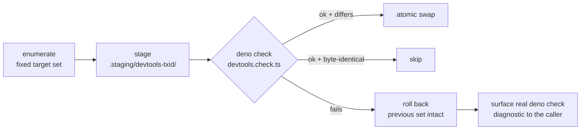

## Build and development mechanics

Answers charter **Q8** and disposes of frontend contribution surface **#3 (Vite)**. Host shape,
mount route and zone vocabulary are decided in *Host shape* and *Contribution family*; the data
plane in *Data plane*; permission enforcement in *Trust model*. This section owns only: how a
contribution becomes bytes in the build, how generated state is written, and what the CLI does on
install / update / remove / doctor.

Citation convention: `path:line` at baseline `main` @ `2256a67bf`; `rN`/`mN`/`pN` are corpus files
under `.llm/runs/plan-devtools-contribution--seed/research/`. Judgements are marked `inference`;
unclosed facts are marked `unverified` with the probe that closes them.

### D-1 — Contributions enter the build as generated source modules, never as Vite plugins

**Decision.** A DevTools contribution reaches the browser by being *referenced from a generated
source module inside the app graph*. It never adds a Vite plugin, never registers a transform, and
never injects HTML. Vite is not told that DevTools exists.

Rationale, three facts at baseline:

| Fact | Evidence |
| --- | --- |
| There is no Vite-contribution seam to use. The plugin chain is static template text; a repo-wide grep for `createNetScriptVitePlugin` hits only the package, its template, tests and docs — no plugin | `packages/cli/src/kernel/assets/app/vite.config.ts.template:41-56`; r1 F6 |
| The market's injection mechanism, `transformIndexHtml`, **silently no-ops** for apps that render their own HTML — and Fresh 2 does | m1 F9 |
| The entire Vite DevTools kit floors at **Vite 8**; NetScript pins **7.2.2** | m1 F28/D2; `deno.json:248`, `packages/fresh/deno.json:56` |

**Generated replace-set**, emitted under `.netscript/generated/devtools/`. Fixed inventory, fixed
filenames:

| File | Contents |
| --- | --- |
| `devtools.registry.ts` | identities, resolved mounts, contribution descriptors, **literal lazy loaders** — `load: () => import('jsr:@acme/plugin-x@1.4.2/devtools/panel')`. Never a computed specifier. |
| `devtools.routes.ts` | `createRouteReference` entries, spread into the app-owned `router.ts` exactly as the `(design)` refs are today (`router.ts.template:33-46`, r1 F5/F13) |
| `devtools.islands.ts` | island specifier feed (see D-2) |
| `devtools.css` | layer-ordered CSS imports |
| `devtools.check.ts` | static-import module referencing every module named above — the transaction's teeth (D-3) |

All five are emitted **deterministically, including when the contribution set is empty**. This is a
decision against current behaviour, not a description of it: today the host generator throws
`EmptyPluginRegistryError` when a plugin registers zero items
(`packages/cli/src/public/features/generate/plugins/installed-runtime-registry-generator.ts:88`) and
the workers generator `continue`s past a target with no files, writing nothing at all
(`plugins/workers/src/cli/runtime-registry-generator.ts:83`). An empty set that emits nothing is
exactly how a removal leaves a dangling import; an empty set that emits a valid empty module cannot.

No alias edits. The hardcoded three-alias trap — "adding a plugin adds no alias"
(`vite.config.ts.template:20-32`, r1 F11) — is avoided because the registry emits **full package
specifiers resolved through the app's import map**, pinned to the installed version (D-5).

### D-2 — Panels ship as source; islands and source maps follow from that

**Decision.** A contributed panel is **source that compiles in the app's Vite graph**. Prebuilt
browser bundles are rejected as a contribution form.

The binding constraint is singleton discipline: `vite.ts:322` sets
`dedupe: ['preact', '@preact/signals']` and `resolveId` (`vite.ts:380-393`) canonicalizes the
specifiers onto the app-owned import-map entry (r1 F16). A bundle built against a different
resolution root risks a second Preact copy and dead signals — `inference` from that dedupe comment.

Two consequences fall out, and neither costs new machinery:

- **Source maps** are Vite's own, pointing at the contributor's real source: the workspace path in
  local mode, the resolved cache path for JSR. No DevTools-specific source-map handling exists or is
  needed. Rejecting prebuilt bundles is what buys this.
- **Mounting is NetScript-owned**, never an HTML transform. Registration is a `configure(app)` /
  route-reference spread on `defineFreshApp` (r1 F2), because the only market injection mechanism is
  in a documented silent-failure bucket for Fresh (m1 F9). Route files are **not** written loose
  under `routes/` in the primary mode: the manifest generator rewrites app page modules by default at
  init/build/watch (`vite.ts:293,394-402,422-431`, r1 F8), and `_devtools/` or `(_devtools)/` trees
  are invisible to the walker anyway (`manifest.ts:53-55`, r1 F4).

**Island registration is the one unverified integration point.** Whether `@fresh/plugin-vite`
accepts a second island root / additional island specifiers in one Vite process is `unverified`
(r1 OQ1; research.md open question 2). #890 designed a `frontend.islands.ts` feed (p1 C5) and shipped
nothing (p1 F1/D-1). **Probe P-1** closes it: read `jsr:@fresh/plugin-vite` source, then run a
two-island-root spike. Both outcomes are designed, and both write through the same transaction — the
fork changes the transaction's *target set*, not the write law:

| P-1 result | Mode | Mechanics |
| --- | --- | --- |
| Passes | **import-mode (primary)** | `devtools.islands.ts` feeds the discovered island set; panels are imported from their packages |
| Fails | **copy-mode (fallback)** | the transaction *materializes* panel files into the app tree — `routes/(devtools)/devtools/<mountId>/…`, `islands/devtools/<mountId>/…` — where the filesystem walker and Fresh island discovery pick them up with zero framework change (r1 F4; precedent: the `ui:add` copy model, r2 F5). Files carry a provenance header; cleanup is by regeneration. Costs are the known copy-model costs: owned drift and upgrade churn (r2 F5, F11). |

**Open risk.** Until P-1 executes, "a contributed island hydrates" is a desired property with no
executable gate. The gate that proves it is P-1 plus a scaffold E2E assertion that a contributed
island's event handler fires in a generated app.

### D-3 — The registry transaction

#### The shipped defect class this fixes

Argued from what is broken at baseline, not from deference to #890 — which is merged design text
with **zero implementation** (p1 F1/D-1, research.md F2) and therefore cannot be deferred to as
proven practice.

| Defect | Evidence |
| --- | --- |
| Per-target writes are non-transactional: `Deno.mkdir` + `Deno.writeTextFile` per target, **no temp file, no rename**. A crash between targets leaves a partially updated set. | `plugins/workers/src/cli/runtime-registry-generator.ts:90-91` |
| The host verifies only that each declared `registryPath` **exists**. Content is never checked, so a truncated or type-broken emission passes. | `installed-runtime-registry-generator.ts:106-113` |
| Empty emissions are non-deterministic: zero items is a **hard throw** host-side, and a skipped write plugin-side. | `installed-runtime-registry-generator.ts:88`; `runtime-registry-generator.ts:83` |
| **Two divergent generators write to different paths.** `generate plugins` / `plugin sync` use the manifest-driven generator; `plugin update` and `plugin item-add` use the SDK walker emitting `.netscript/generated/<axis>.registry.ts`. One plugin can have its registry written by both mechanisms. | r4 F3/D4; `update/update-plugin-command.ts:56-66`, `item/add-plugin-item-command.ts:63-73` |
| The class named `AstExtractor` is a **regex over comment/string-stripped text**, recognizing exactly three hardcoded builders. | `packages/plugin/src/sdk/discovery/ast-extractor.ts:4-8,36-62` |
| Walker-emitted axis registries are **not cleaned on `plugin remove`** — removal deletes only `.netscript/generated/<name>` and `plugin-<name>`. | `remove/plugin-removal-plan.ts:41-44`; r4 F10/OQ2 |

Five of the six are unreachable-by-construction under the rule below; the sixth (walker leak) is
disposed of in D-5.

#### The rule (normative)

> Every DevTools registry write is a **replace-set transaction**:
> **(1) Enumerate** the full deterministic target set — fixed filenames, emitted even when empty.
> **(2) Stage** the entire set out-of-place under `.netscript/generated/.staging/devtools-<txid>/`.
> **(3) Validate** by running `deno check --unstable-kv` on the staged `devtools.check.ts`, which
> statically imports **every** module the set references.
> **(4) Commit** by atomic swap (directory swap / per-file rename) on success; on any failure **roll
> back**, leaving the previous set byte-identical.
> **(5) Skip** when regeneration is byte-identical to disk — idempotence is a guarantee, not a
> best-effort.
>
> Existence is never the verification. Content-compilability is.



Two amendments to today's pipeline follow:

1. **The host owns the transaction; the plugin generator writes only into a staging root handed to
   it** as an `--out-dir` contract, never into `.netscript/generated/` directly. This inverts today's
   "plugin writes final paths, host checks existence" (r4 F3). It also *creates the seam* for
   permission narrowing: the generator subprocess is currently spawned with bare `'--allow-read'`
   and `'--allow-write'` — **valueless flags, which in Deno grant the permission globally, i.e.
   whole-filesystem read and write, not project-root scope**
   (`installed-runtime-registry-generator.ts:416-417`; corrected in drift **D-7**, which supersedes
   the narrower wording in r3 F10). Mitigating fact from the same argument list: no `--allow-net`
   and no `--allow-env`. Narrowing to `--allow-write=<staging>` is the *Trust model*'s decision;
   this section delivers the directory boundary that makes it expressible.
2. **The DevTools family binds to the manifest-driven generator only.** The regex walker is not
   extended with devtools kinds — its three-hardcoded-builder extraction model and its remove-leak
   disqualify it — and `plugin update` / `plugin item-add` must route the devtools family through
   the transactional generator rather than the walker (D-5).

Residues the transaction can leave are exactly two, and both are doctor checks (D-6): a stale
`.staging/devtools-*` directory (crash before swap) and registry/manifest drift.

### D-4 — Dev-loop verdict: **no watch loop in v1**

`plugin dev` does not exist. There is no file watcher anywhere in the CLI; the only `--watch` is a
flag *string* emitted into Aspire registration (r4 F6; `kernel/domain/plugin-kind.ts:71`).
Regeneration is always explicit and command-triggered. So Q8 is "must DevTools invent one" — and the
answer is no, on the change-class split:

| Change class | Frequency in a panel-authoring loop | Handled by |
| --- | --- | --- |
| Panel **content** edit (TSX/CSS of an already-registered contribution) | dominant | **Vite's own watcher/HMR.** Panels compile from source in the app graph (D-2), so these are ordinary module updates. No NetScript code runs. |
| **Contribution-set** change (add/remove/rename a contribution, manifest edit) | rare, and already command-shaped | the triggering CLI command re-runs the transactional generator. Idempotence (D-3 step 5) makes re-running free. |
| App **route** edit while a panel is open | incidental | **Known limitation, shipped as documented behaviour.** The dev watcher answers any route change with `server.ws.send({ type: 'full-reload' })`, not an HMR patch (`vite.ts:429`, r1 F7) — a panel holding client state is reset. Authoring guidance: persist inspection state in the URL or `sessionStorage`. Fixing reload granularity is an upstream Fresh/Vite concern, out of RFC scope. |

A watcher over today's substrate would also be *actively unsafe*: it would multiply the partial-write
window of the non-transactional generator (D-3). **The transaction is a prerequisite of any watcher,
not a companion to it.**

**`plugin dev` deferral contract** — not a vague deferral:

- **Consumed contracts:** the transactional `generateDevtoolsRegistry()` entry point and the
  replace-set idempotence guarantee. A watcher adds a *trigger* only; it never becomes a second write
  path. It also consumes the existing `configureServer` seam of `createNetScriptVitePlugin`
  (`watchPaths` + 25 ms debounce + regenerate + full-reload, `vite.ts:403-434`).
- **Preferred home:** an in-process watch on plugin manifest files **inside the Vite plugin**, not a
  standalone CLI daemon — a daemon would duplicate the watcher that already exists in the dev server
  and add a second process to supervise. `inference`.
- **Entry criteria, all three required:** (1) the transactional generator has landed and is the only
  devtools write path; (2) at least two first-party panel kinds have shipped and their authoring
  retros evidence that *contribution-set* changes are frequent enough to be a measured friction —
  the content-edit loop is already hot via Vite, so demand must be shown, not presumed; (3) the
  watch-home decision is taken jointly with the Vite-8 question, because Vite 8's
  `devtools.setup(ctx)` (m1 F2) is the shape a NetScript watcher should converge on.
- **Owning dependency:** the DevTools implementation epic's dev-experience wave. It is a prerequisite
  of no v1 deliverable.

### D-5 — Install / update / remove

One invariant governs all three verbs:

> **The generated state after any verb equals a fresh transactional regeneration from the surviving
> manifest set.** No verb hand-edits registry files.

**Install.** Resolution reuses the single existing branch point,
`resolvePluginDescriptorBeforePlanning` (`install/install-plugin.ts:326-356`, r4 F7): `--local-path`
→ local descriptor with `source = {kind:'local-path', path}`; otherwise a JSR spec → validated and
pinned to `source = {kind:'jsr', specifier: 'jsr:<pkg>@<version>'}`. The final install step runs the
transactional regeneration. **A type-broken contribution fails install with the real `deno check`
diagnostic and rolls the swap back** — no half-installed registry state. This extends the existing
snapshot/reversal discipline already recorded in the `netscriptInstall` block
(`install/install-plugin.ts:240-320`, r4 F8) to the devtools family.

**Local-vs-JSR resolution and build determinism.** The emitted registry carries **literal, pinned
specifiers** derived from `source.kind`:

```ts
// .netscript/generated/devtools/devtools.registry.ts — emitted, do not edit
import type { DevToolsContributionRecord } from '@netscript/devtools/contract';

export const devtoolsContributions: readonly DevToolsContributionRecord[] = Object.freeze([
  {
    id: 'workers.queue-inspector@1',
    pluginName: 'workers',
    // local-path install → workspace-relative specifier
    load: () => import('../../../plugins/workers/devtools/queue-inspector.tsx'),
  },
  {
    id: 'acme.trace-explorer@2',
    pluginName: 'acme',
    // jsr install → exact installed version; lockfile pins transitives
    load: () => import('jsr:@acme/plugin-trace@1.4.2/devtools/trace-explorer'),
  },
]);
```

Loaders are literal `import()` calls, never computed specifiers — that is what makes the set
statically checkable by `devtools.check.ts` and statically analyzable by Vite. **Determinism claim,
with its gate:** regenerating from an unchanged installed set is byte-identical. The gate that proves
it is a CI assertion that runs the generator twice and diffs the emitted set; without that assertion
the claim is unproven and must not be stated as fact.

**Update.** `plugin update <name>` today is not a version-aware upgrade — it is a forced reinstall
keyed on the installed *local* name that then runs the **walker**
(`update/update-plugin-command.ts:38-71`, r4 F9). For the devtools family it must instead re-run the
transactional manifest-driven generator. The adjacent defect — a custom-named plugin (e.g. `billing`)
resolves nothing through the alias/scoped-name resolver (r4 F9/D6) — is **inherited, not fixed here**,
and is referenced by this RFC as an existing CLI defect rather than silently absorbed.

**Remove — the artifact leak fix.** Removal **never deletes registry files; it regenerates them**
without the departed plugin. Because the replace-set emits deterministic empty files (D-1), a
DevTools registry with zero contributors is an empty-but-valid module set, so an import can never
dangle. This is added as a step in the existing removal plan alongside its snapshot-restore semantics
(`remove/plugin-removal-plan.ts:29-66`, r4 F10). In copy-mode, materialized panel files are part of
the transaction's target set and are removed by the same regeneration; **app-authored** files under
the devtools tree are never touched — doctor reports them as orphans by provenance header instead of
deleting them.

The **pre-existing walker leak** (`.netscript/generated/<axis>.registry.ts` surviving
`plugin remove`, because those are files rather than the per-plugin directories `generatedDirs`
covers — `plugin-removal-plan.ts:41-44`) is **named as a defect this design must not inherit**, and
is recommended for filing as a standalone debt/bug issue rather than smuggled into DevTools scope.
See owner fork **OF-2**.

### D-6 — Doctor diagnostics wired to the contribution taxonomy

`plugin doctor` is a real reuse target, not an aspiration: it already dynamically imports a plugin's
`doctor` entrypoint and runs `adapter.doctor.extraChecks[].run(ctx)` under a read-only `dryRun: true`
context, mapping results to `plugin:<i>:<name>`, writing a diagnostic receipt and exiting 1 on any
error (`doctor/doctor-plugin-use-case.ts:278-330`, r4 F2 #8).

Additions land in two places, **neither of which is the closed literal**:

| Check id | Level | Detection | Remediation |
| --- | --- | --- | --- |
| `devtools:registry-drift` | error | regenerate the replace-set in memory, byte-compare against disk | `Run: netscript generate plugins` — mirrors the existing `manifest` check's remediation form (r4 F2 #4) |
| `devtools:staging-residue` | warning | a leftover `.staging/devtools-*` directory | names the interrupted transaction; safe to delete |
| `devtools:contribution:<state>` | per state | the five-state contribution taxonomy, reported verbatim | see below |
| `devtools:prod-gate` | error | both exclusion mechanisms present in the app | restores the guard the `(design)` tree never got (r1 F13) |

The five contribution states, whose vocabulary is owned by *Contribution family* and whose reporting
surface is doctor: **unknown zone** (error) · **known-but-unmounted** (info, explicitly *not*
quarantine) · **capacity-rejected** (deterministic overflow report) · **window-mismatch quarantine**
· **load-failure quarantine**.

**The RFC must not extend `cli.doctorChecks`.** That field is typed `readonly 'auth-backend'[]` — a
closed literal union; adding a name requires editing `@netscript/plugin` — and it is silently dropped
by `mergeContributions` on one of the two host paths (r3 F2/D6, F3; research.md F18). Plugin-supplied
devtools diagnostics ride the **module-entrypoint** mechanism that is already open and already
exercised. This matters because adding a contribution kind today costs **six framework file edits**
(kind provider, providers barrel, kind registry, package resolver alias, ast-extractor, list display
— r4 F11); a family whose generation, diagnostics and cleanup are data-driven off the manifest is
precisely what that cost is buying out.

### D-7 — Production exclusion: two independent mechanisms, fail-safe polarity

**Decision.** Two mechanisms, both testing `!== 'development'` — anything not literally
`development` is off. Adopted from the TanStack precedent of distrusting a single signal ("some
providers might not use `build` command but will always set mode to `production`", m2 F6/F7). This is
**stricter than every system surveyed**: upstream Vite DevTools treats build mode as a supported
target *with client auth disabled by construction* (m1 D4, F10/F11 — error `DTK0008`).

1. **Mechanism A — build-graph absence.** The app-side mount import sits behind a constant the
   NetScript Vite plugin already owns through its `define` entries (`vite.ts:310-379`, r1 F7):
   `import.meta.env.MODE !== 'development'` folds to a dead branch and the whole devtools graph is
   DCE'd from `vite build` output.
2. **Mechanism B — server-side runtime refusal.** The middleware serving the DevTools mount evaluates
   the *runtime* environment per request and returns 404 when not development. If A is defeated by a
   provider's env variance, the surface still refuses to serve.

Recommended third belt, cheap: the app `build` task re-runs the generator in production mode, which
emits the deterministic **empty** replace-set — nothing to fold, nothing to refuse. Owner
confirmation requested (**OF-5**).

**Open risk.** "No devtools bytes reach a production bundle" is a *claim requiring a gate*, not a
property of the design. The gate: a scaffold E2E assertion that `vite build` output contains zero
matches for the devtools registry module id, plus an assertion that the mount returns 404 under
`NODE_ENV=production`. Until both exist, this section states the mechanisms, not the outcome.

### D-8 — The Vite-contribution verdict: deferred, with entry criteria

**Verdict: a generic Vite-contribution seam is avoidable for DevTools v1 and is explicitly deferred
to its own RFC, owned by the Vite-8 migration epic. It is not a prerequisite, and v1 is designed so
it never becomes one retroactively.**

Each charter concern is answered *without* the seam:

| Concern | Answer with no Vite seam |
| --- | --- |
| **Ordering** | No plugin code enters the Vite plugin chain, so build-time ordering cannot exist as a problem. Contribution ordering lives in the registry as a deterministic `(order, mountId, id)` sort — the one thing no surveyed system solved (m2 F21/F3; research.md F22). |
| **Trust** | No third-party code runs at Vite-config or transform time. Plugin code executes at exactly two moments: generation (a subprocess writing into a host-owned staging directory, inside the transaction, permission-narrowable per D-3) and runtime (*Trust model*'s territory). A contribution cannot reconfigure the bundler, break the preact dedupe singleton, or transform app code. |
| **Build determinism** | One first-party Vite plugin, a static chain, literal pinned specifiers, idempotent byte-identical regeneration (D-5, with its gate named). |
| **Resolution (local vs JSR)** | Resolved at registry-generation time from `source.kind`, a layer above Vite entirely (D-5). |
| **Failure containment** | A broken contribution fails its own staged `deno check` and rolls back. It cannot break the app build because it never joins the app build until it compiles. |

**When the seam would genuinely be needed:** a contribution kind requiring a *transform or virtual
module* — code instrumentation, custom file types, build-graph introspection à la
`vite-plugin-inspect`. That is, something not expressible as "additional modules referenced from
generated files". No kind retained in *Contribution kinds* requires that. And the market says do not
mint this early on Vite 7: Nuxt built a bespoke devtools shell, RPC and subprocess system and
**deleted all of it** in favour of Vite 8's `devtools.setup(ctx)` (m1 F1/D1, F2). A NetScript-only
Vite-7 plugin-contribution API would be obsolete on arrival relative to the ecosystem it must
eventually meet.

**Deferral contract:**

- **Consumed contracts the future RFC inherits:** the contribution-family envelope and
  `(family, major)` handshake from *Contribution family* — a `vite` family is a **new family**, not
  new kinds in the devtools family; the `NetScriptVitePluginOptions` surface it composes onto
  (`vite.ts:86-117`); the replace-set write law if it generates anything; and the D-7 polarity rule.
- **Entry criteria, all three required:**
  1. a concrete contribution kind with a **named first-party consumer** that demonstrably cannot be
     expressed as generated modules — the "why can't this be a generated module?" question answered
     in the issue, mirroring #400's per-panel non-duplication discipline (research.md F8);
  2. the **Vite 8 migration has landed**, so the seam aligns with the upstream
     `Plugin.devtools.setup(ctx)` shape (m1 F2) instead of minting a NetScript-only shape below the
     ecosystem floor (m1 F28);
  3. a *Trust model* ruling for build-time third-party code execution, which is strictly more
     privileged than any runtime contribution — build/config code runs with the dev server's full
     permissions, and TanStack's panel-triggered `install-devtools` precedent shows how fast a dev
     channel becomes privileged (m2 F10; research.md F25).
- **Owning dependency and ordering:** the Vite-8 migration epic. **DevTools v1 ships before Vite 8**;
  the generic seam RFC follows Vite 8. Nothing in v1's generated-module design has to be unwound to
  adopt it — generated modules and a future `devtools.setup` seam are additive, not exclusive.

### Owner forks raised by this section

| # | Fork | Recommendation |
| --- | --- | --- |
| **OF-1** | Who executes probe **P-1** (`@fresh/plugin-vite` two-island-root), and is plan lock blocked on it? The import-mode/copy-mode primary flips on the result. | Execute before plan lock; assert one mode as primary with evidence rather than shipping a hedge. |
| **OF-2** | Walker leak (`.netscript/generated/<axis>.registry.ts` surviving `plugin remove`) — file as standalone debt, or pull the fix into DevTools scope? | File standalone; reference from this RFC. |
| **OF-3** | Confirm the `plugin dev` deferral and its watch-home preference (configureServer-embedded over CLI daemon), or overrule toward a v1 watcher. | Confirm deferral; the transaction is a prerequisite either way. |
| **OF-4** | Ratify ordering: DevTools v1 precedes Vite 8; the generic Vite-contribution RFC follows Vite 8 and is owned by that epic. | Ratify. |
| **OF-5** | Third production belt — should the app `build` task force-regenerate in production mode (deterministic empty set) alongside mechanisms A and B? | Yes; cheap. |
| **OF-6** | Accept the write-authority inversion — plugin generators write only into a host-owned staging directory via an `--out-dir` contract, with permission narrowing deferred to *Trust model* — as a v1 requirement for the devtools family? | Accept; it is the seam that makes narrowing expressible. |
