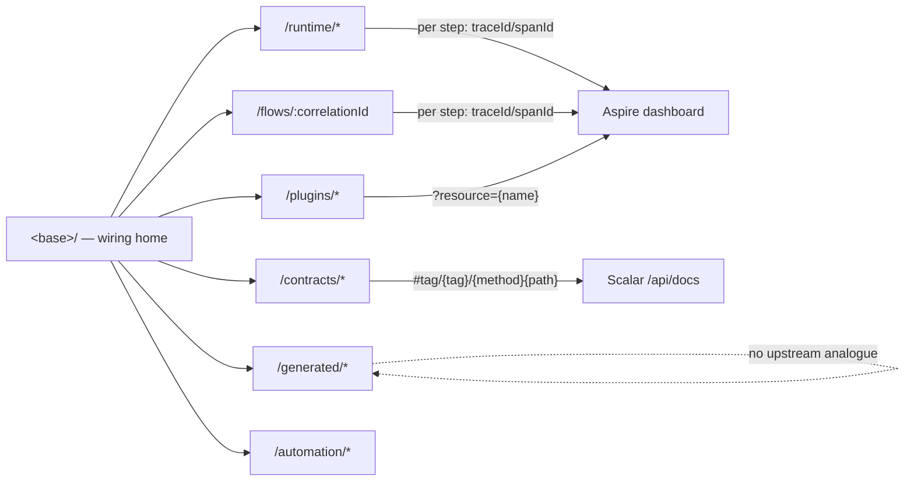

## Information architecture

This section decides the DevTools URL surface, the ownership boundary between Aspire, Scalar and
NetScript, and the state contract every surface must satisfy before it merges. The host's identity,
origin and process shape are decided in **Host shape**; this section designs what hangs off that
origin. Contribution kinds and the zone vocabulary they mount into are decided in **Contribution
kinds**; this section names only the mount points the IA requires. The data plane that feeds these
surfaces is decided in **Data plane**.

Throughout, `<base>` is the DevTools host origin (per **Host shape**: its own Fresh app on its own
port, so DevTools URLs are un-prefixed on their own origin and the user app's `routes/` gains zero
DevTools entries).

### 11.1 Normative acceptance criteria

Epic #400's three acceptance lines are **adopted verbatim as this RFC's normative merge criteria**
for every DevTools surface, first-party or contributed. They are quoted from #400's body
(`research/b1-dashboard-board.md` F3, sourced `gh issue view 400 --json body`), promoted from prose
to criteria per stage-C resolution R2 (`research.md` § Supervisor-delegated decisions).

**AC-1 — Non-duplication.**

> "**Non-duplication.** No dashboard screen may render, as an owned surface: an OTLP trace waterfall
> / span-bar gantt, a structured/console log tail, a metrics chart, a resource start/stop/restart
> panel, or an OpenAPI operation list / try-it console. … Every merged panel must pass **"why can't
> this just deep-link to Aspire/Scalar?"** with a NetScript-only answer recorded in its issue."

Enforcement in this RFC: §11.4 records the NetScript-only answer for every owned surface, and
§11.2's `DL?` column is the evidence a reviewer checks it against. A panel whose capability appears
in §11.2 with owner Aspire or Scalar **and** `DL? = yes` cannot merge as an owned surface.

**AC-2 — One generator, two callers.**

> "**One generator, two callers.** Every dashboard mutation invokes the same contract route / CLI
> scaffolder the terminal does and renders its CLI-equivalent line (`netscript …` CodeBlock). No
> dashboard-only write paths, no forked codegen."

**AC-3 — Flow ≠ waterfall.**

> "**Flow ≠ waterfall.** S13 renders a primitive-grouped causal chain with payloads at seams,
> assembled from NetScript's own seam events; … No span bars, no time-proportional gantt, no log
> tails in S13 — ever."

`<base>/flows/:correlationId` is the S13 surface. Its join key is `netscript.correlation.id`
(`packages/telemetry/src/domain/telemetry-convention.ts:54-56`, via `r5` finding 13).

**Non-goals — the killed-surfaces list, carried forward so it cannot creep back.** #400 records these
as "Killed / folded surfaces … documented so they don't creep back" (`b1` F3). This RFC restates
them as non-goals with their board disposition:

| Killed surface | Board record | Why it stays dead |
| --- | --- | --- |
| Raw OTLP waterfall renderer | folded into #418/S13 as a causal chain | AC-3; Aspire owns `/traces/detail/{traceId}` (§11.2) |
| Logs panel | #421 CLOSED `NOT_PLANNED` (`b1` F4) | Aspire `/structuredlogs/resource/{name}` is deep-linkable |
| Resource start/stop/restart panel | #422 CLOSED `NOT_PLANNED` (`b1` F4) | Aspire owns process lifecycle; mirrored only as `withCommand` inside Aspire (`m4` F13) |
| Service `/health` panel | killed in #400 body | health *display* is Aspire's; the spec is NetScript-generated (`m4` F3) |
| Metrics charts + GenAI conversation view | killed in #400 body | Aspire `/metrics/resource/{r}/meter/{m}/instrument/{i}` is deep-linkable |
| Scalar-style operation list / try-it console | killed in #400 body | Scalar owns reference + try-it; `#tag/{tag}/{method}{path}` is deep-linkable |
| Contribute-into-Scalar (plugin panels inside the API reference) | new non-goal, this RFC | Declined with citation: the vendored bundle `@scalar/api-reference@1.44.15` predates `pluginUrls` (`packages/service/src/primitives/scalar.generated.ts:5`; `grep -c pluginUrls` → 0, `m4` F32/D3) |

### 11.2 Ownership boundary (Q5)

Derived from `research/m4-aspire-scalar.md` § Boundary table, which itself cites fetched `.razor`
sources saved under `research/sources/aspire-dashboard/` and Scalar's configuration reference under
`research/sources/scalar/`. **`DL?` states whether an external deep-link is actually constructible
from the URL evidence** — not whether one is desirable. It is the AC-1 test in tabular form.

| Capability | Owner | DL? | Link shape / note |
| --- | --- | --- | --- |
| Resource list & state | Aspire | yes | `/?resource={name}` (`Resources.razor.cs:78-104`) |
| Resource graph | Aspire | no (page-level only) | `/`; graph is only *disable*-able (`Dashboard:UI:DisableResourceGraph`) |
| Console logs | Aspire | yes | `/consolelogs/resource/{name}` (`ConsoleLogs.razor:2`) |
| Structured logs | Aspire | yes | `/structuredlogs/resource/{name}?traceId=&spanId=&logLevel=` (`StructuredLogs.razor.cs:104-121`) |
| **Filtered log/trace query** | Aspire | **no** | `?filters=` is an opaque internal serialization; the formatter is not a public file (`m4` F11, verified negatively via `curl` 404 + `gh api` directory listing) |
| Traces list | Aspire | yes | `/traces/resource/{name}` |
| Trace / span detail | Aspire | yes | `/traces/detail/{traceId}?spanId={id}` (`TraceDetail.razor.cs:53-58`) |
| Metrics | Aspire | yes | `/metrics/resource/{r}/meter/{m}/instrument/{i}?duration=` (`Metrics.razor.cs:41-53`) |
| Health display | Aspire | partial | resource state on `/`; filterable only via `hiddenHealthStates` |
| Process control (start/stop/restart) | Aspire | **no** | UI action + `ExecuteCommandContext`; no URL invokes it |
| Framework action buttons on a resource | Aspire, contributed by the NetScript AppHost | n/a | `withCommand(...)`; **local dashboard only — vanishes when deployed** (`m4` F14) |
| API schema reference | Scalar | yes | `{serviceOrigin}/api/docs#tag/{tag}` |
| Single operation reference | Scalar | yes | `…#tag/{tag}/{method}{path}` under default slug functions (`m4` F27/F29) |
| Schema / model view | Scalar | yes | `…#model/{slug}` |
| Try-it / request execution | Scalar | partial | reachable by operation anchor; execution state is not in the URL |
| Framework contribution wiring (plugins → axes → registries) | **NetScript DevTools** | n/a | no upstream owner exists |
| Generated-artifact drift (registries, schemas, scaffolds, migrations) | **NetScript DevTools** | n/a | no upstream owner exists |
| Contract provenance (schema → oRPC router → OpenAPI → Scalar) | **NetScript DevTools** | n/a | Scalar renders the *endpoint*, not its provenance chain |
| Primitive run-state (workers/sagas/triggers/streams) | **NetScript DevTools** | n/a | Aspire renders spans, not job/saga/trigger/stream semantics |
| Runtime-domain journeys | **NetScript DevTools** | partial hand-off | own the chain; deep-link out per step to `/traces/detail/{traceId}?spanId=` |
| Framework actions (regenerate, seed, doctor) | **NetScript DevTools** | n/a | Aspire commands are a mirror, not the home (they vanish when deployed) |

Two boundary facts constrain the IA beyond the table:

1. **Aspire's telemetry store is lossy by design** — `MaxLogCount` and `MaxTraceCount` are 10,000
   *shared across resources*, oldest evicted (`m4` F5). DevTools run-state must therefore be its own
   read model, not a projection of the dashboard store, and history older than the eviction window
   renders a `telemetry evicted` marker (§11.6).
2. **Aspire has no additive UI extension point at all** — its UI knobs are subtractive, and the
   in-dashboard Copilot UI was *removed* in 13.3 with agents redirected to the CLI/MCP server
   (`m4` F15). "Contribute a panel into Aspire" is not an option we declined; it does not exist.

### 11.3 Route tree

Two doctrine rules bind the tree:

- **AP-21 — flat command-surface folder.** "A `presentation/`, `routes/`, or `handlers/` folder with
  more than 12 immediate children is a flat list with a path prefix"
  (`docs/architecture/doctrine/09-anti-patterns-and-fitness-functions.md:142-146`). A panel-per-seam
  IA hits this immediately: #400's own board carried 13 screens (`b1` F4).
- **R-FOLD-LAYERING-MODE** names horizontal layering "wrong for **command-like surfaces** — folders
  that hold many sibling user-facing entry points (CLI commands, HTTP routes, message handlers,
  **dashboard pages**)" (`docs/architecture/doctrine/05-folder-structure.md:186-194`). Every segment
  below is therefore a **vertical feature slice** owning its route, handlers, islands and data
  access — not a horizontal `presentation/` pile.

**Decision: seven top-level segments** (home + six named), five under the AP-21 cap, leaving headroom
for a contributed-route kind should one survive **Contribution kinds**.

```text
<base>/                                  Home — "wiring home": only-NetScript stats
                                         (plugins installed, axes wired, contract coverage,
                                         generated-registry freshness, declared-vs-running config)
                                         + contributed home cards
<base>/runtime/                          Primitive run-state — one vertical slice per primitive
  workers/
    jobs/:jobId/executions/:execId       entity URL for one execution (attempts, steps)
  sagas/
    instances/:instanceId                instance timeline incl. `compensating`
  triggers/
    :triggerId/firings                   firing history, cron preview
  streams/
    :streamId/deliveries                 fan-out / delivery state per subscriber
<base>/flows/:correlationId              Journey view — primitive-grouped causal chain (AC-3)
<base>/contracts/                        Contract provenance / coverage / REST-RPC duality
  :serviceId/:operationId                per-operation provenance chain → Scalar out-link
<base>/plugins/                          Plugin registry wiring, doctor, contribution axes
  :pluginId                              detail: axes, doctor rows, version drift, contributions
<base>/generated/                        Generated-artifact state: registries, schemas,
                                         scaffold drift, DB migrations (applied vs pending)
<base>/automation/                       Runtime-automation diagnostics (consumes #1446's
                                         contracts; read-only — management stays in the
                                         operator console, per #1446 P-6)
```



**URL contract decisions.**

1. **Entity state gets entity URLs.** `/flows/:correlationId`,
   `/runtime/workers/jobs/:jobId/executions/:execId`. This adopts the merged routing-resort
   principles P1 ("every entity is a URL segment") and P7 ("`/flows/:correlationId` is a first-class
   journey URL") (`b1` F5) and **supersedes #424's flat deep-link scheme** — the board's one
   recorded contradiction (`b1` F9/D4). Authority is stated honestly: the resort is *committed
   evidence, not ratified architecture* (`b1` F5); this RFC is the ratification vehicle, subject to
   **OF-IA-1**.
2. **The declared-vs-running stack map (#416) folds into Home** rather than taking an eighth
   segment. *Inference: it is a read-only wiring overview, and Home's NetScript-only answer already
   covers wiring facts.*
3. **`/automation/` exists from day one as a staged placeholder** rather than appearing later, so
   the two-hosts boundary is documented inside the product (**OF-IA-4**).

### 11.4 The AC-1 record: why each surface is NetScript-only

| Surface | NetScript-only answer (AC-1, recorded here and repeated in each filed issue) |
| --- | --- |
| Home | Framework wiring facts — installed plugins, contribution axes, contract coverage, registry freshness. Aspire's `/` shows *processes*; it has no concept of a plugin, an axis, or a generated registry (§11.2: "no upstream owner exists"). |
| `runtime/*` | Primitive run-state — executions/attempts, saga instances incl. `compensating`, trigger firings, stream deliveries — assembled from the `netscript.*` attribute root (15 declared domains, `telemetry-convention.ts:14,32-49`) and plugin registries. Aspire renders spans, not job/saga/trigger/stream semantics, and its store is lossy (`m4` F5) so run-state cannot be reconstructed from it. |
| `flows/:correlationId` | The causal chain across seams joined on `netscript.correlation.id` (`telemetry-convention.ts:54-56`). Aspire owns the waterfall; the *journey* — which primitive caused which, with payloads at seams — exists nowhere upstream (§11.2: "partial hand-off"). |
| `contracts/` | The provenance chain schema → oRPC router → OpenAPI → Scalar. Scalar renders the endpoint, not its provenance; coverage/duality (which routes are contract-bound vs raw) is a framework-only fact, and it genuinely varies — see the two debt entries in §11.6. |
| `plugins/` | Contribution-axis map, doctor diagnosis, JSR version drift, duplicate-identity detection. No upstream owner; `plugin doctor` already runs contributed checks (`r4` F2), so rendering it is AC-2 by construction. |
| `generated/` | Generated-surface drift: two divergent registry generators writing to different paths, walker registries leaking on `plugin remove` (`r4` F3/F10), migration applied-vs-pending (#552). Invisible to Aspire and Scalar by construction. |
| `automation/` | Read-only diagnostics over #1446's four stable contracts — management oRPC, audit/history, convergence, OTel vocabulary (`p2` F2). #1446's decision sentence is normative here: "production operator management and developer diagnostics are two distinct hosts and two distinct contribution surfaces — not one ambiguous 'cockpit'" (`p2` F3, RFC:491-493). DevTools correlates convergence and audit to flows; it does not annex management verbs. |

### 11.5 Worked first-party examples

The eight seams, each stating what only NetScript can show and where it links out. Link shapes are
built by the helper in §11.6 — never hand-concatenated in a panel.

| Seam | What only NetScript can show | Links out to |
| --- | --- | --- |
| **Workers** | Job/task registry with schedule intent vs observed drift; execution feed with attempts/retries as `RunRecord` semantics (#428). Empty state renders the `netscript scaffold job …` CLI-equivalent line | per execution → `/traces/detail/{traceId}?spanId=`; per resource → `/structuredlogs/resource/{n}?traceId=&logLevel=error`; queue-depth instrument → `/metrics/resource/{r}/meter/{m}/instrument/{i}` — rendered **only if** `queryMetrics` returns the instrument; whether NetScript emits OTel metrics at all is **unverified** (`r5` OQ7) |
| **Sagas** | Instance table incl. `compensating`; from→to transition/compensation timeline as a state machine, not spans (#429) | per transition → trace/span detail; instance's journey → `<base>/flows/:correlationId` (internal) |
| **Triggers** | Firing history across 8 trigger kinds; enable/disable rendering its CLI-equivalent line; cron preview (#430) | per firing → trace detail; misfire → correlated structured-logs link |
| **Streams** | Fan-out/delivery state per subscriber as framework run-state (#431). Contract-provenance column renders the **labelled degraded state** of §11.6 | per delivery → trace detail; subscriber resource → `/consolelogs/resource/{name}` |
| **Contracts / SDK** | Provenance chain schema → router → OpenAPI → Scalar, and per-service coverage/duality; powered by the pure, IO-free `@netscript/mcp/openapi-projection` (`packages/mcp/openapi-projection.ts:8-38`) — no MCP process required | per operation → Scalar `#tag/{tag}/{method}{path}`; per schema → `#model/{slug}`. **Try-it is always an out-link** (killed surface, §11.1) |
| **Plugin registry** | Installed plugins, contribution-axis map including *dead* axes (ten enum names vs twelve interface keys, `research.md` F18), doctor rows through the existing contributed-checks seam (`r4` F2), JSR version drift, silent-duplicate-identity detection (`r3` F9) | plugin's service resource → `/?resource={name}`; plugin's service API → its Scalar mount |
| **Generated artifacts** | Registry freshness per generator path (manifest-driven vs SDK walker — two mechanisms, two paths, `r4` F3); registries leaked by the walker after `plugin remove` (`r4` F10); migration applied-vs-pending and drift (#552); confirm-gated `migrate`/`seed` rendering the exact CLI line (AC-2) | **none upstream** — this surface has no Aspire/Scalar analogue; links are internal (to `plugins/:id`, to file paths) |
| **Runtime automation** | Convergence state and audit/history *as diagnostics correlated to flows* — read-only projections of #1446's four contracts (`p2` F2-F3) | automation action in a journey → trace detail; operator management → the userland admin console route, as an out-link, never an embed |

### 11.6 Deep-link helper

**No deep-link helper for Aspire or Scalar exists anywhere in `packages/`** — a repo-wide grep for
`traceId=|structuredlogs|/traces/|deepLink` over `packages/**/*.ts(x)` returns three hits, all under
`packages/cli/e2e/` (`r5` finding 8, observed absence); Scalar's only API is
`createScalarDocs`/`createScalarJs`/`createOpenAPISpec` with no anchor helper (`r5` finding 9). The
IA depends on one, so it is a first slice, not a follow-up.

```ts
// packages/plugin-devtools-core/src/domain/deep-link.ts (proposed)

/** Bases are configuration, never constants. `undefined` degrades — it does not throw. */
export interface DeepLinkBases {
  /** Aspire `Dashboard:Frontend:PublicUrl`. Absent ⇒ Aspire links render disabled. */
  readonly aspirePublicUrl?: string;
  /** `Dashboard:Frontend:BrowserToken`, when the AppHost exposes it. */
  readonly aspireBrowserToken?: string;
  /** Origin of the service whose Scalar mount is targeted, e.g. `http://localhost:5100`. */
  readonly serviceOrigin?: string;
}

export type AspireTarget =
  | { readonly kind: 'resource'; readonly resource: string }
  | { readonly kind: 'console-logs'; readonly resource: string }
  | {
    readonly kind: 'structured-logs';
    readonly resource: string;
    readonly traceId?: string;
    readonly spanId?: string;
    readonly logLevel?: 'trace' | 'debug' | 'information' | 'warning' | 'error' | 'critical';
  }
  | { readonly kind: 'trace'; readonly traceId: string; readonly spanId?: string }
  | {
    readonly kind: 'metric';
    readonly resource: string;
    readonly meter: string;
    readonly instrument: string;
    readonly duration?: number;
  };

export type ScalarTarget =
  | { readonly kind: 'tag'; readonly tag: string }
  | { readonly kind: 'operation'; readonly tag: string; readonly method: string; readonly path: string }
  | { readonly kind: 'model'; readonly slug: string };

/** A link is a value with a reason, so the UI can render the degraded case honestly. */
export type DeepLink =
  | { readonly ok: true; readonly href: string; readonly note?: 'will-prompt-for-token' }
  | { readonly ok: false; readonly reason: 'no-base' | 'not-linkable'; readonly detail: string };

export function aspireLink(bases: DeepLinkBases, target: AspireTarget): DeepLink;
export function scalarLink(bases: DeepLinkBases, target: ScalarTarget): DeepLink;
```

Invariants the helper encodes, each with its evidence:

| Invariant | Evidence |
| --- | --- |
| The base is `Dashboard:Frontend:PublicUrl`; `http://localhost:18888` is never hardcoded | `m4` F12 — "The public URL is used when constructing links to the dashboard frontend… important when the dashboard is accessed through a proxy" |
| `?filters=` is **never emitted**; there is no `AspireTarget` variant for a filtered view | `m4` F11 — opaque serialization, verified negatively (404 on the formatter path, absent from the `gh api` directory listing) |
| A logged-in landing uses `{PublicUrl}/login?t={BrowserToken}` only when the token is configured; otherwise the link is emitted with `note: 'will-prompt-for-token'` | `m4` F18 — the token exists "specifically so tooling can automate logging in" |
| Missing base ⇒ `{ ok: false, reason: 'no-base' }`, rendered as a disabled affordance naming the missing setting — never a broken href | design decision, *inference* |
| Scalar tag slugs are oRPC-derived and **not pinned by NetScript** (`createOpenAPISpec` sets only `info` + `servers`); operation anchors are therefore **unverified** until research OQ8 closes, and the helper falls back to the page-level `#tag/{tag}` anchor | `m4` F29 (`packages/service/src/primitives/openapi.ts:74-92,126-134`), marked `inference` there |

**Unverified hinges, named with their closing probe:** whether the generated AppHost sets
`Dashboard:Frontend:PublicUrl` and exposes `Dashboard:Frontend:BrowserToken` to NetScript tooling
(research OQ5 / `m4` OQ2+OQ4 — closes by reading the AppHost generator and a generated
`appsettings`); and the Scalar tag array (research OQ8 — closes by inspecting a generated
`/api/openapi.json`). Both are cheap probes and both must run **before the helper's contract
freezes** (**OF-IA-6**). A related live defect the helper must not inherit: the scaffolded telemetry
template hardcodes `https://localhost:${ASPIRE_DASHBOARD_PORT ?? 18888}` while
`resolveTelemetryEndpoint` prefers `NETSCRIPT_TELEMETRY_ENDPOINT` over `http://…` — a scheme
mismatch that is a silent fetch failure (`r5` drift 2,
`packages/mcp/src/domain/telemetry-endpoint.ts:22-39`).

### 11.7 State matrix

Mandatory and normative: **a surface ships only with all six states specified.** Happy-path
screenshots do not satisfy this section, and the repo's own frontend scope doc names the false-done
modes we are guarding against — "main route works but subpages broken; static check passes but
browser render blocks or shows stale data" (`b2` F12, `SCOPE-frontend.md:32-36`).

```ts
// The state a panel resolves to. Exhaustive — the host renders a case for every arm.
export type PanelState<T> =
  | { readonly kind: 'loading' }
  | { readonly kind: 'empty'; readonly entity: string; readonly cliEquivalent: string }
  | { readonly kind: 'ready'; readonly data: T }
  | { readonly kind: 'degraded'; readonly data: T; readonly label: string; readonly citation: string }
  | { readonly kind: 'incompatible'; readonly id: string; readonly declared: number; readonly hostWindow: readonly number[] }
  | { readonly kind: 'unauthorized'; readonly blockedBy: string; readonly remedy: string }
  | { readonly kind: 'failure'; readonly endpoint: string; readonly source: string; readonly logsLink: DeepLink };
```

**Shared state contracts (every surface):**

| State | Contract |
| --- | --- |
| **Loading** | `fresh-ui` skeletons. Any live-fed panel shows a "connecting" chip carrying the resolved endpoint **and its source** — `resolveTelemetryEndpoint` already returns `source: 'explicit' \| 'netscript_env' \| 'aspire_port' \| 'default'` (`packages/mcp/src/domain/telemetry-endpoint.ts:22-39`), which is exactly the "where is my data coming from" affordance. |
| **Empty** | Never blank. The state names the entity and renders the CLI-equivalent creation command — AC-2 extended from mutations to empty states (**OF-IA-3**). |
| **Degraded** | A *labelled* partial render carrying its citation, never a silently empty panel. The two honest cases are below. |
| **Incompatible** | A contribution whose version-suffixed id falls outside the host's supported window renders a labelled card (id, declared major, host window) in place of the panel. **Never silently dropped** — a deliberate departure from every surveyed system, where bad-target failures are quiet (`m3` X-2); see **OF-IA-2**. |
| **Unauthorized** | Two distinct cases. (a) *Upstream*: Aspire deep-links land on `/login`; with a configured browser token the helper emits `login?t=`, otherwise the link is annotated "will prompt for dashboard token". Telemetry-API reads without the key render an unauthorized state naming `Dashboard:Api:AuthMode=ApiKey` (`m4` F20). (b) *Framework*: any panel needing a credential-bearing typed client renders a blocked state naming the dependency — `createServiceClient` cannot send `Authorization` or `x-api-key` until the RFC-A/#1348 chain lands (`b2` F10, `research.md` F15). |
| **Failure** | Per-contribution error boundary: a loud diagnostic panel with component stack in dev (the polarity is inverted from Grafana's prod-quiet posture because here the operator *is* the author), and the host tree never crashes (`m2` F23/F18 — TanStack's missing boundary is the cautionary absence). Data-plane failures render the failed endpoint, its source, a retry affordance, and the correlated structured-logs out-link. |

**The two honest degradations, modelled explicitly:**

1. **`plugins/streams` has no oRPC contract surface at all.** "Streams is the one plugin with NO oRPC
   contract surface — `@netscript/plugin-streams-core` exposes producer ports … but no
   `contracts/v1`", and the connector is "a **pure transparent proxy**" whose `app.all('/*')`
   catch-all "cannot be expressed as an oRPC router"
   (`.llm/harness/debt/arch-debt.md:450-485`, entry `streams-connector-sound-deferred`). The streams
   contract-provenance panel therefore renders
   `{ kind: 'degraded', label: 'no contract surface — connector is a transparent proxy', citation: 'arch-debt.md#streams-connector-sound-deferred' }`.
   It is not an empty list and not an error. The sibling case is a *fraction*, not an absence:
   triggers has "only ~3 of the 10 business routes … implemented"
   (`.llm/harness/debt/arch-debt.md:424-448`), so its contract column renders a coverage fraction
   linking to that entry.
2. **Filtered Aspire views are not externally deep-linkable.** `?filters=` is opaque (§11.2), so
   per-step links carry only typed parameters (`traceId`, `spanId`, `logLevel`) and **the UI never
   offers a "see all related logs, filtered" affordance** — promising a filtered round-trip we cannot
   construct is the failure mode this rule exists to prevent.

**Per-surface deltas** (only where a surface differs from the shared contracts):

| Surface | Empty | Degraded | Incompatible / Unauthorized / Failure delta |
| --- | --- | --- | --- |
| Home | First run, all wiring facts zero → onboarding card with `netscript plugin add …` | Registry freshness unknown because a generator never ran → "never generated" chip, not a stale number | Per-card boundaries: one failing stat never blanks the grid |
| Workers | No jobs → scaffold CLI line | Metrics column hidden entirely when `queryMetrics` returns nothing (`r5` OQ7, unverified) — no empty chart, which would be a killed surface | Execution feed drop → "reconnecting" with a stale-data timestamp |
| Sagas | No instances → scaffold line | Steps older than Aspire's 10k eviction window (`m4` F5) → timeline marks "telemetry evicted"; run-state itself survives because it is not derived from the dashboard store | — |
| Triggers | "No firings yet" and "no triggers defined" are **distinct** states | Contract coverage fraction (~3 of 10 routes) with a link to the debt entry | Enable/disable disabled until its contract route exists, naming the co-requisite issue ("no panel before its route", #553) |
| Streams | No streams → scaffold line | The labelled no-contract-surface state above | — |
| Flows | No correlated events → "no journey recorded" plus which sources were queried | Two: (a) until the #557 seam-event plane lands, the chain is a correlation-only join and labels itself "correlation fidelity" rather than "boundary-event fidelity"; (b) no filtered-log round-trip (above) | Steps whose spans were evicted render as chain nodes without trace out-links |
| Contracts | Service with zero contract routes → coverage 0% (real, for streams) | Per-service spec fetch failure degrades that row only; other services render | Scalar operation anchors flagged unverified until OQ8 closes; helper falls back to `#tag/{tag}` |
| Plugins | No plugins → `netscript plugin add` line | Doctor unavailable (no AppHost running) → axis map renders from static registries, doctor rows show "requires running app" | Duplicate plugin identity (`r3` F9) renders a loud conflict row, never last-writer-wins silence |
| Generated | Nothing generated → per-generator "never run" + CLI line | Registries leaked after `plugin remove` (`r4` F10) → drift rows naming the owning generator; the existence-only write assertion is labelled as such | `migrate`/`seed` confirm dialog shows the exact CLI line; DB unreachable → failure state naming the connection source |
| Automation | #1446's contracts not landed → the whole surface renders a staged "awaiting runtime-automation contracts" card naming the RFC — this is a *surface-level* incompatible state | Convergence readable but audit store empty → partial render with per-contract availability chips | Unauthorized: management oRPC needs the RFC-A auth chain; read-only projections state their principal |

### 11.8 Owner forks raised by this section

| # | Fork | Recommendation |
| --- | --- | --- |
| **OF-IA-1** | Is this RFC the ratification vehicle for the entity-URL contract, superseding #424's flat scheme? The routing resort was committed via #685 but never ratified (`b1` F5/F9/D4) | Yes — ratify here, and record #424's scheme as superseded rather than silently ignored |
| **OF-IA-2** | Loud labelled incompatible/degraded cards depart from every surveyed system's quiet failure (`m3` X-2), at the cost of shell complexity per state | Confirm the departure — in a devtool the operator *is* the author |
| **OF-IA-3** | AC-2's CLI-equivalent line is extended from mutations to **empty states**, making the CLI-line renderer a dependency of every surface | Confirm, or downgrade to recommended-not-required |
| **OF-IA-4** | `/automation/` renders a staged placeholder until #1446's contracts land; the alternative is omitting the segment until then | Placeholder — it documents the two-hosts boundary inside the product (*inference*) |
| **OF-IA-6** | The two unverified hinges inside the deep-link helper — `PublicUrl`/browser-token acquisition (research OQ5) and Scalar tag-slug stability (research OQ8) | Both probes run before the helper's contract freezes |

*(OF-IA-5 — follow-up-RFC sequencing against the #890 spine fork — is raised in **Staging and
follow-up RFCs**, where it belongs.)*
