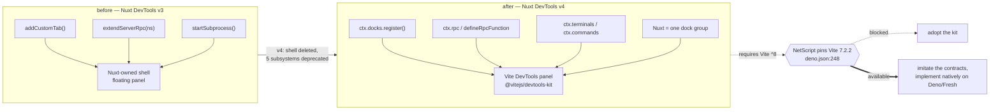

## Prior art and market architecture study

This section is an **architecture** study, not a feature survey. It exists to settle three things the
rest of the RFC depends on: which upstream contracts NetScript imitates, which upstream *mechanisms*
NetScript must refuse, and which questions the market leaves genuinely unanswered so that NetScript
must decide them itself.

Citation convention: `m1`–`m4` are the stage-B corpus files under
`.llm/runs/plan-devtools-contribution--seed/research/`; `sources/…` are verbatim upstream artifacts
saved under `research/sources/` on 2026-08-11. Repo claims cite `path:line` at baseline `2256a67bf`.

### 12.1 The headline: the closest analogue deleted its own shell, and its replacement is out of reach

**Nuxt DevTools v4 removed the framework-owned devtools shell.** The floating panel is gone; Nuxt
DevTools is now a dock entry nested under a `Nuxt` group inside the Vite DevTools panel, and the
`viteDevTools` module option was deleted because the integration is unconditional
(`sources/nuxt-devtools__docs_content_2.module_3.migration-v4.md:283-286`; `m1` F1). All five of
Nuxt's bespoke subsystems were deprecated or deleted in the same release — the shell, the
namespaced-pair RPC (`extendServerRpc`, `NDT_DEP_0003`), the subprocess/terminal system
(`startSubprocess`), the VS Code integration, and global-install mode
(`…migration-v4.md:6-35,37-133,151-281`; `m1` D1). `vite-plugin-inspect` made the same move at v12:
its standalone `/__inspect/` route disappeared and it became a panel inside Vite DevTools
(`sources/vite-plugin-inspect__README-v11.md:35` vs `sources/vite-plugin-inspect__README.md:11-35`;
`m1` F25).

This is the single most useful datum in the entire study, because it is a *published regret list*
from the project whose position NetScript is about to occupy.

And the replacement is **not adoptable at this baseline**. Vite DevTools requires Vite 8;
`@nuxt/devtools` narrowed `peerDependencies.vite` to `^8.0.14`; `vite-plugin-inspect` v12 requires
Vite ≥ 8 plus `@vitejs/devtools` ≥ 0.4.0
(`sources/vite-devtools__docs_guide_index.md:28-37`;
`sources/nuxt-devtools__docs_content_2.module_3.migration-v4.md:287-289`;
`sources/vite-plugin-inspect__README.md:11-15`). NetScript pins **Vite 7.2.2** (`deno.json:248`,
`packages/fresh/deno.json:56`).

**Decision M-D1 — imitate the contracts, implement natively.** The RFC treats
`@vitejs/devtools-kit` as a *specification to imitate at the contract layer* and Nuxt v4 as the
*cautionary record of what a framework-owned shell costs*. NetScript adopts contract **shapes** —
one registration hook, a serializable view descriptor, named prefixed RPC, handle-based update, a
launcher state, a zero-client-code panel tier — and implements mounting, static hosting, and process
control natively on Deno/Fresh, because each of those three is Node-bound or Vite-8-bound upstream
(`m1` applicability verdict; `m1` F28/D2). This is not a preference: at Vite 7.2.2 an RFC that
assumes `ctx.docks.register` is *available* rather than *imitated* is unbuildable.

The corresponding scoping decision is that a **Vite 8 migration is not a prerequisite of this RFC**.
Nothing in the imitated contract set requires it, and coupling a DevTools RFC to a build-toolchain
major bump would make the whole family hostage to an unrelated migration. If NetScript later moves to
Vite 8, the imitated contracts are the migration seam, because they were shaped to match.

### 12.2 Category 1 — developer tooling (Vite DevTools / Nuxt DevTools, TanStack Devtools, vite-plugin-inspect)

These are the systems in NetScript's actual category. Their shared architecture is: contribution is
**registration code that never runs when devtools are off**, contributed views are **serializable
descriptors**, and the data channel is a **named bidirectional RPC or event bus** between the browser
panel and the dev server.

- **Registration seam.** A DevTools plugin is a Vite plugin with one extra hook,
  `devtools.setup(ctx)`, which "runs once during Vite server initialization, when DevTools is
  enabled" (`sources/vite-devtools__docs_kit_devtools-plugin.md:7,67`; `m1` F2). The hook is not
  called at all when devtools are disabled — dev-only-by-construction *at the registration layer*,
  which is a stronger guarantee than a runtime branch.
- **View descriptor.** Six dock types with different isolation postures: `iframe`, `action`,
  `custom-render`, `launcher`, `json-render`, `group`
  (`sources/vite-devtools__docs_kit_dock-system.md:11-19`; `m1` F3). Every entry carries the same
  declarative base fields — `id`, `title`, `icon`, `category`, `defaultOrder`, `when`, `visibility`,
  `badge`, `groupId` (ibid.`:554-568`; `m1` F16). Group membership is "a flat pointer, not
  containment": an orphan member whose group was never registered renders as a normal top-level
  entry, and an empty group stays hidden (ibid.`:495`). That orphan rule removes the registration-order
  dependency entirely and is worth copying verbatim.
- **Host serves the contributed UI.** `ctx.views.hostStatic('/__my-plugin/', clientPath)` — the host
  owns dev middleware and build-time copying
  (`sources/vite-devtools__docs_kit_devtools-plugin.md:115-144`; `m1` F4). The *old* Nuxt model was
  the opposite: "You need to serve your module's view yourself"
  (`sources/nuxt-devtools__docs_content_2.module_0.guide.md:20`). Host-serves is the corrected model.
- **Live update is a handle, not a re-run.** `register()` returns a handle with `update(patch)`;
  Nuxt's `refreshCustomTabs()` re-evaluation model is deprecated `NDT_DEP_0006` explicitly because of
  it (`sources/vite-devtools__docs_kit_dock-system.md:570-579`;
  `…migration-v4.md:232-244`; `m1` F17).
- **The god-interface counter-example.** Nuxt's legacy `ServerFunctions` is one flat interface of ~40
  methods spanning config reads, storage mutation, filesystem mutation (`writeStaticAssets`,
  `deleteStaticAsset`), package management (`runNpmCommand`, `installNuxtModule`), process control
  (`restartNuxt`) and auth (`sources/nuxt-devtools__packages_devtools-kit_src__types_client-api.ts:12-85`;
  `m1` F22). Doctrine names this shape AP-3 (god interface) independently; the market supplies the
  worked example.
- **TanStack is the minimal end and shows what minimalism costs.** There is no registry — a
  `TanStackDevtoolsCore` is constructed with a literal `plugins: Array<TanStackDevtoolsPlugin>` the
  app author writes, and identity falls back to a positional
  `${name}-${index}` when `id` is omitted
  (`sources/tanstack/packages_devtools_src_core.ts:19-32,50-57`;
  `sources/tanstack/packages_devtools_src_context_devtools-context.tsx:125-136`; `m2` F1, F3). The
  plugin contract is DOM-level — `render(el: HTMLDivElement, props) => void` — which is what makes
  cross-framework panels possible at all (`…devtools-context.tsx:21-77`; `m2` F2), and the React
  adapter is a `createPortal` bridge into the container the core handed back
  (`sources/tanstack/packages_react-devtools_src_devtools.tsx:174-216,241-247`; `m2` F4) — a direct
  template for a Preact/Fresh island adapter.
- **TanStack's gap is failure containment.** Nothing in `core.ts`, the plugin type, or the React
  adapter wraps a plugin's `render` in a boundary (`m2` F11, marked *inference* over the three files
  that own the mount path; `packages/devtools/src/mount-impl.tsx` was not fetched — **unverified**).
  A throwing panel takes the surrounding tree down under default React semantics.
- **A devtools channel becomes privileged fast.** TanStack's dev-server plugin subscribes
  `devtoolsEventClient.on('install-devtools', …)` *from the panel* and installs an npm package on the
  developer's machine, gated only on "dev server only", with no per-plugin permission concept
  (`sources/tanstack/packages_devtools-vite_src_plugin.ts:280-305`; `m2` F10). This is the concrete
  precedent behind this RFC's trust-model constraints — see the trust-model section.

### 12.3 Category 2 — production admin consoles (Medusa, Directus, Strapi, Backstage, Grafana)

These are **not** NetScript DevTools' category, and the whole point of surveying them is to establish
precisely which of their costs NetScript declines. All five are long-lived authenticated surfaces
that operate on real data, and their architecture shows it in four consistent places: the extension
surface is closed or explicitly registered, never free-form; contributions are build-time and
compiled into the console bundle; identity is validated by manifest or build-time AST pass; and
auth/RBAC is part of the contribution contract (`m3` summary).

**The correction that matters most to this RFC: "inspired by Medusa zones" is wrong about Medusa.**
Medusa's zone vocabulary is a **flat, closed, core-owned** `{page}.{location}` namespace — 20+ page
categories, and there is no documented facility anywhere for a plugin to mint a new zone (`m3` M-2,
citing fetch-log F4). Validity is enforced at **build time** by an AST pass:
`admin-vite-plugin/src/widgets/generate-widgets.ts` extracts the `zone` value (string literal and
array-of-strings only — **template literals are explicitly rejected with a warning**, so a
dynamically-computed zone string is unrepresentable by construction), filters it through
`isValidInjectionZone()`, and returns `null` so the file yields no widget entry at all (`m3` M-4,
fetch-log F3). Two consequences follow directly:

1. **In a closed vocabulary, name collision is impossible.** Any RFC that budgets design effort on
   "zone collision policy" while citing Medusa is solving a problem Medusa's design eliminated (`m3`
   X-1; resolution R5 in `research.md`).
2. **The plugin-minted zone model is Strapi's, not Medusa's.** Strapi lets any plugin declare its own
   `injectionZones` in `register()`, three levels deep (`module → container → block`), with other
   plugins injecting in `bootstrap()` behind a caller-side `if (plugin)` presence guard — the
   framework provides no dependency declaration, and an unknown-zone lookup returns an empty array at
   runtime (`m3` S-2, S-3, S-4, fetch-log F11/F12). The open model is what forces the two-phase
   lifecycle and the defensive guard; that complexity is the price of minting.

Grafana is the maturity end of this category and supplies the two mechanisms worth taking almost
verbatim, plus one instructive absence:

- **Version-suffixed ids are the entire compatibility protocol.** Extension point and component ids
  carry a major-version suffix (`myorg-foo-app/toolbar/v1`); non-breaking additions need no new
  version, breaking changes mint a new suffix, and both majors are served concurrently through a
  deprecation window (`m2` F16). Prefix namespacing is *enforced*, not conventional —
  `isExtensionPointIdValid` behind `validateExtensionPoint`, with named errors
  `INVALID_EXTENSION_POINT_ID_PLUGIN` / `…_GRAFANA_PREFIX` / `…_GRAFANA_EXPOSED`
  (`sources/grafana/src_validateExtensionPoint.ts:33-39`; `sources/grafana/src_errors.ts:1-7`;
  `m2` F13). Grafana derived its whole compatibility story from a string that already had to be
  unique.
- **The failure mode is degrade, never throw.** An invalid or unregistered extension point yields
  `{ components: [], isLoading: false }` plus a logged error whose text says so outright —
  "Returning an empty array of extensions" (`sources/grafana/src_validateExtensionPoint.ts:33-50`;
  `sources/grafana/src_errors.ts:9-10`; `m2` F18). Registration-time validation rejects individual
  bad contributions with `continue`, never aborting the registry build
  (`sources/grafana/src_AddedComponentsRegistry.ts:47-58`; `m2` F20).
- **Per-extension error boundary — the highest value-per-line mechanism in the corpus.**
  `ExtensionErrorBoundary` logs `Extension "${pluginId}/${extensionTitle}" failed to load.` with the
  component stack and renders its alert fallback only when `isGrafanaDevMode() ||
  fallbackAlwaysVisible`, otherwise `null` (`sources/grafana/src_ExtensionErrorBoundary.tsx:22-40`;
  `m2` F23). A broken panel is invisible to end users and loud to developers.
- **Strictness is dev-gated with a stated tightening path.** Both the id check and the meta-info
  check are wrapped in `isGrafanaDevMode()`, and several error strings say verbatim: "Currently, this
  is only required in development but will be enforced also in production builds in the future."
  (`sources/grafana/src_validateExtensionPoint.ts:34-47`; `sources/grafana/src_errors.ts:25-32,36-46`;
  `m2` F19). This is the adoption ramp a 0.0.x framework should copy as a *posture*, not just a flag.
- **The instructive absence: nobody solved ordering.** Grafana appends in plugin load order —
  `registry[extensionPointId] = slice.concat(result)` — with no priority or sort API
  (`sources/grafana/src_AddedComponentsRegistry.ts:79-81`; `m2` F21). Medusa deprecated its
  positional `.before`/`.after` zone suffixes in v2.17.2 and does not document ordering within a zone
  at all (`m3` M-3, M-8 — **unverified**; verifying would mean reading the sort applied to the
  generated `widgets: [...]` array in `packages/admin/dashboard`). TanStack's identity is literally
  positional-index-based (`m2` F3). If NetScript's DevTools surface has a user-visible ordering,
  "load order" is a non-answer and the design is net-new — the RFC must specify either an explicit
  `order` on the contribution or a host-owned canonical ordering. This is the clearest place where
  copying the market leaves a hole.

Backstage supplies the cost datum. Plugins are npm packages consumed into the app's own build, which
makes plugin installation a rebuild-and-redeploy event; Red Hat Developer Hub's remedy was
Scalprum/module-federation runtime loading plus declarative `dynamic-plugins.yaml` /
`dynamicRoutes` / `mountPoints` config, framed as "install, configure, and load plugins at runtime
without changing or rebuilding the application" (`m3` B-1, B-4, B-5, fetch-log F15/F16). Note that
the escape from build-time coupling *reintroduces* a Medusa-style declarative mount-point vocabulary —
you do not get to skip the placement contract, you only get to move when it is resolved.

### 12.4 The separation verdict (Q4) — why admin-console mechanisms do not transfer

This is settled ground for the RFC, not an open fork. It is answered twice over: by RFC #1446 P-6's
decision sentence — "production operator management and developer diagnostics are two distinct hosts
and two distinct contribution surfaces — not one ambiguous 'cockpit.'" (`research.md` F3, citing
`p2` F1-F3 at RFC:491-493) — and independently by the evidence below (`research.md` R3).

| Property | Production admin console | Developer diagnostics tool | Evidence |
| --- | --- | --- | --- |
| Trust model | Third-party code may be untrusted; isolation is a shipped feature. Directus offers an opt-in VM sandbox with declared `requestedScopes` (log/sleep/request with URL+method allowlists); unsandboxed extensions "execute code inside the Directus server" | Contributions are first-party packages in one workspace, already trusted at the `import` level | `m3` D-5, D-6 (fetch-log F5/F6/F8) |
| Lifetime | Long-lived deployment; plugin install/upgrade is an operations event — hence RHDH's runtime loading from NPM/tarball/OCI | Lives as long as the dev process; restart is free, so module-federation machinery is pure cost | `m3` B-4 (fetch-log F16) |
| Auth / RBAC | On the contribution itself: Strapi links carry `permissions: [{ action: 'admin::audit-logs.read' }]`; Directus gates Studio entry behind App/Admin Access policy flags and counts seats | No role model to gate against; the audience is the developer who owns the process | `m3` S-6, D-7, X-4 (fetch-log F9/F12) |
| Data freshness | Host fetches and passes a typed slice down: `({ data }: DetailWidgetProps<AdminProduct>)`; list zones get no data at all | Diagnostics data is streaming and continuously invalidated. **No admin console surveyed documents a push/stream contract to contributed UI** | `m3` M-7 (fetch-log F1/F4) |
| Build inclusion | Compiled into the console bundle — the console *is* the product | Must be excluded from the production build; exclusion, not federation, is the correct answer | `m3` M-6, S-8 (fetch-log F2/F3/F10) |
| Failure tolerance | Quiet degradation: invalid zone dropped at build with a warning (Medusa); unknown zone → empty array (Strapi) | The operator *is* the author, so a silently-missing panel is a debugging trap. Loud failure is affordable — and is a deliberate departure from all four systems | `m3` M-4, S-4, X-2 |
| Version compatibility | Declared data: Directus requires `host: z.string()` in a zod-validated manifest, checked before load | In-workspace contributions version-lock with the framework by construction (one lockfile) | `m3` D-2, D-3 (fetch-log F7/F8) |

**Sharp form.** Admin consoles pay for *untrusted third-party code deployed into a long-lived,
RBAC-governed, production-data surface*. Sandboxing, manifest host ranges, per-contribution RBAC and
runtime module federation are all costs of that **one** condition. A developer diagnostics tool
satisfies **none** of the antecedents. Copying the mechanisms without the antecedent imports
Backstage's cost for none of its benefit (`m3` separation verdict; B-6, marked *inference*).

Two honest qualifications on this verdict:

- Grafana's sandbox is not the foundational trust boundary it is often assumed to be. It is public
  preview from Grafana 11.5, opt-in **per plugin id** via `enable_frontend_sandbox_for_plugins`,
  unsupported for Angular plugins, and not applied to Grafana-Labs-signed plugins — retrofitted a
  decade into the ecosystem and, being retrofitted, unmakeable-mandatory
  (`sources/grafana/sandbox_README.md:5-25`; `sources/grafana/plugin-frontend-sandbox.html`;
  `m2` F24). The real historical trust model was signing plus "don't install plugins you don't trust".
- Grafana has **no capability/permission grammar at all**. The only dials are load/no-load via
  signing, sandbox/no-sandbox per id, and `limitPerPlugin` at each point (`m2` F25, marked
  *inference* from the exhaustive field listings in `sources/grafana/plugin-json.html` and
  `sources/grafana/ui-extensions.html`). Inventing a capability grammar before an untrusted
  contributor exists would be speculative design with no market precedent.

Declining these mechanisms is **not** a claim that NetScript DevTools is isolated or secure. It is a
claim that the *antecedent condition* those mechanisms address does not hold here. The properties
NetScript must actually prove — production absence, generator-spawn scoping, write containment — are
executable-gate obligations owned by the trust-model section, and drift `D-7` records that the
runtime-registry generator subprocess is spawned with valueless `--allow-read`/`--allow-write`, i.e.
whole-filesystem, today (`packages/cli/src/public/features/generate/plugins/installed-runtime-registry-generator.ts:416-417`).

### 12.5 Category 3 — the upstream surfaces NetScript deep-links to (Aspire Dashboard, Scalar)

These are not contribution models to imitate. They are **fixed surfaces NetScript hands off to**, and
the architectural question about them is exactly one: what can be linked, and what cannot.

**Aspire Dashboard is a fixed, non-extensible Blazor app with a fully enumerable route table.** Its
pages are `/login`, `/` (Resources), `/consolelogs[/resource/{name}]`,
`/structuredlogs[/resource/{name}]`, `/traces[/resource/{name}]`, `/traces/detail/{traceId}`, and
`/metrics[/resource/{r}[/meter/{m}[/instrument/{i}]]]`
(`sources/aspire-dashboard/*.razor` `@page` lines; `m4` finding 1). Deep-linking is real and cheap:
`/traces/detail/{traceId}?spanId=` (`TraceDetail.razor.cs:53-58`),
`/structuredlogs?traceId=&spanId=&logLevel=&logEntryId=` (`StructuredLogs.razor.cs:104-121`) — the
single most valuable link for a "journey → logs" jump — and `/?resource={name}&view=…`
(`Resources.razor.cs:78-104`) (`m4` findings 6-10).

**One deep link is not constructible: a filtered view.** Both the structured-logs and traces pages
accept `?filters=<SerializedFilters>`, but the serialization is an internal format
(`StructuredLogs.razor.cs:117-119`, `Traces.razor.cs:104-105`), and the formatter is not present at
`src/Aspire.Dashboard/Utils/TelemetryFilterFormatter.cs` (fetch → HTTP 404; the directory listing
contains no such file) (`m4` finding 11, *observed negative*). Filter deep-links are **unavailable**;
only the typed route/query parameters are contract.

**Aspire has no panel, page, or plugin extension point.** Its UI configuration is purely subtractive
(`Dashboard:UI:DisableResourceGraph`, `DisableImport`, `DisableAgentHelp`). The only additive
contribution is a model-level **resource command** (`withCommand` with `executeCommand`,
`updateState`, `iconName`) — and those are explicitly local-dashboard-only: "They're not available
when running the dashboard in Azure Container Apps"
(`sources/aspire-dashboard/doc-custom-resource-commands.md:109-144` and its Caution block;
`m4` findings 13-15). Aspire commands are therefore a **mirror, not a home**, for framework actions.

Two further constraints on any hand-off design. First, links must be built from a configurable base:
`Dashboard:Frontend:PublicUrl` is "used when constructing links to the dashboard frontend… important
when the dashboard is accessed through a proxy" — a helper must not hardcode `http://localhost:18888`
(`m4` finding 12). Second, the dashboard telemetry store is **memory-bounded and lossy by design**
(`MaxLogCount` 10,000 and `MaxTraceCount` 10,000 shared across resources, `MaxMetricsCount` 50,000
per resource, oldest evicted) — no DevTools claim of durable history can be satisfied by it
(`m4` finding 5).

**Aspire's trajectory is a precedent, not a coincidence:** the in-dashboard Copilot UI was *removed*
in 13.3 and agents were redirected to the CLI/MCP server (`m4` finding 15). Dashboard = fixed human
viewer; agent integration = external API.

**Scalar is the inverse case — a rich extension surface NetScript has already thrown away.** Scalar
ships a real plugin system (`plugins: ApiReferencePlugin[]`, `pluginUrls: string[]`, spec-extension
renderers, `onInit`/`onConfigChange`/`onDestroy` hooks) and a documented anchor grammar —
`#tag/{tag}`, `#tag/{tag}/{method}{path}`, `#model/{slug}`, `#webhook/{slug}`,
`#description/{heading}` (`sources/scalar/plugins.md:19-190`;
`sources/scalar/configuration.md:1170-1268`; `m4` findings 27, 30-31). NetScript reaches none of it:
`createScalarDocs` emits a hardcoded HTML string with a frozen config, and `ScalarDocsOptions` is
three fields wide — `specUrl`, `title?`, `theme?` narrowed to 5 of Scalar's 12 themes
(`packages/service/src/primitives/openapi.ts:48-55,108-140`; `m4` findings 24-25, 33). **The ceiling
today is NetScript's own type, not Scalar's.** And the vendored bundle is pinned at
`@scalar/api-reference@1.44.15`, which contains `generateOperationSlug`, `pathRouting` and
`onSidebarClick` but **not** `pluginUrls` (`packages/service/src/primitives/scalar.generated.ts:5`;
`grep -c pluginUrls` → 0) — so any "contribute into Scalar" thesis is blocked on a bundle bump
(`m4` finding 32, drift 3).

One open risk, stated as such: NetScript passes no `generate*Slug` overrides, so a generated
`#tag/{tag}/{method}{path}` link depends on whatever `tags` `@orpc/openapi` emits, and
`createOpenAPISpec` sets only `info` + `servers` (`openapi.ts:74-92,126-134`). **Tag naming is
oRPC-derived and not pinned by NetScript** — a fragile hinge for any generated deep link (`m4`
finding 29, marked *inference*; verified by inspecting a generated `/api/openapi.json` `tags` array).
The gate that would close it is a deep-link contract test asserting anchor stability against a
generated spec. Note also that **no deep-link helper exists anywhere in `packages/`** for either
upstream today, despite both grammars being stable and documented (`m4` drift 5) — the hand-off
thesis has no implementation seam at baseline.

### 12.6 Comparison table

Rows are grouped by category. "Ordering" is called out because it is the one axis the market
uniformly fails to answer.

| System | Mount model | Contribution unit | Versioning | Isolation | Production behavior | Ordering |
| --- | --- | --- | --- | --- | --- | --- |
| **Vite DevTools / Kit** | Embedded client injected via `transformIndexHtml`, or standalone page | Vite plugin + `devtools.setup(ctx)` hook; `DockEntry` descriptor | Package semver + TS module augmentation + coded diagnostics; the only versioned wire artifact is the remote descriptor's `v: 1` (`m1` F19, *inference*, wire handshake **unverified**) | Six dock types, six postures; `custom-render` explicitly "skip[s] iframe isolation"; no `sandbox` attribute documented | **Re-targeted, not stripped.** Build mode dumps RPC results to `__rpc-dump/*.json`; `build.withApp` writes DevTools into the app build; **client auth disabled in build mode** (`DTK0008`) | Declarative `defaultOrder` on the entry; flat `groupId` with orphan→top-level fallback |
| **Nuxt DevTools v4** | None of its own — a dock group inside Vite DevTools | Deprecated shims over the Vite hosts (`NDT_DEP_0003`–`0007`) | Migration guide + deprecation codes; no shim beyond removal notes | Same-origin iframes get `__NUXT_DEVTOOLS__` injected with live app access; `allow` allowlist only | Inherits Vite DevTools | Inherited; legacy `category` only |
| **TanStack Devtools** | `core.mount(el)`; shell lazily imported as a separate chunk | Literal `plugins: []` array the app author writes; `render(el) => void` | None. No handshake, no manifest, no id-uniqueness | **None** — no boundary on the mount path (`m2` F11, *inference*, `mount-impl.tsx` **unverified**) | **Two independent mechanisms**: `NODE_ENV !== 'development'` folded no-op + a Vite `transform` deleting call sites, gated `command !== 'serve' \|\| mode === 'production'` | Array position; identity itself is positional when `id` omitted |
| **vite-plugin-inspect v12** | None of its own — a panel inside Vite DevTools (v11 had `/__inspect/`) | Vite plugin, `devtools: true` | Requires Vite ≥ 8 + `@vitejs/devtools` ≥ 0.4.0 | Inherited | `devtools.build.withApp` | Inherited |
| **Medusa admin** | Compiled into the admin bundle (Vite v5), served at `/app` | `defineWidgetConfig({ zone })`, zone from a **closed core-owned** list | Not surveyed as a declared field | None — same bundle | Contribution *is* the product | **Unspecified**; `.before`/`.after` deprecated in v2.17.2 (`m3` M-8, **unverified**) |
| **Strapi admin** | Admin bundle rebuild | `registerPlugin({ injectionZones })` in `register()`, `injectComponent` in `bootstrap()` — **plugin-minted** zones | Not a declared field; caller-side `if (plugin)` guard | None | Contribution *is* the product | Two-phase lifecycle orders *declaration vs injection*, not siblings within a zone |
| **Directus** | Build + load into the Data Studio | zod-validated `directus:extension` manifest; discriminated union app/api/hybrid/bundle | **Required `host: z.string()` semver range**, checked before load | Opt-in VM sandbox with `requestedScopes` (log/sleep/request + URL allowlist); default is full trust | Contribution *is* the product; Studio entry is an RBAC policy flag | Not surveyed |
| **Backstage / RHDH** | npm package into the app's build; RHDH adds Scalprum/module federation | Published npm package; extension tree with parent attachment and overrides | npm semver on `@backstage/*` peers; no manifest host range in the pages surveyed (`m3` B-8, absence-within-set) | None documented | Plugin install = rebuild + redeploy; RHDH's remedy is runtime load + restart | Override precedence by id; tree position |
| **Grafana** | Loaded into the running console | `AppPlugin.addComponent/addLink/addFunction/exposeComponent` + mirrored `plugin.json` entries | **Version-suffixed ids** (`org-app/toolbar/v1`), concurrent majors, deprecation window; `dependencies.grafanaDependency` semver (unsatisfied-range behavior **unverified**, `m2` F17) | Opt-in near-membrane sandbox per plugin id, preview from 11.5; per-extension React error boundary | Meta-info validation is `isGrafanaDevMode()`-gated; production enforcement stated as future work | **Load order, `concat`, no priority API** |
| **Aspire Dashboard** | n/a — fixed Blazor app, deep-link target only | Resource commands only (model-level, **local dashboard only**) | n/a | n/a | Custom commands vanish when deployed | n/a |
| **Scalar** | Mounted by NetScript at `/api/docs` from an inlined bundle | Upstream: `plugins` / `pluginUrls`. In NetScript: **nothing** — `ScalarDocsOptions` is 3 fields | Vendored pin `1.44.15`, predates `pluginUrls` | n/a | Ships in production as the API reference | n/a |

### 12.7 Three overturned assumptions

Each of these is a belief likely to enter a DevTools RFC unchallenged, and each is false against
primary sources. They are recorded here because a design built on any of them fails.

**A1 — "DevTools are stripped in production."** False upstream. Vite DevTools' build mode is a
*supported target*: `build.withApp: true` writes DevTools output into the app's build directory, RPC
results are pre-computed into `__rpc-dump/*.json`, and in build mode **client auth is disabled by
construction** — `DTK0008`: "Client authentication is disabled. Any browser can connect to the
devtools and access your server and filesystem"
(`sources/vite-devtools__docs_guide_index.md:138-163`; `sources/vite-devtools__docs_kit_rpc.md:116-207`;
`sources/vite-devtools__docs_errors_DTK0008.md:13-19,46-50`; `m1` D4, F10, F11). The only
*automatic* strip is embedded-client injection, and its manual escape hatch pushes the prod guard onto
the user. **Consequence:** NetScript's production posture must be *stricter than every system
surveyed* — absence, not a re-targeted static dump — and TanStack's design point applies: use **two
independent** exclusion mechanisms, because TanStack explicitly distrusted one signal after hosting
providers set `command`/`mode` inconsistently (`m2` F6, F7). Proving absence is an executable-gate
obligation, not an assertion; the gate is owned by the trust-model section.

**A2 — "iframe means the contribution is sandboxed."** False. Nuxt deliberately breaks it: when a
contributed iframe is served same-origin, DevTools "will automatically inject `__NUXT_DEVTOOLS__` to
the iframe's window object", giving the contributed frame live access to the running app's Vue
instance (`sources/nuxt-devtools__docs_content_2.module_1.utils-kit.md:300,338`; `m1` F13, D3). No
`sandbox` attribute is documented anywhere — isolation is an `allow` permission allowlist merged onto
`clipboard-read`/`clipboard-write` defaults
(`sources/nuxt-devtools__docs_content_2.module_0.guide.md:62-75`; `m1` F14). And Vite DevTools' own
`custom-render` dock type is documented as being for authors who "want to skip iframe isolation"
(`sources/vite-devtools__docs_kit_dock-system.md:251`; `m1` F3). **Consequence:** "we use iframes" is
not an isolation claim in this RFC, and must never be written as one. Whether any NetScript-hosted
frame is isolated is an unproven property until a gate asserts the frame attributes and the
same-origin injection policy.

**A3 — "`transformIndexHtml` injection will mount our client."** Silently no-ops for NetScript's
shape. The upstream doc is explicit: "Injection rides on Vite's `transformIndexHtml` hook, so it
requires an HTML page that Vite itself serves and transforms. Setups where the HTML comes from
elsewhere skip it: Backend integration… Middleware mode… JS-only entries"
(`sources/vite-devtools__docs_kit_client-context.md:86-105`; `m1` F9). Injection is additionally
dev-server-only, client-env-only, and top-frame-only, logging `[VITE DEVTOOLS] Skipping in iframe`
inside a frame (ibid.`:34-38`; `m1` F8). Fresh 2 renders its own HTML, which places NetScript in the
documented failure bucket. **Consequence:** mounting must be a NetScript-owned route/middleware on the
Fresh dev server, never an HTML-transform hook — see the host-shape section, which owns the decision.
The precise probe that converts this from strong inference to fact (does Vite or Fresh serve the app
HTML in a NetScript app) is `research.md` open question 1 and is carried as an open risk, not as a
settled fact.

### 12.8 Adopt / adapt / decline

Every row cites its source. "Adopt" means the RFC takes the mechanism as designed; "adapt" means it
takes the shape at NetScript scale; "decline" means the antecedent condition does not hold and paying
the cost would be speculative design.

#### Adopt

| # | Mechanism | Source | Why it holds here |
| --- | --- | --- | --- |
| A-1 | **One registration hook that never runs when DevTools are off** | `m1` F2 (`sources/vite-devtools__docs_kit_devtools-plugin.md:7,67`) | Dev-only *at the registration layer* is a stronger guarantee than a runtime branch, and costs one hook |
| A-2 | **Serializable view descriptor** (`id`, `title`, `icon`, `category`, `defaultOrder`, `when`, `badge`, `groupId`) | `m1` F16, C2 (`…dock-system.md:554-568`) | Keeps the shell free of per-contributor branches; the descriptor is data a gate can read statically |
| A-3 | **Flat `groupId` pointer with orphan→top-level fallback and empty-group hiding** | `m1` F16 (`…dock-system.md:495`) | Removes registration-order dependency entirely. Worth copying verbatim |
| A-4 | **Per-contribution error boundary: loud in dev, `null` in prod** | `m2` F23 (`sources/grafana/src_ExtensionErrorBoundary.tsx:22-40`) | Highest value-per-line mechanism in the corpus; TanStack's lack of it is its clearest gap (`m2` F11) |
| A-5 | **Failure mode = empty list + logged error, never throw** | `m2` F18, F20 (`sources/grafana/src_validateExtensionPoint.ts:33-50`) | A DevTools surface that crashes the app it is debugging is worse than useless |
| A-6 | **Namespaced, version-suffixed contribution ids** (`@netscript/workers/panel/v1`) | `m2` F13, F16 (`sources/grafana/src_errors.ts:1-7`) | One string convention buys a breaking-change protocol later without a coordinated big-bang |
| A-7 | **Handle-based live update** (`register()` → `handle.update(patch)`) over hook re-evaluation | `m1` F17 (`…dock-system.md:570-579`; `…migration-v4.md:232-244`) | Nuxt's regret is explicit and coded (`NDT_DEP_0006`) |
| A-8 | **Two independent production-exclusion mechanisms** | `m2` F6, F7 (`sources/tanstack/packages_event-bus-client_src_index.ts:4-19`; `…devtools-vite_src_plugin.ts:250-276`) | TanStack distrusted one signal because providers set `command`/`mode` inconsistently; NetScript ships to Deno Deploy/containers/Aspire and will hit the same variance |
| A-9 | **Dev-strict now, production-strict later, with the path documented** | `m2` F19 (`sources/grafana/src_errors.ts:25-32,36-46`) | Matches a 0.0.x framework: land the contract soft, harden per release. Copy the posture, not just the flag |
| A-10 | **Host serves the contributed view; contributor does not run a server** | `m1` F4 (`…devtools-plugin.md:115-144` vs `…module_0.guide.md:20`) | The corrected model. Contributor-served views were Nuxt's old design and were replaced |
| A-11 | **Typed route/query deep-links into Aspire; a configurable `PublicUrl` base** | `m4` findings 6-12 (`sources/aspire-dashboard/*.razor[.cs]`) | The hand-off thesis in one mechanism. `?filters=` is excluded — not constructible (`m4` finding 11) |

#### Adapt

| # | Mechanism | Source | NetScript-scale version |
| --- | --- | --- | --- |
| P-1 | **Declared contribution manifest cross-checked against runtime registration** | `m2` F12, F20 (`sources/grafana/plugin-json.html`; `src_AddedComponentsRegistry.ts:47-58`) | Take the double-declaration idea for static auditability. **Precondition:** `PluginInstallerManifestSchema` ends in `.strict()` and pins `schemaVersion: z.literal(1)` (`packages/plugin/src/protocol/manifest.ts:271,282`), so an added top-level block **hard-fails older CLIs** rather than being ignored — drift `D-6`. Any manifest-visible pointer needs a schema-evolution slice sequenced first |
| P-2 | **Zone/target vocabulary** | `m3` M-2, S-2, X-1 | Take **Medusa's closed host-owned vocabulary**, not Strapi's plugin-minted one. Closed means collision is impossible by construction and no two-phase lifecycle or caller-side `if (plugin)` guard is needed (`m3` S-3). Budget moves to ordering (see O-1) |
| P-3 | **Build-time validation of the target id** | `m3` M-4 (fetch-log F3) | Take the AST-gate *idea* — a statically-checkable literal target, template literals rejected — but **invert the failure mode**: Medusa drops silently with a warning; NetScript's operator is the author, so the failure must be loud (`m3` X-2). This is a deliberate departure from all four consoles and is argued, not assumed |
| P-4 | **DOM-mount contract with a framework adapter** | `m2` F2, F4 (`…devtools-context.tsx:21-77`; `…react-devtools_src_devtools.tsx:174-216`) | Keep the shell framework-agnostic; the React `createPortal` bridge is a direct template for a Preact/Fresh island adapter |
| P-5 | **Named, prefixed RPC with distinct function kinds** | `m1` F5, C4 (`…rpc.md:27-59,504-535`) | Take `<package>:<kebab-name>` and the query/action/event split. Do **not** take the `__rpc-dump` static-build tier (see D-4). Transport selection belongs to the data-plane section |
| P-6 | **Zero-client-code panel tier** (`json-render`) | `m1` F3, F23 (`…dock-system.md:424-464`) | Most NetScript panels are key/value + table + list. A JSON element spec rendered by a NetScript-owned component set means most contributors ship no frontend bundle — and it dodges Nuxt's VNode-serialization dead end |
| P-7 | **Launcher as a first-class view state** | `m1` F15 (`…dock-system.md:86-100,318-422`) | NetScript has expensive things a panel fronts (Aspire AppHost, DB, plugin E2E). Take the idle-card + `digest` + "swap back when the process dies" rule; implement on `Deno.Command`, not `node:child_process` |
| P-8 | **`limitPerPlugin`-style volume cap** | `m2` F15 (`src_usePluginComponents.tsx:37-55`) | ~8 lines, prevents one chatty contributor owning a surface. Whether it is meaningful at first-party scale is a judgement the contribution-family section records explicitly rather than omitting |
| P-9 | **Cross-contribution composition via local invoke, plus `WeakMap`-keyed plugin state** | `m1` F18 (`…rpc.md:208-306`) | Adopt the rule that contributors never mutate the shared context object; it is a doctrine-compatible guard against AP-3 |

#### Decline

| # | Mechanism | Source | Why not |
| --- | --- | --- | --- |
| D-1 | **Adopting `@vitejs/devtools-kit` / `@nuxt/devtools-kit` as dependencies** | `m1` F28, D2 (`deno.json:248`; `…guide_index.md:28-37`) | Vite 8 floor vs NetScript's 7.2.2 pin. Unbuildable at this baseline; imitate the contracts instead (M-D1) |
| D-2 | **`transformIndexHtml`-based client injection** | `m1` F9 (`…client-context.md:86-105`) | Silently no-ops for apps that render their own HTML. Mounting is a NetScript-owned route/middleware |
| D-3 | **Same-origin `window` injection into contributed frames** | `m1` F13, D3 (`…utils-kit.md:300,338`) | Hands a contributed frame live access to the running app. Declined by default; any exception is a trust decision the trust-model section must make explicitly |
| D-4 | **Build-mode devtools output / static RPC dump as a default** | `m1` D4, F10, F11 (`…rpc.md:116-127`; `DTK0008.md:13-19`) | A devtools bundle in a production build **with client auth disabled** is a liability. The `dump` design is the right prior art *if* an offline mode is ever wanted; the default is absence, which is stricter than upstream |
| D-5 | **Frontend sandboxing / near-membrane child realms** | `m2` F24; `m3` D-5 | Defends against untrusted third-party code in a multi-tenant host. NetScript's contributors are first-party packages in one workspace, already trusted at `import`. Grafana shipped this ~a decade in, opt-in, and could not make it mandatory |
| D-6 | **Plugin signing / signature levels** | `m2` F25 (search-excerpt sourced — **unverified**, not saved) | Presupposes a marketplace and untrusted distribution. NetScript has neither |
| D-7 | **A per-contribution capability/permission grammar** | `m2` F25 (*inference* from exhaustive schema listings) | Grafana does not have one; its dial is load/no-load. Inventing one before an untrusted contributor exists is speculative |
| D-8 | **Per-contribution RBAC on links/panels** | `m3` S-6, X-4 (fetch-log F12) | Correlates with "the console mutates production business data", not with "the surface is a UI". There is no role model to gate against |
| D-9 | **Manifest host semver range (`host` / `grafanaDependency`)** | `m3` D-3 (fetch-log F8); `m2` F17 | In-workspace contributions version-lock with the framework by construction (one lockfile). Recording a range for hypothetical out-of-tree plugins is ceremony — and even Grafana does not document the unsatisfied-range failure mode (**unverified**) |
| D-10 | **Runtime module federation / dynamic plugin loading** | `m3` B-4, B-5 (fetch-log F16) | Exists to avoid a rebuild-and-redeploy of a long-lived deployment. A dev process restart is free, so the machinery is pure cost |
| D-11 | **Bespoke shell, subprocess/terminal system, editor integration, global install mode** | `m1` D1 (`…migration-v4.md:6-35,37-133,151-281`) | Nuxt built all four and deprecated or deleted all four in one release. The regret list is published; declining is free |
| D-12 | **Contributing *into* Aspire or Scalar** | `m4` findings 13-15, 32 | Aspire has no panel/plugin extension point and its resource commands vanish when deployed. NetScript's vendored Scalar `1.44.15` predates `pluginUrls` (`grep -c` → 0). The relationship is deep-link hand-off, not contribution |

#### O-1 — the one thing the market does not answer

**Ordering of sibling contributions at one target.** Grafana concatenates in plugin load order with
no priority API (`m2` F21); Medusa deprecated positional zone suffixes and documents no in-zone
ordering (`m3` M-3, M-8 — **unverified**); TanStack's identity is positional-index-based (`m2` F3);
Strapi's two-phase lifecycle orders *declaration vs injection*, not siblings. If NetScript's DevTools
surface exposes a user-visible order, "load order" is a non-answer and there is no precedent to copy.
The RFC must specify either an explicit `order` field on the contribution or a host-owned canonical
ordering; the decision is owned by the contribution-kinds section, and this study's contribution is to
establish that copying the market will not supply it.
