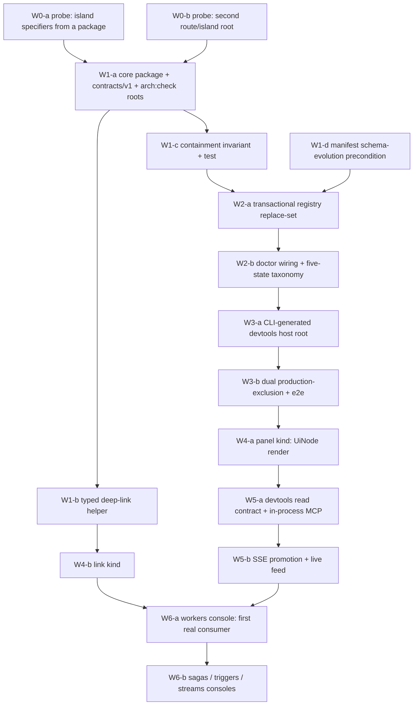

## 13. Packages, archetypes, and gates

This section is the supervisor's integration of §§5–11 against doctrine. It is the answer to "where
does this code live, what shape must it take, and what proves it works."

### 13.1 Proposed package ownership

| Unit | Archetype | Owns | Must not |
| --- | --- | --- | --- |
| `packages/plugin-devtools-core` | **2 — Integration** | The contribution contracts (`contracts/v1`), the host descriptor and zone vocabulary, the `DevToolsUiNode` element vocabulary, the ordering function, the registry-emission domain model, and the read ports it consumes (telemetry, tools, endpoint directory) | Depend on `@netscript/fresh` or `@netscript/fresh-ui`; own a background processor; own a DB schema |
| `plugins/devtools` | **5 — Plugin** | Thin composition: `scaffold.plugin.json`, `definePlugin(...)`, adapter install/doctor/info/update/remove, re-export of the core's contracts | Redefine a contract or re-implement a core convention (the Archetype-5 **thinness law**) |
| `packages/cli` (additive) | 6 — existing | The `devtools` command group, the CLI-generated `.netscript/devtools/` root, and the transactional registry generator | Deepen `@netscript/cli`'s existing **Restructure** verdict |

**Why Archetype 2 and not 3.** Doctrine's decision order asks whether the package "owns long-running
behavior with state, lifecycle, and supervised execution." In v1 the core does not: it reads through
ports and emits a registry. That keeps it out of gate **F-13** (`stop()` on every long-running
runtime; `AbortSignal` on every async public IO method). §8's SSE feed is owned by the *host app*,
not the core. **If a future wave moves supervised subscriptions into the core, the archetype becomes
3 and F-13 applies** — recorded here so the re-evaluation is a decision rather than a drift.

**Why not a `@netscript/fresh` subpath.** Doctrine's assignment table lists `fresh` as **Archetype 4**;
#890's design labels it **Archetype 3**. That contradiction is unresolved (run `drift`/`b2` D3), and
A3 versus A4 changes the gate set. Standing up the host outside `@netscript/fresh` **defuses the
dispute entirely** rather than inheriting it — and it avoids adding code to a package that already
carries a **Restructure** verdict.

### 13.2 Public API sketch — the planned surface

The `jsr-audit` publishability rubric is applied here to the **planned** surface, per
`gates/plan-gate.md`'s requirement that it cover the surface before slicing.

```ts
// @netscript/plugin-devtools-core — contracts/v1 (explicit return types, no slow types)
export interface ContributionEnvelope { /* §6 */ }
export interface DevToolsHostDescriptor { /* §6 */ }
export type DevToolsZone = /* closed union, §7 */ string
export type DevToolsUiNode = /* closed element vocabulary, §7 */ unknown
export interface DevToolsPanelContribution { /* §7 */ }
export interface DevToolsLinkContribution { /* §7 */ }
export function orderContributions(/* … */): readonly unknown[]
export function resolveDevToolsLink(/* … */): URL
```

**Publishability risks identified up front**, so they are designed against rather than discovered at
publish time:

| Risk | Mitigation |
| --- | --- |
| Slow types from inferred returns | Every exported function declares an explicit return type; `deno doc --lint` is a per-slice gate |
| A closed union exported as `string` | `DevToolsZone` and the `UiNode` tag set are `const`-derived unions, not free `string` |
| `any` / casting leaking into the public surface | `deno task quality:scan` is a required gate on every `packages/**` slice — it fails on `any` + casting, which is one of the two classes that reached `main` in #745 |
| Host-side hardcoded plugin names | Same gate; the host resolves by `mountId`, never by plugin name |

### 13.3 Gate set

Selected from `gates/archetype-gate-matrix.md` for Archetype 2 and 5, **plus the `SCOPE-frontend`
overlay** — which is where the browser gates actually come from. The matrix has **no row making
browser validation required** for a UI-serving A2/A3 package (it is `subtype` only under A4), so
naming the overlay is load-bearing rather than decorative.

| Gate | Applies to | Evidence |
| --- | --- | --- |
| F-1, F-5…F-8, F-10…F-12, F-14…F-19 | every archetype in scope | scoped wrappers per slice |
| F-2, F-3, F-4, F-9 | A2 core | `check-doctrine.ts`; F-9 = the README "Required permissions" block |
| F-13 | **not required in v1** | conditional on the A2→A3 re-evaluation in §13.1 |
| `deno task quality:scan` + `arch:check` | every `packages/**` / `plugins/**` slice | required — a green scoped wrapper is **not** sufficient |
| `jsr-audit` rubric | package waves | §13.2 |
| `SCOPE-frontend`: route check · **browser validation** · **loading/empty/error states** · responsive · contract check | the host and every panel | Playwright; the §11 state matrix is the checklist |

**The gate claim is not self-executing, and this RFC commits to fixing that.** `deno task arch:check`
iterates **16 hand-listed roots out of 36 live units**; `fresh`, `fresh-ui`, `telemetry`, `cli`,
`sdk`, and `service` are ungated today. A new package inherits **no mechanical doctrine gate** unless
it is added explicitly. Slice **W1-a** therefore includes adding `--root packages/plugin-devtools-core`
and `--root plugins/devtools` to `deno.json`'s `arch:check` task. Without that line, every gate claim
in this section is decorative.

### 13.4 Doctrine anti-patterns this design is most at risk of

Named so review has a checklist, each with the gate that catches it:

| AP | Risk here | Guard |
| --- | --- | --- |
| **AP-3** god interface | one `DevToolsContribution` union covering every kind | §7's separate named axes; envelope validates no payload |
| **AP-24** switch over tagged union | `switch (contribution.kind)` in the host renderer | §6's typed kind registry, populated at composition |
| **AP-21** flat command surface | a panel-per-seam `routes/` folder over 12 children | §11's vertical slicing (doctrine names *dashboard pages* explicitly); gate F-16 |
| **AP-9** premature abstraction | one envelope for both the admin console and DevTools | §4's disjointness argument; #1446's two-hosts sentence |
| **AP-13** `console.*` in published code | a diagnostics package is the most tempting violator | gate F-14 |
| **AP-19** silent permissions | DevTools reads Aspire/OTLP over HTTP | gate F-9 README block |
| **AP-11 / AP-25** hidden globals, side effects outside edge files | a registry populated at module load; a polling loop inline in a panel | composition-root-only; §8's context is passed, never ambient |

## 14. Implementation roadmap

Small coherent PR slices in dependency order. Each names what it proves. **Nothing here is filed
until the owner ratifies §15.**



| Wave | Slice | Proves |
| --- | --- | --- |
| **W0** | Two disposable probes: package-shipped island specifiers; a second route/island root in one Vite process | The two facts §5 and §10 could not verify from source. **These gate the plan lock of any slice that depends on them** — they are cheap and they are not optional |
| **W1** | Core package + `contracts/v1` + **`arch:check` roots**; the typed deep-link helper; the containment invariant with its test; the manifest schema-evolution precondition | The contracts type-check and are gated; a deep-link exists (today none does); an escaping target is rejected; a pointer block can land without hard-rejecting older CLIs |
| **W2** | Transactional replace-set generator + `devtools.check.ts`; doctor wiring | A crash mid-generation cannot leave a partial registry; removal cannot dangle; a bad contribution is diagnosed, not silently dropped |
| **W3** | The CLI-generated host root; dual production exclusion + e2e | The host runs in dev and is **structurally absent** from a production build |
| **W4** | `panel` and `link` kinds | A plugin contributes a panel with zero client code, and a deep-link resolves |
| **W5** | The read contract, in-process MCP composition, SSE promotion | A panel gets typed data without ever holding a URL |
| **W6** | Workers console, then sagas/triggers/streams | The design survives a **real** consumer — the only test that matters |

**Sequencing constraints inherited, not invented:** anything needing a credential-bearing typed
client waits on the RFC-A chain (which includes an **unfiled** metadata child); anything reading
runtime-automation state waits on #1446's A2b/A3b/A2d, per its P-6 entry criterion.

## 15. Owner decision brief

Every genuine fork. **No decision that would force rework is filed under "safe to defer."** Each row
carries this RFC's recommendation, so a silent owner default is a *decision*, not an omission.

### 15.1 Must resolve before implementation begins

| # | Fork | Recommendation | Cost if deferred |
| --- | --- | --- | --- |
| **F-1** | **Depend on #890's unbuilt spine, or specify a self-contained DevTools family?** | Sibling family on a family-neutral spine **this lane builds first** — reversible until the first emitter slice merges | Serializes DevTools behind 24 unstarted issues, or forks a fourth seam |
| **F-2** | **RFC home** — `docs/architecture/rfc/` (charter + unmerged #1446) vs shipped `rfcs/` vs the `.llm/runs/` convention every merged "RFC" actually used | Follow the charter; **record that it pre-empts issue #1380**, which already schedules this decision on `0.0.6` | A re-home later, or a fourth divergent convention |
| **F-3** | **Manifest schema-evolution precondition** (drift D-6) | Land it **before** any manifest-visible pointer | An older CLI hard-rejects the manifest and the plugin fails to parse |
| **F-4** | **Three-seam verdict** — #890's pointer axis wins; #427 folds in; **#734 closes** | Ratify | A fourth position appears |
| **F-5** | **Zone-vocabulary ownership** — host-owned closed (Medusa) vs plugin-minted (Strapi) | Host-owned closed | Collision becomes a real problem, and a two-phase register/bootstrap lifecycle becomes necessary |
| **F-6** | **Ordering rule** — net-new design; no surveyed system solved it | Host anchors, then clamped `(order, mountId, id)` | Tab order becomes plugin load order, i.e. arbitrary |
| **F-7** | **Read-only v1** — no mutating actions | Ratify; revisit after the DLQ/runtime-config co-requisites and RFC-A `#1352` | Pulls an unbounded auth + audit surface into v1 |
| **F-8** | **Archetype** — A2 now, re-evaluate to A3 (+F-13) if supervised state moves into the core | Ratify with the trigger written down | Gate-set ambiguity at the first runtime slice |

### 15.2 Board decisions (no mutation until ratified)

| # | Fork | Recommendation |
| --- | --- | --- |
| **F-9** | **Milestone** — children stay on their **owner-ratified** `0.0.15` train (2026-07-19) | Do **not** re-milestone. Fix `0.0.14`'s stale description instead |
| **F-10** | **Two epics claim dashboard-zone panels** (#933/#944 under #922 vs #428–#431 under #400) | Both survive — different artifacts on different hosts. #922's children **untouched** |
| **F-11** | **`CR-DDX-HOSTAGNOSTIC`** — real, recorded on #400 (2026-07-06), **never resolved** | Accept: host-neutral descriptor + host-provided context. Un-dangles #544 |
| **F-12** | **#780** — an unlabelled stale draft encoding the superseded flat IA | Salvage its design-language specs, then close |
| **F-13** | **Was the 7-member `DashboardContribution` family ever ratified?** No such event found | Treat as **unratified analysis** — an unverified negative, stated as one |

### 15.3 Scope boundaries to confirm

| # | Fork | Recommendation |
| --- | --- | --- |
| **F-14** | **Vite-8 / `@vitejs/devtools-kit`** | Explicit non-goal with a re-entry condition. Imitate contracts, implement natively |
| **F-15** | **Generic Vite contribution** | Deferred to its own RFC with entry criteria (§10) |
| **F-16** | **Fresh UI registry contribution** (surface #2) | Deferred; entry criteria in §11 |
| **F-17** | **Contribute-into-Scalar** | **Declined**, not deferred — the vendored bundle predates `pluginUrls` |
| **F-18** | **MCP as the agent surface, DevTools as the human surface** | Adopt, following Aspire's own 13.3 precedent |
| **F-19** | **Production posture stricter than upstream** | Ratify — no production tier, dual exclusion |
| **F-20** | **`/design` ships ungated today** — the same defect class this RFC guards against | Record and **file separately**; do not fix inside this RFC's scope |

### 15.4 Accepted risks, stated as risks

These are **not** decisions to make now — they are things this RFC declines to claim.

| Risk | Status |
| --- | --- |
| Containment, generator scoping, and production-absence | **UNPROVEN** at baseline. Each names its gate (W1-c, W1-c, W3-b). None of those gates exists today |
| Credentialed data access | **Blocked** on the RFC-A chain, including an unfiled metadata child |
| `islandSpecifiers` with JSR specifiers; a second route/island root | **Unverified** — W0 probes, deliberately cheap and deliberately first |
| `plugins/streams` has no oRPC contract surface | A **permanently degraded** panel state until that debt closes — modelled in §11, not hidden |
