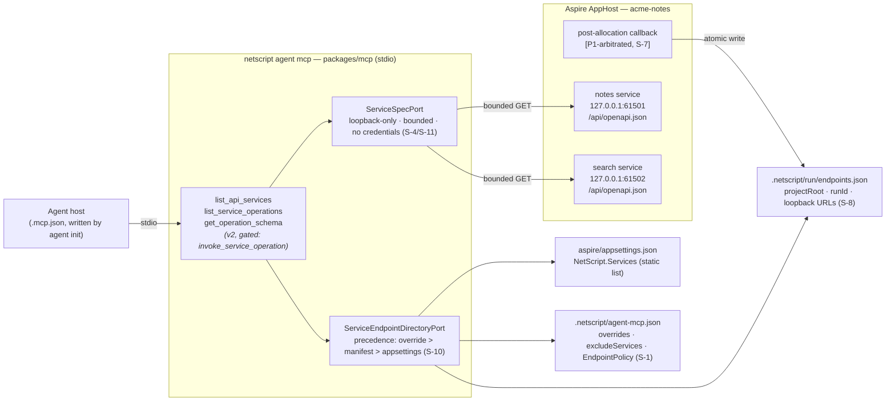
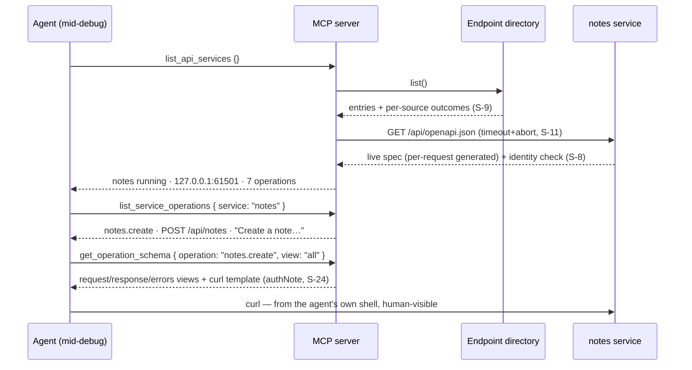
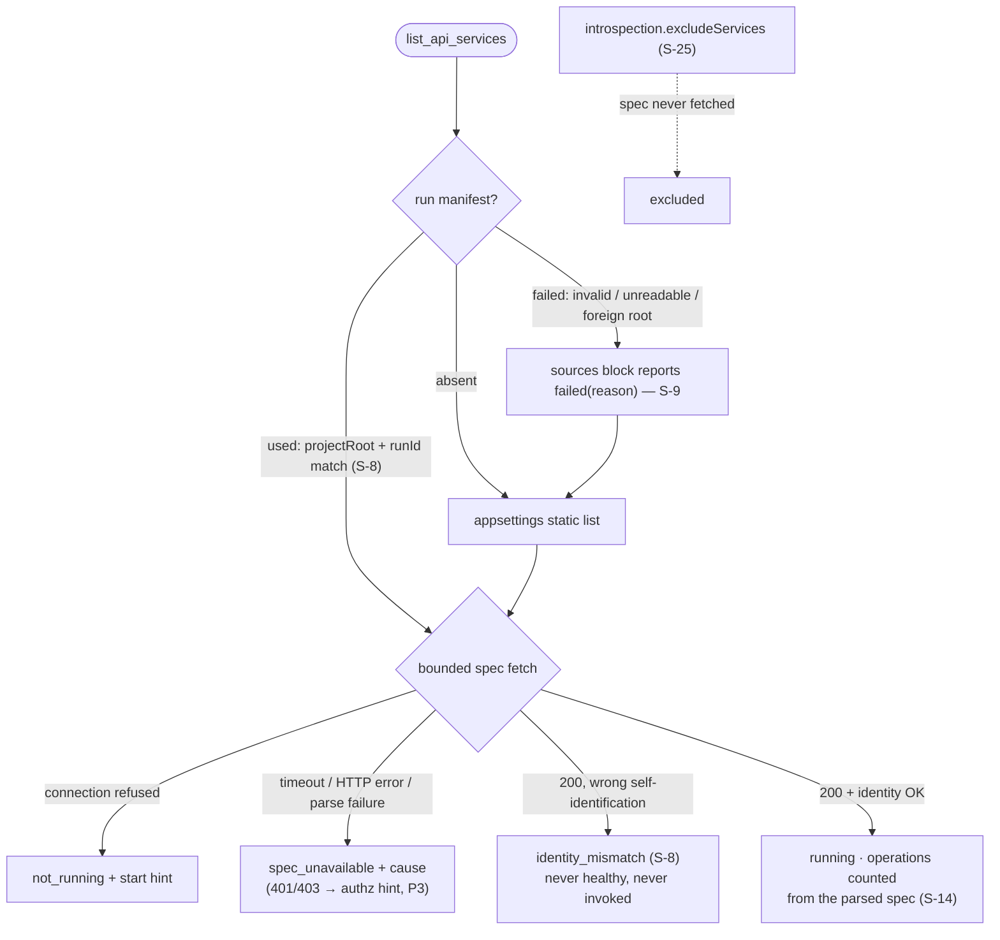
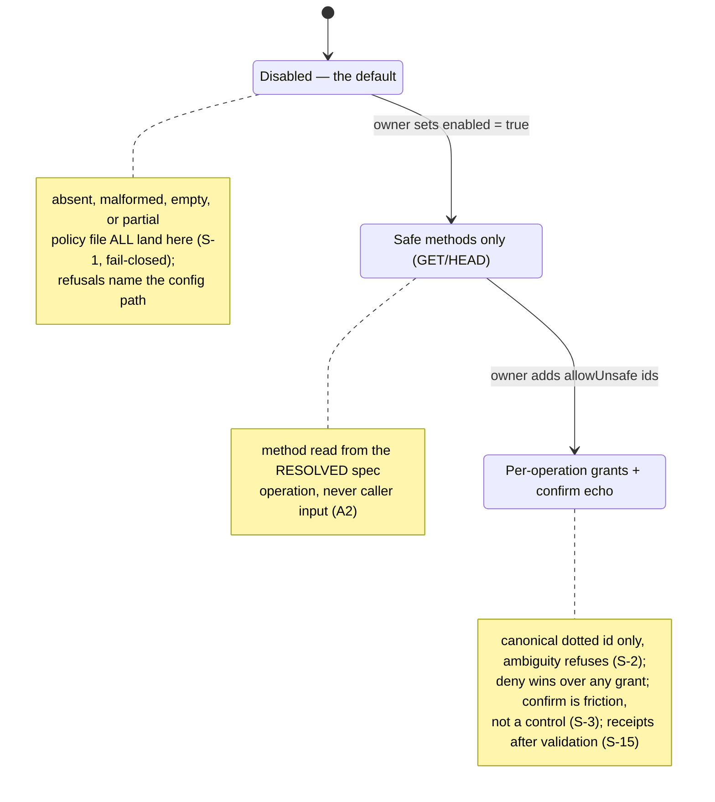

# RFC — OpenAPI→MCP: making a service's own API legible to the agent building it

> **AUTHORITY BANNER (2026-08-03): the board is FILED — GitHub wins on conflict.** Epic
> **#1126**, children **#1127–#1140** (OMB-1..14 mapping in `FILING-LOG.md`). Forks ratified
> per §9; **F1 remains proof-arbitrated by #1127's verdict artifact**, not settled by fiat.

| | |
| --- | --- |
| **Status** | **Ratified (owner, 2026-08-03) — rev 2, adversarially hardened; board filed.** Pipeline: generator (Fable 5 · medium) → Codex GPT-5.6 Sol · xhigh adversarial, **25 findings (10 blockers), 25/25 accepted and integrated** (`adversarial-sol.md` / `adversarial-triage.md`) → fork ratification + board filing (epic #1126, children #1127–#1140, milestone 0.0.5). F1 is proof-arbitrated (§9). |
| **Tracking** | Refs #1117 (0.0.5, tracking — no closing keyword) · #1102 (capability lane, distinct) · #1072/#1078 (gate precedent) · #1071 (conventions surface) · #1093 (addressed §5, not fixed here) |
| **Run record** | `.llm/runs/plan-openapi-mcp-plugin--seed/` — research, plan (D1–D9 / forks F1–F5, rev 2), canonical design 00–06 (rev 2), 2 worked examples, adversarial findings + triage (25/25) |
| **Evidence base** | Verified in-source: `.withOpenAPI().withDocs()` on every preset (`define-service.ts:227-228`), spec routes (`service-builder-impl.ts:466-484`), per-request spec generation (`openapi.ts:74-93`), `operationId` = dotted contract path (`@orpc/openapi@1.14.13` `openapi.BwdtJjDu.mjs:535-549`), closed MCP registry + central truncation (`tool-registry.ts`, `mcp-server.ts:105-112`), `.mcp.json` spawn (`init-agent.ts:127-172`), `services__*` env convention + `getAllServices()` (`service-url.ts:55-176`); prior art code-read with licenses verified (research.md §3) |

---

## Abstract

Every scaffolded NetScript service already serves a live OpenAPI 3.1 document at
`/api/openapi.json` — generated per request from the running router, so it is never stale — and
every agent working on a scaffolded app already has the NetScript MCP server connected. The two
have never met: in wave four, three frontier agents debugged their own services with blind
`curl`, one losing ~25 minutes to a silently hanging publish endpoint whose envelope the unread
Scalar docs "would have explained instantly."

This RFC connects them with **three read tools on the existing MCP server** — no new package, no
new process, no hosted anything:

```
> list_api_services {}                                   # which services, live base URLs, status
> list_service_operations { service: "publisher" }       # publisher.publish  POST /api/publisher/publish  "Publish a document…"
> get_operation_schema  { service: "publisher",          # exact request/response/error schemas,
                          operation: "publisher.publish" }  # + a paste-ready curl example
```

The operation names are the dotted contract paths agents already know, because oRPC defaults
`operationId` to exactly that. A small in-house projection (no runtime dependency) turns the
spec into bounded, NetScript-flavoured output; a designed discovery lane bridges Aspire's
dynamic ports to the out-of-tree MCP process; execution of endpoints through MCP is **fully
designed and deliberately deferred** behind a deny-by-default policy. Activation is engineered,
not hoped for, on the #1071/#1072 pattern — the tools live where the agent already is, and their
summaries name the curl moment itself.

## 1. Motivation

| Today | Consequence |
| --- | --- |
| `/api/openapi.json` + `/api/docs` on every service (`define-service.ts:227-228`), documented and cross-linked | Wave four: zero opens while debugging the exact envelope they document — an **activation** gap (#1071/#1072 shape), not a docs gap |
| `packages/mcp` ships 14 tools (`read`/`mutate`/`meta`); zero OpenAPI awareness (grep: no hits) | The agent's connected diagnostic surface cannot answer "what does this endpoint accept?" |
| Aspire assigns ports at run time; `getServiceUrl()`/`getAllServices()` read env vars that exist **only inside Aspire-launched processes** (`service-url.ts:55-176`) | The MCP server — spawned by the agent host (`init-agent.ts:127-172`) — cannot resolve any service URL today; #1117's "largely solved" holds only inside the AppHost graph |
| First-party contracts set no `summary`/`tags` on `.route()` (e.g. `auth.contract.ts:437-457`) | A generic OpenAPI→MCP generator would emit a nameless REST dump; the metadata seam exists (oRPC emits it) but is unpopulated |

Measured cost: three agents × blind curl; ~25 minutes on one silent hang (#1064); docs-MCP calls
across all three runs: **zero** (#1072).

## 2. The proposed decision and its rationale

**Decisions D1–D9, locked at generator level** (full text `plan.md`, mechanisms 00–06):

1. **Extend `packages/mcp` core; no plugin, no new package (D1).** The projection — operation
   identity, description ladder, schema views, failure envelopes — is convention-bearing
   agent-facing vocabulary: core, by the ARCHETYPE-5 thinness law. What a plugin could wire
   sits on one **named internal axis** — `EndpointSource`, whose variants are all first-party
   adapters of one core port with no external provider behind any of them (S-21; the full
   argument is §5); doctrine 07's axis discipline is honored by naming it, not by a plugin. A
   `plugins/openapi-mcp` would either own the convention (the archetype's named fat-plugin
   smell) or be an AP-22 shell — and would need an MCP-tools contribution axis core would have
   to grow first, reproducing #1093 at birth. Full AP/F-by-name argument:
   `design/canonical/06-doctrine-fit.md`.
2. **Meta-tool triad, not one-tool-per-operation (D2).** The registry is a closed enum with
   static schemas and central truncation — and prior-art consensus (Stainless; ivo-toby's
   `dynamic` mode; Apideck) is that per-operation tools blow context past ~50–100 operations.
   Three static tools; operations are *data* in results. Idle context cost: three summaries.
3. **Discovery: AppHost-published endpoint manifest (D3) — mechanism P1-arbitrated (S-7).**
   The AppHost side is the only party that authoritatively knows resolved ports; generated code
   writes `.netscript/run/endpoints.json` (atomic, idempotent, gitignored, literal-loopback
   URLs) carrying an **identity binding** — `projectRoot` + per-run `runId` — and every
   reported/invoked endpoint is cross-checked against the service's self-identification (S-8:
   PID/clock freshness was refuted; copied worktrees and reused ports must refuse). The
   reviewer proved the rev-1 producer (helper body) runs **before** endpoint allocation, so
   [P1] must demonstrate a run-mode post-allocation callback — else the `aspire` CLI adapter
   activates as a first-class source. The `ServiceEndpointDirectoryPort` reports **per-source
   outcomes** (`used`/`absent`/`failed(reason)`) surfaced in tool output — a failed manifest
   read is never rendered like "AppHost not started" (S-9) — with deterministic precedence
   (override > manifest > appsettings) and visible conflicts (S-10). Spec fetches are bounded
   (timeout/abort/isolation — one hung service is one failed row, S-11) and statuses follow one
   mapping (`not_running` vs `spec_unavailable` vs `identity_mismatch` vs `excluded`, S-12).
4. **Projection written in-house (D4).** Our spec producer is in-repo and deterministic —
   internal refs, dotted operationIds, Zod `.describe()` descriptions — so the compat problem
   upstream libraries solve does not exist here. ~200–400 lines of pure domain code; borrowed
   shapes credited (ivo-toby triad, nihal1294 description ladder, awslabs `Returns:`
   enrichment); zero runtime dependencies; all candidate licenses verified anyway (MIT /
   Apache-2.0; beshkenadze unlicensed and untouched).
5. **Introspection v1; execution designed now, shipped later, deny-by-default (D5).** The
   25 minutes were lost to not knowing the envelope, not to being unable to send requests —
   `get_operation_schema` ends with a `curl` request template (shape-ready; authorization never
   inferred from absent security metadata, S-24), keeping mutations in the agent's visible
   shell. `invoke_service_operation` (mutate) is specified in `04-execution-and-security.md`
   with the adversarial hardening in place: one exact **fail-closed carrier**
   (`.netscript/agent-mcp.json`; absent/malformed/empty/partial all deny, with an end-to-end
   fixture set — S-1); **canonical-identity policy evaluation** (one resolved operation,
   ambiguity refuses, deny-wins tested across aliases — S-2); `confirm` demoted to deliberate
   friction with **no security credit** (S-3); a real OpenAPI-subset validator with
   location-aware params (headers representable, non-object bodies valid — S-5); safe-methods
   first rung; **no credentials held or forwarded, ever**; enabling is a human config edit the
   MCP cannot reach.
6. **All AppHost services by default, per-service opt-out (D6);** auth-guarded spec endpoints
   produce a structured `spec_unavailable (401)` naming the likely authz-matcher cause and the
   fix ([P3] proof).
7. **Activation is a designed surface (D7),** on the #1071/#1072 lineage: (A) the tools join
   the server `agent init` wires into `.mcp.json` — zero install **for new scaffolds**; existing
   projects are exact-version-pinned and reach the tools via a documented `agent init` re-run +
   host restart, proven by a fixture from prior-release host files (S-18 — the rev-1 "already
   connected everywhere" claim was overbroad); (B) tool summaries name the counterfactual act
   ("Use instead of guessing endpoints with curl"); (C) one sentence in the server's
   `initialize` instructions; (D) one behavioural line in the scaffolded app-scoped `AGENTS.md`;
   (E) endpoint-shaped findings in `get_recent_errors`/`doctor` output cross-reference
   `get_operation_schema`; (F) introspection receipts join the #1078 evidence machinery —
   *accepted* after the receipt-after-validation fix lands (S-15: today receipts commit before
   output validation), *required* only after a wave of field use and only with per-evidence-class
   receipt keys (S-16: the current one-receipt-per-resource store cannot express "introspection
   ran"; fork F4 prices this honestly). Observational acceptance routes to #1090, per the
   close-gate lesson.
8. **#1093 does not block and is not worsened (D8).** No new code branches on a plugin or
   service name — discovery reads data the app generates about itself. The "first plugin outside
   the big four" evidence question is answered honestly: this is the wrong test case (nothing
   varies), and forcing the plugin shape would manufacture ceremony, not evidence (§5).
9. **Contract enrichment (D9):** additive `summary`/`tags` on first-party `.route()` calls —
   the difference between "Publish a document and enqueue distribution." and the ladder's
   honest-but-mechanical "Invoke publish on publisher."

## 3. Tool surface (implementation-level)

Registry 14 → 17 (→18 with v2). House conventions throughout: snake_case names, hand-written
JSON Schema with `additionalProperties: false`, bounded summaries, `withReceipt` wrapping.

| Tool | Kind | Input (required) | Output essence |
| --- | --- | --- | --- |
| `list_api_services` | read | — | per-service: name, status (`running` / `not_running` / `spec_unavailable` / `identity_mismatch` / `excluded` — one mapping, S-12), live base/spec/docs URLs, operation count (computed from the parsed spec or absent — never defaulted, S-14), discovery source + conflicts, **and the per-source outcome block** (a failed manifest read is visible data, S-9) |
| `list_service_operations` | read | `service` (+ `filter`, `limit`) | one flat row per operation: dotted id, method, path, ladder summary, tags; flows self-cap below the central truncator and compute `truncated` **after** all caps (S-13 — the central truncator's silent 50-row slice is a named fix) |
| `get_operation_schema` | read | `service`, `operation` (+ `view`: `request`/`response`/`errors`/`all`) | dereferenced schema **views** with Zod descriptions intact; `Returns: <codes>`; errors view derived from the operation's **actual** declared responses (the no-DB scaffold lacks the common envelope — S-19); `curlExample` as an explicitly unauthenticated request template (S-24) |
| `invoke_service_operation` (v2, fork F2) | mutate | `service`, `operation` (+ location-aware `params` {path,query,headers}, any-JSON `body`, `confirm`) | canonicalize → policy-check → validate against the real OpenAPI subset → send bounded → receipt after output validation; refusals teach the enabling path |

Failure envelopes are uniform and structured: `service_unknown` (with known list),
`service_not_running` (with start hint), `spec_unavailable` (with status + cause guidance),
`operation_unknown` (with three nearest ids). Two ports back the flows —
`ServiceEndpointDirectoryPort` (one method) and `ServiceSpecPort` (loopback-only fetch, size
cap, no redirects, no credentials) — constructor-injected with fakes, composed at the existing
CLI edge (`run-agent-mcp.ts:22`).

**Before/after in one line:** a generic generator loads 40+ path-munged tools
(`PostApiPublisherPublish`, empty descriptions) into every session; this design idles at three
summaries and answers with the contract's own vocabulary. Worked end-to-end in
`design/examples/silent-hang-replay.md` (an **explicitly hypothetical** replay of the wave-four
hang class — the tools deliver the declared contract in three bounded calls; the incident's own
response semantics are not in the evidence and are not claimed, S-23) and
`design/examples/discovery-and-policy.md` (discovery byte-by-byte, nine degraded modes, the
three-rung execution opt-in as the owner experiences it).

### End-to-end flows (diagrams, #822 convention — example app "acme-notes")

**Architecture — who talks to whom.** The dashed boundary is the process boundary Aspire does
not bridge; the manifest is the designed crossing:



**The debug moment — the curl loop replaced** (hypothetical replay, S-23; three bounded calls,
mutation stays in the agent's own visible shell):



**Discovery status mapping — every degraded mode is a designed output** (one mapping, S-12;
absence-of-red is never rendered green, S-9):



**Execution policy — three rungs, fail-closed** (v2, fork F2; every arrow down is a human edit
to `.netscript/agent-mcp.json`, never agent-reachable):



## 4. Plan — waves and gates (for the implementing run)

**Wave 0 — proofs before contracts freeze, each emitting a committed
`proofs/P<n>-verdict.md` artifact that the first dependent Wave-1 slice hard-requires (S-17 — a
skipped proof must be indistinguishable from a failed one, not from a passed one):** **[P1]**
the post-allocation endpoint-manifest seam (the helper body provably runs pre-allocation, S-7;
FAIL ⇒ `aspire` CLI adapter activates) · **[P2]** spec-fidelity + size dry-run against a real
scaffolded app (operationIds, schema sizes vs truncation budget, error-envelope presence
including the no-database template — feeds the S-5 validator subset) · **[P3]** auth-guarded
spec fixture.

**Wave 1 — introspection spine:** projection domain module + ports + adapters + three read
flows + registry/contract wiring + per-rung ladder fixtures and port-fake tests — **plus two
named existing-machinery slices** the findings exposed: central-truncation metadata
recomputation + whole-result byte bound (S-13, `truncation.ts`), and
receipt-commit-after-output-validation (S-15, `withReceipt`/runner).
**Wave 2 — activation + enrichment:** instructions sentence, AGENTS.md template line, the S-18
existing-project migration fixture, receipt acceptance (F4a), the D9 contract slice, docs
cross-reference.
**Wave 3 (gated on owner F2):** execution tool + `EndpointPolicy` (S-1 carrier + fail-closed
fixtures, S-2 canonicalization, S-5 validator) + receipts; observation in #1090.

Gates: the **full Archetype-2 column** of the gate matrix (S-20 reclassification — the change
is bounded flows behind ports/adapters, not a runtime lifecycle; no hand-picked gate subset),
`deno task quality:scan`, `arch:check` on every `packages/**` slice; `scaffold.runtime` at
merge-readiness for the helpers-template slice; no new lint-ignores. Archetype map and the full
ARCHETYPE-5 AP/F checklist (argued by name even though the outcome is core):
`06-doctrine-fit.md §2–3`.

## 5. The plugin question and #1093 (the brief's central question, answered plainly)

The three-part test from ARCHETYPE-5, applied: **(i)** the projection is convention-bearing →
core, inside `packages/mcp`, which already owns the agent-facing tool vocabulary (the reviewer's
thinness probe confirmed this half). **(ii)** the plugin residue (opt-in, discovery wiring,
policy) is composition of core things into core's own composition root. The rev-1 claim of "no
provider variance" was **refuted and replaced (S-21)**: discovery does have a nameable axis —
`EndpointSource` (`run-manifest` / `appsettings` / `override` / `aspire-cli`) — so rev 2 names
it per doctrine 07 (typed identifier, factory at composition, one core port) and re-argues the
verdict *on* the axis: every variant is a first-party adapter reading endpoint facts from a
different place; none binds NetScript to an external vendor, which is what the `auth-core` +
adapters split exists for. A first **external** endpoint provider is the honest trigger that
would reopen the plugin question at exactly that seam. **(iii)** two packages buy a fat plugin
(the archetype's named smell and false-done case) or an empty shell (AP-22 / AP-9) plus
JSR/verify/gate overhead. **Verdict: extend core; no plugin** — unchanged through adversarial
review, now standing on the named axis rather than on denied variance.

**#1093:** not a blocker — this design adds no plugin and no name-branching; its discovery is
data-driven (appsettings + run manifest), so #1093's own acceptance guard would pass over it
unchanged. The plugin shape would have *worsened* #1093 by forcing core to recognize one more
specific plugin. And the honest answer to "first first-party plugin as contribution-model
evidence": wrong test case — nothing here varies; the genuine first test is a capability with
real variance (#891's deploy family) or #1093's own third-party fixture. A future MCP-tools
contribution axis is named as future work, designed only when a second contributor exists
(the `createMcpServer(options)` seam is where it would land).

## 6. Security model (summary, rev 2)

v1 is read-only against loopback, with the narrowed, honest guarantee (S-4): manifest URLs are
literal loopback; DNS names resolve-then-pin or refuse; only an explicit human-written override
reaches non-loopback and is labeled operator-trusted; socket-level binding depth remains a
recorded debt, and "SSRF-safe" is not claimed. Fetches are bounded (timeout/abort/isolation,
S-11), size-capped, redirect-free, credential-free. Prompt injection via spec prose is honestly
bounded, not claimed away (S-6): the server guarantees injected text never alters server-side
behavior and never enters tool definitions or instructions; the model-side residue is
documented — one more reason execution defaults off. The deferred execution tool is
deny-by-default from one fail-closed carrier (S-1), evaluates policy only against canonical
operation identity with ambiguity refusal (S-2), credits `confirm` as friction rather than a
control (S-3), validates against the real oRPC-emitted schema subset location-aware (S-5),
writes receipts only after output validation (S-15), and never holds credentials —
authenticated invocation is explicitly out of scope rather than half-shipped. The manifest is
machine-local run state bound to `projectRoot` + `runId`, and endpoints must pass an identity
cross-check before reporting or invocation (S-8). The four rev-1 uncertainties all became
findings and are integrated (`04-execution-and-security.md §6`).

## 7. Board — FILED 2026-08-03 (owner-authorized). Epic **#1126**; OMB-1..14 → **#1127–#1140** per `FILING-LOG.md`; GitHub wins on conflict. Original proposal below:

Epic under #1117, milestone 0.0.5, label `epic:openapi-mcp` (created for this filing). Children
(`[openapi-mcp S<n>] …`, each `Part of #1126`, `status:plan`, milestone 0.0.5):

| ID | Wave | Slice |
| --- | --- | --- |
| OMB-1 | 0 | [P1] post-allocation endpoint-manifest seam proof → committed `proofs/P1-verdict.md`; FAIL activates the `aspire-cli` source (S-7). Gates OMB-5/OMB-7 |
| OMB-2 | 0 | [P2] spec fidelity + size dry-run (incl. no-DB template error shapes, S-19) → `proofs/P2-verdict.md`; feeds the S-5 validator subset. Gates OMB-4/OMB-6 |
| OMB-3 | 0 | [P3] auth-guarded spec fixture + `spec_unavailable` envelope wording → `proofs/P3-verdict.md` |
| OMB-4 | 1 | Projection domain module (index, canonical identity + ambiguity refusal S-2, ladder S-22, response-derived error views S-19) + fixtures |
| OMB-5 | 1 | `ServiceEndpointDirectoryPort` + manifest/appsettings/override/aspire-cli adapters: identity binding (S-8), source outcomes (S-9), precedence + conflicts (S-10), bounded fetches (S-11), status mapping (S-12) |
| OMB-6 | 1 | Three read tools: contracts, flows, registry wiring, receipts; computed counts (S-14), self-capped truncation metadata (S-13a) |
| OMB-7 | 1 | Manifest emission from the [P1]-proven seam (+ `scaffold.runtime` evidence) |
| OMB-8 | 1 | **Existing-machinery fixes (S-13b/S-15):** central truncator metadata recomputation + byte bound; receipt commit after output validation |
| OMB-9 | 2 | Activation surfaces: instructions sentence, app-scoped AGENTS.md line, failure-path cross-references, **S-18 migration fixture** (prior-release `.mcp.json` → re-init → tools appear) |
| OMB-10 | 2 | Evidence-gate acceptance of introspection receipts (F4a; depends on OMB-8) |
| OMB-11 | 2 | Contract `summary`/`tags` enrichment across first-party contracts (D9/F3) |
| OMB-12 | 2 | Docs: agent-facing cross-reference in `expose-openapi-scalar.md` + reference page |
| OMB-13 | 3 (gated F2) | `EndpointPolicy`: fail-closed carrier + fixture set (S-1), canonical-identity evaluation + alias deny-wins tests (S-2), OpenAPI-subset validator + corpus (S-5), `invoke_service_operation` + receipts + refusal texts |
| OMB-14 | 3 | Wave-observation handoff to #1090 (tool-calls vs curl count) |

## 8. Review trail

Stage 1: generator Claude Fable 5 · medium, seed run `plan-openapi-mcp-plugin--seed`, research
via 3-way fan-out with load-bearing claims re-verified in-session (research.md marks ✔).
Stage 2: Codex GPT-5.6 Sol · xhigh adversarial pass (thread recorded in
`codex-thread-ids.md`), briefed with three 0.0.4 release-orchestrator learnings as *required*
attack surface — predicate-bugs-must-fire, absence-of-red-is-not-green, and the RFC-instrument
scope guard — plus the #1117-sizing contradiction. **25 findings (10 blockers, 13 major,
2 minor); 25/25 accepted and integrated** (`adversarial-sol.md`, dispositions in
`adversarial-triage.md`); all three required surfaces produced blockers, and the reviewer's
defended non-findings (method-from-spec, meta-tool-vs-cached-lists, projection thinness) are
retained as recorded defenses. Notable status change from review: D3's discovery mechanism went
from "chosen" to "[P1]-arbitrated" (S-7). Generator ≠ reviewer sessions throughout, per the
harness invariant.

## 9. Forks — RATIFIED 2026-08-03 (owner-authorized, relayed)

**F2(a), F3(a), F4(a) ratified at the seed recommendations; F5 was already applied to this PR
and matches precedent. F1 is deliberately NOT ratified by fiat:** S-7 unlocked it, so it is
recorded as **proof-arbitrated** — option (a) stands only if #1127's committed
`proofs/P1-verdict.md` demonstrates the post-allocation seam, and a FAIL verdict is a
legitimate result that activates option (b) (the `aspire-cli` source), not a blocker. #1127's
verdict is the deciding artifact; #1131 and #1133 may not start before it exists. The original
fork table is retained below as the decision record:

**P1 verdict (2026-08-03): `FAIL`; F1(b) selected for the current decision record.** The
post-allocation callback did emit a complete identity-bound manifest with the allocated
`http://localhost:3001` endpoint, so the seam itself was not refuted. The locked coherent-owned-run
bar failed because the generated SQLite service exited without `--allow-ffi`; a later HTTP 200 was
unattributed and could not establish manifest/description/health agreement. F1(b) is therefore the
first-class endpoint source now, while a future healthy owned-run proof may legitimately revisit F1.
Both mechanisms remain additive implementations of the same endpoint-source port.

| # | Fork | Options | Seed recommendation |
| --- | --- | --- | --- |
| F1 | Endpoint manifest mechanism | (a) generated run-mode **post-allocation** callback writes the run-state manifest (b) `aspire` CLI query adapter (c) MCP as Aspire-hosted HTTP resource | **(a), [P1]-arbitrated** — S-7 proved the naive helper-body write impossible, so (a) stands only if P1's artifact demonstrates the post-allocation seam; (b) is a first-class source in the same port contract otherwise; (c) rejected (no HTTP transport exists; port chicken-and-egg; `.mcp.json` churn) |
| F2 | Execution timing | (a) introspection v1, execution v2 opt-in (b) GET-only invoke already in v1 | **(a)** — the incident didn't need execution; ship the risk-free 80% |
| F3 | Enrichment scope | (a) all first-party contracts, one slice (b) incremental | **(a)** — mechanical, small surface, one review pass |
| F4 | Activation strength | (a) receipts accepted as evidence (b) receipts required for endpoint-shape drift claims (c) instructions only | **(a) now, (b) after one field wave** — gating on an unproven surface is the #1072 trap inverted |
| F5 | RFC PR labels/milestone | per precedent | `rfc` `type:docs` `status:plan` `priority:p1` `area:tooling` `area:service` `ci:skip-e2e` `ci:skip-scaffold`; PR in Backlog / Triage; work milestoned 0.0.5 |

---

<sub>**Provenance.** Seed run `plan-openapi-mcp-plugin--seed` on `plan/openapi-mcp-plugin`; this
document condenses the run's normative record (`design/canonical/00–06` rev 2, `plan.md` rev 2,
`design/examples/`). Where this RFC and the run docs conflict, the run docs win until
ratification, then GitHub wins. Refs #1117 #1102 #1072 #1071 #1093 — no closing keywords; the §7
board is now live (epic #1126, children #1127–#1140); F1 was resolved to qualified F1(b) by
#1127's committed proof verdict.</sub>
