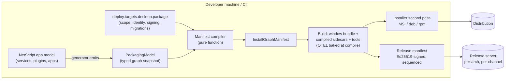
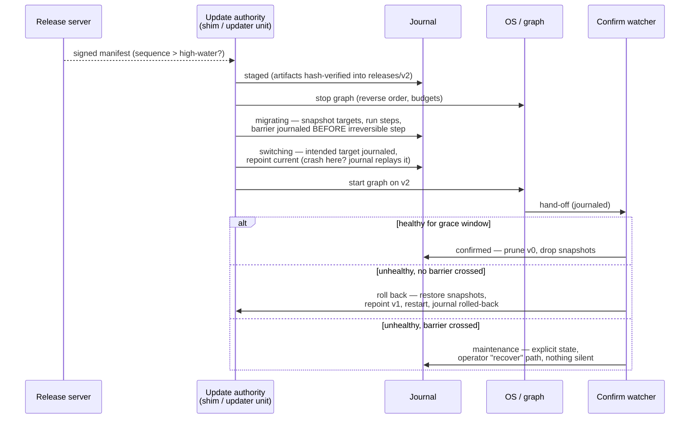
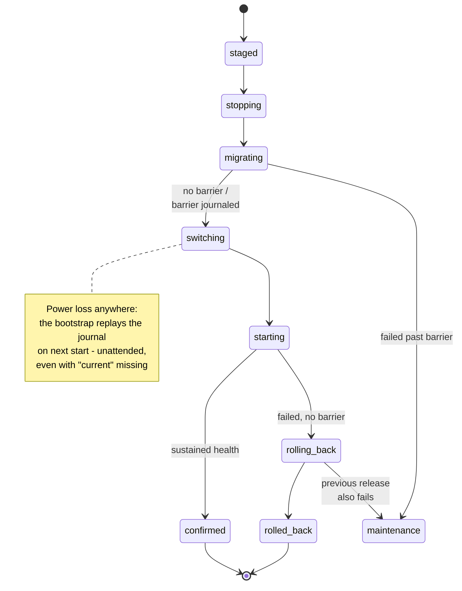

# RFC — NetScript Single Deployment: process-managed apps, single & multi runtime

| | |
| --- | --- |
| **Status** | Draft — adversarially reviewed (9 cycles), final review pass pending |
| **Tracking** | Refs #820 (charter) · builds on #510 (Process Manager) · #327 (Deployment) |
| **Target** | beta.11 (single-runtime lane) → beta.12 (PM foundation) → beta.13 (singleton-graph desktop) → stable (hardening) |
| **Evidence base** | eis-chat#150 Windows singleton POC (merged, smoke-tested); full engineering spec in `plan.md` (this PR) |

---

## Abstract

Today a NetScript application is a *development-time* orchestration: Aspire runs the graph, and nothing owns what happens on an end user's machine. This RFC makes **"one artifact, one install, one update"** a first-class NetScript capability:

```
netscript deploy desktop build      # one installable artifact from your existing app
netscript deploy desktop install    # per-user or per-machine, journaled, least-privilege
netscript deploy desktop upgrade    # atomic, crash-recoverable, health-confirmed, rollback-able
```

The same contract covers **two composition modes**: **single-runtime** (all services composed into one process) and **singleton-graph** (a native window supervising an adjacent process graph — databases with exclusive locks, external tools, isolated workers). Both modes share one packaging pipeline, one manifest family, one update mechanism, and one first-run story; they diverge only where physics demands it.

---

## 1. Motivation

The eis-chat prototype (eis-chat#150) proved the end state is real: a Deno Desktop window directly supervising Garnet plus six compiled NetScript services, shipped as a single folder, working offline, with full Aspire telemetry — no Docker, no .NET runtime, no installed Aspire on the user's machine.

It also proved exactly what must NOT be script glue, because the prototype breaks precisely where the framework is absent:

| POC reality | Consequence |
| --- | --- |
| Supervision is **launch-only** — nothing watches a sidecar after readiness | A crashed service silently kills features; the only recovery is restarting the app |
| A hard-killed window **orphans the whole graph** | Zombie processes hold ports and file locks |
| Service topology, ports, and env are a **hand-maintained map**, duplicated at build time and runtime | Drifts from the real app model; fixed ports collide |
| Shipping = a timestamped folder + a `.cmd` launcher | No install/uninstall/repair, no elevation model, no signing |
| `Deno.autoUpdate()` patches only the window binary — and cannot apply on Windows | The combined artifact (window + N sidecars + tools) has **no update story at all** |

Every row above becomes a framework foundation below.

## 2. Goals and non-goals

**Goals (v1):**

- Ship any NetScript app as **one installable, signed, updatable artifact** for Windows and Linux, per-user or per-machine.
- **Crash-safe by construction**: every install/update/uninstall operation is a journaled transaction that recovers deterministically from power loss at any boundary — including reboot with a half-switched release.
- **Supervised at runtime**: restart policies, readiness probes, dependency-ordered start/stop, and guaranteed containment (no process outlives its supervisor).
- **Least privilege throughout**: elevation only at install time; the updater cannot rewrite code the workload runs as; end users get read-only status by default.
- **One mental model** across single-runtime and multi-process apps.

**Non-goals (v1, explicitly deferred):** macOS installers/notarization; fleet management (MDM/GPO/MSIX/app stores); staged-rollout rings; per-user instance brokering on shared machines; serverless/edge packaging.

## 3. The two composition modes

| | **Single-runtime** | **Singleton-graph** |
| --- | --- | --- |
| Shape | All logical services composed into **one process** (in-process service links) | Native window + **supervised adjacent processes** |
| When | Default — no native constraint forces separation | Exclusive-lock DB engines (tursodb), external tools (Garnet), crash/permission isolation |
| Needs the Process Manager | No (that's why it ships first) | Yes — the PM engine is its supervisor |
| Artifact | window/app bundle (K = 0 sidecars) | window bundle + K compiled sidecars + staged tools |

**The rule:** applications default to single-runtime and *earn* the graph — the framework treats the graph as the same app with K > 0 artifacts, not a different product. The enforcement point is a typed manifest family plus a cross-mode conformance suite that runs one reference app in **both** modes and asserts the shared behavior (discovery, data layout, provisioning, update, telemetry identity).

## 4. Architecture — five foundations

### F1 · Process supervision (the Process Manager engine — epic #510)

The supervision layer the POC lacked, built as a **library** (never a god-daemon):

- **Restart controller**: pure `nextDelay(state, policy, clock)` — exponential backoff, restart budgets, skip-exit-codes.
- **Readiness probes**: `http`, `tcp`, `process-lingering` (the three the POC actually needed), grace windows.
- **Dependency-ordered** start and reverse-ordered stop with per-process budgets.
- **Containment — nothing outlives its supervisor**: every supervised process holds an inherited pipe; supervisor death (even `SIGKILL`) closes it and the child self-terminates via a core runtime helper. Processes that can't cooperate (Garnet-class raw executables) are spawned through a tiny **guardian wrapper** that holds the pipe and kills its child-tree on EOF. OS backstops: Windows **Job Objects** (kill-on-job-close); Linux rendered `KillMode=control-group` for per-machine units.
- **Control plane**: a typed oRPC service (18 fixed routes) exposing status/health/logs/events — an OS-supervised *sibling* of the workload, never its parent. The desktop window embeds the engine (per-user mode) or connects as a client (per-machine mode).

### F2 · Packaging pipeline (from the app model, never a hand map)

One pipeline turns the app you already have into the artifact set:

- The **generator emits a typed `PackagingModel`** — resources, endpoints, dependency edges, env/discovery topology — from the same model that already generates the Aspire dev helpers. Zero hand-maintained service maps.
- A **pure compiler** `(PackagingModel, deploy.targets.<member>.package config) → InstallGraphManifest` adds what the graph can't know: scope, identity, signing, provisioning, migration/snapshot policy.
- Outputs: the Deno Desktop window bundle, K `deno compile`d sidecars (plugins ship compile-ready `./services` entrypoints), staged tools, launchers — with OTEL enablement baked at compile time (a hard-won POC lesson: runtime-only env yields an empty dashboard).
- **Invocation is Aspire-native**: the canonical `netscript deploy <target> build` verb, *and* a named TS-AppHost `pipeline.addStep(...)` so `aspire publish` produces installers as part of its step graph.

### F3 · Installation layer (inside the deploy stack, not beside it)

Desktop targets are ordinary `DeployTargetPort` adapters in the existing registry (`install→up`, `uninstall→down`) plus a narrow `MaintenancePort` for `repair`/`recover` — no parallel command tree, no new port axis.

- **Two scopes, one manifest**: *per-user* (no elevation ever; the window embeds the supervisor) and *per-machine* (elevation exactly once, at install; services registered via `OsServicePort` under a dedicated low-privilege account; every user's window is a client).
- **Least-privilege by ACL**: the updater identity is the *only* writer of releases and the journal; the workload account gets read/execute on code and write on its data root only; installers grant service-control scoped to exactly this app's units.
- **Journaled operations**: install (`staged → claiming → provisioning → registering → starting → confirmed`, with reverse-replay compensation from any failure), repair (journal-reconciling, idempotent), uninstall (retains data by default), and purge (a separate four-state, roll-forward-only operation whose journal lives *outside* the install root, so an explicit purge survives even the installer's own deletion).
- **Machine-wide port registry** (`%ProgramData%\NetScript\` / `/var/lib/netscript/`): installs reserve fixed ports transactionally and refuse with actionable diagnostics on conflict — two NetScript apps coexist or fail loudly, never silently.
- Realized as MSI (Windows) and deb/rpm (Linux) via installer adapters behind the target seam.

### F4 · Update lifecycle (one mechanism, both modes, Windows included)

Deno Desktop's own updater patches a single file and cannot apply on Windows. NetScript instead updates **the whole release atomically**:

- **Immutable releases**: `releases/<version>/` + a `current` link; a stable installer-managed **bootstrap** resolves the release *journal-first* (by direct path), so recovery works even when `current` is missing after a crash — Windows' junction-swap non-atomicity becomes harmless.
- **A durable journal** (append-only, checksummed, fsynced) drives every transition; recovery from any crash boundary — including a **cold reboot mid-switch** — is a deterministic table lookup, executed unattended by an installer-registered recovery unit before any workload starts.
- **Three-phase ownership** (no self-starting deadlocks): boot recovery does pointer-level reconciliation only → the OS starts the graph → one **confirm watcher** observes sustained health (default 60 s, zero crash-restarts) and either commits or initiates rollback.
- **Data safety**: pre-migration snapshots into a transaction area; irreversible migrations declare a **rollback barrier** — crossing one and failing lands in an explicit `maintenance` state with a documented `recover` path, never silent data loss.
- **Supply-chain posture**: Ed25519-signed manifests against a key **pinned at install time**; a monotonic sequence high-water blocks replay/downgrade even across an authorized recovery; release/bootstrap version compatibility is enforced before staging.

### F5 · Runtime surface (discovery, health, auth)

- **Discovery without port collisions**: per-user graphs allocate sidecar ports dynamically; browser code compiles against **port-free same-origin paths** (`/_svc/<name>`) proxied by the window — N users on one machine can't collide, and the build-time `import.meta.env` constraint is respected. Per-machine tenants use manifest-fixed, registry-reserved ports.
- **End-user health awareness** (the POC's "silently broken" fix): a small SDK widget subscribes to the control plane — *"search is restarting (2/3)…"* instead of dead features.
- **Auth**: the window's proxy requires a per-launch token (another local user can't ride it); per-machine control-plane access mints per-user **read** tokens over an OS-authenticated channel; mutations require the admin/updater identity.

## 5. How it ships

| Milestone | Lane | Deliverables |
| --- | --- | --- |
| **beta.11** | Single-runtime, complete (PM-independent) | In-process service links (#451), single-writer relocation (#453), true single-process mode (#454), offline sync (#455); generator desktop app-type + packaging hook (#452); **single-artifact packaging + release server + the full F4 updater incl. Windows apply** (#456a) proven by install→update→rollback e2e on both OSes (#457a) |
| **beta.12** | The PM foundation | Epic #510 (engine, control plane, CLI, console) with small POC-driven amendments (probe kinds, spawn env hygiene); adoption contract + supervised-child helper (new PM-A/PM-B); plugin `./services` entrypoints (NS-P1); health-aggregation fix (NS-H1); PM console packaged window-only (#543) |
| **beta.13** | Singleton-graph desktop | New epic under #327: manifest compiler + Aspire publish step (SD-2), desktop supervisor host (SD-1), installers/scopes/ACLs (SD-3), graph update transaction (SD-4), first-run provisioning (SD-5), health widget (SD-6), cross-mode conformance suite (SD-7), full-fault e2e — hard-kill, cold-reboot, multi-login, cross-session update (SD-8) |
| **stable** | Hardening | Signing automation (#458), Linux OS-level containment backstop (SD-H), rollout rings |

Every slice carries adversarially-derived fault gates (crash-mid-junction, torn journal, power-loss replay, barrier crashes, non-cooperative-process hard-kill, unattended reboot, two-app port conflict, replay/downgrade, cross-user proxy denial).

## 6. End-to-end flows

Example app: **acme-notes** — a Fresh window UI, a `notes` service owning a tursodb database (exclusive lock ⇒ singleton-graph mode), background `workers`, and Garnet as the shared queue backend.

### 6.1 Developer ships a release



Triggered by `netscript deploy desktop build` or the registered `aspire publish` pipeline step — same code path.

### 6.2 End user installs and runs (per-user mode)

```mermaid
sequenceDiagram
  actor U as User
  participant I as Installer
  participant B as Launcher bootstrap
  participant PM as PM engine (in window)
  participant S as Sidecars (notes, workers)
  participant G as Guardian → Garnet

  U->>I: run installer (no elevation, per-user)
  I->>I: journal: claim ports · provision data dir,<br/>secrets, schema · register shortcuts
  U->>B: launch acme-notes
  B->>B: journal preamble → resolve release via current
  B->>PM: start window + embedded engine
  PM->>G: spawn Garnet via guardian (pipe held)
  PM->>S: spawn sidecars, dependency-ordered,<br/>readiness-gated (dynamic ports)
  S-->>PM: healthy
  PM-->>U: window UI live (/_svc same-origin proxy)
  Note over PM,S: sidecar crashes later → restart policy;<br/>window hard-killed → pipes close, graph self-terminates
```

### 6.3 An update arrives — atomic, health-confirmed, reversible



### 6.4 The journal that makes it crash-safe



## 7. Security model (summary)

Install-time-pinned Ed25519 trust root (re-pin only via installer/operator, never a downloaded manifest) · signed manifests + per-artifact hashes · monotonic sequence high-water (no replay/downgrade, survives authorized recovery) · elevation only inside the installer · updater/workload/user privilege separation enforced by ACLs and negatively tested · per-launch proxy tokens · OS-authenticated read-token minting for per-machine status.

## 8. Board impact (proposals — nothing filed until ratification)

Splits: #456 → beta.11 substrate `#456a` + beta.13 graph extension; #457 → `#457a` + graph e2e. Re-scopes: #452 (dev resource + packaging hook; public `AppType` gains `"desktop"`). Small amendments to ratified PM slices (PM-1 probe kinds, PM-5 env hygiene, PM-15 renderer knobs). New drafts: PM-A (adoption contract), PM-B (supervised-child helper), NS-H1 (health-aggregation fix), NS-P1 (plugin service entrypoints), the beta.13 SD epic (8 slices), SD-H (Linux containment backstop, stable). #543 stays beta.12. Single-runtime lane (#451/#453/#454/#455) untouched.

## 9. Open decisions for the owner (ratified at filing)

| Fork | Question | Recommendation |
| --- | --- | --- |
| OF-A | New child epic vs growing #327 in place | child epic |
| OF-B | Single-runtime lane milestone | keep beta.11 |
| OF-C | Ratify the #456/#457 splits + "snapshot updater is the only mechanism" | adopt |
| OF-D | Windows installer: second-pass adapter now vs upstream deno-desktop hook | adapter now, hook = watch |
| OF-E | Per-machine scope in v1 | yes (Win + Linux), macOS out |
| OF-F | Per-machine tenancy | one machine-wide tenant |
| OF-G | Adoption-contract placement | PM epic (beta.12) |
| OF-H | Linux containment bar for beta.13 | pipe/guardian layer + documented residual; OS backstop at stable |
| OF-I | May automatic updates change the installed graph? | no — digest match or "installer required" |
| OF-J | Sequence epoch on key re-pin | high-water never lowers; reset only explicit |
| OF-K | Windows per-machine containment | Job-Object wrapper (Servy tree-kill is unproven) |

---

<sub>**Provenance.** Supersedes #821 (opened from a stale branch by mistake). This PR lands the full engineering record: `plan.md` rev 10 (the normative spec behind every section above), `research.md` (eis-chat#150 forensics + gap analysis), and a 9-cycle adversarial review trail (`plan-eval-cycle1..9.md`, GPT-5.6 Sol·max, separate sessions — final state: 6/8 plan-gate boxes PASS). The RFC comment on #820 remains gated on the owner-run final review. Refs #820 — no closing keyword. 🤖 Generated with [Claude Code](https://claude.com/claude-code) · https://claude.ai/code/session_016wV13zTE9bz2Yf1iR762qZ</sub>
