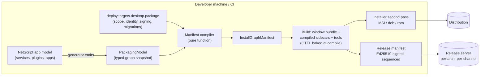
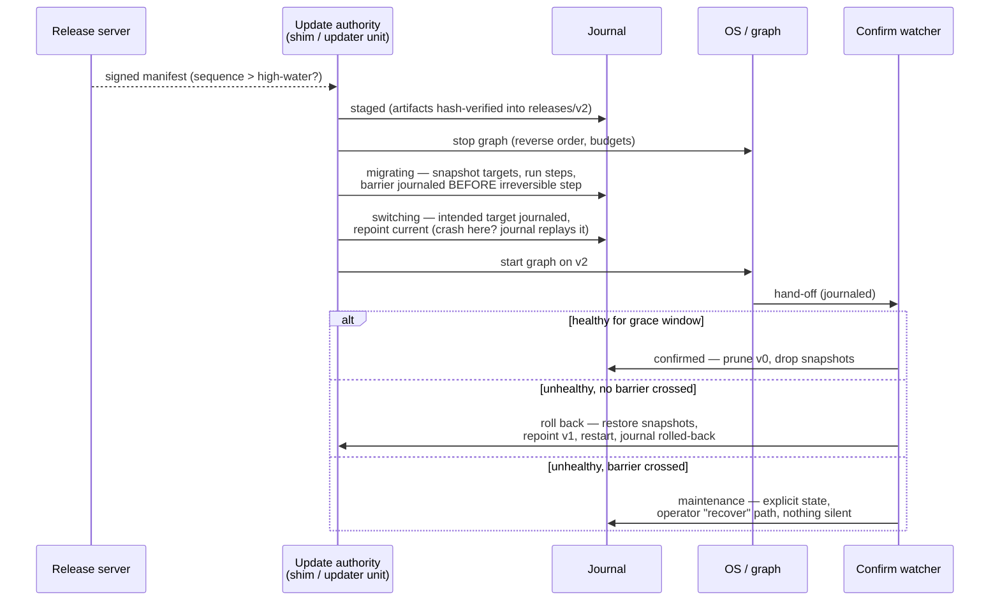
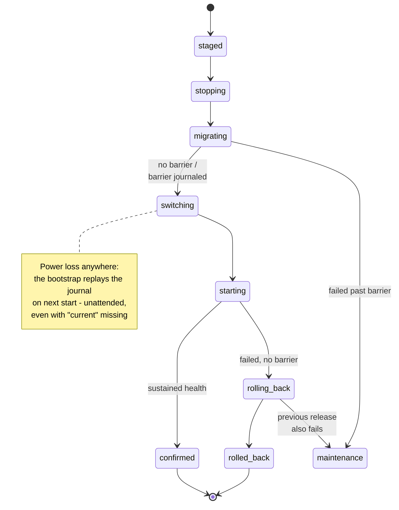

# RFC — NetScript Single Deployment: process-managed apps, single & multi runtime

| | |
| --- | --- |
| **Status** | **Ratified** (owner, 2026-07-17) — direction + sequencing locked, board filed (§8); adversarially reviewed (9 cycles) |
| **Tracking** | Refs #820 (charter) · #510 (Process Manager) · #327 (Deployment) · **#823 (Unified epic)** · **#830 (Desktop-graph epic)** · **#825 (Aspire packaging integration)** |
| **Shipping order (ratified)** | beta.11 **Desktop Frontend wave (#840)** + unified seed → **beta.12 PM ships first** → beta.13 Unified marquee → beta.14 desktop graph + combined installers → stable hardening |
| **Evidence base** | eis-chat#150 Windows singleton POC (merged, smoke-tested); Nitro v3 docs (live); Aspire "multi-language integrations" (ATS); full engineering spec in `plan.md` (this PR) |

---

## Abstract

Today a NetScript application is a *development-time* orchestration: Aspire runs the graph, and nothing owns what happens on an end user's machine. This RFC makes **"one artifact, one install, one update"** a first-class NetScript capability:

```
netscript deploy desktop build      # one installable artifact from your existing app
netscript deploy desktop install    # per-user or per-machine, journaled, least-privilege
netscript deploy desktop upgrade    # atomic, crash-recoverable, health-confirmed, rollback-able
```

The same contract covers **two composition modes**: **single-runtime** (all services composed into one process) and **singleton-graph** (a native window supervising an adjacent process graph — databases with exclusive locks, external tools, isolated workers). Both modes share one packaging pipeline, one manifest family, one update mechanism, and one first-run story; they diverge only where physics demands it.

Single-runtime as a *product* is bigger than any single deployment target: it is the **Unified epic (#823)** — Nitro v3 as the runtime-agnostic single deploy output with cloud presets and its adapter surface (database, cache, KV, tasks, WebSocket), positioning NetScript as a Next.js/Nuxt-class contender while teams scale by splitting resources into "macro services" across deploy targets. This RFC owns the **foundations** (supervision, packaging, installation, update) and the **desktop targets**; the Unified epic owns the single-runtime product and starts with its own seed run (#824).

---

## 1. Motivation

The eis-chat prototype (eis-chat#150) proved the end state is real: a Deno Desktop window directly supervising Garnet plus six compiled NetScript services, shipped as a single folder, working offline, with full Aspire telemetry — no Docker, no .NET runtime, no installed Aspire on the user's machine.

It also proved exactly what must NOT be script glue, because the prototype breaks precisely where the framework is absent:

| POC reality | Consequence |
| --- | --- |
| Supervision is **launch-only** — nothing watches a sidecar after readiness | A crashed service silently kills features; the only recovery is restarting the app |
| A hard-killed window **orphans the whole graph** | Zombie processes hold ports and file locks |
| Service topology, ports, and env are a **hand-maintained map**, duplicated at build time and runtime | Drifts from the real app model; fixed ports collide |
| Shipping = a timestamped folder + a `.cmd` launcher | No install/uninstall/repair, no elevation model, no signing |
| `Deno.autoUpdate()` patches only the window binary — and cannot apply on Windows | The combined artifact (window + N sidecars + tools) has **no update story at all** |

Every row above becomes a framework foundation below.

## 2. Goals and non-goals

**Goals (v1):**

- Ship any NetScript app as **one installable, signed, updatable artifact** for Windows and Linux, per-user or per-machine.
- **Crash-safe by construction**: every install/update/uninstall operation is a journaled transaction that recovers deterministically from power loss at any boundary — including reboot with a half-switched release.
- **Supervised at runtime**: restart policies, readiness probes, dependency-ordered start/stop, and guaranteed containment (no process outlives its supervisor).
- **Least privilege throughout**: elevation only at install time; the updater cannot rewrite code the workload runs as; end users get read-only status by default.
- **One mental model** across single-runtime and multi-process apps.

**Non-goals (v1, explicitly deferred):** macOS installers/notarization; fleet management (MDM/GPO/MSIX/app stores); staged-rollout rings; per-user instance brokering on shared machines; serverless/edge packaging.

## 3. The two composition modes

| | **Single-runtime** | **Singleton-graph** |
| --- | --- | --- |
| Shape | All logical services composed into **one process** (in-process service links) | Native window + **supervised adjacent processes** |
| When | Default — no native constraint forces separation | Exclusive-lock DB engines (tursodb), external tools (Garnet), crash/permission isolation |
| Needs the Process Manager | No (that's why it ships first) | Yes — the PM engine is its supervisor |
| Artifact | window/app bundle (K = 0 sidecars) | window bundle + K compiled sidecars + staged tools |

**The rule:** applications default to single-runtime and *earn* the graph — the framework treats the graph as the same app with K > 0 artifacts, not a different product. The enforcement point is a typed manifest family plus a cross-mode conformance suite (#837) that runs one reference app in **both** modes and asserts the shared behavior (discovery, data layout, provisioning, update, telemetry identity).

## 4. Architecture — five foundations

### F1 · Process supervision (the Process Manager engine — epic #510)

The supervision layer the POC lacked, built as a **library** (never a god-daemon):

- **Restart controller**: pure `nextDelay(state, policy, clock)` — exponential backoff, restart budgets, skip-exit-codes.
- **Readiness probes**: `http`, `tcp`, `process-lingering` (the three the POC actually needed), grace windows.
- **Dependency-ordered** start and reverse-ordered stop with per-process budgets.
- **Containment — nothing outlives its supervisor**: every supervised process holds an inherited pipe; supervisor death (even `SIGKILL`) closes it and the child self-terminates via a core runtime helper. Processes that can't cooperate (Garnet-class raw executables) are spawned through a tiny **guardian wrapper** that holds the pipe and kills its child-tree on EOF. OS backstops: Windows **Job Objects** (kill-on-job-close); Linux rendered `KillMode=control-group` for per-machine units.
- **Control plane**: a typed oRPC service (18 fixed routes) exposing status/health/logs/events — an OS-supervised *sibling* of the workload, never its parent. The desktop window embeds the engine (per-user mode) or connects as a client (per-machine mode).

### F2 · Packaging pipeline (from the app model, never a hand map)

One pipeline turns the app you already have into the artifact set:

- The **generator emits a typed `PackagingModel`** — resources, endpoints, dependency edges, env/discovery topology — from the same model that already generates the Aspire dev helpers. Zero hand-maintained service maps.
- A **pure compiler** `(PackagingModel, deploy.targets.<member>.package config) → InstallGraphManifest` adds what the graph can't know: scope, identity, signing, provisioning, migration/snapshot policy.
- Outputs: the Deno Desktop window bundle, K `deno compile`d sidecars (plugins ship compile-ready `./services` entrypoints), staged tools, launchers — with OTEL enablement baked at compile time (a hard-won POC lesson: runtime-only env yields an empty dashboard).
- **Invocation is Aspire-native**: the canonical `netscript deploy <target> build` verb, *and* a named TS-AppHost `pipeline.addStep(...)` so `aspire publish` produces installers as part of its step graph.

### F3 · Installation layer (inside the deploy stack, not beside it)

Desktop targets are ordinary `DeployTargetPort` adapters in the existing registry (`install→up`, `uninstall→down`) plus a narrow `MaintenancePort` for `repair`/`recover` — no parallel command tree, no new port axis.

- **Two scopes, one manifest**: *per-user* (no elevation ever; the window embeds the supervisor) and *per-machine* (elevation exactly once, at install; services registered via `OsServicePort` under a dedicated low-privilege account; every user's window is a client).
- **Least-privilege by ACL**: the updater identity is the *only* writer of releases and the journal; the workload account gets read/execute on code and write on its data root only; installers grant service-control scoped to exactly this app's units.
- **Journaled operations**: install (`staged → claiming → provisioning → registering → starting → confirmed`, with reverse-replay compensation from any failure), repair (journal-reconciling, idempotent), uninstall (retains data by default), and purge (a separate four-state, roll-forward-only operation whose journal lives *outside* the install root, so an explicit purge survives even the installer's own deletion).
- **Machine-wide port registry** (`%ProgramData%\NetScript\` / `/var/lib/netscript/`): installs reserve fixed ports transactionally and refuse with actionable diagnostics on conflict — two NetScript apps coexist or fail loudly, never silently.
- **Installer authoring is a first-class .NET citizen of the Aspire stack** (#825, owner-ratified): no Deno-native combined-MSI path exists — `deno desktop`'s pure-Rust MSI packages only the window bundle (per-machine, no sidecars) and its docs punt to WiX/NSIS/Inno for more. So `NetScript.Aspire.Packaging` ships as a **C# Aspire hosting-integration NuGet annotated with ATS `[AspireExport]`**: the Aspire CLI generates a typed TypeScript SDK from it (JSON-RPC into the C# code at runtime), and the TS AppHost consumes it as decorators/publish-pipeline steps — the exact mechanism Aspire documents for multi-language integrations. WiX-class MSI authoring and the `signtool` hook live behind it; deb/rpm stays native-side. Build machines need the .NET SDK (already true in the POC); end users need nothing.

### F4 · Update lifecycle (tiered — ratified Option A, 2026-07-17)

**Two apply mechanisms, one release-server/manifest lineage, each used where it's honest:**

- **Window-only artifacts (the thin-client tier, beta.11 — epic #840):** native `Deno.autoUpdate()` — bsdiff deltas, Ed25519-signed `latest.json`, staged swap, self-healing rollback — wrapped by a typed SDK mechanism (#841) that pins keys, wires per-arch URLs, reports rollbacks to telemetry, and isolates upstream API churn (the `Deno.desktop` namespace move, denoland/deno#35939). **Windows caveat, stated honestly:** upstream apply is still unsupported (patches stage but never swap — tracked in denoland/deno#35269), so v1 ships staged-detection + a manual-update UX; if upstream lands apply, the tier converges for free.
- **Combined artifacts (window + sidecars, beta.14):** the native mechanism patches one file and cannot cover N artifacts, so NetScript updates **the whole release atomically**:

- **Immutable releases**: `releases/<version>/` + a `current` link; a stable installer-managed **bootstrap** resolves the release *journal-first* (by direct path), so recovery works even when `current` is missing after a crash — Windows' junction-swap non-atomicity becomes harmless.
- **A durable journal** (append-only, checksummed, fsynced) drives every transition; recovery from any crash boundary — including a **cold reboot mid-switch** — is a deterministic table lookup, executed unattended by an installer-registered recovery unit before any workload starts.
- **Three-phase ownership** (no self-starting deadlocks): boot recovery does pointer-level reconciliation only → the OS starts the graph → one **confirm watcher** observes sustained health (default 60 s, zero crash-restarts) and either commits or initiates rollback.
- **Data safety**: pre-migration snapshots into a transaction area; irreversible migrations declare a **rollback barrier** — crossing one and failing lands in an explicit `maintenance` state with a documented `recover` path, never silent data loss.
- **Supply-chain posture**: Ed25519-signed manifests against a key **pinned at install time**; a monotonic sequence high-water blocks replay/downgrade even across an authorized recovery; release/bootstrap version compatibility is enforced before staging.

The release server ships in the thin-client tier serving the **native manifest format**; the combined-artifact release manifest is a designed superset (same crypto) — one lineage, no fork.

### F5 · Runtime surface (discovery, health, auth, window bindings)

- **Type-safe window bindings (#842):** Deno Desktop's webview↔runtime bindings have no built-in type bridge (the docs prescribe a hand-maintained `bindings.d.ts`). NetScript replaces that with contract-first RPC: a port shim adapts the bind channel into a MessagePort pair, and **oRPC's Message Port adapter** runs the same typed contracts NetScript services already use across the window boundary — end-to-end types, browser/Aspire no-op parity. Desktop UI itself becomes NetScript components (#843: tray, menus, dialogs, notifications, window chrome — fresh-ui, desktop-gated).

- **Discovery without port collisions**: per-user graphs allocate sidecar ports dynamically; browser code compiles against **port-free same-origin paths** (`/_svc/<name>`) proxied by the window — N users on one machine can't collide, and the build-time `import.meta.env` constraint is respected. Per-machine tenants use manifest-fixed, registry-reserved ports.
- **End-user health awareness** (the POC's "silently broken" fix): a small SDK widget subscribes to the control plane — *"search is restarting (2/3)…"* instead of dead features.
- **Auth**: the window's proxy requires a per-launch token (another local user can't ride it); per-machine control-plane access mints per-user **read** tokens over an OS-authenticated channel; mutations require the admin/updater identity.

## 5. Sequencing and how it ships (owner-ratified 2026-07-17)

**The what-ships-first decision.** Three candidates were weighed: desktop multi-process without the PM, the Unified single-runtime epic, and the PM foundation. Resolution:

1. **Desktop multi-process without the PM is rejected outright** — that is exactly the POC shipped as a product: launch-only supervision, silently dead features, orphaned graphs.
2. **The PM ships first (beta.12)** — it is the only epic implementation-ready today (ratified, fully sliced), it hardens what NetScript already is (multi-process), and it is the prerequisite the desktop graph needs anyway.
3. **The Unified epic is planned immediately and ships as the next marquee (beta.13)** — it is PM-independent, so its seed run (#824: Nitro v3 validation, adapter mapping against the shipped `@netscript` adapters, composition contract, epic decomposition) proceeds in parallel with PM implementation on a separate lane.
4. **Desktop comes last and splits in two**: desktop-single-runtime (a window around the unified output) falls out of the Unified epic + the packaging substrate nearly for free; the desktop supervised-graph (#830) ships after both (beta.14).
5. **The substrate starts now (beta.11)** — it serves all three consumers.

| Milestone | Lane | Deliverables (live issues) |
| --- | --- | --- |
| **beta.11** | **Desktop Frontend wave (#840)** + unified planning | The full frontend as a desktop app, the NetScript way — native-first thin-client (window to consumer machines, services in the vendor's cloud): native packaging formats + release server + `Deno.autoUpdate` wiring (#456), thin-client e2e incl. macOS/Linux apply+rollback proof and the Windows manual path (#457), generator app-type + packaging hook (#452), **SDK auto-update mechanism (#841)**, **type-safe bindings via oRPC MessagePort (#842)**, **fresh-ui desktop components (#843)**; health-aggregation fix (#826); **Unified seed run (#824)** |
| **beta.12** | **PM — the first shipping wave** | Epic #510 (engine, control plane, CLI, console) with POC-driven amendments (probe kinds #512, spawn env hygiene #516, renderer knobs #526); adoption contract (#827) + supervised-child helper (#828); plugin `./services` entrypoints (#829); PM console packaged window-only (#543) |
| **beta.13** | **Unified — the marquee** | Epic #823 implementation (sub-issues filed by its seed #824): Nitro v3 single deploy output, adapter integration, cloud presets, macro-services splitting. Absorbs #451/#453/#454/#455 per the seed's re-scheduling |
| **beta.14** | Desktop singleton-graph + combined installers | Epic #830: manifest compiler + Aspire publish step (#831), desktop supervisor host (#832), installers/scopes/ACLs (#833) with **`NetScript.Aspire.Packaging` #825** (the .NET/ATS integration — load-bearing once the full stack ships as one output), graph update transaction (#834), first-run provisioning (#835), health widget (#836), cross-mode conformance suite (#837), full-fault e2e (#838) |
| **stable** | Hardening | Signing automation (#458), Linux OS containment backstop (#839), rollout rings |

Every slice carries adversarially-derived fault gates (crash-mid-junction, torn journal, power-loss replay, barrier crashes, non-cooperative-process hard-kill, unattended reboot, two-app port conflict, replay/downgrade, cross-user proxy denial).

## 6. End-to-end flows

Example app: **acme-notes** — a Fresh window UI, a `notes` service owning a tursodb database (exclusive lock ⇒ singleton-graph mode), background `workers`, and Garnet as the shared queue backend.

### 6.1 Developer ships a release



Triggered by `netscript deploy desktop build` or the registered `aspire publish` pipeline step — same code path.

### 6.2 End user installs and runs (per-user mode)

```mermaid
sequenceDiagram
  actor U as User
  participant I as Installer
  participant B as Launcher bootstrap
  participant PM as PM engine (in window)
  participant S as Sidecars (notes, workers)
  participant G as Guardian → Garnet

  U->>I: run installer (no elevation, per-user)
  I->>I: journal: claim ports · provision data dir,<br/>secrets, schema · register shortcuts
  U->>B: launch acme-notes
  B->>B: journal preamble → resolve release via current
  B->>PM: start window + embedded engine
  PM->>G: spawn Garnet via guardian (pipe held)
  PM->>S: spawn sidecars, dependency-ordered,<br/>readiness-gated (dynamic ports)
  S-->>PM: healthy
  PM-->>U: window UI live (/_svc same-origin proxy)
  Note over PM,S: sidecar crashes later → restart policy;<br/>window hard-killed → pipes close, graph self-terminates
```

### 6.3 An update arrives — atomic, health-confirmed, reversible



### 6.4 The journal that makes it crash-safe



## 7. Security model (summary)

Install-time-pinned Ed25519 trust root (re-pin only via installer/operator, never a downloaded manifest) · signed manifests + per-artifact hashes · monotonic sequence high-water (no replay/downgrade, survives authorized recovery) · elevation only inside the installer · updater/workload/user privilege separation enforced by ACLs and negatively tested · per-launch proxy tokens · OS-authenticated read-token minting for per-machine status.

## 8. Board state — FILED 2026-07-17 (owner-ratified and owner-authorized; Option-A pass included)

Full mapping in `FILING-LOG.md` (this PR). **Option-A pass:** Desktop Frontend epic **#840** (beta.11) with #841 (SDK auto-update wrapper), #842 (type-safe bindings via oRPC MessagePort), #843 (fresh-ui desktop components); #452/#456/#457 re-scoped native-first under it; **#825 → beta.14**; label `epic:desktop-frontend`. Base pass: milestone **`0.0.1-beta.14`** created; label `epic:unified-runtime` created (+ `labels.yml` parity for both in this PR). **New:** Unified epic #823 + seed #824 · packaging integration #825 · health fix #826 · PM-A #827 · PM-B #828 · plugin entrypoints #829 · Desktop-graph epic #830 with #831–#838 + #839 (stable). **Adjusted:** #456/#457 re-titled + re-scoped as the single-artifact substrate; #452 re-scoped (+ public `./types` jsr gate); #451/#453/#454/#455 re-homed to #823 (Backlog/Triage pending the seed); PM-1/PM-5/PM-15 amended (#512/#516/#526); #543 Windows-caveat superseded; #458 → stable; **#349 closed** as superseded; #510 and #327 epic bodies updated with the ratified order.

## 9. Decision log (all ratified 2026-07-17)

| Fork | Question | Resolution |
| --- | --- | --- |
| OF-A | New child epic vs growing #327 in place | **Ratified** — epics #823 + #830 filed |
| OF-B | Single-runtime lane milestone | **Superseded** — lane re-homed to the Unified epic; its seed (#824) re-schedules |
| OF-C | #456/#457 splits + "snapshot updater is the only mechanism" | **Ratified** — applied on the live issues |
| OF-D | Windows installer realization | **Ratified** — first-class .NET Aspire hosting integration (#825, ATS-exported NuGet); upstream deno-desktop hook stays a watch item |
| OF-E | Per-machine scope in v1 | Ratified — Win + Linux; macOS out |
| OF-F | Per-machine tenancy | Ratified — one machine-wide tenant |
| OF-G | Adoption-contract placement | Ratified — PM epic (#827, beta.12) |
| OF-H | Linux containment bar | Ratified — universal pipe/guardian layer + documented residual; OS backstop #839 at stable |
| OF-I | May automatic updates change the installed graph? | Ratified — no: digest match or "installer required" |
| OF-J | Sequence epoch on key re-pin | Ratified — high-water never lowers; reset only explicit |
| OF-K | Windows per-machine containment | Ratified — Job-Object wrapper (Servy tree-kill unproven) |

| OF-L | Thin-client update mechanism (Option A, ratified 2026-07-17 late) | **Native-first**: window-only tier uses `Deno.autoUpdate` via the SDK wrapper #841 (Windows = staged-detection + manual UX until upstream apply lands, denoland/deno#35269); the snapshot transaction stays the combined-artifact mechanism (beta.14); one release-server/manifest lineage; #825 → beta.14. Freed capacity funds the Desktop Frontend wave #840 (#841/#842/#843) |

Remaining open decisions now live where they belong: the Unified epic's are produced by its seed run (#824); the desktop-graph slices carry theirs as implementation-time acceptance (#830 tree).

---

<sub>**Provenance.** Supersedes #821 (opened from a stale branch by mistake). This PR lands the full engineering record: `plan.md` rev 10 (the normative spec behind §4/§6/§7; where its beta.11 "single-runtime lane" framing conflicts with the ratified §5 order, **GitHub and this document win**), `research.md` (eis-chat#150 forensics + gap analysis), a 9-cycle adversarial review trail (`plan-eval-cycle1..9.md`, GPT-5.6 Sol·max, separate sessions — final: 6/8 plan-gate boxes PASS), and `FILING-LOG.md` (the 2026-07-17 owner-authorized board filing this document's §8 reflects). Refs #820 — no closing keyword. 🤖 Generated with [Claude Code](https://claude.com/claude-code) · https://claude.ai/code/session_016wV13zTE9bz2Yf1iR762qZ</sub>
