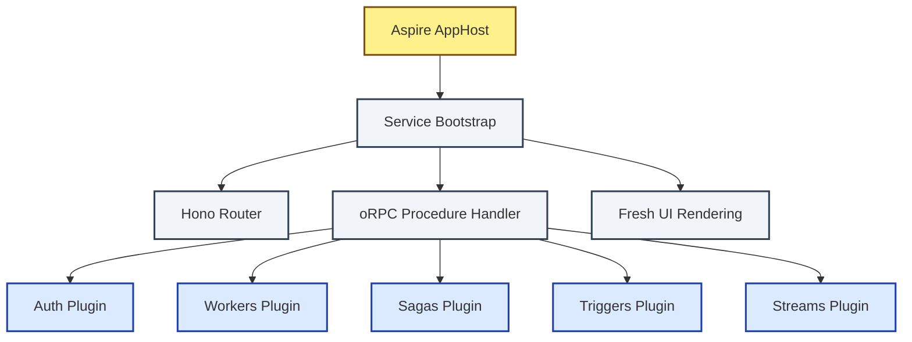

# SOTA Landing Dossier: NetScript Meta-Framework README Roadmap

## Track 1: Competitor Head-to-Head (Plugin & Composable Backend Focus)

An analysis of the 10 closest-positioned modern web and backend frameworks/builders. It studies how each framework’s landing page structures its architecture message, composable plugin/module story, and how it sequences the narrative: `What is it → Why → Quickstart → Architecture → Package Map → Docs`.

### 1. Encore (encore.dev)
- **Repository URL**: `https://github.com/encoredev/encore`
- **Specific Visual/Instructional Device**: Code-annotation microservice infrastructure binding & auto-rendering topology. Encore showcases TypeScript/Go controllers side-by-side with an automatically generated, live architectural topology diagram.
- **Narrative Sequence**: What is it (visual pitch) → Main features grid → Interactive code demo (how infra is declared in code) → Architecture visualizer explanation → Installation → Local development experience (`encore run`).
- **Core backend architecture & plugin presentation**: Rather than using runtime plugins, Encore uses **static analysis** to infer services, queues, and databases from the code definition itself. 
- **Exact Device Quote/Description**:
  > "Encore uses static analysis to understand what your application does. It automatically acts as the glue, setting up your cloud infrastructure... and drawing your service catalog and architecture diagram automatically."

### 2. Wasp (wasp-lang.dev)
- **Repository URL**: `https://github.com/wasp-lang/wasp`
- **Specific Visual/Instructional Device**: Dual-pane file mapping (Declarative `.wasp` file contrasted side-by-side with compiled server/client React and Node JS outputs).
- **Narrative Sequence**: Headline & value prop → Interactive CLI output visualizer → Code snippet comparisons → Feature highlight lists (Auth, Job queues, CRON, DB scaffolding) → Quick Start → Core architectural guides.
- **Core backend architecture & plugin presentation**: Presents a central coordination manifest (the `.wasp` compiler spec) that provisions server runtimes, databases, Auth adapters, and worker queues automatically. 
- **Exact Device Quote/Description**:
  > "Describe your database, authentication, background jobs, and routing in Wasp's config format. Write your core business logic in standard, modern React, Node.js, and Prisma."

### 3. RedwoodJS (redwoodjs.com)
- **Repository URL**: `https://github.com/redwoodjs/redwood`
- **Specific Visual/Instructional Device**: The CLI Scaffold Code-Gen Walkthrough. Shows how single CLI instructions scaffold database migrations, GraphQL schemas, page routing, and frontend services simultaneously.
- **Narrative Sequence**: Logo and badge bar → High-level architectural pillars (GraphQL, Prisma, Route map) → Features bullet checklist → "How it fits together" workspace directory overview → Getting Started framework commands.
- **Core backend architecture & plugin presentation**: Showcases a monorepo multi-workspace table dividing `api/` (backend middleware, DB models, Prisma, GraphQL resolver schemas) and `web/` (React routing, components, view pages).
- **Exact Device Quote/Description**:
  > "Redwood is an opinionated, full-stack, serverless-ready web framework... Redwood applications are split into two parts: a frontend (web) and a backend (api) that communicate via GraphQL."

### 4. AdonisJS (adonisjs.com)
- **Repository URL**: `https://github.com/adonisjs/core`
- **Specific Visual/Instructional Device**: Robust Service Providers table and IoC dynamic bindings overview. Shows a clean list of first-party modules (OAuth, Redis, Auth, Session, Mailer) registering with a central IoC container.
- **Narrative Sequence**: Banner and social links → One-sentence pitch → Bulleted design principles (TypeScript, Node native, Unified tooling) → Complete express-like routing code sample with fully-typed controllers and models → Package ecosystem checklist.
- **Core backend architecture & plugin presentation**: The plugin story is expressed around **Service Providers** (Adonis IOC bindings). New modules are installed via their CLI, which automatically registers a config file and an architectural provider into the IoC boot list.
- **Exact Device Quote/Description**:
  > "AdonisJS is a TypeScript-first web framework for Node.js. It comes with a robust dependency injection container, a powerful SQL ORM, active record implementation, and first-party packages for hashing, encryption, session, validation, and auth."

### 5. Medusa (medusajs.com)
- **Repository URL**: `https://github.com/medusajs/medusa`
- **Specific Visual/Instructional Device**: "Core vs Module" architectural schema. Displays a beautifully structured architectural grid grouping Core commerce capabilities, replaceable custom adapter plugins, and head-agnostic presentations.
- **Narrative Sequence**: Scaled banner & badge indicators → Three-line developer proposition → High-level architecture map → Quick Start commands and CLI project templates → Extensive Package Map/Table covering available core and 3rd party plugins.
- **Core backend architecture & plugin presentation**: Presents commerce logic as isolated, pluggable modules (e.g. `@medusajs/cart`, `@medusajs/inventory`) bound by service injection. Runtimes are fully abstract; drivers can be swapped transparently.
- **Exact Device Quote/Description**:
  > "Medusa is a composable engine... features a modular architecture that exposes a rich API surface for custom integrations. Swap any component out for your own, or integrate your favorite third-party services."

### 6. Nitro / UnJS (nitro.unjs.io)
- **Repository URL**: `https://github.com/unjs/nitro`
- **Specific Visual/Instructional Device**: Interactive Engine Compatibility Grid. Demonstrates dynamic routing compatibility across multiple runtimes (Workers, Bun, Deno, Node) with Zero-Config build targets.
- **Narrative Sequence**: Banner and standard title → Features-at-a-glance icon board → One-terminal installation flow → Code sample showing file-system route design and auto-imported helpers → Broad runtime target matrix.
- **Core backend architecture & plugin presentation**: Emphasizes high-speed storage caching layers, file-system routed handlers, and pluggable storage backends (Redis, KV, Memory) wrapped under a unified virtual filesystem driver.
- **Exact Device Quote/Description**:
  > "Nitro is an open-source server engine that lets you build-and-deploy ultra-fast, engine-agnostic server applications. It powers Nuxt and is fully compatible with any JavaScript platform."

### 7. Hono (hono.dev)
- **Repository URL**: `https://github.com/honojs/hono`
- **Specific Visual/Instructional Device**: Ultrafast router benchmark comparisons and native runtime multi-support grid.
- **Narrative Sequence**: Small fire logo → Value prop text on multi-runtime compliance → Minimal, beautiful router code block → Quickstart scaffolder commands → Multi-runtime compilation guidelines.
- **Core backend architecture & plugin presentation**: Features a composable middleware pipeline. Custom middleware handles auth, logs, cache, CORS, etc., loaded linearly into standard Web-Standard request/response boundaries.
- **Exact Device Quote/Description**:
  > "Hono - *means flame🔥 in Japanese* - is a small, simple, and ultrafast web framework built on Web Standards. It works on any JavaScript runtime: Cloudflare Workers, Fastly Compute, Deno, Bun, Vercel, AWS Lambda, Lambda@Edge, and Node.js."

### 8. Fresh (fresh.deno.dev)
- **Repository URL**: `https://github.com/denoland/fresh`
- **Specific Visual/Instructional Device**: Speed and hydration graphic showing islands of interactivity over static SSR html.
- **Narrative Sequence**: Clean text title → Quickstart command line → High-level feature list emphasizing Deno integration, zero-config, JIT rendering on edge → Minimal structure breakdown showing page and islands folders.
- **Core backend architecture & plugin presentation**: Displays a middleware and route map relying on standard Deno imports. Demonstrates Fresh plugins contributing routes, middlewares, templates, and assets to the core runtime seamlessly.
- **Exact Device Quote/Description**:
  > "Fresh is a next generation web framework... features just-in-time rendering on the edge, island-based interactive hydration, and zero configuration."

### 9. Nx (nx.dev)
- **Repository URL**: `https://github.com/nrwl/nx`
- **Specific Visual/Instructional Device**: Interactive task pipeline and workspace monorepo graph representation.
- **Narrative Sequence**: Headline → Task executor demo with beautiful console rendering → Target dependencies diagram → Monorepo structuring guides → Extensibility through community plugins.
- **Core backend architecture & plugin presentation**: Demonstrates how a central construction pipeline delegates workspace commands to localized project targets. Plugins add code generators and task executors to the workspace.
- **Exact Device Quote/Description**:
  > "Nx is a next-generation build system with monorepo support and powerful integrations. Nx is extremely fast, extensible, and provides smart defaults."

### 10. Effect (effect.website)
- **Repository URL**: `https://github.com/Effect-TS/effect`
- **Specific Visual/Instructional Device**: Modular execution stack layer diagram. Displays Effect’s core runtime primitives (Fibers, Concurrency, Tracing, Schema) stacked as a cohesive platform.
- **Narrative Sequence**: Title → Structural pillars grid → Code sample demonstrating typed service definitions and dependency injection → Quickstart installation → API capability hierarchy.
- **Core backend architecture & plugin presentation**: Expressed as a composable functional runtime stack. Services are modeled as type-safe contracts (`Context.Tag`) resolved at boot-time with mock or real adapters.
- **Exact Device Quote/Description**:
  > "Effect is a fully-typed, functional library that helps developers easily write complex, asynchronous, and concurrent programs in TypeScript. It provides a standard library, a powerful runtime, first-class dependency injection, and out-of-the-box telemetry."

---

## Track 2: NetScript Canonical Framework-Landing Skeleton (`/README.md`)

This chapter outlines the exact narrative flow, section headers, and per-chapter structural guidelines for the root `/README.md`. It is designed to tell the NetScript architectural story truthfully, matching the repo voice doctrine.

```markdown
# NetScript (Root Title Block)
[Logo / Hero Media Block]
[Header Badges Block]

(Brief 2-3 line value proposition explaining what NetScript is: a JSR-native meta-framework over Hono, oRPC, Fresh, and .NET Aspire, featuring composable background/saga plugins.)

---

## 🧭 Positioning & Core Philosophy
(What is NetScript? Why does it exist? Highlight the "composable backend framework" story. Avoid toxically apologetic alpha language. Signal alpha maturity as a factual noun-phrase callout.)

## 🚀 60-Second Quick Start
(How to scaffold a new workspace using `@netscript/cli` under the Deno toolchain.)

## 🗺️ Workspace & Package Architecture
(Explain the physical vs. conceptual layers of NetScript: Contracts, Logger, SDK, Runtime Config, KV/DB foundations, and how Plugins mount over Hono+oRPC boundaries.)

## 🎨 Visualizing the Composition Root
(Architectural diagram showing Hono router -> oRPC typed procedures -> Fresh UI -> Aspire orchestration, with first-party plugins: workers, triggers, streams, sagas, auth.)

## 📦 Ground-Truth Monorepo Map
(Categorized, highly readable table mapping the real 31 published @netscript/* packages by layer, complete with JSR badges and reference docs links.)

## ⚙️ .NET Aspire & Multi-Runtime Orchestration
(How NetScript leverages Aspire to compose services, schedule workers, and bind microservice boundaries on local and cloud runtimes.)

## 📖 Deep Documentation Hub
(Absolute links to rickylabs.github.io/netscript/ structured by capability hubs, tutorials, explanation, and package specs.)

## 📅 Roadmap & Alpha Maturity
(Clean, professional timeline. Direct links to GitHub Issues and milestones board.)

## 🤝 Community & Contributing
(Link to Discord, CODE_OF_CONDUCT.md, and CONTRIBUTING.md.)

## 📝 License
(MIT, JSR cryptographically verified provenance.)
```

---

## Track 3: Hero Design Options

### Hero Option A: Fully JSR-Compatible Flat Monospace Banner (Default Recommendation)

Since JSR completely strips `<picture>` media queries, CSS positioning, and wraps large images in fluid viewports, this option uses a beautifully structured ASCII / Monospace layout styled with standard Markdown elements to establish an immediate, high-fidelity developer context on both platforms.

```markdown
# NetScript
> ⚡ The Deno-Native Backend Meta-Framework

```text
 ┌─────────────────────────────────────────────────────────────┐
 │  Hono Router  ▲  oRPC Procedures  ▲  Fresh UI  ▲  Aspire     │
 ├─────────────────────────────────────────────────────────────┤
 │   [Auth]  ▲  [Workers]  ▲  [Sagas]  ▲  [Triggers]  ▲  [Streams] │
 └─────────────────────────────────────────────────────────────┘
```

**NetScript** is an enterprise-grade backend meta-framework built natively for Deno and the JSR ecosystem. It fuses Web-standard routing (**Hono**), type-safe remote procedures (**oRPC**), edge-rendered UI (**Fresh**), and cloud-native orchestration (**Aspire**) into a unified, plugin-centric architecture.

[](https://jsr.io/@netscript)
[](https://github.com/rickylabs/netscript/actions)
[](https://rickylabs.github.io/netscript/)
```

### Hero Option B: Semi-Centered Minimalist Grid (GitHub-First Variant)

This variant employs standard HTML tags (`div`, `p`) that center elegantly on GitHub but gracefully fall back to left-aligned elements on JSR, utilizing a soft glow logo variant that remains visible on both theme options.

```html
<div align="center">
  
  <p><strong>A Deno-native, JSR-published plugin framework over Hono, oRPC, Fresh, and .NET Aspire.</strong></p>
  <p>
    <a href="https://jsr.io/@netscript"></a>
    <a href="https://github.com/rickylabs/netscript/actions"></a>
    <a href="https://rickylabs.github.io/netscript/"></a>
  </p>
</div>
```

*Rendering Caveat*: JSR strips the `filter` CSS attribute, centers might be stripped forcing it to left-align, and markdown links within divs behavior can be quirky. To prevent rendering failure, standard markdown fallbacks must be written directly below the HTML block.

---

## Track 4: Architecture-Diagram Options

To show the NetScript model: **Hono Router + oRPC Typed Procedures + Fresh UI + .NET Aspire + First-Party Plugins (Workers, Sagas, Triggers, Streams)**.

### Option A: The Resilient ASCII Canvas (Highly Recommended)
ASCII rendering is 100% stable; it loads instantaneously and looks identical on GitHub, JSR, raw cargo CLI terminals, and local editors.

```text
               ┌───────────────────────┐
               │    .NET Aspire Host   │  (Orchestrates cloud backends,
               └───────────┬───────────┘   databases, queues, & routing)
                           │
       ┌───────────────────▼───────────────────┐
       │   NetScript Service Bootstrap Host    │
       └───────────────────┬───────────────────┘
                           │
    ┌──────────────────────┼──────────────────────┐
    │  Hono Router Layer   │  oRPC typed contracts│
    └──────────┬───────────┴───────────┬──────────┘
               │                       │
      ┌────────▼────────┐     ┌────────▼────────┐
      │  Fresh Web UI   │     │  Procedure APIs │
      └─────────────────┘     └────────┬────────┘
                                       │ (Enables modular plugins)
             ┌─────────────────────────┼─────────────────────────┐
             │                         │                         │
     ┌───────▼───────┐         ┌───────▼───────┐         ┌───────▼───────┐
     │  Auth Plugin  │         │ Worker Plugin │         │ Stream Plugin │
     │ (Better-Auth) │         │ (Fedify Qs)   │         │ (Sagas/State) │
     └───────────────┘         └───────────────┘         └───────────────┘
```

- **Pros**: Perfectly JSR and GitHub identical; zero hosting or loading failure vectors; searchable.
- **Cons**: Lack of sleek visual lines; cannot represent deep multi-dimensional pathways.

### Option B: The Unified Mermaid Graph
Mermaid syntax works beautifully in the GitHub markdown viewer but is **stripped completely** on JSR (renders as a raw text block, exposing the mermaid code).



- **Pros**: Renders interactive, modern visual boxes on GitHub; simple to inspect and modify right inside the markdown file.
- **Cons**: Renders as raw code on JSR scope page, destroying readability and score discovery metrics.
- **Fallback Rule**: If used, it must be nested under a `<details>` tag with an ASCII diagram alternative preceding it.

---

## Track 5: Ground-Truth Monorepo Package Map

Instead of a flat 31-package printout, NetScript packages must be classified by layers (Foundation, Data, Runtime Plugins/Core Contracts, Auth Backends, App Surface) to guide developers quickly to their destination.

### Package Groups

1. **Foundational Platform Core** (`@netscript/contracts`, `@netscript/config`, `@netscript/logger`, `@netscript/sdk`, `@netscript/runtime-config`, `@netscript/telemetry`, `@netscript/cli`)
2. **Data & Storage Layer** (`@netscript/kv`, `@netscript/database`, `@netscript/prisma-adapter-mysql`, `@netscript/watchers`, `@netscript/cron`)
3. **Core Contracts & Manifests** (`@netscript/plugin`, `@netscript/plugin-auth-core`, `@netscript/plugin-workers-core`, `@netscript/plugin-sagas-core`, `@netscript/plugin-triggers-core`, `@netscript/plugin-streams-core`)
4. **Active Runtime Service Plugins** (`@netscript/plugin-auth`, `@netscript/plugin-workers`, `@netscript/plugin-sagas`, `@netscript/plugin-triggers`, `@netscript/plugin-streams`)
5. **Auth Backend Adapters** (`@netscript/auth-better-auth`, `@netscript/auth-workos`, `@netscript/auth-kv-oauth`)
6. **Application Surface Integration** (`@netscript/aspire`, `@netscript/service`, `@netscript/fresh`, `@netscript/fresh-ui`)

### Layered Package Table Design

The column structure must feature: **Package · Description · JSR Badge · Documentation URL**

#### 1. Foundational Platform Core
| Package | JSR Registry | Core Duty / Capability | reference Docs |
| :--- | :--- | :--- | :--- |
| `@netscript/contracts` | [](https://jsr.io/@netscript/contracts) | oRPC base contracts, paginated schemas, and CRUD builders. | [📖 View Reference docs](https://rickylabs.github.io/netscript/reference/contracts/) |
| `@netscript/config` | [](https://jsr.io/@netscript/config) | Structured workspace configurations, env parser, and scaffold constants. | [📖 View Reference docs](https://rickylabs.github.io/netscript/reference/config/) |
| `@netscript/logger` | [](https://jsr.io/@netscript/logger) | High-performance structured tracing logger for services and background processes. | [📖 View Reference docs](https://rickylabs.github.io/netscript/reference/logger/) |
| `@netscript/sdk` | [](https://jsr.io/@netscript/sdk) | Internal service discovery, caching queries, and typed oRPC clients. | [📖 View Reference docs](https://rickylabs.github.io/netscript/reference/sdk/) |
| `@netscript/runtime-config` | [](https://jsr.io/@netscript/runtime-config) | Dynamic, hot-reloadable runtime config watchers and watchers overrides. | [📖 View Reference docs](https://rickylabs.github.io/netscript/reference/runtime-config/) |
| `@netscript/telemetry` | [](https://jsr.io/@netscript/telemetry) | OpenTelemetry metrics and tracer hooks for RPC endpoints, workers, and queues. | [📖 View Reference docs](https://rickylabs.github.io/netscript/reference/telemetry/) |
| `@netscript/cli` | [](https://jsr.io/@netscript/cli) | Local code generation CLI, scaffold runtime templates, and build runner hooks. | [📖 View Reference docs](https://rickylabs.github.io/netscript/reference/cli/) |

#### 2. Data & Storage Layer
| Package | JSR Registry | Core Duty / Capability | Reference Docs |
| :--- | :--- | :--- | :--- |
| `@netscript/kv` | [](https://jsr.io/@netscript/kv) | Reactive key-value runtime wrapper for Redis, Deno KV, and memory ports. | [📖 View Reference docs](https://rickylabs.github.io/netscript/reference/kv/) |
| `@netscript/database` | [](https://jsr.io/@netscript/database) | Database adapter contracts, Prisma tooling helpers, tracing, and model managers. | [📖 View Reference docs](https://rickylabs.github.io/netscript/reference/database/) |
| `@netscript/prisma-adapter-mysql`| [](https://jsr.io/@netscript/prisma-adapter-mysql) | Native MySQL/MariaDB schema adapters tailored for execution inside Deno runtimes. | [📖 View Reference docs](https://rickylabs.github.io/netscript/reference/prisma-adapter-mysql/) |
| `@netscript/watchers` | [](https://jsr.io/@netscript/watchers) | Robust file-watching engine with stability checks and multi-watch strategies. | [📖 View Reference docs](https://rickylabs.github.io/netscript/reference/watchers/) |
| `@netscript/cron` | [](https://jsr.io/@netscript/cron) | High-precision programmatic task schedulers mapped to cron format primitives. | [📖 View Reference docs](https://rickylabs.github.io/netscript/reference/cron/) |

#### 3. Core Contract Specifications (Plugin Ports)
| Package | JSR Registry | Core Duty / Capability | Reference Docs |
| :--- | :--- | :--- | :--- |
| `@netscript/plugin` | [](https://jsr.io/@netscript/plugin) | Abstract plugin manifest specification, verification, and discovery protocols. | [📖 View Reference docs](https://rickylabs.github.io/netscript/reference/plugin/) |
| `@netscript/plugin-auth-core` | [](https://jsr.io/@netscript/plugin-auth-core) | Port interface specs, schema requirements, and sandbox hooks for Auth. | [📖 View Reference docs](https://rickylabs.github.io/netscript/reference/plugin-auth-core/) |
| `@netscript/plugin-workers-core` | [](https://jsr.io/@netscript/plugin-workers-core)| Primitives and runtime interfaces definition for background tasks and job queues. | [📖 View Reference docs](https://rickylabs.github.io/netscript/reference/plugin-workers-core/) |
| `@netscript/plugin-sagas-core` | [](https://jsr.io/@netscript/plugin-sagas-core) | Core state machines, orchestration steps, and logging models for durable Transaction Sagas. | [📖 View Reference docs](https://rickylabs.github.io/netscript/reference/plugin-sagas-core/) |
| `@netscript/plugin-triggers-core`| [](https://jsr.io/@netscript/plugin-triggers-core) | DSL declarations, telemetry setups, and contract interfaces for trigger handlers. | [📖 View Reference docs](https://rickylabs.github.io/netscript/reference/plugin-triggers-core/) |
| `@netscript/plugin-streams-core` | [](https://jsr.io/@netscript/plugin-streams-core) | Diagnostics, configuration structures, and interfaces for event-driven stream pipes. | [📖 View Reference docs](https://rickylabs.github.io/netscript/reference/plugin-streams-core/) |

#### 4. Active Runtime Service Plugins
| Package | JSR Registry | Core Duty / Capability | Reference Docs |
| :--- | :--- | :--- | :--- |
| `@netscript/plugin-auth` | [](https://jsr.io/@netscript/plugin-auth) | Registers unified OAuth authentication services, credentials maps, and session endpoints. | [📖 View Reference docs](https://rickylabs.github.io/netscript/reference/plugin-auth/) |
| `@netscript/plugin-workers` | [](https://jsr.io/@netscript/plugin-workers) | Manages background queue operations, task runners, and API telemetry handlers. | [📖 View Reference docs](https://rickylabs.github.io/netscript/reference/plugin-workers/) |
| `@netscript/plugin-sagas` | [](https://jsr.io/@netscript/plugin-sagas) | Implements orchestrators executing multi-step state-persisted workflows reliably. | [📖 View Reference docs](https://rickylabs.github.io/netscript/reference/plugin-sagas/) |
| `@netscript/plugin-triggers` | [](https://jsr.io/@netscript/plugin-triggers) | Live trigger ingress, scheduler watchers, file monitors, and cron integration hooks. | [📖 View Reference docs](https://rickylabs.github.io/netscript/reference/plugin-triggers/) |
| `@netscript/plugin-streams` | [](https://jsr.io/@netscript/plugin-streams) | Durable Stream service brokers, CLI wiring, and local Aspire integrations. | [📖 View Reference docs](https://rickylabs.github.io/netscript/reference/plugin-streams/) |

#### 5. Auth Backend Adapters (Provider Plugs)
| Package | JSR Registry | Core Duty / Capability | Reference Docs |
| :--- | :--- | :--- | :--- |
| `@netscript/auth-better-auth` | [](https://jsr.io/@netscript/auth-better-auth) | Seamless bridge wrapping `better-auth` credentials pipelines inside our plugin. | [📖 View Reference docs](https://rickylabs.github.io/netscript/reference/auth-better-auth/) |
| `@netscript/auth-workos` | [](https://jsr.io/@netscript/auth-workos) | Enterprise single-sign-on integration adapter hooking WorkOS triggers. | [📖 View Reference docs](https://rickylabs.github.io/netscript/reference/auth-workos/) |
| `@netscript/auth-kv-oauth` | [](https://jsr.io/@netscript/auth-kv-oauth) | Standard Deno KV interactive OAuth2 / OpenID Connect connector. | [📖 View Reference docs](https://rickylabs.github.io/netscript/reference/auth-kv-oauth/) |

#### 6. Application Surface Integration
| Package | JSR Registry | Core Duty / Capability | Reference Docs |
| :--- | :--- | :--- | :--- |
| `@netscript/aspire` | [](https://jsr.io/@netscript/aspire) | Parses .NET Aspire configuration, links microservices, and exports TypeScript mappings. | [📖 View Reference docs](https://rickylabs.github.io/netscript/reference/aspire/) |
| `@netscript/service` | [](https://jsr.io/@netscript/service) | Bootstrap builders, health check probes, Hono route wires, and oRPC configs. | [📖 View Reference docs](https://rickylabs.github.io/netscript/reference/service/) |
| `@netscript/fresh` | [](https://jsr.io/@netscript/fresh) | Custom runtime Fresh blocks, forms, defer handlers, and page controllers. | [📖 View Reference docs](https://rickylabs.github.io/netscript/reference/fresh/) |
| `@netscript/fresh-ui` | [](https://jsr.io/@netscript/fresh-ui) | Dynamic components layouts and underlying styling frameworks. | [📖 View Reference docs](https://rickylabs.github.io/netscript/reference/fresh-ui/) |

---

## Track 6: Visual-Design + JSR-Compat Toolkit

To produce a markdown page that looks spectacular on GitHub but degrades cleanly on JSR without broken assets, weird spacing, or blank tags, keep this rulebook active:

| Resource Element | GitHub Render State | JSR Registry Render State | Implementation Law / Strategy |
| :--- | :--- | :--- | :--- |
| **Monospace / Code Blocks** | Full syntax highlighting via Prism. | Standard markdown block, correct themes. | Use standard markdown blocks with `typescript`, `bash`, or `json` attributes. Avoid rare file suffixes. |
| **Icons & Emojis** | Displays inline platform emojis or custom graphics. | Supports baseline system emojis. Strips custom HTML-wrapped image icons. | Use standard OS emojis (`🚀`, `🧭`, `🗺️`, `📦`, `⚙️`) to act as headers. Avoid linking SVG files raw inside `` tags for inline text. |
| **HTML Tag Stripping** | Renders elements like `details`, `summary`, `p`, `div`, `kbd`. | Strips custom CSS class names, inline styles, alignments, and center placements. | Group critical texts inside clean markdown blocks, because JSR skips styling. Write raw `<p>` and `<div align="center">` only for the primary logo. |
| **External Dynamic Badges** | Renders standard dynamic badges and shields in long inline rows. | Aggressively rate-limits external calls. | Clean up the badge row: Keep maximum 3-4 essential badges (JSR Scope, CI validation, Docs Badge). |
| **Relative Workspace Paths** | Resolves local files (`./docs/info.md`) relative to code version tag. | Local links are completely broken because JSR packages are uploaded in distinct flat directories. | **Must use absolute URLs**. Link only to `https://rickylabs.github.io/netscript/...` or absolute GitHub main raw URL patterns. |
| **Theme-Adaptive Imagery**| Supports dark/light mode graphics based on CSS dark-mode queries. | Strips the wrapper completely, matching dark or light blindly to single fallback image. | Bake a distinct semi-transparent outer glow (`indigo/blue` glow) on all logotype/graphics so they pop over both pure black and sharp white modes. |

---

## Track 7: Framework README Quality Blueprint

### Anti-Patterns to Outlaw
1. **"The Monolithic Code-Dump"**: Dumping hundred-line service definitions, database schemas, and docker-compose files inside the root file. Short, representative, API contracts are far more convincing.
2. **"Toxically Apologetic Tone"**: Hand-waving framework failures ("unstable alpha, we apologize for any missing tests!") which destroys corporate trust. Define maturity neutrally: "Active Alpha and transitioning toward feature stability".
3. **"Stale Scaffolding Instructions"**: SURFACING commands that do not resolve against current package revisions. Rely solely on validated `deno add jsr:@netscript/cli` scaffold sequences.
4. **"Fictional System Maps"**: Incorporating abstract workflow architectures that diverge from real runtime folder layers. Maintain complete convergence.
5. **"Deno-unaware Node Commands"**: Prioritizing npm or yarn examples over Deno-native command-line patterns on a JSR-first framework. Deno instructions must be primary.

### Landing Page Audit Checklist
- [ ] No relative URLs: Every documentation link targets `https://rickylabs.github.io/netscript/...` absolutely.
- [ ] Core Quickstart works: Scaffolding scripts and commands tested and validated under local check gates list.
- [ ] No apologies: Mentions alpha maturity using clean noun phrases without emotional hand-wringing.
- [ ] Diagram reads beautifully: High-fidelity ASCII alternatives precede any graph graphics.
- [ ] JSR-Safe theme: The central logo retains premium contrast over deep dark and bright white interfaces.
- [ ] Accurate 31-package map: Real `@netscript/*` packages fully accounted for, organized by platform layer, with corresponding documentation references.
- [ ] Strict lock isolation: No execution of mutative commands modifying lock files or dependency caches.
- [ ] Complete documentation mapping: Deep capability hubs are referenced properly.
