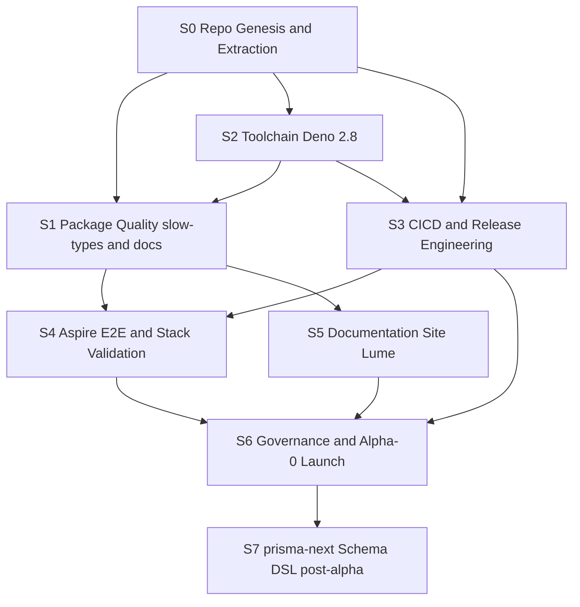

# NetScript Public Release Program — Master Harness Run

> **Status**: master/umbrella harness run. This document is the **authority**
> that drives the S0–S6 supervisor runs. It does **not** implement package code;
> it defines the program decomposition, locked decisions, and handover protocol
> so a separate agent can produce each supervisor's own harness run
> (`plan.md` / `worklog.md` / `evaluate.md`) by reading § 10–11.
>
> **Authority boundary**: where this program conflicts with the Architecture
> Doctrine, doctrine wins. Where it conflicts with the prior package-quality run
> (`copilot-evaluate-every-package-jsr-release--package-jsr-alpha-release`), that
> run remains the canonical **S1** plan and this document nests it.

## Run Metadata

| Field | Value |
|-------|-------|
| Run ID | `master--public-release-program` |
| Branch | `master` |
| Phase | `plan` (program orchestration) |
| Target | Program / docs (drives package + plugin + service + docs runs) |
| Archetype | N/A at this level — each supervisor selects its own |
| Scope overlays | `SCOPE-docs.md` (this run) |
| Supersedes | nothing — extends the prior package-quality run as S1 |

---

## 0. Framing — this is a productization program, not a feature

The prior run solved exactly **one** of the seven problems between us and a
public alpha: *per-package code quality*. The remaining six are repo extraction,
toolchain, release engineering, docs, stack validation, and governance/launch.
The mental model is **7 supervisor tracks**, where the existing wave plan is
**S1** and everything else wraps around it.

Governing thesis: **extract early, harden in place.** Do not finish all quality
work in the playground and fork at the end (the prior plan's §11). Stand up
`rickylabs/netscript` now as a lean clean-room, eject the production surface via
the existing maintainer CLI, wire CI/CD with `deno publish --dry-run` +
`deno doc --lint` gating on every PR, and do the remaining slow-type remediation
**in the new repo where the gates are red-or-green on every push**. Deno 2.8
makes this cheap: the release machinery the prior plan wanted to hand-roll
(`release.ts`, manual `jsr:` rewrite, lockstep bumping) is now native.

---

## 1. Locked decisions

| # | Decision | Locked value | Consequence |
|---|----------|--------------|-------------|
| 1 | Version line | **`0.0.1-alpha.0`**, lockstep across all units | First tag `v0.0.1-alpha.0`; cadence `alpha.N → beta.0 → … → 0.1.0`. Fix CLI `1.0.0` drift to `0.0.1-alpha.0` during S0. |
| 2 | Repo / owner | **`rickylabs/netscript`** now | JSR scope `@netscript` regardless; org migration deferred. |
| 3 | Docs renderer | **Lume** (Deno-native SSG), rendering Preact/JSX to dogfood `@netscript/fresh-ui`; **JSR hosts symbol-level API reference** | Fresh is SSR-first with no native static export (discussion #254); Lume is purpose-built for static docs. |
| 4 | Aspire | **Bump 13.2.2 → 13.4 now** (TS apphost already scaffolded by the CLI); **full-runtime / native-Deno-apphost refactor at 13.5** | Tracks `microsoft/aspire#16218` (milestone 13.5; rickylabs is the upstream requester). |
| 5 | Extraction mechanism | **Reuse the `netscript-dev` maintainer CLI** (`sync packages` / `sync plugin` / `sync templates` / `init` from local sources) composed into a `release eject` orchestrator | The source-copy engine already exists; S0 is a thin orchestrator + governance allowlist + clean-room git, not a from-scratch tool. |
| 6 | Agent rules | Add **`.agents/rules/*.mdc`** modeled on `prisma/prisma-next/.agents/rules` | Distill doctrine + STANDARDS + PUBLIC-SURFACE-PATTERNS into machine-enforced, IDE-native guardrails. |
| 7 | Dev tooling migration | Carry **`.llm/harness/`** + `netscript-*` / `jsr-audit` / `deno-fresh` **skills** + doctrine + `tools/fitness/*` into the public repo | The new repo stays harnessable; contributors use the same operating model. |
| 8 | prisma-next | **Tracked strategic dependency** → pre-staged post-alpha supervisor **S7** | Shares NetScript's DSL vocabulary; its TS-native, Standard-Schema-compatible schema DSL is a major upgrade path for `contracts` / `database` / `prisma-adapter-mysql`. |
| 9 | Playground fate | **Keep & archive-as-bench**; curated `examples/` only in the public repo | `rickylabs/netscript-start` stays the integration showbench / Aspire fixture source. |

---

## 2. Where we are vs. where we're going

| Dimension | Playground today (`netscript-start`) | Public repo target (`rickylabs/netscript`) |
|---|---|---|
| Purpose | Implementation showbench; built the seams | Distributable framework; "the Laravel of Deno" |
| Workspace | 14+ globs: apps, services, workers, sagas, triggers, db, benchmark, dotnet… | Lean: `packages/*`, `plugins/*`, `examples/*`, `apps/docs` |
| Production surface | 24 packages + 5 plugins buried in app sprawl | The only thing in the repo |
| Toolchain | Deno 2.7.14; Aspire 13.2.2 (C# host) | Deno 2.8; Aspire 13.4 (→ native Deno apphost at 13.5) |
| CI/CD | none (`.github/` has only `skills/`) | `ci.yml` (gates) + `publish.yml` (OIDC + provenance) |
| Docs | scattered READMEs + CLI's 9-page `docs/` | Lume site (TanStack/Medusa-grade IA) + JSR API ref |
| Versioning | drifted (CLI=`1.0.0`, plan=`0.0.1-alpha.0`, AGENTS=`v0.9`) | one lockstep line, `deno bump-version`-driven |
| JSR readiness | 7/24 publish-clean; slow-types are the long pole | 29/29 clean, scored, provenanced |

The playground is not discarded — it becomes the permanent integration
kitchen-sink and Aspire e2e fixture source. The public repo carries only the
framework + curated `examples/`.

---

## 3. Target repo shape

```
netscript/                         # rickylabs/netscript
├─ deno.json                       # workspace[], catalog{}, tasks, shared lint/fmt, isolatedDeclarations
├─ deno.lock                       # single root lockfile (deno ci depends on it)
├─ README.md  LICENSE  CONTRIBUTING.md  SECURITY.md  CODE_OF_CONDUCT.md  AGENTS.md
├─ .github/workflows/
│   ├─ ci.yml                      # contents:read — fmt/lint/check/doc-lint/test/audit/publish --dry-run
│   └─ publish.yml                 # id-token:write — deno ci + gates + deno publish (OIDC + provenance)
├─ .agents/
│   ├─ skills/                     # netscript-doctrine, netscript-harness, jsr-audit, deno-fresh, …
│   └─ rules/                      # *.mdc guardrails distilled from doctrine + STANDARDS (prisma-next model)
│
├─ packages/                       # 24 JSR packages, flat, one @netscript/* each
│   ├─ shared/  contracts/  config/  runtime-config/  streams/
│   ├─ logger/  telemetry/  aspire/  kv/  database/  prisma-adapter-mysql/  queue/  cron/
│   ├─ plugin/  watchers/  triggers/  workers/  sagas/
│   ├─ sdk/  service/  fresh/  fresh-ui/  cli/
│   └─ plugin-{sagas,streams,triggers,workers}-core/
├─ plugins/                        # 5 plugins, each its own @netscript/plugin-*
│   └─ sagas/  streams/  triggers/  workers/  (+ hello-world if it survives PR #84)
│
├─ examples/                       # runnable, 1:1 with docs (TanStack pattern)
│   ├─ quickstart/  rest-service/  full-stack/  with-plugins/
│   └─ playground/                 # netscript init output = Aspire e2e fixture (regenerated by CI)
├─ apps/
│   └─ docs/                       # Lume site (dogfoods @netscript/fresh-ui in MDX)
│
├─ tools/                          # checked-in Deno scripts (was .llm/tools/)
│   ├─ fitness/*.ts                # doctrine/standards gates → run in CI
│   └─ generate-reference.ts       # deno doc → docs reference extracts
├─ aspire/ (or dotnet/AppHost)     # TS apphost (apphost.mts) for stack e2e; 13.4 now, native Deno at 13.5
├─ .llm/harness/                   # carried: contributors use the same harness
└─ docs/architecture/              # doctrine + STANDARDS + PUBLIC-SURFACE-PATTERNS (contributor-facing)
```

**JSR-first deviations (where we diverge from the TanStack/Medusa npm norm and win):**

- No build step, no `dist/`, no tsup/CJS/`publint`/`attw`. Publish `.ts` source.
- `compilerOptions.isolatedDeclarations: true` at the root → every package is
  slow-type-compliant *by construction*, turning the prior plan's biggest line
  item (17/24 packages) into a compiler-enforced invariant.
- `lint.rules.tags: ["recommended", "jsr"]` + re-enable `no-process-global` /
  `no-node-globals` (off by default since 2.8) since we are a multi-runtime lib.
- `"publish": false` on `examples/*` and `apps/docs`; `deno publish` from the
  root auto-publishes every member with `name`+`version`+`exports` and
  **auto-rewrites workspace path imports → registry refs** (kills the prior
  plan's manual import-map rewrite, DRIFT-005).
- `catalog:` protocol pins `@std/*`, `zod`, etc. once and references `catalog:`
  from all 29 members.

---

## 4. Extraction mechanism (S0) — reuse the maintainer CLI

The production surface is a **closed set**. A grep across `packages/**` for
imports escaping into app dirs returned exactly one hit, and it is *generated
template text* inside a CLI fixture
(`packages/cli/src/kernel/assets/registry-generator-fixture.ts`), not a real
edge. So `deno check` on the isolated `packages/` + `plugins/` tree is the
closure gate.

The source-copy engine already exists in `netscript-dev`
(`packages/cli/docs/maintainer-cli.md`):

| Already exists (reuse) | S0 adds (the `release eject` orchestrator) |
|---|---|
| `netscript-dev init --target` (scaffold from **local sources**) | Compose `init` + `sync packages` + `sync plugin`×5 + `sync templates` into `netscript-dev release eject --target .genesis/netscript` |
| `sync packages` / `sync plugin` (source robocopy) | **Governance allowlist** copy: `.llm/harness/`, skills → `.agents/skills/`, doctrine, `tools/fitness/*`, CLI docs, LICENSE |
| `probe monorepo` (source-root validation) | Producer-shaped root `deno.json` (workspace, `catalog:`, `isolatedDeclarations`, lint `jsr`, `publish`) |
| `test scaffold --fixture` (validation harness) | Lockstep version reset to `0.0.1-alpha.0`; seed `.agents/rules/*.mdc` + `.github/workflows/` |
| public `netscript init` (consumer scaffold, JSR refs) | Emit `examples/playground` (Aspire fixture); clean-room `git init` + `gitleaks` secret scan |

The producer/consumer split is **already encoded** in the CLI: public
`netscript init` = consumer (JSR refs, no source); maintainer `netscript-dev`
`init`/`sync packages` = producer (local sources copied). "One engine, two
targets" is shipping, not something to design.

**Launch-grade CI invariant this unlocks**: `netscript-dev release eject →
deno publish --dry-run` (producer) **and** `netscript init → deno task check →
aspire run` (consumer) both green = the framework provably ejects itself into a
publishable repo and scaffolds a runnable app from it. Validation harness for
this already exists: `netscript-dev test scaffold` + `probe monorepo`.

**Staging.** S0 ejects into a **gitignored `.genesis/netscript`** inside the S0
worktree (never a path above the workspace), runs clean-room `git init` +
`gitleaks`, and pushes to `rickylabs/netscript`. See § 9 *Execution model*.

---

## 5. Toolchain leverage — Deno 2.8

Full detail in [`notes/TOOLCHAIN-2.8.md`](./notes/TOOLCHAIN-2.8.md). Headlines
that change the program:

- **`deno bump-version`** (workspace-aware) replaces the custom `release.ts`:
  lockstep `bump-version patch|minor|prerelease` bumps all 29 members **and
  rewrites `jsr:` constraints + import map**.
- **`deno publish` workspace auto-rewrite** removes the "rewrite imports on
  handoff" task entirely.
- **`deno ci`** = frozen reproducible install; first step of both workflows.
- **`isolatedDeclarations` + `deno doc --lint`** turn the two highest-weighted
  JSR score factors (no slow types, docs on every symbol) into CI gates.
- **`deno pack`** = near-free npm mirror with real `.d.ts` (post-alpha).
- **`catalog:`**, **`deno audit fix`**, per-test `timeout`, function coverage,
  `deno compile` framework detection (Lume/Fresh) all fold in.

Caveat: heavy-generic packages (`contracts`, `triggers`, `service`, `plugin`)
may still need `--allow-slow-types` per package even with `isolatedDeclarations`
— a per-package, score-impacting decision recorded as accepted debt.

---

## 6. Aspire — 13.4 now, native Deno apphost at 13.5

Full detail in [`notes/ASPIRE-13.4-13.5.md`](./notes/ASPIRE-13.4-13.5.md).
Grounding from `dotnet/AppHost/AppHost.csproj`: SDK `Aspire.AppHost.Sdk/13.2.2`
on `net10.0`, using `CommunityToolkit.Aspire.Hosting.Deno 13.1.0` (generated
artifacts).

- **S4-now (13.4)**: bump SDK `13.2.2 → 13.4.x` + CommunityToolkit
  `13.1.0 → 13.4.x`; validate TS-apphost-GA changes (`apphost.mts`,
  `.aspire/modules/`); adopt typed resource commands + `WithProcessCommand()` to
  expose `netscript` CLI subcommands as dashboard commands; wire CLI e2e under
  Aspire (nightly + release, not per-PR).
- **S4-later (13.5)**: replace the CommunityToolkit generated-artifact path with
  the **native Deno apphost** ("full runtime, less generated artifact"),
  tracking `microsoft/aspire#16218`.

---

## 7. CI/CD & release engineering (S3)

Two workflows, least-privilege split:

- **`ci.yml`** (`contents: read`, on PR + push): `deno ci` → `deno fmt --check`
  → `deno lint` → `deno check --unstable-kv` → **`deno doc --lint`** →
  `deno test --coverage` → `deno coverage` → `deno audit` →
  **`deno publish --dry-run`** (validates all 29 members) → `tools/fitness/*` +
  `deno task arch:check`.
- **`publish.yml`** (`contents: read` + **`id-token: write`**, on `v*` tag):
  re-run cheap gates → `deno publish`. OIDC = no tokens; **SLSA provenance +
  Rekor transparency log automatic** (GitHub Actions only).
- **`scaffold-e2e.yml`** (scaffolded-project CI, per PR #96): fresh
  `netscript init` on a hosted runner → enable plugins → generate registries →
  check/test, then `aspire run` smoke (S4). Its **baseline is established in S0**
  (the `netscript-dev`-validated scaffold E2E against the local workspace); S3
  re-runs it against published JSR.
- **One-time onboarding**: create all 29 packages at `jsr.io/new` under
  `@netscript` and **link each to the repo** (required for OIDC + provenance).
- **Tiering**: package unit tests per PR; Aspire stack/CLI e2e nightly + on tag.
- **Release** = `deno bump-version prerelease` → commit → `git tag
  v0.0.1-alpha.N && git push --follow-tags`.

---

## 8. Docs strategy (S5) — Lume, TanStack/Medusa-grade IA

Blend Laravel's narrative depth with TanStack's faceted, example-driven IA, and
let **JSR host the exhaustive API reference**:

```
Prologue        Why NetScript · "the Laravel of Deno" · Comparison · Philosophy
Getting Started Install (jsr:@netscript/cli) · Quickstart · Project structure · Conventions
The Basics      Lifecycle · Container · Contracts · Routing · Validation · Config · Middleware
Digging Deeper  Plugins · Queues · Cron · KV · Telemetry · Logging · Streams · CLI · Testing
Runtimes        Workers · Sagas · Triggers · Watchers  (one guide per state-machine runtime)
Database        Getting started · Prisma adapter · Migrations   (watch: prisma-next, S7)
Packages        one overview page per published package → links to its jsr.io API ref
Recipes         task-oriented, runnable (auth, deploy to Deno Deploy, custom adapter)
Examples        mirror /examples 1:1
Upgrade         version-keyed migration notes
Contributing    doctrine, archetypes, release process
```

Renderer: **Lume** (static, deploy anywhere, Deno-native), rendering Preact/JSX
so `@netscript/fresh-ui` components appear in MDX. Source content as Markdown
in-repo; nav from a `config`-style manifest (TanStack pattern); Algolia
DocSearch. The CLI's 9-page `packages/cli/docs/` and the harmonisation
`DOCS-STRUCTURE.md` are the on-disk template the site mirrors.

---

## 9. Supervisor decomposition

Each supervisor is a long-lived **integration branch + worktree** owning one
implementation group, run as its own harness run. It is decomposed into a small
number of **phase groups** — broad, capability-scoped deliverables, each its own
group branch + worktree + nested harness sub-run + sub-PR + evaluator pass. A
phase group is sized to *one reviewable PR with its own evaluator pass*, **not a
single command or file** — those are commit slices inside a group's Design
checkpoint, not branches.

This is the model **PR #96 proved**: `feat/plugin-platform-impl` decomposed into
capability groups (A Foundation, B Host, C Streams, D Workers, E Sagas,
F Triggers, H Hardening, G Polish) shipped as sub-PRs #86–#95. That workflow is
now **promoted into the harness** at `.llm/harness/workflow/supervisor.md` (+
`escalation.md`) with `templates/phase-registry.md` + `templates/agent-briefing.md`,
so every supervisor inherits it natively (§ 11). Integration branch:
`feat/<supervisor>`; group branch: `feat/<supervisor>/<group>`.



**Critical path**: `S0 → S1 (wave0…wave6) → S6`. S2/S3/S5 run in parallel under
S1's duration (the long pole). S4 overlaps S1's tail. S7 is post-alpha.

**Execution model (two repos).** S0 is the **only** supervisor that runs in this
repo (`netscript-start`) — it *is* the act of producing the public repo: it
ejects the producer tree into a gitignored `.genesis/netscript`, `git init`s it,
and pushes to `rickylabs/netscript`. **S1–S6 then run in `rickylabs/netscript`**
(own branches + worktrees there, on the same harness that S0 Group B carries
over). The umbrella supervisor PR on `netscript-start` is the **tracker / trace**
of S0–S6 progress, kept in sync with the new repo — even if `netscript-start` is
never the ship repo. For S0 only, the worktree is `worktrees/repo-genesis`
(branch `feat/repo-genesis`, off `feat/public-release-program`).

---

## 10. Supervisor run cards (handover spec)

Each card seeds one supervisor harness run. The next agent expands a card into a
supervisor run dir (§ 11a) whose `phase-registry.md` lists the **phase groups**
below. **Phase groups are the only branch grain** — each is one sub-PR with its
own evaluator pass. The fine-grained steps from earlier drafts ("run the eject
command", "add the root deno.json") are **commit slices inside a group**, defined
in that group's own Design checkpoint, never their own branch.

Group count is sized to real deliverables: most supervisors are 1–2 groups; S1
is 7 (the waves). Compare PR #96: the whole plugin platform was 8 groups.

### S0 — Repo Genesis & Extraction
- **Run ID**: `feat-repo-genesis--supervisor`
- **Integration branch**: `feat/repo-genesis`
- **Archetype**: **ARCHETYPE-6 (cli-tooling)** for the eject command + `SCOPE-docs.md` for governance docs
- **Phase groups**:
  - **A — Genesis** (`feat/repo-genesis/genesis`): compose `netscript-dev release eject` from the existing `init`/`sync packages`/`sync plugin`/`sync templates` primitives → producer tree (source robocopy + governance allowlist + producer root `deno.json` + clean-room `git init` + `gitleaks` scan + `examples/playground` consumer fixture).
  - **B — Agent rules & dev tooling** (`feat/repo-genesis/agent-rules`): `.agents/rules/*.mdc` distilled from doctrine + STANDARDS; carry `.llm/harness/` + skills; contributor docs *(may fold into A if small)*.
- **Gates**: `deno check` closure on isolated tree · ejected tree passes `deno publish --dry-run` · `gitleaks` clean · **scaffold E2E on the new repo fully passes** (`netscript init` → plugins → registries → `deno task check` + `deno task test` against the local workspace) — the S3/S4 CI baseline
- **Depends on**: none (program gate)
- **Exit**: `rickylabs/netscript` pushed and builds; workspace `deno check` green; the **scaffold E2E fully passes** (CI baseline); `examples/playground` runs. JSR scope creation/linking is **S3**.
- **References**: § 3, § 4; `packages/cli/docs/maintainer-cli.md`; `prisma/prisma-next/.agents/rules`

### S1 — Package Quality (slow-types + docs)
- **Run ID**: `feat-package-quality--supervisor`
- **Integration branch**: `feat/package-quality`
- **Archetype**: per package — **ARCHETYPE-1..6** as the prior run assigned
- **Phase groups** (= the six waves; the proven grain — Foundation-first, like PR #96's Group A):
  - **Wave 0 — Foundation** (`shared`) · **Wave 1 — Contracts & schemas** · **Wave 2 — Integration adapters** · **Wave 3 — Plugin runner** · **Wave 4 — Runtimes + their plugins** · **Wave 5 — App surfaces** · **Wave 6 — CLI**
- **Gates**: 29/29 `deno publish --dry-run` clean · `deno doc --lint` clean · archetype gate matrix per package
- **Depends on**: S0, S2
- **Exit**: every unit at `0.0.1-alpha.0`, all FAIL gates closed
- **References**: the prior run `copilot-evaluate-every-package-jsr-release--package-jsr-alpha-release` is the canonical S1 plan and its `phase-registry` equivalent — **do not rewrite it; nest it.**

### S2 — Toolchain (Deno 2.8)
- **Run ID**: `feat-toolchain-28--supervisor`
- **Integration branch**: `feat/toolchain-2.8`
- **Archetype**: workspace config + tooling → `SCOPE-docs.md` + touched-archetype gates
- **Phase groups**:
  - **A — Toolchain 2.8 adoption** (`feat/toolchain-2.8/adopt`): one PR — `deno upgrade`, `isolatedDeclarations`, lint `jsr` + re-enabled node-globals, `catalog:` deps, `deno bump-version` release path, `deno doc --lint` gate, OTel 2.8. Slices per `notes/TOOLCHAIN-2.8.md` § "Adoption order".
- **Gates**: `deno bump-version --dry-run` works workspace-wide · `deno doc --lint` wired · `deno ci` green
- **Depends on**: S0
- **Exit**: 2.8 adopted; release path = `deno bump-version`; `isolatedDeclarations` on
- **References**: [`notes/TOOLCHAIN-2.8.md`](./notes/TOOLCHAIN-2.8.md)

### S3 — CI/CD & Release Engineering
- **Run ID**: `feat-cicd-release--supervisor`
- **Integration branch**: `feat/cicd-release`
- **Archetype**: CI config + tools → **ARCHETYPE-6** concerns + `SCOPE-docs.md`
- **Phase groups** (the two independent workflows PR #96's body explicitly called for):
  - **A — Workspace CI** (`feat/cicd-release/workspace-ci`): `ci.yml` = `deno ci` → fmt/lint/check/`doc --lint`/test+coverage/audit/`publish --dry-run` + `tools/fitness/*` + `arch:check`.
  - **B — Publish & release** (`feat/cicd-release/publish`): `publish.yml` OIDC + provenance; `deno bump-version` release wiring; JSR scope onboarding (create+link 29 packages); npm mirror via `deno pack` *(stretch)*.
- **Gates**: green CI on a PR · dry-run publish in CI · OIDC publish path verified on a throwaway version
- **Depends on**: S0, S2
- **Exit**: PR validation + tag-driven publish both proven
- **References**: § 7; PR #96 body "CI Gate Gap"; [`notes/TOOLCHAIN-2.8.md`](./notes/TOOLCHAIN-2.8.md)

### S4 — Aspire E2E & Stack Validation
- **Run ID**: `feat-aspire-e2e--supervisor`
- **Integration branch**: `feat/aspire-e2e`
- **Archetype**: service/orchestration → `SCOPE-service.md` + **ARCHETYPE-6** (CLI e2e)
- **Phase groups**:
  - **A — Aspire 13.4 bump** (`feat/aspire-e2e/bump-13.4`): SDK `13.2.2→13.4`, CommunityToolkit `13.1.0→13.4`, validate TS-apphost GA shape, adopt dashboard `WithProcessCommand()` for `netscript` subcommands.
  - **B — Scaffolded-project E2E CI** (`feat/aspire-e2e/scaffold-e2e`): the second workflow PR #96 recommended — fresh `netscript init` on a hosted runner → enable plugins → generate registries → `aspire run` parity/E2E; plus the `deno-apphost-readiness` tracking note for 13.5 / #16218.
- **Gates**: `aspire run` green on `examples/playground` in CI nightly · CLI e2e restore/run/doctor green
- **Depends on**: S1 (runnable surface), S3 (CI)
- **Exit**: `netscript init && netscript dev` runs e2e under Aspire 13.4 in CI
- **References**: § 6; [`notes/ASPIRE-13.4-13.5.md`](./notes/ASPIRE-13.4-13.5.md); PR #96 body "CI Gate Gap"; `microsoft/aspire#16218`

### S5 — Documentation Site (Lume)
- **Run ID**: `feat-docs-site--supervisor`
- **Integration branch**: `feat/docs-site`
- **Archetype**: `SCOPE-docs.md` + `SCOPE-frontend.md`
- **Phase groups**:
  - **A — IA & content** (`feat/docs-site/ia-content`): nav manifest + the full guide tree (§ 8).
  - **B — Renderer, reference & search** (`feat/docs-site/renderer`): Lume app dogfooding `@netscript/fresh-ui`; `deno doc` → reference extracts + JSR links; examples 1:1; Algolia DocSearch.
- **Gates**: site builds · all examples run · nav complete · link integrity
- **Depends on**: S1 (stable API)
- **Exit**: `apps/docs` builds and deploys; every example maps 1:1
- **References**: § 8; `packages/cli/docs/`; `harmonisation/DOCS-STRUCTURE.md`

### S6 — Governance & Alpha-0 Launch
- **Run ID**: `feat-launch-alpha0--supervisor`
- **Integration branch**: `feat/launch-alpha-0`
- **Archetype**: `SCOPE-docs.md`
- **Phase groups**:
  - **A — Governance & launch** (`feat/launch-alpha-0/governance`): version policy + stability channels + feedback/RFC process + launch checklist + announcement + the `v0.0.1-alpha.0` tag.
- **Gates**: tag `v0.0.1-alpha.0` · publish workflow ships all 29 · provenance verified on jsr.io
- **Depends on**: S3, S4, S5
- **Exit**: alpha-0 public; feedback channel open
- **References**: § 1; § 7

### S7 — prisma-next Schema DSL (post-alpha, tracked)
- **Run ID**: `feat-prisma-next--supervisor`
- **Integration branch**: `feat/prisma-next-adoption`
- **Archetype**: **ARCHETYPE-4 (dsl-builder)** for `contracts` / `database`
- **Status**: **watch only** until `prisma-next` lands; groups defined when scope is known
- **Trigger**: prisma-next public release with TS-native, Standard-Schema schema DSL
- **References**: `prisma/prisma-next/.agents/rules` (shared vocabulary: schema-driven-architecture, contract-space-package-layout, use-contract-ir-factories)

---

## 11. Handover protocol — producing each supervisor run

The program **adopts the proven supervisor model from PR #96**, now **promoted
into the harness** (done in this master run): the operating protocol is
`.llm/harness/workflow/supervisor.md` (group launch, `--no-ff` merge, escalation
review via `workflow/escalation.md`, base sync, final merge), with templates
`templates/phase-registry.md` and `templates/agent-briefing.md`. The original
plugin-platform run remains at
`.llm/tmp/run/feat-plugin-platform-impl--supervisor/` for history only.

### 11a. Supervisor run (one per S0–S6)

A separate agent, in harness mode, owns integration branch `feat/<supervisor>`
and creates `.llm/tmp/run/<supervisor-run-id>/` containing:

- base templates: `plan.md`, `worklog.md`, `context-pack.md`, `drift.md`,
  `commits.md`;
- **`phase-registry.md`** — the § 10 phase groups as rows (status,
  pre-conditions, inherited debt, packages touched, success criteria);
- **`supervisor-workflow.md`** — the operating protocol is
  `.llm/harness/workflow/supervisor.md`; reference it, do not re-author;
- `final-pr-handoff.md` + `escalations/` — produced as groups merge.

The supervisor PRs to `master` when every group is `merged` and the gate matrix
is green (the PR #96 shape).

### 11b. Phase group sub-run (one per group)

For each group the supervisor launches a nested harness sub-run
(`.llm/harness/workflow/supervisor.md` § 2): group branch
`feat/<supervisor>/<group>`, group
worktree, run dir `feat-<supervisor>-<group>--<suffix>`. The group agent:

1. **Bootstraps** from the supervisor `plan.md` + its `phase-registry.md` group
   row + the § 10 card references + `.agents/skills/netscript-harness/SKILL.md`.
2. **Selects archetype + overlays** for that group; reads
   `gates/archetype-gate-matrix.md` and `debt/arch-debt.md`.
3. **Design checkpoint first** (run-loop § 2a) → sliced implementation → gate →
   commit → append `commits.md` → update `context-pack.md`.
4. **Evaluated in a separate session** (`evaluator/protocol.md`); emits `PASS` /
   `FAIL_FIX` / `FAIL_RESCOPE` / `FAIL_DEBT`.
5. On `PASS` the supervisor merges the group `--no-ff`, runs the escalation
   review (workflow § 4), and sets the group `merged` in `phase-registry.md`.

### 11c. Program-level invariants every group must preserve
- Lockstep `0.0.1-alpha.0`; no unit forks its version line.
- No backward-compatibility shims (alpha = pre-stability; doctrine
  no-backcompat rule).
- Slow-type-clean publish surface (`isolatedDeclarations` + `deno doc --lint`).
- Extraction stays dogfooded through `netscript-dev` — do not fork a second
  "production surface" definition.
- Record any divergence in the run's `drift.md` (SCOPE-docs requires it).

---

## 12. Cross-cutting references

- Prior package-quality run (S1 canonical plan):
  `.llm/tmp/run/copilot-evaluate-every-package-jsr-release--package-jsr-alpha-release/`
  (`PLAN.md`, `audit/JSR-DRY-RUN-MATRIX.md`, `harmonisation/{STANDARDS,DOCS-STRUCTURE,PUBLIC-SURFACE-PATTERNS}.md`)
- Doctrine: `.llm/research/architecture-doctrine-docs-v2/doctrine/`
- Harness: `.llm/harness/` (workflow, archetypes, gates, evaluator, templates)
- Toolchain notes: [`notes/TOOLCHAIN-2.8.md`](./notes/TOOLCHAIN-2.8.md) ·
  [`notes/ASPIRE-13.4-13.5.md`](./notes/ASPIRE-13.4-13.5.md)
- External: `jsr.io/docs/{publishing-packages,about-slow-types,scoring,trust}` ·
  `deno.com/blog/v2.8` · `devblogs.microsoft.com/aspire/whats-new-aspire-13-4` ·
  `microsoft/aspire#16218` · `prisma/prisma-next/.agents/rules`
