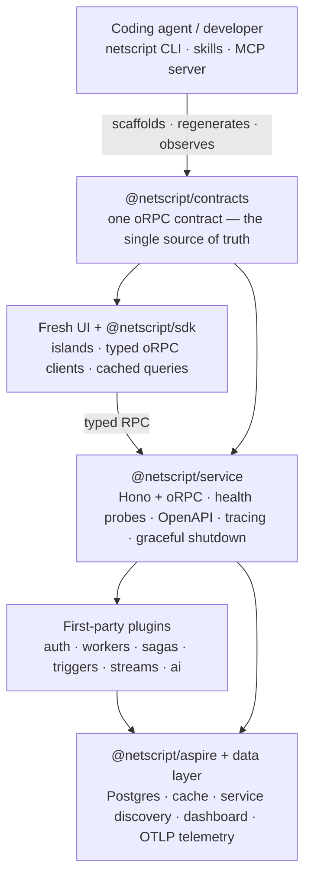

# NetScript

**The enterprise-grade meta-framework for Deno: contract-first, end-to-end typed, cloud-agnostic —
one unified API from typed services and durable workflows to orchestration, observability, and
deploy.**

[](https://jsr.io/@netscript)
[](https://github.com/rickylabs/netscript/actions/workflows/ci.yml)
[](https://rickylabs.github.io/netscript/)

What Laravel is to PHP, NetScript aims to be for the TypeScript backend: one coherent framework
where today you assemble a stack.

Define your API once as an oRPC contract. The typed Hono service and the typed SDK clients both
derive from it — server and callers cannot drift apart. Background jobs, sagas, triggers, event
streams, auth, and AI install as first-party plugins behind the same unified API. .NET Aspire brings
the whole graph up locally with one command. And it ships: from a single compiled binary to a
multi-cloud distributed infrastructure, observability on by default, a coding agent able to operate
the whole workspace.

NetScript is a framework and workspace generator, not a hosted service — you run it on Deno and own
all the generated code.

> **Beta (`0.0.1-beta.x`).** Every `@netscript/*` package shares one aligned version and releases
> move in lockstep. The API is subject to change — build with us, but pin your versions. See
> [Status and limitations](#-status-and-limitations).

---

## 🚀 Quickstart

You need [Deno 2.9+](https://docs.deno.com/runtime/getting_started/installation/) and the
[.NET Aspire CLI](https://learn.microsoft.com/dotnet/aspire/) (or skip orchestration with
`--no-aspire`). Docker is used to provision Postgres and the cache.

```bash
# 1. Install the NetScript CLI on your PATH
deno install --global --allow-all --name netscript jsr:@netscript/cli@0.0.1-beta.10

# 2. Scaffold a workspace: contracts + a typed example service + Postgres + Aspire orchestration
netscript init my-app --db postgres --service --yes
```

The scaffold reports **183 files, 44 directories** and prints your numbered next steps — follow
them:

```bash
# 3. Boot the whole stack: Postgres, cache, and every service come up together
cd my-app/aspire
aspire restore   # one-time: downloads the AppHost SDK modules
aspire start     # starts everything and prints the dashboard URL
```

Open the dashboard URL and **wait until the `postgres` resource reports healthy** — on a cold
machine the first container pull and health probe can take a few minutes, and the scaffolded
services deliberately wait on the database before they start. Then initialize the database:

```bash
# 4. Initialize the database (from the workspace root)
cd ..
netscript db init --name init
netscript db generate
netscript db seed
```

The payoff: the Aspire dashboard shows every resource, trace, and log in one place, and — once
Postgres is healthy and the `users` service has started — your typed service answers on its health
probe:

```bash
curl http://localhost:3000/health
# {"status":"healthy","timestamp":"…","checks":[{"name":"database","healthy":true,"latency":2}],…}
```

If the service is still shown as waiting after Postgres looks ready, restart the orchestrator
(`aspire stop`, then `aspire start` from `my-app/aspire`) — with the database already initialized,
the whole stack reports healthy in seconds.

Want to check the blast radius before anything touches disk? `netscript init my-app --dry-run`
reports the file and directory counts it would create and writes nothing. Run `netscript --help` or
read the **[CLI reference](https://rickylabs.github.io/netscript/cli-reference/)** for all 11
command groups (`init`, `db`, `generate`, `plugin`, `service`, `deploy`, `agent`, `contract`,
`config`, `marketplace`, `ui:*`).

---

## 🗺️ One contract, four moves

One contract flows outward: up into typed clients and the UI, down into the service runtime, the
plugins, and the Aspire-provisioned platform.



The mental model is four moves: **contract → service → plugins → platform.** You author the
contract; `defineService` turns it into a running Hono + oRPC app; plugins add durable capabilities
behind the same contract style; `@netscript/aspire` provisions and connects the infrastructure —
keeping the Aspire SDK behind an adapter so no .NET type ever appears in a public signature. Where a
service lives is resolved at call time from orchestrator-injected environment variables, so the same
client code runs against local processes, containers, and deployed endpoints with no registry or
config file. Telemetry stitches scheduler → queue → worker → RPC → SSE spans into one distributed
trace using Deno's built-in OTLP exporter — zero OpenTelemetry SDK dependency by default.

---

## 🔋 Batteries no frontend framework ships

Durable jobs, compensating sagas, trigger ingress, replayable streams, pluggable auth, an in-process
AI surface — first-party plugins, in the box. Not the integration project that Next.js, Nuxt,
SvelteKit, or Angular leave you to assemble around the frontend.

A plugin is, at its core, a manifest: plain, validated data hosts inspect without executing plugin
code. One install — `netscript plugin install worker --name workers` — scaffolds the workspace,
registers the API service, provisions storage, and adds the plugin's resources to the Aspire AppHost
so everything starts with the app.

| Plugin                                     | What it gives you                                                                                                                           |
| ------------------------------------------ | ------------------------------------------------------------------------------------------------------------------------------------------- |
| [**workers**](plugins/workers/README.md)   | Durable jobs and workflows; tasks in 4 runtimes (Deno, PowerShell, Python, shell) with at-least-once delivery keyed on `idempotencyKey`     |
| [**sagas**](plugins/sagas/README.md)       | Durable multi-step workflows with compensation — saga state persists, so a crash mid-flow resumes instead of stranding half-applied effects |
| [**triggers**](plugins/triggers/README.md) | Webhook, scheduled, and file-watch ingress with ack-then-process semantics, idempotency, retry, and dead-lettering                          |
| [**streams**](plugins/streams/README.md)   | Durable, replayable typed topics with no database required — the common pipe the other plugins publish to                                   |
| [**auth**](plugins/auth/README.md)         | One auth API with swappable backends (`kv-oauth`, `workos`, `better-auth`), auth schema, and durable session streams                        |
| [**ai**](plugins/ai/README.md)             | An app-owned, in-process chat/tool/agent surface — the agent loop runs inside your server process, no AI gateway, no extra network hop      |

---

## 📦 Packages

The monorepo publishes **29 packages and 6 first-party plugins** to JSR as small, single-purpose
`@netscript/*` packages — adopt only the layers you need. (One further workspace package,
`@netscript/bench`, is an internal benchmarking instrument and is not published.) Add any published
package with `deno add jsr:@netscript/<name>@<version>` (pin the version; see
[Status and limitations](#-status-and-limitations)).

<details>
<summary><strong>Published package map</strong> (name → README → JSR)</summary>

### Foundation core

| Package                                                          | JSR                                                                                                 | Capability                                                                                                                |
| ---------------------------------------------------------------- | --------------------------------------------------------------------------------------------------- | ------------------------------------------------------------------------------------------------------------------------- |
| [`@netscript/contracts`](packages/contracts/README.md)           | [](https://jsr.io/@netscript/contracts)           | Contract primitives, shared error map, CRUD generators, query/transform helpers                                           |
| [`@netscript/config`](packages/config/README.md)                 | [](https://jsr.io/@netscript/config)                 | Typed project config schemas, loaders, env helpers, scaffold constants                                                    |
| [`@netscript/logger`](packages/logger/README.md)                 | [](https://jsr.io/@netscript/logger)                 | Structured logging for services, packages, workers, and Hono + oRPC                                                       |
| [`@netscript/sdk`](packages/sdk/README.md)                       | [](https://jsr.io/@netscript/sdk)                       | Service discovery, typed oRPC clients, cache-backed query factories (desktop auto-update seam arrives in `0.0.1-beta.11`) |
| [`@netscript/runtime-config`](packages/runtime-config/README.md) | [](https://jsr.io/@netscript/runtime-config) | Hot-reloadable runtime override types, loaders, watchers, diagnostics                                                     |
| [`@netscript/telemetry`](packages/telemetry/README.md)           | [](https://jsr.io/@netscript/telemetry)           | One distributed trace across scheduler, queue, worker, RPC, and SSE                                                       |

### Data, messaging & scheduling

| Package                                                                      | JSR                                                                                                             | Capability                                                                 |
| ---------------------------------------------------------------------------- | --------------------------------------------------------------------------------------------------------------- | -------------------------------------------------------------------------- |
| [`@netscript/kv`](packages/kv/README.md)                                     | [](https://jsr.io/@netscript/kv)                                     | Reactive key-value abstraction over Redis, Deno KV, and in-memory          |
| [`@netscript/database`](packages/database/README.md)                         | [](https://jsr.io/@netscript/database)                         | DB adapter contracts, Prisma driver helpers, tracing, schema tooling       |
| [`@netscript/prisma-adapter-mysql`](packages/prisma-adapter-mysql/README.md) | [](https://jsr.io/@netscript/prisma-adapter-mysql) | Prisma driver adapter for MySQL / MariaDB on Deno                          |
| [`@netscript/queue`](packages/queue/README.md)                               | [](https://jsr.io/@netscript/queue)                               | Provider-agnostic message queue with Deno KV, Redis, and RabbitMQ adapters |
| [`@netscript/cron`](packages/cron/README.md)                                 | [](https://jsr.io/@netscript/cron)                                 | Runtime-agnostic cron scheduling abstraction for Deno                      |
| [`@netscript/watchers`](packages/watchers/README.md)                         | [](https://jsr.io/@netscript/watchers)                         | Composable file-watching runtime — strategies, filters, stability, stop    |

### AI & agent tooling

| Package                                    | JSR                                                                           | Capability                                                                            |
| ------------------------------------------ | ----------------------------------------------------------------------------- | ------------------------------------------------------------------------------------- |
| [`@netscript/ai`](packages/ai/README.md)   | [](https://jsr.io/@netscript/ai)   | Zero-dependency AI engine core: model/tool registries, bounded agent loop, MCP client |
| [`@netscript/mcp`](packages/mcp/README.md) | [](https://jsr.io/@netscript/mcp) | MCP server: 13 token-bounded tools for monitoring, debugging, and operating an app    |

### Plugin system

| Package                                                                      | JSR                                                                                                             | Capability                                                                             |
| ---------------------------------------------------------------------------- | --------------------------------------------------------------------------------------------------------------- | -------------------------------------------------------------------------------------- |
| [`@netscript/plugin`](packages/plugin/README.md)                             | [](https://jsr.io/@netscript/plugin)                             | Plugin manifest builder, validation, discovery, and host-context contracts             |
| [`@netscript/plugin-ai-core`](packages/plugin-ai-core/README.md)             | [](https://jsr.io/@netscript/plugin-ai-core)             | Contract-only core for the AI plugin: typed routes for chat, models, tools, embeddings |
| [`@netscript/plugin-auth-core`](packages/plugin-auth-core/README.md)         | [](https://jsr.io/@netscript/plugin-auth-core)         | Auth plugin contracts, backend ports, stream/config schemas, testing primitives        |
| [`@netscript/plugin-workers-core`](packages/plugin-workers-core/README.md)   | [](https://jsr.io/@netscript/plugin-workers-core)   | Job / task / workflow / runtime / config / testing primitives for workers              |
| [`@netscript/plugin-sagas-core`](packages/plugin-sagas-core/README.md)       | [](https://jsr.io/@netscript/plugin-sagas-core)       | Saga DSL, runtime ports, adapters, telemetry, config, testing primitives               |
| [`@netscript/plugin-triggers-core`](packages/plugin-triggers-core/README.md) | [](https://jsr.io/@netscript/plugin-triggers-core) | Trigger DSL, runtime ports, adapters, telemetry, config, testing primitives            |
| [`@netscript/plugin-streams-core`](packages/plugin-streams-core/README.md)   | [](https://jsr.io/@netscript/plugin-streams-core)   | Schema / producer / config / telemetry / testing primitives for streams                |

### Runtime plugins

| Package                                                    | JSR                                                                                                   | Capability                                                                         |
| ---------------------------------------------------------- | ----------------------------------------------------------------------------------------------------- | ---------------------------------------------------------------------------------- |
| [`@netscript/plugin-auth`](plugins/auth/README.md)         | [](https://jsr.io/@netscript/plugin-auth)         | Unified auth API, single-active backend selection, auth DB schema, session streams |
| [`@netscript/plugin-workers`](plugins/workers/README.md)   | [](https://jsr.io/@netscript/plugin-workers)   | Background job scheduling, multi-runtime task execution, workers API               |
| [`@netscript/plugin-sagas`](plugins/sagas/README.md)       | [](https://jsr.io/@netscript/plugin-sagas)       | Durable saga orchestration with compensation, workflow APIs                        |
| [`@netscript/plugin-triggers`](plugins/triggers/README.md) | [](https://jsr.io/@netscript/plugin-triggers) | Trigger ingress, scheduling, file watching, trigger runtime APIs                   |
| [`@netscript/plugin-streams`](plugins/streams/README.md)   | [](https://jsr.io/@netscript/plugin-streams)   | Durable streams service with CLI, Aspire wiring, and scaffolding                   |
| [`@netscript/plugin-ai`](plugins/ai/README.md)             | [](https://jsr.io/@netscript/plugin-ai)             | In-process chat/tool/agent surface scaffolded into your app                        |

### Auth backends

| Package                                                              | JSR                                                                                                     | Capability                                                 |
| -------------------------------------------------------------------- | ------------------------------------------------------------------------------------------------------- | ---------------------------------------------------------- |
| [`@netscript/auth-kv-oauth`](packages/auth-kv-oauth/README.md)       | [](https://jsr.io/@netscript/auth-kv-oauth)       | KV-backed OAuth2 / OIDC `AuthBackendPort` backend          |
| [`@netscript/auth-workos`](packages/auth-workos/README.md)           | [](https://jsr.io/@netscript/auth-workos)           | WorkOS AuthKit authenticators                              |
| [`@netscript/auth-better-auth`](packages/auth-better-auth/README.md) | [](https://jsr.io/@netscript/auth-better-auth) | [better-auth](https://better-auth.com) integration helpers |

### Application surface

| Package                                              | JSR                                                                                     | Capability                                                                         |
| ---------------------------------------------------- | --------------------------------------------------------------------------------------- | ---------------------------------------------------------------------------------- |
| [`@netscript/aspire`](packages/aspire/README.md)     | [](https://jsr.io/@netscript/aspire)     | `appsettings.json` → validated Aspire resource graphs, SDK-neutral by contract     |
| [`@netscript/service`](packages/service/README.md)   | [](https://jsr.io/@netscript/service)   | `defineService`: Hono + oRPC runtime, health probes, OpenAPI, graceful shutdown    |
| [`@netscript/fresh`](packages/fresh/README.md)       | [](https://jsr.io/@netscript/fresh)       | Fresh runtime extensions, builders, forms, defer primitives, route contracts       |
| [`@netscript/fresh-ui`](packages/fresh-ui/README.md) | [](https://jsr.io/@netscript/fresh-ui) | Design-system components rendered server-side, hydrated in the browser             |
| [`@netscript/cli`](packages/cli/README.md)           | [](https://jsr.io/@netscript/cli)           | The `netscript` binary: scaffold, generate, plugin, db, deploy, and agent commands |

</details>

---

## 🚢 Ship anywhere

The same app model spans the whole spectrum: a single compiled binary on one machine today, a
multi-cloud distributed infrastructure tomorrow — and, from `0.0.1-beta.11`, a native desktop app on
a consumer machine. Cloud-agnostic by design: every target is an adapter behind one router, and more
lanes follow the same contract as the framework grows.

`netscript deploy <target> <op>` is one thin router over target adapters sharing a canonical
lifecycle (`plan`, `up`, `down`, with `status`/`logs` on the targets that honour them —
`netscript deploy list` inventories the installed targets; check `netscript deploy <target> --help`
for the exact operations each one ships). Cloud auth stays operator-owned: NetScript mints no
credentials and hand-authors no Helm/Bicep/Kubernetes manifests.

| Target                                         | Lane                                                                                                               |
| ---------------------------------------------- | ------------------------------------------------------------------------------------------------------------------ |
| **Docker / Compose**                           | Container image and multi-resource Compose lanes with `status`/`logs`                                              |
| **OS services**                                | `deno compile` → single binary managed as a Linux or Windows service                                               |
| **Deno Deploy**                                | `deno deploy` with a preflight guard that refuses a `--prod` push using unsupported APIs                           |
| **Kubernetes / Azure (ACA, App Service, AKS)** | Validates the generated AppHost declares the matching hosting integration, then delegates to Aspire publish/deploy |
| **Cloud Run**                                  | Docker-image lane: build → push → `gcloud run deploy`                                                              |

### New in `0.0.1-beta.11`: native desktop lane

The next release adds a **native desktop** deploy target — not yet available in the published
`0.0.1-beta.10` packages this README pins. On the main branch, `deploy desktop package` builds
native installers per OS (`.app`/`.dmg`, `.AppImage`/`.deb`/`.rpm`, `.msi`), an Ed25519-signed
update-manifest release server prepares and serves updates, and an SDK auto-update seam surfaces
update-ready events in the app.

Its honest edges, stated up front: native installers and compiled binaries are **unsigned** at this
stage — platform code-signing (Authenticode, Developer ID + notarization) is a deliberate external
CI step, and the CLI accepts no certificate credentials. And Windows native update apply is
unsupported upstream, so apps handle an `applyMode: "manual"` update-ready event and present its
verified `manualUpdateUrl` instead of replacing themselves in place.

---

## 🤖 Operable by coding agents

The agent story is deliberate, not bolted on. One command wires the whole triple into your project:

```bash
netscript agent init
```

It auto-detects your agent host, writes the MCP config (`.mcp.json` for Claude Code,
`.vscode/mcp.json` for VS Code) pointing at `netscript agent mcp`, and installs the NetScript skill
bundle — all pinned to the installed CLI version, so the tool catalog the agent sees always matches
the release it runs.

- **MCP is the eyes.** [`@netscript/mcp`](packages/mcp/README.md) exposes **13 token-bounded tools**
  — app status, run inspection, recent errors, service/database performance analysis, doctor, docs
  search, and command execution — over stdio. Every result is capped server-side (50 items, 2,000
  characters per string) so telemetry never floods the context window, and tools classify traces
  into worker/saga/trigger/stream/service domains and correlate whole executions by id.
- **Skills are the playbook.** `agent init` installs three content-hashed skills (`netscript`,
  `netscript-operate`, `netscript-build`) shipped with the same release as the CLI.
- **The CLI is the hands.** The MCP `execute_command` tool shells the real CLI through a
  default-deny policy gate: 17 allowed command prefixes, 6 explicit denies (`deploy`, `init`,
  `marketplace`, `db reset`, `plugin remove`, `ui:remove`), deny beats allow, anything unmatched is
  denied.

The server runs on Deno 2.9+ with a minimal stdio JSON-RPC transport — no npm MCP SDK in the
dependency graph. It complements Aspire's own MCP server rather than replacing it: Aspire speaks
resources and containers; this server speaks your app.

---

## 📖 Documentation

Full guides live at **[rickylabs.github.io/netscript](https://rickylabs.github.io/netscript/)**,
organized in four lanes: tutorials teach a path end to end, how-to guides are the recipe when you
know the path, reference pages give exact symbols and signatures (generated from source with
`deno doc`, so they always describe the published surface), and explanation pages carry the design
reasoning.

**Start here:** [Why NetScript](https://rickylabs.github.io/netscript/why/) ·
[Quickstart](https://rickylabs.github.io/netscript/quickstart/) ·
[Architecture overview](https://rickylabs.github.io/netscript/concepts/) ·
[Glossary](https://rickylabs.github.io/netscript/glossary/)

**Five tutorial tracks** — each builds one complete application from a fresh `netscript init` and
ends by running it locally under .NET Aspire:

- [Live dashboard](https://rickylabs.github.io/netscript/tutorials/live-dashboard/)
- [AI chat](https://rickylabs.github.io/netscript/tutorials/chat/)
- [Workspace](https://rickylabs.github.io/netscript/tutorials/workspace/)
- [Storefront](https://rickylabs.github.io/netscript/tutorials/storefront/)
- [ERP sync](https://rickylabs.github.io/netscript/tutorials/erp-sync/)

**Then:** [How-to guides](https://rickylabs.github.io/netscript/how-to/) (28 task-focused recipes,
from [adding a plugin](https://rickylabs.github.io/netscript/how-to/add-a-plugin/) to
[building a desktop frontend](https://rickylabs.github.io/netscript/how-to/build-a-desktop-frontend/))
· [Reference](https://rickylabs.github.io/netscript/reference/) ·
[Explanation](https://rickylabs.github.io/netscript/explanation/) ·
[CLI reference](https://rickylabs.github.io/netscript/cli-reference/)

---

## 🧭 Status and limitations

NetScript is in **`0.0.1` beta** (current release train: `0.0.1-beta.10`), shipping incrementally —
there is no big-bang jump from beta to stable. The API is subject to change; the published package
surface is the contract: what you import from `jsr:@netscript/*` is what's documented and
type-checked. `0.0.1-stable` is the terminal milestone carrying the project's falsifiable
positioning verdict, reached incrementally through the beta train. Follow the
[milestones](https://github.com/rickylabs/netscript/milestones),
[issues](https://github.com/rickylabs/netscript/issues), and
[discussions](https://github.com/rickylabs/netscript/discussions).

Known limitations, stated plainly:

- **Pin your versions.** Bare `jsr:@netscript/*` specifiers do not resolve on the beta train — every
  install pins an exact `@<version>`, and releases move in lockstep, so keep package versions
  aligned when you upgrade.
- **Auth is one active backend at a time.** Only `kv-oauth` is fully interactive today — on WorkOS
  and better-auth the `signin`/`callback` endpoints return a typed unsupported-operation error by
  design. No multi-active routing, cross-backend linking, or global logout yet.
- **Windows.** Deno does not deliver `SIGTERM` on Windows (the service listener handles this), and
  in the upcoming `0.0.1-beta.11` desktop lane, native updates on Windows follow a manual
  installer-download path rather than in-place auto-apply.
- **Deno 2.9+ everywhere.** Plugin runtimes, API services, and the MCP server require Deno 2.9+;
  only the manifests and contracts are plain data importable anywhere TypeScript runs. Multi-runtime
  worker tasks require the target interpreter (PowerShell, Python, POSIX shell) on the machine.

---

## 🤝 Contributing

NetScript is built in the open. Start with [CONTRIBUTING.md](CONTRIBUTING.md), the
[Code of Conduct](CODE_OF_CONDUCT.md), and the [security policy](SECURITY.md). Bug reports and
feature proposals belong on the [issue tracker](https://github.com/rickylabs/netscript/issues).

---

## 📝 License

Apache-2.0 — see [LICENSE](LICENSE). Every published `@netscript/*` package ships to JSR with
provenance.
