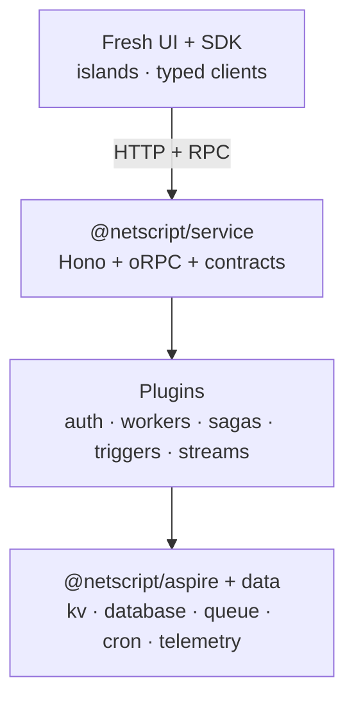

# NetScript

**The Deno-native, plugin-composed framework for type-safe application backends — Hono routing, oRPC
contracts, Fresh UI, and .NET Aspire orchestration, wired together end to end.**

[](https://jsr.io/@netscript)
[](https://github.com/rickylabs/netscript/actions/workflows/ci.yml)
[](https://rickylabs.github.io/netscript/)

```text
deno add jsr:@netscript/service           one workspace, many typed services
     │
     ├── Hono router · oRPC contracts · @netscript/sdk clients
     ├── auth · workers · sagas · triggers · streams   (first-party plugins)
     └── .NET Aspire · Postgres · cache · discovery · dashboard
```

Define your API once as a contract, and NetScript wires the typed router, the typed clients, the UI
runtime, and the orchestration layer around it — then composes in authentication, background jobs,
sagas, triggers, and event streams as first-party plugins.

---

## 🧭 What is NetScript

NetScript is a meta-framework for building backends on Deno. You describe a service as an oRPC
contract, and NetScript materializes the typed router ([Hono](https://hono.dev)), the typed clients
(`@netscript/sdk`), the UI runtime ([Fresh](https://fresh.deno.dev)), and the orchestration layer
([.NET Aspire](https://learn.microsoft.com/dotnet/aspire/)) around that single source of truth.
Capabilities you would normally bolt on by hand — authentication, background jobs, sagas, triggers,
event streams — ship as first-party plugins that compose into the same contract-first model.

Everything is published to JSR as small, single-purpose `@netscript/*` packages, so you adopt only
the layers you need: a lone typed service, or a full orchestrated workspace with a database, a Fresh
frontend, and five runtime plugins. Add any package with `deno add jsr:@netscript/<name>` (or
`npx jsr add @netscript/<name>` on Node and Bun).

> [!NOTE]
> **Alpha (`0.0.1-alpha.1`).** The package surface and CLI are stabilizing toward a 1.0 line. APIs
> may change between alpha releases — pin a version and track the
> [roadmap](https://github.com/rickylabs/netscript/milestones).

---

## 🚀 60-Second Quick Start

You need [Deno 2.x](https://docs.deno.com/runtime/getting_started/installation/). For the
orchestrated path you also need the [.NET Aspire CLI](https://learn.microsoft.com/dotnet/aspire/).

```bash
# 1. Install the NetScript CLI on your PATH
deno install --global --allow-all --name netscript jsr:@netscript/cli

# 2. Scaffold a workspace: contracts + an example service + Postgres + Aspire orchestration
netscript init my-app --db postgres --service --yes

# 3. Boot the whole stack — Postgres, cache, and every process — with .NET Aspire
cd my-app/aspire && aspire restore   # one-time
aspire run                           # Aspire dashboard → http://localhost:18888
```

Prefer not to install anything globally? Run the CLI straight from JSR:

```bash
deno x jsr:@netscript/cli init my-app
```

Run `netscript --help` or see the
**[CLI reference](https://rickylabs.github.io/netscript/cli-reference/)** for every command and flag
(`--db`, `--service`, `--no-aspire`, `--editor`, and more).

---

## 🗺️ Architecture

One oRPC contract flows up into typed clients and a Fresh UI, and down into a Hono service, the
plugin runtimes, and the Aspire-provisioned platform:

```text
  Browser / islands
        │  HTTP + typed RPC
        ▼
┌─ Application surface ───────────────────────────────────────────────
│  @netscript/fresh + @netscript/fresh-ui    islands UI · forms · defer
│  @netscript/sdk                             typed oRPC clients + cache queries
│
│        │  one shared contract map
│        ▼
┌─ Service runtime ───────────────────────────────────────────────────
│  @netscript/service  →  Hono app + oRPC router bound to @netscript/contracts
│  health probes · OpenAPI · Scalar docs · graceful shutdown
│
│        │  compose capabilities as plugins
│        ▼
┌─ First-party plugins ───────────────────────────────────────────────
│  auth · workers · sagas · triggers · streams
│  each = a `*-core` contract package + a runtime plugin implementation
│
│        │  provisioned & discovered through
│        ▼
┌─ Platform & data ───────────────────────────────────────────────────
│  @netscript/aspire   orchestration · service discovery · connection strings
│  kv · database · queue · cron · telemetry    storage · messaging · tracing
└─────────────────────────────────────────────────────────────────────
```

The mental model is four moves: **contract → service → plugins → platform**. You author the
contract, `@netscript/service` turns it into a running Hono + oRPC app, plugins add durable
capabilities behind that same contract, and `@netscript/aspire` provisions and connects the
infrastructure each process needs.

<details>
<summary>Mermaid view (rendered on GitHub)</summary>



</details>

---

## 📦 Packages

NetScript ships **31 packages** across six layers. Add any of them with
`deno add jsr:@netscript/<name>`.

### Foundation core

| Package                     | JSR                                                                                                 | Capability                                                                    | Reference                                                                 |
| --------------------------- | --------------------------------------------------------------------------------------------------- | ----------------------------------------------------------------------------- | ------------------------------------------------------------------------- |
| `@netscript/contracts`      | [](https://jsr.io/@netscript/contracts)           | Contract primitives, common schemas, CRUD generators, query/transform helpers | [docs ↗](https://rickylabs.github.io/netscript/reference/contracts/)      |
| `@netscript/config`         | [](https://jsr.io/@netscript/config)                 | Typed project config schemas, loaders, env helpers, scaffold constants        | [docs ↗](https://rickylabs.github.io/netscript/reference/config/)         |
| `@netscript/logger`         | [](https://jsr.io/@netscript/logger)                 | Structured logging for services, packages, workers, and Hono + oRPC           | [docs ↗](https://rickylabs.github.io/netscript/reference/logger/)         |
| `@netscript/sdk`            | [](https://jsr.io/@netscript/sdk)                       | Service discovery, oRPC clients, cache-backed query factories                 | [docs ↗](https://rickylabs.github.io/netscript/reference/sdk/)            |
| `@netscript/runtime-config` | [](https://jsr.io/@netscript/runtime-config) | Hot-reloadable runtime override types, loaders, watchers, diagnostics         | [docs ↗](https://rickylabs.github.io/netscript/reference/runtime-config/) |
| `@netscript/telemetry`      | [](https://jsr.io/@netscript/telemetry)           | OpenTelemetry tracing for jobs, queues, RPC, and SSE                          | [docs ↗](https://rickylabs.github.io/netscript/reference/telemetry/)      |

### Data, messaging & scheduling

| Package                           | JSR                                                                                                             | Capability                                                                 | Reference                                                                       |
| --------------------------------- | --------------------------------------------------------------------------------------------------------------- | -------------------------------------------------------------------------- | ------------------------------------------------------------------------------- |
| `@netscript/kv`                   | [](https://jsr.io/@netscript/kv)                                     | Reactive key-value abstraction over Redis, Deno KV, and in-memory          | [docs ↗](https://rickylabs.github.io/netscript/reference/kv/)                   |
| `@netscript/database`             | [](https://jsr.io/@netscript/database)                         | DB adapter contracts, Prisma driver helpers, tracing, schema tooling       | [docs ↗](https://rickylabs.github.io/netscript/reference/database/)             |
| `@netscript/prisma-adapter-mysql` | [](https://jsr.io/@netscript/prisma-adapter-mysql) | Prisma driver adapter for MySQL / MariaDB on Deno                          | [docs ↗](https://rickylabs.github.io/netscript/reference/prisma-adapter-mysql/) |
| `@netscript/queue`                | [](https://jsr.io/@netscript/queue)                               | Provider-agnostic message queue with Deno KV, Redis, and RabbitMQ adapters | [docs ↗](https://rickylabs.github.io/netscript/reference/queue/)                |
| `@netscript/cron`                 | [](https://jsr.io/@netscript/cron)                                 | Runtime-agnostic cron scheduling abstraction for Deno                      | [docs ↗](https://rickylabs.github.io/netscript/reference/cron/)                 |
| `@netscript/watchers`             | [](https://jsr.io/@netscript/watchers)                         | Composable file-watching runtime — strategies, filters, stability, stop    | [docs ↗](https://rickylabs.github.io/netscript/reference/watchers/)             |

### Plugin contracts (`*-core`)

| Package                           | JSR                                                                                                             | Capability                                                                            | Reference                                                                       |
| --------------------------------- | --------------------------------------------------------------------------------------------------------------- | ------------------------------------------------------------------------------------- | ------------------------------------------------------------------------------- |
| `@netscript/plugin`               | [](https://jsr.io/@netscript/plugin)                             | Plugin manifest, validation, discovery, and host-context contracts                    | [docs ↗](https://rickylabs.github.io/netscript/reference/plugin/)               |
| `@netscript/plugin-auth-core`     | [](https://jsr.io/@netscript/plugin-auth-core)         | Auth plugin contracts, backend ports, stream/config schemas, testing primitives       | [docs ↗](https://rickylabs.github.io/netscript/reference/plugin-auth-core/)     |
| `@netscript/plugin-workers-core`  | [](https://jsr.io/@netscript/plugin-workers-core)   | Job / task / workflow / runtime / config / testing primitives for workers             | [docs ↗](https://rickylabs.github.io/netscript/reference/plugin-workers-core/)  |
| `@netscript/plugin-sagas-core`    | [](https://jsr.io/@netscript/plugin-sagas-core)       | Saga DSL, runtime ports, adapters, telemetry, config, testing primitives              | [docs ↗](https://rickylabs.github.io/netscript/reference/plugin-sagas-core/)    |
| `@netscript/plugin-triggers-core` | [](https://jsr.io/@netscript/plugin-triggers-core) | Trigger DSL, runtime ports, adapters, telemetry, config, testing primitives           | [docs ↗](https://rickylabs.github.io/netscript/reference/plugin-triggers-core/) |
| `@netscript/plugin-streams-core`  | [](https://jsr.io/@netscript/plugin-streams-core)   | Schema / producer / config / telemetry / testing / diagnostics primitives for streams | [docs ↗](https://rickylabs.github.io/netscript/reference/plugin-streams-core/)  |

### Runtime plugins

| Package                      | JSR                                                                                                   | Capability                                                                         | Reference                                                              |
| ---------------------------- | ----------------------------------------------------------------------------------------------------- | ---------------------------------------------------------------------------------- | ---------------------------------------------------------------------- |
| `@netscript/plugin-auth`     | [](https://jsr.io/@netscript/plugin-auth)         | Unified auth API, single-active backend selection, auth DB schema, session streams | [docs ↗](https://rickylabs.github.io/netscript/reference/plugin-auth/) |
| `@netscript/plugin-workers`  | [](https://jsr.io/@netscript/plugin-workers)   | Background job scheduling, task execution, worker API endpoints                    | [docs ↗](https://rickylabs.github.io/netscript/reference/workers/)     |
| `@netscript/plugin-sagas`    | [](https://jsr.io/@netscript/plugin-sagas)       | Durable saga orchestration, workflow APIs, saga runtime metadata                   | [docs ↗](https://rickylabs.github.io/netscript/reference/sagas/)       |
| `@netscript/plugin-triggers` | [](https://jsr.io/@netscript/plugin-triggers) | Trigger ingress, scheduling, file watching, trigger runtime APIs                   | [docs ↗](https://rickylabs.github.io/netscript/reference/triggers/)    |
| `@netscript/plugin-streams`  | [](https://jsr.io/@netscript/plugin-streams)   | Durable Streams service with CLI, Aspire, E2E, and scaffolding                     | [docs ↗](https://rickylabs.github.io/netscript/reference/streams/)     |

### Auth backends

| Package                       | JSR                                                                                                     | Capability                                                 | Reference                                                                   |
| ----------------------------- | ------------------------------------------------------------------------------------------------------- | ---------------------------------------------------------- | --------------------------------------------------------------------------- |
| `@netscript/auth-better-auth` | [](https://jsr.io/@netscript/auth-better-auth) | [better-auth](https://better-auth.com) integration helpers | [docs ↗](https://rickylabs.github.io/netscript/reference/auth-better-auth/) |
| `@netscript/auth-workos`      | [](https://jsr.io/@netscript/auth-workos)           | WorkOS AuthKit authenticators                              | [docs ↗](https://rickylabs.github.io/netscript/reference/auth-workos/)      |
| `@netscript/auth-kv-oauth`    | [](https://jsr.io/@netscript/auth-kv-oauth)       | KV-backed OAuth2 / OIDC `AuthBackendPort` backend          | [docs ↗](https://rickylabs.github.io/netscript/reference/auth-kv-oauth/)    |

### Application surface

| Package               | JSR                                                                                     | Capability                                                                   | Reference                                                           |
| --------------------- | --------------------------------------------------------------------------------------- | ---------------------------------------------------------------------------- | ------------------------------------------------------------------- |
| `@netscript/aspire`   | [](https://jsr.io/@netscript/aspire)     | Aspire TypeScript AppHost config parsing, ports, SDK-agnostic helpers        | [docs ↗](https://rickylabs.github.io/netscript/reference/aspire/)   |
| `@netscript/service`  | [](https://jsr.io/@netscript/service)   | Service bootstrap builders, health probes, Hono / oRPC runtime wiring        | [docs ↗](https://rickylabs.github.io/netscript/reference/service/)  |
| `@netscript/fresh`    | [](https://jsr.io/@netscript/fresh)       | Fresh runtime extensions, builders, forms, defer primitives, route contracts | [docs ↗](https://rickylabs.github.io/netscript/reference/fresh/)    |
| `@netscript/fresh-ui` | [](https://jsr.io/@netscript/fresh-ui) | Fresh UI registry seams and interactive foundations                          | [docs ↗](https://rickylabs.github.io/netscript/reference/fresh-ui/) |
| `@netscript/cli`      | [](https://jsr.io/@netscript/cli)           | Public and maintainer command-line tooling for NetScript workspaces          | [docs ↗](https://rickylabs.github.io/netscript/reference/cli/)      |

---

## 📖 Documentation

Full guides, tutorials, and per-package API references live at
**[rickylabs.github.io/netscript](https://rickylabs.github.io/netscript/)**.

- **[Getting started](https://rickylabs.github.io/netscript/tutorials/getting-started/)** — scaffold
  and boot your first workspace
- **[Tutorials](https://rickylabs.github.io/netscript/tutorials/)** — end-to-end, build-an-app
  walkthroughs
- **[How-to guides](https://rickylabs.github.io/netscript/how-to/)** — task-focused recipes
- **[Explanation](https://rickylabs.github.io/netscript/explanation/)** — architecture and design
  rationale
- **[Reference](https://rickylabs.github.io/netscript/reference/)** — every package's API surface
- **[CLI reference](https://rickylabs.github.io/netscript/cli-reference/)** — all `netscript`
  commands

---

## 📅 Roadmap & Maturity

NetScript is at **`0.0.1-alpha.1`**: the architecture is in place across all 31 packages, and the
surface is converging toward a stable 1.0 line. Pin a version in your import map, and follow what is
landing next:

- **[Milestones](https://github.com/rickylabs/netscript/milestones)** — release planning
- **[Issues](https://github.com/rickylabs/netscript/issues)** — open work and proposals
- **[Discussions](https://github.com/rickylabs/netscript/discussions)** — questions and design
  threads

---

## 🤝 Contributing

NetScript is built in the open. Start with
**[CONTRIBUTING.md](https://github.com/rickylabs/netscript/blob/main/CONTRIBUTING.md)**, the
**[Code of Conduct](https://github.com/rickylabs/netscript/blob/main/CODE_OF_CONDUCT.md)**, and the
**[security policy](https://github.com/rickylabs/netscript/blob/main/SECURITY.md)**. Bug reports and
feature proposals belong on the [issue tracker](https://github.com/rickylabs/netscript/issues).

---

## 📝 License

MIT — see [LICENSE](https://github.com/rickylabs/netscript/blob/main/LICENSE). Every `@netscript/*`
package is published to JSR with cryptographically verified provenance.
