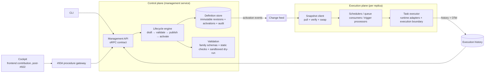
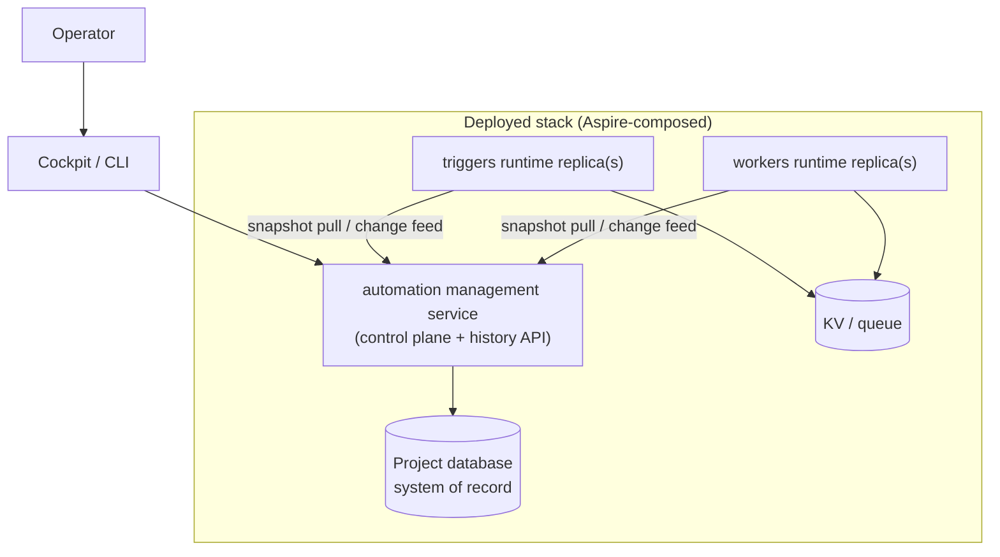

# RFC-0001 — Runtime-Versioned Automation: operator-managed workers, tasks, and triggers

|                   |                                                                                                                                                                                                                                               |
| ----------------- | --------------------------------------------------------------------------------------------------------------------------------------------------------------------------------------------------------------------------------------------- |
| **Status**        | **Proposed** — awaiting owner ratification; final adversarial PLAN-EVAL (Codex GPT-5.6 Sol · xhigh) recorded on PR #1446                                                                                                                      |
| **Run record**    | `.llm/runs/docs-rfc-runtime-versioned-automation--supervisor/` — research, evidence reports, drift, briefs                                                                                                                                    |
| **Tracking**      | Refs #1443 · #1445 · PR #1444 (control-plane split, D-10) · downstream of RFC [#890](https://github.com/rickylabs/netscript/pull/890) (merged 2026-08-03) and epic [#922](https://github.com/rickylabs/netscript/issues/922) (open)           |
| **Evidence base** | `evidence/legacy-capability-map.md` (netscript-start @ `6ba9ba0`, 15 sections, 3 operator journeys) · `evidence/current-state-matrix.md` (this repo @ `2256a67bf`, hypotheses H1–H6, probes P1–P5) · both Codex-authored, supervisor-verified |
| **Authority**     | This RFC establishes `docs/architecture/rfc/` as the in-repo RFC home. On ratification, the roadmap in §12 is filed as a draft epic/issue graph; nothing files before that.                                                                   |

---

## Abstract

NetScript's founding product promise includes a capability no released version has ever actually
shipped: an **operator** — not a developer with a checkout — adds, updates, disables, or rolls back
a versioned task or trigger **on a running deployed stack**, including tasks that wrap legacy or
polyglot scripts (Python, .NET, shell), and watches it execute with full history, from a management
cockpit.

The archaeology is unambiguous: in legacy `netscript-start` the versioned runtime trees
(`workers/runtime/tasks/v1.0.0.json`, `current` pointers, `schema.json`) were **dead wiring** — a
loader and watcher existed and no executable service ever imported them. What _did_ work was a
KV-backed task registry and a seven-runtime polyglot executor that resolved definitions per message
— live-update capable — with **no operator control plane in front of it**. The current repository
inherits the same split-brain: real engines, real versioned-store primitives, and no production seam
connecting them.

This RFC designs the capability as it was always intended, on a clean break (owner decision: no
backward-compatibility or migration layer — the feature is pre-production and unused). It proposes:
a **two-plane architecture** (definition control plane / execution data plane); a **runtime
contribution model** extracted from the Frontend Contribution Layer pattern (schema-first contracts,
family-versioned envelopes, generated registries — no hardcoded topic switches); an
**immutable-revision store** with atomic activation, optimistic concurrency, and a full audit trail;
an **execution boundary port** layered over established isolation technology (scoped Deno
permissions → hardened subprocess → container/microVM), never a bespoke sandbox; a management API
and a cockpit specified as a downstream consumer of the frontend contribution layer; and an explicit
**replacement/cleanup inventory** that retires every competing experimental surface.

## 1. Product intent and operator journeys

These journeys are the product requirements. They come from the legacy evidence (what the cockpit
and CLI _promised_) and the owner's standing constraint (drift D-10, #1443 run): runtime-versioned
workers/tasks and triggers are an intentional differentiating capability that must not collapse into
compile-time configuration.

### J1 — Live change and rollback

An operator opens the cockpit (or CLI), edits a task's schedule/timeout/enablement or a trigger's
route, saves as a **draft revision**, validates it, and **activates** it. Every running replica
picks it up without a rebuild or restart. Activation is atomic — no replica ever observes a
half-applied change. The previous revision remains addressable; **rollback is activating it again**.
Every step records who, what, when, and why.

_Legacy reality: `[DEAD]` — pointer edits changed nothing; enable/disable wrote a file nothing read
(`legacy-capability-map.md` Journey A)._

### J2 — Add and run a polyglot task

An operator registers a new task that wraps an existing Python/.NET/shell script, declares its
runtime, entrypoint, arguments, timeout, and **capability grants** (network, filesystem paths, env),
test-runs it in a sandboxed dry-run, then activates it. The task appears in the cockpit, executes on
schedule or on demand, and its execution history (status, duration, captured output, correlation) is
queryable.

_Legacy reality: `[PARTIAL]` — the seven-runtime executor genuinely executed anything already in KV,
but no delivered path put an operator's task there; absent permissions meant `--allow-all`
(`legacy-capability-map.md` Journey B, §8)._

### J3 — Wire a trigger and audit what it did

An operator declares a trigger (webhook/schedule/file-watch) that enqueues a worker job, fires a
test event, inspects the resulting event record, execution, and dead-letter state, and disables the
trigger — all live, all audited.

_Legacy reality: `[PARTIAL]` — webhook ingress → durable event → idempotent processing → job enqueue
worked; the cockpit spoke an oRPC contract the delivered service never implemented; `fire` in the
CLI silently didn't dispatch (`legacy-capability-map.md` Journey C, §7)._

## 2. What the evidence actually shows

Full detail: `evidence/legacy-capability-map.md` and `evidence/current-state-matrix.md` (run
record). The load-bearing findings:

1. **The versioned trees never drove anything.** In both legacy and current code the
   `@netscript/runtime-config` loader/watcher (`current` pointer → `<topic>/v<X>.json`, fs-watch,
   silent-empty on malformed input) has no executable consumer in any worker or trigger composition.
   "Runtime configuration" was never runtime. (Legacy: confirmed by static reachability audit.
   Current: hypothesis H1, confirmed by G2 — see matrix.)
2. **The execution engines are real and worth keeping conceptually.** A multi-runtime executor
   (deno, python, dotnet, shell, powershell, cmd, executable) with timeout, output capture, and
   OTel; a KV task registry resolved per message (live-update capable by construction); a trigger
   processor with KV idempotency, DLQ, deferred replay, and bounded concurrency.
3. **There was never a control plane.** No create/update/delete for tasks reaches any registry;
   scheduler timers load once at startup; trigger registries are compiled TypeScript loaded once;
   the CLI's enable/disable and `config publish` wrote files nothing read.
4. **Isolation defaults were dangerous.** Absent Deno permissions became `--allow-all`; non-Deno
   runtimes ran directly on the host with inherited environment; PowerShell ran with
   `-ExecutionPolicy Bypass`.
5. **Multiple sources of truth, none authoritative.** Static generated registries, KV registries,
   versioned filesystem trees, `.netscript/runtime/*.json` CLI writes, and aspirational Prisma
   schemas coexisted without reconciliation; deployment could promote a pointer whose documents
   failed to copy.
6. **Schema tooling was split and unenforced.** Two diverged schema generators; the checked-in
   worker schema rejected the checked-in task document; no loader validated anything against any
   schema. On the current baseline, `generate runtime-schemas` receives empty schema sets from the
   plugin snapshot (fixed to _load_ by PR #1444; made _meaningful_ by this RFC).

The design conclusion drawn throughout: **do not resurrect the pointer-file mechanism; build the
control plane the engines always lacked.**

## 3. Decisions binding this RFC

| Decision                                                                                                                                 | Source                                                                                                 | Consequence here                                                                                                                               |
| ---------------------------------------------------------------------------------------------------------------------------------------- | ------------------------------------------------------------------------------------------------------ | ---------------------------------------------------------------------------------------------------------------------------------------------- |
| Control-plane/runtime module split: `<name>/plugin.ts` manifest-only + import-safe; `mod.ts` / `runtime.ts` are the app/runtime surfaces | Owner D-10 (#1443 run drift); ratified + constrained by this run's `1444-impact.md` (PR #1444 comment) | §5.1 builds the definition control plane behind the same import-safety law; manifests stay serializable data with additively versioned schemas |
| Complete redesign in scope; legacy bounded to outcomes/journeys                                                                          | Owner directive (run drift D-4)                                                                        | §§5–9 are clean-sheet with named reused _concepts_, not reused files                                                                           |
| **No backward-compatibility or migration layer**                                                                                         | Owner directive (run drift D-5)                                                                        | §10 is a replacement/cleanup inventory; no dual-read, no compat adapters, no deprecation windows                                               |
| Cockpit is a downstream consumer of the Frontend Contribution Layer                                                                      | Owner directive (run drift D-3); RFC #890 merged; epic #922 open                                       | §8.2 models the cockpit on #922's contracts; §12 carries explicit dependency edges (#923–#932, #934); no cockpit slice lands before that cut   |
| Wrap, don't reinvent; contract-first; doctrine archetypes                                                                                | `AGENTS.md`, architecture doctrine                                                                     | Every §5 component names its archetype and upstream primitives                                                                                 |

## 4. Architecture overview

Two planes, one contract vocabulary, one source of truth.



- The **control plane** owns definitions: families, revisions, activations, audit, validation. It
  runs inside the management service and never executes operator workloads.
- The **execution plane** owns running: schedulers, trigger processors, queue consumers, and the
  executor. It consumes **verified immutable snapshots** and never mutates definitions.
- The seam between them is the **activation snapshot**: a content-addressed, schema-validated
  document set. Replicas converge on snapshots; they do not watch files.

Deployment view (Aspire):



## 5. The proposed design

### 5.1 Runtime contribution model — the #890 pattern, extracted

The Frontend Contribution Layer solved the same class of problem for UI: plugins contribute
declarative, schema-versioned payloads; the host discovers them through generated, type-checked
registries; nothing is hardcoded per plugin. RFC #890's specific contracts are **not** copied — the
_pattern_ is:

- **New ARCHETYPE-1 contracts package** (working name `@netscript/automation-core`; final name at
  implementation): serializable types + Zod schemas + the lifecycle state machine + ports. No engine
  code, no fresh/preact/DB deps, JSR-clean.
- **Family-versioned envelope.** A `DefinitionFamilyDescriptor` identifies `(family, major)` —
  initial families `task@1` (workers) and `trigger@1` (triggers). A plugin declares the families it
  owns via a **declarative manifest field** (per `1444-impact.md` C2/C3: data, additively
  extensible, no functions). Adding a family is additive; changing one is a new major.
- **One schema authority.** Each family ships exactly one Zod schema from which everything derives:
  admission validation in the lifecycle engine, `netscript generate runtime-schemas` editor output,
  cockpit form generation, and documentation. This retires the legacy two-generator drift (evidence
  §2.6) by construction.
- **No hardcoded topics.** The five hardcoded topic names (`jobs|sagas|triggers|features|tasks`) and
  every `topic === 'workers'`-shaped branch are replaced by family registration. The `quality:scan`
  hardcoded-plugin-name gate already polices the anti-pattern this removes.

Family payloads for the initial families (illustrative, contract-level):

```ts
// task@1 — one definition
{
  id: 'transform-data',
  name: 'Data transformation',
  runtime: 'python',                       // deno | python | dotnet | shell | powershell | cmd | executable
  entrypoint: 'scripts/transform.py',      // resolved inside the project bundle root, never absolute
  args: ['--mode', 'incremental'],
  timeoutMs: 60_000,
  schedule: { cron: '*/15 * * * *' },      // optional; schedule lives ON the definition
  retry: { maxAttempts: 3, backoff: 'exponential' },
  capabilities: {                          // deny-by-default; absence = NOTHING (reverses legacy --allow-all)
    net: ['api.internal:443'],
    read: ['data/incoming'],
    write: ['data/processed'],
    env: ['TRANSFORM_MODE'],
    secrets: ['s3-archive'],               // resolved by the host at spawn, never stored in the definition
  },
}
```

```ts
// trigger@1 — one definition
{
  id: 'csv-arrival',
  kind: 'file-watch',                      // webhook | scheduled | file-watch (queue/stream reserved)
  match: { paths: ['data/incoming/*.csv'] },
  action: { enqueueTask: 'transform-data', dedupeKey: '{{path}}' },
  enabled: true,
}
```

### 5.2 Definition store — immutable revisions, atomic activation, real audit

**Port + adapters (ARCHETYPE-1 port in the contracts package; adapters where the connector lives,
§9).** The system of record is the **project database (Postgres)** in production; a **KV adapter**
serves local development and DB-less scaffolds. The filesystem is demoted from source of truth to
**interchange format**: `netscript automation export/import` moves definition sets as git-friendly
JSON for review workflows, but the running system never watches files.

Store semantics (all families, uniformly):

- **Revisions are immutable and content-addressed.** `publish` writes
  `(family, definitionId, revisionN, contentHash, authoredBy, publishedAt, schemaVersion, body)`.
  Republishing identical content is a no-op returning the existing revision.
- **Activation is a CAS.** `activate(family, definitionId, revision, expectedActiveRevision)` fails
  on mismatch — optimistic concurrency for two operators racing (fixes evidence H6: the current
  store has no precondition anywhere). Activation covers a **single definition or an explicit atomic
  set** (grouped activation for interdependent changes); there is no whole-directory pointer whose
  promotion can outrun its content (legacy defect §2.5).
- **Rollback = activate an older revision.** Nothing is ever deleted by rollback; retention is a
  policy on drafts and execution history only.
- **Audit is an append-only event stream** on the same transaction: actor identity (from the auth
  plugin's session), action, before/after revision, reason string, correlation id. The audit feed is
  itself queryable through the management API (J1/J3 requirement).
- **Lifecycle:** `draft → validated → published → active → superseded`, with `disabled` as a flag on
  the active revision, not a separate copy. Draft validation runs the family schema, static checks
  (entrypoint exists in the bundle, capability grammar, cron validity), and an optional **sandboxed
  dry-run** (J2) through the same execution boundary the real run would use, tagged as a test
  execution.

### 5.3 Snapshot propagation — how a running stack converges

Every activation produces a new **activation snapshot** per family: a content-addressed JSON
document (`snapshotHash`, per-definition `(id, revision, contentHash)`, full bodies). Replica
convergence:

1. **Change feed** (primary): replicas hold a long-poll/SSE subscription to the management service;
   an activation event carries the new `snapshotHash`.
2. **Pull + verify + swap:** the replica fetches the snapshot, verifies hashes, validates against
   the family schema it was compiled with, and swaps its in-memory definition set atomically. A
   replica that cannot validate (schema-major mismatch after a partial deploy) keeps its last good
   snapshot and reports the failure — **fail-visible, never fail-empty** (reversing the loader's
   silent-empty semantics, evidence §2.1).
3. **Poll fallback + startup:** on boot and every N seconds, replicas compare `snapshotHash` ETags.
   There is no fs-watch anywhere in the design: `Deno.watchFs` semantics on container overlay
   filesystems and network mounts are exactly the operational trap the legacy design would have hit
   (research F1).
4. **Applying a swap** re-registers schedules/watch registrations through each engine's reload port
   (schedulers refresh timers — fixing "timers load once", evidence §2.3; trigger processors
   re-install definitions). Executors need nothing: they resolve definitions per dispatch from the
   current snapshot, the one property the legacy KV path already had right.

Multi-instance single-fire semantics for schedules and file-watches (leader lease vs distributed
lock vs queue-native delay) is **staged** — see §11 prerequisite RFC P-1. Until it lands, the
deployment shape constrains scheduled/file-watch processors to one replica (as legacy Aspire config
already implicitly did) while webhook and queue paths scale out.

### 5.4 Execution model — runtime adapters × execution boundary

The proven concept from the evidence is kept: **`MultiRuntimeTaskExecutor` with per-runtime
adapters** (argv construction for the seven runtimes survives as a concept — it is the polyglot
differentiator). The redesign separates what the legacy code conflated:

- **Runtime adapter** (how to invoke: `deno run`, `python`, `dotnet`, …) — a compatibility concern.
- **Execution boundary** (what it may touch) — a security concern, a separate port with layered
  adapters chosen **per trust tier**, never rolled ourselves:

| Tier | Workload                                           | Boundary adapter                 | Technology (all established, see survey)                                                                                                                                                                                                                                                                  |
| ---- | -------------------------------------------------- | -------------------------------- | --------------------------------------------------------------------------------------------------------------------------------------------------------------------------------------------------------------------------------------------------------------------------------------------------------- |
| T0   | First-party compiled jobs (today's `jobs`)         | in-process                       | none needed — already app code                                                                                                                                                                                                                                                                            |
| T1   | Operator-defined tasks (this RFC's default)        | **hardened subprocess**          | Deno: explicit `--allow-*` from `capabilities` (empty ⇒ no flags — deny-by-default, reversing legacy `--allow-all`); every runtime: `clearEnv` + explicit env allowlist, no host env inheritance; cwd jailed to the bundle root; timeout + kill-tree; cgroup CPU/memory caps where the host provides them |
| T2   | Untrusted / multi-tenant / marketplace definitions | **container / microVM boundary** | gVisor or Firecracker-class isolation behind the same port; staged (§11 P-2) — required before any marketplace or tenant-facing story                                                                                                                                                                     |
| T3   | Capability-scoped pure compute                     | **WASM/WASI component**          | staged research (§11 P-2); attractive (sub-ms start, deny-by-default ABI) but polyglot-incomplete                                                                                                                                                                                                         |

Grounding (run extract `.llm/tmp/docs/sandbox-isolation-survey-2026-08.md`): Deno's own security
documentation states `--allow-run` subprocesses escape the permission sandbox and recommends OS or
VM isolation for genuinely untrusted code — so T1 is honest about being a _scoping_ boundary for
semi-trusted operator content, and T2 exists as a port adapter rather than a bespoke sandbox. A
child process with Deno flags is a permission scope, **not** a tenancy boundary; the RFC never
claims otherwise.

Reliability semantics (uniform, in the dispatcher not the adapters): deadlines enforced by the
boundary; **retry driven by the queue's native nack/redelivery** — the dispatcher rethrows task
failures instead of swallowing them (fixing evidence §2.3's dead `maxRetries`); idempotency keys on
trigger-originated dispatches (keeping the trigger processor's proven KV idempotency + DLQ);
cancellation as a first-class management action that signals the boundary; per-definition
concurrency caps and per-family quotas.

### 5.5 Secrets, identity, and RBAC

- Definitions reference secrets **by name** (`capabilities.secrets`); the execution host resolves
  them at spawn into the child environment. Secret material never enters the store, snapshots, audit
  events, or history records.
- Management API actions require an authenticated principal (auth plugin session); RBAC is
  role-per-action (`author`, `approver`, `operator`, `viewer`) with an optional two-person rule
  (`author ≠ activator`) as policy, enforced in the lifecycle engine — policy data lives with the
  store so the CLI and cockpit get identical enforcement.
- The audit stream (§5.2) is the compliance surface; execution history (§7) links back to the
  activation that made the executed revision live.

## 6. Threat model

Assets: host integrity, project data, secrets, stack availability, audit integrity.

| #   | Threat                                                    | Vector                                                    | Mitigation (§)                                                                                                                                                 |
| --- | --------------------------------------------------------- | --------------------------------------------------------- | -------------------------------------------------------------------------------------------------------------------------------------------------------------- |
| TM1 | Malicious/compromised operator publishes a hostile task   | Management API                                            | RBAC + two-person activation (5.5); capability deny-by-default (5.4); T1 env/cwd jail; T2 for untrusted tenancy; full audit (5.2)                              |
| TM2 | Task escapes its scope                                    | `--allow-run`/FFI, host env, path traversal in entrypoint | capabilities grammar forbids `run`/`ffi` at T1 by default; entrypoint resolution jailed to bundle root (5.1); `clearEnv` (5.4); T2 boundary for real hostility |
| TM3 | Poisoned definition alters behavior in flight             | store tampering, snapshot MITM                            | immutable content-addressed revisions; snapshot hash verification before swap (5.3); DB as single writer                                                       |
| TM4 | Replay/duplication floods workers                         | webhook replay, replica double-fire                       | trigger idempotency keys + KV claims (proven engine, 5.4); single-fire staging constraint (5.3); per-family quotas                                             |
| TM5 | Secret exfiltration via definitions or logs               | env dumps, history output capture                         | secrets-by-name resolution (5.5); history redaction of granted-secret env names (7); audit never stores bodies of secret values                                |
| TM6 | Availability: runaway task starves the stack              | fork bombs, infinite loops                                | deadlines + kill-tree + cgroup caps (5.4); concurrency caps; DLQ isolates poison messages                                                                      |
| TM7 | Supply chain: task pulls hostile dependencies at run time | `deno run` remote imports, pip                            | T1 Deno: `--cached-only`/`--frozen` per Deno guidance; polyglot runtimes documented as trusting their local toolchain until T2; staged marketplace trust = P-3 |
| TM8 | Audit evasion                                             | direct DB writes, log tampering                           | audit appended in the same transaction as the mutation (5.2); management service is the only writer role in production                                         |

Residual risk is stated, not hidden: at T1, a task granted broad filesystem or network capability
can misuse it; T1 is a scoping-and-accountability boundary. Anything beyond that trust level must
run at T2, and the roadmap orders T2 before any tenant-facing exposure.

## 7. Observability and execution history

- **OTel**: every dispatch opens `netscript.automation.execute` with attributes (`family`,
  `definition.id`, `revision`, `runtime`, `boundary.tier`, `trigger.correlation`); lifecycle actions
  emit `netscript.automation.lifecycle` events (publish/activate/rollback). Trigger processing keeps
  its existing trace parenting. Spans and history records share the execution id.
- **Execution history** is a first-class store (same DB in production): queued → running →
  completed/failed/killed/timed-out transitions written by CAS (fixing the read-modify-write race,
  evidence legacy §6), captured stdout/stderr (bounded, secret-redacted), exit classification,
  duration, and the `(revision, snapshotHash)` that ran — so "what exactly executed" is always
  answerable (J2/J3).
- **Acceptance returns an address.** Run-now and trigger-fire return the execution id at enqueue
  time (fixing "triggered: true and nothing to look at", evidence legacy §6).
- Scheduled and file-watch events flow through the same durable event path as webhooks (closing the
  history gap where only webhooks persisted).

## 8. Management surface

### 8.1 API and CLI

One oRPC management contract (in the contracts package) serves CLI and cockpit identically:
family/definition/revision CRUD-by-lifecycle, activation set operations, dry-run, execution history
queries, audit queries, and an SSE change feed. The CLI (`netscript automation …`) becomes the
single command surface; the `config override` group and workers-plugin
`config-edit`/`config-publish` duplicates are retired (§10).

`netscript generate runtime-schemas` is reimplemented over family schemas (single authority, §5.1)
and finally has meaningful output by construction; its configured-module loading contract is #1444's
(child-process, import-safe, manifest-only).

### 8.2 Cockpit — downstream of the Frontend Contribution Layer

The cockpit ships as **frontend contributions from the automation connector** (§9), rendered by the
host app per RFC [#890](https://github.com/rickylabs/netscript/pull/890): routes/islands/nav under
the `app` family, list/detail/run/history pages per automation family, draft-edit forms generated
from family schemas, and client data access exclusively through the **deny-by-default procedure
gateway** ([#934](https://github.com/rickylabs/netscript/issues/934)) — no bespoke Fresh seam, no
direct service URLs (owner directive D-3).

**Minimum dependency cut from epic [#922](https://github.com/rickylabs/netscript/issues/922)** (all
children verified OPEN 2026-08-11): Wave-0 proofs #923–#927 (they gate contract freeze), Wave-1
spine #928 (contracts) · #929 (pointer axis) · #930 (registry emissions) · #931 (host runtime) ·
#932 (scaffold wiring), plus #934 (gateway — the cockpit is exactly the client-calls-procedures case
it exists for). #933 (workers dogfood panel) is the natural first surface to extend rather than
duplicate. Later DX/testing slices (#935+) are _not_ on the critical path. Every backend section of
this RFC (§§5–7, 8.1) is frontend-independent and may proceed before that cut lands; **no cockpit UI
slice may start before it** (roadmap §12 edges).

## 9. Package and plugin ownership

Five options were compared (per owner directive; evaluation criteria: doctrine fit, dependency
direction, JSR packaging, plugin extensibility, deployment topology, trust boundaries, DX/token
cost, whether a central service is genuinely needed):

| Option | Shape                                                                                                                                                                             | Verdict                                                                                                                                                                                       |
| ------ | --------------------------------------------------------------------------------------------------------------------------------------------------------------------------------- | --------------------------------------------------------------------------------------------------------------------------------------------------------------------------------------------- |
| O1     | Extend `runtime-config` + workers/triggers in place                                                                                                                               | ✗ — preserves the split-brain and hardcoded topics; `runtime-config`'s contract (silent-empty fs snapshots) is the opposite of §5.3; retired instead                                          |
| O2     | One framework-neutral core package (contracts, lifecycle, ports)                                                                                                                  | ✓ as the foundation — but contracts alone ship no service, storage, or UI                                                                                                                     |
| O3     | Split contracts / control-plane / client / runtime packages day one                                                                                                               | ✗ now — speculative package multiplication before a consumer exists (doctrine anti-pattern); revisit only if dependency direction forces it                                                   |
| O4     | Thin central **connector plugin** contributing management service, store adapters, Aspire resources, telemetry, and (post-#922) frontend — engines stay in workers/triggers cores | ✓ — matches the existing plugin contribution machinery (services, migrations, Aspire, frontend-to-be); gives the control plane a deployable home without welding it into either engine plugin |
| O5     | No central home; host app composes axes directly                                                                                                                                  | ✗ — every consumer re-implements lifecycle/API/cockpit; the "each host re-invents discovery" failure #890 §1 already documented                                                               |

**Recommendation: O2 + O4.** `@netscript/automation-core` (ARCHETYPE-1: contracts, family envelope,
lifecycle state machine, store/boundary/reload ports) plus an **automation connector plugin**
(ARCHETYPE-5: management service, Postgres/KV store adapters, Aspire resource, cockpit contributions
later). `plugin-workers-core` and `plugin-triggers-core` register their families and implement the
engine-side reload/dispatch ports. The workers/triggers plugins stay thin (plugin-thinness law).
This is the RFC's most contestable decision and is flagged for the PLAN-EVAL to attack; the fallback
position recorded is O2 + engine-hosted management (no connector), accepted if the evaluator shows
the connector's deployment value doesn't cover its surface cost.

## 10. Replacement and cleanup inventory (clean break, D-5)

No consumer migration is owed. On implementation, the selected architecture **replaces** the
following; each is deleted or rewritten in the wave that supersedes it (§12), so no competing
experimental surface survives:

| Surface                                                                                                                                                           | Disposition                                                                                                                                                                                                                         |
| ----------------------------------------------------------------------------------------------------------------------------------------------------------------- | ----------------------------------------------------------------------------------------------------------------------------------------------------------------------------------------------------------------------------------- |
| `packages/runtime-config` (loader, watcher, types)                                                                                                                | **Retire the package.** The name may be reclaimed by the contracts package only if confusion-free; fs-pointer semantics do not survive                                                                                              |
| CLI `config override` group + `RuntimeConfigStorePort` + `deno-runtime-config-store` + `runtime-override.ts` loaders                                              | **Remove**; superseded by `netscript automation` over the management API. The temp+rename activation idea survives _conceptually_ in the KV/DB adapters' atomicity requirements                                                     |
| Workers-plugin `config-edit` / `config-publish` / `.netscript/runtime/*.json` writes                                                                              | **Remove** (evidence H5: duplicate, non-functional DX)                                                                                                                                                                              |
| Scaffolded `workers/runtime/**`, `triggers/runtime/**` trees + `current` pointers + `schema.json` emissions                                                       | **Stop scaffolding**; replaced by export/import interchange (§5.2) and generated editor schemas from family schemas. Existing scaffold output is unused by any runtime — deleting the emitters breaks nothing (pre-production, D-5) |
| Windows deploy runtime-config writer + its schema generator (second authority)                                                                                    | **Remove**; deployment carries snapshots, not pointer trees                                                                                                                                                                         |
| Dead Prisma schemas for workers/tasks/executions and trigger definitions                                                                                          | **Rewrite** as the connector's real migrations (store + history + audit)                                                                                                                                                            |
| `RuntimeTask` (permissive) vs `TaskDefinition` (rich) dual task models                                                                                            | **Collapse** into the `task@1` family schema — one model, one authority                                                                                                                                                             |
| Legacy trigger cockpit contract (`triggers.contract.ts` v1, unimplemented server)                                                                                 | **Supersede** by the management contract; the trigger _engine_ contracts remain                                                                                                                                                     |
| README/doc claims of deploy-free operator behavior (`runtime-config`, workers, triggers READMEs) + the Windows env-builder comment claiming loader/watcher wiring | **Rewrite** with the shipped reality — docs may not promise what no composition delivers (evidence: G2 "documented but unproven" list)                                                                                              |
| Tests locking the above (e.g. the empty-`schemas` snapshot test)                                                                                                  | **Rewrite** with their surfaces; the PLAN-EVAL green-gate rule (no test deleted without recorded rationale) applies per slice                                                                                                       |

`generate runtime-schemas`, the executor adapters/argv builder, the KV idempotency/DLQ machinery,
and Aspire contribution shapes are **kept as concepts** and rebuilt against the new contracts where
their current form doesn't fit.

## 11. Staged decisions — prerequisite RFCs, not faked certainty

| ID  | Question                                                                                                     | Why staged                                                                                                            | Entry criterion                                                                   |
| --- | ------------------------------------------------------------------------------------------------------------ | --------------------------------------------------------------------------------------------------------------------- | --------------------------------------------------------------------------------- |
| P-1 | Distributed single-fire (leader lease vs lock vs queue-delay) for schedules/file-watches across replicas     | Correctness under partitions deserves its own adversarial review; single-replica constraint is a safe interim         | before the stack advertises horizontal scaling of scheduled/file-watch processors |
| P-2 | T2 boundary selection (gVisor vs Firecracker-class vs managed sandbox service) + T3 WASM/WASI component tier | Market survey done (run extract); selection depends on deployment targets (self-host vs cloud) the owner hasn't fixed | before any marketplace/tenant-facing definition source                            |
| P-3 | Definition provenance/signing for third-party definition bundles                                             | No third-party source exists yet                                                                                      | with P-2                                                                          |
| P-4 | Saga/stream automation families (`saga@1`, `stream@1`)                                                       | Prove the model on task/trigger first; family mechanism makes this additive                                           | after task@1 + trigger@1 ship                                                     |

## 12. Roadmap (draft — files only on owner ratification)

Waves are PR-sized epics; every wave is green-gated and independently landable. **FE** marks the
frontend dependency edge (blocked by the #922 minimum cut, §8.2); everything else is
frontend-independent.

| Wave      | Scope                                                                                                                                                                                   | Depends on                      |
| --------- | --------------------------------------------------------------------------------------------------------------------------------------------------------------------------------------- | ------------------------------- |
| A0        | `@netscript/automation-core`: family envelope, task@1 + trigger@1 schemas, lifecycle state machine, ports; jsr-audit + doctrine gates                                                   | —                               |
| A1        | Definition store adapters (Postgres via connector migrations; KV dev adapter), audit stream, snapshot builder; behavioral tests incl. CAS races                                         | A0                              |
| A2        | Connector plugin: management service (oRPC contract), lifecycle engine + validation, change feed; CLI `netscript automation`                                                            | A1                              |
| A3        | Execution plane composition: workers snapshot client + scheduler reload + per-dispatch resolution; dispatcher rethrow/retry fix; execution history + OTel; run-now returns execution id | A1 (parallel with A2)           |
| A4        | Triggers family live path: processor reload port, durable scheduled/file-watch events, management fire/test that actually dispatches                                                    | A3                              |
| A5        | T1 hardening: deny-by-default capabilities, clearEnv/env allowlist, cwd jail, cgroup caps, secrets-by-name, dry-run executions                                                          | A3                              |
| A6        | Cleanup wave: execute §10 inventory; `generate runtime-schemas` over family schemas; scaffold emissions replaced                                                                        | A2–A5                           |
| A7 **FE** | Cockpit contributions (list/detail/run/history, draft/validate/activate/rollback flows) via #890 layer + #934 gateway; extends #933's dogfood surface                                   | A2 + #923–#932 + #934           |
| A8        | E2E acceptance suite (§13) wired into `e2e:cli` selection; release gating                                                                                                               | A2–A6 (A7 for cockpit journeys) |
| P-1..P-4  | Prerequisite RFCs as staged (§11)                                                                                                                                                       | as stated                       |

## 13. E2E acceptance model

A dedicated suite (extending the `e2e:cli` harness patterns) proves the journeys on a scaffolded
stack with the automation connector + workers + triggers installed, Aspire-started:

1. **Live add (J2):** publish + activate a `python` task via the management API; assert execution
   without any process restart; assert history record carries revision + capture.
2. **Live update + rollback (J1):** activate revision 2 (changed schedule), assert timers refreshed;
   roll back to revision 1 with a stale `expectedActiveRevision` (assert CAS failure), then
   correctly; assert audit trail shows both operators.
3. **Trigger wiring (J3):** activate a webhook trigger; POST an event twice with one idempotency
   key; assert single job execution, durable event records, and correlation from event → execution →
   span attributes.
4. **Failure isolation:** activate a task that exits non-zero and one that exceeds its deadline;
   assert retry per policy, DLQ entry, kill-tree, and that unrelated tasks kept executing.
5. **Capability enforcement:** a task with no `net` grant fails to reach the network; assert the
   denial is visible in history, not silent.
6. **Audit/telemetry completeness:** every mutation above appears in the audit query; every
   execution has a span with the standard attributes.
7. **(Post-P-1) multi-replica convergence:** two workers replicas converge on an activation within
   the propagation SLO; scheduled work fires once.

Suite cost places it in the release-gate class (`.llm/harness/gates/release-gates.md`), not the
per-slice loop.

## 14. Alternatives considered

- **Evolutionary repair** (wire `runtime-config` into the engines, add mutation endpoints to the
  existing stores): rejected — it preserves fs-watch semantics that fail on container/network
  filesystems, silent-empty error handling, five competing config locations, and hardcoded topics;
  the repair cost approaches the rebuild cost without reaching the contribution model. (Kept as the
  honest baseline the PLAN-EVAL should price against.)
- **Pure KV source of truth** (grow the working KV registries into the control plane): rejected for
  production — no transactional audit, weak query surface for history/cockpit, and the KV
  abstraction's auto-detect behavior makes the system of record deployment-dependent. KV remains the
  dev-adapter and the queue/idempotency substrate.
- **Static-config collapse** (tasks/triggers as compile-time app exports only): explicitly
  prohibited by the owner (D-10) — it deletes the differentiating capability.
- **Bespoke sandbox**: rejected per the survey; every tier maps to maintained technology behind a
  port (§5.4), and Deno's own documentation directs untrusted execution to OS/VM isolation.
- **Buy a managed sandbox service** (E2B/Modal-class): viable only for cloud deployments; noted as a
  possible T2 adapter in P-2, not a foundation — NetScript stacks must remain self-hostable.

## 15. Open questions for the owner

1. Package/plugin naming: `@netscript/automation-core` + `plugin-automation` (connector) — accept or
   rename before A0.
2. O2+O4 vs the recorded fallback (no connector plugin) — §9.
3. Two-person activation (author ≠ activator) as default-on policy in production scaffolds, or
   opt-in?
4. History/output retention defaults (size caps, TTL) for self-hosted stacks.

---

_Appendix A — capability matrix: see `evidence/legacy-capability-map.md` (legacy) and
`evidence/current-state-matrix.md` (current) in the run record; the matrix table below is the
synthesis._

## Appendix A — Legacy → current → gap → disposition matrix

Status legend: ✅ worked end-to-end · 🟡 partial/disconnected · ❌ absent/dead. Disposition:
**K**eep concept · **R**edesign · **D**elete.

| Capability                                | Legacy                                                     | Current                                                                                                                                                                                                                      | Gap                                         | Disposition (RFC §)                                       |
| ----------------------------------------- | ---------------------------------------------------------- | ---------------------------------------------------------------------------------------------------------------------------------------------------------------------------------------------------------------------------- | ------------------------------------------- | --------------------------------------------------------- |
| Versioned definition documents            | 🟡 files existed, nothing read them                        | 🟡 loader/watcher tested but unconsumed (H1); official samples emit `current` + `v1.0.0.json` docs whose `$schema` refs point at files nothing generates; republish overwrites the topic doc in place (no real immutability) | no consumer, no validation, no immutability | R → immutable revisions in store (5.2)                    |
| `current` pointer promotion               | ❌ non-atomic writer, unconsumed                           | 🟡 temp+rename activate but read-merge-write pointer updates — probe P1 lost a concurrent topic promotion 20/20 trials; loader pointer paths not root-confined (H6)                                                          | no CAS, no audit, fs-only                   | R → CAS activation + audit (5.2)                          |
| Hot add/update/rollback on running stack  | ❌ never wired                                             | ❌ never wired (H1)                                                                                                                                                                                                          | the whole point                             | **R** → snapshot propagation (5.3)                        |
| Polyglot task execution (7 runtimes)      | ✅ engine real (KV-resolved per message)                   | ✅ engine real (P5)                                                                                                                                                                                                          | no operator path in; unsafe defaults        | **K** engine concept; R control plane + T1 boundary (5.4) |
| Task scheduling                           | ❌ tasks never scheduled (jobs only, load-once)            | 🟡 same (H2)                                                                                                                                                                                                                 | schedule on definition, live refresh        | R (5.3, 5.4)                                              |
| Trigger engine (idempotency, DLQ, replay) | ✅ core engine                                             | ✅ core engine richer (H3)                                                                                                                                                                                                   | definitions static, overrides unconsumed    | **K** engine; R definition family (5.1)                   |
| Trigger management (fire/test/enable)     | ❌ CLI no-ops; cockpit contract unserved                   | 🟡 v1 oRPC router genuinely backs introspection, event reads, webhook ingress, and KV enable/disable; other mutations/streaming honestly throw pending (H3)                                                                  | full lifecycle incl. fire-that-dispatches   | R → management API (8.1)                                  |
| Schema generation                         | ❌ two authorities, empty output, unenforced               | 🟡 real generator, empty inputs on baseline (H4)                                                                                                                                                                             | single authority + admission                | R → family schemas (5.1)                                  |
| Execution history                         | 🟡 KV records, non-atomic transitions, no address returned | 🟡 same class (G2)                                                                                                                                                                                                           | durable, addressable, complete              | R (7)                                                     |
| Cockpit                                   | 🟡 workers read/run wired; triggers dead; no create        | ❌ absent                                                                                                                                                                                                                    | full lifecycle UX                           | R, blocked on #922 cut (8.2)                              |
| Permissions/sandbox                       | ❌ `--allow-all` default, host env inherited               | ❌ same executor defaults (G2)                                                                                                                                                                                               | deny-by-default + tiers                     | R (5.4, 6)                                                |
| Multi-instance propagation                | ❌ none (duplicate cron/watch per replica)                 | ❌ none (H6)                                                                                                                                                                                                                 | convergence + single-fire                   | R (5.3) + P-1                                             |
| Operator CLI                              | ❌ misleading no-ops                                       | 🟡 `config override` real but orphaned; duplicate workers CLI (H5)                                                                                                                                                           | one honest surface                          | R (8.1), D duplicates (10)                                |

_(Current-column cells marked H1–H6/P5/G2 are sourced from `evidence/current-state-matrix.md`; this
appendix is updated if the final G2 report contradicts any cell.)_
