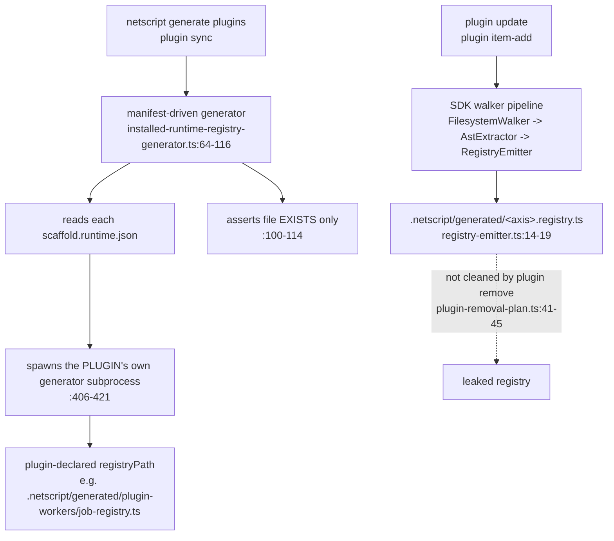
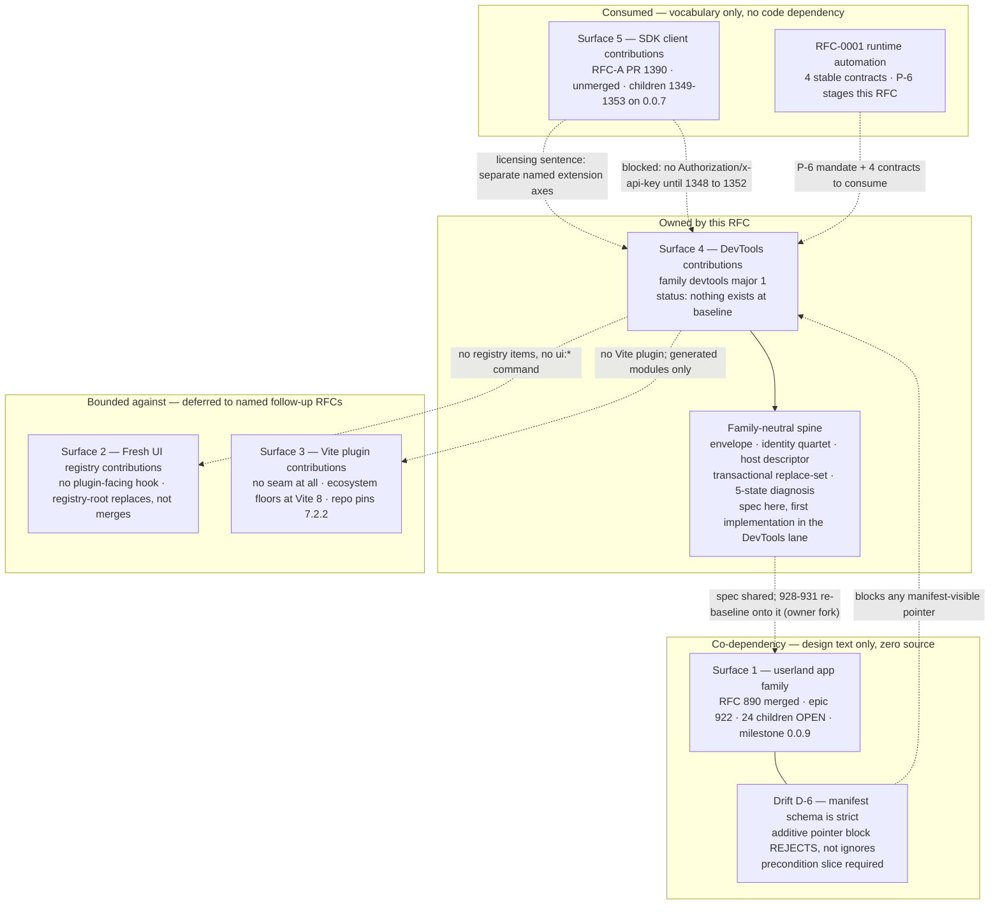
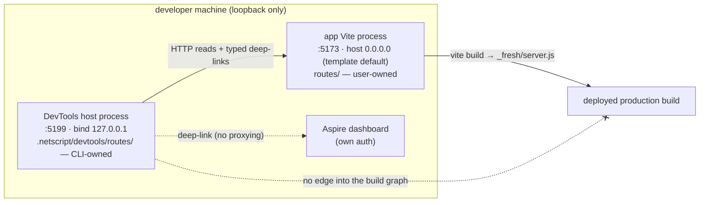
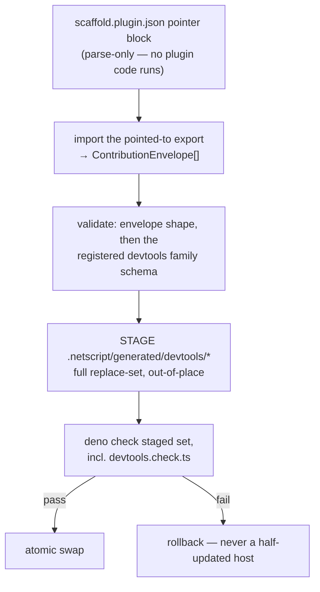
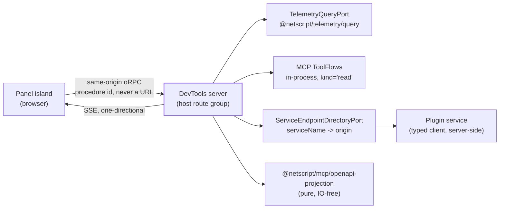
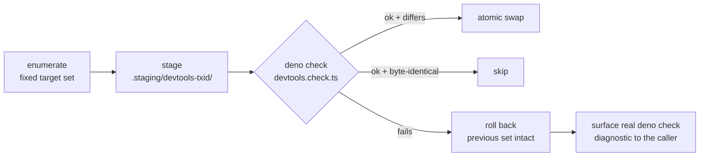
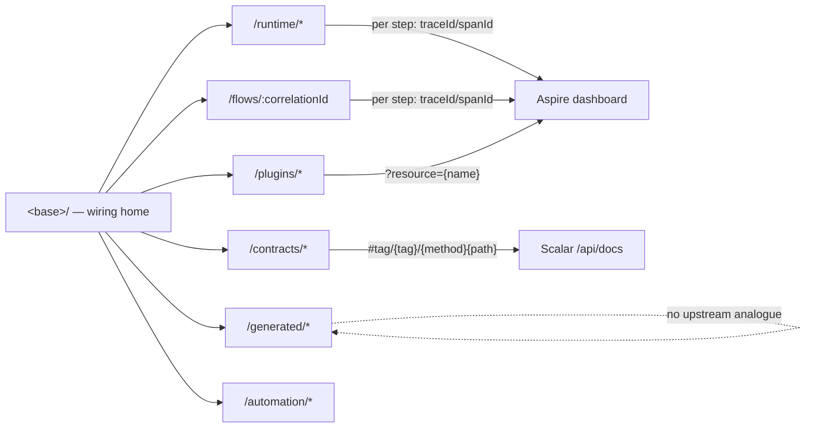
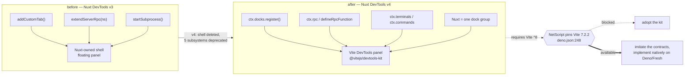
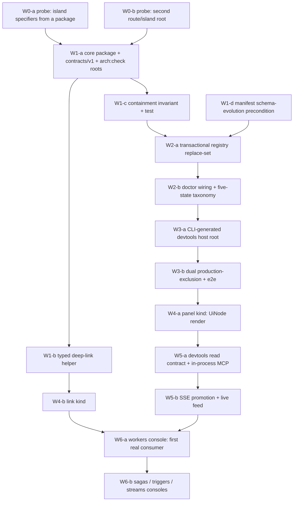

# RFC-0002 — NetScript DevTools contribution architecture

| | |
| --- | --- |
| **Status** | **Proposed** — awaiting owner ratification. Nothing in §14 files to GitHub before that. |
| **Run record** | `.llm/runs/plan-devtools-contribution--seed/` (charter, corpus, design packs, drift) |
| **Tracking** | Draft PR #1450. Re-evaluates epic #400 and its children. |
| **Evidence base** | 14-agent discovery corpus (6,327 lines) + 78 saved upstream artifacts under the run's `research/sources/`; 8 design packs; every load-bearing claim cited to `path:line`, a `deno doc` surface, a saved artifact, or a URL. |
| **Authority** | Consumes RFC #890 (frontend contribution layer), RFC-0001/#1446 (runtime-versioned automation, which stages this RFC as **P-6**), and RFC-A/#1390 (typed SDK client contributions). Where this document and the run corpus disagree, the run's `drift.md` wins; where this document and **GitHub** disagree after filing, GitHub wins. |
| **Baseline** | `main` @ `2256a67bf`, verified by `git fetch` on 2026-08-11. |

---

## 1. Abstract

NetScript has no way for a plugin to contribute developer-facing UI. Not a weak one — **none**. The
manifest's `capabilities.hasRoutes` describes *service HTTP endpoints*; no generated registry kind
emits a route, page, or island; and the only path by which first-party plugin client code currently
reaches the running app is **three hardcoded Vite aliases in a scaffold template**. A search for `devtools`
across `packages/`, `plugins/`, and `docs/site` source returns zero matches.

This RFC therefore does not extend an extension point. **It defines the first one.**

It specifies a **NetScript DevTools host** — a separate, loopback-bound, development-only Fresh
application with its own process, port, and route tree — and a **DevTools contribution family**
through which plugins add developer-facing panels, typed deep-links, and diagnostics. Contributions
are declared data, resolved into a **transactionally generated registry**, and rendered by a host
that owns the zone vocabulary, the ordering, and every byte of data access.

Three commitments shape the whole design:

1. **We own only what nobody else does.** Aspire owns resources, logs, traces, metrics, health, and
   process lifecycle; Scalar owns API reference and try-it. DevTools owns framework-only
   state — contribution wiring, contract provenance, generated-surface drift, runtime-domain
   journeys, and safe framework actions — and **deep-links outward** for everything else. Epic
   #400's own acceptance test is adopted verbatim as a normative gate: *every panel must answer "why
   can't this just deep-link to Aspire/Scalar?" with a NetScript-only answer.*
2. **Developer diagnostics are not a production admin console.** RFC-0001 settles this with a
   decision sentence, not a preference, and the market study explains the cost of confusing them:
   sandboxing, manifest host ranges, per-contribution RBAC, and runtime module federation are all
   prices paid for *untrusted third-party code in a long-lived, RBAC-governed, production-data
   surface* — a condition a developer tool does not satisfy. This RFC declines each of them **with
   its cited antecedent**, rather than by omission.
3. **A smaller true design beats a larger plausible one.** The v1 contribution set is deliberately
   small, and every retained kind names a real first-party consumer. A single `DevToolsContribution`
   union covering pages, panels, inspectors, visualizers, actions, data sources, navigation, and
   deep-links is precisely doctrine's AP-3 god interface, and is rejected on those grounds.

The RFC is **planning-only**. It proposes packages, contracts, gates, and a roadmap; it implements
none of them, and it files no board entry before the owner ratifies §15's decision brief.

## 2. Motivation

### 2.1 The cost of having no seam

Adding a contribution kind to NetScript today requires editing **six framework files** — a new kind
provider, the provider barrel, the kind registry, the bare-alias package resolver, the extractor's
hardcoded axis table, and the CLI's axis display. Only `api` is compiled in; every other kind is a
bare alias to a `@netscript/plugin-*` package.

The closedness is not incidental, and it is provable rather than argued: `cli.doctorChecks` is typed
`readonly 'auth-backend'[]`, a **closed string literal** — a third party cannot contribute a doctor
check name without editing the framework package. Alongside it sit ten axis-enum names against
twelve interface keys with nothing enforcing the correspondence, a `mergeContributions` that silently
drops `cli`, lifecycle hooks that are declared, typed, stored, and **invoked by nothing**, and a
duplicate-identity guard that exists but is not on the live load path — so two plugins whose local
names collide silently overwrite each other.

Meanwhile the framework has accumulated exactly the kind of state a developer most needs to see and
currently cannot: which plugins contributed what, whether generated registries match their sources,
whether a saga is compensating, why a trigger did not fire, and where a request went as it crossed
worker, saga, trigger, and stream seams.

### 2.2 Why now, and why this shape

Three adjacent RFCs converged on the same gap from different directions:

- **#890** ratified a frontend contribution layer for the *userland app* family and explicitly parked
  the trust tiers and the zone-conflict inspector "for the dashboard epic" — i.e. here.
- **#1446** designed runtime-versioned automation, split operator frontends into two hosts, and
  staged **P-6: a DevTools RFC** with four named contracts to consume — while deliberately excluding
  diagnostics from its own admin console so as not to pre-empt this design.
- **RFC-A/#1390** designed typed SDK client contributions and stated, in its own words, that *"UI
  contributions and SDK request contributions are separate named extension axes, not one universal
  envelope."*

Each left a DevTools-shaped hole and said so. This RFC fills it.

### 2.3 What this RFC deliberately does not assume

The single largest risk to a document like this is inheriting a predecessor's claim without checking
it. Three carried-in assumptions did not survive contact with the baseline, and the design is built
on the corrected versions:

- **#890's envelope is merged design text with zero implementation.** Thirty-two files, all under
  `.llm/runs/` plus `labels.yml`; all twenty-four children and the epic still open. "Reuse the
  existing envelope" therefore describes a **co-dependency on unbuilt work**, and §6 makes that an
  explicit, reversible owner decision instead of a silent premise.
- **#890's compatibility claim is false at this baseline.** It states that an older CLI ignores an
  unknown manifest block, making a pointer additive. The installer manifest schema ends in
  `.strict()`: an unknown top-level key is **hard-rejected**, and the plugin fails to parse rather
  than degrading. Any manifest-visible pointer needs a schema-evolution precondition first.
- **"Inspired by Medusa zones" is wrong about Medusa.** Medusa's injection zones are a *closed,
  core-owned* vocabulary that plugins cannot mint; the plugin-minted, namespaced model is **Strapi's**.
  The correction matters because it moves design budget off collision — which a closed vocabulary
  makes impossible by construction — and onto **ordering**, which *no* system surveyed had solved.

### 2.4 Non-goals

- Modernizing the visual design of epic #400. Architecture and contribution mechanics are the
  deliverable; the old board's *ownership thesis* is preserved and promoted to a normative gate, its
  screen list is not.
- Duplicating Aspire, Scalar, #890's userland contributions, #1390's SDK contributions, or #1446's
  runtime management architecture.
- Shipping anything to production. There is no production DevTools tier in this design.

## 3. Current state — what exists, what does not

Everything this RFC proposes is measured against this section. It is the as-is picture at baseline
`main` @ `2256a67bf`, cited to `path:line`, to a stage-B corpus file under
`.llm/runs/plan-devtools-contribution--seed/research/`, or to a drift entry. Where a corpus claim was
later corrected, **the drift entry is authoritative and is cited in its place**.

### 1. There is no plugin→UI channel of any kind

No plugin can contribute a page, a route, an island, a panel, a menu entry, or a Vite plugin to a
NetScript app. This is not "weakly supported" — the mechanism does not exist.

- `capabilities.hasRoutes` on the installer manifest is **service HTTP endpoints**, by its own doc
  comment: *"Whether the plugin scaffolder adds service routes or HTTP endpoints"*
  (`packages/plugin/src/protocol/manifest.ts:20-21`). Its only producer sets it from the plugin
  archetype (`new-plugin-use-case.ts:309`); no consumer maps it to a Fresh route (`r1` F9).
- **No `runtimeRegistries` kind emits UI.** The generated registries are runtime registries — jobs,
  sagas, triggers — declared per plugin in `scaffold.runtime.json`
  (`plugins/workers/scaffold.runtime.json:24-55`; `r1` F10).
- **No plugin can extend the Vite plugin chain.** The chain is static template text in the app's
  `vite.config.ts` (`packages/cli/src/kernel/assets/app/vite.config.ts.template:41-56`); a repo-wide
  grep for `createNetScriptVitePlugin` hits only the package, the template, its tests and docs — no
  plugin (`r1` F6).
- `grep -rniE 'devtools|_devtools' --include=*.ts --include=*.tsx --include=*.json --include=*.template packages plugins docs/site` → **zero
  matches** (`r1` F14). There is no DevTools host, path, mode flag, or feature branch to extend.

**The real mechanism today is three hardcoded Vite aliases.** A plugin's client code reaches the app
because the scaffold template hardcodes them, verbatim:

```ts
// packages/cli/src/kernel/assets/app/vite.config.ts.template:20-32
{ find: '@plugins/workers/streams',  replacement: resolve(workspaceRoot, 'plugins/workers/streams/mod.ts') },
{ find: '@plugins/sagas/streams',    replacement: resolve(workspaceRoot, 'plugins/sagas/streams/mod.ts') },
{ find: '@plugins/triggers/streams', replacement: resolve(workspaceRoot, 'plugins/triggers/streams/mod.ts') },
```

Adding a plugin does not add an alias; the list is template text, and the app author must then write
the import by hand (`r1` F11). The second and only other UI distribution path is **copy, not
import**: the `ui:add` registry writes files into the app under a five-entry alias table
(`@ui/ → components/ui/`, `@islands/ → islands/ui/`, …,
`packages/cli/src/kernel/application/ui/registry.ts:67-73`), and the plugin installer manifest has
**no UI, registry, component, theme, or token field at all** (`r2` F10).

Consequence for this RFC: there is no existing channel to extend, deprecate, or stay
backward-compatible with. Every seam the later sections specify is new construction. See **The
DevTools contribution family** and **The five frontend contribution surfaces**.

### 2. The plugin manifest is two disjoint shapes

NetScript has two manifests that do not reference each other, and the same plugin declares its
service twice — once per model (`plugins/workers/scaffold.plugin.json:49-71` vs
`plugins/workers/src/public/mod.ts:63-68`; `r3` summary).

| | TS runtime manifest | JSON installer manifest |
| --- | --- | --- |
| Type | `PluginManifest` (`packages/plugin/src/config/domain/plugin-manifest.ts:7-34`) | `PluginInstallerManifest` (`packages/plugin/src/protocol/manifest.ts:139-164`) |
| File | built by `definePlugin` in `src/public/mod.ts` | `scaffold.plugin.json` |
| Versioning | **none** — no contract-version field exists | `schemaVersion: z.literal(1)` (`manifest.ts:271`) |
| Validation of payloads | `contributions` reduced to `z.record(z.string(), z.unknown())` (`config/validators/manifest-schema.ts:22`) — payloads **unvalidated at the boundary** | `.strict()` (`manifest.ts:283`) |
| Unknown key behavior | **silently dropped**, no diagnostic (`config/application/contribution-merger.ts:6-26`; `r3` F9) | **hard reject** — parsing fails, plugin does not load |
| Carries UI | no | no (`r2` F10) |

The `.strict()` fact is load-bearing and corrects a merged claim elsewhere. **Drift D-6**: RFC #890's
contract C8 asserts that a manifest pointer block "bumps additively; older CLIs ignore the block".
They do not — Zod `.strict()` hard-rejects any unknown top-level key, so an older CLI fails manifest
parsing outright and takes the whole plugin down rather than degrading
(`drift.md` D-6; `packages/plugin/src/protocol/manifest.ts:271,282`). A third file,
`scaffold.runtime.json`, *looks* versioned — `"schemaVersion": 1`
(`plugins/workers/scaffold.runtime.json:2`) — but `readRuntimeManifest` never reads it
(`installed-runtime-registry-generator.ts:320-359`), so incompatible runtime manifests are silently
accepted (`r3` F5, D5).

### 3. The contribution-axis model, and its provable closedness

Ten names in the axis enum (`packages/plugin/src/domain/constants.ts:16-40`), **twelve keys** on the
actual interface (`packages/plugin/src/config/domain/plugin-contributions.ts:11-40`) — `cli` and
`doctor` have no axis name, and nothing type-level enforces the correspondence (`r3` F2, D2).
`isContributionAxis` (`config/validators/contribution-axis-validator.ts:3-5`) is a plain `includes()`
with no non-test caller in `packages/cli`.

The single sharpest piece of evidence that the axis set is **closed to third parties** is a type:

```ts
// packages/plugin/src/config/domain/plugin-contributions.ts:13-16
readonly cli?: {
  /** Host doctor checks contributed by this plugin. */
  readonly doctorChecks?: readonly 'auth-backend'[];
};
```

A third-party plugin cannot name a doctor check without editing `@netscript/plugin`. Four further
properties make the closedness structural rather than incidental:

1. **Dead axes.** Of twelve keys, only `services`, `runtimeConfigTopics` (as a presence bit),
   `doctor`, and `cli` are read by the CLI registry normalizer
   (`packages/cli/src/kernel/adapters/config/plugin-registry.ts:461-471`).
   `streamTopics`, `databaseSchemas`, `contractVersions`, `e2e`, `telemetry`, `migrations`, and
   `backgroundProcessors` have **no non-test consumer found** outside `verify-plugin` (`r3` F2 table).
   Even `services` reads only `[0]` — extra services are silently dropped (`plugin-registry.ts:462-468`).
2. **`mergeContributions` silently drops `cli`.** It rebuilds nine array axes plus `aspire`/`doctor`
   and never copies `cli` (`config/application/contribution-merger.ts:4-27`), so `cli.doctorChecks`
   is erased on the host-loader path and survives only on the separate registry path — a real
   divergence between two host paths (`r3` F3).
3. **Uninvoked lifecycle hooks.** `setup` / `beforeGenerate` / `afterGenerate` / `teardown` are typed
   (`config/domain/plugin-lifecycle-hooks.ts:8-10`), enumerated (`domain/constants.ts:43-51`),
   produced by workers (`plugins/workers/src/public/mod.ts:108-122`), and **invoked by nothing** —
   the one non-test hit is the builder storing them (`config/builders/plugin-builder.ts:326`;
   `r3` F4).
4. **Silent duplicate-identity collapse.** `PluginRegistry.register` throws `DuplicatePluginError`
   (`packages/plugin/src/application/plugin-registry.ts:9-14`) but is **not on the load path**.
   `loadRegisteredPlugins` builds a `Record` keyed by `resolvePluginLocalName` — last path segment
   with a leading `plugin-` stripped — so `@a/plugin-ai` and `@b/plugin-ai` collide and one
   **silently overwrites** the other (`kernel/adapters/config/plugin-registry.ts:67-72,150-159`;
   `r3` F9). Duplicate `aspire`/`doctor` contributions are last-writer-wins with no diagnostic
   (`contribution-merger.ts:24-25`). The only fail-first duplicate guard in the whole surface is on
   runtime-config topics (`generate-runtime-schemas.ts:163-170`).

Ordering, not collision, is therefore the open problem for any new family — see
**The DevTools contribution family**.

### 4. What a contributor must edit today to add a kind

The motivation in concrete form. For a *first-party* new plugin kind with a new contribution axis,
the minimum edit set is six framework files, in two packages the contributor does not own
(`r4` F11, `installed-runtime-registry-generator` path excepted):

| # | File | Why |
| - | ---- | --- |
| 1 | `packages/cli/src/kernel/adapters/plugin/kinds/<kind>.kind.ts` (new) | the `PluginKindProvider` itself (`kernel/domain/plugin-kind.ts:52-138`) |
| 2 | `packages/cli/src/kernel/adapters/plugin/kinds/plugin-kind-providers.ts` | barrel export |
| 3 | `packages/cli/src/kernel/application/registries/plugin-kind-registry.ts` | compiled-in default map — today literally `['api', apiKindProvider]` (`:12-17`) |
| 4 | `packages/cli/src/public/features/plugins/install/plugin-package-resolver.ts` | bare alias, else `plugin install <kind>` resolves nothing and hard-fails (`install-plugin.ts:145-153`) |
| 5 | `packages/plugin/src/sdk/discovery/ast-extractor.ts` | the axis table, if a new contribution axis |
| 6 | `packages/cli/src/public/features/plugins/list/list-plugins-command.ts` | a second, independent plugin→axis map (`:24-28`) |

Two of those six are duplicated maps of the same fact (5 and 6). Only the manifest-driven runtime
path needs no CLI edit, because the plugin declares its own `runtimeRegistries` in
`scaffold.runtime.json` — that is the one existing open seam, and it emits runtime code, never UI.

### 5. Generation: two divergent generators, a regex "AstExtractor", non-transactional writes



- **Two generators, two output paths.** `generate plugins` / `plugin sync` use the manifest-driven
  generator; `plugin update` and `plugin item-add` use the walker. One plugin's registry can be
  written by both mechanisms to different paths, and nothing decides which is authoritative
  (`r4` F3, D4; `r4` open question 1).
- **`AstExtractor` is not an AST parse.** It is regex over comment/string-stripped text
  (`packages/plugin/src/sdk/discovery/ast-extractor.ts:36-62`) recognizing exactly three hardcoded
  builders:

  ```ts
  // packages/plugin/src/sdk/discovery/ast-extractor.ts:4-8
  const CONTRIBUTION_BUILDERS = [
    { callee: 'defineJob', axis: 'jobs' },
    { callee: 'defineSaga', axis: 'sagas' },
    { callee: 'defineWebhook', axis: 'triggers' },
  ] as const;
  ```

- **Writes are not transactional.** The plugin's generator does `Deno.mkdir` then `Deno.writeTextFile`
  per target — no temp file, no rename (`plugins/workers/src/cli/runtime-registry-generator.ts:88-95`);
  a crash between targets leaves a partially-updated registry set. The host then verifies only that
  each declared path **exists**; content is never checked
  (`installed-runtime-registry-generator.ts:100-114`). `generate runtime-schemas` writes file-by-file
  in a loop, so a mid-loop failure leaves earlier files written
  (`generate-runtime-schemas.ts:119-131`) (`r3` F8; `r4` F3).
- **Walker output leaks on removal.** `plugin remove` deletes `.netscript/generated/<name>` and
  `plugin-<name>` only, so `.netscript/generated/<axis>.registry.ts` survives removal
  (`remove/plugin-removal-plan.ts:41-47`; `r4` F10).
- **The generator subprocess is spawned with whole-filesystem read and write.** **Drift D-7** corrects
  the stage-B corpus here: the flags are bare `'--allow-read'` and `'--allow-write'` with no `=<path>`
  value, and a valueless Deno permission flag grants the permission globally — not project-root scope
  as `r3` F10 recorded. Mitigating and equally verified: no `--allow-net` and no `--allow-env` appear
  in the same argument list, so Deno's default-deny blocks network exfiltration from that subprocess
  (`drift.md` D-7; `installed-runtime-registry-generator.ts:416-417`). The manifest's own declared
  `scaffolder.requiredPermissions {net, read, write}` (`protocol/manifest.ts:7-14`) are never
  translated into the spawn — they are advisory metadata today.

A related write primitive — `resolveTarget` accepting absolute and escaping-relative copy targets
with no containment assertion (`kernel/application/ui/registry.ts:283`; `r2` D3) — is inert while
only first-party items exist and is analysed in **Trust, security, and the threat model**.

### 6. The `/design` precedent

A dev-facing, in-app, host-owned route tree already ships in every scaffolded project, and it is the
closest structural precedent for a DevTools surface:

- 13 template files under `packages/cli/src/kernel/assets/app/routes/(design)/design/` — `_layout`,
  `index`, `tokens`, `components`, `composition`, plus `(_components)`, `(_islands)`, `(_shared)` —
  all registered in `packages/cli/src/kernel/assets/manifest.ts:4-35` (`r5` F30).
- It renders a `SidebarShell` with its own navigation groups and `ThemeToggle`/`SidebarToggle` islands
  (`(design)/design/_layout.tsx.template:1-50`), and its routes are seeded into the typed router as
  `$route: '/design'`, `'/design/tokens'`, … (`kernel/application/scaffold/writers/app-route-seeds.ts:24-26`).
- **It is not a plugin contribution.** It is scaffold template text the app owns after generation.
- **It has no dev-only gate.** Nothing in the layout or the route seeds checks `MODE`/`NODE_ENV`; the
  only `MODE` read in the scaffold is a log line (`main.ts.template:17`) (`r1` F13). Whether `/design`
  reaches production users today is an **open question** carried from stage B
  (`research.md` § Open questions 3) — it is not a claim this RFC may assert either way.

Routing constraint inherited from the same precedent: a `routes/_devtools/…` directory or a
`routes/(_devtools)/…` group is **invisible** to the route-manifest walker, which treats `_*` and
`(_*)` as helper paths (`packages/fresh/src/application/route/manifest.ts:53-55,74-86`). A visible
tree must take the `(design)/design` shape. See **The DevTools host**.

### 7. The data plane that already exists — consume, do not rebuild

These are shipped, typed assets. Rebuilding any of them would repeat the exact trap the charter
forbids, and one generated file already fell into it.

| Asset | Surface | Evidence |
| --- | --- | --- |
| `TelemetryQueryPort` | 7 methods — `queryTraces`, `getTrace`, `querySpans`, `queryLogs`, `queryMetrics`, `queryResources`, `exportTraces`; published as `@netscript/telemetry/query`, factory `createTelemetryQuery` | `packages/telemetry/src/ports/telemetry-query-port.ts:15-79`; `packages/telemetry/query.ts:53` (`r5` F10) |
| 22 typed MCP tools | `TOOL_NAMES` with **input *and* output** JSON schemas keyed exhaustively by `ToolName`, a `ToolKind = 'read' \| 'mutate' \| 'meta'` safety classification, and a discriminated `ToolSuccess \| ToolFailure` with stable `error.code` | `packages/mcp/src/domain/tool-types.ts:3-26,32,34-58`; `tool-contracts.ts:353,361` (`r5` F17-F18) |
| `@netscript/mcp/openapi-projection` | pure, IO-free: `indexOpenApiOperations`, `resolveCanonicalOperation`, `describeOpenApiOperation`, `projectOperationSchemaViews`, `SCHEMA_VIEW_NAMES` — usable by an API explorer **without running MCP** | `packages/mcp/openapi-projection.ts:1-38` (`r5` F21) |
| `netscript.correlation.id` | the single correlation floor; the join key that stitches job → saga → trigger → stream across spans, under 15 declared `netscript.*` domains | `packages/telemetry/src/domain/telemetry-convention.ts:32-56` (`r5` F12-F13) |
| Endpoint resolution | `resolveTelemetryEndpoint` reports its own `source` (`explicit \| netscript_env \| aspire_port \| default`) — exactly the "where is my data coming from" affordance a panel needs | `packages/mcp/src/domain/telemetry-endpoint.ts:22-39` (`r5` F22) |
| Scalar / OpenAPI | fixed mounts `/api/openapi.json`, `/api/docs`, `/api/docs/scalar.js`; Scalar JS vendored inline (3,475,795 bytes), no CDN | `packages/service/src/builder/service-builder-impl.ts:468,477-484`; `primitives/scalar.generated.ts` (`r5` F26, F28) |

Two hard limits on that plane, both cited:

- **MCP is newline-delimited stdio only.** The package exports a single `runNewlineStdio`
  (`packages/mcp/src/infrastructure/stdio-transport.ts:4`); there is no HTTP or SSE transport, so a
  browser client cannot speak to it directly (`r5` F23). Whether it *can* be exposed over HTTP/SSE, or
  whether a DevTools surface must compose the flows in-process, is **open**
  (`research.md` § Open questions 4).
- **The SSE helpers are not exported for this purpose.** `SSE` is one of the fifteen declared
  `netscript.*` telemetry attribute domains (`telemetry-convention.ts:32-49`), but no streaming
  transport for a DevTools client exists on any published subpath. Treated as absent below; see
  **The data plane**.

And the warning already in the repo: the scaffolded `examples/telemetry` page **bypasses**
`@netscript/telemetry/query` and hand-rolls OTLP JSON interfaces plus its own `fetch` against
`${base}/api/telemetry/traces`, re-implementing nano-duration math and `service.name` extraction
(`packages/cli/src/kernel/assets/app/routes/examples/telemetry/(_shared)/telemetry-trace.ts.template:39-141`;
`r5` drift candidate 1). It also disagrees with MCP on scheme — `https://localhost:${ASPIRE_DASHBOARD_PORT ?? 18888}`
vs MCP's four-arm resolver (`r5` drift candidate 2), a silent fetch failure under the default
unsecured local transport. That is user-visible generated code reimplementing a shipped port.

Finally: **no deep-link helper exists anywhere in `packages/`** for Aspire or Scalar, despite both URL
grammars being stable. The only `dashboardUrl` consumers in the repo are e2e-gate files under
`packages/cli/e2e/` (`r5` F7-F9, drift candidate 5), and `ScalarDocsOptions` is `{specUrl, title?,
theme?}` with no per-operation anchor helper (`packages/service/src/primitives/openapi.ts:48-56`). The
hand-off thesis has no implementation seam today.

### 8. Capability matrix

`exists` = shipped and consumed. `partial` = shipped but unreachable, unconsumed, or scoped narrower
than the capability name implies. `absent` = verified negative (grep or read).

| Capability | State | Citation |
| --- | --- | --- |
| Plugin contributes a page / route / island to the app | **absent** | no registry kind emits routes/pages/islands (`plugins/workers/scaffold.runtime.json:24-55`); `r1` F10-F11 |
| Plugin contributes a Vite plugin | **absent** | chain is static template text; repo-wide grep for `createNetScriptVitePlugin` finds no plugin (`vite.config.ts.template:41-56`; `r1` F6) |
| Any DevTools host, path, or mode flag | **absent** | `grep -rniE 'devtools|_devtools' … packages plugins docs/site` → 0 (`r1` F14) |
| Plugin client code reaches the app | **partial** — three hardcoded aliases + a manual import | `vite.config.ts.template:20-32` |
| UI distribution to an app | **exists**, by **copy** only (`ui:add`, five alias prefixes) | `kernel/application/ui/registry.ts:67-73`; `r2` F4-F5 |
| Plugin contributes a UI/registry item | **absent** — installer manifest has no UI/registry/theme/token field; `--registry-root` **replaces**, never merges | `packages/plugin/src/protocol/manifest.ts:17-140`; `registry.ts:203-214`; `r2` F10 |
| Versioned contribution envelope | **absent in code** — `FrontendManifestEnvelope` is design text only, in an unimplemented RFC | `.llm/runs/plan-frontend-contrib--seed/design/canonical/01-contracts.md:62-110`; `r3` F6 |
| Additive manifest evolution | **absent** — `.strict()` hard-rejects unknown top-level keys | `drift.md` D-6; `protocol/manifest.ts:271,282` |
| Third-party contribution axis | **absent** — `cli.doctorChecks: readonly 'auth-backend'[]`; six framework files to add a kind | `plugin-contributions.ts:13-16`; `r4` F11 |
| Plugin lifecycle hooks | **partial** — declared, typed, produced, invoked by nothing | `r3` F4; `plugin-builder.ts:326` |
| Duplicate-plugin-identity guard | **partial** — exists (`DuplicatePluginError`) but off the load path; silent last-wins | `application/plugin-registry.ts:9-14` vs `kernel/adapters/config/plugin-registry.ts:150-159` |
| Transactional registry writes | **absent** — per-file `writeTextFile`, existence-only verification | `runtime-registry-generator.ts:88-95`; `installed-runtime-registry-generator.ts:100-114` |
| Single authoritative registry generator | **absent** — two generators, two paths, no precedence rule | `r4` F3, D4 |
| AST-based contribution extraction | **absent** — regex over stripped text, three hardcoded builders | `ast-extractor.ts:4-8,36-62` |
| Scoped permissions on the generator subprocess | **absent** — valueless `--allow-read --allow-write` = whole filesystem (no `--allow-net`/`--allow-env`) | `drift.md` D-7; `installed-runtime-registry-generator.ts:416-417` |
| Copy-target containment | **absent** — `resolveTarget` accepts absolute and `../` targets | `kernel/application/ui/registry.ts:283`; `r2` D3 |
| `plugin dev` / watch loop | **absent** — zero watch loops in the CLI; regeneration is always command-triggered | `r4` F6 |
| In-app dev-facing route tree precedent | **exists** (`/design`, 13 templates), **ungated** | `assets/manifest.ts:4-35`; `r1` F13 |
| Dev-only / production gating of a dev surface | **absent** — no `MODE`/`NODE_ENV` check in the `(design)` group | `r1` F13; `r5` open question 5 |
| Typed telemetry read model | **exists** — `TelemetryQueryPort`, published | `telemetry-query-port.ts:15-79` |
| Typed framework-state tool surface | **exists** — 22 MCP tools, input+output schemas, `ToolKind` | `tool-types.ts:3-26,32`; `tool-contracts.ts:353,361` |
| Browser-reachable MCP transport | **absent** — `runNewlineStdio` only | `stdio-transport.ts:4` |
| IO-free OpenAPI schema projection | **exists** — `@netscript/mcp/openapi-projection` | `packages/mcp/openapi-projection.ts:1-38` |
| Cross-domain correlation key | **exists** — `netscript.correlation.id` | `telemetry-convention.ts:54-56` |
| SSE helpers exported for a client | **absent** — `SSE` is a telemetry attribute domain, not a transport export | `telemetry-convention.ts:32-49`; `r5` F23 |
| Aspire / Scalar deep-link helper | **absent** in `packages/`; `dashboardUrl` read only by e2e gates | `r5` F7-F9, drift candidate 5 |
| Generated code consuming the framework's own telemetry port | **absent** — the scaffolded example hand-rolls OTLP instead | `telemetry-trace.ts.template:39-141`; `r5` drift candidate 1 |

## 4. The five frontend contribution surfaces

### The taxonomy is the owner's, not this RFC's

This RFC does not invent the surface map it is scoped against. RFC-0001 (Runtime-Versioned
Automation, PR #1446 @ `6cb79675c`) enumerates it under owner directive D-9, at `RFC:497-502`:

> "(1) userland UI via the `app` family; (2) Fresh UI registry/component/style-dictionary extensions
> generated into userland (potentially extending the CLI's fresh-ui commands); (3) deferred Vite
> plugin contribution; (4) a first-class **DevTools contribution family/host**; (5) SDK
> contribution, owned by its separate RFC. **This runtime RFC designs none of those general
> mechanisms.** It consumes (1) and stages (4)."

The same five-surface wording appears verbatim in that run's drift log at severity `architectural`
(`/home/codex/repos/ns-rfc-runtime-versioned-automation/.llm/runs/docs-rfc-runtime-versioned-automation--supervisor/drift.md:15`,
2026-08-11) — cited via `research/p2-rfc-1446-runtime-automation.md` F4.

**This RFC ratifies surface (4) and only surface (4).** That assignment is `inference`: RFC-0001
stages (4) behind its P-6 row and hands it to a DevTools RFC (`RFC:638`, `p2` F1), but no document
assigns (2) or (3) to any owner. Surfaces (2) and (3) are therefore *bounded against* here — this
RFC states what it will not do to them and what a future RFC inherits — and the reassignment of
either to this RFC is an owner fork (**Fork S-A**, below).

One clarification the map does not make on its own: RFC-0001's decision sentence — "production
operator management and developer diagnostics are two distinct hosts and two distinct contribution
surfaces — not one ambiguous 'cockpit'" (`RFC:491-493`, `p2` F3) — is **not a sixth surface**. It
splits *hosts* across surfaces (1) and (4): the production admin console is a consumer of the
userland `app` family (RFC-0001 slice A7, `RFC:503-513`), and DevTools is surface (4). The sentence
is a boundary, and this RFC treats it as a binding constraint rather than an open question (stage-C
resolution R3).

### The map

| # | Surface | Current owner | Current state at `main` @ `2256a67bf` | This RFC's disposition |
| - | ------- | ------------- | ------------------------------------- | ---------------------- |
| 1 | Userland frontend code — routes/islands/nav/theme/zones | RFC #890 (merged) → epic #922, children #923–#946, milestone `0.0.9` | **Design-only.** #890's changeset is 32 files: `.github/labels.yml` plus `.llm/runs/plan-frontend-contrib--seed/**` — zero `packages/`, `plugins/`, `apps/`, `docs/` lines (`gh pr view 890 --json files`; `p1` F1). Epic + all 24 children OPEN at `status:plan`; not even the disposable Wave-0 proofs (S1–S5, #923–#927) have run (`p1` F4, F5) | **Co-depend, do not consume.** Adopt its payload-agnostic spine *as a specification* and build the first implementation in the DevTools lane; never assert it as an existing surface. See "The DevTools contribution family" |
| 2 | Fresh UI registry / component / style-dictionary contributions | Unassigned (`p2` F4 inference); mechanically owned by `packages/fresh-ui` + the five `ui:*` CLI commands | **No plugin-facing hook exists.** The registry is a single hardcoded TS manifest (`packages/fresh-ui/registry.manifest.ts`, 74 `name:` keys) inlined into a generated embed; the plugin installer manifest has no UI/registry field; the only extension seam is `--registry-root`, which **replaces** the manifest wholesale rather than merging, with silent last-wins collision at three layers (`r2` summary, F11) | **Bound against + defer** to a named follow-up RFC with entry criteria. This RFC contributes **no** registry items, adds **no** `ui:*` command, and does not widen `RegistryItemKind` |
| 3 | Vite plugin contributions | Unassigned (`p2` F4 inference); mechanically owned by `packages/fresh`'s build pipeline | **No contribution seam of any kind.** `vite.config.ts` is static template text with three hardcoded aliases; no plugin references `createNetScriptVitePlugin` (`r1` F6, F11 — the "real mechanism" fact behind `research.md` F1). The ecosystem's shape (`@vitejs/devtools-kit`, `Plugin.devtools.setup(ctx)`) floors at **Vite 8** while NetScript pins **7.2.2** (`deno.json:248`, `packages/fresh/deno.json:56`; `m1` F28/D2) | **Bound against + defer**, and design v1 so it never becomes a retroactive prerequisite: DevTools contributions enter the build as **generated source modules**, so no third-party code joins the Vite plugin chain (T7 recommendation 1; see "Build and dev integration") |
| 4 | **DevTools contributions** | **This RFC** (staged by RFC-0001 as P-6, `RFC:638`) | **Nothing exists.** `grep -rniE 'devtools|_devtools' … packages plugins docs/site` → **0 matches**; there is no plugin→UI channel of any kind (`research.md` F1) | **Own.** Host, family, kinds, data plane, trust model, build integration, IA, and acceptance are specified in the sections that follow |
| 5 | SDK contributions | RFC-A, PR #1390 / issue #1348 | **Accepted-in-principle, unmerged, unbuilt.** PR #1390 is DRAFT/OPEN, still numbered `0000`; FCP disposition **accept** with objection deadline **2026-08-15 22:00 Europe/Zurich** (open as of 2026-08-11); implementation children #1349–#1353 all OPEN on milestone `0.0.7`; `rg 'SdkClientContribution\|contributions' packages/sdk/src` → 0 matches (`p3` F1, F2, F12) | **Consume the vocabulary, never duplicate the axis.** Align on `protocol {family, major}`, namespaced ids, duplicate rejection, and static module references — the only part available before merge (`p3` F13) |

### Why the seams do not overlap

The non-overlap argument is not "different names for different things" — it is that each surface
produces a **different artifact**, consumed by a **different host**, at a **different phase**. Two
contributions overlap only if all three columns collide.

| # | Contribution artifact | Consuming host | Execution phase | Disjointness proof |
| - | --------------------- | -------------- | --------------- | ------------------ |
| 1 | Route / island / zone / nav / theme payloads under `{ family: 'app', major: 1 }` | The **scaffolded userland Fresh app**, via its `HostSurfaceDescriptor` (`host: 'app'`, zones `app.topbar.end` / `app.dashboard.panels` / `app.home.cards` / `app.footer`) | App request/render | A host only mounts contributions whose `(family, major)` is inside its declared window; anything else quarantines (`p1` C2, C4). The `app` host does not declare `devtools` and vice versa, so the same envelope cannot land in both hosts by accident — the negotiation *is* the proof, and it is testable |
| 2 | **Files copied into the user's source tree** (`copyOwnership: 'app-owned-after-copy'`) | The developer's editor and, after copy, the app's own build — no runtime host at all | `ui:add` / `ui:update`, install-time only | A registry item is not a mounted contribution: after copy it is app-owned source with no identity, no envelope, and nothing to negotiate (`r2` F1, summary). DevTools never copies files into userland in import-mode; if the P-1 island probe forces copy-mode, the materialized files are *host-owned and regenerated*, not `app-owned-after-copy` (T7 §Island registration) |
| 3 | A **Vite plugin object** in the bundler's plugin chain | Vite itself, at config/transform time | Build/config, before any app code exists | DevTools contributions never enter this phase: they are generated modules referenced by literal specifiers from a transactionally generated replace-set, so Vite never learns DevTools exists (T7 recommendation 1). A contribution therefore cannot reconfigure the bundler, break the `preact`/`@preact/signals` dedupe singleton (`r1` F16), or transform app code |
| 4 | DevTools panels/inspectors/actions/diagnostics under `{ family: 'devtools', major: 1 }` | The **DevTools host**, with its own descriptor and closed zone vocabulary | DevTools request/render, development only | Same `(family, major)` negotiation as row 1, plus a host that refuses to serve outside development via two independent mechanisms (see "The DevTools host"). Its IA is additionally constrained by acceptance line 1 — no surface ships that Aspire or Scalar already owns (`b1` F3) |
| 5 | An outbound **request-header preparation descriptor** `{ protocol, id, context, headerKeys, responseCache, prepare }` | `@netscript/sdk`'s HTTP client, per call | Request preparation, per logical call epoch | RFC-A's descriptor has no `fetch`, `link`, `plugins`, `interceptors`, or error-map field, no response hook, and is HTTP-only with a normative MessagePort rejection (`p3` F4, F11, F14 — `rfc:954-968`, `rfc:983-998`). It cannot express a UI contribution, and RFC-A says so itself (next section) |

Two consequences worth stating as rules rather than observations:

- **R-SURFACE-1.** A single plugin may contribute to several surfaces at once; it does so by
  exporting several envelopes, one per family — #890's ratified multi-family export form is a plain
  array (`export default [defineFrontend(appDefinition), defineFrontend(devtoolsDefinition)];`,
  `01-contracts.md:109-114` via `p1` C1). There is no universal envelope and no widened union. The
  widened-union model in `#890`'s own `design/examples/dashboard.md:74-78`
  (`DashboardContribution = FrontendContribution | …`) contradicts #890's ratified decision D3 and
  is recorded drift inside its merged record (`p1` F11, D-4) — **it must not be copied.**
- **R-SURFACE-2.** No surface may be extended by widening another surface's payload union. Adding a
  kind to an existing family is a **new major of that family** (`p1` C2); adding a *surface* is a
  new family with its own host descriptor. This is what keeps the map five entries long instead of
  one god interface (doctrine AP-3, `b2` F5 via `research.md` F13).

### The two hard dependencies

#### D1 — #890's spine is unbuilt: a co-dependency, not reuse

Any sentence of the form "DevTools reuses #890's envelope" is false at this baseline. #890 merged
**documentation only** — 32 files, all under `.llm/runs/plan-frontend-contrib--seed/` plus
`.github/labels.yml`, `additions: 3976`, zero source (`gh pr view 890 --json files`; `p1` F1). Every
named artifact is absent, checkably:

| Designed artifact | Baseline check | Result |
| ----------------- | -------------- | ------ |
| `@netscript/plugin-frontend-core` | `ls packages/` | absent |
| `.withFrontend()` | `rtk grep -rn "withFrontend" packages/ plugins/` | 0 hits |
| `defineFrontend` / `FrontendManifestEnvelope` / `frontend.registry` | `rtk grep -rln … packages/ plugins/ apps/ docs/` | 0 files |
| `frontend` contribution axis | `packages/plugin/src/domain/constants.ts:16-40` | not in `CONTRIBUTION_AXES` |
| `@netscript/fresh/plugins` subpath | `packages/fresh/deno.json` `exports` | absent |
| any plugin-shipped UI | `find plugins -name "*.tsx"` | empty |

(Table from `p1` F1.) Consequences this RFC carries rather than hides:

1. **The spine is a specification, not an import.** What transfers is payload-agnostic by
   construction — envelope, identity quartet, host-surface descriptor, transactional replace-set,
   five-state diagnosis taxonomy (`p1` F14) — and this RFC pins it in a family-neutral home whose
   first implementation is a DevTools slice. The dependency direction, the package home, and the
   re-baselining obligation on #922's spine children (#928–#931) are decided in "The DevTools
   contribution family"; this section only records that the edge is a *co-dependency*.
2. **Wave-0 proving risk is real and unassigned.** #922's own sequencing law is "Wave-0 proofs
   (S1–S5) land before any public contract freezes"; none has run (`p1` F5). Whoever implements the
   staged-check-swap emitter first absorbs that risk.
3. **#890's compatibility claim about manifest evolution is false at baseline, and DevTools must not
   inherit it.** C8 states `PLUGIN_MANIFEST_SCHEMA_VERSION` "bumps additively; older CLIs ignore the
   block". `PluginInstallerManifestSchema` ends in **`.strict()`**
   (`packages/plugin/src/protocol/manifest.ts:283`) and pins `schemaVersion: z.literal(1)` (`:271`),
   so an unknown top-level key does not degrade — it **fails manifest parsing outright**, taking the
   whole plugin down (drift **D-6**; corroborated by `r3` F5). Any manifest-visible DevTools pointer
   therefore requires an explicit **schema-evolution precondition slice** — a `.passthrough()`/
   `catchall` relaxation with its own compatibility test, or a `schemaVersion` bump with a documented
   migration — sequenced *before* the pointer lands. This is also a live defect in #890's ratified
   compatibility story affecting slice #929, escalated to the owner as a cross-RFC finding; this run
   does not edit that epic's board.

#### D2 — RFC-A does not close the host→panel loop, but licenses one

RFC-A's chain terminates at "a statically generated services map plus a caller-supplied context
object": the plugin exports a descriptor and declares an `SdkClientContributionReference`; a
generator or the application author writes a literal `defineServices({ … contributions: [...] as
const })`; call sites pass context per call (`p3` F8, from `rfc:1136-1176`). It explicitly rejects a
registry, a locator, and any ambient client ("Rejected: fluent client builder or global registry",
`rfc:1501-1506`), states "No runtime scans installed packages, filesystem manifests, globals, or
environment variables" (`rfc:1176`), and contains **zero occurrences of "devtool"**. A
plugin-contributed panel therefore has no RFC-A-sanctioned way to *obtain* a client.

The licensing sentence is RFC-A's own (`rfc:1179-1187`):

> "UI contributions and SDK request contributions are separate named extension axes, not one
> universal envelope."

Read precisely, that sentence does two things: it **forbids** DevTools from solving its data problem
by widening the SDK axis, and it **licenses** a separate host→panel seam owned by the UI side. This
RFC takes the license: the host→panel context contract is specified in "The DevTools data plane",
not bolted onto `SdkClientContribution`.

What it must *not* do is depend on RFC-A's code. Availability risk is high and shape risk is low
(`p3` F13): nothing exists to import, the chain to a credential-bearing typed client runs FCP close
(earliest 2026-08-15) → #1350 → an **unfiled** procedure-metadata child (FCP disposition 6, `p3`
drift 4) → #1351's stable-v1.15.0 family move → #1349 → #1352, all on milestone `0.0.7`. Two facts
follow and are carried as constraints elsewhere in this RFC: `createServiceClient` cannot send
`Authorization` or `x-api-key` today (`b2` F10 via `research.md` F15), so any panel needing a
credential-bearing client renders a **blocked state naming #1348→#1352** rather than a bespoke
bypass; and RFC-A's redaction law (header values, input, and context MUST NOT be recorded, **not
even in debug mode** — `rfc:1091-1110`) binds what a DevTools panel may display, while query-key
`partition` values are explicitly declared non-secret and "intentionally visible in query keys and
developer tools" (`rfc:1117-1119`).

### Dependency diagram



Edge semantics: solid = build-order dependency; dotted = contract, constraint, or explicit
non-dependency. The only solid edge out of surface 4 is to the spine it specifies and builds — that
is what makes DevTools v1 shippable while surfaces 1, 2, 3, and 5 are unbuilt.

### What "defer" means here — no vague deferrals

Surfaces 2 and 3 are deferred to follow-up RFCs, each with named consumed contracts, entry criteria,
and an owning implementation dependency; the full table (including the deployment/remote-DevTools
and MCP-transport RFCs, and the one seam **declined** rather than deferred) is in "Staged follow-up
RFCs". Two constraints belong here because they are non-overlap guarantees, not scheduling:

- Surface 2's follow-up RFC cannot enter until the `resolveTarget` containment gap is fixed with a
  test. `resolveTarget` accepts absolute and escaping-relative targets with no containment
  assertion — inert while every registry item is first-party, an **arbitrary-write primitive** the
  moment a third party contributes one (`r2` D3 via `research.md` F19). This RFC does not fix it and
  does not build on it.
- Surface 3's follow-up RFC inherits this RFC's production-polarity rule and the transactional
  replace-set write law, and cannot enter before a trust ruling for build-time third-party code —
  which is strictly more privileged than any runtime contribution. Related and already corrected in
  this run: the plugin-authored registry generator subprocess is spawned with bare `--allow-read`
  and `--allow-write` **with no `=<path>` value**, which in Deno grants whole-**filesystem** read and
  write, not project-root scope (drift **D-7**, superseding `r3` F10's wording;
  `packages/cli/src/public/features/generate/plugins/installed-runtime-registry-generator.ts:416-417`).
  Mitigating and equally verified: no `--allow-net` and no `--allow-env` appear in that argument
  list. The narrowing seam is delivered by this RFC's build design; the enforcement decision is in
  "The trust model".

### Owner forks surfaced by this section

| Fork | Question | Default recorded here |
| ---- | -------- | --------------------- |
| **S-A** | Surfaces (2) and (3) are unratified and unassigned by RFC-0001 (`p2` F4, OQ3). Does this RFC own them, or bound against and defer them? | **Bound against + defer.** Owning them would triple this RFC's scope and make DevTools v1 wait on a Vite-8 migration that has not been decided |
| **S-B** | The #890 spine dependency: wait for #928–#931, build a fully self-contained family, or spec a neutral spine and build it in the DevTools lane | Decided in "The DevTools contribution family"; recorded here only as the co-dependency edge. Note the board consequence: re-baselining #928–#931 onto a neutral package is a mutation only the owner can ratify |
| **S-C** | Does a DevTools pointer become manifest-visible at all, given drift D-6? If yes, the schema-evolution precondition slice must be sequenced first, and #890/#922 should be told their own C8 claim is false | Precondition slice required; cross-RFC finding escalated, board not edited by this run |

## 5. The DevTools host

**Decision (H-1).** NetScript DevTools is a **separate first-party host process**: a
NetScript-owned Fresh application whose thin root is generated by the CLI into
`<projectRoot>/.netscript/devtools/`, run as its **own** Vite process on its **own** port, bound to
**loopback**, serving its **own** route tree. It is composed with the user's application by HTTP
reads and typed deep-links only. It is never mounted into the application's `routes/` tree, and it
takes no `@netscript/fresh` subpath.

The contracts live in `packages/devtools-core` (**Archetype 1 — small contract**); registry
**emission** lives in `packages/cli` (**Archetype 6**, beside the existing generators); the host
runtime and first-party panels live in the **CLI-generated host app**, which is userland the
developer owns, not a published package; and `plugins/devtools` is the thin **Archetype 5**
installable glue. Archetype
rationale, gate columns, and the `SCOPE-frontend` overlay obligation are stated in *Contribution
kinds* and *Build and development mechanics*; this section fixes only the host's process, network,
and route boundaries.

### Why a separate process, not the two alternatives

| Rejected shape | Fatal property | Evidence |
| --- | --- | --- |
| App-mounted route group (`routes/(devtools)/devtools/…`, the `/design` shape) | Ships to production by default — the existing `(design)` group proves the omission is real; panel client state is reset by any app route edit (Fresh's full-reload HMR channel); the tree is user-owned, so DevTools updates become app-migration events | `packages/cli/src/kernel/assets/app/routes/(design)/design/` exists with **zero** `import.meta.env` / `NODE_ENV` / `DENO_ENV` / `development` matches (verified in-session, `grep -rn` over that directory → no matches); `r1` F7/F8/F13 |
| `@netscript/fresh/devtools` subpath (the RFC #890 host shape) | Inherits the unresolved A3-vs-A4 archetype label and its ambiguous gate set, and deepens a package carrying a **Restructure** verdict against doctrine's own stop conditions; #890's host shape is merged design text with **zero source** | `b2` D3 (`docs/architecture/doctrine/06-archetypes.md:376` says A4); `b2` F6 (`10-codebase-verdict-and-handoff.md:39,184-195`); research.md F2 |

Positive precedent for H-1: #1446 P-6's decision sentence — *"production operator management and
developer diagnostics are two distinct hosts and two distinct contribution surfaces — not one
ambiguous 'cockpit'"* (research.md F3, RFC:519-522); the ratified dashboard precedent's fat-core +
thin-plugin + CLI-launch shape (`b2` F1); and Aspire's own trajectory toward a fixed separate
dashboard host (research.md F26, `m4` F15).

### H-2 — Local development behavior (normative)

```
<projectRoot>/.netscript/devtools/          # CLI-generated, CLI-owned, git-ignorable
  main.ts          # first statement is the mode refusal (H-4, mechanism 2)
  client.ts
  vite.config.ts   # fresh({ islandSpecifiers }) + createNetScriptVitePlugin
  routes/          # the HOST's own tree — vertical feature slices
    _layout.tsx
    index.tsx
    traces/  runtime/  contracts/
  islands/
```

- **Sibling of `.netscript/generated/`** — the same CLI-owned workspace region (`r1` F10), so the
  user's tracked source gains nothing.
- **Launch:** `deno run -A npm:vite --configLoader native`, the same task shape the scaffolded app
  already uses (`r1` F15; `packages/cli/.../generate-app-deno-json.ts:112-119`).
- **Port:** `NETSCRIPT_DEVTOOLS_PORT`, default **5199** — deliberately distinct from the app's
  `NETSCRIPT_VITE_PORT ?? PORT ?? 5173`
  (`packages/cli/src/kernel/assets/app/vite.config.ts.template:36`, read in-session).
- **Bind:** `127.0.0.1`. This is a **deliberate divergence from the app template**, which binds
  `NETSCRIPT_VITE_HOST ?? '0.0.0.0'` (same file, `:37`, read in-session). The app's permissive
  default is not inherited; see H-5.
- **Routes:** un-prefixed on the host's own origin (`http://127.0.0.1:5199/`, `/traces`, …). No
  `/__devtools` prefix is specified, because a separate origin already is the namespace.
- **Isolation consequence:** the user's `routes/` gains zero DevTools entries, so app route edits
  do not reset DevTools client state and DevTools edits do not reload the user's app. Both hazards
  are properties of the shared Vite process the app-mounted shape would have used (`r1` F7/F8).
- **Never:** `routes/_devtools/` or `routes/(_devtools)/` in the user app. Both are Fresh's
  *invisible-helper* conventions (`r1` F4, `manifest.ts:53-55`) — they are a trap, not an option.



### H-3 — Package-shipped panel islands ride the upstream seam

The generated `vite.config.ts` passes island specifiers through upstream's own configuration field
rather than a bespoke mechanism (AGENTS.md rule 3):

```ts
// .netscript/devtools/vite.config.ts (generated)
import { fresh } from '@fresh/plugin-vite'

export default defineConfig({
  server: { port: Number(Deno.env.get('NETSCRIPT_DEVTOOLS_PORT') ?? '5199'), host: '127.0.0.1' },
  plugins: [fresh({ islandSpecifiers: devtoolsIslandSpecifiers })],
})
```

`FreshViteConfig.islandSpecifiers?: string[]` is documented upstream as *"Treat these specifiers as
island files. This is used to declare islands from remote packages"*
(`jsr.io/@fresh/plugin-vite/1.1.2/src/utils.ts:59-63`, consumed at `src/mod.ts:234-237`; the
version is pinned at `packages/cli/src/kernel/constants/scaffold/scaffold-app-catalog.ts:10`, read
in-session). **`unverified`:** the seam is a documented config contract with **no in-repo
consumer**, and it has not been exercised end-to-end with JSR specifiers under Deno resolution. It
is carried as a named Wave-0 probe with a fallback (generated re-export stubs under
`.netscript/devtools/islands/`), not as a proven capability.

### H-4 — Deployed production: absent, by two independent mechanisms

DevTools has **no production tier**. Absence is enforced twice, and the two mechanisms **MUST NOT
share a signal** — TanStack explicitly distrusted a single signal because hosting providers set
build command and mode inconsistently (research.md F24; `m2` F6-F7).

1. **Structural absence.** The app's production build graph is rooted at `client.ts`, the `routes/`
   walk, and `main.ts` (`r1` F4 `manifest.ts:289,407`; F15 `vite build` → `_fresh/server.js`).
   Nothing under `.netscript/devtools/` is reachable from any of those roots, so the deploy artifact
   **cannot contain** DevTools code. There is no in-app injection point that could fail open —
   see H-6.
2. **Fail-safe runtime refusal.** The generated `main.ts`'s first statement refuses to serve unless
   the mode is *literally* `'development'`, and exits with a named error. Polarity is deliberate:

   ```ts
   // .netscript/devtools/main.ts — first statement, generated
   const mode = Deno.env.get('NETSCRIPT_MODE') ?? Deno.env.get('NODE_ENV')
   if (mode !== 'development') {
     throw new DevToolsRefusedError(
       `NetScript DevTools refuses to serve: mode=${mode ?? '<unset>'} (expected 'development')`,
     )
   }
   ```

   The test is `!== 'development'`, **not** `=== 'production'`. An unset, misspelled, or
   provider-injected third value must refuse. The `=== 'production'` polarity fails open on exactly
   the inputs that occur in practice, which is the failure this decision is designed against
   (`m2` F6 via research.md F24).

**Stricter than upstream, deliberately.** Vite DevTools does not strip in production — it
*re-targets*: `build.withApp: true` writes DevTools output into the app's build directory, RPC
results are pre-computed into `__rpc-dump/*.json`, and in build mode **client authentication is
disabled by construction** (`DTK0008`: *"Client authentication is disabled. Any browser can connect
to the devtools and access your server and filesystem."*) — `m1` F10/F11/D4. NetScript declines that
target entirely. There is **no build-mode or static-dump output in v1**; the `__rpc-dump` design is
recorded as prior art in *Prior art and market architecture study*, not as scope.

**Claim discipline.** Both mechanisms are **UNPROVEN at baseline** — no gate exists today. The gate
that proves them (a production-build e2e asserting the mount 404s *and* no devtools specifier
appears in build output, plus a unit test asserting the refusal, scored as two assertions, one per
mechanism) is specified as INV-4/G-5 in *Trust, security, and the threat model* and must land in the
same slice as the host.

### H-5 — Remote exposure

| Reachability | Rule |
| --- | --- |
| Loopback (`127.0.0.1`) | Default. No token required — the OS user already owns the process. |
| Non-loopback (LAN, tunnel, codespace forward) | Refused **unless** an explicit operator flag (`--host`) is passed **and** the host has minted a session browser token. Links take the shape `{publicUrl}/login?t={token}` — Aspire's shipped, sanctioned automation path (`m4` F12/F17-19). |
| Deployed production | Not a tier; excluded upstream of this question by H-4. |

The gate this section fixes is single and absolute: **no token ⇒ no non-loopback bind.** Token
minting, revocation, origin verification, and the mutating-endpoint discipline are specified in
*Trust, security, and the threat model* (tiers DT0/DT1/DT-none, INV-5). #890's T0 posture is not
inherited by default: #890 itself parks its T1/T2 tiers "in the dashboard epic" — i.e. hands the
question here (`p1` F10, C9).

**Open risk (`unverified`).** Non-loopback binding exposes not only the Fresh routes but the Vite
dev server's own endpoints — the HMR WebSocket and `/@fs`, which the Fresh dev middleware passes
through untouched (`IGNORE_URLS` in `dev_server.ts`). No gate proves those are covered by the token
check. What would prove it: an e2e that binds non-loopback with auth enabled and asserts
`/@fs/<path outside project>` and the HMR WS handshake both 401/403 without the token. The loopback
default keeps this risk off the default path but does not resolve it.

### H-6 — Decided fact: the Vite-injection mount was never available

Research open question 1 is **closed from source**. NetScript is squarely in Vite DevTools'
documented `transformIndexHtml` silent-no-op bucket (`m1` F9), for three independent reasons:

1. **Fresh renders the app HTML; Vite never does.** `@fresh/plugin-vite@1.1.2`'s `fresh:dev_server`
   plugin installs a catch-all Connect middleware in `configureServer` that, for every URL which is
   not Vite-internal (`/@vite|/@fs|/@id|/.vite`), a module-graph hit, or a static file, runs
   `await server.ssrLoadModule("fresh:server_entry")` and `await mod.default.fetch(req)` — Fresh's
   own `App.fetch` produces the HTML `Response`, post-processed only by a manual
   `html.replace("</head>", styles + "</head>")` CSS collection
   (`jsr.io/@fresh/plugin-vite/1.1.2/src/plugins/dev_server.ts`).
2. **Zero `transformIndexHtml` anywhere.** Negative probe across all 18 files of the pinned plugin →
   zero uses; its only `index.html` handling is serving a *static-dir* `index.html` verbatim. A
   repo-wide `rg -c "transformIndexHtml"` over this worktree (excluding `.llm/`) returns **no
   matches** (run in-session).
3. **The scaffold ships no `index.html`.** `packages/cli/src/kernel/assets/app/` contains
   `client.ts.template`, `main.ts.template`, `router.ts.template`, `utils.ts.template`,
   `vite.config.ts.template`, and the `routes/`, `components/`, `assets/` directories — and no HTML
   entry (directory listing, read in-session).

**Consequence.** Every mounting decision in this RFC is NetScript-owned by necessity, not by
preference. The upstream escape hatch — a manual `import '@vitejs/devtools/client/inject'` guarded
by a user-written `if (import.meta.env.DEV)` — is refused on its own terms: it relocates the
production guard into user code, which is precisely the fail-open H-4 exists to prevent (`m1` F9).

### H-7 — Vite 8 is an explicit non-goal, with a re-entry condition

NetScript pins Vite **7.2.2** (`deno.json:248`, `packages/fresh/deno.json:56`); Vite DevTools,
`@nuxt/devtools` v4, and `vite-plugin-inspect` v12 all floor at Vite 8 (`m1` F28, D2). Adopting
`@vitejs/devtools-kit` is therefore impossible at this baseline — stage-C resolution **R4**.

This design does not merely tolerate that; it is **Vite-version-independent**. The host mounts
nothing through Vite's HTML pipeline (H-6 shows that pipeline was never available), so a Vite-8
migration is neither a prerequisite, nor a scheduled follow-up, nor a hidden dependency of any
decision in this RFC.

**Re-entry condition.** If adoption of `@vitejs/devtools-kit` (or any Vite-8-floored devtools
ecosystem package) is ever wanted, a **Vite 8 migration RFC is a hard prerequisite and separate
work**; it does not enter through this RFC's waves. Until then the kit is imitated at the contract
layer only — the shapes carried forward are named in *The DevTools contribution family* and
*Contribution kinds*.

### H-8 — `/design` is recorded as an existing ungated surface, not fixed here

The scaffolded app ships `routes/(design)/design/` — `index`, `_layout`, `tokens`, `components`,
`composition`, and a `(_shared)` group — with **no dev-mode gate**: zero matches for
`import.meta.env`, `NODE_ENV`, `DENO_ENV`, or `development` across that directory (verified
in-session). It is therefore reachable in a deployed production build of a scaffolded app.

This is **the same defect class H-4 exists to prevent**, in a surface that predates this RFC. It is
recorded, not fixed: repairing `/design` is out of scope here and belongs in its own issue, whose
acceptance is the INV-4 two-mechanism treatment applied to that route group. `unverified`: whether
any deployed NetScript app currently exposes `/design` to end users — nobody has checked, and this
RFC does not claim it either way.

### Owner forks raised by this section

| # | Fork | Recommendation |
| - | ---- | -------------- |
| H-F1 | **Auto-launch policy** — does `netscript dev` auto-start the DevTools host (the #424 precedent), or is `netscript devtools` always explicit? | Explicit in v1; a launcher affordance later (`m1` F15). |
| H-F2 | **Distribution** — is `plugins/devtools` installed by default at scaffold time, or opt-in via `netscript plugin add devtools`? | Opt-in; `plugin doctor` advertises it. Keeps the scaffold minimal. |
| H-F3 | **Ratify the Vite-8 non-goal (H-7) and the production posture (H-4)** — no build-mode target, two independent exclusion mechanisms. | Ratify as stated. |
| H-F4 | **`/design` retro-gating (H-8)** — same wave, or its own issue? | Own issue; not this RFC's scope. |
| H-F5 | **Port collision policy on 5199** — fail loudly, or increment to the next free port? | Fail loudly; a silently moved DevTools port breaks the deep-links other tools print. |

## 6. The DevTools contribution family

This section is normative. It specifies how a plugin tells a NetScript DevTools host what it
contributes, how the host validates and orders those contributions, and what happens across
install, update, and remove. It does **not** enumerate the contribution kinds (see *Contribution
kinds*), the host's mount path and routing (see *Host shape*), the data channel a panel reads from
(see *Data plane*), or the trust posture (see *Trust model*).

**Nothing specified here exists at baseline `2256a67bf`.** There is no plugin→UI channel of any
kind: `capabilities.hasRoutes` means service HTTP endpoints, no registry kind emits routes, pages,
or islands, and `grep -rniE 'devtools|_devtools' --include=*.ts --include=*.tsx --include=*.json
--include=*.template packages plugins docs/site`
returns zero matches (`research.md` F1; `packages/plugin/src/protocol/manifest.ts:20-21`). Every
TypeScript block below is a proposed contract, not a description of shipped code.

### Decision

DevTools ships as a **sibling payload family** — `{ family: 'devtools', major: 1 }` — riding a
**family-neutral envelope spine** that this RFC pins and the DevTools lane implements first. The
envelope, identity quartet, host-descriptor negotiation, and transactional replace-set are adopted
as a *specification* from RFC #890's merged design record (contracts C1–C5, C8); they are
payload-agnostic by construction, so adopting them costs nothing and diverging from them would
manufacture a second dialect.

Of the three seams already claiming this axis, **#890's pointer axis wins**: #427's thinness law
(no dashboard-specific field in the plugin manifest) survives intact under it, and **#734 is
superseded** — it proposes exactly the in-manifest axis #427 forbids and the pointer makes
unnecessary (`research.md` F10; `b1-dashboard-board.md` D2, F4). Ratification of that arbitration
is Owner fork **O-1**; the supersession section carries the board mechanics.

### Owner fork O-1 (restated) and Owner fork O-2 — the #890 dependency decision

This is a real fork with a default, stated openly rather than smuggled in as structure.

RFC #890 merged **design text only** — 32 files, all under `.llm/runs/` plus `labels.yml`, zero
source. All 24 children and epic #922 are OPEN at `status:plan`, milestone `0.0.9`, and not even
the disposable Wave-0 proofs have run (`research.md` F2; `p1-rfc-890-frontend-contrib.md` F1, F4,
F5). "Reuse #890's envelope" therefore means co-depending on unbuilt, unproven work.

| Option | Shape | Price |
| --- | --- | --- |
| **(a)** Hard-depend on #890's spine | DevTools waits for #928–#931 | Serialized behind 24 unstarted issues four milestones out; DevTools becomes the first consumer of a spine whose own proofs never ran (`p1` F4, F5) |
| **(b)** Fully self-contained DevTools envelope | Own envelope, own emitter | Creates a **fourth** seam on one axis; two emitters that must later converge or stay duplicated forever |
| **(b′)** Shared spec, DevTools-built spine — **default** | This RFC pins the neutral contracts; the DevTools lane implements them scoped to `devtools`; #890's `app` family re-bases onto the neutral package when its waves run | DevTools absorbs the Wave-0-class proving risk #922 scheduled for itself; #928–#931 must be re-baselined to *consume* the neutral package — a board mutation only the owner can ratify |

**(b′) is licensed by #890's own ratified decision D3**: a second family "extends nothing at the
schema level; it shares the envelope, discovery pipeline, identity model, and host-surface
negotiation" (`plan-frontend-contrib--seed/design/canonical/01-contracts.md:84-87`). Sibling
payload, not widened union.

**Reversibility (the reason this is a fork and not a foundation).** The devtools payload schema,
host descriptor, ordering rule, and diagnosis taxonomy below are byte-identical under (a), (b), and
(b′). Only two things move with the choice: the neutral package's home and name, and which lane
builds the emitter first. The decision stays reversible until the first emitter slice merges.

**Owner fork O-2 — the neutral package's home and name.** `@netscript/devtools-core`
(proposed) vs `@netscript/plugin-frontend-core` (#890's own fork F3, never arbitrated —
`p1` F9). A1 small-contract archetype either way. Also in scope: whether the manifest pointer block
reuses #890's `frontend` name verbatim (default — a devtools panel *is* UI, and renaming
re-litigates a settled name) or takes a family-neutral name while nothing is built.

**Owner fork O-3 — spine ownership transfer.** Under (b′), #922's spine children re-baseline to
consume the DevTools-built neutral package. This inverts that epic's build order and is a board
mutation this run may propose but not perform.

### The envelope

```ts
// @netscript/devtools-core/contracts/v1   (home/name = owner fork O-2)

export interface FamilyRef {
  readonly family: string; // 'app' | 'devtools' | future siblings
  readonly major: number;
}

export interface ContributionEnvelope {
  /** Family + major — the handshake. Hosts register the family schemas they support. */
  readonly contract: FamilyRef;
  readonly pluginKind: string;
  /** Preferred mount base. The devtools family IGNORES it (info diagnostic — see Collision). */
  readonly base?: string;
  /** Family payload. Validated ONLY by the family's registered schema, never by the envelope. */
  readonly contributions: readonly unknown[];
  readonly requires?: ContributionRequires; // ports/procedures — see Data plane
  readonly budgets?: ContributionBudgets;   // see Budgets
}
```

The only generalization over #890 C1 is that `contract` is `FamilyRef` rather than a union that
privileges the `'app'` literal (`p1` C1, quoting `01-contracts.md:68-81`). Kept otherwise identical
so #890 re-bases with a type alias, not a migration.

**AP-3 guard, normatively.** `contributions` is `readonly unknown[]` and **the envelope validates
nothing about the payload** — only the registered family schema does. A single
`DevToolsContribution` interface or union spanning pages, panels, inspectors, actions, and data
sources is precisely the god-interface shape doctrine forbids: "an interface with more than three
or four methods that is 'the contract for everything our adapter does'… Remediation: split by
behavior" (`docs/architecture/doctrine/09-anti-patterns-and-fitness-functions.md:46-52`). Kinds are
separate interfaces owned by the family package; the *Contribution kinds* section enumerates them,
each against a real first-party consumer.

**AP-24 guard, normatively.** Hosts consume contributions through a **typed kind registry**
populated at composition — never `switch (contribution.kind)` in a renderer
(`09-anti-patterns-and-fitness-functions.md:165-183`, which names switch-over-tagged-union as the
anti-pattern and the registry as its remediation).

```ts
export interface DevToolsKindRegistry {
  register<K extends DevToolsKind>(kind: K, renderer: DevToolsRenderer<K>): void;
  resolve(kind: string): DevToolsRenderer<DevToolsKind> | undefined;
}
```

Because the neutral package then owns two extension axes (family-schema registration and kind
registration), it exports a single `extension-points.ts` per `R-COMP-EXT-MANIFEST`
(`docs/architecture/doctrine/07-composition-and-extension.md:254-266`).

### Identity and the family binding

```ts
/** Identity quartet — one string cannot serve provenance, URLs, scoping, and authorization
 *  (01-contracts.md:36-55). The host-assigned mountId is THE key for every generated artifact. */
export interface ContributionIdentity {
  readonly packageName: string;    // '@netscript/plugin-workers' — provenance + version drift
  readonly pluginKind: string;     // 'workers' — installer canonicalName idiom
  readonly installationId: string; // host-assigned at install; = pluginKind unless multi-instance
  readonly mountId: string;        // host-assigned; derives registry keys, routes, CSS scope
}
```

```ts
// @netscript/devtools-core/contracts/v1   (A2 core package; kinds are the kinds section)
export const DEVTOOLS_FAMILY = { family: 'devtools', major: 1 } as const;

/**
 * Base fields every devtools kind extends. This is the SINGLE definition —
 * §7's kinds extend this type; they do not restate it.
 */
export interface DevToolsContributionBase {
  /** Unique within (plugin, family). Pattern ^[a-z][a-z0-9-]*$ . */
  readonly id: string;
  /**
   * Major version of THIS contribution's payload contract. Grafana's whole
   * compatibility story comes from putting the major in the identity (m2 F16),
   * so we keep the property — but as a field, not baked into `id`, because
   * every generated key derives from the host-assigned `mountId` and never
   * from a package name (#890 identity quartet, p1 C3).
   *
   * Fully-qualified form: `<mountId>/<id>/v<apiMajor>`.
   */
  readonly apiMajor: number;
  readonly title: string;  // plain string; the devtools family pins English (p1 F10, i18n row)
  readonly description?: string;
  readonly icon?: string;  // fresh-ui IconName
  readonly order?: number; // hint, clamped to [-100, 100] — see Ordering below
}
```

**Targeting law.** Every kind that occupies a host surface names a target id drawn from the
**host's** descriptor vocabulary (zone id, nav group). Plugins cannot mint targets. This is
Medusa's actual model — a closed, core-owned vocabulary validated at build time — not the
plugin-minted model, which is Strapi's (`m3-admin-consoles.md` M-2, X-1; `research.md` F22).

### Negotiation

A host accepts an envelope **iff `envelope.contract` matches a declared `(family, major)` window in
its descriptor**. Evolution rules, adopted from #890 C2 (`01-contracts.md:88-92`):

| Change | Classification |
| --- | --- |
| New optional field on an existing kind | **minor** — family payload schemas are `.passthrough()` at the boundary; validators must ignore unknown fields |
| New kind, or a new discriminant value | **new major** of the family — "a union member added to a strict schema is not additive: old validators reject it, exhaustive consumers break" (`01-contracts.md:62-67`) |
| Envelope outside the declared window | **`window-mismatch` quarantine** — never a crash, never a silent drop |

The devtools host serves at most **two consecutive majors**, through a one-major deprecation
window. This is deliberately narrower than Grafana's open-ended concurrent serving
(`m2-tanstack-grafana.md` F16): Grafana pays for indefinite compatibility because its plugin
authors are third parties on independent release trains; a first-party dev-process family does not
buy that. Old-host/new-plugin and new-host/old-plugin each get a contract test.

### The pointer — and the manifest-strictness precondition

Pointer mechanics are #890's, unchanged (C8, `01-contracts.md:336-344`): `@netscript/plugin` learns
one **parse-only** block `{ export, framework: 'fresh' }`; the pointed-to module default-exports
`ContributionEnvelope | ContributionEnvelope[]`; the family/major handshake lives once, in the
envelope, derived at generate time. A DevTools envelope is simply **another array member behind the
same export** — zero new manifest fields. That is how #427's thinness law survives and why #734's
in-manifest axis is unnecessary.

**#890's compatibility claim for this block is false at baseline, and this RFC does not inherit
it.** C8 states that `PLUGIN_MANIFEST_SCHEMA_VERSION` "bumps additively; older CLIs ignore the
block, and because the older host also lacks the frontend generate step, ignoring is safe (no
half-wired state)" (`p1` C8, quoting `01-contracts.md:336-344`). The shipped installer schema pins
`schemaVersion: z.literal(PLUGIN_MANIFEST_SCHEMA_VERSION)` and terminates in `.strict()`
(`packages/plugin/src/protocol/manifest.ts:271,283`, read at baseline). Zod `.strict()` **hard-
rejects any unknown top-level key**. An older CLI therefore does not ignore a new pointer block —
it **fails the whole manifest parse**, taking the entire plugin down rather than degrading. This is
recorded as run drift **D-6** and escalated as a cross-RFC finding against #890/#922 slice #929.
(D-6 cites the `.strict()` call as `:282`; at baseline it is `:283` — `:282` is
`linking: linkingSchema.optional()`. The finding is unaffected.)

**Normative consequence.** Any manifest-visible DevTools pointer is blocked behind an explicit
**schema-evolution precondition slice**, sequenced before the pointer lands. Two acceptable shapes,
owner's choice (**Owner fork O-5**):

1. Relax `PluginInstallerManifestSchema` to tolerate declared optional extension blocks
   (`.passthrough()` or a `catchall` on a reserved namespace), with a compatibility test asserting
   that an unknown block parses rather than throws; or
2. Bump `PLUGIN_MANIFEST_SCHEMA_VERSION` with a documented migration and a **structured** old-CLI
   error ("plugin requires manifest schema v2; upgrade the CLI") in place of a raw zod issue list.

Until one of those merges, additive manifest evolution is not available to any family. This is a
precondition, not a footnote.

### Discovery and the generated registry

The devtools family uses the **manifest-driven, host-emitted** pipeline: the generator imports the
plugin's pointed-to export in-process and the **host** writes every artifact.



Two available generators are **rejected** for this family:

- The **SDK walker** (`plugin update` / `item-add` path): its `AstExtractor` is a regex over
  stripped text recognizing three hardcoded builders, and walker-emitted registries **leak on
  `plugin remove`** (`r4-cli-plugin-flows.md` F3, D4, F10; `research.md` F17).
- The **plugin-owned generator subprocess**: it is spawned with bare valueless `--allow-read` and
  `--allow-write` flags, which in Deno grant those permissions **globally — whole-filesystem, not
  project-scoped** (`packages/cli/src/public/features/generate/plugins/installed-runtime-registry-generator.ts:416-417`;
  run drift **D-7**, which corrects the corpus's weaker project-root wording). Its writes are also
  non-transactional per target (`r3-plugin-contribution-axes.md` F8).

Host emission closes both holes and adds the containment invariant the shipped code lacks:
**every emitted path is host-derived from `mountId` under `.netscript/generated/devtools/`; a
plugin never names a filesystem target.** A test asserts path containment. The `resolveTarget`
arbitrary-write class — absolute and escaping-relative targets accepted with no containment
assertion (`r2-fresh-ui-pipeline.md` D3; `research.md` F19) — is thereby impossible for this family
*by construction*. That is a claim about this family's emitter and its containment test only; it is
not a claim that `resolveTarget` is fixed. The broader posture is the *Trust model* section's.

Discovery source is the same resolved plugin set as `generate plugins` (config-declared specs,
`r3` F7a). The `appsettings.json` JSR-scan path is never an authority for this family, because the
two discovery sets can disagree (`r3` F7b).

The replace-set is emitted deterministically, **even when empty**, so removal can never dangle an
import:

| File | Contents |
| --- | --- |
| `devtools.registry.ts` | identities, contributions in final order, literal lazy loaders, **quarantine entries as data** |
| `devtools.islands.ts` | island specifiers for the vite feed |
| `devtools.routes.ts` | typed route refs for contributed pages |
| `devtools.check.ts` | static-import module referencing every referenced module — the type gate's teeth |
| `devtools.diagnosis.json` | machine-readable five-state record, consumed by the doctor check |

Lazy loaders are **literal, never computed**, so the staged `deno check` can see them
(`03-discovery-and-registry.md:43-53`):

```ts
load: () => import('@acme/plugin-crons/devtools/panels/queue')
  .then(normalizeFreshRouteModule),
```

**Determinism law.** Sort keys and emission order derive only from envelope data and the host
descriptor — never from discovery order, filesystem enumeration, or map insertion. Gate: shuffle
the envelope input order and the emitted registry is byte-identical. Generation is idempotent
(byte-identical output is skipped).

### Host capabilities — the descriptor

```ts
export interface DevToolsHostDescriptor {
  readonly host: 'devtools';
  /** Supported (family, major) windows. v1: [DEVTOOLS_FAMILY]. */
  readonly families: readonly FamilyRef[];
  readonly zones: readonly DevToolsZoneDescriptor[];
  readonly navGroups: readonly string[];
  /** '/_fresh', the devtools base itself, the gateway prefix — collision inputs for the mount. */
  readonly reservedPaths: readonly string[];
  /** Volume cap per plugin across the whole host. */
  readonly limitPerPlugin?: number; // default 16
}

export interface DevToolsZoneDescriptor {
  /** Version-suffixed, host-owned id: 'devtools.capability.panel/v1'. The suffix versions the
   *  ZONE's props/context contract independently of the family major. */
  readonly id: string;
  readonly capacity?: number;
  /** Host-curated order pins: fully-qualified '<pluginKind>/<contributionId>' entries. */
  readonly anchors?: readonly string[];
}
```

**Adding a zone is a data change, not a contract change** (`01-contracts.md:243-246`) — that, not
schema openness, is what makes surface growth additive. Zone ids carry a version suffix because
Grafana derived its whole compatibility story from version-suffixed contribution ids
(`m2` F13, F16); the suffix is kept exactly where it uniquely earns its place — versioning a host
slot's props/context contract — and rejected as a per-contribution compatibility mechanism, where
the `(family, major)` handshake already does the job with quarantine semantics Grafana lacks.

### Ordering

Ordering is **net-new design**. No surveyed system solved it: Grafana concatenates in plugin load
order with no priority API (`m2` F21), TanStack's contribution identity is positional-index-based
(`m2` F3), and Medusa documents nothing and *deprecated* ordering-in-the-id — the `.before`/`.after`
suffixes were walked back in v2.17.2 (`m3` M-3, M-8). #890's `(order, mountId, id)` triple
(`03-discovery-and-registry.md:58`) is already ahead of that field but leaves the host's own
product surface hostage to plugin-chosen integers.

The devtools rule is **host-anchored, two-tier, and fully deterministic**:

1. **Tier 1 — host anchors.** Each zone descriptor may pin fully-qualified contribution ids in a
   host-curated sequence (`anchors`). Anchored contributions render first, in anchor order. The
   shell's tab strip is thus a **host product decision expressed as descriptor data**; pinning a
   panel's canonical position is a data change.
2. **Tier 2 — the clamped triple.** Unanchored contributions follow, sorted by
   `(order ?? 0, mountId, id)`. `order` is clamped to `[-100, 100]`; **a value outside that range
   is a generate-time error, not a silent clamp** — that is what kills priority-inflation wars
   before they start. Ties break on `mountId`, then `id`, in code-unit lexicographic order, never
   locale-sensitive collation.
3. **Determinism.** As the determinism law above.
4. **Host policy overlay.** Registry order is the *initial* order. A shell may persist per-user
   reordering client-side, but a fresh profile must reproduce registry order exactly.

```ts
export function orderContributions(
  zone: DevToolsZoneDescriptor,
  items: readonly ResolvedContribution[],
): readonly ResolvedContribution[] {
  const rank = new Map(zone.anchors?.map((fq, i) => [fq, i]));
  const anchored: ResolvedContribution[] = [];
  const rest: ResolvedContribution[] = [];
  for (const item of items) {
    (rank.has(item.fullyQualifiedId) ? anchored : rest).push(item);
  }
  anchored.sort((a, b) =>
    rank.get(a.fullyQualifiedId)! - rank.get(b.fullyQualifiedId)!
  );
  rest.sort((a, b) =>
    (a.order ?? 0) - (b.order ?? 0) ||
    (a.identity.mountId < b.identity.mountId ? -1 : a.identity.mountId > b.identity.mountId ? 1 : 0) ||
    (a.id < b.id ? -1 : a.id > b.id ? 1 : 0)
  );
  return [...anchored, ...rest];
}
```

Rationale: determinism is a hard requirement of the idempotent transactional emitter; the tab strip
is host IA under epic #400's ratified ownership thesis (`b1` F3, F8); and both implicit ordering
(Grafana) and ordering-encoded-in-ids (Medusa, deprecated) are demonstrated dead ends. Anchors plus
a bounded hint is the smallest mechanism that avoids both.

**Owner fork O-6 — anchor governance.** Anchors give the descriptor owner (the devtools host
package) final say over first positions. Confirm that power balance, versus a pure-triple ordering
with no host curation.

### Collision

Collision is **largely a non-problem here, and this RFC deliberately does not overspend on it**.
Under a host-owned closed zone vocabulary, zone-name collision is impossible by construction:
plugins cannot mint a zone, so there is no namespace for two plugins to fight over. That is
Medusa's real model; the plugin-minted model that *does* need collision machinery is Strapi's, and
it drags in a two-phase register/bootstrap lifecycle plus caller-side `if (plugin)` guards
(`m3` M-2, S-1, S-3, X-1; `research.md` F22, R5). First-party contributors in one workspace do not
need an open namespace.

What remains, each with a specified outcome:

| Collision | Outcome |
| --- | --- |
| Duplicate contribution `id` within (plugin, family) | generate-time error naming both |
| Duplicate fully-qualified id across plugins | impossible — namespaced by unique `mountId` |
| Duplicate `mountId` | generate-time error |
| Route collision between plugins | impossible — the host **forces** namespacing under `<devtoolsBase>/p/<mountId>/…`; envelope `base` is ignored with an info diagnostic (a deliberate inversion of #890's unarbitrated plugin-preferred-base fork F2, which is userland-UX-motivated — `p1` F9, F14). The exact base string is the *Host shape* section's decision. |
| Zone capacity exceeded | deterministic overflow — winners are the first `capacity` in final order; losers are named in the report |

The `mountId` rule has teeth only if identity never round-trips through
`resolvePluginLocalName`, whose lossy last-segment collapse silently merges `@a/plugin-ai` and
`@b/plugin-ai` (`packages/cli/src/kernel/adapters/config/plugin-registry.ts:150-159`; `r3` F9).
The family keys on host-assigned `mountId` only.

### Quarantine

The five-state taxonomy is adopted verbatim as **product surface, not internal vocabulary**
(`03-discovery-and-registry.md:89-95`):

| # | State | Class | Meaning |
| - | --- | --- | --- |
| 1 | `unknown-zone` | excluded + error | target id not in the host descriptor (typo) |
| 2 | `known-but-unmounted` | info only — **not** quarantine | zone valid for the family, absent from this host; skipped |
| 3 | `capacity-rejected` | excluded + overflow report | volume/capacity loser, named |
| 4 | `window-mismatch` | **quarantine** | `(family, major)` outside the host window |
| 5 | `load-failure` | **quarantine** | staged check or import failed |

Quarantine entries are emitted into `devtools.registry.ts` **as data**, so the shell renders each
as a card deep-linking `netscript plugin doctor`. Each contribution additionally renders inside a
**per-contribution error boundary** whose polarity is inverted from Grafana's: Grafana logs loudly
and renders `null` in production (`m2` F23), but here the developer *is* the audience, so a render
throw flips that contribution to a loud diagnostic card and never takes the shell down. TanStack
has no boundary anywhere on its mount path — a documented gap, not a model (`m2` F11).

**Quarantine rides the existing `plugin doctor` contributed-check path — no framework edits.**
`doctor` already dynamically imports a plugin's `doctor` entrypoint and runs
`adapter.doctor.extraChecks[].run(ctx)` under a read-only context whose `writeText` rejects with
"Doctor checks are read-only."
(`packages/cli/src/public/features/plugins/doctor/doctor-plugin-use-case.ts:299-312`). The DevTools
host plugin ships exactly one contributed check: it reads `devtools.diagnosis.json` and the
generated registry, replays the five states as doctor rows, and flags staleness (registry entries
with no installed plugin).

**Honest limitation.** A contributed check returns `{ name, ok, message }` and is mapped
`status: check.ok ? 'healthy' : 'error'` — **binary, with no warning tier**
(`doctor-plugin-use-case.ts:314-318`). So states 1, 3, 4, and 5 report as `ok: false`, and state 2
reports as `ok: true` with an informational message. A capacity loser and a load failure are
therefore indistinguishable by severity in the doctor summary; the detail lives only in the
message text. Widening `ok` to a tri-state is a candidate one-line framework improvement and is
explicitly **not** required by this design.

### Budgets

```ts
export interface ContributionBudgets { // envelope-level, family-interpreted
  readonly initialJsKb?: number;
  readonly islands?: number;
  readonly panelRenderMs?: number;
}
```

Three dials, three enforcement points: (1) envelope `budgets`, asserted by the family test kit and
surfaced by doctor; (2) per-zone `capacity` in the descriptor, with the deterministic overflow of
quarantine state 3; (3) host-level `limitPerPlugin`, default 16 — the small volume cap Grafana
found sufficient (`m2` F15). The numbers are owner-tunable defaults, not contract. **No budget
here is a performance guarantee**: `panelRenderMs` is an asserted ceiling in the family test kit,
and any claim that the shell stays responsive under N panels requires that gate to exist and pass
before it may be made.

### Install, update, remove

| Verb | Behavior |
| --- | --- |
| `plugin install` | Regenerate the replace-set → staged `deno check` → atomic swap. **Advisory-install policy:** a devtools-family validation failure (bad zone, window mismatch, broken module) **never fails the install** — the offending contribution or envelope is excluded, recorded in `devtools.diagnosis.json`, and the swap proceeds with the valid remainder. An emitter or transaction failure still rolls back wholesale; transactionality is not advisory. |
| `plugin update` | Same regeneration. Contract drift surfaces as `window-mismatch` quarantine with the remediation command printed. |
| `plugin remove` | Regeneration emits the deterministic empty set for departed plugins. **Family law: the devtools family scaffolds no starter files.** Every artifact is either generated (removed by regeneration) or lives in the plugin package (removed with it). Removal is total, with zero orphans by construction. |

The advisory-install policy **diverges from #890 deliberately**, and the divergence is the point:
#890's `app` family fails the install on a broken contribution, which is correct there — a broken
user-facing page is real breakage. The devtools family is auxiliary diagnostics, so failing a
plugin install over an optional panel is disproportionate, and the market's
host-degrades-never-crashes posture (`m2` F18) applies doubly to a tool whose job is diagnosing
failures. **Owner fork O-4**: confirm exclude-and-diagnose for this family, and decide whether it
becomes a per-family `onInvalid` knob on the neutral spine rather than a hardcoded family
difference.

The no-starter-files law is also a simplification over #890 C7's app-owned-starter provenance
machinery (orphan detection that reports but never deletes), and it is the direct fix for the
walker-leak defect (`r4` F10).

### Owner forks raised by this section

| # | Fork | Default |
| - | --- | --- |
| O-1 | Seam arbitration: pointer axis wins; #427 folds in; **#734 closes as superseded** | as stated |
| O-2 | Neutral package home/name, and whether the manifest block keeps #890's `frontend` name | `@netscript/devtools-core`; reuse `frontend` |
| O-3 | Spine ownership transfer — #922's spine children re-baseline onto the DevTools-built package | (b′) |
| O-4 | Advisory-install for the devtools family; per-family `onInvalid` knob or hardcoded | advisory-install, knob deferred |
| O-5 | Manifest schema-evolution precondition slice — relax `.strict()` or bump `schemaVersion` | required before any pointer lands |
| O-6 | Anchor governance — host curation of first positions vs pure-triple ordering | anchors retained |

### Open risks

| Risk | What would prove it |
| --- | --- |
| The pointer block cannot land at all until the manifest schema evolves; every downstream slice inherits that dependency (drift D-6) | The precondition slice of O-5, with an old-CLI/new-manifest compatibility test |
| "Containment by construction" for the emitter is a design property with no gate yet | The path-containment test on the host emitter, asserting every emitted path resolves under `.netscript/generated/devtools/` |
| Determinism is asserted, not gated | The shuffle test: permuted envelope input ⇒ byte-identical registry |
| Two-major serving is a policy, not a mechanism | The old-host/new-plugin and new-host/old-plugin contract tests named under Negotiation |
| Doctor's binary `ok` cannot express the five states' severity spread | Either accept the message-only detail, or the tri-state widening (explicitly out of scope here) |

## 7. Contribution kinds

**Charter Q3.** What may a plugin contribute to DevTools, and what may it not?

### Decision

v1 defines **two new contribution kinds — `panel` and `link` — plus one reuse, `diagnostic`, which
mints no new type at all.** There is no `DevToolsContribution` union: each kind is a separately
named axis with its own contract module, its own zone-keyed registry, its own host behavior, and
its own failure mode.

Two independent authorities force this shape rather than a single envelope:

- Doctrine. A single union covering all nine candidates is **AP-3 god interface**
  (`docs/architecture/doctrine/09-anti-patterns-and-fitness-functions.md:46`), and a
  `switch (contribution.kind)` host renderer is **AP-24 switch-over-union** (ibid.`:165`). A
  panel-per-seam host with no grouping is **AP-21 flat command surface** (ibid.`:141`).
- RFC-A (#1390), already merged as design: *"UI contributions and SDK request contributions are
  separate named extension axes, not one universal envelope"* (`research.md` F4, `p3` F14).

The retention bar is the charter's: **a kind is retained only if a reader would recognize its named
first-party consumer as real at baseline `2256a67bf`** — an existing runtime surface, a shipped
seam, or an owner-ratified board line. A plausible future consumer is not a consumer. The 7-member
`DashboardContribution` union (`panel|route|action|ai-tool|nav|entity-tab|home-card`) that circulates
on the board comes from an **analysis-only document that was never owner-ratified** (`b1` F5, D3),
so it is treated below as a candidate list to test, not as inherited scope.

| # | Kind | Status | Named first-party consumer at baseline |
| - | ---- | ------ | -------------------------------------- |
| 1 | `panel` (`json-render` tier only) | **new** | Workers job/execution console — `plugins/workers` runtime registries (`r1` F10; board #428/#933, `b1` F4/D7). Sagas #429, triggers #430, streams #431 follow on the same contract |
| 2 | `link` (typed external deep-link) | **new** | The journey→logs jump: `netscript.correlation.id` → traceId → `/structuredlogs/resource/{n}?traceId=&spanId=` (`r5` F13; `m4` F6-F11). **No deep-link helper exists anywhere in `packages/`** (`research.md` F7) |
| 3 | `diagnostic` | **reuse of shipped seam** | The auth plugin's `auth-backend` doctor check — the one contributed check that exists, proven by the closed literal `cli.doctorChecks: readonly 'auth-backend'[]` (`r3` F2; `research.md` F18) |

Why smallness is the point, not thrift: **there is no plugin→UI channel of any kind at baseline** —
`capabilities.hasRoutes` means service HTTP endpoints, no registry kind emits routes/pages/islands,
and `grep -rniE 'devtools|_devtools' --include=*.ts --include=*.tsx --include=*.json --include=*.template packages plugins docs/site` returns **zero matches**
(`research.md` F1, `r1` F9-F11/F14). Adding one axis to the current model costs **six framework file
edits** (`r4` F11; `research.md` F18). A nine-member union would therefore be nine untested contracts
shipped simultaneously into a surface with no existing consumers — the precise AP-9 premature
abstraction doctrine names (`b2` F5).

### Evaluation of every candidate

All nine charter candidates, plus the three extra members the prior art surfaces (`launcher`,
`exposedComponent`, `ai-tool`/`entity-tab`/`home-card` from the unratified union). Every row states a
verdict so a reader can see what was considered, not only what survived.

| Candidate | Real first-party consumer? | Host behavior | Verdict | Reason |
| --- | --- | --- | --- | --- |
| **Zones/panels** | **Yes** — workers console (#428, #933); sagas instances incl. `compensating` (#429); triggers firing history (#430); streams deliveries (#431), all reading runtime state that exists today (`r1` F10; `b1` F4) | Render a JSON element tree into a host-owned zone; per-contribution error boundary; §6's anchors-then-`(order, mountId, id)` sort; per-zone per-plugin volume cap (`m2` F15) | **KEEP-v1** (`json-render` tier only) | The zero-client-code tier is *"server-side TypeScript only"* (`m1` F3) and most plugin panels are key/value + table + list. It sidesteps the VNode-serialization dead end Nuxt hit (`m1` F23) and — decisively — needs **none** of #890's unbuilt envelope/mount/registry spine (`research.md` F1, F2) |
| **Island / client-code panel tier** | Named but unbuilt — #933's "island" half | Would need plugin client bundles, mount glue, Preact-singleton discipline (`r1` F16) | **STAGE** | Exactly the machinery #890's spine was to provide, and #890 merged **docs only: 32 files, all under `.llm/runs/` plus `labels.yml`, zero source**, with all 24 children open at `status:plan`/`0.0.9` (`research.md` F2). Staging keeps v1 buildable without first resolving the family fork (see *Contribution family*) |
| **Pages/routes** | **No** — the four consoles are host-owned screens; the dashboard epic implements kinds *and* host (`b1` F10) | n/a in v1 | **STAGE** | A contributed route needs route-manifest integration that mutates page modules (`r1` F8) plus a visible-tree convention (`r1` F4) — #890-spine territory — and is the fastest road to AP-21 (`09-…md:141`) |
| **Inspectors / entity-tabs** | Yes, but *as panels*: run inspector #419, plugin detail #420 | Entity-scoped **zones** whose context carries a host-fetched typed slice — Medusa's `DetailWidgetProps<T>` transfer (`m3` M-7) | **FOLD into `panel`** | An inspector is a panel whose zone is entity-scoped and whose context is typed per zone. A separate kind would duplicate the panel contract (AP-9) |
| **Visualizers** | **No** — the S13 flow chain is the host-owned flagship (#418), and #400 keeps a *killed-surfaces* list (waterfall, log tail) precisely so such renderers cannot creep back (`b1` F3) | n/a | **REJECT** | The visual extension seam is the host-owned `DevToolsUiNode` vocabulary, which grows by host release. A plugin-supplied renderer is Vite's `custom-render` type, documented as *"skip[s] iframe isolation"* and painting *"directly into the DevTools panel DOM"* (`m1` F3, citing `vite-devtools__docs_kit_dock-system.md:251`) — the point where "a contribution throws" becomes "the shell is dead" |
| **Actions / commands** | Named but **blocked**: gated rerun/cancel (#428), trigger enable/disable (#430), runtime-config write-back (#551) — each gated on unbuilt co-reqs #554/#555/#556, on runtime-config being read+watch only (`b1` F7/D6), and on SDK auth (`research.md` F15) | Staged contract preserves #400 acceptance line 2: invoke the same contract route/CLI scaffolder the terminal does, and render the `cliEquivalent` | **STAGE** | v1 is read-only by decision, not omission — see *Read-only by default* below |
| **Diagnostics / data sources** | **Yes** — the `auth-backend` check ships today (`r3` F2); `plugin doctor` already dynamically imports and runs plugin-contributed `extraChecks` under a read-only `dryRun: true` context (`r4` F2) | DevTools renders each plugin's doctor rows in the five-state diagnosis taxonomy; the CLI prints the same rows (one generator, two callers) | **KEEP-v1 as reuse** — no new type | Minting a parallel DevTools diagnostic kind would duplicate a shipped seam — the "reimplement rather than consume" trap `r5` D1 records in the scaffolded telemetry example |
| **Navigation** | **No** distinct consumer — sidebar entries are derivable from the zone vocabulary plus registered panels | Host derives nav from zones + registrations | **REJECT** | With routes staged, a nav contribution has nothing to point at that a panel registration does not already imply. It is union filler — the AP-3 shape (`09-…md:46`) |
| **External deep-links** | **Yes** — trace/logs/metrics jumps, grammar verified from fetched Aspire `.razor` sources (`m4` F6-F11); Scalar operation anchors (`r5` F26) | Resolve base URLs, build typed URLs, render disabled-with-reason when unresolvable; **never** construct opaque `?filters=` (`m4` F11) | **KEEP-v1** | #400's non-duplication acceptance line — *"why can't this just deep-link to Aspire/Scalar?"* (`b1` F3) — makes deep-links the enforcement mechanism of the entire ownership thesis. No helper exists today (`research.md` F7): small, load-bearing, zero unbuilt dependencies |
| **Setup / onboarding** | **No** — plugin setup is owned by `plugin install` + doctor; the home "wiring" grid is host-owned (#415) | n/a | **REJECT** | "Is this plugin set up" is answered by the diagnostic reuse; an onboarding kind duplicates doctor with weaker authority |
| **`launcher`** (Vite dock type) | Yes — but as a *state*: every telemetry-backed panel fronts an ephemeral AppHost endpoint (`r5` F11) and must degrade when it is down | Panel availability includes `unavailable` with an optional launch card; swap-back-when-the-process-dies adopted (`m1` F15) | **FOLD into `panel` as a lifecycle state** | Vite models launch as a first-class state of a dock entry, not a kind (`m1` F15). No v1 consumer needs DevTools to *own* process launch — Aspire's runtime port does (`r5` F2) — and v1 is read-only, so the card shows the command instead of executing it |
| **`exposedComponent`** (plugin↔plugin UI) | **No** — no plugin consumes another plugin's UI; no plugin has UI at all (`research.md` F1) | n/a | **DEFER, explicitly** | `m2`'s own adapt-list: it is a second, distinct feature (plugin↔plugin) layered on the first (plugin↔host). Deferral is *stated* per `m2` OQ8, not silently omitted. If ever adopted, take singleton-key + first-registration-wins verbatim (`m2` F22) |
| **`ai-tool`** (unratified union) | **No** — the agent surface is MCP: 22 tools with typed input *and* output schemas plus `ToolKind` read/mutate/meta already exist (`r5` F17-F18) | n/a | **REJECT** | See *Why `ai-tool` is rejected* below |
| **`home-card`** (unratified union) | Weak — the home stats grid is host-owned (#415); no per-plugin card issue is filed | Would be a `home` zone entry, not a kind | **STAGE as a zone id** | Under a closed zone vocabulary this is a one-line vocabulary addition, not a contract change. Add the zone when a first-party card issue is actually filed |

### Cross-kind rules

Two rules bind every kind, so they live once here rather than three times below.

- **Identity — defined once in §6, not here.** A contribution is identified by the host-assigned
  `mountId` plus a local slug `id`, with its payload-contract major carried in the **`apiMajor`
  field**; the fully-qualified form is `<mountId>/<id>/v<apiMajor>`. The major lives in a field,
  not inside `id`, because every generated key derives from `mountId` and never from a package
  name (#890 identity quartet, `p1` C3). Grafana derived its entire
  compatibility story from this one convention (`m2` F13, F16; `research.md` F24).
- **Ordering — defined once in §6, not here.** The rule is two-tier: host-curated **anchors**
  render first (tab order is host product data), then the remainder sorts by
  **`(order, mountId, id)`** with `order` clamped to `[-100, 100]` and an out-of-range value a
  **generate-time error**. This bullet deliberately does not restate the algorithm — an earlier
  draft of this section carried a flattened `(order, mountId, id)` variant, and a reader implementing
  from §7 alone would have got the wrong sort. §6 is the only authority. What matters *here* is
  **why** ordering needed designing at all:
  **no surveyed system solved ordering** (`m2` F21/F3; `m3` M-8). Under a host-owned closed zone
  vocabulary, *name collision is impossible by construction*, which is why collision policy is not a
  major design area in this RFC and ordering inherits the budget (`research.md` R5). Note the zone
  model is **Medusa's actual model — a closed, core-owned vocabulary plugins cannot mint** (`m3`
  M-2/M-4); the plugin-minted framing that circulated as "inspired by Medusa" is **Strapi's**
  (`research.md` F22).

### Retained kind contracts

Real TypeScript. How these payloads are packaged and discovered — envelope reuse versus sibling
family, and which package they live in — is decided in *Contribution family*; the full host→panel
data context is decided in *Data plane*. Names below are the RFC's proposal pending those sections.

#### Shared base

```ts
// `DevToolsContributionBase` is defined ONCE, in §6 ("The DevTools contribution family").
// It carries `id`, `apiMajor`, `title`, `description?`, `icon?`, and `order?`.
// The kinds below extend it; they do not redefine it, and they do not restate
// the ordering rule — §6's `(anchors, then order, mountId, id)` is the only one.
import type { DevToolsContributionBase } from '@netscript/devtools-core/contracts/v1';
```

#### `panel` — server-rendered JSON spec, zone-targeted

```ts
/**
 * Host-owned CLOSED zone vocabulary (Medusa model, m3 M-2/M-4). Plugins cannot mint zones.
 * Initial set is deliberately minimal; each entry names its context type.
 */
type DevToolsZone =
  | 'workers.console'   // ctx.data: WorkersConsoleData (host-fetched)
  | 'sagas.console'
  | 'triggers.console'
  | 'streams.console'
  | 'plugin.detail'     // entity zone — ctx.data: PluginDetailData (typed slice, m3 M-7)
  | 'run.detail';       // entity zone — ctx.data: RunDetailData

interface DevToolsPanelContribution extends DevToolsContributionBase {
  readonly zone: DevToolsZone | readonly [DevToolsZone, ...DevToolsZone[]];
  /**
   * Server-side only. No client code, no bundle, no island (m1 F3: "server-side TypeScript only").
   * Runs in-process in the DevTools host under an AbortSignal.
   */
  readonly render: (ctx: DevToolsPanelContext) => Promise<DevToolsUiNode>;
  /** Optional probe; drives the degraded/launch card (m1 F15). Default: 'ready'. */
  readonly availability?: (ctx: DevToolsPanelContext) => Promise<PanelAvailability>;
}

type PanelAvailability =
  | { readonly state: 'ready' }
  /** Truthful empty state — e.g. plugins/streams has no oRPC contract surface to read (F15). */
  | { readonly state: 'empty'; readonly reason: string }
  /** Backing dependency down (ephemeral AppHost endpoint, r5 F11). Renders the launch card. */
  | {
      readonly state: 'unavailable';
      readonly reason: string;
      /** v1 SHOWS the command; it never executes it (read-only surface). */
      readonly remedy?: { readonly cliEquivalent: string };
    };

interface DevToolsPanelContext {
  readonly zone: DevToolsZone;
  readonly pluginId: string;
  readonly signal: AbortSignal;
  /** Zone-scoped, host-fetched typed data (entity zones); full shape owned by *Data plane*. */
  readonly data?: unknown;
}

/**
 * Closed, host-rendered element vocabulary mapped onto @netscript/fresh-ui components.
 * Grows only by host release. THIS — not plugin renderers — is the visual extension seam.
 */
type DevToolsUiNode =
  | { readonly kind: 'stack'; readonly direction?: 'row' | 'column'; readonly children: readonly DevToolsUiNode[] }
  | { readonly kind: 'text'; readonly text: string; readonly tone?: 'default' | 'muted' | 'danger' }
  | { readonly kind: 'keyValue'; readonly entries: readonly { readonly key: string; readonly value: string }[] }
  | { readonly kind: 'table'; readonly columns: readonly string[]; readonly rows: readonly (readonly string[])[] }
  | { readonly kind: 'badge'; readonly text: string; readonly tone: 'ok' | 'warn' | 'error' }
  | { readonly kind: 'link'; readonly link: DevToolsLink; readonly label: string };
```

**Host behavior.** A registry keyed by zone — registry-over-switch, per AP-24 (`09-…md:165`);
§6's anchors-then-`(order, mountId, id)` sort applied per zone; a per-zone per-plugin volume cap (Grafana's `limitPerPlugin`, `m2` F15);
every panel rendered inside a per-contribution error boundary (`m2` F23 — note **TanStack has no
boundary anywhere on its mount path**, `m2` F11).

**Failure behavior — a deliberate departure from all prior art.** Every surveyed system fails
quietly (`m3` X-2); Grafana logs loudly and renders `null` in production (`m2` F23). NetScript
inverts the polarity because **the developer is the audience**: a throwing `render` or `availability`
produces a *visible error card in that panel's slot* (contribution id, message, stack), logged
through the host's logger — never `console.log`, which is AP-13 with two live debt entries — and
never crashes the shell or a neighboring panel. A silently missing panel is a debugging trap. Per
`m3` X-2's own instruction, this departure is argued rather than assumed.

**Acceptance discipline (process, not payload).** Every merged first-party panel issue must record
its NetScript-only answer to *"why can't this just deep-link to Aspire/Scalar?"* — #400 acceptance
line 1 (`b1` F3), promoted here from prose to a normative merge condition. This is the per-kind form
of the charter's no-speculative-union bar.

#### `link` — typed external deep-link

```ts
/**
 * Aspire grammar verified from fetched dashboard .razor sources (m4 F6-F11); Scalar anchor
 * grammar from its docs (m4). NOT expressible BY DESIGN: filtered Aspire views — `?filters=`
 * is an opaque internal serialization (m4 F11).
 */
type DevToolsLink =
  | { readonly target: 'aspire.resource'; readonly resource: string }        // /?resource={n}
  | { readonly target: 'aspire.consoleLogs'; readonly resource: string }     // /consolelogs/resource/{n}
  | {
      readonly target: 'aspire.structuredLogs';                              // the journey→logs jump
      readonly resource?: string;
      readonly traceId?: string;
      readonly spanId?: string;
      readonly logLevel?: 'error' | 'warn' | 'info' | 'debug' | 'trace';
    }
  | { readonly target: 'aspire.trace'; readonly traceId: string; readonly spanId?: string }
  | { readonly target: 'aspire.metric'; readonly resource: string; readonly meter: string; readonly instrument: string }
  | { readonly target: 'scalar.operation'; readonly tag: string; readonly method: string; readonly path: string }
  | { readonly target: 'scalar.model'; readonly slug: string }
  | { readonly target: 'external'; readonly href: string };

interface DevToolsLinkContribution extends DevToolsContributionBase {
  readonly zone: DevToolsZone | readonly [DevToolsZone, ...DevToolsZone[]];
  /** Static, or derived from zone context (e.g. an execution row's traceId). */
  readonly link: DevToolsLink | ((ctx: DevToolsPanelContext) => DevToolsLink | undefined);
}
```

**Host behavior.** A pure, IO-free URL-builder module — the helper that exists nowhere today
(`research.md` F7) — resolves Aspire links against the discovered dashboard base URL
(`Dashboard:Frontend:PublicUrl` when obtainable, else the four-arm endpoint policy `r5` F22; **never**
a hardcoded `localhost:18888`, `m4` F17-F18) and Scalar links against the service's mounted
`/api/docs` (`r5` F26). The same builder serves `netscript dashboard open|url` (#424) — one grammar,
two callers, mirroring #400 acceptance line 2. `inference`: making the builder pure and IO-free
mirrors the proven shape of `@netscript/mcp/openapi-projection` (`r5` F21).

**Failure behavior.** An unresolvable base URL renders the affordance **disabled with the reason**
("dashboard not running") rather than 404-ing the developer. A malformed registration is dropped from
the list with a loud dev-mode error (empty-list degrade, `m2` F18). A callback-form `link` returning
`undefined` renders nothing for that row — the typed "this row has no trace" case.

`unverified` — `scalar.operation` depends on which `tags` `@orpc/openapi` emits for a NetScript
router; the anchor is unstable until that is known (`research.md` open question 8). See owner fork 3.

#### `diagnostic` — reuse, not a new kind

No payload type is minted. The contract **is** the existing `plugin doctor` `extraChecks` contract:
checks are dynamically imported from the plugin and run under a read-only `dryRun: true` context
(`r4` F2). What this RFC adds:

- **Host behavior.** The `plugin.detail` zone renders each plugin's doctor rows mapped to the
  five-state diagnosis taxonomy; the CLI prints the same rows from the same generator. A throwing
  check becomes an `error` row, never a shell crash.
- **A named follow-up slice (not v1-blocking).** Widen `cli.doctorChecks` from the closed literal
  `readonly 'auth-backend'[]` (`r3` F2) so third-party plugins can contribute checks without the
  six-framework-file edit (`r4` F11). That literal is the sharpest shipped proof that the current
  axis model is closed to third parties (`research.md` F18).

### Read-only by default

**v1 contributes nothing that mutates state.** No `action` kind, no command invocation, no launcher
that launches. Panels read; links navigate; diagnostics run an already-shipped read-only check under
`dryRun: true`. This is a decision with four cited reasons, not an omission:

1. **The mutation routes do not exist.** #554/#555/#556 are unbuilt, and runtime-config is read+watch
   only (`b1` F7/D6).
2. **Auth cannot be propagated.** `createServiceClient` cannot send `Authorization` or `x-api-key`
   even though `@netscript/service/auth` accepts both, so a mutating call would have to bypass the
   SDK — which is exactly the duplication the charter forbids (`research.md` F15).
3. **A devtools channel becomes privileged fast.** TanStack's dev-server plugin accepts an
   `install-devtools` event *from the panel* and installs an npm package on the developer's machine,
   gated only on "dev server only", with no per-plugin permission concept (`m2` F10;
   `research.md` F25).
4. **A live write primitive already exists nearby.** `resolveTarget` accepts absolute and
   escaping-relative targets with no containment assertion — inert while every contributor is
   first-party, an arbitrary-write primitive the moment a third party contributes a registry item
   (`r2` D3/F10/F11; `research.md` F19). And per drift **D-7**, the runtime-registry generator
   subprocess is spawned with **valueless** `--allow-read`/`--allow-write`, which in Deno grants
   **whole-filesystem** read and write, not project-root scope
   (`packages/cli/src/public/features/generate/plugins/installed-runtime-registry-generator.ts:416-417`).
   Mitigating and equally verified: no `--allow-net`/`--allow-env` in the same argument list.

**What would change the posture.** The read-only default is lifted for a specific kind only when all
of the following hold, and the RFC states them as an entry criterion rather than an aspiration:

| Condition | Proven by |
| --- | --- |
| A mutation contract route exists to call | #554/#555/#556 merged with routes on `main` |
| The SDK can carry auth to it | RFC-A chain reaches #1352 (`research.md` F15) |
| The action's trust design exists | *Trust model* section's invariants, including a scoped generator spawn (D-7) and `resolveTarget` containment (F19) |
| Every action renders its `cliEquivalent` and routes through the same scaffolder the terminal uses | #400 acceptance line 2 (`b1` F3) |

Until then the honest form of a mutation in DevTools is the `unavailable`/`remedy.cliEquivalent`
card: the surface **shows the command and does not run it**.

`unverified` — this RFC asserts no isolation, sandboxing, or production-safety property for any kind.
Three upstream assumptions the market study falsified are recorded as live risks, not as inherited
guarantees: devtools are *not* automatically stripped in production; **iframe ≠ sandboxed** (Nuxt
injects live app access into same-origin contributed iframes); and `transformIndexHtml` injection
**silently no-ops** for apps that render their own HTML — which Fresh 2 does (`m1` D3/D4, F9-F14;
`research.md` F21). Because of the last one, no kind in this section depends on HTML injection. Two
*independent* production-exclusion mechanisms are required before any DevTools surface is built for a
non-dev target, because TanStack explicitly distrusted a single signal (`m2` F6-F7;
`research.md` F24); the gate that would prove exclusion is named in *Trust model*, not claimed here.

### Why `ai-tool` is rejected

The unratified 7-member union included an `ai-tool` kind — a plugin contributing a tool an in-product
agent could call. It is rejected on evidence, not taste.

- **The agent surface already exists and is better.** `@netscript/mcp` ships 22 tools with typed
  **input and output** schemas and a `ToolKind` read/mutate/meta classification (`r5` F17-F18). A
  second, DevTools-side tool axis would duplicate it with weaker typing and no classification.
- **The closest analogue reversed course.** **Aspire removed its in-dashboard Copilot UI in 13.3 and
  redirected agents to the CLI and its MCP server** (`m4` F15; `research.md` F26). The trajectory is
  explicit: the dashboard is a fixed human viewer; agent integration is an external API.
- **The boundary is already ratified elsewhere.** #1446 P-6's decision sentence — *"production
  operator management and developer diagnostics are two distinct hosts and two distinct contribution
  surfaces — not one ambiguous 'cockpit'"* (`research.md` F3) — is the same partition applied one
  axis over: **DevTools is the human surface; MCP is the agent surface.**

One caveat stated honestly: MCP is **newline-delimited stdio only** (`runNewlineStdio`), so a browser
client cannot reach it today (`research.md` F5). That constrains *how* DevTools consumes MCP-adjacent
data — resolved in *Data plane* — but it is not an argument for minting a DevTools-owned tool kind.

### Staged and rejected, with entry criteria

**Rejected** — would require a consumer that does not exist, or duplicates an owned surface:

| Kind | Reason |
| --- | --- |
| `nav` | Derivable from the zone vocabulary plus panel registrations; with routes staged it has no referent. Union filler (AP-3, `09-…md:46`) |
| `visualizer` | Flow/S13 visuals are the host-owned flagship (#418); #400's killed-surfaces list exists so waterfall and log-tail renderers cannot creep back (`b1` F3). The seam is the host's `DevToolsUiNode` vocabulary |
| `setup`/`onboarding` | The diagnostic reuse answers "is it set up"; a second surface duplicates `plugin install` + doctor with weaker authority |
| `ai-tool` | MCP is the agent surface; Aspire's 13.3 Copilot removal is the precedent (`research.md` F26) |

**Staged** — real shape, blocked on a named prerequisite:

| Kind | Entry criterion |
| --- | --- |
| `action` | The four-row table in *Read-only by default* is fully satisfied |
| `route` (plugin-contributed pages) | #890's spine lands **or** the DevTools host ships its own mount/registry slice (owner fork 1). Until then every page is host-owned |
| island / client-code panel tier | Same blocker as `route`, plus the Preact-singleton constraint (`r1` F16) and the trust-tier decision #890 parked "in the dashboard epic" (`p1` F10) |
| `home` zone id | A first-party home-card issue is actually filed; a one-line vocabulary addition thereafter |
| `exposedComponent` (plugin↔plugin) | **Explicitly deferred**, per `m2` OQ8's requirement that deferral be stated. Adopt only when one plugin genuinely consumes another's UI; then take singleton-key + first-registration-wins verbatim (`m2` F22) |

Any manifest-visible pointer for any of these carries a hard precondition recorded as drift **D-6**:
`PluginInstallerManifestSchema` ends in **`.strict()`** and pins `schemaVersion: z.literal(1)`
(`packages/plugin/src/protocol/manifest.ts:271,282`), so an older CLI does **not** ignore a new
top-level block — it fails manifest parsing outright and takes the whole plugin down. #890's contract
C8 claims the opposite; this RFC does not inherit that claim. A schema-evolution slice
(`.passthrough()`/`catchall` with a compatibility test, or a `schemaVersion` bump with a documented
migration) sequences **before** any pointer lands. Packaging is decided in *Contribution family*.

### Open owner forks

1. **Ratify the read-only v1.** No `action` kind until #554/#555/#556 and #1352. Is a read-only first
   DevTools release acceptable, or must one gated mutation (trigger enable/disable is the cheapest)
   pull the action kind forward together with its co-requisites?
2. **Ratify two kinds plus one reuse as the v1 minimum** — specifically that `diagnostic` reuses the
   doctor seam rather than minting a DevTools-side kind, and that opening the closed
   `cli.doctorChecks` literal is a named follow-up slice rather than v1 scope.
3. **Ship `link` Aspire-only if OQ-8 stays open?** `scalar.operation` anchors are unstable until the
   `tags` emitted by `@orpc/openapi` are known (`research.md` open question 8).
4. **Confirm the zone vocabulary is host-owned and closed** (Medusa's real model), and confirm the
   initial six zones listed in `DevToolsZone`.
5. **Choose the `json-render` ceiling policy.** When a first-party panel outgrows `DevToolsUiNode`:
   (a) grow the vocabulary by host release, or (b) accelerate the staged island tier. This RFC
   recommends (a); `m1` OQ7 notes even Vite's own ceiling is undocumented.
6. **`CR-DDX-HOSTAGNOSTIC` is live and unanswered.** Recorded on #400 by the owner
   (`2026-07-06T12:30:28Z`, arriving from epic #510) asking for a host-neutral panel descriptor with a
   host-provided `setup()` context; no later comment accepts or declines it (drift **D-8**). The
   contracts above are host-neutral in payload but assume a NetScript-provided `DevToolsPanelContext`
   — the owner must accept, decline, or amend the change request. The same thread records a cross-epic
   `CommandInvokePort` **first-definer** acknowledgement, which binds whoever unstages `action`.

## 8. The data plane

**Charter Q6.** How a DevTools panel — first-party or plugin-contributed — obtains data, without
ever holding a service address, a credential, or a fetch capability.

Citation convention for this section: `path:line` are baseline paths at `main` @ `2256a67bf`;
`rfc:NNN` is RFC-A (#1390) text at `14b5c858c` per corpus `research/p3-rfc-1390-sdk.md`; `RFC:NNN`
is RFC-0001 (#1446) at `6cb79675c` per `research/p2-rfc-1446-runtime-automation.md`. Claims marked
**verified** were re-checked by reading baseline source in this session.

### D-6.1 — The host is the single data edge

**Decision.** Panels receive **capabilities, never addresses**. At mount a panel is handed a typed
context object assembled by the DevTools host from the panel's manifest-declared needs. Every read
travels a **host-owned, enumerated devtools contract** served **same-origin** by the DevTools
server. The server side of that contract delegates to surfaces that already exist rather than
reimplementing them (see the consume-vs-build table, D-6.8).

This is the seam RFC-A licenses but does not define: *"UI contributions and SDK request
contributions are separate named extension axes, not one universal envelope"* (rfc:1179-1187, `p3`
F14; research F4). RFC-A's own chain terminates at a statically generated services map plus
caller-supplied context and explicitly rejects a registry, a locator, and any ambient client
(rfc:1501-1506) — so a host→panel context is additive to RFC-A, not a second SDK.

The host shape that serves this contract, and the route group it lives in, are decided in
§ *The host shape*; the trust posture that keeps it dev-only is § *The trust model*; which panels
exist is § *Information architecture and staging*.

### D-6.2 — The confused-deputy shape is removed by construction

Stated plainly, because it is the security-relevant claim of this section:

> **No URL-shaped INPUT exists anywhere in the data plane.** No devtools procedure, event, manifest
> field, or context method accepts a URL, an origin, a host, a port, or a path as input.
> `serviceName → origin` resolution happens **server-side only**, through the identity-bound
> `ServiceEndpointDirectoryPort`.

**Input, not output — the distinction is load-bearing and was previously blurred.** DevTools does
emit URLs: §7's `link` kind exists precisely to produce Aspire and Scalar deep-links. The invariant
is asymmetric on purpose:

| Direction | Rule |
| --- | --- |
| **Into** the data plane | **No URL-shaped input, ever.** A contribution names a *procedure id* or a *typed link descriptor*; it never supplies a target |
| **Out of** the data plane | URLs are **constructed host-side** from a configured base plus typed parameters, and rendered as links a human clicks — never fetched by the host on a contribution's behalf |

The second row is what keeps deep-links from re-opening the confused-deputy class: the host builds
the URL, but it never *dereferences* it with its own authority. If a future kind ever needs the host
to fetch a contributed target, that is a **new trust decision**, not an extension of this one.

A deputy is confused when *the caller chooses the target* and *the server supplies the authority*.
Here the authority (an Aspire dashboard API key today; an authenticated principal in v2/v3) is held
server-side, and the target set is **closed at generation time**: the caller chooses only a name
from an enumerated vocabulary. Both halves of the confused-deputy precondition are therefore absent,
not merely policed.

The resolver is `createServiceEndpointDirectory`
(`packages/mcp/src/application/service-endpoint-directory.ts:49-70`, **verified**), which composes
four fixed-precedence sources — `override`, `aspire-cli`, `run-manifest`, `appsettings` — and binds
the run-manifest source to an `expectedRunId` (`r5` F19-F20). Panels never see its output as an
origin: the client context carries no endpoint strings at all (D-6.9, rejection 9).

The precedent this forecloses is TanStack's dev-server plugin, which accepts an `install-devtools`
event **from the panel** and installs an npm package on the developer's machine, gated only on "dev
server only" with no per-plugin permission concept (`m2` F10; research F25).



### D-6.3 — Contracts: host→panel server context

Working home `@netscript/devtools-core` (contracts only). The package name and archetype are locked
in § *The host shape* / § *The contribution family* — do not treat the name here as normative.

```ts
/** Protocol handshake. RFC-A's `{family, major}` vocabulary (rfc:405-408, rfc:1179-1187). */
export interface DevToolsDataProtocol {
  readonly family: 'netscript.devtools-data';
  readonly major: 1;
}

/** `<pluginId>/<panel>/v<major>` — version-suffixed ids, Grafana's compatibility story (m2 F16). */
// Identity per §6: host-assigned mountId + local slug id + apiMajor field.
// Fully-qualified form `<mountId>/<id>/v<apiMajor>` is derived by the host, never authored.
export type DevToolsPanelRef = { readonly mountId: string; readonly id: string; readonly apiMajor: number };

/** `<namespace>:<kebab-name>` — closed vocabulary, enumerated at generation time. Never a URL. */
export type DevToolsProcedureId = `${string}:${string}`;

/** Discriminated result mirroring MCP's ToolSuccess | ToolFailure
 *  (packages/mcp/src/domain/tool-types.ts:34-58, verified). */
export type DevToolsProcedureResult<TOut> =
  | { readonly ok: true; readonly value: TOut }
  | {
    readonly ok: false;
    readonly error: { readonly code: DevToolsErrorCode; readonly message: string };
  };

/** What a DevTools route handler / server-rendered panel section receives. */
export interface DevToolsServerPanelContext {
  readonly protocol: DevToolsDataProtocol;
  readonly panelId: DevToolsPanelId;
  /** Consumed, not rebuilt: packages/telemetry/src/ports/telemetry-query-port.ts:23-71 (verified). */
  readonly telemetry: TelemetryQueryPort;
  /** In-process invoker bound to read-kind MCP flows only (D-6.4). */
  readonly tools: DevToolsToolInvoker;
  /** Names, sources, and conflicts — for display. Origins never cross into client context. */
  readonly endpoints: Pick<ServiceEndpointDirectoryPort, 'list'>;
  /** Typed Aspire/Scalar deep-link builders over the verified URL grammars (m4 F6-F11). */
  readonly links: DevToolsDeepLinks;
  /** The journey join key, as data:
   *  packages/telemetry/src/domain/telemetry-convention.ts:51-53 (verified). */
  readonly correlation: { readonly attribute: 'netscript.correlation.id' };
  readonly signal: AbortSignal;
}
```

### D-6.4 — Contracts: host→panel client context

```ts
/** What an island panel receives. No ports, no env, no module-scope `window` reads —
 *  RFC-A's environment-neutral construction rule (rfc:321-324). */
export interface DevToolsClientPanelContext {
  readonly protocol: DevToolsDataProtocol;
  readonly panelId: DevToolsPanelId;
  /** Same-origin, typed, closed-vocabulary query invoker. */
  readonly query: DevToolsQueryInvoker;
  /** SSE-backed, one-directional event feed (D-6.6). */
  readonly events: DevToolsEventFeed;
  readonly links: DevToolsDeepLinks;
}

export interface DevToolsQueryInvoker {
  invoke<TOut = unknown>(
    procedure: DevToolsProcedureId,
    input: unknown,
    options?: { readonly signal?: AbortSignal },
  ): Promise<DevToolsProcedureResult<TOut>>;
  /** TanStack Query bridge; keys are ['devtools', procedure, input] (D-6.7). */
  queryOptions<TOut = unknown>(
    procedure: DevToolsProcedureId,
    input: unknown,
  ): DevToolsQueryOptions<TOut>;
}

/** Server-side only. Bound to ToolKind 'read' (packages/mcp/src/domain/tool-types.ts:32, verified). */
export interface DevToolsToolInvoker {
  invoke<N extends DevToolsReadToolName>(
    name: N,
    input: ToolInputOf<N>,
    options?: { readonly signal?: AbortSignal },
  ): Promise<ToolExecutionResult>;
}

/** The ONLY way a plugin extends the procedure vocabulary. Mirrors RFC-A's
 *  SdkClientContributionReference discipline (rfc:1136-1159): a static module+export
 *  reference that "does not contain a serialized function and does not automatically
 *  activate it" — declarative, never a callable smuggled through a manifest. */
export interface DevToolsProcedureReference {
  readonly protocol: DevToolsDataProtocol;
  /** MUST be prefixed `<pluginId>:` — enforced at generation, not advisory (m2 F13). */
  readonly id: DevToolsProcedureId;
  readonly module: string; // plugin-package module specifier
  readonly export: string; // named export of an oRPC contract procedure binding
  readonly kind: 'read'; // v1 is read-only; 'mutate' is owner fork OF-D3
}
```

**Contract laws** (normative):

1. **Duplicate ids are rejected at generation time**, never last-wins. Silent last-wins collision is
   an already-shipped defect class in this repo at three layers (research F19, `r2` F10-F11) and in
   plugin identity (research F18); RFC-A's construction law is the fix pattern (rfc:830-846).
2. **Context is assembled per panel from declared needs.** No ambient client, no locator, no
   `useDevtoolsClient()` — the exact shapes RFC-A rejects for the SDK (rfc:1501-1506) stay rejected
   here, for the same reasons.
3. **Redaction is inherited verbatim.** Results and events never carry header values, request input
   echoes, contribution context, or credentials; RFC-A forbids recording these *even in debug mode*
   (rfc:1091-1110). The single deliberate exception is cache partition values, which RFC-A declares
   "intentionally visible in query keys and developer tools" (rfc:1117-1119) — that sentence is both
   the licence for a cache-inspector panel and its boundary.
4. **Per-panel error boundary.** A failing procedure returns the discriminated failure; a failing
   panel renders a boundary — loud, because the audience is a developer (Grafana's boundary polarity
   inverted, `m2` F23; TanStack has no boundary anywhere on its mount path, research F24). The host
   degrades; it never crashes.

### D-6.5 — Transport decision

**Decision: same-origin HTTP (oRPC) for reads, one-directional SSE for push, MCP composed
in-process and read-kind-only. No WebSocket. No MessagePort. No MCP over HTTP.**

| Leg | Decision | Reason |
| --- | --- | --- |
| Panel → data | Same-origin oRPC on the host's route group | Matches RFC-A's normative transport posture; same-origin is what the framework's own SSE consumer documents as the sanctioned pattern, because native `EventSource` cannot attach authorization headers (`packages/fresh/src/runtime/streams/create-stream-event-source.ts`) |
| Host → MCP | **In-process** composition of exported flow factories | `packages/mcp/mod.ts` publicly exports `createToolRegistry`, `createDoctorFlow`, `createServiceEndpointDirectory`, `createListApiServicesFlow`, `createGetOperationSchemaFlow`, `createExportSurfaceFlows` — composable API, no transport needed. **This settles research open question 4 in favour of in-process.** |
| MCP over HTTP/SSE | **Rejected** | An HTTP-exposed tool registry carries `execute_command` and `record_drift` — mutate/meta tools — into browser reach. In-process binding lets the host allowlist on the existing `ToolKind = 'read' \| 'mutate' \| 'meta'` axis (`tool-types.ts:32`, **verified**). MCP is stdio-only today (`r5` F23, research F5); adding a second transport means versioning two agent surfaces forever. Aspire's own 13.3 trajectory removed in-dashboard agent UI and redirected agents to the CLI/MCP server (`m4` F15, research F26) — dashboard = fixed human viewer, MCP = external agent API. |
| Push | **SSE, one-directional** | One-directionality is a *structural* property, not a policy: a panel physically cannot send an action down the feed, which forecloses the `install-devtools` failure class rather than gating it. Mutations, if ever allowed, must be named POST procedures — enumerable, deny-by-default, auditable. SSE also needs no new port under Aspire. |
| WebSocket / bidirectional channel | **Rejected** | The panel→server direction is precisely where TanStack's channel became privileged (`m2` F10). TanStack's triple stack (browser `EventTarget` + WS on 4206 + SSE/fetch fallback) is the "pick one transport" anti-pattern the corpus already flags. |
| MessagePort / in-process browser transport | **Rejected** | Normatively rejected by RFC-A for the SDK (rfc:983-998). A MessagePort seam requires its own RFC; a desktop DevTools host inherits this as a later, separate question. |
| Typing | oRPC contract + MCP input/output schemas | The 22 MCP tools declare JSON input **and** output schemas keyed by `ToolName` (`packages/mcp/src/domain/tool-contracts.ts:353,361`, `r5` F18), so re-exposing selected read flows makes panel-side typing free. |

**Not the #934 gateway.** RFC-0001 scopes that deny-by-default procedure gateway's sufficiency claim
to Surface 1, "for this surface only" (RFC:503-508, `p2` F6), and is silent for DevTools. **Decision:
DevTools does not ride the #934 gateway** — sharing a production, RBAC-principaled data edge with a
dev-only, absent-from-production surface recouples the two postures RFC-0001's own decision sentence
separates (RFC:491-493). The devtools contract nonetheless **copies its shape discipline**:
deny-by-default, enumerated procedures, no bespoke Fresh seam, no direct service URLs. This is
**owner fork OF-D1**, because the counter-argument — two generated data planes is duplication — is
real.

### D-6.6 — Live updates

No admin console surveyed models a push contract to contributed UI; Medusa's typed-prop flow is
request/response only (`m3` data-freshness row). The **contract** is therefore net-new design. The
**primitives** are not:

- **Server half exists and is unexported.** `packages/fresh/src/runtime/server/sse.ts` ships
  `createSSEStream` (`:148`), `createKvWatchSSE` (`:339`), `createKvPrefixWatchSSE` (`:416`),
  `SSEController` (`:100`), with keepalive and cleanup. **Verified:** no barrel exports it —
  `packages/fresh/src/runtime/server/mod.ts` has zero `sse` references, `packages/fresh/deno.json`
  `exports` has no sse path, and the only importer in `packages/` + `plugins/` is its own
  `sse_test.ts`. **Promoting it to the public surface is a named framework-source slice, not new
  design** — and per `CLAUDE.md` it is a WSL Codex slice, never a docs/authoring lane.
- **Client half has a shipped precedent.** `createNetScriptStreamEventSourceV1`
  (`packages/fresh/src/runtime/streams/create-stream-event-source.ts`) is a named-event,
  schema-validated SSE consumer with opaque replay offsets and a reconnect cursor. The feed client
  copies this shape.

```ts
/** `<pluginId>:<topic>` or `netscript:<topic>` — enforced namespacing (m2 F8). */
export type DevToolsTopic = `${string}:${string}`;

export interface DevToolsEvent<TPayload = unknown> {
  readonly topic: DevToolsTopic;
  /** Opaque resume cursor, carried as the SSE id → `Last-Event-ID` on reconnect. */
  readonly cursor: string;
  readonly at: string; // ISO-8601
  /** Present when the producing span carried `netscript.correlation.id`. */
  readonly correlationId?: string;
  /** Query-key prefixes this event invalidates (D-6.7). */
  readonly invalidates?: readonly (readonly unknown[])[];
  readonly payload: TPayload;
}

export interface DevToolsEventFeed {
  subscribe(topics: readonly DevToolsTopic[], onEvent: (e: DevToolsEvent) => void): () => void;
  readonly state: 'connecting' | 'live' | 'reconnecting' | 'latched-off';
}
```

Feed laws: heartbeat keepalive (owned by the `sse.ts` primitive); per-topic volume caps; **events are
facts about the runtime, never commands**; a plugin may only produce under its own `pluginId:`
prefix. Producers: framework topics from KV-watch over runtime registries via
`createKvPrefixWatchSSE`; telemetry-derived topics by bounded server-side polling of
`TelemetryQueryPort` — polling because no push endpoint appears in the Aspire query adapter surface
(`packages/telemetry/src/adapters/aspire-query/aspire-telemetry-query.ts`; marked **inference** from
absence, not a proven absence of upstream capability). RFC-0001's `{epoch, snapshotHash}` change feed
(C1/C5) is bridged server-to-server into `netscript:automation-*` topics only once its slices land
and auth permits (D-6.9).

### D-6.7 — Caching, invalidation, provenance

- **One cache.** Client caching rides TanStack Query through the existing `@netscript/fresh/query`
  subpath (`packages/fresh/deno.json` exports, **verified**). No second cache is introduced.
- **Keys** are `['devtools', procedureId, input]` — stable, enumerable, and *permitted to be
  visible*: partitions are the one deliberately-inspectable value class (rfc:1117-1119).
- **Invalidation is event-driven.** `DevToolsEvent.invalidates` maps a topic to key prefixes; the
  feed client calls prefix invalidation on the query cache. Per-panel polling fallback with a visible
  staleness indicator when the feed is `latched-off`.
- **Every panel renders its data provenance.** `resolveTelemetryEndpoint` already returns its
  resolution `source` — `explicit | netscript_env | aspire_port | default`
  (`packages/mcp/src/domain/telemetry-endpoint.ts:22-40`, **verified**). Surfacing it is the "where
  is my data coming from" affordance, and it structurally prevents the shipped drift where the
  scaffolded telemetry template hand-rolls a second, disagreeing endpoint policy (`r5` drift 1-2).

### D-6.8 — OTel correlation

- **Join key:** `netscript.correlation.id`, exported as `NetScriptCorrelationAttributes.CORRELATION_ID`
  (`packages/telemetry/src/domain/telemetry-convention.ts:51-53`, **verified**). Staged second key:
  the automation execution id, which RFC-0001 guarantees is shared between spans and history records
  (RFC:461-464).
- **The journey procedure** takes a `correlationId`, fans out server-side across `querySpans` and
  `queryLogs` filtered on that attribute, and returns a **primitive-grouped causal chain** — honoring
  epic #400's flow ≠ waterfall acceptance line (research F8). No span bars, no gantt.
- **Waterfalls deep-link out** using the verified Aspire grammar — `/traces/detail/{traceId}?spanId=`
  and `/structuredlogs/resource/{n}?traceId=&spanId=&logLevel=` (`m4` F6-F11, research F6) — built
  from `Dashboard:Frontend:PublicUrl`, never a hardcoded localhost. Filtered Aspire views are **not**
  constructible (`?filters=` is opaque, research F6); the RFC does not promise them. No deep-link
  helper exists anywhere in `packages/` today (research F7), so `DevToolsDeepLinks` is a named
  build item.
- **Observer effect.** DevTools' own outbound queries default to *not* emitting spans into the
  dashboard they render. `propagateTraceContext` exists on `CreateServiceClientOptions`
  (`packages/sdk/src/ports/service-client.ts:203-222`, **verified**) if the owner prefers
  tagged-and-visible — **owner fork OF-D4**.

### D-6.9 — Auth sequencing: the blocking dependency, stated honestly

**The hard fact, verified in this session:** `createServiceClient` **cannot send `Authorization` or
`x-api-key`**. `CreateServiceClientOptions` is a closed record of nine fields — `contract`,
`serviceName`, `routerName`, `protocol`, `apiPath`, `apiVersion`, `port`, `timeout`,
`propagateTraceContext` — and `ServiceClientContext` is a closed transport-knob interface (`signal`,
`cache`, retry knobs, `traceHeaders`). Neither admits a header or credential
(`packages/sdk/src/ports/service-client.ts:129-155,203-222`, **verified**; research F15).

Credential-bearing access is therefore blocked on the RFC-A chain: FCP close → #1350 → **an unfiled
metadata child** (FCP disposition 6 defers `NetScriptProcedureMeta` to "a dependent metadata child
after acceptance"; no such issue exists — `p3` F13, `p3` drift 4) → #1351 → #1349 → #1352 auth
dogfood, all milestone `0.0.7` (`p3` F12). Hand-rolling headers around the SDK is exactly the
duplication the charter forbids and would create the second SDK extension mechanism RFC-A's boundary
sentence exists to prevent.

**Mitigation — stage the panel set by principal requirement, not by feature:**

| Stage | Panels | Principal | Gate |
| --- | --- | --- | --- |
| **v1 — principal-less** | Telemetry (traces/logs/metrics/resources), framework state (doctor, endpoint directory, export surfaces, OpenAPI explorer via the pure projection), plugin read procedures on **unprotected** dev routes, KV-watch live registries | **None.** Any Aspire dashboard API key is held server-side and never reaches the browser | Dev-only host posture (§ *The trust model*); same-origin |
| **v2 — credentialed** | Plugin read procedures on protected routes; any panel whose context declares `auth` | Yes — RFC-A bearer contribution with a caller-supplied token getter (rfc:178-206) | **#1352 lands**, and the unfiled metadata child is filed |
| **v3 — automation** | Audit, execution history, convergence status, journey ↔ execution joins | Yes — management API requires an authenticated principal; RBAC is role-per-action, enforced in the lifecycle engine (RFC:424-428) | RFC-0001 slices A2b + A3b + A2d (P-6's own entry criterion, RFC:638) **and** the v2 gate |

Propagation model once unblocked: **the DevTools server is the caller** in RFC-A's sense — the route
handler resolves the dev principal server-side and supplies the composed context per call
(rfc:276-296). Panels never see a token, a token getter, or a credential-bearing context. DevTools
reads use the `viewer` role and cannot invent a diagnostics-only bypass, because enforcement is
server-side. Cache partitions for principal-scoped queries follow RFC-A's law: non-secret epoch
identifiers, never tokens or emails (rfc:201-206).

**Open risk, named with its gate.** Nothing in this section proves isolation, credential safety, or
production absence. The properties claimed are structural (no URL input; one-directional feed;
read-kind allowlist) and each requires an executable gate to become evidence:

| Desired property | Proving gate (to be authored) | Status |
| --- | --- | --- |
| No URL-shaped input in the devtools contract | Contract-surface test asserting no procedure input schema accepts a string typed/named as url/origin/host/path | **unproven** |
| MCP binding is read-kind only | Test asserting the bound flow set ∩ `{kind: 'mutate' \| 'meta'}` = ∅ | **unproven** |
| Panel cannot push commands upstream | Test asserting the SSE route rejects non-GET and the feed client exposes no send path | **unproven** |
| Duplicate procedure id rejection | Generator test on a two-plugin fixture with colliding ids | **unproven** |
| Client context leaks no origins | Type-level + runtime assertion over the serialized client context | **unproven** |

### D-6.10 — Consume vs build

| Surface | Verdict | Evidence |
| --- | --- | --- |
| `TelemetryQueryPort` (7 methods) + `createTelemetryQuery` | **Consume**, server-side | `packages/telemetry/src/ports/telemetry-query-port.ts:23-71` (**verified**); `packages/telemetry/query.ts` |
| MCP `ToolFlow`s + `ToolKind` + input/output schemas | **Consume in-process**, read-kind allowlist | `packages/mcp/mod.ts`; `tool-types.ts:32` (**verified**); `tool-contracts.ts:353,361` |
| `@netscript/mcp/openapi-projection` (pure, IO-free) | **Consume** — the API explorer needs no MCP process | `packages/mcp/openapi-projection.ts` (`r5` F21) |
| `resolveTelemetryEndpoint` four-arm policy | **Consume**, and surface its `source` | `packages/mcp/src/domain/telemetry-endpoint.ts:22-40` (**verified**) |
| `ServiceEndpointDirectoryPort` | **Consume** as the *only* `serviceName → origin` resolver | `service-endpoint-directory.ts:49-70` (**verified**) |
| `createSSEStream` / `createKvWatchSSE` / `createKvPrefixWatchSSE` | **Consume — after a promotion slice.** Exists, unexported, zero importers outside its test | `sse.ts:148,339,416`; `server/mod.ts` (no sse); `packages/fresh/deno.json` (**verified**) |
| `createNetScriptStreamEventSourceV1` shape | **Consume the shape** for the feed client | `create-stream-event-source.ts` |
| TanStack Query via `@netscript/fresh/query` | **Consume** as the only client cache | `packages/fresh/deno.json` exports (**verified**) |
| RFC-A vocabulary (`{family, major}`, namespaced ids, duplicate rejection, static references) | **Consume the vocabulary, never the unmerged symbols** | rfc:1179-1187 (`p3` F13) |
| RFC-0001 contracts (management oRPC, audit, history, convergence feed, OTel names) | **Consume, staged to v3**; bridge the change feed server-to-server | RFC:283-285, 300-379, 465-487 (`p2` C1-C6) |
| Aspire/Scalar deep-link URL grammars | **Consume the grammar; build the typed helper** | `m4` F6-F11, F17-F18; absence: research F7 |
| DevTools oRPC contract (enumerated procedures + error codes) | **Build** (net-new) | this RFC |
| `DevToolsServerPanelContext` / `DevToolsClientPanelContext` | **Build** (net-new — the seam RFC-A licenses but does not define) | this RFC |
| `DevToolsEventFeed` + topic/cursor/invalidation contract | **Build** (net-new — no market precedent) | `m3` data-freshness row |
| `DevToolsProcedureReference` manifest axis + generated static registry | **Build**, mirroring rfc:1136-1176 discipline | this RFC · see D-6.11 |

**Named framework-source slices** (WSL Codex lane, not design work): (1) promote `sse.ts` to
`@netscript/fresh/server`; (2) the typed Aspire/Scalar deep-link helper.

### D-6.11 — Manifest precondition, inherited from drift

`DevToolsProcedureReference` is manifest-visible. `PluginInstallerManifestSchema` ends in
`.strict()` and pins `schemaVersion: z.literal(1)`
(`packages/plugin/src/protocol/manifest.ts:271,282`; drift **D-6**), so an unknown top-level block
does **not** degrade — an older CLI fails manifest parsing outright. Any manifest-visible DevTools
pointer therefore requires an explicit schema-evolution precondition slice sequenced *before* it.
The mechanism is decided in § *The contribution family*; this section only records that the data
plane depends on it.

### D-6.12 — Rejected alternatives

1. **MCP over HTTP/SSE** — puts `execute_command` / `record_drift` one CORS mistake from the
   browser; contradicts Aspire's 13.3 human-UI/agent-API split; creates a second MCP transport to
   version forever. In-process composition delivers the same flows with a host-controlled allowlist.
2. **A generic proxy procedure ("fetch this service path for me")** — the definitional confused
   deputy. One URL-shaped input reopens the entire class; the closed vocabulary is the whole
   mitigation.
3. **Riding the #934 gateway** — held as a recommendation pending **OF-D1** (D-6.5).
4. **WebSocket / bidirectional channel** — see D-6.5.
5. **MessagePort** — normatively rejected by RFC-A (rfc:983-998); needs its own RFC.
6. **A network-inspector panel on the SDK seam** — RFC-A has no response hook (`SdkClientRequestPatch`
   is headers-only, rfc:436-438) and forbids recording header values, inputs, or context even in
   debug (rfc:1091-1110). Deferred explicitly rather than smuggled in.
7. **Hand-rolled auth headers / SDK bypass** — charter duplication ban; also strictly worse than
   waiting, since #1352 delivers the dogfooded bearer path.
8. **A second telemetry-endpoint policy or hand-rolled OTLP parsing in panels** — already shipped
   once as drift (`r5` drift 1-2). The port and the four-arm resolver are the law.
9. **Panel-visible endpoint origins** — `endpoints` in the *server* context is names, sources, and
   conflicts for display; origin strings never cross into client context.

### D-6.13 — Owner forks raised by this section

| # | Fork | Default taken here |
| --- | --- | --- |
| **OF-D1** | Does v3 automation read through the #934 gateway, or through a separate dev-only edge? | Separate edge, shape-copied. Nothing in v1/v2 changes either way |
| **OF-D2** | Ratify the staging (v1 now; v2 on #1352 **plus the unfiled metadata child**; v3 additionally on A2b/A3b/A2d)? | Ratify. The only honest accelerator is filing/accelerating #1348's children — not a DevTools-side workaround |
| **OF-D3** | Do "dev management affordances" ever include **mutations** through DevTools, and under which role? | No for v1 — `kind: 'read'` is enforced. Inherits `p2` OQ9 unresolved |
| **OF-D4** | Suppress DevTools' own outbound-query telemetry, or emit tagged spans for meta-debugging? | Suppress by default |
| **OF-D5** | Promote `sse.ts` to `@netscript/fresh/server` (framework slice) vs vendor it into the DevTools host (duplication)? | Promote |
| **OF-D6** | If a mutate-kind flow is ever bound, what is the per-contribution opt-in + audit shape? | Not needed for v1; named so it cannot arrive ungoverned |

## 9. Trust, security, and the threat model

**Charter Q7.** This section is the RFC's strictest evidence surface. Every mitigation below is
labelled either *proven by `<gate>`* or **UNPROVEN**. **No gate named in this section exists at
baseline `2256a67bf`** — each is a slice deliverable. Therefore every security property asserted
here is, today, a **design commitment and an open risk**, not a claim of the system's current
behaviour. Nothing in this RFC may be quoted as "DevTools is isolated/safe/production-ready".

### D-1. Trust is graded by exposure, not by contributor

Every surveyed system that grades *contributors* — sandboxing, signing, per-contribution RBAC,
capability grammars — pays that cost for one antecedent: **untrusted third-party code in a
long-lived, RBAC-governed, production-data surface** (`research/m3-admin-consoles.md` separation
verdict; `research.md` F23). NetScript DevTools does not satisfy it. A DevTools contribution is a
workspace package whose *server* code the developer already runs with full permissions
(`research/p1-rfc-890-frontend-contrib.md` C9 — #890's T0 rationale), and whose scaffolder already
receives whole-filesystem write (T-2 below). A panel cannot gain what its own package already has.

So the contribution trust model stays a **single class — "installed workspace code"** — and the
entire security budget goes to boundaries that are real *regardless* of contributor trust:
filesystem containment, read-only default, browser-origin discipline, and production absence.

| Tier | Boundary | Posture |
| ---- | -------- | ------- |
| **DT0 — local dev (default)** | DevTools served only by the dev process, bound to loopback. | All contributions read-only; declared actions available. T0 inheritance holds for the *contribution* side (`p1` C9). What DT0 still defends is the **browser** boundary (INV-5) and the **filesystem** invariants (INV-1/INV-2) — those defend against mistakes and supply-chain drift, not only malice, and hold at every tier. |
| **DT1 — remote-exposed dev** (tunnel / LAN / codespace forward) | Same process, non-loopback reachability. | T0 is **not** inheritable: the audience is no longer provably the process owner (`p1` F10). Entry **requires** browser-token auth on Aspire's shipped model — frontend defaults to `BrowserToken`, `ASPIRE_DASHBOARD_UNSECURED_ALLOW_ANONYMOUS=false` by default, with a sanctioned `{PublicUrl}/login?t={token}` automation path (`research/m4-aspire-scalar.md` F17-F19). If a token ever travels in a URL it uses the **fragment**, which does not reach servers, access logs, or `Referer` (`research/m1-nuxt-vite.md` F12). `inference`: DT1 is the only tier where authentication buys anything — at DT0 the OS user already owns the process. |
| **DT-none — production** | **There is no production tier.** | Absence is the control. Production operator needs belong to Surface 1 per #1446's decision sentence — "two distinct hosts and two distinct contribution surfaces" (`research.md` F3); production telemetry reading is Aspire's own dashboard behind its own auth (`m4` F17-F20). The upstream failure mode being declined is shipping devtools into production builds **with client auth disabled** (`m1` D4, F11 — `DTK0008`). |

**Read-only default and what escalates it.** Every host data-plane endpoint and every contribution
kind is read-only. Mutation is escalated **per contribution, never per tier**, and only when all
four hold:

1. the action is **declared** in the plugin's DevTools manifest block (statically auditable —
   Grafana's double-declaration pattern, `research/m2-tanstack-grafana.md` F12);
2. it is classified with the pre-existing in-repo vocabulary
   `ToolKind = 'read' | 'mutate' | 'meta'` (`packages/mcp/src/domain/tool-types.ts:3-26`;
   `research/r5-observability-boundary.md` F17-F18) — no new grammar is invented;
3. it is implemented as a call into **the same contract route or CLI generator the terminal uses**
   (#400's "one generator, two callers", `research.md` F8) and renders its CLI-equivalent line;
4. it is served only on a non-GET endpoint protected by INV-5.

A contribution declaring no actions gets **no mutating endpoint generated at all** — deny by
default, generated from contract metadata, with no wildcard forwarding.

**There is no generic command channel.** The named anti-precedent is TanStack's dev-server plugin,
which accepts an `install-devtools` event *from the panel* and installs an npm package on the
developer's machine, gated only on "dev server only" with no per-plugin permission concept
(`m2` F10; `research.md` F25). A diagnostics event bus becomes a privileged command channel the
first time anyone finds it convenient. Enumerated declared actions are the only escalation path.

```mermaid
flowchart LR
  P["contributed panel<br/>(workspace package)"] -->|GET, always allowed| R["host read endpoints"]
  P -.->|"non-GET: only if declared + ToolKind='mutate'"| A["enumerated action"]
  A -->|INV-5 origin + token| H["host handler"]
  H -->|"same generator/contract route as CLI"| G["CLI generator / oRPC route"]
  P -x|"no generic event->effect channel<br/>(TanStack install-devtools anti-precedent)"| G
```

### D-2. The two invariants that are non-negotiable

**Containment (INV-1).** Every filesystem target a contribution names MUST resolve strictly inside
the project root. The live primitive does not do this. Verified in-session at baseline,
`packages/cli/src/kernel/application/ui/registry.ts:277-284`:

```ts
function resolveTarget(projectRoot: string, target: string): string {
  for (const [prefix, directory] of TARGET_PREFIXES) {
    if (target.startsWith(prefix)) {
      return resolve(projectRoot, directory, target.slice(prefix.length));
    }
  }
  return isAbsolute(target) ? target : resolve(projectRoot, target);
}
```

There is **no containment assertion**: an absolute target passes straight through, and a relative
`../../x` resolves outside the root. Inert while every registry item is first-party; an
**arbitrary-write primitive** the moment any third party contributes one (`research.md` F19;
`research/r2-fresh-ui-pipeline.md` D3). INV-1 makes containment normative for *every* contribution
kind of *every* family that names a filesystem target — registry items, `scaffold.runtime.json`
`dir`/`registryPath`, scaffold outputs — enforced inside **one shared resolver helper**, never as a
call-site convention.

**Generator scoping (INV-2).** The plugin-authored registry-generator subprocess is spawned with
**bare** permission flags — `'--allow-read'` and `'--allow-write'` with no `=<path>` value — at
`packages/cli/src/public/features/generate/plugins/installed-runtime-registry-generator.ts:416-417`.
In Deno a valueless permission flag grants the permission **globally**, so the subprocess receives
**whole-filesystem** read and write, not project-root scope. This corrects the stage-B corpus, which
said "project root": see **drift D-7**, which supersedes `research/r3-plugin-contribution-axes.md`
F10's scope wording. Mitigating fact, verified in the same argument list: **no `--allow-net`, no
`--allow-env`, no `--allow-run`** — so Deno's default-deny already blocks network exfiltration, env
reads, and sub-spawning on this path. Manifest `scaffolder.requiredPermissions` is advisory metadata
today and is never translated into spawn flags; INV-2 makes it enforced. In-repo precedent for
validating declared paths exists — `isSafeExportPath`,
`packages/plugin/src/protocol/manifest.ts:340-349` (`r3` F10).

**Scope honesty about INV-2.** This is a **pre-existing defect in the shared plugin-registry
generator**, not a DevTools-introduced one — and §10's DevTools pipeline, which imports the family
module in-process rather than spawning a plugin-authored subprocess, **does not exercise it**. So
INV-2 is not load-bearing for DevTools' own threat surface; it is load-bearing for the *contribution
model as a whole*, because the moment any contribution kind is generated by a plugin-owned
subprocess the grant becomes reachable. It is listed here rather than quietly omitted because this
RFC found it, and dropping a verified whole-filesystem grant on the grounds that our own path avoids
it would be exactly the kind of scoped-away finding the citation discipline exists to prevent. **Who
fixes it is owner fork D-6.3** — this RFC's roadmap or the CLI's own remediation lane.

### D-3. Threat model

Every row's mitigation is UNPROVEN at baseline; the column states the gate that would prove it.

| # | Threat | Mitigation | Status |
| - | ------ | ---------- | ------ |
| **T-1** | Arbitrary file write via a contribution's `target` (`registry.ts:283`; `r2` D3). | INV-1 containment in a shared resolver. | Threat evidence-backed. **UNPROVEN** until **G-1**; must land in the same slice as any contribution-install code path. |
| **T-2** | Whole-filesystem generator subprocess (`installed-runtime-registry-generator.ts:416-417`; **drift D-7**). | INV-2 scoped `--allow-read=`/`--allow-write=`; net/env/run stay denied. | Threat verified in-session. **UNPROVEN** until **G-2**. |
| **T-3** | Diagnostics channel becomes a privileged command channel (`m2` F10 `install-devtools`). | INV-3 declared-actions-only; manifest↔runtime field-by-field cross-check at registration (`m2` F20). | Threat evidence-backed upstream. **UNPROVEN** until **G-3**. |
| **T-4** | Cross-origin POST / DNS-rebinding against the loopback dev host. **The threat class is `inference`** — no corpus citation establishes it for this stack; carried as a recognized risk, not an evidenced attack. | INV-5 origin + per-process token header. | **UNPROVEN** until **G-4**. |
| **T-5** | DevTools reaches production. Upstream ships it with client auth disabled (`m1` D4, F11); in-repo, `/design` ships in scaffolded apps with **no dev-only gating found** — `unverified` whether it reaches production users (`research.md` open question 3; `r1` F13). One exclusion signal is untrustworthy: hosting providers set build command/mode inconsistently (`m2` F6-F7). | INV-4 two independent mechanisms. | Evidence-backed upstream, `unverified` in-repo. **UNPROVEN** until **G-5**. |
| **T-6** | Remote exposure without authentication (tunnel/LAN/codespace). | DT1 tier: refuse non-loopback bind unless browser-token auth is on (`m4` F17-F19); fragment transport for any URL-borne token (`m1` F12). | Design-only. **UNPROVEN** until **G-6**. Owner fork 2 below may replace it with a hard refusal. |
| **T-7** | Secret leakage through display or recording — request headers, credentials, the Aspire `Dashboard:Api:PrimaryApiKey` reaching the browser. | INV-7 redaction absolutes; the telemetry key stays server-side behind `TelemetryQueryPort` (`r5` F10-F11) — the browser never holds it. | **UNPROVEN** until **G-7**. *How the host obtains the auto-generated key at runtime is unresolved (`m4` OQ2) — `unverified`.* |
| **T-8** | One bad panel takes down the shell or the app being debugged. TanStack has no error boundary anywhere on its mount path (`m2` F11, marked inference there); #890 documents that an SSR render-time throw in a zone component fails the page response (`p1` C9 guarantee 4). | INV-6 per-contribution error boundary with **dev polarity** — loud error card, never silent `null` (`m2` F23 mechanism, inverted); host failure degrades to empty-list + logged error (`m2` F18). | Threat evidence-backed. **UNPROVEN** until **G-8**. |
| **T-9** | Identity collision silently swaps a contribution. Baseline: duplicate plugin identity collapses last-writer-wins on a lossy local name (`r3` F9); registry-item collision is silent last-wins at three layers and the winner **flips** under `--force` (`r2` F11). | INV-8 namespaced, version-suffixed ids; duplicate id within a family is a generate-time error (`m2` F13/F16/F22). | Shipped defect. **UNPROVEN** until **G-9**. |
| **T-10** | Half-written generated state misrepresents the system (integrity): per-target `Deno.writeTextFile` with no temp+rename, existence-only post-checks, walker registries leaking on `plugin remove` (`r3` F8; `research.md` F17). | Transactional staged → check → atomic swap. **Owned by the build-and-dev-loop section.** T6 records only the trust consequence: a diagnostics surface whose own registry can be half-written cannot be trusted to report drift. | Gate owned elsewhere. **UNPROVEN**. |

### D-4. Normative invariants and their gates

An invariant without its gate landed is **not claimable**. Note the meta-risk: `deno task
arch:check` gates 16 hand-listed roots of 36 live units and `arch:check:repo` has been
`DEBT_ACCEPTED` red since 2026-06-21 (`research.md` F12) — so any new root must be **added to
`deno.json`'s list** or the gate claim is decorative.

| # | Invariant | Gate |
| - | --------- | ---- |
| **INV-1** | **Containment.** Every filesystem target named by any contribution MUST resolve — after alias expansion and lexical normalization — strictly inside the project root. Absolute targets and `..`-escaping relatives are structured errors **before any write**. Enforced inside one shared resolver helper. | **G-1**: unit tests feeding `/etc/x`, `../../x`, `a/../../x`, `@ui/../../x`, and a symlink-escape case where representable, asserting rejection **with no write performed**; plus a fitness check (`.llm/tools/fitness/`, same shape as the existing DS gates, `r2` F9) asserting every write in the install pipeline flows through the helper. |
| **INV-2** | **Scoped subprocess permissions.** Plugin-owned generator subprocesses are spawned with path-scoped `--allow-read=`/`--allow-write=` derived from project root plus declared `requiredPermissions`; `--allow-net`/`--allow-env`/`--allow-run` stay absent unless declared and justified. Declared permissions become **enforced**, not advisory. | **G-2**: argv unit test asserting scoped values and **no bare allow flags**; e2e in which a generator writing outside its scope fails with a Deno permission error surfaced as that generator's failure. |
| **INV-3** | **Declared-actions-only mutation.** Mutating endpoints are generated only for manifest-declared, `mutate`-classified actions; runtime registration is cross-checked against the manifest field-by-field; undeclared mutation registration is a registration-time error. | **G-3**: registration test (runtime-without-manifest and manifest-without-runtime both rejected with a structured diagnostic); route-table test asserting no mutating route exists for an action-less contribution. |
| **INV-4** | **Production absence, twice over.** (a) the registration seam is never invoked outside dev; (b) DevTools packages/routes are excluded from build output. The two mechanisms MUST NOT share a signal. | **G-5**: production-build e2e asserting the mount 404s **and** no devtools module specifier appears in build output; unit test asserting the seam no-ops without dev conditions. Two assertions, one per mechanism — a single passing assertion is not a pass. |
| **INV-5** | **Mutating-endpoint origin discipline.** Every non-GET DevTools endpoint verifies `Origin`/`Host` against the bound address and requires a per-process token (generated at startup) in a custom header. **Cookies alone never authorize a mutation.** | **G-4**: handler tests — cross-origin POST without token → 403; same-origin with token → 200; GET never requires the token, so read paths stay friction-free. |
| **INV-6** | **Per-contribution failure containment.** Every panel renders inside an error boundary; a throw logs `plugin/<id> panel failed` with the component stack and renders a visible error card; host resolution failures degrade to empty-list + logged error, never a throw; a data-resolution failure never fails the page response. | **G-8**: browser-level test mounting a deliberately-throwing panel; assert siblings render, shell survives, error card present. |
| **INV-7** | **Redaction absolutes.** Anything DevTools records, streams, or renders from request/response machinery excludes header values, inputs, context objects, credentials, and source error causes — adopted verbatim from RFC-A (`research.md` S-14, rfc:1091-1110); **no debug flag relaxes it**. Cache partitions remain the one quotable green light ("intentionally visible in … developer tools", rfc:1117-1119). Secrets (Aspire API key, browser tokens) never enter generated files, registries, or client-delivered payloads. | **G-7**: serializer unit test — a request carrying `Authorization`/`x-api-key` yields panel payloads with those values absent; fitness check that generated DevTools registries contain no token/key material. |
| **INV-8** | **Identity is collision-checked and versioned.** Identity is `(mountId, id, apiMajor)` per §6; `id` is unique within `(plugin, family)` and a duplicate is a generate-time error naming both providers. | **G-9**: registry test on duplicate id; id-format validation test. |

**Auditability.** Action invocations log structured events joined by `netscript.correlation.id`
(`r5` F12) and render their CLI-equivalent line, so every mutation performed through DevTools is
reproducible in the terminal (#400 acceptance line 2, `research.md` F8). Whether that is sufficient,
or whether invocations must also reach #1446's audit/history stores, is **owner fork 4** below.

**Auth propagation is blocked, not designed around.** `createServiceClient` cannot send
`Authorization` or `x-api-key` today, even though `@netscript/service/auth` accepts both
(`research.md` F15), and bypassing the SDK is the duplication the charter forbids. Any
credential-bearing action therefore **sequences after RFC-A #1352/#1348**. This is a hard dependency
in the risk register.

### D-5. Declined, each with its cited antecedent

These are **closed decisions recorded for ratification**, not omissions. The antecedent is the
durable part — each is cheap to re-request if its antecedent ever becomes true.

| Declined | Antecedent that licenses the decline |
| -------- | ------------------------------------ |
| **Frontend sandboxing (VM / near-membrane / ShadowRealm)** | Grafana shipped its sandbox roughly a decade into its plugin ecosystem, opt-in per plugin id, public preview at 11.5, excluded for Angular and Grafana-signed plugins — retrofitted, and therefore never mandatory; it costs web-worker performance and layered stacktraces (`m2` F24). Directus's sandbox exists for untrusted marketplace code and even there **the default is full trust** (`m3` D-5/D-6). The antecedent — untrusted third-party code — is absent. |
| **Plugin signing / signature levels / unsigned-load gates** | Grafana's real capability gate is signing at load, which presupposes a marketplace and untrusted distribution (`m2` F25). NetScript has neither. |
| **Per-contribution RBAC** | RBAC-on-contribution correlates with "the console reads and mutates production business data", not with "is an admin UI" — only the two data-owning consoles carry it (Strapi `permissions` arrays, Directus App-Access policy flags; `m3` X-4, S-6, D-7). DevTools has no role model to gate against; DT1's single browser token is the entire audience model. |
| **A capability/permission grammar per extension** | Grafana — the most mature system surveyed — has none; its dial is load/no-load plus `limitPerPlugin` (`m2` F25, marked inference there from exhaustive schema listings). Inventing a grammar before an untrusted contributor exists is speculative design. NetScript keeps only the pre-existing two-value `ToolKind` classification (`r5` F17-F18). |
| **Manifest host-semver range as a load gate** | Directus requires `host` because extensions install out-of-tree (`m3` D-3); in-workspace contributions version-lock through one lockfile, so a gating range is ceremony. Record a `netscriptDevtoolsApi` range as manifest **data** for future out-of-tree use; do not gate on it. |
| **Runtime module federation / dynamic plugin loading** | Backstage's build-time model was expensive enough that Red Hat bolted on Scalprum/module-federation runtime loading (`m3` B-4/B-6) — but the property that made it expensive (plugin install = redeploy of a long-lived production app) does not exist for a dev process where restart is free (`m3` separation table, Lifetime row). |
| **#890's parked T1/T2 iframe sandbox trust tiers — closed here, not inherited** | #890 parked iframe trust tiers in the dashboard epic, i.e. handed the question here (`p1` F10). The answer is no, because **iframe ≠ sandbox** in shipped practice: Nuxt deliberately injects `__NUXT_DEVTOOLS__` into same-origin contributed iframes, granting live access to the running app, with no `sandbox` attribute — only an `allow` allowlist — and Vite DevTools' `custom-render` skips iframe isolation outright (`m1` D3, F13, F14; `research.md` F21). An iframe is retained **only** as an embedding device for a foreign-origin, self-authenticated surface (the Aspire dashboard behind its own BrowserToken), where what it buys is origin separation plus the upstream's own auth — never as a containment story for contributed code, and the host **never** injects a live app handle into a contributed frame. |
| **Production static-dump / build-mode DevTools output** | Vite DevTools' build mode pre-computes RPC dumps into the app build and disables client auth by construction (`DTK0008`; `m1` F10/F11/D4). The default must be **absence** (INV-4). |
| **A fat contributor-visible privileged RPC surface** | Nuxt's legacy `ServerFunctions`: ~40 methods spanning filesystem mutation, npm execution, and process restart on one interface (`m1` F22), since deprecated. Privileged operations stay behind enumerated declared actions (INV-3), never a god interface — which is also doctrine AP-3 (`research.md` F13). |

### D-6. Owner forks raised by this section

1. **Ratify the declines in D-5** as recorded decisions rather than omissions.
2. **DT1 in v1**: implement browser-token auth on the Aspire model now, or **hard-refuse
   non-loopback binds** in v1 and defer DT1 entirely (cheaper, strictly safer, less useful for
   codespace/tunnel users)? The invariant either way: never serve remote without auth.
3. **INV-2 retrofit scope**: the unscoped spawn is a **shipped** defect on the existing generator
   path (verified in-session, drift D-7). Fix it framework-wide in this RFC's wave, or scope INV-2 to
   the new DevTools family and file the retrofit as architecture debt?
4. **Auditability depth**: is correlation-id structured logging plus the rendered CLI-equivalent line
   sufficient for action invocations, or must they also write to #1446's audit/history stores —
   noting #1446 is unmerged and Surface-1-scoped (`research.md` F3)?
5. **`/design` retro-gating**: `/design` ships in scaffolded apps with no dev-only gating found and
   it is `unverified` whether it reaches production users (`research.md` open question 3). Does it
   get the same INV-4 two-mechanism treatment in this wave, or a separate issue?
6. **Credential-bearing actions**: accept the hard sequencing dependency on RFC-A #1352 (v1 actions
   limited to endpoints not requiring auth propagation), or pull #1348/#1352 forward?

## 10. Build and development mechanics

Answers charter **Q8** and disposes of frontend contribution surface **#3 (Vite)**. Host shape,
mount route and zone vocabulary are decided in *Host shape* and *Contribution family*; the data
plane in *Data plane*; permission enforcement in *Trust model*. This section owns only: how a
contribution becomes bytes in the build, how generated state is written, and what the CLI does on
install / update / remove / doctor.

Citation convention: `path:line` at baseline `main` @ `2256a67bf`; `rN`/`mN`/`pN` are corpus files
under `.llm/runs/plan-devtools-contribution--seed/research/`. Judgements are marked `inference`;
unclosed facts are marked `unverified` with the probe that closes them.

### D-1 — Contributions enter the build as generated source modules, never as Vite plugins

**Decision.** A DevTools contribution reaches the browser by being *referenced from a generated
source module inside the app graph*. It never adds a Vite plugin, never registers a transform, and
never injects HTML. Vite is not told that DevTools exists.

Rationale, three facts at baseline:

| Fact | Evidence |
| --- | --- |
| There is no Vite-contribution seam to use. The plugin chain is static template text; a repo-wide grep for `createNetScriptVitePlugin` hits only the package, its template, tests and docs — no plugin | `packages/cli/src/kernel/assets/app/vite.config.ts.template:41-56`; r1 F6 |
| The market's injection mechanism, `transformIndexHtml`, **silently no-ops** for apps that render their own HTML — and Fresh 2 does | m1 F9 |
| The entire Vite DevTools kit floors at **Vite 8**; NetScript pins **7.2.2** | m1 F28/D2; `deno.json:248`, `packages/fresh/deno.json:56` |

**Generated replace-set**, emitted under `.netscript/generated/devtools/`. Fixed inventory, fixed
filenames:

| File | Contents |
| --- | --- |
| `devtools.registry.ts` | identities, resolved mounts, contribution descriptors, **literal lazy loaders** — `load: () => import('jsr:@acme/plugin-x@1.4.2/devtools/panel')`. Never a computed specifier. |
| `devtools.routes.ts` | `createRouteReference` entries, spread into the app-owned `router.ts` exactly as the `(design)` refs are today (`router.ts.template:33-46`, r1 F5/F13) |
| `devtools.islands.ts` | island specifier feed (see D-2) |
| `devtools.css` | layer-ordered CSS imports |
| `devtools.check.ts` | static-import module referencing every module named above — the transaction's teeth (D-3) |

All five are emitted **deterministically, including when the contribution set is empty**. This is a
decision against current behaviour, not a description of it: today the host generator throws
`EmptyPluginRegistryError` when a plugin registers zero items
(`packages/cli/src/public/features/generate/plugins/installed-runtime-registry-generator.ts:88`) and
the workers generator `continue`s past a target with no files, writing nothing at all
(`plugins/workers/src/cli/runtime-registry-generator.ts:83`). An empty set that emits nothing is
exactly how a removal leaves a dangling import; an empty set that emits a valid empty module cannot.

No alias edits. The hardcoded three-alias trap — "adding a plugin adds no alias"
(`vite.config.ts.template:20-32`, r1 F11) — is avoided because the registry emits **full package
specifiers resolved through the app's import map**, pinned to the installed version (D-5).

### D-2 — Panels ship as source; islands and source maps follow from that

**Decision.** A contributed panel is **source that compiles in the app's Vite graph**. Prebuilt
browser bundles are rejected as a contribution form.

The binding constraint is singleton discipline: `vite.ts:322` sets
`dedupe: ['preact', '@preact/signals']` and `resolveId` (`vite.ts:380-393`) canonicalizes the
specifiers onto the app-owned import-map entry (r1 F16). A bundle built against a different
resolution root risks a second Preact copy and dead signals — `inference` from that dedupe comment.

Two consequences fall out, and neither costs new machinery:

- **Source maps** are Vite's own, pointing at the contributor's real source: the workspace path in
  local mode, the resolved cache path for JSR. No DevTools-specific source-map handling exists or is
  needed. Rejecting prebuilt bundles is what buys this.
- **Mounting is NetScript-owned**, never an HTML transform. Registration is a `configure(app)` /
  route-reference spread on `defineFreshApp` (r1 F2), because the only market injection mechanism is
  in a documented silent-failure bucket for Fresh (m1 F9). Route files are **not** written loose
  under `routes/` in the primary mode: the manifest generator rewrites app page modules by default at
  init/build/watch (`vite.ts:293,394-402,422-431`, r1 F8), and `_devtools/` or `(_devtools)/` trees
  are invisible to the walker anyway (`manifest.ts:53-55`, r1 F4).

**Island registration is the one unverified integration point.** Whether `@fresh/plugin-vite`
accepts a second island root / additional island specifiers in one Vite process is `unverified`
(r1 OQ1; research.md open question 2). #890 designed a `frontend.islands.ts` feed (p1 C5) and shipped
nothing (p1 F1/D-1). **Probe P-1** closes it: read `jsr:@fresh/plugin-vite` source, then run a
two-island-root spike. Both outcomes are designed, and both write through the same transaction — the
fork changes the transaction's *target set*, not the write law:

| P-1 result | Mode | Mechanics |
| --- | --- | --- |
| Passes | **import-mode (primary)** | `devtools.islands.ts` feeds the discovered island set; panels are imported from their packages |
| Fails | **copy-mode (fallback)** | the transaction *materializes* panel files into the app tree — `routes/(devtools)/devtools/<mountId>/…`, `islands/devtools/<mountId>/…` — where the filesystem walker and Fresh island discovery pick them up with zero framework change (r1 F4; precedent: the `ui:add` copy model, r2 F5). Files carry a provenance header; cleanup is by regeneration. Costs are the known copy-model costs: owned drift and upgrade churn (r2 F5, F11). |

**Open risk.** Until P-1 executes, "a contributed island hydrates" is a desired property with no
executable gate. The gate that proves it is P-1 plus a scaffold E2E assertion that a contributed
island's event handler fires in a generated app.

### D-3 — The registry transaction

#### The shipped defect class this fixes

Argued from what is broken at baseline, not from deference to #890 — which is merged design text
with **zero implementation** (p1 F1/D-1, research.md F2) and therefore cannot be deferred to as
proven practice.

| Defect | Evidence |
| --- | --- |
| Per-target writes are non-transactional: `Deno.mkdir` + `Deno.writeTextFile` per target, **no temp file, no rename**. A crash between targets leaves a partially updated set. | `plugins/workers/src/cli/runtime-registry-generator.ts:90-91` |
| The host verifies only that each declared `registryPath` **exists**. Content is never checked, so a truncated or type-broken emission passes. | `installed-runtime-registry-generator.ts:106-113` |
| Empty emissions are non-deterministic: zero items is a **hard throw** host-side, and a skipped write plugin-side. | `installed-runtime-registry-generator.ts:88`; `runtime-registry-generator.ts:83` |
| **Two divergent generators write to different paths.** `generate plugins` / `plugin sync` use the manifest-driven generator; `plugin update` and `plugin item-add` use the SDK walker emitting `.netscript/generated/<axis>.registry.ts`. One plugin can have its registry written by both mechanisms. | r4 F3/D4; `update/update-plugin-command.ts:56-66`, `item/add-plugin-item-command.ts:63-73` |
| The class named `AstExtractor` is a **regex over comment/string-stripped text**, recognizing exactly three hardcoded builders. | `packages/plugin/src/sdk/discovery/ast-extractor.ts:4-8,36-62` |
| Walker-emitted axis registries are **not cleaned on `plugin remove`** — removal deletes only `.netscript/generated/<name>` and `plugin-<name>`. | `remove/plugin-removal-plan.ts:41-44`; r4 F10/OQ2 |

Five of the six are unreachable-by-construction under the rule below; the sixth (walker leak) is
disposed of in D-5.

#### The rule (normative)

> Every DevTools registry write is a **replace-set transaction**:
> **(1) Enumerate** the full deterministic target set — fixed filenames, emitted even when empty.
> **(2) Stage** the entire set out-of-place under `.netscript/generated/.staging/devtools-<txid>/`.
> **(3) Validate** by running `deno check --unstable-kv` on the staged `devtools.check.ts`, which
> statically imports **every** module the set references.
> **(4) Commit** by atomic swap (directory swap / per-file rename) on success; on any failure **roll
> back**, leaving the previous set byte-identical.
> **(5) Skip** when regeneration is byte-identical to disk — idempotence is a guarantee, not a
> best-effort.
>
> Existence is never the verification. Content-compilability is.



Two amendments to today's pipeline follow:

1. **The host owns the transaction; the plugin generator writes only into a staging root handed to
   it** as an `--out-dir` contract, never into `.netscript/generated/` directly. This inverts today's
   "plugin writes final paths, host checks existence" (r4 F3). It also *creates the seam* for
   permission narrowing: the generator subprocess is currently spawned with bare `'--allow-read'`
   and `'--allow-write'` — **valueless flags, which in Deno grant the permission globally, i.e.
   whole-filesystem read and write, not project-root scope**
   (`installed-runtime-registry-generator.ts:416-417`; corrected in drift **D-7**, which supersedes
   the narrower wording in r3 F10). Mitigating fact from the same argument list: no `--allow-net`
   and no `--allow-env`. Narrowing to `--allow-write=<staging>` is the *Trust model*'s decision;
   this section delivers the directory boundary that makes it expressible.
2. **The DevTools family binds to the manifest-driven generator only.** The regex walker is not
   extended with devtools kinds — its three-hardcoded-builder extraction model and its remove-leak
   disqualify it — and `plugin update` / `plugin item-add` must route the devtools family through
   the transactional generator rather than the walker (D-5).

Residues the transaction can leave are exactly two, and both are doctor checks (D-6): a stale
`.staging/devtools-*` directory (crash before swap) and registry/manifest drift.

### D-4 — Dev-loop verdict: **no watch loop in v1**

`plugin dev` does not exist. There is no file watcher anywhere in the CLI; the only `--watch` is a
flag *string* emitted into Aspire registration (r4 F6; `kernel/domain/plugin-kind.ts:71`).
Regeneration is always explicit and command-triggered. So Q8 is "must DevTools invent one" — and the
answer is no, on the change-class split:

| Change class | Frequency in a panel-authoring loop | Handled by |
| --- | --- | --- |
| Panel **content** edit (TSX/CSS of an already-registered contribution) | dominant | **Vite's own watcher/HMR.** Panels compile from source in the app graph (D-2), so these are ordinary module updates. No NetScript code runs. |
| **Contribution-set** change (add/remove/rename a contribution, manifest edit) | rare, and already command-shaped | the triggering CLI command re-runs the transactional generator. Idempotence (D-3 step 5) makes re-running free. |
| App **route** edit while a panel is open | incidental | **Known limitation, shipped as documented behaviour.** The dev watcher answers any route change with `server.ws.send({ type: 'full-reload' })`, not an HMR patch (`vite.ts:429`, r1 F7) — a panel holding client state is reset. Authoring guidance: persist inspection state in the URL or `sessionStorage`. Fixing reload granularity is an upstream Fresh/Vite concern, out of RFC scope. |

A watcher over today's substrate would also be *actively unsafe*: it would multiply the partial-write
window of the non-transactional generator (D-3). **The transaction is a prerequisite of any watcher,
not a companion to it.**

**`plugin dev` deferral contract** — not a vague deferral:

- **Consumed contracts:** the transactional `generateDevtoolsRegistry()` entry point and the
  replace-set idempotence guarantee. A watcher adds a *trigger* only; it never becomes a second write
  path. It also consumes the existing `configureServer` seam of `createNetScriptVitePlugin`
  (`watchPaths` + 25 ms debounce + regenerate + full-reload, `vite.ts:403-434`).
- **Preferred home:** an in-process watch on plugin manifest files **inside the Vite plugin**, not a
  standalone CLI daemon — a daemon would duplicate the watcher that already exists in the dev server
  and add a second process to supervise. `inference`.
- **Entry criteria, all three required:** (1) the transactional generator has landed and is the only
  devtools write path; (2) at least two first-party panel kinds have shipped and their authoring
  retros evidence that *contribution-set* changes are frequent enough to be a measured friction —
  the content-edit loop is already hot via Vite, so demand must be shown, not presumed; (3) the
  watch-home decision is taken jointly with the Vite-8 question, because Vite 8's
  `devtools.setup(ctx)` (m1 F2) is the shape a NetScript watcher should converge on.
- **Owning dependency:** the DevTools implementation epic's dev-experience wave. It is a prerequisite
  of no v1 deliverable.

### D-5 — Install / update / remove

One invariant governs all three verbs:

> **The generated state after any verb equals a fresh transactional regeneration from the surviving
> manifest set.** No verb hand-edits registry files.

**Install.** Resolution reuses the single existing branch point,
`resolvePluginDescriptorBeforePlanning` (`install/install-plugin.ts:326-356`, r4 F7): `--local-path`
→ local descriptor with `source = {kind:'local-path', path}`; otherwise a JSR spec → validated and
pinned to `source = {kind:'jsr', specifier: 'jsr:<pkg>@<version>'}`. The final install step runs the
transactional regeneration. **A type-broken contribution fails install with the real `deno check`
diagnostic and rolls the swap back** — no half-installed registry state. This extends the existing
snapshot/reversal discipline already recorded in the `netscriptInstall` block
(`install/install-plugin.ts:240-320`, r4 F8) to the devtools family.

**Local-vs-JSR resolution and build determinism.** The emitted registry carries **literal, pinned
specifiers** derived from `source.kind`:

```ts
// .netscript/generated/devtools/devtools.registry.ts — emitted, do not edit
import type { DevToolsContributionRecord } from '@netscript/devtools/contract';

export const devtoolsContributions: readonly DevToolsContributionRecord[] = Object.freeze([
  {
    id: 'workers.queue-inspector@1',
    pluginName: 'workers',
    // local-path install → workspace-relative specifier
    load: () => import('../../../plugins/workers/devtools/queue-inspector.tsx'),
  },
  {
    id: 'acme.trace-explorer@2',
    pluginName: 'acme',
    // jsr install → exact installed version; lockfile pins transitives
    load: () => import('jsr:@acme/plugin-trace@1.4.2/devtools/trace-explorer'),
  },
]);
```

Loaders are literal `import()` calls, never computed specifiers — that is what makes the set
statically checkable by `devtools.check.ts` and statically analyzable by Vite. **Determinism claim,
with its gate:** regenerating from an unchanged installed set is byte-identical. The gate that proves
it is a CI assertion that runs the generator twice and diffs the emitted set; without that assertion
the claim is unproven and must not be stated as fact.

**Update.** `plugin update <name>` today is not a version-aware upgrade — it is a forced reinstall
keyed on the installed *local* name that then runs the **walker**
(`update/update-plugin-command.ts:38-71`, r4 F9). For the devtools family it must instead re-run the
transactional manifest-driven generator. The adjacent defect — a custom-named plugin (e.g. `billing`)
resolves nothing through the alias/scoped-name resolver (r4 F9/D6) — is **inherited, not fixed here**,
and is referenced by this RFC as an existing CLI defect rather than silently absorbed.

**Remove — the artifact leak fix.** Removal **never deletes registry files; it regenerates them**
without the departed plugin. Because the replace-set emits deterministic empty files (D-1), a
DevTools registry with zero contributors is an empty-but-valid module set, so an import can never
dangle. This is added as a step in the existing removal plan alongside its snapshot-restore semantics
(`remove/plugin-removal-plan.ts:29-66`, r4 F10). In copy-mode, materialized panel files are part of
the transaction's target set and are removed by the same regeneration; **app-authored** files under
the devtools tree are never touched — doctor reports them as orphans by provenance header instead of
deleting them.

The **pre-existing walker leak** (`.netscript/generated/<axis>.registry.ts` surviving
`plugin remove`, because those are files rather than the per-plugin directories `generatedDirs`
covers — `plugin-removal-plan.ts:41-44`) is **named as a defect this design must not inherit**, and
is recommended for filing as a standalone debt/bug issue rather than smuggled into DevTools scope.
See owner fork **OF-2**.

### D-6 — Doctor diagnostics wired to the contribution taxonomy

`plugin doctor` is a real reuse target, not an aspiration: it already dynamically imports a plugin's
`doctor` entrypoint and runs `adapter.doctor.extraChecks[].run(ctx)` under a read-only `dryRun: true`
context, mapping results to `plugin:<i>:<name>`, writing a diagnostic receipt and exiting 1 on any
error (`doctor/doctor-plugin-use-case.ts:278-330`, r4 F2 #8).

Additions land in two places, **neither of which is the closed literal**:

| Check id | Level | Detection | Remediation |
| --- | --- | --- | --- |
| `devtools:registry-drift` | error | regenerate the replace-set in memory, byte-compare against disk | `Run: netscript generate plugins` — mirrors the existing `manifest` check's remediation form (r4 F2 #4) |
| `devtools:staging-residue` | warning | a leftover `.staging/devtools-*` directory | names the interrupted transaction; safe to delete |
| `devtools:contribution:<state>` | per state | the five-state contribution taxonomy, reported verbatim | see below |
| `devtools:prod-gate` | error | both exclusion mechanisms present in the app | restores the guard the `(design)` tree never got (r1 F13) |

The five contribution states, whose vocabulary is owned by *Contribution family* and whose reporting
surface is doctor: **unknown zone** (error) · **known-but-unmounted** (info, explicitly *not*
quarantine) · **capacity-rejected** (deterministic overflow report) · **window-mismatch quarantine**
· **load-failure quarantine**.

**The RFC must not extend `cli.doctorChecks`.** That field is typed `readonly 'auth-backend'[]` — a
closed literal union; adding a name requires editing `@netscript/plugin` — and it is silently dropped
by `mergeContributions` on one of the two host paths (r3 F2/D6, F3; research.md F18). Plugin-supplied
devtools diagnostics ride the **module-entrypoint** mechanism that is already open and already
exercised. This matters because adding a contribution kind today costs **six framework file edits**
(kind provider, providers barrel, kind registry, package resolver alias, ast-extractor, list display
— r4 F11); a family whose generation, diagnostics and cleanup are data-driven off the manifest is
precisely what that cost is buying out.

### D-7 — Production exclusion: two independent mechanisms, fail-safe polarity

**Decision.** Two mechanisms, both testing `!== 'development'` — anything not literally
`development` is off. Adopted from the TanStack precedent of distrusting a single signal ("some
providers might not use `build` command but will always set mode to `production`", m2 F6/F7). This is
**stricter than every system surveyed**: upstream Vite DevTools treats build mode as a supported
target *with client auth disabled by construction* (m1 D4, F10/F11 — error `DTK0008`).

1. **Mechanism A — build-graph absence.** The app-side mount import sits behind a constant the
   NetScript Vite plugin already owns through its `define` entries (`vite.ts:310-379`, r1 F7):
   `import.meta.env.MODE !== 'development'` folds to a dead branch and the whole devtools graph is
   DCE'd from `vite build` output.
2. **Mechanism B — server-side runtime refusal.** The middleware serving the DevTools mount evaluates
   the *runtime* environment per request and returns 404 when not development. If A is defeated by a
   provider's env variance, the surface still refuses to serve.

Recommended third belt, cheap: the app `build` task re-runs the generator in production mode, which
emits the deterministic **empty** replace-set — nothing to fold, nothing to refuse. Owner
confirmation requested (**OF-5**).

**Open risk.** "No devtools bytes reach a production bundle" is a *claim requiring a gate*, not a
property of the design. The gate: a scaffold E2E assertion that `vite build` output contains zero
matches for the devtools registry module id, plus an assertion that the mount returns 404 under
`NODE_ENV=production`. Until both exist, this section states the mechanisms, not the outcome.

### D-8 — The Vite-contribution verdict: deferred, with entry criteria

**Verdict: a generic Vite-contribution seam is avoidable for DevTools v1 and is explicitly deferred
to its own RFC, owned by the Vite-8 migration epic. It is not a prerequisite, and v1 is designed so
it never becomes one retroactively.**

Each charter concern is answered *without* the seam:

| Concern | Answer with no Vite seam |
| --- | --- |
| **Ordering** | No plugin code enters the Vite plugin chain, so build-time ordering cannot exist as a problem. Contribution ordering lives in the registry as a deterministic `(order, mountId, id)` sort — the one thing no surveyed system solved (m2 F21/F3; research.md F22). |
| **Trust** | No third-party code runs at Vite-config or transform time. Plugin code executes at exactly two moments: generation (a subprocess writing into a host-owned staging directory, inside the transaction, permission-narrowable per D-3) and runtime (*Trust model*'s territory). A contribution cannot reconfigure the bundler, break the preact dedupe singleton, or transform app code. |
| **Build determinism** | One first-party Vite plugin, a static chain, literal pinned specifiers, idempotent byte-identical regeneration (D-5, with its gate named). |
| **Resolution (local vs JSR)** | Resolved at registry-generation time from `source.kind`, a layer above Vite entirely (D-5). |
| **Failure containment** | A broken contribution fails its own staged `deno check` and rolls back. It cannot break the app build because it never joins the app build until it compiles. |

**When the seam would genuinely be needed:** a contribution kind requiring a *transform or virtual
module* — code instrumentation, custom file types, build-graph introspection à la
`vite-plugin-inspect`. That is, something not expressible as "additional modules referenced from
generated files". No kind retained in *Contribution kinds* requires that. And the market says do not
mint this early on Vite 7: Nuxt built a bespoke devtools shell, RPC and subprocess system and
**deleted all of it** in favour of Vite 8's `devtools.setup(ctx)` (m1 F1/D1, F2). A NetScript-only
Vite-7 plugin-contribution API would be obsolete on arrival relative to the ecosystem it must
eventually meet.

**Deferral contract:**

- **Consumed contracts the future RFC inherits:** the contribution-family envelope and
  `(family, major)` handshake from *Contribution family* — a `vite` family is a **new family**, not
  new kinds in the devtools family; the `NetScriptVitePluginOptions` surface it composes onto
  (`vite.ts:86-117`); the replace-set write law if it generates anything; and the D-7 polarity rule.
- **Entry criteria, all three required:**
  1. a concrete contribution kind with a **named first-party consumer** that demonstrably cannot be
     expressed as generated modules — the "why can't this be a generated module?" question answered
     in the issue, mirroring #400's per-panel non-duplication discipline (research.md F8);
  2. the **Vite 8 migration has landed**, so the seam aligns with the upstream
     `Plugin.devtools.setup(ctx)` shape (m1 F2) instead of minting a NetScript-only shape below the
     ecosystem floor (m1 F28);
  3. a *Trust model* ruling for build-time third-party code execution, which is strictly more
     privileged than any runtime contribution — build/config code runs with the dev server's full
     permissions, and TanStack's panel-triggered `install-devtools` precedent shows how fast a dev
     channel becomes privileged (m2 F10; research.md F25).
- **Owning dependency and ordering:** the Vite-8 migration epic. **DevTools v1 ships before Vite 8**;
  the generic seam RFC follows Vite 8. Nothing in v1's generated-module design has to be unwound to
  adopt it — generated modules and a future `devtools.setup` seam are additive, not exclusive.

### Owner forks raised by this section

| # | Fork | Recommendation |
| --- | --- | --- |
| **OF-1** | Who executes probe **P-1** (`@fresh/plugin-vite` two-island-root), and is plan lock blocked on it? The import-mode/copy-mode primary flips on the result. | Execute before plan lock; assert one mode as primary with evidence rather than shipping a hedge. |
| **OF-2** | Walker leak (`.netscript/generated/<axis>.registry.ts` surviving `plugin remove`) — file as standalone debt, or pull the fix into DevTools scope? | File standalone; reference from this RFC. |
| **OF-3** | Confirm the `plugin dev` deferral and its watch-home preference (configureServer-embedded over CLI daemon), or overrule toward a v1 watcher. | Confirm deferral; the transaction is a prerequisite either way. |
| **OF-4** | Ratify ordering: DevTools v1 precedes Vite 8; the generic Vite-contribution RFC follows Vite 8 and is owned by that epic. | Ratify. |
| **OF-5** | Third production belt — should the app `build` task force-regenerate in production mode (deterministic empty set) alongside mechanisms A and B? | Yes; cheap. |
| **OF-6** | Accept the write-authority inversion — plugin generators write only into a host-owned staging directory via an `--out-dir` contract, with permission narrowing deferred to *Trust model* — as a v1 requirement for the devtools family? | Accept; it is the seam that makes narrowing expressible. |

## 11. Information architecture

This section decides the DevTools URL surface, the ownership boundary between Aspire, Scalar and
NetScript, and the state contract every surface must satisfy before it merges. The host's identity,
origin and process shape are decided in **Host shape**; this section designs what hangs off that
origin. Contribution kinds and the zone vocabulary they mount into are decided in **Contribution
kinds**; this section names only the mount points the IA requires. The data plane that feeds these
surfaces is decided in **Data plane**.

Throughout, `<base>` is the DevTools host origin (per **Host shape**: its own Fresh app on its own
port, so DevTools URLs are un-prefixed on their own origin and the user app's `routes/` gains zero
DevTools entries).

### 11.1 Normative acceptance criteria

Epic #400's three acceptance lines are **adopted verbatim as this RFC's normative merge criteria**
for every DevTools surface, first-party or contributed. They are quoted from #400's body
(`research/b1-dashboard-board.md` F3, sourced `gh issue view 400 --json body`), promoted from prose
to criteria per stage-C resolution R2 (`research.md` § Supervisor-delegated decisions).

**AC-1 — Non-duplication.**

> "**Non-duplication.** No dashboard screen may render, as an owned surface: an OTLP trace waterfall
> / span-bar gantt, a structured/console log tail, a metrics chart, a resource start/stop/restart
> panel, or an OpenAPI operation list / try-it console. … Every merged panel must pass **"why can't
> this just deep-link to Aspire/Scalar?"** with a NetScript-only answer recorded in its issue."

Enforcement in this RFC: §11.4 records the NetScript-only answer for every owned surface, and
§11.2's `DL?` column is the evidence a reviewer checks it against. A panel whose capability appears
in §11.2 with owner Aspire or Scalar **and** `DL? = yes` cannot merge as an owned surface.

**AC-2 — One generator, two callers.**

> "**One generator, two callers.** Every dashboard mutation invokes the same contract route / CLI
> scaffolder the terminal does and renders its CLI-equivalent line (`netscript …` CodeBlock). No
> dashboard-only write paths, no forked codegen."

**AC-3 — Flow ≠ waterfall.**

> "**Flow ≠ waterfall.** S13 renders a primitive-grouped causal chain with payloads at seams,
> assembled from NetScript's own seam events; … No span bars, no time-proportional gantt, no log
> tails in S13 — ever."

`<base>/flows/:correlationId` is the S13 surface. Its join key is `netscript.correlation.id`
(`packages/telemetry/src/domain/telemetry-convention.ts:54-56`, via `r5` finding 13).

**Non-goals — the killed-surfaces list, carried forward so it cannot creep back.** #400 records these
as "Killed / folded surfaces … documented so they don't creep back" (`b1` F3). This RFC restates
them as non-goals with their board disposition:

| Killed surface | Board record | Why it stays dead |
| --- | --- | --- |
| Raw OTLP waterfall renderer | folded into #418/S13 as a causal chain | AC-3; Aspire owns `/traces/detail/{traceId}` (§11.2) |
| Logs panel | #421 CLOSED `NOT_PLANNED` (`b1` F4) | Aspire `/structuredlogs/resource/{name}` is deep-linkable |
| Resource start/stop/restart panel | #422 CLOSED `NOT_PLANNED` (`b1` F4) | Aspire owns process lifecycle; mirrored only as `withCommand` inside Aspire (`m4` F13) |
| Service `/health` panel | killed in #400 body | health *display* is Aspire's; the spec is NetScript-generated (`m4` F3) |
| Metrics charts + GenAI conversation view | killed in #400 body | Aspire `/metrics/resource/{r}/meter/{m}/instrument/{i}` is deep-linkable |
| Scalar-style operation list / try-it console | killed in #400 body | Scalar owns reference + try-it; `#tag/{tag}/{method}{path}` is deep-linkable |
| Contribute-into-Scalar (plugin panels inside the API reference) | new non-goal, this RFC | Declined with citation: the vendored bundle `@scalar/api-reference@1.44.15` predates `pluginUrls` (`packages/service/src/primitives/scalar.generated.ts:5`; `grep -c pluginUrls` → 0, `m4` F32/D3) |

### 11.2 Ownership boundary (Q5)

Derived from `research/m4-aspire-scalar.md` § Boundary table, which itself cites fetched `.razor`
sources saved under `research/sources/aspire-dashboard/` and Scalar's configuration reference under
`research/sources/scalar/`. **`DL?` states whether an external deep-link is actually constructible
from the URL evidence** — not whether one is desirable. It is the AC-1 test in tabular form.

| Capability | Owner | DL? | Link shape / note |
| --- | --- | --- | --- |
| Resource list & state | Aspire | yes | `/?resource={name}` (`Resources.razor.cs:78-104`) |
| Resource graph | Aspire | no (page-level only) | `/`; graph is only *disable*-able (`Dashboard:UI:DisableResourceGraph`) |
| Console logs | Aspire | yes | `/consolelogs/resource/{name}` (`ConsoleLogs.razor:2`) |
| Structured logs | Aspire | yes | `/structuredlogs/resource/{name}?traceId=&spanId=&logLevel=` (`StructuredLogs.razor.cs:104-121`) |
| **Filtered log/trace query** | Aspire | **no** | `?filters=` is an opaque internal serialization; the formatter is not a public file (`m4` F11, verified negatively via `curl` 404 + `gh api` directory listing) |
| Traces list | Aspire | yes | `/traces/resource/{name}` |
| Trace / span detail | Aspire | yes | `/traces/detail/{traceId}?spanId={id}` (`TraceDetail.razor.cs:53-58`) |
| Metrics | Aspire | yes | `/metrics/resource/{r}/meter/{m}/instrument/{i}?duration=` (`Metrics.razor.cs:41-53`) |
| Health display | Aspire | partial | resource state on `/`; filterable only via `hiddenHealthStates` |
| Process control (start/stop/restart) | Aspire | **no** | UI action + `ExecuteCommandContext`; no URL invokes it |
| Framework action buttons on a resource | Aspire, contributed by the NetScript AppHost | n/a | `withCommand(...)`; **local dashboard only — vanishes when deployed** (`m4` F14) |
| API schema reference | Scalar | yes | `{serviceOrigin}/api/docs#tag/{tag}` |
| Single operation reference | Scalar | yes | `…#tag/{tag}/{method}{path}` under default slug functions (`m4` F27/F29) |
| Schema / model view | Scalar | yes | `…#model/{slug}` |
| Try-it / request execution | Scalar | partial | reachable by operation anchor; execution state is not in the URL |
| Framework contribution wiring (plugins → axes → registries) | **NetScript DevTools** | n/a | no upstream owner exists |
| Generated-artifact drift (registries, schemas, scaffolds, migrations) | **NetScript DevTools** | n/a | no upstream owner exists |
| Contract provenance (schema → oRPC router → OpenAPI → Scalar) | **NetScript DevTools** | n/a | Scalar renders the *endpoint*, not its provenance chain |
| Primitive run-state (workers/sagas/triggers/streams) | **NetScript DevTools** | n/a | Aspire renders spans, not job/saga/trigger/stream semantics |
| Runtime-domain journeys | **NetScript DevTools** | partial hand-off | own the chain; deep-link out per step to `/traces/detail/{traceId}?spanId=` |
| Framework actions (regenerate, seed, doctor) | **NetScript DevTools** | n/a | Aspire commands are a mirror, not the home (they vanish when deployed) |

Two boundary facts constrain the IA beyond the table:

1. **Aspire's telemetry store is lossy by design** — `MaxLogCount` and `MaxTraceCount` are 10,000
   *shared across resources*, oldest evicted (`m4` F5). DevTools run-state must therefore be its own
   read model, not a projection of the dashboard store, and history older than the eviction window
   renders a `telemetry evicted` marker (§11.6).
2. **Aspire has no additive UI extension point at all** — its UI knobs are subtractive, and the
   in-dashboard Copilot UI was *removed* in 13.3 with agents redirected to the CLI/MCP server
   (`m4` F15). "Contribute a panel into Aspire" is not an option we declined; it does not exist.

### 11.3 Route tree

Two doctrine rules bind the tree:

- **AP-21 — flat command-surface folder.** "A `presentation/`, `routes/`, or `handlers/` folder with
  more than 12 immediate children is a flat list with a path prefix"
  (`docs/architecture/doctrine/09-anti-patterns-and-fitness-functions.md:142-146`). A panel-per-seam
  IA hits this immediately: #400's own board carried 13 screens (`b1` F4).
- **R-FOLD-LAYERING-MODE** names horizontal layering "wrong for **command-like surfaces** — folders
  that hold many sibling user-facing entry points (CLI commands, HTTP routes, message handlers,
  **dashboard pages**)" (`docs/architecture/doctrine/05-folder-structure.md:186-194`). Every segment
  below is therefore a **vertical feature slice** owning its route, handlers, islands and data
  access — not a horizontal `presentation/` pile.

**Decision: seven top-level segments** (home + six named), five under the AP-21 cap, leaving headroom
for a contributed-route kind should one survive **Contribution kinds**.

```text
<base>/                                  Home — answers "WHAT IS BROKEN?" first, "what exists"
                                         second. Ranked problem feed across every seam:
                                         quarantined contributions, failed/compensating runs,
                                         generated-registry drift, doctor errors, replicas off
                                         the current epoch, contract-coverage regressions.
                                         Each row deep-links to the owning surface below.
                                         Only-NetScript stats and contributed home cards sit
                                         BELOW the feed, not above it.
<base>/runtime/                          Primitive run-state — one vertical slice per primitive
  workers/
    jobs/:jobId/executions/:execId       entity URL for one execution (attempts, steps)
  sagas/
    instances/:instanceId                instance timeline incl. `compensating`
  triggers/
    :triggerId/firings                   firing history, cron preview
  streams/
    :streamId/deliveries                 fan-out / delivery state per subscriber
<base>/flows/:correlationId              Journey view — primitive-grouped causal chain (AC-3)
<base>/contracts/                        Contract provenance / coverage / REST-RPC duality
  :serviceId/:operationId                per-operation provenance chain → Scalar out-link
<base>/plugins/                          Plugin registry wiring, doctor, contribution axes
  :pluginId                              detail: axes, doctor rows, version drift, contributions
<base>/generated/                        Generated-artifact state: registries, schemas,
                                         scaffold drift, DB migrations (applied vs pending)
<base>/automation/                       Runtime-automation diagnostics (consumes #1446's
                                         contracts; read-only — management stays in the
                                         operator console, per #1446 P-6)
```



**URL contract decisions.**

1. **Entity state gets entity URLs.** `/flows/:correlationId`,
   `/runtime/workers/jobs/:jobId/executions/:execId`. This adopts the merged routing-resort
   principles P1 ("every entity is a URL segment") and P7 ("`/flows/:correlationId` is a first-class
   journey URL") (`b1` F5) and **supersedes #424's flat deep-link scheme** — the board's one
   recorded contradiction (`b1` F9/D4). Authority is stated honestly: the resort is *committed
   evidence, not ratified architecture* (`b1` F5); this RFC is the ratification vehicle, subject to
   **OF-IA-1**.
2. **The declared-vs-running stack map (#416) folds into Home** rather than taking an eighth
   segment. *Inference: it is a read-only wiring overview, and Home's NetScript-only answer already
   covers wiring facts.*
3. **`/automation/` exists from day one as a staged placeholder** rather than appearing later, so
   the two-hosts boundary is documented inside the product (**OF-IA-4**).

### 11.4 The AC-1 record: why each surface is NetScript-only

| Surface | NetScript-only answer (AC-1, recorded here and repeated in each filed issue) |
| --- | --- |
| Home | Framework wiring facts — installed plugins, contribution axes, contract coverage, registry freshness. Aspire's `/` shows *processes*; it has no concept of a plugin, an axis, or a generated registry (§11.2: "no upstream owner exists"). |
| `runtime/*` | Primitive run-state — executions/attempts, saga instances incl. `compensating`, trigger firings, stream deliveries — assembled from the `netscript.*` attribute root (15 declared domains, `telemetry-convention.ts:14,32-49`) and plugin registries. Aspire renders spans, not job/saga/trigger/stream semantics, and its store is lossy (`m4` F5) so run-state cannot be reconstructed from it. |
| `flows/:correlationId` | The causal chain across seams joined on `netscript.correlation.id` (`telemetry-convention.ts:54-56`). Aspire owns the waterfall; the *journey* — which primitive caused which, with payloads at seams — exists nowhere upstream (§11.2: "partial hand-off"). |
| `contracts/` | The provenance chain schema → oRPC router → OpenAPI → Scalar. Scalar renders the endpoint, not its provenance; coverage/duality (which routes are contract-bound vs raw) is a framework-only fact, and it genuinely varies — see the two debt entries in §11.6. |
| `plugins/` | Contribution-axis map, doctor diagnosis, JSR version drift, duplicate-identity detection. No upstream owner; `plugin doctor` already runs contributed checks (`r4` F2), so rendering it is AC-2 by construction. |
| `generated/` | Generated-surface drift: two divergent registry generators writing to different paths, walker registries leaking on `plugin remove` (`r4` F3/F10), migration applied-vs-pending (#552). Invisible to Aspire and Scalar by construction. |
| `automation/` | Read-only diagnostics over #1446's four stable contracts — management oRPC, audit/history, convergence, OTel vocabulary (`p2` F2). #1446's decision sentence is normative here: "production operator management and developer diagnostics are two distinct hosts and two distinct contribution surfaces — not one ambiguous 'cockpit'" (`p2` F3, RFC:491-493). DevTools correlates convergence and audit to flows; it does not annex management verbs. |

### 11.5 Worked first-party examples

The eight seams, each stating what only NetScript can show and where it links out. Link shapes are
built by the helper in §11.6 — never hand-concatenated in a panel.

| Seam | What only NetScript can show | Links out to |
| --- | --- | --- |
| **Workers** | Job/task registry with schedule intent vs observed drift; execution feed with attempts/retries as `RunRecord` semantics (#428). Empty state renders the `netscript scaffold job …` CLI-equivalent line | per execution → `/traces/detail/{traceId}?spanId=`; per resource → `/structuredlogs/resource/{n}?traceId=&logLevel=error`; queue-depth instrument → `/metrics/resource/{r}/meter/{m}/instrument/{i}` — rendered **only if** `queryMetrics` returns the instrument; whether NetScript emits OTel metrics at all is **unverified** (`r5` OQ7) |
| **Sagas** | Instance table incl. `compensating`; from→to transition/compensation timeline as a state machine, not spans (#429) | per transition → trace/span detail; instance's journey → `<base>/flows/:correlationId` (internal) |
| **Triggers** | Firing history across 8 trigger kinds; enable/disable rendering its CLI-equivalent line; cron preview (#430) | per firing → trace detail; misfire → correlated structured-logs link |
| **Streams** | Fan-out/delivery state per subscriber as framework run-state (#431). Contract-provenance column renders the **labelled degraded state** of §11.6 | per delivery → trace detail; subscriber resource → `/consolelogs/resource/{name}` |
| **Contracts / SDK** | Provenance chain schema → router → OpenAPI → Scalar, and per-service coverage/duality; powered by the pure, IO-free `@netscript/mcp/openapi-projection` (`packages/mcp/openapi-projection.ts:8-38`) — no MCP process required | per operation → Scalar `#tag/{tag}/{method}{path}`; per schema → `#model/{slug}`. **Try-it is always an out-link** (killed surface, §11.1) |
| **Plugin registry** | Installed plugins, contribution-axis map including *dead* axes (ten enum names vs twelve interface keys, `research.md` F18), doctor rows through the existing contributed-checks seam (`r4` F2), JSR version drift, silent-duplicate-identity detection (`r3` F9) | plugin's service resource → `/?resource={name}`; plugin's service API → its Scalar mount |
| **Generated artifacts** | Registry freshness per generator path (manifest-driven vs SDK walker — two mechanisms, two paths, `r4` F3); registries leaked by the walker after `plugin remove` (`r4` F10); migration applied-vs-pending and drift (#552); confirm-gated `migrate`/`seed` rendering the exact CLI line (AC-2) | **none upstream** — this surface has no Aspire/Scalar analogue; links are internal (to `plugins/:id`, to file paths) |
| **Runtime automation** | Convergence state and audit/history *as diagnostics correlated to flows* — read-only projections of #1446's four contracts (`p2` F2-F3) | automation action in a journey → trace detail; operator management → the userland admin console route, as an out-link, never an embed |

### 11.6 Deep-link helper

**No deep-link helper for Aspire or Scalar exists anywhere in `packages/`** — a repo-wide grep for
`traceId=|structuredlogs|/traces/|deepLink` over `packages/**/*.ts(x)` returns three hits, all under
`packages/cli/e2e/` (`r5` finding 8, observed absence); Scalar's only API is
`createScalarDocs`/`createScalarJs`/`createOpenAPISpec` with no anchor helper (`r5` finding 9). The
IA depends on one, so it is a first slice, not a follow-up.

```ts
// packages/devtools-core/src/domain/deep-link.ts (proposed)

/** Bases are configuration, never constants. `undefined` degrades — it does not throw. */
export interface DeepLinkBases {
  /** Aspire `Dashboard:Frontend:PublicUrl`. Absent ⇒ Aspire links render disabled. */
  readonly aspirePublicUrl?: string;
  /** `Dashboard:Frontend:BrowserToken`, when the AppHost exposes it. */
  readonly aspireBrowserToken?: string;
  /** Origin of the service whose Scalar mount is targeted, e.g. `http://localhost:5100`. */
  readonly serviceOrigin?: string;
}

export type AspireTarget =
  | { readonly kind: 'resource'; readonly resource: string }
  | { readonly kind: 'console-logs'; readonly resource: string }
  | {
    readonly kind: 'structured-logs';
    readonly resource: string;
    readonly traceId?: string;
    readonly spanId?: string;
    readonly logLevel?: 'trace' | 'debug' | 'information' | 'warning' | 'error' | 'critical';
  }
  | { readonly kind: 'trace'; readonly traceId: string; readonly spanId?: string }
  | {
    readonly kind: 'metric';
    readonly resource: string;
    readonly meter: string;
    readonly instrument: string;
    readonly duration?: number;
  };

export type ScalarTarget =
  | { readonly kind: 'tag'; readonly tag: string }
  | { readonly kind: 'operation'; readonly tag: string; readonly method: string; readonly path: string }
  | { readonly kind: 'model'; readonly slug: string };

/** A link is a value with a reason, so the UI can render the degraded case honestly. */
export type DeepLink =
  | { readonly ok: true; readonly href: string; readonly note?: 'will-prompt-for-token' }
  | { readonly ok: false; readonly reason: 'no-base' | 'not-linkable'; readonly detail: string };

export function aspireLink(bases: DeepLinkBases, target: AspireTarget): DeepLink;
export function scalarLink(bases: DeepLinkBases, target: ScalarTarget): DeepLink;
```

Invariants the helper encodes, each with its evidence:

| Invariant | Evidence |
| --- | --- |
| The base is `Dashboard:Frontend:PublicUrl`; `http://localhost:18888` is never hardcoded | `m4` F12 — "The public URL is used when constructing links to the dashboard frontend… important when the dashboard is accessed through a proxy" |
| `?filters=` is **never emitted**; there is no `AspireTarget` variant for a filtered view | `m4` F11 — opaque serialization, verified negatively (404 on the formatter path, absent from the `gh api` directory listing) |
| A logged-in landing uses `{PublicUrl}/login?t={BrowserToken}` only when the token is configured; otherwise the link is emitted with `note: 'will-prompt-for-token'` | `m4` F18 — the token exists "specifically so tooling can automate logging in" |
| Missing base ⇒ `{ ok: false, reason: 'no-base' }`, rendered as a disabled affordance naming the missing setting — never a broken href | design decision, *inference* |
| Scalar tag slugs are oRPC-derived and **not pinned by NetScript** (`createOpenAPISpec` sets only `info` + `servers`); operation anchors are therefore **unverified** until research OQ8 closes, and the helper falls back to the page-level `#tag/{tag}` anchor | `m4` F29 (`packages/service/src/primitives/openapi.ts:74-92,126-134`), marked `inference` there |

**Unverified hinges, named with their closing probe:** whether the generated AppHost sets
`Dashboard:Frontend:PublicUrl` and exposes `Dashboard:Frontend:BrowserToken` to NetScript tooling
(research OQ5 / `m4` OQ2+OQ4 — closes by reading the AppHost generator and a generated
`appsettings`); and the Scalar tag array (research OQ8 — closes by inspecting a generated
`/api/openapi.json`). Both are cheap probes and both must run **before the helper's contract
freezes** (**OF-IA-6**). A related live defect the helper must not inherit: the scaffolded telemetry
template hardcodes `https://localhost:${ASPIRE_DASHBOARD_PORT ?? 18888}` while
`resolveTelemetryEndpoint` prefers `NETSCRIPT_TELEMETRY_ENDPOINT` over `http://…` — a scheme
mismatch that is a silent fetch failure (`r5` drift 2,
`packages/mcp/src/domain/telemetry-endpoint.ts:22-39`).

### 11.7 State matrix

Mandatory and normative: **a surface ships only with all six states specified.** Happy-path
screenshots do not satisfy this section, and the repo's own frontend scope doc names the false-done
modes we are guarding against — "main route works but subpages broken; static check passes but
browser render blocks or shows stale data" (`b2` F12, `SCOPE-frontend.md:32-36`).

```ts
// The state a panel resolves to. Exhaustive — the host renders a case for every arm.
export type PanelState<T> =
  | { readonly kind: 'loading' }
  | { readonly kind: 'empty'; readonly entity: string; readonly cliEquivalent: string }
  | { readonly kind: 'ready'; readonly data: T }
  | { readonly kind: 'degraded'; readonly data: T; readonly label: string; readonly citation: string }
  | { readonly kind: 'incompatible'; readonly id: string; readonly declared: number; readonly hostWindow: readonly number[] }
  | { readonly kind: 'unauthorized'; readonly blockedBy: string; readonly remedy: string }
  | { readonly kind: 'failure'; readonly endpoint: string; readonly source: string; readonly logsLink: DeepLink };
```

**Shared state contracts (every surface):**

| State | Contract |
| --- | --- |
| **Loading** | `fresh-ui` skeletons. Any live-fed panel shows a "connecting" chip carrying the resolved endpoint **and its source** — `resolveTelemetryEndpoint` already returns `source: 'explicit' \| 'netscript_env' \| 'aspire_port' \| 'default'` (`packages/mcp/src/domain/telemetry-endpoint.ts:22-39`), which is exactly the "where is my data coming from" affordance. |
| **Empty** | Never blank. The state names the entity and renders the CLI-equivalent creation command — AC-2 extended from mutations to empty states (**OF-IA-3**). |
| **Degraded** | A *labelled* partial render carrying its citation, never a silently empty panel. The two honest cases are below. |
| **Incompatible** | A contribution whose version-suffixed id falls outside the host's supported window renders a labelled card (id, declared major, host window) in place of the panel. **Never silently dropped** — a deliberate departure from every surveyed system, where bad-target failures are quiet (`m3` X-2); see **OF-IA-2**. |
| **Unauthorized** | Two distinct cases. (a) *Upstream*: Aspire deep-links land on `/login`; with a configured browser token the helper emits `login?t=`, otherwise the link is annotated "will prompt for dashboard token". Telemetry-API reads without the key render an unauthorized state naming `Dashboard:Api:AuthMode=ApiKey` (`m4` F20). (b) *Framework*: any panel needing a credential-bearing typed client renders a blocked state naming the dependency — `createServiceClient` cannot send `Authorization` or `x-api-key` until the RFC-A/#1348 chain lands (`b2` F10, `research.md` F15). |
| **Failure** | Per-contribution error boundary: a loud diagnostic panel with component stack in dev (the polarity is inverted from Grafana's prod-quiet posture because here the operator *is* the author), and the host tree never crashes (`m2` F23/F18 — TanStack's missing boundary is the cautionary absence). Data-plane failures render the failed endpoint, its source, a retry affordance, and the correlated structured-logs out-link. |

**The two honest degradations, modelled explicitly:**

1. **`plugins/streams` has no oRPC contract surface at all.** "Streams is the one plugin with NO oRPC
   contract surface — `@netscript/plugin-streams-core` exposes producer ports … but no
   `contracts/v1`", and the connector is "a **pure transparent proxy**" whose `app.all('/*')`
   catch-all "cannot be expressed as an oRPC router"
   (`.llm/harness/debt/arch-debt.md:450-485`, entry `streams-connector-sound-deferred`). The streams
   contract-provenance panel therefore renders
   `{ kind: 'degraded', label: 'no contract surface — connector is a transparent proxy', citation: 'arch-debt.md#streams-connector-sound-deferred' }`.
   It is not an empty list and not an error. The sibling case is a *fraction*, not an absence:
   triggers has "only ~3 of the 10 business routes … implemented"
   (`.llm/harness/debt/arch-debt.md:424-448`), so its contract column renders a coverage fraction
   linking to that entry.
2. **Filtered Aspire views are not externally deep-linkable.** `?filters=` is opaque (§11.2), so
   per-step links carry only typed parameters (`traceId`, `spanId`, `logLevel`) and **the UI never
   offers a "see all related logs, filtered" affordance** — promising a filtered round-trip we cannot
   construct is the failure mode this rule exists to prevent.

**Per-surface deltas** (only where a surface differs from the shared contracts):

| Surface | Empty | Degraded | Incompatible / Unauthorized / Failure delta |
| --- | --- | --- | --- |
| Home | First run, all wiring facts zero → onboarding card with `netscript plugin add …` | Registry freshness unknown because a generator never ran → "never generated" chip, not a stale number | Per-card boundaries: one failing stat never blanks the grid |
| Workers | No jobs → scaffold CLI line | Metrics column hidden entirely when `queryMetrics` returns nothing (`r5` OQ7, unverified) — no empty chart, which would be a killed surface | Execution feed drop → "reconnecting" with a stale-data timestamp |
| Sagas | No instances → scaffold line | Steps older than Aspire's 10k eviction window (`m4` F5) → timeline marks "telemetry evicted"; run-state itself survives because it is not derived from the dashboard store | — |
| Triggers | "No firings yet" and "no triggers defined" are **distinct** states | Contract coverage fraction (~3 of 10 routes) with a link to the debt entry | Enable/disable disabled until its contract route exists, naming the co-requisite issue ("no panel before its route", #553) |
| Streams | No streams → scaffold line | The labelled no-contract-surface state above | — |
| Flows | No correlated events → "no journey recorded" plus which sources were queried | Two: (a) until the #557 seam-event plane lands, the chain is a correlation-only join and labels itself "correlation fidelity" rather than "boundary-event fidelity"; (b) no filtered-log round-trip (above) | Steps whose spans were evicted render as chain nodes without trace out-links |
| Contracts | Service with zero contract routes → coverage 0% (real, for streams) | Per-service spec fetch failure degrades that row only; other services render | Scalar operation anchors flagged unverified until OQ8 closes; helper falls back to `#tag/{tag}` |
| Plugins | No plugins → `netscript plugin add` line | Doctor unavailable (no AppHost running) → axis map renders from static registries, doctor rows show "requires running app" | Duplicate plugin identity (`r3` F9) renders a loud conflict row, never last-writer-wins silence |
| Generated | Nothing generated → per-generator "never run" + CLI line | Registries leaked after `plugin remove` (`r4` F10) → drift rows naming the owning generator; the existence-only write assertion is labelled as such | `migrate`/`seed` confirm dialog shows the exact CLI line; DB unreachable → failure state naming the connection source |
| Automation | #1446's contracts not landed → the whole surface renders a staged "awaiting runtime-automation contracts" card naming the RFC — this is a *surface-level* incompatible state | Convergence readable but audit store empty → partial render with per-contract availability chips | Unauthorized: management oRPC needs the RFC-A auth chain; read-only projections state their principal |

### 11.8 Owner forks raised by this section

| # | Fork | Recommendation |
| --- | --- | --- |
| **OF-IA-1** | Is this RFC the ratification vehicle for the entity-URL contract, superseding #424's flat scheme? The routing resort was committed via #685 but never ratified (`b1` F5/F9/D4) | Yes — ratify here, and record #424's scheme as superseded rather than silently ignored |
| **OF-IA-2** | Loud labelled incompatible/degraded cards depart from every surveyed system's quiet failure (`m3` X-2), at the cost of shell complexity per state | Confirm the departure — in a devtool the operator *is* the author |
| **OF-IA-3** | AC-2's CLI-equivalent line is extended from mutations to **empty states**, making the CLI-line renderer a dependency of every surface | Confirm, or downgrade to recommended-not-required |
| **OF-IA-4** | `/automation/` renders a staged placeholder until #1446's contracts land; the alternative is omitting the segment until then | Placeholder — it documents the two-hosts boundary inside the product (*inference*) |
| **OF-IA-6** | The two unverified hinges inside the deep-link helper — `PublicUrl`/browser-token acquisition (research OQ5) and Scalar tag-slug stability (research OQ8) | Both probes run before the helper's contract freezes |

*(OF-IA-5 — follow-up-RFC sequencing against the #890 spine fork — is raised in **Staging and
follow-up RFCs**, where it belongs.)*

## 12. Prior art and market architecture study

This section is an **architecture** study, not a feature survey. It exists to settle three things the
rest of the RFC depends on: which upstream contracts NetScript imitates, which upstream *mechanisms*
NetScript must refuse, and which questions the market leaves genuinely unanswered so that NetScript
must decide them itself.

Citation convention: `m1`–`m4` are the stage-B corpus files under
`.llm/runs/plan-devtools-contribution--seed/research/`; `sources/…` are verbatim upstream artifacts
saved under `research/sources/` on 2026-08-11. Repo claims cite `path:line` at baseline `2256a67bf`.

### 12.1 The headline: the closest analogue deleted its own shell, and its replacement is out of reach

**Nuxt DevTools v4 removed the framework-owned devtools shell.** The floating panel is gone; Nuxt
DevTools is now a dock entry nested under a `Nuxt` group inside the Vite DevTools panel, and the
`viteDevTools` module option was deleted because the integration is unconditional
(`sources/nuxt-devtools__docs_content_2.module_3.migration-v4.md:283-286`; `m1` F1). All five of
Nuxt's bespoke subsystems were deprecated or deleted in the same release — the shell, the
namespaced-pair RPC (`extendServerRpc`, `NDT_DEP_0003`), the subprocess/terminal system
(`startSubprocess`), the VS Code integration, and global-install mode
(`…migration-v4.md:6-35,37-133,151-281`; `m1` D1). `vite-plugin-inspect` made the same move at v12:
its standalone `/__inspect/` route disappeared and it became a panel inside Vite DevTools
(`sources/vite-plugin-inspect__README-v11.md:35` vs `sources/vite-plugin-inspect__README.md:11-35`;
`m1` F25).

This is the single most useful datum in the entire study, because it is a *published regret list*
from the project whose position NetScript is about to occupy.

And the replacement is **not adoptable at this baseline**. Vite DevTools requires Vite 8;
`@nuxt/devtools` narrowed `peerDependencies.vite` to `^8.0.14`; `vite-plugin-inspect` v12 requires
Vite ≥ 8 plus `@vitejs/devtools` ≥ 0.4.0
(`sources/vite-devtools__docs_guide_index.md:28-37`;
`sources/nuxt-devtools__docs_content_2.module_3.migration-v4.md:287-289`;
`sources/vite-plugin-inspect__README.md:11-15`). NetScript pins **Vite 7.2.2** (`deno.json:248`,
`packages/fresh/deno.json:56`).



**Decision M-D1 — imitate the contracts, implement natively.** The RFC treats
`@vitejs/devtools-kit` as a *specification to imitate at the contract layer* and Nuxt v4 as the
*cautionary record of what a framework-owned shell costs*. NetScript adopts contract **shapes** —
one registration hook, a serializable view descriptor, named prefixed RPC, handle-based update, a
launcher state, a zero-client-code panel tier — and implements mounting, static hosting, and process
control natively on Deno/Fresh, because each of those three is Node-bound or Vite-8-bound upstream
(`m1` applicability verdict; `m1` F28/D2). This is not a preference: at Vite 7.2.2 an RFC that
assumes `ctx.docks.register` is *available* rather than *imitated* is unbuildable.

The corresponding scoping decision is that a **Vite 8 migration is not a prerequisite of this RFC**.
Nothing in the imitated contract set requires it, and coupling a DevTools RFC to a build-toolchain
major bump would make the whole family hostage to an unrelated migration. If NetScript later moves to
Vite 8, the imitated contracts are the migration seam, because they were shaped to match.

### 12.2 Category 1 — developer tooling (Vite DevTools / Nuxt DevTools, TanStack Devtools, vite-plugin-inspect)

These are the systems in NetScript's actual category. Their shared architecture is: contribution is
**registration code that never runs when devtools are off**, contributed views are **serializable
descriptors**, and the data channel is a **named bidirectional RPC or event bus** between the browser
panel and the dev server.

- **Registration seam.** A DevTools plugin is a Vite plugin with one extra hook,
  `devtools.setup(ctx)`, which "runs once during Vite server initialization, when DevTools is
  enabled" (`sources/vite-devtools__docs_kit_devtools-plugin.md:7,67`; `m1` F2). The hook is not
  called at all when devtools are disabled — dev-only-by-construction *at the registration layer*,
  which is a stronger guarantee than a runtime branch.
- **View descriptor.** Six dock types with different isolation postures: `iframe`, `action`,
  `custom-render`, `launcher`, `json-render`, `group`
  (`sources/vite-devtools__docs_kit_dock-system.md:11-19`; `m1` F3). Every entry carries the same
  declarative base fields — `id`, `title`, `icon`, `category`, `defaultOrder`, `when`, `visibility`,
  `badge`, `groupId` (ibid.`:554-568`; `m1` F16). Group membership is "a flat pointer, not
  containment": an orphan member whose group was never registered renders as a normal top-level
  entry, and an empty group stays hidden (ibid.`:495`). That orphan rule removes the registration-order
  dependency entirely and is worth copying verbatim.
- **Host serves the contributed UI.** `ctx.views.hostStatic('/__my-plugin/', clientPath)` — the host
  owns dev middleware and build-time copying
  (`sources/vite-devtools__docs_kit_devtools-plugin.md:115-144`; `m1` F4). The *old* Nuxt model was
  the opposite: "You need to serve your module's view yourself"
  (`sources/nuxt-devtools__docs_content_2.module_0.guide.md:20`). Host-serves is the corrected model.
- **Live update is a handle, not a re-run.** `register()` returns a handle with `update(patch)`;
  Nuxt's `refreshCustomTabs()` re-evaluation model is deprecated `NDT_DEP_0006` explicitly because of
  it (`sources/vite-devtools__docs_kit_dock-system.md:570-579`;
  `…migration-v4.md:232-244`; `m1` F17).
- **The god-interface counter-example.** Nuxt's legacy `ServerFunctions` is one flat interface of ~40
  methods spanning config reads, storage mutation, filesystem mutation (`writeStaticAssets`,
  `deleteStaticAsset`), package management (`runNpmCommand`, `installNuxtModule`), process control
  (`restartNuxt`) and auth (`sources/nuxt-devtools__packages_devtools-kit_src__types_client-api.ts:12-85`;
  `m1` F22). Doctrine names this shape AP-3 (god interface) independently; the market supplies the
  worked example.
- **TanStack is the minimal end and shows what minimalism costs.** There is no registry — a
  `TanStackDevtoolsCore` is constructed with a literal `plugins: Array<TanStackDevtoolsPlugin>` the
  app author writes, and identity falls back to a positional
  `${name}-${index}` when `id` is omitted
  (`sources/tanstack/packages_devtools_src_core.ts:19-32,50-57`;
  `sources/tanstack/packages_devtools_src_context_devtools-context.tsx:125-136`; `m2` F1, F3). The
  plugin contract is DOM-level — `render(el: HTMLDivElement, props) => void` — which is what makes
  cross-framework panels possible at all (`…devtools-context.tsx:21-77`; `m2` F2), and the React
  adapter is a `createPortal` bridge into the container the core handed back
  (`sources/tanstack/packages_react-devtools_src_devtools.tsx:174-216,241-247`; `m2` F4) — a direct
  template for a Preact/Fresh island adapter.
- **TanStack's gap is failure containment.** Nothing in `core.ts`, the plugin type, or the React
  adapter wraps a plugin's `render` in a boundary (`m2` F11, marked *inference* over the three files
  that own the mount path; `packages/devtools/src/mount-impl.tsx` was not fetched — **unverified**).
  A throwing panel takes the surrounding tree down under default React semantics.
- **A devtools channel becomes privileged fast.** TanStack's dev-server plugin subscribes
  `devtoolsEventClient.on('install-devtools', …)` *from the panel* and installs an npm package on the
  developer's machine, gated only on "dev server only", with no per-plugin permission concept
  (`sources/tanstack/packages_devtools-vite_src_plugin.ts:280-305`; `m2` F10). This is the concrete
  precedent behind this RFC's trust-model constraints — see the trust-model section.

### 12.3 Category 2 — production admin consoles (Medusa, Directus, Strapi, Backstage, Grafana)

These are **not** NetScript DevTools' category, and the whole point of surveying them is to establish
precisely which of their costs NetScript declines. All five are long-lived authenticated surfaces
that operate on real data, and their architecture shows it in four consistent places: the extension
surface is closed or explicitly registered, never free-form; contributions are build-time and
compiled into the console bundle; identity is validated by manifest or build-time AST pass; and
auth/RBAC is part of the contribution contract (`m3` summary).

**The correction that matters most to this RFC: "inspired by Medusa zones" is wrong about Medusa.**
Medusa's zone vocabulary is a **flat, closed, core-owned** `{page}.{location}` namespace — 20+ page
categories, and there is no documented facility anywhere for a plugin to mint a new zone (`m3` M-2,
citing fetch-log F4). Validity is enforced at **build time** by an AST pass:
`admin-vite-plugin/src/widgets/generate-widgets.ts` extracts the `zone` value (string literal and
array-of-strings only — **template literals are explicitly rejected with a warning**, so a
dynamically-computed zone string is unrepresentable by construction), filters it through
`isValidInjectionZone()`, and returns `null` so the file yields no widget entry at all (`m3` M-4,
fetch-log F3). Two consequences follow directly:

1. **In a closed vocabulary, name collision is impossible.** Any RFC that budgets design effort on
   "zone collision policy" while citing Medusa is solving a problem Medusa's design eliminated (`m3`
   X-1; resolution R5 in `research.md`).
2. **The plugin-minted zone model is Strapi's, not Medusa's.** Strapi lets any plugin declare its own
   `injectionZones` in `register()`, three levels deep (`module → container → block`), with other
   plugins injecting in `bootstrap()` behind a caller-side `if (plugin)` presence guard — the
   framework provides no dependency declaration, and an unknown-zone lookup returns an empty array at
   runtime (`m3` S-2, S-3, S-4, fetch-log F11/F12). The open model is what forces the two-phase
   lifecycle and the defensive guard; that complexity is the price of minting.

Grafana is the maturity end of this category and supplies the two mechanisms worth taking almost
verbatim, plus one instructive absence:

- **Version-suffixed ids are the entire compatibility protocol.** Extension point and component ids
  carry a major-version suffix (`myorg-foo-app/toolbar/v1`); non-breaking additions need no new
  version, breaking changes mint a new suffix, and both majors are served concurrently through a
  deprecation window (`m2` F16). Prefix namespacing is *enforced*, not conventional —
  `isExtensionPointIdValid` behind `validateExtensionPoint`, with named errors
  `INVALID_EXTENSION_POINT_ID_PLUGIN` / `…_GRAFANA_PREFIX` / `…_GRAFANA_EXPOSED`
  (`sources/grafana/src_validateExtensionPoint.ts:33-39`; `sources/grafana/src_errors.ts:1-7`;
  `m2` F13). Grafana derived its whole compatibility story from a string that already had to be
  unique.
- **The failure mode is degrade, never throw.** An invalid or unregistered extension point yields
  `{ components: [], isLoading: false }` plus a logged error whose text says so outright —
  "Returning an empty array of extensions" (`sources/grafana/src_validateExtensionPoint.ts:33-50`;
  `sources/grafana/src_errors.ts:9-10`; `m2` F18). Registration-time validation rejects individual
  bad contributions with `continue`, never aborting the registry build
  (`sources/grafana/src_AddedComponentsRegistry.ts:47-58`; `m2` F20).
- **Per-extension error boundary — the highest value-per-line mechanism in the corpus.**
  `ExtensionErrorBoundary` logs `Extension "${pluginId}/${extensionTitle}" failed to load.` with the
  component stack and renders its alert fallback only when `isGrafanaDevMode() ||
  fallbackAlwaysVisible`, otherwise `null` (`sources/grafana/src_ExtensionErrorBoundary.tsx:22-40`;
  `m2` F23). A broken panel is invisible to end users and loud to developers.
- **Strictness is dev-gated with a stated tightening path.** Both the id check and the meta-info
  check are wrapped in `isGrafanaDevMode()`, and several error strings say verbatim: "Currently, this
  is only required in development but will be enforced also in production builds in the future."
  (`sources/grafana/src_validateExtensionPoint.ts:34-47`; `sources/grafana/src_errors.ts:25-32,36-46`;
  `m2` F19). This is the adoption ramp a 0.0.x framework should copy as a *posture*, not just a flag.
- **The instructive absence: nobody solved ordering.** Grafana appends in plugin load order —
  `registry[extensionPointId] = slice.concat(result)` — with no priority or sort API
  (`sources/grafana/src_AddedComponentsRegistry.ts:79-81`; `m2` F21). Medusa deprecated its
  positional `.before`/`.after` zone suffixes in v2.17.2 and does not document ordering within a zone
  at all (`m3` M-3, M-8 — **unverified**; verifying would mean reading the sort applied to the
  generated `widgets: [...]` array in `packages/admin/dashboard`). TanStack's identity is literally
  positional-index-based (`m2` F3). If NetScript's DevTools surface has a user-visible ordering,
  "load order" is a non-answer and the design is net-new — the RFC must specify either an explicit
  `order` on the contribution or a host-owned canonical ordering. This is the clearest place where
  copying the market leaves a hole.

Backstage supplies the cost datum. Plugins are npm packages consumed into the app's own build, which
makes plugin installation a rebuild-and-redeploy event; Red Hat Developer Hub's remedy was
Scalprum/module-federation runtime loading plus declarative `dynamic-plugins.yaml` /
`dynamicRoutes` / `mountPoints` config, framed as "install, configure, and load plugins at runtime
without changing or rebuilding the application" (`m3` B-1, B-4, B-5, fetch-log F15/F16). Note that
the escape from build-time coupling *reintroduces* a Medusa-style declarative mount-point vocabulary —
you do not get to skip the placement contract, you only get to move when it is resolved.

### 12.4 The separation verdict (Q4) — why admin-console mechanisms do not transfer

This is settled ground for the RFC, not an open fork. It is answered twice over: by RFC #1446 P-6's
decision sentence — "production operator management and developer diagnostics are two distinct hosts
and two distinct contribution surfaces — not one ambiguous 'cockpit.'" (`research.md` F3, citing
`p2` F1-F3 at RFC:491-493) — and independently by the evidence below (`research.md` R3).

| Property | Production admin console | Developer diagnostics tool | Evidence |
| --- | --- | --- | --- |
| Trust model | Third-party code may be untrusted; isolation is a shipped feature. Directus offers an opt-in VM sandbox with declared `requestedScopes` (log/sleep/request with URL+method allowlists); unsandboxed extensions "execute code inside the Directus server" | Contributions are first-party packages in one workspace, already trusted at the `import` level | `m3` D-5, D-6 (fetch-log F5/F6/F8) |
| Lifetime | Long-lived deployment; plugin install/upgrade is an operations event — hence RHDH's runtime loading from NPM/tarball/OCI | Lives as long as the dev process; restart is free, so module-federation machinery is pure cost | `m3` B-4 (fetch-log F16) |
| Auth / RBAC | On the contribution itself: Strapi links carry `permissions: [{ action: 'admin::audit-logs.read' }]`; Directus gates Studio entry behind App/Admin Access policy flags and counts seats | No role model to gate against; the audience is the developer who owns the process | `m3` S-6, D-7, X-4 (fetch-log F9/F12) |
| Data freshness | Host fetches and passes a typed slice down: `({ data }: DetailWidgetProps<AdminProduct>)`; list zones get no data at all | Diagnostics data is streaming and continuously invalidated. **No admin console surveyed documents a push/stream contract to contributed UI** | `m3` M-7 (fetch-log F1/F4) |
| Build inclusion | Compiled into the console bundle — the console *is* the product | Must be excluded from the production build; exclusion, not federation, is the correct answer | `m3` M-6, S-8 (fetch-log F2/F3/F10) |
| Failure tolerance | Quiet degradation: invalid zone dropped at build with a warning (Medusa); unknown zone → empty array (Strapi) | The operator *is* the author, so a silently-missing panel is a debugging trap. Loud failure is affordable — and is a deliberate departure from all four systems | `m3` M-4, S-4, X-2 |
| Version compatibility | Declared data: Directus requires `host: z.string()` in a zod-validated manifest, checked before load | In-workspace contributions version-lock with the framework by construction (one lockfile) | `m3` D-2, D-3 (fetch-log F7/F8) |

**Sharp form.** Admin consoles pay for *untrusted third-party code deployed into a long-lived,
RBAC-governed, production-data surface*. Sandboxing, manifest host ranges, per-contribution RBAC and
runtime module federation are all costs of that **one** condition. A developer diagnostics tool
satisfies **none** of the antecedents. Copying the mechanisms without the antecedent imports
Backstage's cost for none of its benefit (`m3` separation verdict; B-6, marked *inference*).

Two honest qualifications on this verdict:

- Grafana's sandbox is not the foundational trust boundary it is often assumed to be. It is public
  preview from Grafana 11.5, opt-in **per plugin id** via `enable_frontend_sandbox_for_plugins`,
  unsupported for Angular plugins, and not applied to Grafana-Labs-signed plugins — retrofitted a
  decade into the ecosystem and, being retrofitted, unmakeable-mandatory
  (`sources/grafana/sandbox_README.md:5-25`; `sources/grafana/plugin-frontend-sandbox.html`;
  `m2` F24). The real historical trust model was signing plus "don't install plugins you don't trust".
- Grafana has **no capability/permission grammar at all**. The only dials are load/no-load via
  signing, sandbox/no-sandbox per id, and `limitPerPlugin` at each point (`m2` F25, marked
  *inference* from the exhaustive field listings in `sources/grafana/plugin-json.html` and
  `sources/grafana/ui-extensions.html`). Inventing a capability grammar before an untrusted
  contributor exists would be speculative design with no market precedent.

Declining these mechanisms is **not** a claim that NetScript DevTools is isolated or secure. It is a
claim that the *antecedent condition* those mechanisms address does not hold here. The properties
NetScript must actually prove — production absence, generator-spawn scoping, write containment — are
executable-gate obligations owned by the trust-model section, and drift `D-7` records that the
runtime-registry generator subprocess is spawned with valueless `--allow-read`/`--allow-write`, i.e.
whole-filesystem, today (`packages/cli/src/public/features/generate/plugins/installed-runtime-registry-generator.ts:416-417`).

### 12.5 Category 3 — the upstream surfaces NetScript deep-links to (Aspire Dashboard, Scalar)

These are not contribution models to imitate. They are **fixed surfaces NetScript hands off to**, and
the architectural question about them is exactly one: what can be linked, and what cannot.

**Aspire Dashboard is a fixed, non-extensible Blazor app with a fully enumerable route table.** Its
pages are `/login`, `/` (Resources), `/consolelogs[/resource/{name}]`,
`/structuredlogs[/resource/{name}]`, `/traces[/resource/{name}]`, `/traces/detail/{traceId}`, and
`/metrics[/resource/{r}[/meter/{m}[/instrument/{i}]]]`
(`sources/aspire-dashboard/*.razor` `@page` lines; `m4` finding 1). Deep-linking is real and cheap:
`/traces/detail/{traceId}?spanId=` (`TraceDetail.razor.cs:53-58`),
`/structuredlogs?traceId=&spanId=&logLevel=&logEntryId=` (`StructuredLogs.razor.cs:104-121`) — the
single most valuable link for a "journey → logs" jump — and `/?resource={name}&view=…`
(`Resources.razor.cs:78-104`) (`m4` findings 6-10).

**One deep link is not constructible: a filtered view.** Both the structured-logs and traces pages
accept `?filters=<SerializedFilters>`, but the serialization is an internal format
(`StructuredLogs.razor.cs:117-119`, `Traces.razor.cs:104-105`), and the formatter is not present at
`src/Aspire.Dashboard/Utils/TelemetryFilterFormatter.cs` (fetch → HTTP 404; the directory listing
contains no such file) (`m4` finding 11, *observed negative*). Filter deep-links are **unavailable**;
only the typed route/query parameters are contract.

**Aspire has no panel, page, or plugin extension point.** Its UI configuration is purely subtractive
(`Dashboard:UI:DisableResourceGraph`, `DisableImport`, `DisableAgentHelp`). The only additive
contribution is a model-level **resource command** (`withCommand` with `executeCommand`,
`updateState`, `iconName`) — and those are explicitly local-dashboard-only: "They're not available
when running the dashboard in Azure Container Apps"
(`sources/aspire-dashboard/doc-custom-resource-commands.md:109-144` and its Caution block;
`m4` findings 13-15). Aspire commands are therefore a **mirror, not a home**, for framework actions.

Two further constraints on any hand-off design. First, links must be built from a configurable base:
`Dashboard:Frontend:PublicUrl` is "used when constructing links to the dashboard frontend… important
when the dashboard is accessed through a proxy" — a helper must not hardcode `http://localhost:18888`
(`m4` finding 12). Second, the dashboard telemetry store is **memory-bounded and lossy by design**
(`MaxLogCount` 10,000 and `MaxTraceCount` 10,000 shared across resources, `MaxMetricsCount` 50,000
per resource, oldest evicted) — no DevTools claim of durable history can be satisfied by it
(`m4` finding 5).

**Aspire's trajectory is a precedent, not a coincidence:** the in-dashboard Copilot UI was *removed*
in 13.3 and agents were redirected to the CLI/MCP server (`m4` finding 15). Dashboard = fixed human
viewer; agent integration = external API.

**Scalar is the inverse case — a rich extension surface NetScript has already thrown away.** Scalar
ships a real plugin system (`plugins: ApiReferencePlugin[]`, `pluginUrls: string[]`, spec-extension
renderers, `onInit`/`onConfigChange`/`onDestroy` hooks) and a documented anchor grammar —
`#tag/{tag}`, `#tag/{tag}/{method}{path}`, `#model/{slug}`, `#webhook/{slug}`,
`#description/{heading}` (`sources/scalar/plugins.md:19-190`;
`sources/scalar/configuration.md:1170-1268`; `m4` findings 27, 30-31). NetScript reaches none of it:
`createScalarDocs` emits a hardcoded HTML string with a frozen config, and `ScalarDocsOptions` is
three fields wide — `specUrl`, `title?`, `theme?` narrowed to 5 of Scalar's 12 themes
(`packages/service/src/primitives/openapi.ts:48-55,108-140`; `m4` findings 24-25, 33). **The ceiling
today is NetScript's own type, not Scalar's.** And the vendored bundle is pinned at
`@scalar/api-reference@1.44.15`, which contains `generateOperationSlug`, `pathRouting` and
`onSidebarClick` but **not** `pluginUrls` (`packages/service/src/primitives/scalar.generated.ts:5`;
`grep -c pluginUrls` → 0) — so any "contribute into Scalar" thesis is blocked on a bundle bump
(`m4` finding 32, drift 3).

One open risk, stated as such: NetScript passes no `generate*Slug` overrides, so a generated
`#tag/{tag}/{method}{path}` link depends on whatever `tags` `@orpc/openapi` emits, and
`createOpenAPISpec` sets only `info` + `servers` (`openapi.ts:74-92,126-134`). **Tag naming is
oRPC-derived and not pinned by NetScript** — a fragile hinge for any generated deep link (`m4`
finding 29, marked *inference*; verified by inspecting a generated `/api/openapi.json` `tags` array).
The gate that would close it is a deep-link contract test asserting anchor stability against a
generated spec. Note also that **no deep-link helper exists anywhere in `packages/`** for either
upstream today, despite both grammars being stable and documented (`m4` drift 5) — the hand-off
thesis has no implementation seam at baseline.

### 12.6 Comparison table

Rows are grouped by category. "Ordering" is called out because it is the one axis the market
uniformly fails to answer.

| System | Mount model | Contribution unit | Versioning | Isolation | Production behavior | Ordering |
| --- | --- | --- | --- | --- | --- | --- |
| **Vite DevTools / Kit** | Embedded client injected via `transformIndexHtml`, or standalone page | Vite plugin + `devtools.setup(ctx)` hook; `DockEntry` descriptor | Package semver + TS module augmentation + coded diagnostics; the only versioned wire artifact is the remote descriptor's `v: 1` (`m1` F19, *inference*, wire handshake **unverified**) | Six dock types, six postures; `custom-render` explicitly "skip[s] iframe isolation"; no `sandbox` attribute documented | **Re-targeted, not stripped.** Build mode dumps RPC results to `__rpc-dump/*.json`; `build.withApp` writes DevTools into the app build; **client auth disabled in build mode** (`DTK0008`) | Declarative `defaultOrder` on the entry; flat `groupId` with orphan→top-level fallback |
| **Nuxt DevTools v4** | None of its own — a dock group inside Vite DevTools | Deprecated shims over the Vite hosts (`NDT_DEP_0003`–`0007`) | Migration guide + deprecation codes; no shim beyond removal notes | Same-origin iframes get `__NUXT_DEVTOOLS__` injected with live app access; `allow` allowlist only | Inherits Vite DevTools | Inherited; legacy `category` only |
| **TanStack Devtools** | `core.mount(el)`; shell lazily imported as a separate chunk | Literal `plugins: []` array the app author writes; `render(el) => void` | None. No handshake, no manifest, no id-uniqueness | **None** — no boundary on the mount path (`m2` F11, *inference*, `mount-impl.tsx` **unverified**) | **Two independent mechanisms**: `NODE_ENV !== 'development'` folded no-op + a Vite `transform` deleting call sites, gated `command !== 'serve' \|\| mode === 'production'` | Array position; identity itself is positional when `id` omitted |
| **vite-plugin-inspect v12** | None of its own — a panel inside Vite DevTools (v11 had `/__inspect/`) | Vite plugin, `devtools: true` | Requires Vite ≥ 8 + `@vitejs/devtools` ≥ 0.4.0 | Inherited | `devtools.build.withApp` | Inherited |
| **Medusa admin** | Compiled into the admin bundle (Vite v5), served at `/app` | `defineWidgetConfig({ zone })`, zone from a **closed core-owned** list | Not surveyed as a declared field | None — same bundle | Contribution *is* the product | **Unspecified**; `.before`/`.after` deprecated in v2.17.2 (`m3` M-8, **unverified**) |
| **Strapi admin** | Admin bundle rebuild | `registerPlugin({ injectionZones })` in `register()`, `injectComponent` in `bootstrap()` — **plugin-minted** zones | Not a declared field; caller-side `if (plugin)` guard | None | Contribution *is* the product | Two-phase lifecycle orders *declaration vs injection*, not siblings within a zone |
| **Directus** | Build + load into the Data Studio | zod-validated `directus:extension` manifest; discriminated union app/api/hybrid/bundle | **Required `host: z.string()` semver range**, checked before load | Opt-in VM sandbox with `requestedScopes` (log/sleep/request + URL allowlist); default is full trust | Contribution *is* the product; Studio entry is an RBAC policy flag | Not surveyed |
| **Backstage / RHDH** | npm package into the app's build; RHDH adds Scalprum/module federation | Published npm package; extension tree with parent attachment and overrides | npm semver on `@backstage/*` peers; no manifest host range in the pages surveyed (`m3` B-8, absence-within-set) | None documented | Plugin install = rebuild + redeploy; RHDH's remedy is runtime load + restart | Override precedence by id; tree position |
| **Grafana** | Loaded into the running console | `AppPlugin.addComponent/addLink/addFunction/exposeComponent` + mirrored `plugin.json` entries | **Version-suffixed ids** (`org-app/toolbar/v1`), concurrent majors, deprecation window; `dependencies.grafanaDependency` semver (unsatisfied-range behavior **unverified**, `m2` F17) | Opt-in near-membrane sandbox per plugin id, preview from 11.5; per-extension React error boundary | Meta-info validation is `isGrafanaDevMode()`-gated; production enforcement stated as future work | **Load order, `concat`, no priority API** |
| **Aspire Dashboard** | n/a — fixed Blazor app, deep-link target only | Resource commands only (model-level, **local dashboard only**) | n/a | n/a | Custom commands vanish when deployed | n/a |
| **Scalar** | Mounted by NetScript at `/api/docs` from an inlined bundle | Upstream: `plugins` / `pluginUrls`. In NetScript: **nothing** — `ScalarDocsOptions` is 3 fields | Vendored pin `1.44.15`, predates `pluginUrls` | n/a | Ships in production as the API reference | n/a |

### 12.7 Three overturned assumptions

Each of these is a belief likely to enter a DevTools RFC unchallenged, and each is false against
primary sources. They are recorded here because a design built on any of them fails.

**A1 — "DevTools are stripped in production."** False upstream. Vite DevTools' build mode is a
*supported target*: `build.withApp: true` writes DevTools output into the app's build directory, RPC
results are pre-computed into `__rpc-dump/*.json`, and in build mode **client auth is disabled by
construction** — `DTK0008`: "Client authentication is disabled. Any browser can connect to the
devtools and access your server and filesystem"
(`sources/vite-devtools__docs_guide_index.md:138-163`; `sources/vite-devtools__docs_kit_rpc.md:116-207`;
`sources/vite-devtools__docs_errors_DTK0008.md:13-19,46-50`; `m1` D4, F10, F11). The only
*automatic* strip is embedded-client injection, and its manual escape hatch pushes the prod guard onto
the user. **Consequence:** NetScript's production posture must be *stricter than every system
surveyed* — absence, not a re-targeted static dump — and TanStack's design point applies: use **two
independent** exclusion mechanisms, because TanStack explicitly distrusted one signal after hosting
providers set `command`/`mode` inconsistently (`m2` F6, F7). Proving absence is an executable-gate
obligation, not an assertion; the gate is owned by the trust-model section.

**A2 — "iframe means the contribution is sandboxed."** False. Nuxt deliberately breaks it: when a
contributed iframe is served same-origin, DevTools "will automatically inject `__NUXT_DEVTOOLS__` to
the iframe's window object", giving the contributed frame live access to the running app's Vue
instance (`sources/nuxt-devtools__docs_content_2.module_1.utils-kit.md:300,338`; `m1` F13, D3). No
`sandbox` attribute is documented anywhere — isolation is an `allow` permission allowlist merged onto
`clipboard-read`/`clipboard-write` defaults
(`sources/nuxt-devtools__docs_content_2.module_0.guide.md:62-75`; `m1` F14). And Vite DevTools' own
`custom-render` dock type is documented as being for authors who "want to skip iframe isolation"
(`sources/vite-devtools__docs_kit_dock-system.md:251`; `m1` F3). **Consequence:** "we use iframes" is
not an isolation claim in this RFC, and must never be written as one. Whether any NetScript-hosted
frame is isolated is an unproven property until a gate asserts the frame attributes and the
same-origin injection policy.

**A3 — "`transformIndexHtml` injection will mount our client."** Silently no-ops for NetScript's
shape. The upstream doc is explicit: "Injection rides on Vite's `transformIndexHtml` hook, so it
requires an HTML page that Vite itself serves and transforms. Setups where the HTML comes from
elsewhere skip it: Backend integration… Middleware mode… JS-only entries"
(`sources/vite-devtools__docs_kit_client-context.md:86-105`; `m1` F9). Injection is additionally
dev-server-only, client-env-only, and top-frame-only, logging `[VITE DEVTOOLS] Skipping in iframe`
inside a frame (ibid.`:34-38`; `m1` F8). Fresh 2 renders its own HTML, which places NetScript in the
documented failure bucket. **Consequence:** mounting must be a NetScript-owned route/middleware on the
Fresh dev server, never an HTML-transform hook — see the host-shape section, which owns the decision.
The precise probe that converts this from strong inference to fact (does Vite or Fresh serve the app
HTML in a NetScript app) is `research.md` open question 1 and is carried as an open risk, not as a
settled fact.

### 12.8 Adopt / adapt / decline

Every row cites its source. "Adopt" means the RFC takes the mechanism as designed; "adapt" means it
takes the shape at NetScript scale; "decline" means the antecedent condition does not hold and paying
the cost would be speculative design.

#### Adopt

| # | Mechanism | Source | Why it holds here |
| --- | --- | --- | --- |
| A-1 | **One registration hook that never runs when DevTools are off** | `m1` F2 (`sources/vite-devtools__docs_kit_devtools-plugin.md:7,67`) | Dev-only *at the registration layer* is a stronger guarantee than a runtime branch, and costs one hook |
| A-2 | **Serializable view descriptor** (`id`, `title`, `icon`, `category`, `defaultOrder`, `when`, `badge`, `groupId`) | `m1` F16, C2 (`…dock-system.md:554-568`) | Keeps the shell free of per-contributor branches; the descriptor is data a gate can read statically |
| A-3 | **Flat `groupId` pointer with orphan→top-level fallback and empty-group hiding** | `m1` F16 (`…dock-system.md:495`) | Removes registration-order dependency entirely. Worth copying verbatim |
| A-4 | **Per-contribution error boundary: loud in dev, `null` in prod** | `m2` F23 (`sources/grafana/src_ExtensionErrorBoundary.tsx:22-40`) | Highest value-per-line mechanism in the corpus; TanStack's lack of it is its clearest gap (`m2` F11) |
| A-5 | **Failure mode = empty list + logged error, never throw** | `m2` F18, F20 (`sources/grafana/src_validateExtensionPoint.ts:33-50`) | A DevTools surface that crashes the app it is debugging is worse than useless |
| A-6 | **Namespaced, version-suffixed contribution ids** (`@netscript/workers/panel/v1`) | `m2` F13, F16 (`sources/grafana/src_errors.ts:1-7`) | One string convention buys a breaking-change protocol later without a coordinated big-bang |
| A-7 | **Handle-based live update** (`register()` → `handle.update(patch)`) over hook re-evaluation | `m1` F17 (`…dock-system.md:570-579`; `…migration-v4.md:232-244`) | Nuxt's regret is explicit and coded (`NDT_DEP_0006`) |
| A-8 | **Two independent production-exclusion mechanisms** | `m2` F6, F7 (`sources/tanstack/packages_event-bus-client_src_index.ts:4-19`; `…devtools-vite_src_plugin.ts:250-276`) | TanStack distrusted one signal because providers set `command`/`mode` inconsistently; NetScript ships to Deno Deploy/containers/Aspire and will hit the same variance |
| A-9 | **Dev-strict now, production-strict later, with the path documented** | `m2` F19 (`sources/grafana/src_errors.ts:25-32,36-46`) | Matches a 0.0.x framework: land the contract soft, harden per release. Copy the posture, not just the flag |
| A-10 | **Host serves the contributed view; contributor does not run a server** | `m1` F4 (`…devtools-plugin.md:115-144` vs `…module_0.guide.md:20`) | The corrected model. Contributor-served views were Nuxt's old design and were replaced |
| A-11 | **Typed route/query deep-links into Aspire; a configurable `PublicUrl` base** | `m4` findings 6-12 (`sources/aspire-dashboard/*.razor[.cs]`) | The hand-off thesis in one mechanism. `?filters=` is excluded — not constructible (`m4` finding 11) |

#### Adapt

| # | Mechanism | Source | NetScript-scale version |
| --- | --- | --- | --- |
| P-1 | **Declared contribution manifest cross-checked against runtime registration** | `m2` F12, F20 (`sources/grafana/plugin-json.html`; `src_AddedComponentsRegistry.ts:47-58`) | Take the double-declaration idea for static auditability. **Precondition:** `PluginInstallerManifestSchema` ends in `.strict()` and pins `schemaVersion: z.literal(1)` (`packages/plugin/src/protocol/manifest.ts:271,282`), so an added top-level block **hard-fails older CLIs** rather than being ignored — drift `D-6`. Any manifest-visible pointer needs a schema-evolution slice sequenced first |
| P-2 | **Zone/target vocabulary** | `m3` M-2, S-2, X-1 | Take **Medusa's closed host-owned vocabulary**, not Strapi's plugin-minted one. Closed means collision is impossible by construction and no two-phase lifecycle or caller-side `if (plugin)` guard is needed (`m3` S-3). Budget moves to ordering (see O-1) |
| P-3 | **Build-time validation of the target id** | `m3` M-4 (fetch-log F3) | Take the AST-gate *idea* — a statically-checkable literal target, template literals rejected — but **invert the failure mode**: Medusa drops silently with a warning; NetScript's operator is the author, so the failure must be loud (`m3` X-2). This is a deliberate departure from all four consoles and is argued, not assumed |
| P-4 | **DOM-mount contract with a framework adapter** | `m2` F2, F4 (`…devtools-context.tsx:21-77`; `…react-devtools_src_devtools.tsx:174-216`) | Keep the shell framework-agnostic; the React `createPortal` bridge is a direct template for a Preact/Fresh island adapter |
| P-5 | **Named, prefixed RPC with distinct function kinds** | `m1` F5, C4 (`…rpc.md:27-59,504-535`) | Take `<package>:<kebab-name>` and the query/action/event split. Do **not** take the `__rpc-dump` static-build tier (see D-4). Transport selection belongs to the data-plane section |
| P-6 | **Zero-client-code panel tier** (`json-render`) | `m1` F3, F23 (`…dock-system.md:424-464`) | Most NetScript panels are key/value + table + list. A JSON element spec rendered by a NetScript-owned component set means most contributors ship no frontend bundle — and it dodges Nuxt's VNode-serialization dead end |
| P-7 | **Launcher as a first-class view state** | `m1` F15 (`…dock-system.md:86-100,318-422`) | NetScript has expensive things a panel fronts (Aspire AppHost, DB, plugin E2E). Take the idle-card + `digest` + "swap back when the process dies" rule; implement on `Deno.Command`, not `node:child_process` |
| P-8 | **`limitPerPlugin`-style volume cap** | `m2` F15 (`src_usePluginComponents.tsx:37-55`) | ~8 lines, prevents one chatty contributor owning a surface. Whether it is meaningful at first-party scale is a judgement the contribution-family section records explicitly rather than omitting |
| P-9 | **Cross-contribution composition via local invoke, plus `WeakMap`-keyed plugin state** | `m1` F18 (`…rpc.md:208-306`) | Adopt the rule that contributors never mutate the shared context object; it is a doctrine-compatible guard against AP-3 |

#### Decline

| # | Mechanism | Source | Why not |
| --- | --- | --- | --- |
| D-1 | **Adopting `@vitejs/devtools-kit` / `@nuxt/devtools-kit` as dependencies** | `m1` F28, D2 (`deno.json:248`; `…guide_index.md:28-37`) | Vite 8 floor vs NetScript's 7.2.2 pin. Unbuildable at this baseline; imitate the contracts instead (M-D1) |
| D-2 | **`transformIndexHtml`-based client injection** | `m1` F9 (`…client-context.md:86-105`) | Silently no-ops for apps that render their own HTML. Mounting is a NetScript-owned route/middleware |
| D-3 | **Same-origin `window` injection into contributed frames** | `m1` F13, D3 (`…utils-kit.md:300,338`) | Hands a contributed frame live access to the running app. Declined by default; any exception is a trust decision the trust-model section must make explicitly |
| D-4 | **Build-mode devtools output / static RPC dump as a default** | `m1` D4, F10, F11 (`…rpc.md:116-127`; `DTK0008.md:13-19`) | A devtools bundle in a production build **with client auth disabled** is a liability. The `dump` design is the right prior art *if* an offline mode is ever wanted; the default is absence, which is stricter than upstream |
| D-5 | **Frontend sandboxing / near-membrane child realms** | `m2` F24; `m3` D-5 | Defends against untrusted third-party code in a multi-tenant host. NetScript's contributors are first-party packages in one workspace, already trusted at `import`. Grafana shipped this ~a decade in, opt-in, and could not make it mandatory |
| D-6 | **Plugin signing / signature levels** | `m2` F25 (search-excerpt sourced — **unverified**, not saved) | Presupposes a marketplace and untrusted distribution. NetScript has neither |
| D-7 | **A per-contribution capability/permission grammar** | `m2` F25 (*inference* from exhaustive schema listings) | Grafana does not have one; its dial is load/no-load. Inventing one before an untrusted contributor exists is speculative |
| D-8 | **Per-contribution RBAC on links/panels** | `m3` S-6, X-4 (fetch-log F12) | Correlates with "the console mutates production business data", not with "the surface is a UI". There is no role model to gate against |
| D-9 | **Manifest host semver range (`host` / `grafanaDependency`)** | `m3` D-3 (fetch-log F8); `m2` F17 | In-workspace contributions version-lock with the framework by construction (one lockfile). Recording a range for hypothetical out-of-tree plugins is ceremony — and even Grafana does not document the unsatisfied-range failure mode (**unverified**) |
| D-10 | **Runtime module federation / dynamic plugin loading** | `m3` B-4, B-5 (fetch-log F16) | Exists to avoid a rebuild-and-redeploy of a long-lived deployment. A dev process restart is free, so the machinery is pure cost |
| D-11 | **Bespoke shell, subprocess/terminal system, editor integration, global install mode** | `m1` D1 (`…migration-v4.md:6-35,37-133,151-281`) | Nuxt built all four and deprecated or deleted all four in one release. The regret list is published; declining is free |
| D-12 | **Contributing *into* Aspire or Scalar** | `m4` findings 13-15, 32 | Aspire has no panel/plugin extension point and its resource commands vanish when deployed. NetScript's vendored Scalar `1.44.15` predates `pluginUrls` (`grep -c` → 0). The relationship is deep-link hand-off, not contribution |

#### O-1 — the one thing the market does not answer

**Ordering of sibling contributions at one target.** Grafana concatenates in plugin load order with
no priority API (`m2` F21); Medusa deprecated positional zone suffixes and documents no in-zone
ordering (`m3` M-3, M-8 — **unverified**); TanStack's identity is positional-index-based (`m2` F3);
Strapi's two-phase lifecycle orders *declaration vs injection*, not siblings. If NetScript's DevTools
surface exposes a user-visible order, "load order" is a non-answer and there is no precedent to copy.
The RFC must specify either an explicit `order` field on the contribution or a host-owned canonical
ordering; the decision is owned by the contribution-kinds section, and this study's contribution is to
establish that copying the market will not supply it.

## 13. Packages, archetypes, and gates

This section is the supervisor's integration of §§5–11 against doctrine. It is the answer to "where
does this code live, what shape must it take, and what proves it works."

### 13.1 Proposed package ownership

| Unit | Archetype | Owns | Must not |
| --- | --- | --- | --- |
| `packages/devtools-core` | **1 — Small Contract** | `contracts/v1`: the envelope and identity types, the closed `DevToolsZone` vocabulary, the closed `DevToolsUiNode` element vocabulary, the link grammar types, the budget/limit constants, and **`orderContributions()`** as a pure total function | Hold ports, adapters, DI, base classes, or any IO. Depend on `@netscript/fresh` or `@netscript/fresh-ui` |
| `packages/cli` (additive) | **6 — existing** | The `devtools` command group; the CLI-generated `.netscript/devtools/` root; the **transactional registry generator** (emission is a generator concern and belongs beside the existing plugin-registry generators) | Deepen `@netscript/cli`'s existing **Restructure** verdict |
| `plugins/devtools` | **5 — Plugin** | Thin composition: `scaffold.plugin.json`, `definePlugin(...)`, adapter install/doctor/info/update/remove, re-export of `devtools-core`'s contracts | Redefine a contract or re-implement a core convention (the Archetype-5 **thinness law**) |
| The generated DevTools host app | *not a package* | The read-contract server, the SSE feed, and rendering — it is CLI-generated userland the developer owns, exactly like the scaffolded app | Become a published package without a fresh archetype decision |

**Correction, and why it matters.** An earlier draft of this section assigned the core **Archetype 2
(Integration)**. That was wrong against doctrine's own trigger: A2 is "for packages that wrap an
external system behind a small port and provide one or more adapters"
(`06-archetypes.md:41-43`) — and the unit described here wraps **no** external system and names **no**
adapter set. Doctrine also warns that "a package with one adapter and no foreseeable second adapter
does *not* introduce a port" (`:74-77`), so inventing ports to justify A2 would have been the Wet
Codebase failure it names.

The corrected split follows the decision order honestly: the contracts unit "publishes *types and
small invariants* and almost no runtime" — **A1** (`:13-15`), which is also what #890 chose for
`plugin-frontend-core`. Registry **emission** is generator behavior, so it lives in the CLI (A6)
next to the generators that already exist rather than manufacturing a new runtime package. And the
host's serving behavior lives in **generated userland**, which is why no unit here needs A3 — and
therefore why gate **F-13** does not apply.

**The A3 trigger, written down so it is a decision and not a drift.** If a later wave moves
supervised subscriptions, connection lifecycle, or restart policy into a *published package*, that
package is **A3** and F-13 (`stop()` on every long-running runtime; `AbortSignal` on every async
public IO method) applies from its first slice.

**This also closes owner fork O-2.** The neutral contracts package is `packages/devtools-core`,
owned by this RFC. It is deliberately **not** named `devtools-core`: a family-neutral spine is
#890's to own if and when its spine is built, and naming one here would claim territory this RFC
does not own. If F-1 later selects convergence onto a shared spine, `devtools-core` re-exports from
it — a change of import source, not of contract shape.

**Why not a `@netscript/fresh` subpath.** Doctrine's assignment table lists `fresh` as **Archetype 4**;
#890's design labels it **Archetype 3**. That contradiction is unresolved (run `drift`/`b2` D3), and
A3 versus A4 changes the gate set. Standing up the host outside `@netscript/fresh` **defuses the
dispute entirely** rather than inheriting it — and it avoids adding code to a package that already
carries a **Restructure** verdict.

### 13.2 Public API sketch — the planned surface

The `jsr-audit` publishability rubric is applied here to the **planned** surface, per
`gates/plan-gate.md`'s requirement that it cover the surface before slicing.

```ts
// @netscript/devtools-core — contracts/v1 (explicit return types, no slow types)
export interface ContributionEnvelope { /* §6 */ }
export interface DevToolsHostDescriptor { /* §6 */ }
export type DevToolsZone = /* closed union, §7 */ string
export type DevToolsUiNode = /* closed element vocabulary, §7 */ unknown
export interface DevToolsPanelContribution { /* §7 */ }
export interface DevToolsLinkContribution { /* §7 */ }
export function orderContributions(/* … */): readonly unknown[]
export function resolveDevToolsLink(/* … */): URL
```

**The full `jsr-audit` rubric, applied to the planned surface.** An earlier draft listed only four
slow-type/quality risks; that is a partial rubric, and the audit skill's checklist is wider. Every
row below is a **planned** commitment with the gate that will prove it — this is a pre-publish audit
of a surface that does not exist yet, not a claim that it passes today.

| Rubric area | Planned commitment | Proving gate |
| --- | --- | --- |
| **Package metadata** | `name: '@netscript/devtools-core'`, `version` tracked with the workspace release, a tagline within the JSR byte cap, `license`, `exports` | `deno task docs:tagline:check`; `publish:dry-run` |
| **Export / subpath map** | Exactly two subpaths at v1 — `.` (types + `orderContributions`) and `./contracts/v1`. No barrel re-export of upstream (AP-14 / F-15) | `publish:dry-run`; F-15 |
| **Publish include/exclude** | `publish.exclude` covers `*_test.ts`, fixtures, and scratch; the emitted file list is asserted, not assumed | `deno publish --dry-run` file listing reviewed per slice |
| **ESM-only shape** | No CJS interop, no `node:` builtins in the contracts unit; Web Platform + `@std/*` first (axiom A7) | `deno check`; F-2 |
| **Module docs** | Every entrypoint carries a module doc-comment; `deno doc` output is non-empty and describes the family | `deno doc --lint` over **every** entrypoint |
| **Symbol docs + examples** | Every exported symbol has a JSDoc one-liner; the envelope and each kind carry a worked `@example` | `deno doc --lint`; F-7 doc score |
| **README** | Required-permissions block (F-9), install line, one worked contribution, and the deprecation policy for `apiMajor` | F-9; `docs:readme:check` |
| **Slow types** | Every exported function has an explicit return type; the closed unions are `const`-derived, never widened to `string` | `deno doc --lint` — slow types fail the publish bar |
| **`any` / casting** | None in the public surface; a new `// deno-lint-ignore` or `as unknown as` added to green a wrapper is a review-blocking finding, not a pass | `deno task quality:scan` |
| **Host-side plugin-name coupling** | The host resolves by `mountId`, never by plugin name — the second class that reached `main` in #745 | `deno task quality:scan` |
| **Provenance + runtime compatibility** | Published via the repo's OIDC release path; Deno-only runtime declared, with no implied Node support | `netscript-release` publish path; `publish:dry-run` |

**Sequencing note.** This audit is only stable once package ownership is locked. §13.1 now locks it
(A1 contracts unit + A6 CLI + A5 plugin), which is what makes the metadata and export-map rows
answerable rather than provisional.

### 13.3 Gate set

Selected from `gates/archetype-gate-matrix.md` for Archetype **1, 6 and 5**, **plus the `SCOPE-frontend`
overlay** — which is where the browser gates actually come from. The matrix has **no row making
browser validation required** for a UI-serving A2/A3 package (it is `subtype` only under A4), so
naming the overlay is load-bearing rather than decorative.

The union below is derived from the **corrected** package boundary — A1 + A6 + A5, plus the
`SCOPE-frontend` and `SCOPE-docs` overlays. An earlier draft derived it from A2+A5 only and omitted
the CLI surface entirely; that is fixed here.

| Gate | Applies to | Evidence |
| --- | --- | --- |
| F-1, F-5…F-8, F-10…F-12, F-14…F-19 | **every** unit in scope (A1, A5, A6) | scoped check/lint/fmt wrappers per slice |
| **F-2 (helper reinvention), F-3 (layering), F-4 (inheritance)** | **A6 CLI slices** — the generator and the `devtools` command group | `check-doctrine.ts --root packages/cli`; these are *required* for A6 and were missing from the earlier union |
| **F-9 (permission declaration)** | **A5 plugin + A6 CLI** | README "Required permissions" block; **doubly load-bearing here** because INV-2 makes declared permissions *enforced* rather than advisory |
| F-2/F-3/F-4/F-9 | **not** applicable to the A1 contracts unit | doctrine: A1 has "no base classes, no DI, no adapters" (`06-archetypes.md:35`) |
| **F-13** | **not required in v1** — no unit is A3 | conditional on the A3 trigger stated in §13.1 |
| **A6 CLI-specific** — the E2E CLI surface | any slice changing scaffold output, plugin scaffolding, or generated registries | `deno task e2e:cli run scaffold.runtime --cleanup` at the merge-readiness pass, per `netscript-cli`; **not** per intermediate slice |
| `deno task quality:scan` + `deno task arch:check` | every `packages/**` / `plugins/**` slice | required — a green scoped wrapper is **not** sufficient, and this is the pair that catches the two classes that reached `main` in #745 |
| **Consumer gate** — downstream contract change | any slice changing `devtools-core`'s exports | `deno task publish:dry-run`; `deno doc --lint` over every entrypoint |
| `jsr-audit` full rubric | package waves | §13.2 |
| `SCOPE-frontend`: route check · **browser validation** · **loading/empty/error/degraded states** · responsive · contract check | the generated host and every panel | Playwright; the §11 state matrix **is** the checklist |
| `SCOPE-docs`: source alignment · drift log | this RFC and every doc slice | every prescriptive claim points at doctrine, RFC, or code |

**The gate claim is not self-executing, and this RFC commits to fixing that.** `deno task arch:check`
iterates **16 hand-listed roots out of 36 live units**; `fresh`, `fresh-ui`, `telemetry`, `cli`,
`sdk`, and `service` are ungated today. A new package inherits **no mechanical doctrine gate** unless
it is added explicitly. Slice **W1-a** therefore includes adding `--root packages/devtools-core`
and `--root plugins/devtools` to `deno.json`'s `arch:check` task. Without that line, every gate claim
in this section is decorative.

### 13.4 Doctrine anti-patterns this design is most at risk of

Named so review has a checklist, each with the gate that catches it:

| AP | Risk here | Guard |
| --- | --- | --- |
| **AP-3** god interface | one `DevToolsContribution` union covering every kind | §7's separate named axes; envelope validates no payload |
| **AP-24** switch over tagged union | `switch (contribution.kind)` in the host renderer | §6's typed kind registry, populated at composition |
| **AP-21** flat command surface | a panel-per-seam `routes/` folder over 12 children | §11's vertical slicing (doctrine names *dashboard pages* explicitly); gate F-16 |
| **AP-9** premature abstraction | one envelope for both the admin console and DevTools | §4's disjointness argument; #1446's two-hosts sentence |
| **AP-13** `console.*` in published code | a diagnostics package is the most tempting violator | gate F-14 |
| **AP-19** silent permissions | DevTools reads Aspire/OTLP over HTTP | gate F-9 README block |
| **AP-11 / AP-25** hidden globals, side effects outside edge files | a registry populated at module load; a polling loop inline in a panel | composition-root-only; §8's context is passed, never ambient |

## 14. Implementation roadmap

Small coherent PR slices in dependency order. Each names what it proves. **Nothing here is filed
until the owner ratifies §15.**



Each slice names **the files/roots it touches**, **the contract it introduces**, and **the single
command or manual check that proves it**. Outcomes are not slices; an earlier draft listed outcomes
and the PLAN-EVAL rejected it.

| # | Slice | Files / roots | Introduces | Proving gate (command) | Depends on |
| - | ----- | ------------- | ---------- | ---------------------- | ---------- |
| **W0-a** | Probe: can a package ship island specifiers consumable under Deno resolution? | throwaway branch; `packages/cli/src/kernel/assets/app/vite.config.ts.template` (read) | nothing — a **disposable proof** | manual: island from a package hydrates in a scaffolded app; result recorded in `drift.md` | — |
| **W0-b** | Probe: second route/island root in one Vite process | throwaway branch | nothing — disposable | manual: two route roots resolve without `.generated/` contention | — |
| **W1-a** | Contracts unit + gate wiring | **new** `packages/devtools-core/` (`mod.ts`, `contracts/v1/`, `deno.json`); **edit** root `deno.json` `arch:check` (+2 `--root`) | `ContributionEnvelope`, `DevToolsContributionBase`, `DevToolsZone`, `DevToolsUiNode`, `orderContributions()` | `deno task arch:check && deno doc --lint packages/devtools-core/mod.ts && deno task quality:scan` | — |
| **W1-b** | Typed deep-link helper | `packages/devtools-core/contracts/v1/links.ts` | `DevToolsLink`, `resolveDevToolsLink()` | unit tests over the Aspire/Scalar grammars **incl. a case asserting `?filters=` is unrepresentable**; base read from config, never hardcoded | W1-a |
| **W1-c** | Containment invariant + generator scoping (**INV-1/INV-2**) | `packages/cli/src/kernel/application/ui/registry.ts`; `.../generate/plugins/installed-runtime-registry-generator.ts` | a shared path-containment resolver | **G-1/G-2**: unit tests for `/etc/x`, `../../x`, `@ui/../../x`, symlink escape; argv test asserting **no bare** `--allow-read`/`--allow-write` | W1-a |
| **W1-d** | Manifest schema-evolution precondition (**drift D-6**) | `packages/plugin/src/protocol/manifest.ts` | the chosen compatibility contract (`.passthrough()`/catchall **or** `schemaVersion: 2`) | contract test: an older-CLI parse of a manifest carrying an unknown block **does not hard-reject** | **fork F-3** |
| **W2-a** | Transactional replace-set generator | `packages/cli/src/public/features/generate/devtools/` (new) | staged→`deno check`→atomic-swap emission; deterministic empty set | test: kill mid-generation ⇒ **no partial registry**; regenerate byte-identical ⇒ skip; remove ⇒ empty emission, no dangling import | W1-a, W1-c |
| **W2-b** | Doctor wiring + five-state taxonomy | `packages/cli/src/public/features/plugins/doctor/` | quarantine diagnosis over the existing `extraChecks` seam | `netscript plugin doctor` prints all five states; e2e asserts a window-mismatch contribution is quarantined, **not** silently dropped | W2-a |
| **W3-a** | CLI-generated DevTools host root | `packages/cli/src/kernel/assets/devtools/` (new templates); `devtools` command group | the generated host app | `deno task e2e:cli run scaffold.runtime --cleanup` — host starts on its port, loopback-bound | W2-a |
| **W3-b** | Dual production exclusion | generated `main.ts` + app build graph | the two independent mechanisms (**L2**) | **G-5** e2e: production build contains **no** DevTools module **and** the runtime refuses when mode ≠ `development` | W3-a |
| **W4-a** | `panel` kind | `packages/devtools-core/contracts/v1/panel.ts`; host renderer | `DevToolsPanelContribution`, `UiNode` render, per-contribution error boundary | e2e: a plugin panel renders with **zero client code**; a throwing panel shows an error card and **does not** take down the shell | W3-a |
| **W4-b** | `link` kind wiring | host renderer | link rendering + disabled-with-reason | e2e: journey step deep-links to `/traces/detail/{traceId}?spanId=` | W1-b, W3-a |
| **W5-a** | DevTools read contract + in-process MCP | `packages/cli/.../devtools/server/` | enumerated deny-by-default procedures | contract test asserting **no** procedure input accepts a url/origin/host/path-shaped string (the §8 invariant) | W3-a |
| **W5-b** | SSE promotion + live feed | `packages/fresh/deno.json` export map; `src/runtime/server/sse.ts` | `createSSEStream` promoted to public | consumer gate: `deno task publish:dry-run`; e2e asserts a live panel updates | W5-a |
| **W6-a** | Workers console — **the first real consumer** | `plugins/workers/` devtools contribution | proof the family works end to end | e2e: workers console renders from the plugin's own contribution; `SCOPE-frontend` state matrix walked in Playwright | W4-a, W5-a |
| **W6-b** | Sagas / triggers / streams consoles | respective `plugins/*` | breadth | same, per plugin; **streams asserts the degraded contract-provenance state** (it has no oRPC surface) | W6-a |

**W0 outcomes are hard dependencies, not information.** If W0-a fails, W4-a's rendering strategy
changes from package-shipped islands to copy-mode, which changes W4-a's files. That is why the
probes are first and disposable.

**Sequencing constraints inherited, not invented:** anything needing a credential-bearing typed
client waits on the RFC-A chain (which includes an **unfiled** metadata child); anything reading
runtime-automation state waits on #1446's A2b/A3b/A2d, per its P-6 entry criterion.

## 15. Owner decision brief

Every genuine fork. **No decision that would force rework is filed under "safe to defer."** Each row
carries this RFC's recommendation, so a silent owner default is a *decision*, not an omission.

### 15.1 Must resolve before implementation begins

| # | Fork | Recommendation | Cost if deferred |
| --- | --- | --- | --- |
| **F-1** | **Depend on #890's unbuilt spine, or specify a self-contained DevTools family?** | Sibling family on a family-neutral spine **this lane builds first** — reversible until the first emitter slice merges | Serializes DevTools behind 24 unstarted issues, or forks a fourth seam |
| **F-2** | **RFC home** — `docs/architecture/rfc/` (charter + unmerged #1446) vs shipped `rfcs/` vs the `.llm/runs/` convention every merged "RFC" actually used | Follow the charter; **record that it pre-empts issue #1380**, which already schedules this decision on `0.0.6` | A re-home later, or a fourth divergent convention |
| **F-3** | **Manifest schema-evolution precondition** (drift D-6) | Land it **before** any manifest-visible pointer | An older CLI hard-rejects the manifest and the plugin fails to parse |
| **F-4** | **Three-seam verdict** — #890's pointer axis wins; #427 folds in; **#734 closes** | Ratify | A fourth position appears |
| **F-5** | **Zone-vocabulary ownership** — host-owned closed (Medusa) vs plugin-minted (Strapi) | Host-owned closed | Collision becomes a real problem, and a two-phase register/bootstrap lifecycle becomes necessary |
| **F-6** | **Ordering rule** — net-new design; no surveyed system solved it | Host anchors, then clamped `(order, mountId, id)` | Tab order becomes plugin load order, i.e. arbitrary |
| **F-7** | **Read-only v1** — no mutating actions | Ratify; revisit after the DLQ/runtime-config co-requisites and RFC-A `#1352` | Pulls an unbounded auth + audit surface into v1 |
| **F-8** | **Archetype** — **RESOLVED in-RFC**: A1 contracts (`packages/devtools-core`) + A6 CLI emission + A5 thin plugin; generated host is userland. A3 trigger written down | Ratify the resolution and the trigger | Gate-set ambiguity at the first runtime slice |

### 15.2 Board decisions (no mutation until ratified)

The full issue-level and file-level map — every `KEEP` / `AMEND` / `FOLD` /
`SUPERSEDE` / `CLOSE-LATER` disposition, with its reason and what must be true before it
changes — is committed at `.llm/runs/plan-devtools-contribution--seed/design/T9-supersession/supersession-map.md`.
It is **draft text only**; nothing is filed before ratification.


| # | Fork | Recommendation |
| --- | --- | --- |
| **F-9** | **Milestone** — children stay on their **owner-ratified** `0.0.15` train (2026-07-19) | Do **not** re-milestone. Fix `0.0.14`'s stale description instead |
| **F-10** | **Two epics claim dashboard-zone panels** (#933/#944 under #922 vs #428–#431 under #400) | Both survive — different artifacts on different hosts. #922's children **untouched** |
| **F-11** | **`CR-DDX-HOSTAGNOSTIC`** — real, recorded on #400 (2026-07-06), **never resolved** | Accept: host-neutral descriptor + host-provided context. Un-dangles #544 |
| **F-12** | **#780** — an unlabelled stale draft encoding the superseded flat IA | Salvage its design-language specs, then close |
| **F-13** | **Was the 7-member `DashboardContribution` family ever ratified?** No such event found | Treat as **unratified analysis** — an unverified negative, stated as one |

### 15.3 Scope boundaries to confirm

| # | Fork | Recommendation |
| --- | --- | --- |
| **F-14** | **Vite-8 / `@vitejs/devtools-kit`** | Explicit non-goal with a re-entry condition. Imitate contracts, implement natively |
| **F-15** | **Generic Vite contribution** | Deferred to its own RFC with entry criteria (§10) |
| **F-16** | **Fresh UI registry contribution** (surface #2) | Deferred; entry criteria in §11 |
| **F-17** | **Contribute-into-Scalar** | **Declined**, not deferred — the vendored bundle predates `pluginUrls` |
| **F-18** | **MCP as the agent surface, DevTools as the human surface** | Adopt, following Aspire's own 13.3 precedent |
| **F-19** | **Production posture stricter than upstream** | Ratify — no production tier, dual exclusion |
| **F-20** | **`/design` ships ungated today** — the same defect class this RFC guards against | Record and **file separately**; do not fix inside this RFC's scope |

### 15.4 Accepted risks, stated as risks

These are **not** decisions to make now — they are things this RFC declines to claim.

| Risk | Status |
| --- | --- |
| Containment, generator scoping, and production-absence | **UNPROVEN** at baseline. Each names its gate (W1-c, W1-c, W3-b). None of those gates exists today |
| Credentialed data access | **Blocked** on the RFC-A chain, including an unfiled metadata child |
| `islandSpecifiers` with JSR specifiers; a second route/island root | **Unverified** — W0 probes, deliberately cheap and deliberately first |
| `plugins/streams` has no oRPC contract surface | A **permanently degraded** panel state until that debt closes — modelled in §11, not hidden |
