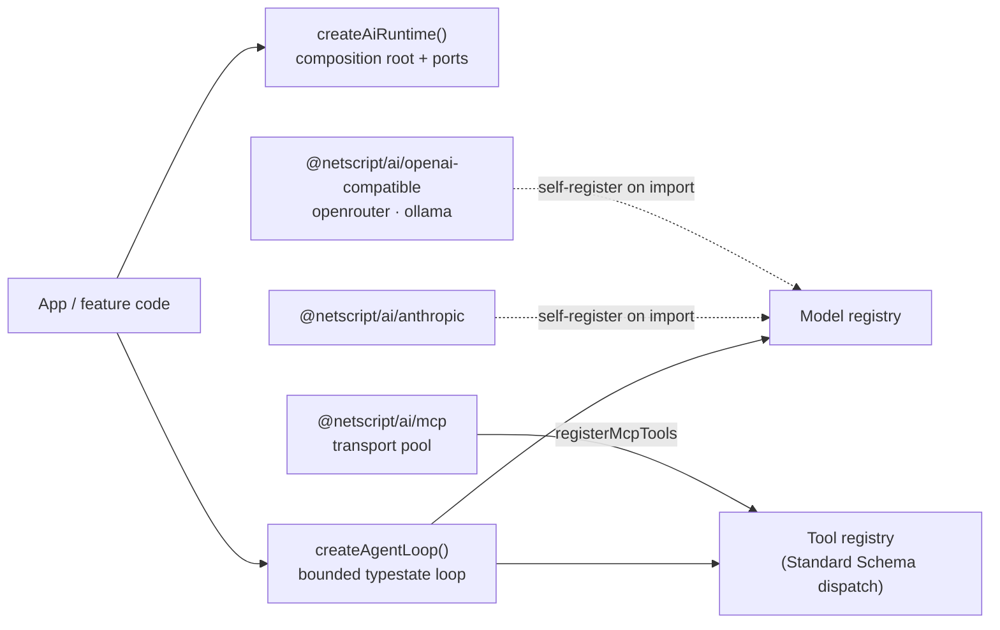

# @netscript/ai

[](https://jsr.io/@netscript/ai)
[](https://github.com/rickylabs/netscript/actions/workflows/ci.yml)
[](https://rickylabs.github.io/netscript/)

**The zero-dependency AI engine core for NetScript: domain contracts, capability ports, model and
tool registries, a bounded agent loop, an MCP client stack, and a composition root — providers stay
on their own subpaths until imported.**

The base entrypoint ships **no** concrete provider and takes **no** `@netscript/*` runtime
dependency. Providers self-register as an import side effect — exactly like `@netscript/kv/redis`
registers its adapter — so no provider SDK enters your module graph until an app opts in. The tool
system validates input with [Standard Schema](https://standardschema.dev/) (bring zod, valibot,
arktype, or a hand-written schema), the agent loop is a bounded, cancellable typestate machine, and
every capability is a port with a safe default, so an unconfigured runtime is safe to hold and
inspect.

## Why teams use it

- **Bundle isolation, enforced** — `import '@netscript/ai'` pulls zero provider dependencies;
  `@netscript/ai/anthropic` pulls only `@tanstack/ai-anthropic`, `@netscript/ai/openai-compatible`
  only `@tanstack/ai-openai`. A test imports each subpath in a fresh subprocess and asserts the
  registry contains exactly that one provider.
- **Self-registering providers** — Anthropic, OpenAI-compatible (any Chat Completions or Responses
  endpoint), OpenRouter, Ollama, and OpenAI-compatible embeddings and vision, each a subpath that
  registers its factory on import and re-exports the provider class for direct construction.
- **Bounded, cancellable agent loop** — `createAgentLoop` drives multi-turn conversations with a
  `maxSteps` cap, a pluggable history strategy, real summed provider `Usage` (no estimation), and
  `AbortSignal` / `loop.stop()` cancellation that always unwinds cleanly.
- **Owned chat surface** — `createChatClient` returns an owned `ChatClientPort` streaming an owned
  event union (`text` | `tool-call` | `finish` | `error`); no provider-SDK type escapes the public
  surface, and per-call `connection` options support one-turn credential overrides.
- **Standard Schema tool system** — `defineAiTool` + `createToolRegistry` define, register, and
  dispatch server-executable tools with input validated before the handler runs; `renderUiTool`
  ships the generative-UI wire contract consumed by `@netscript/fresh-ui`.
- **MCP client stack** — streamable-HTTP and stdio transports behind owned ports, a multi-server
  transport pool, and `registerMcpTools` to bridge remote MCP tools into the same registry seam the
  agent loop already drives.
- **Agent skills** — `@netscript/ai/skills` validates a small `SKILL.md` standard, matches by tag or
  opt-in embeddings, and loads full instruction bodies only on demand.
- **Ports with safe defaults** — telemetry defaults to a no-op; capabilities that need a real
  adapter throw a typed `AiNotConfiguredError` until injected.

## Architecture



The core owns contracts, registries, and the loop; providers and the MCP stack live on subpaths and
enter the module graph only when imported. Real adapters — such as the `@netscript/telemetry`-backed
`TelemetryPort` — are injected through the composition root; the core never imports them.

## Install

```bash
deno add jsr:@netscript/ai@<version>
```

Pin `<version>` to match your installed CLI; bare `jsr:@netscript/*` specifiers do not resolve on
the pre-release line.

## Quick example

```typescript
import { createAiRuntime } from '@netscript/ai';
import { createToolRegistry, defineAiTool } from '@netscript/ai/tools';
import { z } from 'jsr:@zod/zod@4';

// An unconfigured runtime is safe to hold: every capability defaults to a
// no-op or throwing port until a real adapter is injected.
const ai = createAiRuntime();
ai.telemetry.recordEvent('agent.start');

// Define a server-executable tool; input is validated with Standard Schema
// (zod here — any conforming library works).
const add = defineAiTool('add')
  .describe('Add two numbers')
  .parameters({
    type: 'object',
    properties: { a: { type: 'number' }, b: { type: 'number' } },
    required: ['a', 'b'],
  })
  .input(z.object({ a: z.number(), b: z.number() }))
  .server(({ a, b }) => ({ sum: a + b }));

const registry = createToolRegistry([add]);

// Dispatch validates input BEFORE the handler runs.
const { output } = await registry.dispatch('add', { a: 2, b: 3 });
console.log(output); // { sum: 5 }
```

Invalid input throws `ToolInputValidationError`; an unknown tool name throws `ToolNotFoundError` —
the handler never sees either.

## Providers and the model registry

Import a provider subpath for its side effect, then resolve models through the registry:

```typescript
import '@netscript/ai/anthropic'; // side effect: registers 'anthropic'
import { getModel, getModelProvider } from '@netscript/ai';

// Resolve a model handle through the registry.
const handle = await getModel('anthropic:claude-sonnet-4-5');

// Or construct a configured provider (apiKey falls back to ANTHROPIC_API_KEY).
const provider = getModelProvider('anthropic', { apiKey: Deno.env.get('ANTHROPIC_API_KEY') });
const client = provider.createChatClient?.('claude-sonnet-4-5');
```

The OpenAI-compatible provider reaches any endpoint that speaks the OpenAI Chat Completions or
Responses API — point `baseURL` at DeepSeek, Together, vLLM, or a local gateway; with no `models`
configured the remote endpoint is the authority on its own catalog. Streaming is cancelled by
passing an `AbortSignal`, and per-call `connection` options override credentials and endpoints for
one turn without touching provider defaults. Configuration errors identify missing field names but
never include key or endpoint values.

## Agent loop

```typescript
import { createAgentLoop, slidingWindowHistory } from '@netscript/ai/agent';
import type { ChatModelProviderPort, ToolRegistryPort } from '@netscript/ai/agent';
import type { Message } from '@netscript/ai/contracts';

declare const modelProvider: ChatModelProviderPort;
declare const tools: ToolRegistryPort;
declare const messages: Message[];

const loop = createAgentLoop({
  modelProvider,
  tools,
  history: slidingWindowHistory({ maxMessages: 12 }),
});

const abort = new AbortController();
for await (
  const chunk of loop.run(
    { model: 'anthropic:claude-sonnet-4-5', messages },
    { signal: abort.signal, maxSteps: 8 },
  )
) {
  if (chunk.type === 'text') Deno.stdout.writeSync(new TextEncoder().encode(chunk.delta));
  if (chunk.type === 'tool-result') console.log('tool ->', chunk.result.content);
  if (chunk.type === 'done') console.log('usage', chunk.usage); // real, summed provider usage
}
```

The loop is a typestate machine
(`idle → running → awaiting-tool → running → done | aborted |
errored`, exposed as `loop.state`).
Exceeding `maxSteps` emits an `error` chunk carrying `AgentMaxStepsExceededError`; a missing tool
handler yields an `error`-state `ToolResult` rather than throwing; on abort the generator always
returns — nothing leaks. An injected `TelemetryPort` turns each run into a `gen_ai.chat` span with
per-turn spans and tool-call events.

## MCP client stack

```typescript
import { createMcpTransportPool, registerMcpTools } from '@netscript/ai/mcp';
import { createToolRegistry } from '@netscript/ai/tools';

const pool = createMcpTransportPool({
  servers: [{
    kind: 'streamable-http',
    serverId: 'search',
    url: 'https://mcp.example.com',
    auth: { mode: 'api-token', token: 'injected-at-runtime', scheme: 'Bearer' },
  }],
});

const registry = createToolRegistry();
await registerMcpTools(registry, pool);
```

Remote MCP tools land in the same `ToolRegistryPort` seam as local ones, so the agent loop calls
them identically. Pooled tool results surface embedded `ui://` resources as `uiResources` — the
payload the `@netscript/fresh-ui` MCP widget renders.

## Public surface

| Entry                 | What it gives you                                                                                 |
| --------------------- | ------------------------------------------------------------------------------------------------- |
| `.`                   | `createAiRuntime` / `getAiRuntime`, model + embeddings + vision registries, `composeSystemPrompt` |
| `./contracts`         | Domain types (`Message`, `ToolDescriptor`, `Usage`, …) and the typed error hierarchy              |
| `./ports`             | Capability seams (`TelemetryPort`, `AgentMemoryPort`, `McpTransportPort`, …) with safe defaults   |
| `./tools`             | `defineAiTool`, `createToolRegistry`, the `renderUiTool` wire contract                            |
| `./agent`             | `createAgentLoop`, `slidingWindowHistory`, the loop's port seams                                  |
| `./skills`            | `SKILL.md` loader: metadata-only discovery, tag/embedding matching, on-demand load                |
| `./mcp`               | MCP transports, transport pool, `ui://` resource extraction, tool bridging                        |
| `./testing`           | Deterministic fake ports for downstream unit tests                                                |
| `./anthropic`         | Self-registering Anthropic provider (wraps `@tanstack/ai-anthropic`)                              |
| `./openai-compatible` | Self-registering OpenAI-compatible chat + vision provider                                         |
| `./openrouter`        | Self-registering OpenRouter provider + reasoning-model options                                    |
| `./ollama`            | Self-registering Ollama provider with injectable reachability port                                |
| `./openai-embeddings` | Self-registering OpenAI-compatible embeddings provider                                            |

The always-current symbol list is
[`deno doc jsr:@netscript/ai@<version>`](https://jsr.io/@netscript/ai/doc) (pin `<version>` on the
pre-release line, as above).

## Docs

- **Reference — runtime, registries, loop, tools, and MCP APIs**:
  [rickylabs.github.io/netscript/reference/ai/](https://rickylabs.github.io/netscript/reference/ai/)
- **AI overview — how the engine, chat UI, and plugin fit together**:
  [rickylabs.github.io/netscript/ai/](https://rickylabs.github.io/netscript/ai/)
- **AI engine — composition, providers, and the agent loop in depth**:
  [rickylabs.github.io/netscript/ai/engine/](https://rickylabs.github.io/netscript/ai/engine/)
- **API docs on JSR**: [jsr.io/@netscript/ai/doc](https://jsr.io/@netscript/ai/doc)

## Compatibility

The core is runtime-neutral TypeScript with no permissions of its own. Provider subpaths wrap the
TanStack AI clients, perform network access (`--allow-net` under Deno), and read their API keys from
the environment when not passed explicitly (`--allow-env`). The real telemetry adapter lives in
`@netscript/telemetry/ai` and is injected as a `TelemetryPort` — this core never imports it.

## License

Apache-2.0 — see [LICENSE](https://github.com/rickylabs/netscript/blob/main/LICENSE). Published to
JSR with cryptographically verified provenance.
