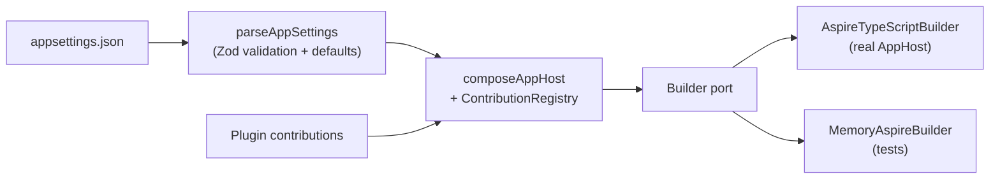

# @netscript/aspire

[](https://jsr.io/@netscript/aspire)
[](https://github.com/rickylabs/netscript/actions/workflows/ci.yml)
[](https://rickylabs.github.io/netscript/)

**SDK-neutral Aspire diagnostics, `appsettings.json` parsing, and AppHost composition ports for
NetScript. It turns plain config data into validated resource graphs without leaking any Aspire SDK
type into your signatures.**

Orchestrating a polyglot workspace with .NET Aspire usually means writing against the Aspire SDK
directly — and then every plugin, test, and diagnostic tool inherits that dependency. This package
inverts the relationship: every function takes plain data and returns plain data. Config is parsed
and validated with Zod schemas, resource graphs are composed through a builder port, and the Aspire
SDK appears only behind an adapter at the very edge.

That contract is what lets NetScript plugins contribute Aspire resources, workspaces validate their
config before start, and composition logic run under test with an in-memory builder — all without a
.NET toolchain in the loop.

## Why teams use it

- **SDK-neutral by contract** — no Aspire SDK type appears in any public signature, so diagnostics
  and composition stay portable and testable.
- **Validated config parsing** — `parseAppSettings` reads `appsettings.json`, validates it against
  the Zod schemas on `./config`, resolves key-dependent defaults, and reports cross-reference issues
  as warnings instead of crashes.
- **AppHost composition ports** — `./application` exposes `composeAppHost`, the
  `ContributionRegistry`, deterministic port allocation, and resolver helpers that turn config
  entries into Aspire resources.
- **Pluggable builder adapter** — `./adapters` provides the `AspireTypeScriptBuilder` port that
  emits AppHost resources, plus environment-source resolution.
- **First-class test surface** — `./testing` ships `MemoryAspireBuilder`, an example contribution,
  and deterministic fixtures for plugin authors writing composition tests.
- **Flexible cache provisioning** — one shared cache entry provisions Redis, Garnet, or Deno KV as a
  container, a local executable, or an external connection, with an opt-in `Auto` mode that probes
  for Docker at start time.

## Architecture



## Install

```bash
deno add jsr:@netscript/aspire@<version>
```

Pin `<version>` to match your installed CLI; bare `jsr:@netscript/*` specifiers do not resolve on
the pre-release line. Scaffolded NetScript workspaces already carry the pinned entry.

## Quick example

From the root of a scaffolded NetScript workspace (where `appsettings.json` lives and the TypeScript
AppHost sits under `aspire/`), validate the config before composition:

```typescript
import { parseAppSettings } from '@netscript/aspire/config';

const { config, warnings } = await parseAppSettings('appsettings.json');

console.log(config.Name); // "my-app"
for (const warning of warnings) console.warn(warning);
```

Inspect an AppHost target and render a JSON-stable diagnostic report:

```typescript
import { inspectAspire } from '@netscript/aspire';

const report = inspectAspire('./aspire');
console.log(report.summary);
```

## Shared cache provisioning

A NetScript workspace provisions **one shared cache** for KV-backed queues, session stores, and rate
limiters. The `CacheEntry` config picks a backend with two axes — **`Engine`** (what speaks the
protocol) and **`Mode`** (how it is hosted) — and the generated AppHost injects the connection
environment into every consumer that declares `RequiresKv`.

Each engine supports a specific set of modes:

| Engine   | Modes                                         | Provisioned as                                                                                   | Wire protocol                |
| -------- | --------------------------------------------- | ------------------------------------------------------------------------------------------------ | ---------------------------- |
| `Redis`  | `Container`, `External`, `Auto`               | `redis:7` container (tcp:6379), or a connection string you supply                                | Redis                        |
| `Garnet` | `Container`, `Executable`, `External`, `Auto` | Garnet container (tcp:6379), `dotnet tool run garnet-server` (no Docker), or a connection string | Redis                        |
| `DenoKv` | `Local`, `Container`, `Auto`                  | In-process `Deno.openKv()` (no resource), or a `ghcr.io/denoland/denokv` container (http:4512)   | Deno KV (embedded / Connect) |

Two defaults exist, and they differ: a hand-written `CacheEntry` that omits fields validates to the
schema default `Engine: 'Garnet', Mode: 'Container'`, while `netscript init` scaffolds a workspace
with `Engine: 'Redis', Mode: 'Container'`. `Auto` is opt-in: it defers the hosting choice to AppHost
start, where a Docker probe picks the container arm when Docker is present and falls back to the
Garnet dotnet-tool executable otherwise — Redis and Garnet arms all speak the Redis wire protocol,
so the selection is transparent to consumers. Set `NETSCRIPT_CACHE_MODE` to `Container` or
`Executable` in the AppHost environment to override the probe.

## API at a glance

| Entry           | What it gives you                                                                 |
| --------------- | --------------------------------------------------------------------------------- |
| `.`             | `inspectAspire` — the diagnostic contract                                         |
| `./config`      | `parseAppSettings` and the `NetScriptConfigSchema` Zod schema family              |
| `./schema`      | `generateAppSettingsJsonSchema` — JSON Schema for editor validation               |
| `./types`       | The plain-data type vocabulary shared by all subpaths                             |
| `./constants`   | `CONFIG_KEYS`, `OTEL_DEFAULTS`, `DEFAULT_PERMISSIONS`, and friends                |
| `./application` | `composeAppHost`, `ContributionRegistry`, `createPortAllocator`, resolvers        |
| `./adapters`    | `AspireTypeScriptBuilder`, `resolveEnvSource`                                     |
| `./testing`     | `MemoryAspireBuilder`, `ExampleAspireContribution`, contribution-context fixtures |
| `./public`      | The whole surface re-exported from one entry                                      |

The always-current symbol list is
[`deno doc jsr:@netscript/aspire@<version>`](https://jsr.io/@netscript/aspire/doc).

## Docs

- **Orchestration & runtime — Aspire in the NetScript workspace**:
  [rickylabs.github.io/netscript/orchestration-runtime/](https://rickylabs.github.io/netscript/orchestration-runtime/)
- **Reference**:
  [rickylabs.github.io/netscript/reference/aspire/](https://rickylabs.github.io/netscript/reference/aspire/)
- **How-to — deploy locally with Aspire**:
  [rickylabs.github.io/netscript/how-to/deploy-local-aspire/](https://rickylabs.github.io/netscript/how-to/deploy-local-aspire/)
- **API docs on JSR**: [jsr.io/@netscript/aspire/doc](https://jsr.io/@netscript/aspire/doc)

## Compatibility

Runs on Deno 2.x with no .NET dependency of its own — the package handles plain data; running the
composed AppHost requires the .NET SDK and the Aspire CLI, and the Deno KV cache arms need
`--unstable-kv` on the consuming process.

## License

Apache-2.0 — see [LICENSE](https://github.com/rickylabs/netscript/blob/main/LICENSE). Published to
JSR with cryptographically verified provenance.
