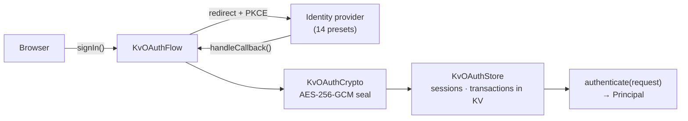

# @netscript/auth-kv-oauth

[](https://jsr.io/@netscript/auth-kv-oauth)
[](https://github.com/rickylabs/netscript/actions/workflows/ci.yml)
[](https://rickylabs.github.io/netscript/)

**A KV-backed OAuth2/OIDC relying-party backend for NetScript: PKCE flows, AES-256-GCM-encrypted
token storage, and first-class presets for fourteen identity providers — no auth database
required.**

Adding "Sign in with Google" should not require standing up an identity database. This package runs
the whole relying-party side over `@netscript/kv`: `createKvOAuthBackend` returns a complete
NetScript auth backend whose sessions and OAuth transactions live in KV with typed key tuples, TTLs,
and atomic compare-and-swap — plus the interactive `signIn` / `handleCallback` / `signOut`
primitives your HTTP layer mounts. Every flow is authorization-code with PKCE S256 and exact state
validation via [`@panva/oauth4webapi`](https://jsr.io/@panva/oauth4webapi); OIDC providers add nonce
and ID-token validation on top. Token sets are sealed with AES-256-GCM before they touch KV —
plaintext tokens are never written.

## Why teams use it

- **Complete backend port** — `createKvOAuthBackend()` returns the full `AuthBackendPort` — `name`,
  `providers`, `sessions`, `crypto`, `principalMapper`, and `authenticate` — plus the interactive
  `signIn`, `handleCallback`, `signOut`, and `getSessionId` flow primitives.
- **Fourteen provider presets** — the `providers` collection ships GitHub, Google, GitLab, Discord,
  Slack, Spotify, Facebook, Twitter, Auth0, Okta, AWS Cognito, Azure AD, Logto, and Clerk;
  `defineOAuthProvider()` builds any generic OAuth or OIDC provider.
- **KV-backed sessions** — `createKvOAuthStore()` persists transactions and sessions in
  `@netscript/kv` `WatchableKv` using typed key tuples, TTLs, and atomic CAS for refresh-on-read
  rotation.
- **Encrypted token storage** — `createKvOAuthCrypto()` seals token sets with AES-256-GCM and
  prefixes sealed values with a key id, enabling key rotation; token plaintext is never written to
  KV.
- **PKCE and OIDC by default** — every flow uses authorization-code with PKCE S256 and exact state
  validation; OIDC providers add nonce and ID-token validation.

## Architecture



## Install

```bash
deno add jsr:@netscript/auth-kv-oauth@<version>
```

Pin `<version>` to match your installed CLI; bare `jsr:@netscript/*` specifiers do not resolve on
the pre-release line.

## Quick example

Prerequisites: an OAuth app registered with your provider (client id and secret in the environment)
and a KV backend available to `@netscript/kv`.

```typescript
import {
  type AuthnRequest,
  createKvOAuthBackend,
  getRequiredEnv,
  providers,
} from '@netscript/auth-kv-oauth';

const backend = await createKvOAuthBackend({
  provider: providers.google({
    clientId: getRequiredEnv('GOOGLE_CLIENT_ID'),
    clientSecret: getRequiredEnv('GOOGLE_CLIENT_SECRET'),
    redirectUri: 'https://app.example.com/auth/callback',
  }),
});

// `backend` satisfies AuthBackendPort: request authentication plus
// signIn / handleCallback / signOut redirect primitives for a host HTTP layer.
declare const request: AuthnRequest; // the incoming request, framework-adapted
const result = await backend.authenticate(request);
```

## Public surface

| Entry                   | What it gives you                                                                        |
| ----------------------- | ---------------------------------------------------------------------------------------- |
| `.`                     | `createKvOAuthBackend`, the `providers` presets, `defineOAuthProvider`, `getRequiredEnv` |
| `./providers`           | Provider preset factories and provider config types                                      |
| `./store`               | `createKvOAuthStore` — sessions and transactions over `WatchableKv`                      |
| `./crypto`              | `createKvOAuthCrypto` — AES-256-GCM token sealing with key ids                           |
| `./flow`                | `createKvOAuthFlow` — the interactive signIn/callback/signOut primitives                 |
| `./cookies`             | Cookie header helpers (`buildCookieHeader`, `parseCookieHeader`, …)                      |
| `./backend`, `./errors` | Backend composition and the `KvOAuthError` taxonomy                                      |

The always-current symbol list is
[`deno doc jsr:@netscript/auth-kv-oauth@<version>`](https://jsr.io/@netscript/auth-kv-oauth/doc)
(pin `<version>` on the pre-release line, as above).

## Docs

- **Reference — backend options, presets, and exports**:
  [rickylabs.github.io/netscript/reference/auth-kv-oauth/](https://rickylabs.github.io/netscript/reference/auth-kv-oauth/)
- **Identity & Access — how NetScript authentication fits together**:
  [rickylabs.github.io/netscript/identity-access/](https://rickylabs.github.io/netscript/identity-access/)
- **How-to: add authentication**:
  [rickylabs.github.io/netscript/how-to/add-authentication/](https://rickylabs.github.io/netscript/how-to/add-authentication/)
- **API docs on JSR**:
  [jsr.io/@netscript/auth-kv-oauth/doc](https://jsr.io/@netscript/auth-kv-oauth/doc)

## Compatibility

Designed for Deno. Needs `--allow-net` (provider endpoints), `--allow-env` (credentials), and the KV
backend's requirements from `@netscript/kv` (`--unstable-kv` for Deno KV). Sealing uses the Web
Crypto API — no native dependencies.

## License

Apache-2.0 — see [LICENSE](https://github.com/rickylabs/netscript/blob/main/LICENSE). Published to
JSR with cryptographically verified provenance.
