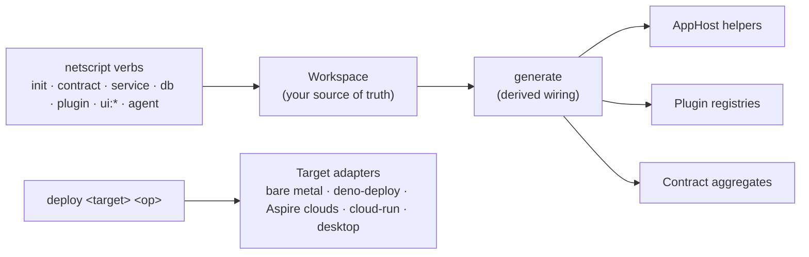

# @netscript/cli

[](https://jsr.io/@netscript/cli)
[](https://github.com/rickylabs/netscript/actions/workflows/ci.yml)
[](https://rickylabs.github.io/netscript/)

**The NetScript command surface: scaffold a workspace, then grow it — contracts, services,
databases, plugins, Fresh UI, deployment — with verbs that regenerate the derived wiring for you.**

Most scaffolds hand you a starting point and walk away; from then on, every added service or plugin
means hand-editing orchestration files. The `netscript` binary works the other way around. `init`
lays down a complete, running backend workspace — contracts, an example oRPC service, a
Prisma-backed database, the Fresh app, and the Aspire orchestration host — and every later verb
that changes the workspace's shape regenerates what is derived from it: the AppHost helpers, the
plugin registries, the contract version aggregates. You never hand-maintain the wiring.

The same command tree is also a library: mount the full public surface inside your own binary while
NetScript owns the verbs and you own the process boundary.

## Why it stands out

- **Scaffold-and-grow, not scaffold-and-diverge** — `init` writes the workspace, and every later
  verb keeps the derived wiring in sync; the generated project is meant to be re-generated, not
  forked.
- **See the blast radius first** — `netscript init my-app --dry-run` prints every file it would
  write (183 files for a full postgres + service workspace) without touching the disk.
- **Embeddable command tree** — `createPublicCli(host)` returns the full public surface against a
  host port, so your binary owns argv, exit codes, and permissions while NetScript owns the verbs.
- **Plugin verbs by dispatch** — `dispatchPluginVerb` routes the framework-owned verbs (`install`,
  `sync`, `doctor`, …) into a plugin's own published CLI, so a plugin implements its verbs once and
  inherits the command surface.
- **Deterministic testing surface** — `./testing` supplies in-memory filesystem, process, prompt,
  and logger ports plus fixture builders, so CLI and scaffold flows are tested without disk or
  subprocesses.
- **Agent tooling in one command** — `netscript agent init` installs the MCP server configuration
  and the matching skills into Claude Code and VS Code.
- **Native desktop packaging** — `deploy desktop package` builds Deno Desktop installers per OS,
  and `deploy desktop release prepare`/`serve` sign and host native update manifests and patches.

## Architecture



## Install

```bash
deno install --global --allow-all --name netscript jsr:@netscript/cli@<version>
```

Or as a library, for the embeddable command tree:

```bash
deno add jsr:@netscript/cli@<version>
```

Pin `<version>` (for example `0.0.1-beta.10`): bare `jsr:@netscript/*` specifiers do not resolve on
the pre-release line.

## Quick example

One command lays down a complete, running backend workspace:

```bash
netscript init my-app --db postgres --service --yes
cd my-app

netscript db migrate                            # evolve the schema
netscript service add --name orders             # add another service + its v1 contract
netscript plugin install worker --name workers  # durable background processing
```

Prefer to see the plan first? `--dry-run` prints it and writes nothing:

```console
$ netscript init my-app --db postgres --service --yes --dry-run
   ✓ Project root (deno.json, netscript.config.ts, .gitignore, README.md)
   ✓ Aspire orchestration (TypeScript AppHost, .helpers/, package.json)
   ✓ Database workspace (postgres)
   ✓ Frontend app "dashboard" (Fresh framework)
   ✓ Contracts (v1 with users stub)
   ✓ Example service "users" (oRPC handler on port 3000)
   ✓ Plugins (empty registry)
  [dry-run] Would create 183 files, 44 directories
```

## Command map

| Group         | What it owns                                                                                                                            |
| ------------- | --------------------------------------------------------------------------------------------------------------------------------------- |
| `init`        | Scaffold a new workspace (`--db`, `--service`, `--no-aspire`, `--dry-run`).                                                             |
| `contract`    | `add`, `add-route`, `version`, `inspect`, `list`, `remove` — the typed oRPC contract surface.                                           |
| `service`     | `add`, `add-handler`, `ref`, `set`, `list`, `remove`, `generate` — service workspaces and their orchestration registration.             |
| `db`          | `add`, `init`, `migrate`, `generate`, `seed`, `status`, `studio`, `introspect`, `reset`, `deploy` — Prisma lifecycle.                   |
| `plugin`      | `new`, `scaffold`, `install`, `remove`, `sync`, `update`, `doctor`, `list`, `info`, `ai`, `auth` — first- and third-party plugins.      |
| `ui:*`        | `ui:init`, `ui:add`, `ui:list`, `ui:update`, `ui:remove` — the Fresh UI registry (pages, islands, collections).                         |
| `generate`    | `aspire`, `plugins`, `runtime-schemas` — regenerate derived artifacts on demand.                                                        |
| `config`      | `inspect`, `get`, `set`, `override`, `runtime` — resolved configuration and runtime overrides.                                          |
| `agent`       | `init`, `mcp` — install and run the agent tooling.                                                                                      |
| `deploy`      | Bare-metal, Deno Deploy, Kubernetes, Azure, Cloud Run, and native desktop targets (see below).                                          |
| `marketplace` | `search`, `publish` — plugin discovery and distribution.                                                                                |

`netscript <group> --help` prints the live tree for any group; it is generated from the same
command definitions this package exports, so it never drifts from the binary you installed.

## Agent tooling

NetScript's agentic surface is one triple: the **CLI** is the hands, the **skills** are the
playbook, and **MCP** is the eyes. Install all three into a project root:

```bash
netscript agent init
```

Claude Code receives `.mcp.json`, the NetScript skill bundle, and a marked section in `AGENTS.md`;
VS Code receives `.vscode/mcp.json`. Hosts are auto-detected, or select them with
`--host claude|vscode|all`. The installed server entry runs `netscript agent mcp`
([`@netscript/mcp`](https://jsr.io/@netscript/mcp)); its data boundary covers telemetry, project
metadata, generated registries, and public docs — never project source, environment values,
credentials, or secrets.

## Deployment

`netscript deploy <target> <op>` is a thin router over target adapters implementing the canonical
`plan` / `emit` / `up` / `down` / `status` / `logs` operations; a target never advertises a verb it
cannot honour.

| Target                                                      | Mechanism                                                                                                                        |
| ----------------------------------------------------------- | --------------------------------------------------------------------------------------------------------------------------------- |
| **bare metal**                                              | `deno compile` → single binary managed as an OS service: Servy on Windows, systemd on Linux.                                     |
| `deno-deploy`                                               | `deno deploy [--prod]`, with a guard that refuses a `--prod` push when the project uses APIs Deno Deploy rejects.                |
| `kubernetes`, `azure-aca`, `azure-app-service`, `azure-aks` | Validates the generated AppHost declares the matching hosting integration, then delegates to `aspire publish` / `deploy`.        |
| `cloud-run`                                                 | Docker-image lane: `docker build` → `docker push` → `gcloud run deploy`.                                                          |
| `desktop`                                                   | `package` builds native Deno Desktop installers; `release prepare`/`serve` sign and host native updates (see below).             |

Cloud authentication and RBAC stay operator-owned: NetScript mints no credentials and hand-authors
no Helm, Bicep, or Kubernetes manifests. Compiled binaries are unsigned — signing is a deliberate
manual hook between `deploy build` and `deploy install`.

### Native desktop packaging

An enabled app with `Type: "desktop"` in the workspace config packages through its configured task
hook:

```json
{
  "Type": "desktop",
  "Enabled": true,
  "Workdir": "apps/storefront",
  "PackageTaskName": "desktop:package"
}
```

The task owns the desktop entrypoint and permissions; NetScript appends the native Deno flags:

```bash
netscript deploy desktop package --app storefront --all-targets \
  --format app --format appimage --format deb --format rpm --format msi
netscript deploy desktop package --app storefront \
  --target x86_64-unknown-linux-gnu --format appimage --format deb
```

Every invocation uses an explicit target and output path. Omitted formats produce all formats for
the selected OS: `.app`/`.dmg` on macOS, `.AppImage`/`.deb`/`.rpm` on Linux, and `.msi` on Windows.
Runtime compression defaults to `xz`; select `--compression none|lzma|zstd` explicitly when needed
(`zstd` requires the external `zstd` executable). The `.dmg` format requires a macOS host, and an
unfiltered `--all-targets` includes `.dmg` — run that complete matrix on macOS, or use repeatable
`--format` filters elsewhere while still cross-compiling the remaining targets.

Native installers are unsigned at this stage. Platform signing is separate from the Ed25519
update-manifest signature and stays an external CI step between packaging and release preparation:

- **Windows** — Authenticode-sign the `.msi` with `signtool` (SHA-256 timestamp authority), then
  verify on a clean Windows runner.
- **macOS** — codesign the `.app` and nested code with a Developer ID identity, sign or create the
  `.dmg`, notarize with Apple's notary service, and staple/validate the ticket.
- **Linux** — apply your repository/distribution signing policy to `.deb` and `.rpm`; AppImage
  signing is likewise an external release-policy step.

The CLI intentionally accepts no certificate credentials and never invokes those platform tools.

Prepare a native update once CI has retained the current and previous runtime libraries:

```bash
netscript deploy desktop release prepare \
  --channel stable --target linux-x86_64 \
  --version 1.2.0 --sequence 42 \
  --current-runtime dist/1.2.0/libdenort.so \
  --from 1.1.0=dist/1.1.0/libdenort.so \
  --private-key-file .secrets/update-ed25519.pem
```

Preparation needs read access to the runtime libraries and the PKCS#8 Ed25519 private key, write
access to `.deploy/desktop/releases`, and run access to an external bsdiff 4.x-compatible
executable; the key never leaves the authoring process. Each channel/target route keeps private,
strictly monotonic sequence state — a failed final manifest replacement burns that sequence, so
retry with a higher number. Immutable patches are written first, the private high-water second, and
`latest.json` last.

Serve the prepared tree at the same pathname the SDK release base URL composes:

```bash
netscript deploy desktop release serve \
  --release-dir .deploy/desktop/releases \
  --hostname 127.0.0.1 --port 8787 --base-path /application
```

For `baseUrl: "https://releases.example.com/application"`, the native manifest resolves to
`/application/<channel>/<os>-<arch>/latest.json`. Terminate public HTTPS at a trusted reverse
proxy; the built-in listener is transport-neutral and intended for a protected origin. It serves
only GET/HEAD allowlisted manifests, patches, and installers — private high-water files, dot paths,
traversal, encoded separators, and symlink escapes are never served.

Windows native apply remains unsupported upstream, so applications handle the SDK seam's
`applyMode: "manual"` update-ready event and present its trusted `manualUpdateUrl` (this server may
host the installer, but it does not claim automatic Windows replacement):

```ts
import { startAutoUpdate } from '@netscript/sdk/auto-update';

startAutoUpdate({
  release: {
    baseUrl: 'https://releases.example.com/application',
    publicKey: 'base64-ed25519-public-key',
    manualUpdateUrl: 'https://releases.example.com/application/windows-installer',
  },
  policy: { checkOnLaunch: true },
  onUpdateReady(event) {
    if (event.applyMode === 'manual') showInstallerPrompt(event.manualUpdateUrl);
  },
});

declare function showInstallerPrompt(url: string): void;
```

### Deploy permissions

A host binary embedding the deploy surface must grant:

| Permission      | Why                                                                                                     |
| --------------- | ------------------------------------------------------------------------------------------------------- |
| `--allow-run`   | Invoke desktop package tasks, bsdiff/zstd, and deploy tools such as `servy`, Aspire, Docker, or gcloud. |
| `--allow-read`  | Read the workspace config, entrypoints, and release/secret files.                                       |
| `--allow-write` | Emit compiled binaries, native artifacts, private high-water state, release files, and env files.       |
| `--allow-net`   | Listen for release HTTP requests and health-probe activated services.                                   |
| `--allow-sys`   | Resolve the host OS/triple to select the Servy vs. systemd adapter and compile target.                  |
| `--allow-env`   | Read the deploy owner principal for the Windows secret-file ACL; provider CLIs read their auth tokens.  |

## Library surface

| Subpath         | What it gives you                                                                    |
| --------------- | ------------------------------------------------------------------------------------- |
| `.`             | `createPublicCli`, `runPublicCli`, `dispatchPluginVerb`, `createPluginHostLoader`, `scaffoldPluginPackage` |
| `./scaffolding` | The `Scaffolder` template-rendering engine for plugin package scaffolds              |
| `./testing`     | In-memory ports (`createInMemoryFileSystem`, `createInMemoryProcess`, …) + fixture builders |

The always-current symbol list is
[`deno doc jsr:@netscript/cli@<version>`](https://jsr.io/@netscript/cli/doc).

## Docs

- **CLI & scaffold — the full command walkthrough**:
  [rickylabs.github.io/netscript/orchestration-runtime/cli-scaffold/](https://rickylabs.github.io/netscript/orchestration-runtime/cli-scaffold/)
- **Reference**:
  [rickylabs.github.io/netscript/reference/cli/](https://rickylabs.github.io/netscript/reference/cli/)
- **How-to — author a plugin**:
  [rickylabs.github.io/netscript/how-to/author-a-plugin/](https://rickylabs.github.io/netscript/how-to/author-a-plugin/)
- **How-to — deploy**:
  [rickylabs.github.io/netscript/how-to/deploy/](https://rickylabs.github.io/netscript/how-to/deploy/)
- **Agent tooling**:
  [rickylabs.github.io/netscript/capabilities/agent-tooling/](https://rickylabs.github.io/netscript/capabilities/agent-tooling/)

## Compatibility

Requires Deno 2.x; the binary is installed with `--allow-all` because scaffolding, database, and
deployment verbs read and write the workspace, spawn tools (`prisma`, `aspire`, `docker`,
`gcloud`), and probe local services. Generated workspaces additionally use the .NET SDK for the
Aspire orchestration host.

## License

Apache-2.0 — see [LICENSE](https://github.com/rickylabs/netscript/blob/main/LICENSE). Published to
JSR with cryptographically verified provenance.
