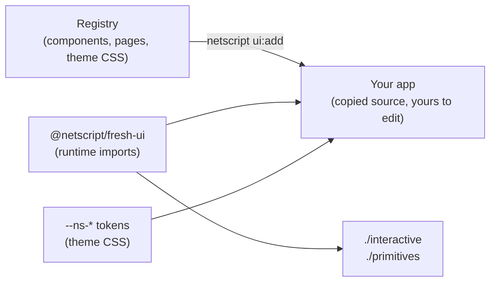

# @netscript/fresh-ui

[](https://jsr.io/@netscript/fresh-ui)
[](https://github.com/rickylabs/netscript/actions/workflows/ci.yml)
[](https://rickylabs.github.io/netscript/)

**The design system for NetScript's Fresh web surface: a copy-source component registry, a semantic
`--ns-*` token vocabulary, and a small package-owned runtime of accessible interactive primitives
and helpers.**

Component libraries force a choice: import a black box you cannot restyle, or copy code that drifts
the moment it lands. This package splits the difference. Components, pages, and theme CSS live in a
registry that the NetScript CLI copies **into your app** — from that point the code is yours to own
and evolve — while the genuinely shared parts (class merging, toast plumbing, icons, accessible
interaction state machines) stay in the package and update with it.

Everything copied and everything imported speaks one visual language: a theme-driven `--ns-*`
custom-property vocabulary that keeps components and themes decoupled. Restyle the app by swapping
tokens; the components never know.

## Why it stands out

- **Copy-source registry** — `netscript ui:init` installs the foundation, `netscript ui:add <item>`
  copies themed components, pages, and collections into your app; once copied, the code is yours.
- **Semantic token vocabulary** — registry CSS targets `--ns-*` custom properties, so themes and
  components stay decoupled and a token swap restyles the whole surface.
- **Accessible interactive primitives** — `Accordion`, `Combobox`, `Dialog`, `Drawer`, `Popover`,
  `Sheet`, `Tabs`, and `Tooltip` compound namespaces emit `data-part`, `data-state`, and ARIA
  attributes for styleable, accessible behavior.
- **Runtime helpers** — `cn` for class merging and the redirect-flash `withToast` / `getToast` /
  `stripToastFromUrl` cycle for carrying notifications across server redirects.
- **Generative-UI renderer** — `./ai/render-ui` safely renders AI `render_ui` tool payloads through
  a curated block whitelist, a recursion depth guard, and named fallbacks instead of throws.
- **AI surface collection** — `netscript ui:add ai` installs the chat seams: message thread,
  composer, model picker, tool-call disclosure, and the widget island that renders MCP `ui://`
  resources.

## Architecture



## Install

```bash
deno add jsr:@netscript/fresh-ui@<version>
```

Pin `<version>` (for example `0.0.1-beta.10`): bare `jsr:@netscript/*` specifiers do not resolve on
the pre-release line. In a scaffolded NetScript workspace, `netscript ui:init` wires the pinned
entry and the theme foundation for you.

## Quick example

The runtime helpers work anywhere Preact renders:

```typescript
import { cn, getToast, stripToastFromUrl, withToast } from '@netscript/fresh-ui';

// Merge class names safely (clsx + tailwind-merge semantics).
const buttonClass = cn('ns-button', 'ns-button--primary');

// Carry a redirect-flash toast across a server redirect.
const redirectTo = withToast('/dashboard/deployments', {
  type: 'success',
  title: 'Deployment queued',
  message: 'api-gateway will roll out to three regions.',
});

// Read the toast back on the destination route, then clean the URL.
const url = new URL(`https://app.example${redirectTo}`);
const toast = getToast(url); // RegistryToast | undefined
const cleanPath = stripToastFromUrl(url); // '/dashboard/deployments'
```

Typed components come from the root entrypoint; stateful interactive components live on
`./interactive`, and headless layout primitives on `./primitives`:

```tsx
import { DataGrid } from '@netscript/fresh-ui';
import { Dialog } from '@netscript/fresh-ui/interactive';
import { Icon, Show, VisuallyHidden } from '@netscript/fresh-ui/primitives';

type Session = { name: string; tokens: number; status: string };

<DataGrid<Session>
  label='Recent sessions'
  columns={[
    { key: 'name', header: 'Session', cell: 'strong' },
    { key: 'tokens', header: 'Tokens', width: '8rem', cell: 'num' },
    { key: 'status', header: 'Status', render: (row) => <span>{row.status}</span> },
  ]}
  rows={[
    { id: 'vs3', data: { name: 'VS3', tokens: 18420, status: 'active' }, href: '/sessions/vs3' },
  ]}
/>;
```

## API at a glance

| Entry            | What it gives you                                                                  |
| ---------------- | ---------------------------------------------------------------------------------- |
| `.`              | `cn`, `withToast` / `getToast` / `stripToastFromUrl`, `DataGrid`, `Icon`           |
| `./interactive`  | `Accordion`, `Combobox`, `Dialog`, `Drawer`, `Popover`, `Sheet`, `Tabs`, `Tooltip` |
| `./primitives`   | `Icon`, `Show`, `SrOnly`, `VisuallyHidden` — headless platform primitives          |
| `./ai/render-ui` | `RenderUiSurface`, `renderUiPayload` — the safe generative-UI renderer             |
| `./registry`     | The registry manifest and content map the CLI copies from                          |

The always-current symbol list is
[`deno doc jsr:@netscript/fresh-ui@<version>`](https://jsr.io/@netscript/fresh-ui/doc).

## Docs

- **Web layer — the design system in context**:
  [rickylabs.github.io/netscript/web-layer/](https://rickylabs.github.io/netscript/web-layer/)
- **Reference**:
  [rickylabs.github.io/netscript/reference/fresh-ui/](https://rickylabs.github.io/netscript/reference/fresh-ui/)
- **How-to — customize Fresh UI**:
  [rickylabs.github.io/netscript/how-to/customize-fresh-ui/](https://rickylabs.github.io/netscript/how-to/customize-fresh-ui/)
- **API docs on JSR**: [jsr.io/@netscript/fresh-ui/doc](https://jsr.io/@netscript/fresh-ui/doc)

## Compatibility

Runs on Deno 2.x with Preact; the runtime helpers are pure functions and render in any modern
browser. Registry copy commands (`netscript ui:*`) require the NetScript CLI.

## License

Apache-2.0 — see [LICENSE](https://github.com/rickylabs/netscript/blob/main/LICENSE). Published to
JSR with cryptographically verified provenance.
