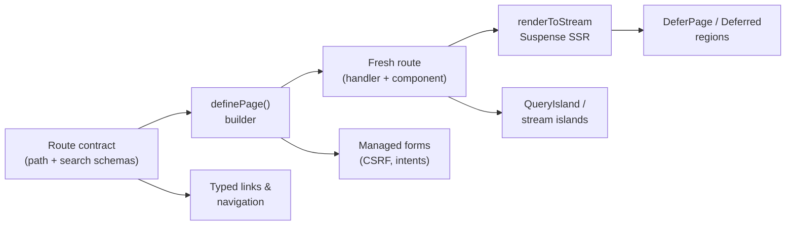

# @netscript/fresh

[](https://jsr.io/@netscript/fresh)
[](https://github.com/rickylabs/netscript/actions/workflows/ci.yml)
[](https://rickylabs.github.io/netscript/)

**The Fresh 2 web layer for NetScript: typed route contracts, fluent page builders, managed forms,
query and durable-stream islands, and deferred streaming SSR — exposed as focused subpath imports.**

Fresh gives you file-based routes and islands; this package gives those routes a type system. You
declare what a page needs — its path and search params, its metadata, its form handlers, its data
layers — and `definePage()` composes all of it into a Fresh route where every piece is checked
against the route's contract. Links, redirects, and navigation helpers are derived from the same
contract, so a renamed param or a changed path breaks the build, not production.

The rest of the surface covers what a real app hits next: progressively enhanced server-validated
forms, TanStack Query islands hydrated from server caches, live queries over durable streams,
Suspense-powered streaming SSR with deferred regions, and an error vocabulary shared between server
handlers and client displays. Each capability lives on its own subpath, so a page that never streams
never imports the streaming runtime.

## Why it stands out

- **Typed route contracts** — `defineRouteContract`, `paginationSearchSchema`, and
  `bindRoutePattern` give path and search params one typed source consumed by pages, links, and
  navigation helpers alike.
- **Fluent page builders** — `definePage()` and `definePartial()` compose route, metadata, handlers,
  data layers, and forms into a Fresh route through a chainable, fully inferred builder.
- **Codegen-owned route bindings** — with the NetScript Vite plugin enabled, the binding between a
  page module and its route pattern is generated from the file's path under `routes/`; you author
  only the contract body.
- **Managed forms** — the `Form` component plus `createStandardSchemaAdapter`, CSRF helpers, and
  intent encoding deliver progressively enhanced, server-validated forms over any Standard Schema.
- **Query and stream islands** — `QueryIsland` with TanStack Query hooks and
  `createNetScriptStreamDB` with live-query hooks wire cache-first and durable-stream data into
  client islands.
- **Streaming and defer** — `defineFreshApp` bootstraps the app, `renderToStream` powers Suspense
  SSR, and `DeferPage`/`Deferred` defer page regions under a resolvable freshness policy.
- **Desktop RPC** — `bindDesktopRpcWindow` on `./desktop` binds an existing oRPC router to one Deno
  Desktop window while remaining inert in browser and Aspire processes.

## Architecture



## Install

```bash
deno add jsr:@netscript/fresh@<version>
```

Pin `<version>` (for example `0.0.1-beta.10`): bare `jsr:@netscript/*` specifiers do not resolve on
the pre-release line. Inside a scaffolded NetScript workspace the import map already carries the
correct pinned entry.

## Quick example

With the NetScript Vite plugin enabled, route bindings are generated from the page module's path —
you write only the contract body:

```typescript
import { z } from 'zod';
import { definePage } from '@netscript/fresh/builders';

// routes/orders/[id].tsx — the plugin inserts the route binding for you.
export const ordersDetailPage = definePage()
  .withRouteContract({
    pathSchema: z.object({ id: z.string().min(1) }),
  })
  .withMeta(() => ({ title: 'Order' }))
  .build();
```

Outside the codegen flow — or to see what the generator emits under the hood — bind the contract to
a pattern yourself:

```typescript
import { definePage } from '@netscript/fresh/builders';
import {
  bindRoutePattern,
  defineRouteContract,
  paginationSearchSchema,
} from '@netscript/fresh/route';

const ordersRoute = bindRoutePattern(
  defineRouteContract({
    searchSchema: paginationSearchSchema({
      defaultLimit: 20,
      defaultSort: 'createdAt',
      defaultOrder: 'desc',
    }),
  }),
  '/orders',
);

export const ordersPage = definePage()
  .withRoute(ordersRoute)
  .withMeta(() => ({
    title: 'Orders',
    description: 'Browse the current order queue.',
  }))
  .build();
```

The built page exposes the Fresh route pieces (`page`, `handler`, `route`, `nav`, `hooks`), and the
bound route carries typed `href`, `safeParseSearch`, and a contract-aware `Link` component.

### Desktop RPC composition

Deno Desktop composition roots can bind an existing oRPC router to one native window. Browser and
Aspire processes return an explicit disabled lifecycle without registering a binding:

```typescript
import { bindDesktopRpcWindow } from '@netscript/fresh/desktop';

const desktopRpc = bindDesktopRpcWindow({
  window: desktopWindow,
  router: ordersRouter,
  context: {},
});

// Safe for both active and disabled lifecycles.
await desktopRpc.close();
```

Each call owns isolated per-window transport state and unbinds exactly once during cleanup. Pair it
with `createDesktopServiceClient({ contract })` from `@netscript/sdk/desktop` in the webview; both
sides reuse the same oRPC contract instead of a hand-maintained bindings declaration file.

## Subpaths at a glance

| Subpath         | What it gives you                                                                     |
| --------------- | ------------------------------------------------------------------------------------- |
| `.`             | Cross-cutting page-loader cache helpers (`hasAllCacheEntries`, `minCachedAt`)         |
| `./builders`    | `definePage`, `definePartial`, `defineStatsPartial` — the fluent page builders        |
| `./route`       | `defineRouteContract`, `bindRoutePattern`, `paginationSearchSchema`, route references |
| `./form`        | The `Form` component, Standard Schema adapter, CSRF and intent helpers                |
| `./defer`       | `DeferPage`, `Deferred`, defer policies and decision helpers                          |
| `./query`       | `QueryIsland`, hydration helpers, TanStack Query island hooks                         |
| `./server`      | `defineFreshApp`, `renderToStream`, `createStreamingResponse`                         |
| `./desktop`     | `bindDesktopRpcWindow` — oRPC over one Deno Desktop window, inert elsewhere           |
| `./streams`     | `createNetScriptStreamDB`, `useLiveQuery`, `useLiveSuspenseQuery`                     |
| `./ai`          | Chat connection and stream-proxy helpers for AI-backed pages                          |
| `./interactive` | `usePromise` and promise helpers for interactive islands                              |
| `./vite`        | `createNetScriptVitePlugin` — codegen for routes and bindings                         |
| `./error`       | `ErrorDisplay`, `errorHandler`, typed error classification and extraction             |
| `./testing`     | Mock route contexts and defer policies for page tests                                 |

The always-current symbol list is
[`deno doc jsr:@netscript/fresh@<version>`](https://jsr.io/@netscript/fresh/doc).

## Docs

- **Web layer — pages, forms, islands, streaming**:
  [rickylabs.github.io/netscript/web-layer/](https://rickylabs.github.io/netscript/web-layer/)
- **Reference**:
  [rickylabs.github.io/netscript/reference/fresh/](https://rickylabs.github.io/netscript/reference/fresh/)
- **How-to — build a server-validated form**:
  [rickylabs.github.io/netscript/how-to/build-a-server-validated-form/](https://rickylabs.github.io/netscript/how-to/build-a-server-validated-form/)
- **API docs on JSR**: [jsr.io/@netscript/fresh/doc](https://jsr.io/@netscript/fresh/doc)

## Compatibility

Runs on Deno 2.x with Fresh 2 and Preact; island hooks hydrate in any modern browser. Type-checking
entrypoints should include `--unstable-kv`, since the streaming server helpers expose KV-aware
types.

## License

Apache-2.0 — see [LICENSE](https://github.com/rickylabs/netscript/blob/main/LICENSE). Published to
JSR with cryptographically verified provenance.
