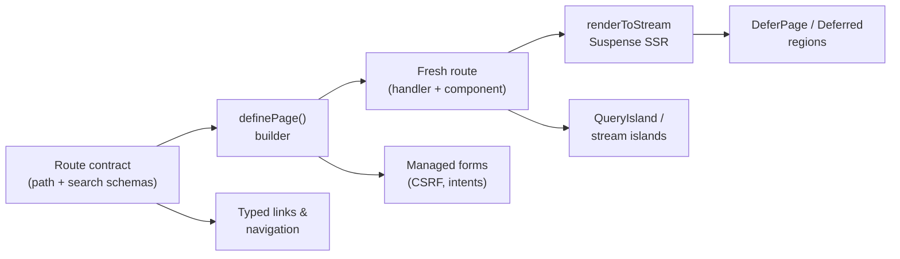

# @netscript/fresh

[](https://jsr.io/@netscript/fresh)
[](https://github.com/rickylabs/netscript/actions/workflows/ci.yml)
[](https://rickylabs.github.io/netscript/)

**The Fresh 2 web layer for NetScript: typed route contracts, fluent page builders, managed forms,
query and durable-stream islands, and deferred streaming SSR — exposed as focused subpath imports.**

Fresh gives you file-based routes and islands; this package gives those routes a type system. You
declare what a page needs — its path and search params, its metadata, its form handlers, its data
layers — and `definePage()` composes all of it into a Fresh route where every piece is checked
against the route's contract. Links, redirects, and navigation helpers are derived from the same
contract, so a renamed param or a changed path breaks the build, not production.

The rest of the surface covers what a real app hits next: progressively enhanced server-validated
forms, TanStack Query islands hydrated from server caches, live queries over durable streams,
Suspense-powered streaming SSR with deferred regions, and an error vocabulary shared between server
handlers and client displays. Each capability lives on its own subpath, so a page that never streams
never imports the streaming runtime.

## Why teams use it

- **Typed route contracts** — `defineRouteContract`, `paginationSearchSchema`, and
  `bindRoutePattern` give path and search params one typed source consumed by pages, links, and
  navigation helpers alike.
- **Fluent page builders** — `definePage()` and `definePartial()` compose route, metadata, handlers,
  data layers, and forms into a Fresh route through a chainable, fully inferred builder.
- **Codegen-owned route bindings** — with the NetScript Vite plugin enabled, the binding between a
  page module and its route pattern is generated from the file's path under `routes/`; you author
  only the contract body.
- **Managed forms** — the `Form` component plus `createStandardSchemaAdapter`, CSRF helpers, and
  intent encoding deliver progressively enhanced, server-validated forms over any Standard Schema.
- **Query and stream islands** — `QueryIsland` with TanStack Query hooks and
  `createNetScriptStreamDB` with live-query hooks wire cache-first and durable-stream data into
  client islands.
- **Streaming and defer** — `defineFreshApp` bootstraps the app, `renderToStream` powers Suspense
  SSR, and `DeferPage`/`Deferred` defer page regions under a resolvable freshness policy.
- **Desktop RPC** — `bindDesktopRpcWindow` on `./desktop` binds an existing oRPC router to one Deno
  Desktop window while remaining inert in browser and Aspire processes.
- **Ordered partial navigation** — `installPartialNavigationCoordinator` drains superseded Fresh
  responses without applying them, while `KeyedPartial` remounts name-changing partial regions.

## Architecture


```mermaid
flowchart LR
    C["Route contract<br/>(path + search schemas)"] --> B["definePage()<br/>builder"]
    B --> R["Fresh route<br/>(handler + component)"]
    C --> L["Typed links &amp;<br/>navigation"]
    B --> F["Managed forms<br/>(CSRF, intents)"]
    R --> S["renderToStream<br/>Suspense SSR"]
    S --> D["DeferPage / Deferred<br/>regions"]
    R --> Q["QueryIsland /<br/>stream islands"]
```

## Install

```bash
deno add jsr:@netscript/fresh@<version>
```

Pin `<version>` to match your installed CLI; bare `jsr:@netscript/*` specifiers do not resolve on
the pre-release line. Inside a scaffolded NetScript workspace the import map already carries the
correct pinned entry.

## Quick example

With the NetScript Vite plugin enabled, route bindings are generated from the page module's path —
you write only the contract body:

```typescript
import { z } from 'zod';
import { definePage } from '@netscript/fresh/builders';

// routes/orders/[id].tsx — the plugin inserts the route binding for you.
export const ordersDetailPage = definePage()
  .withRouteContract({
    pathSchema: z.object({ id: z.string().min(1) }),
  })
  .withMeta(() => ({ title: 'Order' }))
  .build();
```

Outside the codegen flow — or to see what the generator emits under the hood — bind the contract to
a pattern yourself:

```typescript
import { definePage } from '@netscript/fresh/builders';
import {
  bindRoutePattern,
  defineRouteContract,
  paginationSearchSchema,
} from '@netscript/fresh/route';

const ordersRoute = bindRoutePattern(
  defineRouteContract({
    searchSchema: paginationSearchSchema({
      defaultLimit: 20,
      defaultSort: 'createdAt',
      defaultOrder: 'desc',
    }),
  }),
  '/orders',
);

export const ordersPage = definePage()
  .withRoute(ordersRoute)
  .withMeta(() => ({
    title: 'Orders',
    description: 'Browse the current order queue.',
  }))
  .build();
```

The built page exposes the Fresh route pieces (`page`, `handler`, `route`, `nav`, `hooks`), and the
bound route carries typed `href`, `safeParseSearch`, and a contract-aware `Link` component.

A named partial binds to the same generated reference in one call. Its loader and method handlers
receive contract-parsed `path` and `search` state; missing path state throws 404, while search state
that cannot parse or fall back to contract defaults throws 400.

```tsx
import { definePartial } from '@netscript/fresh/builders';
import { routes } from '@app/router.ts';

export const orderSummaryPartial = definePartial({
  name: 'order-summary',
  route: routes.partials.orders.$id.$route,
  loader: async (ctx) => ({
    order: await loadOrder(ctx.path.id),
  }),
  component: ({ order }) => <aside>{order.total}</aside>,
});

export const { handler } = orderSummaryPartial;
export default orderSummaryPartial.default;
```

### Desktop RPC composition

Deno Desktop composition roots can bind an existing oRPC router to one native window. Browser and
Aspire processes return an explicit disabled lifecycle without registering a binding:

```typescript
import { bindDesktopRpcWindow } from '@netscript/fresh/desktop';

const desktopRpc = bindDesktopRpcWindow({
  window: desktopWindow,
  router: ordersRouter,
  context: {},
});

// Safe for both active and disabled lifecycles.
await desktopRpc.close();
```

Each call owns isolated per-window transport state and unbinds exactly once during cleanup. Pair it
with `createDesktopServiceClient({ contract })` from `@netscript/sdk/desktop` in the webview; both
sides reuse the same oRPC contract instead of a hand-maintained bindings declaration file.

### Ordered partial navigation

Install the browser lifecycle explicitly from client code. Repeated installs in one document share
the same coordinator; every caller owns a handle and the final `dispose()` restores only wrappers
that are still package-owned.

```tsx
import { installPartialNavigationCoordinator, KeyedPartial } from '@netscript/fresh/navigation';

const navigation = installPartialNavigationCoordinator();
const unsubscribe = navigation.subscribe(({ kind, url }) => {
  routeEvents.value = [...routeEvents.value, `${kind}:${url.pathname}`];
});

navigation.navigate('/orders');

export function OrderRegion({ orderId }: { orderId: string }) {
  return (
    <KeyedPartial name={`order-${orderId}`}>
      <OrderSummary orderId={orderId} />
    </KeyedPartial>
  );
}

// Client cleanup waits for every superseded finite HTML body to reach EOF.
unsubscribe();
await navigation.dispose();
```

This compatibility adapter targets Fresh 2.3.3's current partial-fetch and history sequence. It
never aborts or cancels a superseded transport: stale bodies are read to EOF and discarded so Vite
development servers do not surface transport aborts as overlays. Draining can briefly retain an
HTTP/1.1 development-server connection slot, bounded by the finite response body's time to EOF.
Fresh normalizes colons to underscores when serializing a VNode key into its marker; the wrapper
uses the unmodified region name as the native Preact key and does not rewrite server HTML markers.

## Subpaths at a glance

| Subpath         | What it gives you                                                                     |
| --------------- | ------------------------------------------------------------------------------------- |
| `.`             | Cross-cutting page-loader cache helpers (`hasAllCacheEntries`, `minCachedAt`)         |
| `./builders`    | `definePage`, `definePartial`, `defineStatsPartial` — the fluent page builders        |
| `./route`       | `defineRouteContract`, `bindRoutePattern`, `paginationSearchSchema`, route references |
| `./form`        | The `Form` component, Standard Schema adapter, CSRF and intent helpers                |
| `./defer`       | `DeferPage`, `Deferred`, defer policies and decision helpers                          |
| `./query`       | `QueryIsland`, hydration, query hooks, server-cache invalidation helper               |
| `./server`      | `defineFreshApp`, standard cache route, streaming response helpers                    |
| `./desktop`     | `bindDesktopRpcWindow` — oRPC over one Deno Desktop window, inert elsewhere           |
| `./streams`     | `createNetScriptStreamDB`, `useLiveQuery`, `useLiveSuspenseQuery`                     |
| `./ai`          | Chat connection and stream-proxy helpers for AI-backed pages                          |
| `./interactive` | `usePromise` and promise helpers for interactive islands                              |
| `./navigation`  | Ordered partial navigation lifecycle, route events, and keyed Fresh boundaries        |
| `./vite`        | `createNetScriptVitePlugin` — codegen for routes and bindings                         |
| `./error`       | `ErrorDisplay`, `errorHandler`, typed error classification and extraction             |
| `./testing`     | Mock route contexts and defer policies for page tests                                 |

The always-current symbol list is
[`deno doc jsr:@netscript/fresh@<version>`](https://jsr.io/@netscript/fresh/doc).

### Preserve server cache age during hydration

When a loader supplies `initialData` to an island query, also pass the timestamp at which that
snapshot was loaded as `initialDataUpdatedAt`. The public `useQuery` wrapper seeds both the value and
that timestamp into the shared client, so `staleTime` is measured from the server load instead of
from browser hydration:

```tsx
import { useQuery } from '@netscript/fresh/query';

useQuery({
  queryKey: ordersQueries.list.clientKey(input),
  queryFn: () => ordersClient.list(input),
  initialData: props.initialOrders,
  initialDataUpdatedAt: props.cachedAt,
  staleTime: 15_000,
});

type Order = { readonly id: number; readonly name: string };
type OrdersInput = { readonly limit: number; readonly page: number };

declare const ordersQueries: {
  readonly list: { clientKey(input: OrdersInput): readonly unknown[] };
};
declare const ordersClient: {
  list(input: OrdersInput): Promise<readonly Order[]>;
};
declare const input: OrdersInput;
declare const props: {
  readonly initialOrders: readonly Order[];
  readonly cachedAt: number;
};
```

An older server snapshot can therefore refetch immediately on hydration, while a snapshot still
inside `staleTime` remains fresh. Omitting `initialDataUpdatedAt` makes TanStack Query treat the
snapshot as newly loaded in the browser and discards its real cache age.

## Docs

- **Web layer — pages, forms, islands, streaming**:
  [rickylabs.github.io/netscript/web-layer/](https://rickylabs.github.io/netscript/web-layer/)
- **Reference**:
  [rickylabs.github.io/netscript/reference/fresh/](https://rickylabs.github.io/netscript/reference/fresh/)
- **How-to — build a server-validated form**:
  [rickylabs.github.io/netscript/how-to/build-a-server-validated-form/](https://rickylabs.github.io/netscript/how-to/build-a-server-validated-form/)
- **API docs on JSR**: [jsr.io/@netscript/fresh/doc](https://jsr.io/@netscript/fresh/doc)

## Compatibility

Runs on Deno 2.x with Fresh 2 and Preact; island hooks hydrate in any modern browser. Type-checking
entrypoints should include `--unstable-kv`, since the streaming server helpers expose KV-aware
types.

## License

Apache-2.0 — see [LICENSE](https://github.com/rickylabs/netscript/blob/main/LICENSE). Published to
JSR with cryptographically verified provenance.
