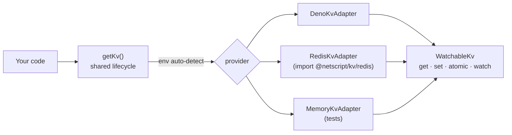

# @netscript/kv

[](https://jsr.io/@netscript/kv)
[](https://github.com/rickylabs/netscript/actions/workflows/ci.yml)
[](https://rickylabs.github.io/netscript/)

**A reactive key-value primitive for NetScript: one `WatchableKv` contract over Deno KV, Redis, and
in-memory backends, with a shared per-process lifecycle that auto-detects the active provider from
the environment.**

Key-value storage shows up everywhere in a backend — sessions, caches, coordination state, queue
plumbing — and every consumer wants the same three things: typed reads and writes, atomic updates,
and a way to react when a key changes. `@netscript/kv` provides exactly that surface once. `getKv()`
resolves a single shared adapter per process — Redis when the environment advertises one, Deno KV
otherwise — and every backend speaks the same `WatchableKv` contract, so code written against the
in-memory adapter in tests runs unchanged against Redis in production.

The watch capability is the differentiator: `watch` and `watchPrefix` turn the store into an event
source, streaming typed change events as keys are written — the primitive NetScript's own reactive
features build on.

## Why teams use it

- **One contract, interchangeable backends** — `KvStore` and `WatchableKv` give every adapter the
  same `get` / `set` / `delete` / `list` / `atomic` surface, so swapping providers never touches
  call sites.
- **Shared lifecycle** — `getKv`, `getActiveProvider`, `resetKv`, and `closeKv` resolve one adapter
  per process and let tests reset it deterministically.
- **Reactive reads** — `WatchableKv.watch` and `watchPrefix` stream typed `WatchEvent`s when
  observed keys change, on backends that support it.
- **Opt-in Redis** — `RedisKvAdapter` lives behind `@netscript/kv/redis` and self-registers the
  `'redis'` provider on import; the root entrypoint keeps the Redis driver out of your module graph.
- **kvdex bridge** — `@netscript/kv/kvdex` exposes `createNetscriptDb` to run a typed
  [kvdex](https://jsr.io/@olli/kvdex) document database over whichever provider is active.

## Architecture



Provider detection reads the environment: a discovered Redis/Garnet connection selects Redis (if the
Redis entrypoint has been imported), otherwise Deno KV. Force a choice with
`getKv({ provider: 'deno-kv' })` or the `CACHE_PROVIDER` environment variable. A `'nitro'` provider
id is reserved for a future adapter and is not implemented yet.

## Install

```bash
deno add jsr:@netscript/kv@<version>
```

Pin `<version>` to match your installed CLI; bare `jsr:@netscript/*` specifiers do not resolve on
the pre-release line.

## Quick example

```typescript
import { getKv } from '@netscript/kv';

// Resolve the shared adapter — auto-detects Redis or Deno KV from the
// environment and initializes once for the process.
const kv = await getKv();

await kv.set(['users', 'alice'], { name: 'Alice', role: 'admin' });

const entry = await kv.get<{ name: string; role: string }>(['users', 'alice']);
console.log(entry?.value.name); // "Alice"

// React to changes as they happen.
for await (const events of kv.watch([['users', 'alice']])) {
  for (const event of events) {
    console.log(event.type, event.key, event.value);
  }
}
```

## Public surface

| Entry       | What it gives you                                                                                |
| ----------- | ------------------------------------------------------------------------------------------------ |
| `.`         | Shared lifecycle (`getKv`, `resetKv`, `closeKv`), contract types, Deno KV and in-memory adapters |
| `./redis`   | `RedisKvAdapter`; importing it registers the `'redis'` provider                                  |
| `./kvdex`   | `createNetscriptDb` — typed kvdex database over the active provider                              |
| `./testing` | Test helpers for KV-backed code                                                                  |

The always-current symbol list is
[`deno doc jsr:@netscript/kv@<version>`](https://jsr.io/@netscript/kv/doc) (pin `<version>` on the
pre-release line, as above).

## Docs

- **Reference — lifecycle, adapters, and exports**:
  [rickylabs.github.io/netscript/reference/kv/](https://rickylabs.github.io/netscript/reference/kv/)
- **Data & Persistence — where KV fits in the data layer**:
  [rickylabs.github.io/netscript/data-persistence/](https://rickylabs.github.io/netscript/data-persistence/)
- **How-to: queue, KV, and cron together**:
  [rickylabs.github.io/netscript/how-to/queue-kv-cron/](https://rickylabs.github.io/netscript/how-to/queue-kv-cron/)
- **API docs on JSR**: [jsr.io/@netscript/kv/doc](https://jsr.io/@netscript/kv/doc)

## Compatibility

Requires Deno with the `kv` unstable feature (`--unstable-kv` or `"unstable": ["kv"]` in
`deno.json`) for the Deno KV backend. The Redis adapter needs `--allow-net` and `--allow-env`; the
in-memory adapter needs nothing.

## License

Apache-2.0 — see [LICENSE](https://github.com/rickylabs/netscript/blob/main/LICENSE). Published to
JSR with cryptographically verified provenance.
