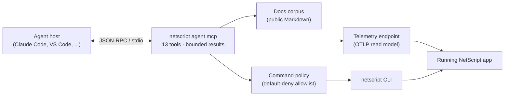

# @netscript/mcp

[](https://jsr.io/@netscript/mcp)
[](https://github.com/rickylabs/netscript/actions/workflows/ci.yml)
[](https://rickylabs.github.io/netscript/)

**The Model Context Protocol server for NetScript: 13 token-bounded tools that let a coding agent
monitor a running app, debug a correlated execution, read framework-semantic telemetry, run the
doctor, and search the docs — all over stdio.**

Point Claude Code or VS Code at a running NetScript app and the agent can ask _"is the app
healthy?"_, _"why did the last import job fail?"_, and _"what is slowing down `checkout`?"_ — and
get compact, structured answers instead of raw logs. It can correlate one execution's spans, logs,
and outcome by id; rank the queries hammering your database; and trigger safe CLI commands through a
default-deny allowlist. One command — `netscript agent init` — wires all of it into your agent host.

Generic observability tooling hands an agent raw spans and log lines and lets it burn its context
window re-deriving structure the framework already knows. `@netscript/mcp` answers in NetScript's
own vocabulary — jobs, sagas, triggers, streams, services — and bounds every result server-side, so
the agent gets percentiles, error rates, and ranked operations rather than the spans they were
computed from. It reads the same OpenTelemetry data the Aspire dashboard shows you, and complements
Aspire's own MCP server: Aspire speaks resources and containers; this server speaks your app.

## Why agents like it

- **13 token-bounded tools** — every successful result is capped server-side (50 array items, 2,000
  characters per string) before it reaches the model; the analytics tools never return raw spans at
  all.
- **Framework-semantic trace intelligence** — tools classify telemetry into `worker`, `saga`,
  `trigger`, `stream`, and `service` domains and correlate whole executions by id, because they
  understand the `netscript.*` attribute conventions the framework emits.
- **Default-deny CLI gate** — `execute_command` matches commands against an ordered allowlist; deny
  beats allow, unmatched paths are denied, and destructive verbs (`deploy`, `db reset`,
  `plugin remove`, …) are never reachable.
- **One-command install** — `netscript agent init` detects your agent host, writes the MCP
  configuration, and installs the matching NetScript skills.
- **Version-locked agent surface** — the CLI, the skills, and the MCP server ship together at one
  version, so the tools the agent sees always match the binary it runs.
- **Zero npm MCP SDK** — a minimal newline-delimited JSON-RPC transport keeps the dependency graph
  lean and the lockfile stable.

## Architecture



The server is one third of the NetScript agent surface — the CLI is the hands, the skills are the
playbook, MCP is the eyes. It deliberately wraps the CLI rather than reimplementing it:
`list_commands` reflects the live command tree, and `execute_command` shells the CLI through the
policy gate. MCP exists for what a shell cannot cheaply give an agent — bounded aggregation,
cross-domain diagnostics, and documentation lookup.

## Install

Most users never import this package. Install the server into a project with the CLI:

```bash
netscript agent init
```

That detects your agent host and writes `.mcp.json` (Claude Code) and/or `.vscode/mcp.json` (VS
Code) pointing at `netscript agent mcp`, and installs the version-matched NetScript skills. Use
`--host claude|vscode|all` to choose explicitly.

To embed the server in your own host process, add it as a library:

```bash
deno add jsr:@netscript/mcp
```

To run the standalone stdio entrypoint directly when integrating another MCP host:

```bash
deno x -A jsr:@netscript/mcp@<version>/cli
```

Pin `<version>` to match your installed CLI; bare `jsr:@netscript/*` specifiers do not resolve on
the pre-release line, and `netscript agent init` writes the correct pinned form for you.

## Quick example

**1. Wire up an agent host.** From a NetScript project root:

```bash
$ netscript agent init
Installed NetScript agent integration for claude, vscode.
```

The generated `.mcp.json` runs the server for this project — equivalent to:

```json
{
  "mcpServers": {
    "netscript": {
      "command": "deno",
      "args": [
        "run",
        "-A",
        "jsr:@netscript/cli@<version>",
        "agent",
        "mcp",
        "--project-root",
        "<project-root>"
      ]
    }
  }
}
```

**2. Ask the agent.** With the app started, the agent turns questions into bounded tool calls:

> **You:** Is the app healthy? Anything in the docs about telemetry?
>
> **Agent:** calls `get_app_status` →
> `{"status": "…", "counts": {…}, "domains": [{"domain": "worker", …}, …]}` — a health verdict with
> per-domain summaries, not a span dump. Calls `search_docs {"query": "telemetry"}` →
> `{"count": 1, "matches": [{"slug": "mcp", "title": "@netscript/mcp", "snippet": "…", "score": 35}]}`,
> then `get_doc` with the winning slug to read just the section it needs.

When the app is down or telemetry is unreachable, the same tools return a structured `warn`/`fail`
result the agent can reason about — never a crash.

## Tool catalog

| Tool                          | Required input | Bounded result                                              |
| ----------------------------- | -------------- | ----------------------------------------------------------- |
| `get_app_status`              | —              | Health verdict, counts, per-domain summaries                |
| `list_runs`                   | —              | Recent executions filtered by domain, status, service, time |
| `get_run`                     | `id`           | One correlated execution with bounded spans and logs        |
| `get_recent_errors`           | —              | Recent errors grouped by service and domain                 |
| `get_last_job_result`         | —              | The latest matching job outcome                             |
| `analyze_service_performance` | `service`      | Duration percentiles, throughput, error rate                |
| `analyze_db_bottlenecks`      | —              | Ranked database and KV operations                           |
| `doctor`                      | —              | Telemetry, Aspire, wiring, and plugin checks with fixes     |
| `search_docs`                 | `query`        | Ranked public-document matches with snippets                |
| `list_docs`                   | —              | Public-document summaries                                   |
| `get_doc`                     | `slug`         | One public document, or one named section of it             |
| `list_commands`               | —              | Live CLI command descriptors                                |
| `execute_command`             | `command`      | Policy decision, exit status, bounded output tail           |

Full input/output contracts for every tool are on the
[MCP reference](https://rickylabs.github.io/netscript/reference/mcp/).

## Public surface

Two entrypoints carry the package:

| Entry   | What it gives you                                                                                                                    |
| ------- | ------------------------------------------------------------------------------------------------------------------------------------ |
| `.`     | Tool contracts and schemas, the tool registry, the protocol runner (`createMcpServer`), port interfaces, and default adapters        |
| `./cli` | The executable composition (`createMcpCliServer`, `runMcpStdioServer`) that binds real telemetry, docs, doctor, and process adapters |

Every tool flow depends on a port interface, so embedders and tests supply their own adapters and
assert against the published schemas. The always-current symbol list is
[`deno doc jsr:@netscript/mcp`](https://jsr.io/@netscript/mcp/doc).

## Configuration at a glance

- **Telemetry endpoint discovery** (tools and `doctor`): explicit `--endpoint`, then
  `NETSCRIPT_TELEMETRY_ENDPOINT`, then `ASPIRE_DASHBOARD_PORT`, then `http://localhost:18888`.
- **Docs corpus**: by default the docs tools index the documentation shipped with the installed
  package; set `--docs-root <path>` (or `NETSCRIPT_DOCS_ROOT`) to serve a project or site corpus
  instead.
- **Command policy**: the shipped default allows selected `db`, `generate`, `contract`,
  `service list`, `plugin`, and `ui:*` verbs and denies `deploy`, `init`, `marketplace`, `db reset`,
  `plugin remove`, and `ui:remove` — anything unmatched is denied. Embedders can pass their own
  policy.

The full flag reference, policy table, and composition options are on the docs site.

## Docs

- **MCP reference — all 13 tool contracts, policy, and exports**:
  [rickylabs.github.io/netscript/reference/mcp/](https://rickylabs.github.io/netscript/reference/mcp/)
- **Agent tooling — install, flags, troubleshooting, CLI × skills × MCP**:
  [rickylabs.github.io/netscript/capabilities/agent-tooling/](https://rickylabs.github.io/netscript/capabilities/agent-tooling/)
- **API docs on JSR**: [jsr.io/@netscript/mcp/doc](https://jsr.io/@netscript/mcp/doc)

## Compatibility

The **server** requires Deno 2.9+ (both entrypoints use `Deno.*` APIs); Node.js and Bun are not
supported as server runtimes. The **client** side is unconstrained: any MCP-capable host — Claude
Code, VS Code, and others — only has to spawn the process and speak JSON-RPC over stdio. The
executable needs `--allow-env`, `--allow-net`, `--allow-read`, and `--allow-run`; the `netscript`
binary grants these at its edge. The server never returns project source, environment-variable
values, credentials, or secrets.

## License

Apache-2.0 — see [LICENSE](https://github.com/rickylabs/netscript/blob/main/LICENSE). Published to
JSR with cryptographically verified provenance.
