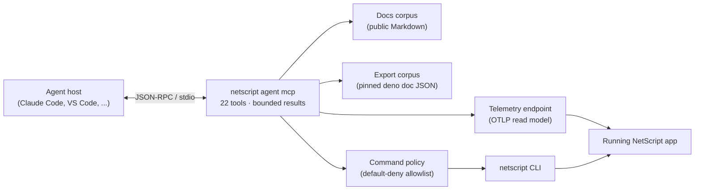

# @netscript/mcp

[](https://jsr.io/@netscript/mcp)
[](https://github.com/rickylabs/netscript/actions/workflows/ci.yml)
[](https://rickylabs.github.io/netscript/)

**The Model Context Protocol server for NetScript: 22 token-bounded tools for app health, correlated
execution debugging, framework telemetry, CLI diagnostics, intent-aware documentation guidance,
and first-party export discovery over stdio.**

Point Claude Code or VS Code at a running NetScript app and the agent can ask _"is the app
healthy?"_, _"why did the last import job fail?"_, and _"what is slowing down `checkout`?"_ — and
get compact, structured answers instead of raw logs. It can correlate one execution's spans, logs,
and outcome by id; rank the queries hammering your database; and trigger allowlisted CLI commands
through a default-deny policy. One command — `netscript agent init` — wires all of it into your
agent host.

Generic observability tooling hands an agent raw spans and log lines and lets it burn its context
window re-deriving structure the framework already knows. `@netscript/mcp` answers in NetScript's
own vocabulary — jobs, sagas, triggers, streams, services — and bounds every result server-side, so
the agent gets percentiles, error rates, and ranked operations rather than the spans they were
computed from. It reads the same OpenTelemetry data the Aspire dashboard shows you, and complements
Aspire's own MCP server: Aspire speaks resources and containers; this server speaks your app.

## Why agents like it

- **22 token-bounded tools** — every successful result is capped server-side (50 array items, 2,000
  characters per string) before it reaches the model; the analytics tools never return raw spans at
  all.
- **Framework-semantic trace intelligence** — tools classify telemetry into `worker`, `saga`,
  `trigger`, `stream`, and `service` domains and correlate whole executions by id, because they
  understand the `netscript.*` attribute conventions the framework emits.
- **Default-deny CLI gate** — `execute_command` matches commands against an ordered prefix policy;
  deny beats allow, anything unmatched is denied, and the shipped policy explicitly denies `deploy`,
  `init`, `marketplace`, `db reset`, `plugin remove`, and `ui:remove`.
- **One-command install** — `netscript agent init` detects your agent host, writes the MCP
  configuration, and installs the matching NetScript skills.
- **Matched agent surface** — `netscript agent init` writes host configuration pinned to your
  installed CLI version and installs the skills that ship with that same release, so the tool
  catalog the agent sees comes from the release it runs.
- **Intent-aware guidance** — `find_guidance` accepts the task in the caller's words and returns a
  bounded, ordered set of section citations and cited code excerpts.
- **Zero npm MCP SDK** — a minimal newline-delimited JSON-RPC transport keeps the dependency graph
  lean and the lockfile stable.

## Architecture


```mermaid
flowchart LR
    A["Agent host<br/>(Claude Code, VS Code, ...)"] <-- "JSON-RPC / stdio" --> S["netscript agent mcp<br/>22 tools · bounded results"]
    S --> T["Telemetry endpoint<br/>(OTLP read model)"]
    S --> D["Docs corpus<br/>(public Markdown)"]
    S --> E["Export corpus<br/>(pinned deno doc JSON)"]
    S --> P["Command policy<br/>(default-deny allowlist)"]
    T --> R["Running NetScript app"]
    P --> C["netscript CLI"]
    C --> R
```

The server is one third of the NetScript agent surface — the CLI is the hands, the skills are the
playbook, MCP is the eyes. It deliberately wraps the CLI rather than reimplementing it:
`list_commands` reflects the live command tree, and `execute_command` shells the CLI through the
policy gate. MCP exists for what a shell cannot cheaply give an agent — bounded aggregation,
cross-domain diagnostics, and documentation lookup.

### CLI executor identity

Both command tools return an `executor` identity with `mode`, `version`, and the resolved fixed
command prefix, so the agent can see which CLI it is driving.

- **CLI-hosted server (`netscript agent mcp`)**: re-enters the hosting CLI. Script and global-install
  runs use the current Deno executable plus the running main module; compiled installs execute the
  current binary directly. No JSR CLI is downloaded.
- **Standalone server (`deno x jsr:@netscript/mcp@<version>/cli`)**: has no host CLI, so the MCP
  release intentionally selects `jsr:@netscript/cli@<MCP_PACKAGE_VERSION>` as its compatible child
  and reports `mode: "standalone"`. This is an explicit MCP-owned compatibility policy, not a claim
  that publish-asset generation compares the two package versions.

`list_commands` is receipt-exempt because catalog enumeration diagnoses no project resource.
`execute_command` accepts an optional `resource` (default `project`) and replaces that resource's
diagnostic receipt on every attempt: exit zero writes `exitStatus: 0`; policy denial, timeout,
adapter failure, or a non-zero child exit writes `exitStatus: 1`.

## Install

Most users never import this package. Install the server into a project with the CLI:

```bash
netscript agent init
```

That detects your agent host and writes `.mcp.json` (Claude Code) and/or `.vscode/mcp.json` (VS
Code) pointing at `netscript agent mcp`, and installs the NetScript skills shipped with your CLI
release. Use `--host claude|vscode|all` to choose explicitly.

To embed the server in your own host process, add it as a library:

```bash
deno add jsr:@netscript/mcp@<version>
```

To run the standalone stdio entrypoint directly when integrating another MCP host:

```bash
deno x -A jsr:@netscript/mcp@<version>/cli
```

Pin `<version>` to match your installed CLI; bare `jsr:@netscript/*` specifiers do not resolve on
the pre-release line, and `netscript agent init` writes the correct pinned form for you.

## Quick example

**1. Wire up an agent host.** From a NetScript project root:

```bash
$ netscript agent init --with-docs
Installed NetScript agent integration for claude, vscode.
```

The generated `.mcp.json` runs the server for this project — equivalent to:

```json
{
  "mcpServers": {
    "netscript": {
      "command": "deno",
      "args": [
        "run",
        "-A",
        "jsr:@netscript/cli@<version>",
        "agent",
        "mcp",
        "--project-root",
        "<project-root>",
        "--docs-root",
        "<project-root>/.netscript/docs"
      ]
    }
  }
}
```

**2. Ask the agent.** With the app started, the agent turns questions into bounded tool calls:

> **You:** Is the app healthy? Anything in the docs about telemetry?
>
> **Agent:** calls `get_app_status` →
> `{"status": "…", "counts": {…}, "domains": [{"domain": "worker", …}, …]}` — a health verdict with
> per-domain summaries, not a span dump. Calls `search_docs {"query": "telemetry"}` →
> `{"count": 1, "matches": [{"slug": "pages/observability/telemetry", "title": "Telemetry", "snippet": "…", "score": 35}]}`,
> then `get_doc` with the winning slug to read just the section it needs.

When telemetry is unreachable, nothing crashes: `get_app_status` and the doctor's telemetry checks
report a structured `warn`/`fail` status, the list and analytics tools return their ordinary empty
results, and `get_run` returns a structured `run_not_found` error the agent can reason about.

## Tool catalog

| Tool                          | Required input        | Bounded result                                                               |
| ----------------------------- | --------------------- | ---------------------------------------------------------------------------- |
| `get_app_status`              | —                     | Health verdict, counts, per-domain summaries                                 |
| `list_runs`                   | —                     | Recent executions filtered by domain, status, service, time                  |
| `get_run`                     | `id`                  | One correlated execution with bounded spans and logs                         |
| `get_recent_errors`           | —                     | Recent errors grouped by service and domain                                  |
| `get_last_job_result`         | —                     | The latest matching job outcome                                              |
| `analyze_service_performance` | `service`             | Duration percentiles, throughput, error rate                                 |
| `analyze_db_bottlenecks`      | —                     | Ranked database and KV operations                                            |
| `doctor`                      | —                     | Telemetry, Aspire, wiring, and plugin checks; suggested fixes on problems    |
| `search_docs`                 | `query`               | Ranked public-document matches with snippets                                 |
| `list_docs`                   | —                     | Public-document summaries                                                    |
| `get_doc`                     | `slug`                | One public document, or one named section of it                              |
| `find_export`                 | `symbol`              | Exact symbol locations as package and export subpath                         |
| `list_package_exports`        | `package`             | Paginated declarations grouped by export subpath                             |
| `get_export`                  | `symbol`              | One bounded declaration signature and JSDoc block                            |
| `search_exports`              | `query`               | Ranked partial-name and declaration-shape matches                            |
| `list_commands`               | —                     | Live CLI descriptors plus resolved executor mode, version, and command       |
| `execute_command`             | `command`; `resource` optional | Executor identity, status, exit code, duration, and bounded output tail |
| `record_drift`                | `resource`, `summary` | Evidence-gated drift entry appended to project drift log                     |
| `list_api_services`           | —                 | Discovered services, live spec status, source outcomes, and operation counts  |
| `list_service_operations`     | `service`         | Bounded OpenAPI operation rows with honest truncation metadata                |
| `get_operation_schema`        | `service`, `operation` | Request, response, and error views plus an unauthenticated curl template   |

A top-level input/result field overview for every tool is on the
[MCP reference](https://rickylabs.github.io/netscript/reference/mcp/); the complete Standard Schema
contracts are published as `TOOL_INPUT_SCHEMAS` / `TOOL_OUTPUT_SCHEMAS` and returned by the live
`tools/list`.

## Record drift

`record_drift` is an evidence-gated mutating tool that records verified architecture or runtime
drift into `.netscript/agent/drift.jsonl`.

- **Required evidence**: Requires a fresh successful diagnostic receipt (timestamped within 15
  minutes, `exitStatus: 0`) for the target resource. Receipts are automatically produced when
  calling `doctor`, telemetry/API-introspection tools, `netscript plugin doctor --resource
  <resource>`, or a successful `execute_command` carrying the same `resource`.
- **Target & Scope**: The `resource` argument targets a specific plugin, service, or `'project'`.
  Receipts live at `.netscript/agent/diagnostics/<resource>.json`.
- **Mutation behavior**: Appends a single JSON line to `.netscript/agent/drift.jsonl` under the
  project root containing `timestamp`, `resource`, `summary`, optional `details`, and the attached
  evidence receipt.
- **Failure modes**: If no receipt exists, if the receipt is older than 15 minutes, or if the
  receipt recorded a non-zero exit status, `record_drift` refuses with structured error code
  `diagnostic_evidence_required`.
- **Dry-run / Preview**: Inspecting receipts or running `doctor` / telemetry tools previews current
  diagnostic state without mutating `drift.jsonl`.

## Embedding as a library

To run the public stdio composition from your own Deno entrypoint:

```ts
import { runMcpStdioServer } from '@netscript/mcp/cli';

await runMcpStdioServer({
  projectRoot: Deno.cwd(),
  // Options beat environment, which beats an indexable .netscript/docs project bundle.
  docsRoot: Deno.env.get('NETSCRIPT_DOCS_ROOT'),
});
```

`runMcpStdioServer` owns the newline-delimited stdio transport. It shuts down when the host closes
stdin or terminates the process; callers do not need to reach into an internal transport API.

## Public surface

Three entrypoints carry the package:

| Entry                  | What it gives you                                                                                                      |
| ---------------------- | ---------------------------------------------------------------------------------------------------------------------- |
| `.`                    | Tool contracts and schemas, the tool registry, protocol runner, service endpoint directory ports, and default adapters |
| `./cli`                | The executable composition plus every export from `.`, including the service endpoint directory surface                |
| `./openapi-projection` | Pure OpenAPI operation indexing and schema projections, with no discovery, filesystem, network, or runtime work        |

The projection subpath accepts an already-loaded OpenAPI document. It keeps discovery and I/O at the
caller's boundary:

````ts
import { indexOpenApiOperations } from '@netscript/mcp/openapi-projection';

const index = indexOpenApiOperations(openApiDocument);

Every tool flow depends on a port interface, so embedders and tests supply their own adapters and
assert against the published schemas. The always-current symbol list is
[`deno doc jsr:@netscript/mcp@<version>`](https://jsr.io/@netscript/mcp/doc) (pin `<version>` on the
pre-release line, as above).

The four export tools use a distinct generated corpus, not the Markdown docs corpus. Its payload is
derived from Deno 2.9 `deno doc --json` for every publishable first-party export map and pinned by
framework version, SHA-256, compressed/uncompressed byte sizes, and exact package/subpath/symbol
counts. `EmbeddedExportSurfaceCorpus` verifies those values lazily and performs no project or docs
filesystem reads.

### Discover service OpenAPI endpoints

Embedders can compose the four discovery sources and bounded network probe without importing an
OpenAPI projection layer:

```ts
import { createServiceEndpointDirectory } from '@netscript/mcp';

const endpoints = createServiceEndpointDirectory({
  projectRoot: Deno.cwd(),
});

const { entries, sources } = await endpoints.list();
````

The effective per-service precedence is `override > aspire-cli > run-manifest > appsettings`. Every
source remains visible as `used`, `absent`, or `failed`; a failed Aspire CLI query or a stale
manifest is never rendered as healthy absence. The Aspire adapter brackets its machine-readable
`describe` query with `ps` snapshots: the exact real AppHost path must belong to the project, its
process identity must remain stable across the read, and any executable resource working directory
must remain inside that same real project root. For executable services, the adapter prefers the
allocated target `PORT` from the described resource environment over a fixed proxy URL; this keeps
discovery live when a stale foreign process occupies the requested proxy port. CLI absence, non-zero
exit, identity drift, and partial JSON are distinct failed source rows. Benign CLI banners,
trailers, and casing changes are accepted without weakening those checks. The manifest at
`.netscript/run/endpoints.json` is eligible only when its real project root and `runId` match the
supplied current run. `appHostPath` defaults to `./aspire/apphost.mts`; override it when the active
AppHost lives elsewhere. Supply `expectedRunId` only when the host owns the current AppHost run
token; without that identity proof, a present run manifest is reported as failed and does not
contribute endpoints.

Explicit operator endpoints and exclusions live only in the S5-owned subsection of
`.netscript/agent-mcp.json`; sibling settings are ignored:

```json
{
  "introspection": {
    "serviceEndpoints": {
      "orders": "https://orders.example.test"
    },
    "excludeServices": ["internal-admin"]
  }
}
```

Exclusions are applied before network access. Other rows report `running`, `not_running`,
`spec_unavailable`, or `identity_mismatch`; parsed OpenAPI is retained as opaque JSON for a later
consumer. Probes do not send credentials or follow redirects. A 401/403 explains how to expose only
the OpenAPI route anonymously or supply a reachable public spec URL. A running service must return
JSON containing its selected service name, for example `{ "service": "orders" }`, from its selected
base path; this second request prevents a reused port from being mistaken for the intended service.

The default library composition needs `--allow-read` for carriers and real-path checks,
`--allow-run` for `aspire ps` plus `aspire describe`, and `--allow-net` for bounded spec/identity
requests. Tests and custom hosts can replace every source and the probe through
`ServiceEndpointDirectoryOptions`.

## Configuration at a glance

- **Telemetry endpoint discovery** (tools and `doctor`): explicit `--endpoint`, then
  `NETSCRIPT_TELEMETRY_ENDPOINT`, then `ASPIRE_DASHBOARD_PORT`, then `http://localhost:18888`.
- **Docs corpus**: explicit `--docs-root <path>`, then `NETSCRIPT_DOCS_ROOT`, then an indexable
  `<projectRoot>/.netscript/docs`, then the bounded generated release fallback. `agent init
  --with-docs` writes the installed root into every generated host command. `list_docs.corpus`
  reports `kind`, resolved `root` (or `null`), and total `documentCount`.
- **Service endpoint discovery** (library surface): `.netscript/agent-mcp.json` override, then the
  Aspire CLI machine-readable query, then an identity-bound run manifest, then
  `aspire/appsettings.json`; lower-priority disagreements remain visible as conflicts.
- **Command policy**: the shipped default allows the prefixes
  `db init|generate|migrate|seed|status|introspect`, `generate`, `contract`, `service list`,
  `plugin install|list|sync|doctor`, and `ui:add|ui:init|ui:list|ui:update`, and denies `deploy`,
  `init`, `marketplace`, `db reset`, `plugin remove`, and `ui:remove` — deny beats allow, anything
  unmatched is denied. Embedders can pass their own policy.

The full flag reference, policy table, and composition options are on the docs site.

## Docs

- **MCP reference — the 21-tool field overview, policy, and exports**:
  [rickylabs.github.io/netscript/reference/mcp/](https://rickylabs.github.io/netscript/reference/mcp/)
- **Agent tooling — install, flags, troubleshooting, CLI × skills × MCP**:
  [rickylabs.github.io/netscript/capabilities/agent-tooling/](https://rickylabs.github.io/netscript/capabilities/agent-tooling/)
- **API docs on JSR**: [jsr.io/@netscript/mcp/doc](https://jsr.io/@netscript/mcp/doc)

## Compatibility

The **server** requires Deno 2.9+ (both entrypoints use `Deno.*` APIs); Node.js and Bun are not
supported as server runtimes. The **client** side is unconstrained: any MCP-capable host — Claude
Code, VS Code, and others — only has to spawn the process and speak JSON-RPC over stdio. The
executable needs `--allow-env`, `--allow-net`, `--allow-read`, and `--allow-run`; the `netscript`
binary grants these at its edge. The server never returns project source, environment-variable
values, credentials, or secrets.

## License

Apache-2.0 — see [LICENSE](https://github.com/rickylabs/netscript/blob/main/LICENSE). Published to
JSR with cryptographically verified provenance.
