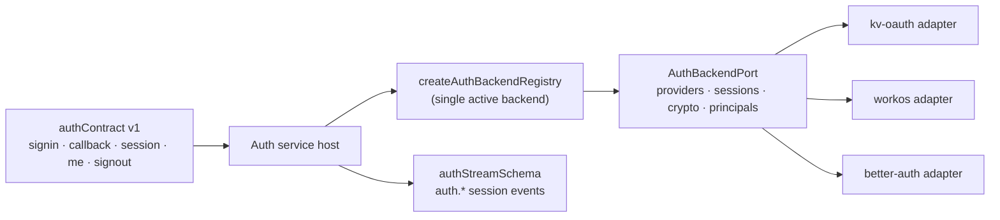

# @netscript/plugin-auth-core

[](https://jsr.io/@netscript/plugin-auth-core)
[](https://github.com/rickylabs/netscript/actions/workflows/ci.yml)
[](https://rickylabs.github.io/netscript/)

**The reusable auth core for NetScript: domain and session-stream schemas, Zod config, the
`AuthBackendPort` adapter seam, and the versioned auth API contract.**

Swapping identity providers should be a configuration change, not a rewrite — which means the
contract between "your app's auth API" and "whatever backend answers it" has to live somewhere
neutral. This package is that place. `AuthBackendPort` composes provider registry, session store,
token crypto, and principal mapping into one seam every backend adapter implements;
`AuthConfigSchema` normalizes app settings into a defaulted, secure configuration; and
`authContract` defines the signin, callback, session, me, and signout routes the auth service serves
and typed clients call.

This is the contract surface every auth backend implements and every service host wires; the
deployable [`@netscript/plugin-auth`](https://jsr.io/@netscript/plugin-auth) plugin binds it to a
NetScript host.

## Why teams use it

- **One port, many backends** — `AuthBackendPort` composes provider registry, session store, token
  crypto, and principal-mapping sub-ports, so kv-oauth, WorkOS, and better-auth adapters all
  implement one stable contract.
- **Single-active-backend registry** — `createAuthBackendRegistry` and `resolveBackend` select one
  backend per composition root, with typed `AuthBackendNotFoundError` and
  `AuthBackendOperationUnsupportedError` boundaries for what a backend cannot do.
- **Secure defaults out of the box** — `AuthConfigSchema`, `AuthSessionPolicySchema`, and
  `AuthProviderConfigSchema` normalize settings into a defaulted `AuthConfig` (secure `__Host-`
  cookies, TTL, refresh window).
- **A versioned API contract** — `authContract` / `authContractV1` define the signin, callback,
  session, me, and signout routes, so services and clients share one typed source of truth.
- **Observable and streamable** — `authStreamSchema` projects `auth.*` session events into durable
  streams, and `createAuthTelemetry` plus `redactAuthPrincipal` emit redacted spans, keeping
  principals out of your telemetry backend.

## Architecture



## Install

```bash
deno add jsr:@netscript/plugin-auth-core
```

For version pins in configuration, use the `@<version>` placeholder pinned to your installed CLI;
bare `jsr:@netscript/*` specifiers do not resolve on the pre-release line.

## Quick example

```typescript
import { AuthConfigSchema, createAuthBackendRegistry } from '@netscript/plugin-auth-core';
import type { AuthBackendPort } from '@netscript/plugin-auth-core';

// A backend adapter (kv-oauth, better-auth, WorkOS, ...) implements AuthBackendPort.
declare const kvOAuthBackend: AuthBackendPort;

// Parse app settings into a normalized, defaulted auth config.
const config = AuthConfigSchema.parse({
  backend: 'kv-oauth',
  session: { cookieName: '__Host-netscript-auth', sameSite: 'lax' },
});

// Register backends and resolve the single active one at the composition root.
const registry = createAuthBackendRegistry(
  new Map([[config.backend, kvOAuthBackend]]),
  config.backend,
);

// Service hosts authenticate requests through the resolved backend port.
const backend = registry.resolveBackend();
const session = await backend.sessions.getSession({ token: 'opaque-session-token' });
```

## Public surface

| Entry            | What it gives you                                                           |
| ---------------- | --------------------------------------------------------------------------- |
| `.`              | The backend registry, config schemas, error classes, and contract handles   |
| `./ports`        | `AuthBackendPort` and its provider / session / crypto / principal sub-ports |
| `./domain`       | Account, session, and user schemas plus the state vocabularies              |
| `./config`       | `AuthConfigSchema` and the session/provider policy schemas                  |
| `./contracts/v1` | `authContract` / `authContractV1` — the versioned auth API routes           |
| `./streams`      | `authStreamSchema` and the `auth.*` session-event types                     |
| `./telemetry`    | `createAuthTelemetry`, span names, and `redactAuthPrincipal`                |
| `./presets`      | Provider and backend preset registry                                        |
| `./testing`      | Fixtures for exercising backends and contracts in tests                     |

The always-current symbol list is
[`deno doc jsr:@netscript/plugin-auth-core@<version>`](https://jsr.io/@netscript/plugin-auth-core/doc)
(pin `<version>` on the pre-release line, as above).

## Docs

- **Auth core reference — ports, schemas, and contract**:
  [rickylabs.github.io/netscript/reference/plugin-auth-core/](https://rickylabs.github.io/netscript/reference/plugin-auth-core/)
- **Identity & Access — the full authentication story**:
  [rickylabs.github.io/netscript/identity-access/](https://rickylabs.github.io/netscript/identity-access/)
- **API docs on JSR**:
  [jsr.io/@netscript/plugin-auth-core/doc](https://jsr.io/@netscript/plugin-auth-core/doc)

## Compatibility

Schemas, ports, and the contract are plain TypeScript — importable in any TypeScript environment.
Concrete backend adapters and the service host that wires them target Deno 2.9+.

## License

Apache-2.0 — see [LICENSE](https://github.com/rickylabs/netscript/blob/main/LICENSE). Published to
JSR with cryptographically verified provenance.
