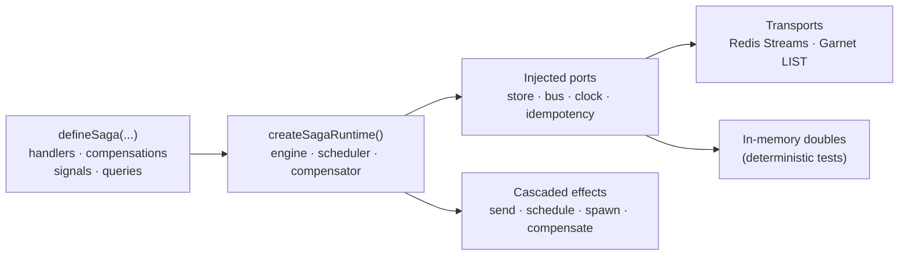

# @netscript/plugin-sagas-core

[](https://jsr.io/@netscript/plugin-sagas-core)
[](https://github.com/rickylabs/netscript/actions/workflows/ci.yml)
[](https://rickylabs.github.io/netscript/)

**The reusable saga core for NetScript: a fluent DSL for durable, multi-step workflows plus runtime
ports, a native engine, durable transports, and deterministic testing primitives.**

Sagas are the honest answer to distributed transactions: a sequence of steps, each with a
compensation, driven by messages that may arrive twice or out of order. This package gives you the
whole discipline as code. `defineSaga` builds a frozen, typed definition — state, handlers,
compensations, signals, queries — and `createSagaRuntime` drives it through explicit ports for
storage, transport, clock, and idempotency. Nothing is global: applications inject their own
durability, and tests inject deterministic in-memory doubles.

This is the core the deployable [`@netscript/plugin-sagas`](https://jsr.io/@netscript/plugin-sagas)
plugin binds to a NetScript host; use it directly for custom hosts, libraries, and tests.

## Why teams use it

- **A fluent, typed saga DSL** — `defineSaga(id).state().on().build()` produces a frozen
  `SagaDefinition`; handlers return cascaded effects via `send`, `schedule`, `spawn`,
  `sagaComplete`, `sagaFail`, and `sagaCompensate`.
- **At-least-once, exactly-applied** — idempotency keys reserve a message target before delivery and
  record applied `(instanceId, key)` pairs, so duplicates return `alreadyApplied` instead of
  re-running effects.
- **Compensation as a first-class handler** — `.compensate()` registers the unwind path next to the
  forward path, and `sagaCompensate` triggers it from any handler.
- **Signals and queries** — `defineSignal` and `defineQuery` give running instances a typed
  interaction surface beyond their event stream.
- **Durable transports and stores included** — `./transports` ships Redis Streams and Garnet LIST
  delivery adapters; `./stores` exposes the store port behind a stable subpath so persistent
  backends stay out of the root barrel.
- **Deterministic testing** — `./testing` ships in-memory stores, a controllable clock, and a
  runtime helper, so saga logic is unit-testable with no infrastructure.

## Architecture



## Install

```bash
deno add jsr:@netscript/plugin-sagas-core
```

For version pins in configuration, use the `@<version>` placeholder pinned to your installed CLI;
bare `jsr:@netscript/*` specifiers do not resolve on the pre-release line.

## Quick example

Author a saga with the fluent DSL:

```typescript
import { defineSaga, sagaComplete, send } from '@netscript/plugin-sagas-core';

type RegistrationState = { status: 'pending' | 'welcoming' | 'done' };
type UserRegistered = { userId: string; email: string };

const registrationSaga = defineSaga('user-registration')
  .state<RegistrationState>({ status: 'pending' })
  .on<'UserRegistered', UserRegistered>('UserRegistered', (saga, event) => {
    saga.state.status = 'welcoming';
    return [
      send('send-welcome-email', { email: event.payload.email }, {
        idempotencyKey: `welcome:${event.payload.userId}`,
      }),
    ];
  })
  .on('WelcomeEmailSent', (saga) => {
    saga.state.status = 'done';
    return [sagaComplete()];
  })
  .build();

console.log(registrationSaga.id); // "user-registration"
```

Then register definitions with the native runtime and start it:

```typescript
import { defineSaga } from '@netscript/plugin-sagas-core';
import type { SagaDefinition, SagaState } from '@netscript/plugin-sagas-core';
import { createSagaRuntime } from '@netscript/plugin-sagas-core/runtime';

const definition = defineSaga('order-audit')
  .state<SagaState>({})
  .on('orders.created', () => [])
  // Registration takes the widened definition shape.
  .build() as SagaDefinition;

const runtime = createSagaRuntime();
await runtime.register([definition]);
await runtime.start();
await runtime.stop('example complete');
```

Reserve a signal and a query, register a compensation, and fail explicitly when an event cannot be
applied:

```typescript
import { defineQuery, defineSaga, defineSignal, sagaFail } from '@netscript/plugin-sagas-core';

type OrderState = { total: number; cancelled: boolean };

const CancelOrder = defineSignal<{ reason: string }>('CancelOrder');
const OrderTotal = defineQuery<number>('OrderTotal');

const orderSaga = defineSaga('order')
  .state<OrderState>({ total: 0, cancelled: false })
  .on<'ItemAdded', { price: number }>('ItemAdded', (saga, event) => {
    saga.state.total += event.payload.price;
    return [];
  })
  .compensate<'ItemAdded', { price: number }>('ItemAdded', (saga, event) => {
    saga.state.total -= event.payload.price;
    return [];
  })
  .onSignal(CancelOrder, (saga, payload) => {
    saga.state.cancelled = true;
    return [sagaFail(payload.reason)];
  })
  .onQuery(OrderTotal, (saga) => saga.state.total)
  .build();
```

## Public surface

| Entry                     | What it gives you                                                                          |
| ------------------------- | ------------------------------------------------------------------------------------------ |
| `.`                       | The saga DSL: `defineSaga`, `defineSignal`, `defineQuery`, and the cascaded-effect helpers |
| `./runtime`               | `createSagaRuntime` — engine, scheduler, and compensator                                   |
| `./ports`                 | `SagaStorePort`, `SagaBusPort`, `SagaClockPort`, `SagaIdempotencyPort`, and siblings       |
| `./transports`            | Redis Streams and Garnet LIST delivery adapters                                            |
| `./stores`                | The durable store port behind a stable subpath                                             |
| `./middleware`            | Hono saga middleware and SSE event middleware                                              |
| `./integration/workers`   | Saga cascades into worker jobs and tasks (`triggerJob`, `triggerTask`)                     |
| `./integration/publisher` | The `SagaPublisherPort` boundary                                                           |
| `./contracts/v1`          | The versioned saga API contract                                                            |
| `./testing`               | In-memory stores, controllable clock, runtime test helper                                  |

The always-current symbol list is
[`deno doc jsr:@netscript/plugin-sagas-core@<version>`](https://jsr.io/@netscript/plugin-sagas-core/doc)
(pin `<version>` on the pre-release line, as above).

## Docs

- **Sagas reference — the sagas family surface**:
  [rickylabs.github.io/netscript/reference/sagas/](https://rickylabs.github.io/netscript/reference/sagas/)
- **Durable Workflows — durability, retries, and DLQ behavior**:
  [rickylabs.github.io/netscript/durable-workflows/](https://rickylabs.github.io/netscript/durable-workflows/)
- **Checkout saga tutorial — build a multi-step saga end to end**:
  [rickylabs.github.io/netscript/tutorials/storefront/04-checkout-saga/](https://rickylabs.github.io/netscript/tutorials/storefront/04-checkout-saga/)
- **API docs on JSR**:
  [jsr.io/@netscript/plugin-sagas-core/doc](https://jsr.io/@netscript/plugin-sagas-core/doc)

## Compatibility

The DSL and definitions are plain TypeScript, importable anywhere. The durable transports require
their backing infrastructure (Redis or Garnet) and a Deno 2.9+ runtime; the in-memory defaults and
testing surface run with zero permissions.

## License

Apache-2.0 — see [LICENSE](https://github.com/rickylabs/netscript/blob/main/LICENSE). Published to
JSR with cryptographically verified provenance.
