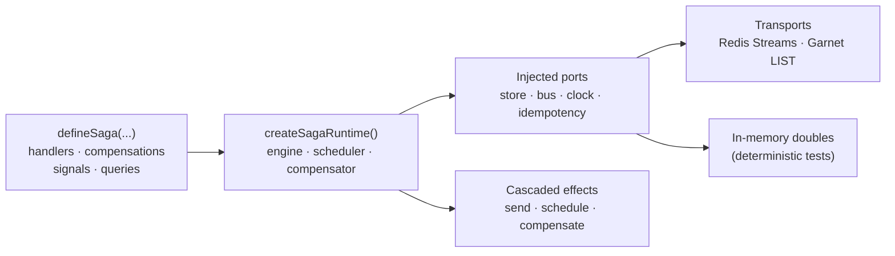

# @netscript/plugin-sagas-core

[](https://jsr.io/@netscript/plugin-sagas-core)
[](https://github.com/rickylabs/netscript/actions/workflows/ci.yml)
[](https://rickylabs.github.io/netscript/)

**The reusable saga core for NetScript: a fluent DSL for durable, multi-step workflows plus runtime
ports, a native engine, durable transports, and deterministic testing primitives.**

Sagas are the honest answer to distributed transactions: a sequence of steps, each with a
compensation, driven by messages that may arrive twice or out of order. This package gives you the
whole discipline as code. `defineSaga` builds a frozen, typed definition — state, handlers,
compensations, signals, queries — and `createSagaRuntime` drives it through explicit ports for
storage, transport, clock, and idempotency. Nothing is global: applications inject their own
durability, and tests inject deterministic in-memory doubles.

This is the core the deployable [`@netscript/plugin-sagas`](https://jsr.io/@netscript/plugin-sagas)
plugin binds to a NetScript host; use it directly for custom hosts, libraries, and tests.

## Why teams use it

- **A fluent, typed saga DSL** — `defineSaga(id).state().on().build()` produces a frozen
  `SagaDefinition`; handlers return cascaded effects via `send`, `schedule`, `sagaComplete`,
  `sagaFail`, and `sagaCompensate`.
- **At-least-once, exactly-applied** — idempotency keys reserve a message target before delivery and
  record applied `(instanceId, key)` pairs, so duplicates return `alreadyApplied` instead of
  re-running effects.
- **Compensation as a first-class handler** — `.compensate()` registers the unwind path next to the
  forward path, and `sagaCompensate` triggers it from any handler.
- **Signals and queries** — `defineSignal` and `defineQuery` give running instances a typed
  interaction surface beyond their event stream.
- **Durable transports and stores included** — `./transports` ships Redis Streams and Garnet LIST
  delivery adapters; `./stores` exposes the store port behind a stable subpath so persistent
  backends stay out of the root barrel.
- **Deterministic testing** — `./testing` ships in-memory stores, a controllable clock, and a
  runtime helper, so saga logic is unit-testable with no infrastructure.

## Architecture


```mermaid
flowchart LR
    D["defineSaga(...)<br/>handlers · compensations<br/>signals · queries"] --> R["createSagaRuntime()<br/>engine · scheduler · compensator"]
    R --> P["Injected ports<br/>store · bus · clock · idempotency"]
    P --> T["Transports<br/>Redis Streams · Garnet LIST"]
    P --> Mem["In-memory doubles<br/>(deterministic tests)"]
    R --> FX["Cascaded effects<br/>send · schedule · compensate"]
```

## Install

```bash
deno add jsr:@netscript/plugin-sagas-core@<version>
```

Pin `<version>` to match your installed CLI; bare `jsr:@netscript/*` specifiers do not resolve on
the pre-release line.

## Quick example

Author a saga with the fluent DSL:

```typescript
import { defineSaga, sagaComplete, send } from '@netscript/plugin-sagas-core';

type RegistrationState = { status: 'pending' | 'welcoming' | 'done' };
type UserRegistered = { userId: string; email: string };

const registrationSaga = defineSaga('user-registration')
  .state<RegistrationState>({ status: 'pending' })
  .on<'UserRegistered', UserRegistered>('UserRegistered', (saga, event) => {
    saga.state.status = 'welcoming';
    return [
      send('WelcomeEmailRequested', { email: event.payload.email }, {
        idempotencyKey: `welcome:${event.payload.userId}`,
      }),
    ];
  })
  .on('WelcomeEmailSent', (saga) => {
    saga.state.status = 'done';
    return [sagaComplete()];
  })
  .build();

console.log(registrationSaga.id); // "user-registration"
```

Then register definitions with the native runtime and start it:

```typescript
import { defineSaga } from '@netscript/plugin-sagas-core';
import type { SagaDefinition, SagaState } from '@netscript/plugin-sagas-core';
import { createSagaRuntime } from '@netscript/plugin-sagas-core/runtime';

const definition = defineSaga('order-audit')
  .state<SagaState>({})
  .on('orders.created', () => [])
  // Registration takes the widened definition shape.
  .build() as SagaDefinition;

const runtime = createSagaRuntime();
await runtime.register([definition]);
await runtime.start();
await runtime.stop('example complete');
```

For the started single-point form, use `startSagas({ definitions })` from
`@netscript/plugin-sagas-core/presets`; the returned `runtime` accepts `publish()` immediately and
the returned `shutdown()` owns teardown. Low-level `createSagaRuntime()` remains explicit about
`register()` and `start()`. A definition that emits `schedule()` requires a scheduler in a low-level
composition; the scaffolded plugin runner supplies its queue-backed scheduler.

Reserve a signal and a query, register a compensation, and fail explicitly when an event cannot be
applied:

```typescript
import { defineQuery, defineSaga, defineSignal, sagaFail } from '@netscript/plugin-sagas-core';

type OrderState = { total: number; cancelled: boolean };

const CancelOrder = defineSignal<{ reason: string }>('CancelOrder');
const OrderTotal = defineQuery<number>('OrderTotal');

const orderSaga = defineSaga('order')
  .state<OrderState>({ total: 0, cancelled: false })
  .on<'ItemAdded', { price: number }>('ItemAdded', (saga, event) => {
    saga.state.total += event.payload.price;
    return [];
  })
  .compensate<'ItemAdded', { price: number }>('ItemAdded', (saga, event) => {
    saga.state.total -= event.payload.price;
    return [];
  })
  .onSignal(CancelOrder, (saga, payload) => {
    saga.state.cancelled = true;
    return [sagaFail(payload.reason)];
  })
  .onQuery(OrderTotal, (saga) => saga.state.total)
  .build();
```

## Telemetry contract

Inject `SagaInstrumentation` through `createSagaRuntime({ native: { instrumentation } })`; the
composition root gives the engine, bridge, and compensator the same instance. Saga operations emit
these spans:

When `createNativeBus` receives a prebuilt `native.engine` without an `instrumentation` option, the
bridge uses its own noop instrumentation instance; pass the same instrumentation explicitly when the
prebuilt engine and bridge must share telemetry.

| Span                      | Runtime owner | Meaning and outcomes                                                                                       |
| ------------------------- | ------------- | ---------------------------------------------------------------------------------------------------------- |
| `saga.handle`             | Engine        | Handler execution; `success` or `error`                                                                    |
| `saga.cascade.send`       | Bus bridge    | Downstream internal-message dispatch; `success` or `error`                                                 |
| `saga.cascade.schedule`   | Bus bridge    | Scheduler persistence call; `success` or `error`                                                           |
| `saga.cascade.spawn`      | Bus bridge    | Defensive rejected attempt; **error-only** because child-saga lifecycle is unsupported                     |
| `saga.cascade.compensate` | Compensator   | Registered compensation execution; `success`, missing-handler `skipped`, or `error`                        |
| `saga.cascade.complete`   | Engine        | Participation of a complete effect in transition resolution; outcome follows the resolved persisted status |

Every engine-originated saga span carries `netscript.correlation.id`, the cross-plane convention
exported as `NetScriptCorrelationAttributes.CORRELATION_ID` by `@netscript/telemetry/attributes`,
plus the saga-domain `netscript.saga.correlation_key`. The publisher's message correlation key wins
for the cross-plane ID; a saga's `.correlate()` rule wins for the domain key. Cascade spans consume
those two engine-selected values unchanged. Explicit W3C trace context makes each cascade span a
direct child of the operation that produced it, including compensation-generated cascades.

For scheduled child messages, an explicit child `correlationKey` wins; the upstream cross-plane ID
is used only when the child omitted one. The current `send()` DSL has no child-correlation option,
so the bridge leaves the nested message's domain key unset and supplies the upstream cross-plane ID
to the engine separately. A rule-less downstream saga therefore retains its existing
`<sagaId>:<type>` domain identity while its spans remain joined to the upstream operation.

`saga.cascade.complete` is emitted whenever a handler returns a complete effect, including a
storeless runtime. Its `netscript.saga.status` is the resolved persisted status—not a success flag.
For mixed terminal effects it can be `failed` or `compensating`; the span also records whether the
complete effect supplied a result.

Direct `SagaCompensator` callers may omit the optional correlation and parent fields for source
compatibility. The compensator does not invent fallbacks from the message, a correlation rule, or a
default. A missing handler is observable as `skipped`; a registered handler without an
engine-resolved `correlationKey` fails validation. **Behavior change:** direct callers that invoke a
registered compensation handler without that key now receive `SAGA_VALIDATION_FAILED`. This
no-fallback rule applies to correlation and span parenting; when no instrumentation span context
exists, the compensation handler still sees the handled message's existing
`traceparent`/`tracestate` for backward compatibility.

## Public surface

| Entry                     | What it gives you                                                                                          |
| ------------------------- | ---------------------------------------------------------------------------------------------------------- |
| `.`                       | The saga DSL: `defineSaga`, `defineSignal`, `defineQuery`, and the cascaded-effect helpers                 |
| `./runtime`               | `createSagaRuntime` — engine, scheduler, and compensator                                                   |
| `./ports`                 | `SagaStorePort`, `SagaBusPort`, `SagaClockPort`, `SagaIdempotencyPort`, and siblings                       |
| `./transports`            | Redis Streams and Garnet LIST delivery adapters                                                            |
| `./stores`                | The durable store port behind a stable subpath                                                             |
| `./middleware`            | Hono saga middleware and SSE event middleware                                                              |
| `./integration/workers`   | Explicit workers-port helpers for jobs and tasks (`triggerJob`, `triggerTask`); `send()` does not use them |
| `./integration/publisher` | The `SagaPublisherPort` boundary                                                                           |
| `./contracts/v1`          | The versioned saga API contract                                                                            |
| `./presets`               | Started `startSagas` / `startSagaHandlers` composition helpers                                             |
| `./testing`               | In-memory stores, controllable clock, runtime test helper                                                  |

The always-current symbol list is
[`deno doc jsr:@netscript/plugin-sagas-core@<version>`](https://jsr.io/@netscript/plugin-sagas-core/doc)
(pin `<version>` on the pre-release line, as above).

## Docs

- **Sagas reference — the sagas family surface**:
  [rickylabs.github.io/netscript/reference/sagas/](https://rickylabs.github.io/netscript/reference/sagas/)
- **Durable Workflows — durability, retries, and DLQ behavior**:
  [rickylabs.github.io/netscript/durable-workflows/](https://rickylabs.github.io/netscript/durable-workflows/)
- **Checkout saga tutorial — build a multi-step saga end to end**:
  [rickylabs.github.io/netscript/tutorials/storefront/04-checkout-saga/](https://rickylabs.github.io/netscript/tutorials/storefront/04-checkout-saga/)
- **API docs on JSR**:
  [jsr.io/@netscript/plugin-sagas-core/doc](https://jsr.io/@netscript/plugin-sagas-core/doc)

## Compatibility

The DSL and definitions are plain TypeScript, importable anywhere. The durable transports require
their backing infrastructure (Redis or Garnet) and a Deno 2.9+ runtime; the in-memory defaults and
testing surface run with zero permissions.

## License

Apache-2.0 — see [LICENSE](https://github.com/rickylabs/netscript/blob/main/LICENSE). Published to
JSR with cryptographically verified provenance.

## Atomic saga-to-worker commands

Ordinary transition handlers can return `workerJobEffect(selectedJob, payload, route)` or
`workerTaskEffect(selectedTask, payload, route)` from `./integration/workers`. Select
`.durableWorkerCommands()` on the saga definition. These effects are pure declarations; existing
`send()` remains an internal saga-message cascade. Worker effects are unavailable in compensation
or nested scheduled cascades. A task used here requires `.payload(selectedRuntimeSchema)`; the
legacy type-only task overload remains available for ordinary task execution.

The selected schema validates detached bounded JSON before any transition write. Schema
transformations that change canonical payload identity are refused. Command identities use the
saga id, instance id, next version and original handler-effect ordinal. The producer forwards
correlation and W3C context into the existing command outbox. Configure C5's worker sink topic map
with the same selected job/task id as the effect; destination/topic are host-owned routing policy.

`MemorySagaStore` supplies the atomic transition/replay contract for deterministic tests.
`createPrismaSagaTransitionStore(root, { transactionTimeoutMs: 5000 })` from `./stores` supplies
physical PostgreSQL persistence. The root must preserve the actual generated interactive callback
type, excluding root/lifecycle operations from that callback. The database-owned bound writer appends
outbox rows on that same callback. State, correlation, history, command intents and the hashed inbound
marker commit or roll back together. A failed transition can retry its inbound key; a committed
replay writes nothing. Existing KV and unbound `PrismaSagaStore` refuse this opt-in before handler
or store work; they retain their ordinary saga behavior.

Migrate the shipped `plugins/sagas/database/sagas.prisma` runtime models, including
`SagaRuntimeCommandAppliedKey`, and the command outbox schema before selecting this adapter. The
reviewed PostgreSQL fixture migrations under `tests/fixtures/transition-store/` show the incremental
replay addition and existing runtime layout; production construction performs no DDL. The marker
covers this command-transition protocol only and does not implement general Prisma idempotency
parity. Deleting a saga instance retains committed outbox commands and replay markers for their
independent delivery lifetime. The host owns provider connections and shutdown.

Use the C5 command relay and its checked worker receipt sink for delivery. Delivery is at least once;
exactly once effective application additionally requires durable downstream idempotency. The saga
package adds no relay timer, leasing, retry or settlement loop. Worker progress continues through the
native durable execution stream; worker completion uses `publishSagaOrThrow()`.
