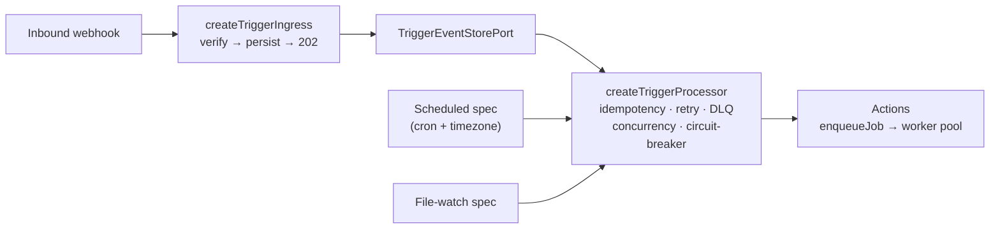

# @netscript/plugin-triggers-core

[](https://jsr.io/@netscript/plugin-triggers-core)
[](https://github.com/rickylabs/netscript/actions/workflows/ci.yml)
[](https://rickylabs.github.io/netscript/)

**The reusable trigger core for NetScript: a handler-first DSL for webhook, scheduled, and
file-watch triggers, with ack-then-process ingress and durable processing.**

The hard part of triggers is not receiving them — it is surviving them: duplicate webhooks, senders
that retry on slow responses, crashes between the acknowledgement and the work. This package encodes
the discipline. `defineWebhook`, `defineScheduledTrigger`, and `defineFileWatch` take the handler
first and a frozen spec second; ingress verifies and persists an event before responding `202`; and
the processor applies idempotency, retry policy, bounded concurrency, dead-lettering, and
circuit-breaking around every dispatch — all through explicit ports you can swap.

This is the core the deployable
[`@netscript/plugin-triggers`](https://jsr.io/@netscript/plugin-triggers) plugin binds to a
NetScript host; use it directly for custom hosts, libraries, and tests.

## Why teams use it

- **Handler-first authoring** — the handler is the first argument and the immutable spec the second;
  definitions are frozen and type-safe, and handlers emit actions such as `enqueueJob` to hand work
  to the worker pool.
- **Ack-then-process ingress** — `createTriggerIngress` verifies the signature and persists the
  event through its `TriggerEventStorePort` before returning `202`, so a slow handler never blocks
  the sender and a crash after the acknowledgement replays from the stored event.
- **A durable processor runtime** — `createTriggerProcessor` applies idempotency, retry, bounded
  concurrency, DLQ, and circuit-breaking around handler dispatch.
- **Cron you can preview** — `computeNextFireTimes` renders upcoming fire times for a scheduled spec
  without a running scheduler.
- **Every boundary is a port** — ingress, processor, scheduler, event store, idempotency, DLQ,
  clock, file-watcher, and webhook-verifier seams (`TriggerIngressPort`, `TriggerProcessorPort`, and
  siblings) are injected, so adapters stay swappable and tests stay deterministic.

## Architecture



## Install

```bash
deno add jsr:@netscript/plugin-triggers-core@<version>
```

Pin `<version>` to match your installed CLI; bare `jsr:@netscript/*` specifiers do not resolve on
the pre-release line.

## Quick example

Define a webhook whose handler enqueues a job, then wire ingress and processor:

```typescript
import {
  createTriggerIngress,
  createTriggerProcessor,
  defineWebhook,
  enqueueJob,
} from '@netscript/plugin-triggers-core';
import type {
  LoggerPort,
  TriggerDlqPort,
  TriggerEventStorePort,
  TriggerIdempotencyPort,
  TriggerProcessorOptions,
  WebhookVerifierPort,
} from '@netscript/plugin-triggers-core';
import type { JobDefinition } from '@netscript/plugin-workers-core';

// Your app supplies the job definition and the port adapters.
declare const sendReceiptJob: JobDefinition<'send-receipt'>;
declare const idempotency: TriggerIdempotencyPort;
declare const dlq: TriggerDlqPort;
declare const logger: LoggerPort;
declare const dispatchAction: TriggerProcessorOptions['dispatchAction'];
declare const eventStore: TriggerEventStorePort;
declare const verifier: WebhookVerifierPort;

const stripePayments = defineWebhook(
  async (event) => [
    enqueueJob(sendReceiptJob, {
      payload: event.payload.body,
      idempotencyKey: event.idempotencyKey,
    }),
  ],
  {
    id: 'stripe-payments',
    path: '/webhooks/stripe',
    verifier: 'hmac-sha256',
    secretEnv: 'STRIPE_WEBHOOK_SECRET',
  },
);

const processor = createTriggerProcessor({ idempotency, dlq, logger, dispatchAction });
const ingress = createTriggerIngress({
  definitions: [stripePayments],
  eventStore,
  processor,
  verifier,
  logger,
});
```

Scheduled triggers preview their fire times without a running scheduler:

```typescript
import { computeNextFireTimes, defineScheduledTrigger } from '@netscript/plugin-triggers-core';

const nightlyReindex = defineScheduledTrigger(
  // Handlers are async and return trigger actions (e.g. `enqueueJob`).
  async () => [],
  {
    id: 'nightly-reindex',
    cron: '0 2 * * *',
    timezone: 'UTC',
  },
);
console.log(nightlyReindex.id); // "nightly-reindex"

// Preview the next three fire times from a reference instant.
const upcoming = computeNextFireTimes(
  { cron: '0 2 * * *', timezone: 'UTC' },
  3,
  new Date('2026-01-01T00:00:00Z'),
);
console.log(upcoming);
```

## Public surface

| Entry            | What it gives you                                                                                                                     |
| ---------------- | ------------------------------------------------------------------------------------------------------------------------------------- |
| `.`              | `defineWebhook` / `defineScheduledTrigger` / `defineFileWatch`, `enqueueJob`, ingress and processor factories, `computeNextFireTimes` |
| `./builders`     | The definition builders on their own                                                                                                  |
| `./runtime`      | Processor and ingress runtime composition                                                                                             |
| `./ports`        | The full port vocabulary (`TriggerIngressPort`, `TriggerProcessorPort`, `TriggerEventStorePort`, `WebhookVerifierPort`, …)            |
| `./adapters`     | KV-backed and in-process adapters for the ports                                                                                       |
| `./stores`       | Event-store implementations behind a stable subpath                                                                                   |
| `./domain`       | Branded ids, statuses, trigger kinds, and payload types                                                                               |
| `./config`       | Configuration schemas                                                                                                                 |
| `./contracts/v1` | The versioned triggers API contract                                                                                                   |
| `./telemetry`    | Trigger telemetry names and instrumentation seams                                                                                     |
| `./testing`      | Deterministic in-memory fixtures                                                                                                      |

The always-current symbol list is
[`deno doc jsr:@netscript/plugin-triggers-core@<version>`](https://jsr.io/@netscript/plugin-triggers-core/doc)
(pin `<version>` on the pre-release line, as above).

## Docs

- **Triggers reference — the triggers family surface**:
  [rickylabs.github.io/netscript/reference/triggers/](https://rickylabs.github.io/netscript/reference/triggers/)
- **Durable Workflows — durability, retries, and DLQ behavior**:
  [rickylabs.github.io/netscript/durable-workflows/](https://rickylabs.github.io/netscript/durable-workflows/)
- **API docs on JSR**:
  [jsr.io/@netscript/plugin-triggers-core/doc](https://jsr.io/@netscript/plugin-triggers-core/doc)

## Compatibility

Definitions and ports are plain TypeScript, importable anywhere. The KV-backed adapters (event
store, enabled-state store) target Deno 2.9+ (Deno KV); the in-memory fixtures run with zero
permissions.

## License

Apache-2.0 — see [LICENSE](https://github.com/rickylabs/netscript/blob/main/LICENSE). Published to
JSR with cryptographically verified provenance.
