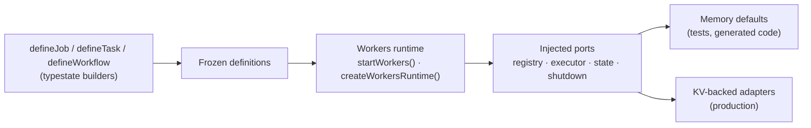

# @netscript/plugin-workers-core

[](https://jsr.io/@netscript/plugin-workers-core)
[](https://github.com/rickylabs/netscript/actions/workflows/ci.yml)
[](https://rickylabs.github.io/netscript/)

**The reusable worker primitives for NetScript: typestate builders that define jobs, tasks, and
workflows, plus the runtime that composes and drains them.**

Background-job definitions fail in two places: at definition time, when a job is missing a handler
nobody notices until production, and at runtime, when the executor and its storage are welded
together and untestable. This package attacks both. `defineJob`, `defineTask`, and `defineWorkflow`
are typestate-gated builders — `build()` only exists once an entrypoint or handler is set, so an
incomplete definition is a compile error. The runtime composes from injected registry, worker, and
storage ports with memory-backed defaults, so the same definitions run in production and in
permission-free tests.

This is the core the deployable
[`@netscript/plugin-workers`](https://jsr.io/@netscript/plugin-workers) plugin binds to a NetScript
host; use it directly for custom hosts, libraries, and tests.

## Why teams use it

- **Invalid definitions fail at compile time** — the typestate builders expose `build()` only after
  a handler or entrypoint is set; retry, timeout, topic, and permissions chain on fluently.
- **One runtime, two entry styles** — `startWorkers()` is the one-line preset;
  `createWorkersRuntime()` composes an explicit runtime when you need to control startup and
  shutdown.
- **Idempotency as a first-class port** — at-least-once delivery claims are keyed on caller keys,
  message ids, or payload hashes through `WorkerIdempotencyPort`.
- **Permission presets, not permission sprawl** — the `permissions` presets (`minimal`, `readOnly`,
  `network`, `subprocess`, …) give task definitions an auditable permission vocabulary.
- **Cron without cron strings** — the `cron` helpers (`daily()`, `every5Minutes()`, `custom(...)`,
  `validate(...)`) generate and check schedules.
- **Test without infrastructure** — `./testing` ships memory adapters and fixtures so jobs, tasks,
  and workflows run with no filesystem, network, or subprocess permissions.

## Architecture



## Install

```bash
deno add jsr:@netscript/plugin-workers-core@<version>
```

Pin `<version>` to match your installed CLI; bare `jsr:@netscript/*` specifiers do not resolve on
the pre-release line.

## Quick example

```typescript
import {
  createSuccessResult,
  defineJob,
  inspectJob,
  startWorkers,
} from '@netscript/plugin-workers-core';

// Define a job with the typestate builder.
const job = defineJob('send-email')
  .handler(() => createSuccessResult({ sent: true }))
  .topic('workers.mail')
  .build();

// Inspect the definition without starting a runtime.
console.log(inspectJob(job)); // { id: "send-email", kind: "job" }

// Start an in-process runtime, then drain and shut it down.
const runtime = await startWorkers();
await runtime.stop('done');
```

Tasks work the same way, with an explicit runtime when you need startup control:

```typescript
import {
  createFailureResult,
  createSuccessResult,
  createWorkersRuntime,
  defineTask,
  inspectTask,
} from '@netscript/plugin-workers-core';

// The typestate builder only exposes build() after a handler or entrypoint is set.
const resizeThumbnail = defineTask('resize-thumbnail')
  .timeout(30_000)
  .retry(3)
  .handler<{ path: string }>((context) =>
    context.payload.path
      ? createSuccessResult({ resized: context.payload.path })
      : createFailureResult('missing path')
  )
  .build();

console.log(inspectTask(resizeThumbnail)); // { id: "resize-thumbnail", kind: "task" }

// Compose a runtime from defaults, then start and drain it explicitly.
const runtime = createWorkersRuntime({ id: 'workers' });
await runtime.start();
await runtime.stop('deploy');
```

## Public surface

| Entry                                                         | What it gives you                                                                                                            |
| ------------------------------------------------------------- | ---------------------------------------------------------------------------------------------------------------------------- |
| `.`                                                           | `defineJob` / `defineTask` / `defineWorkflow`, result helpers, `cron`, `permissions`, `startWorkers`, `createWorkersRuntime` |
| `./builders`                                                  | The typestate builders on their own                                                                                          |
| `./runtime`                                                   | Explicit runtime composition                                                                                                 |
| `./presets`                                                   | The `startWorkers()` one-line preset                                                                                         |
| `./contracts/v1`                                              | The versioned workers API contract and schema wrappers                                                                       |
| `./registry` `./state` `./executor` `./workflow` `./shutdown` | Ports plus KV-backed implementations                                                                                         |
| `./schemas` `./config`                                        | Public structural and configuration schemas                                                                                  |
| `./streams`                                                   | Stream-integration contracts bridging runs to durable topics                                                                 |
| `./telemetry`                                                 | Worker telemetry names and instrumentation seams                                                                             |
| `./testing`                                                   | Memory adapters and fixtures for permission-free tests                                                                       |

The always-current symbol list is
[`deno doc jsr:@netscript/plugin-workers-core@<version>`](https://jsr.io/@netscript/plugin-workers-core/doc)
(pin `<version>` on the pre-release line, as above).

## Docs

- **Workers reference — the workers family surface**:
  [rickylabs.github.io/netscript/reference/workers/](https://rickylabs.github.io/netscript/reference/workers/)
- **Background Processing — jobs, tasks, and workflows end to end**:
  [rickylabs.github.io/netscript/background-processing/](https://rickylabs.github.io/netscript/background-processing/)
- **Background jobs capability**:
  [rickylabs.github.io/netscript/capabilities/background-jobs/](https://rickylabs.github.io/netscript/capabilities/background-jobs/)
- **API docs on JSR**:
  [jsr.io/@netscript/plugin-workers-core/doc](https://jsr.io/@netscript/plugin-workers-core/doc)

## Compatibility

Definitions, builders, and schemas are plain TypeScript, importable anywhere. The KV-backed adapters
and the runtime target Deno 2.9+ (Deno KV); the memory-backed defaults run with zero permissions.

## License

Apache-2.0 — see [LICENSE](https://github.com/rickylabs/netscript/blob/main/LICENSE). Published to
JSR with cryptographically verified provenance.
