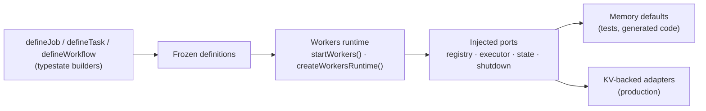

# @netscript/plugin-workers-core

[](https://jsr.io/@netscript/plugin-workers-core)
[](https://github.com/rickylabs/netscript/actions/workflows/ci.yml)
[](https://rickylabs.github.io/netscript/)

**The reusable worker primitives for NetScript: typestate builders that define jobs, tasks, and
workflows, plus the runtime that composes and drains them.**

Background-job definitions fail in two places: at definition time, when a job is missing a handler
nobody notices until production, and at runtime, when the executor and its storage are welded
together and untestable. This package attacks both. `defineJob`, `defineTask`, and `defineWorkflow`
are typestate-gated builders — `build()` only exists once an entrypoint or handler is set, so an
incomplete definition is a compile error. The runtime composes from injected registry, worker, and
storage ports with memory-backed defaults, so the same definitions run in production and in
permission-free tests.

This is the core the deployable
[`@netscript/plugin-workers`](https://jsr.io/@netscript/plugin-workers) plugin binds to a NetScript
host; use it directly for custom hosts, libraries, and tests.

## Why teams use it

- **Invalid definitions fail at compile time** — the typestate builders expose `build()` only after
  a handler or entrypoint is set; retry, timeout, topic, and permissions chain on fluently.
- **One runtime, two entry styles** — `startWorkers()` is the one-line preset;
  `createWorkersRuntime()` composes an explicit runtime when you need to control startup and
  shutdown.
- **Idempotency as a first-class port** — at-least-once delivery claims are keyed on caller keys,
  message ids, or payload hashes through `WorkerIdempotencyPort`.
- **Permission presets, not permission sprawl** — the `permissions` presets (`minimal`, `readOnly`,
  `network`, `subprocess`, …) give task definitions an auditable permission vocabulary.
- **Cron without cron strings** — the `cron` helpers (`daily()`, `every5Minutes()`, `custom(...)`,
  `validate(...)`) generate and check schedules.
- **Test without infrastructure** — `./testing` ships memory adapters and fixtures so jobs, tasks,
  and workflows run with no filesystem, network, or subprocess permissions.

## Architecture


```mermaid
flowchart LR
    B["defineJob / defineTask / defineWorkflow<br/>(typestate builders)"] --> D["Frozen definitions"]
    D --> R["Workers runtime<br/>startWorkers() · createWorkersRuntime()"]
    R --> P["Injected ports<br/>registry · executor · state · shutdown"]
    P --> M["Memory defaults<br/>(tests, generated code)"]
    P --> K["KV-backed adapters<br/>(production)"]
```

## Job cancellation and deadlines

Every dispatched job handler receives `context.signal` and, when a job timeout or an explicit
dispatch deadline is configured, `context.deadlineAt` in epoch milliseconds. The effective deadline
is the earlier of the dispatch deadline and dispatch time plus `job.timeout`. Pass the signal to
provider requests and other cancellable operations; use `signal.throwIfAborted()` at work
boundaries.

The first abort reason wins: `TimeoutError` means the deadline elapsed, `ShutdownError` means the
runner began draining, and `AbortError` means caller cancellation. Dispatch accepts an optional
parent signal while the runner supplies an isolated signal to each handler. A pre-aborted parent or
expired deadline prevents handler invocation. Timeout and grace values must be finite and
nonnegative; an explicit deadline must be finite epoch milliseconds.

`InProcessJobRunner.stop()` stops admission, aborts active handlers immediately and waits for
cleanup. `abortGracePeriodMs` defaults to 1000 milliseconds. After that grace the runtime stops
waiting and rejects the dispatch; a handler cannot turn cancellation into successful completion.
This runner executes JavaScript in process, so it cannot physically terminate a handler that ignores
the signal, and CPU-blocking code can delay timers. Deadlines, grace timers and parent listeners are
disposed when dispatch settles. Late calls to `reportProgress` reject after abort.

Once a release contains this executor-driven signal and deadline, EIS's `createJobAbortScope`
deadline/parent-signal workaround can be removed for job handlers. Source qualification alone does
not establish that released-consumer deletion condition.

## Install

```bash
deno add jsr:@netscript/plugin-workers-core@<version>
```

Pin `<version>` to match your installed CLI; bare `jsr:@netscript/*` specifiers do not resolve on
the pre-release line.

## Quick example

```typescript
import {
  createSuccessResult,
  defineJob,
  inspectJob,
  startWorkers,
} from '@netscript/plugin-workers-core';

// Define a job with the typestate builder.
const job = defineJob('send-email')
  .handler(() => createSuccessResult({ sent: true }))
  .topic('workers.mail')
  .build();

// Inspect the definition without starting a runtime.
console.log(inspectJob(job)); // { id: "send-email", kind: "job" }

// Start an in-process runtime, then drain and shut it down.
const runtime = await startWorkers();
await runtime.stop('done');
```

Tasks work the same way, with an explicit runtime when you need startup control:

```typescript
import {
  createFailureResult,
  createSuccessResult,
  createWorkersRuntime,
  defineTask,
  inspectTask,
} from '@netscript/plugin-workers-core';

// The typestate builder only exposes build() after a handler or entrypoint is set.
const resizeThumbnail = defineTask('resize-thumbnail')
  .timeout(30_000)
  .retry(3)
  .handler<{ path: string }>((context) =>
    context.payload.path
      ? createSuccessResult({ resized: context.payload.path })
      : createFailureResult('missing path')
  )
  .build();

console.log(inspectTask(resizeThumbnail)); // { id: "resize-thumbnail", kind: "task" }

// Compose a runtime from defaults, then start and drain it explicitly.
const runtime = createWorkersRuntime({ id: 'workers' });
await runtime.start();
await runtime.stop('deploy');
```

## Public surface

| Entry                                                         | What it gives you                                                                                                            |
| ------------------------------------------------------------- | ---------------------------------------------------------------------------------------------------------------------------- |
| `.`                                                           | `defineJob` / `defineTask` / `defineWorkflow`, result helpers, `cron`, `permissions`, `startWorkers`, `createWorkersRuntime` |
| `./builders`                                                  | The typestate builders on their own                                                                                          |
| `./runtime`                                                   | Explicit runtime composition                                                                                                 |
| `./presets`                                                   | The `startWorkers()` one-line preset                                                                                         |
| `./contracts/v1`                                              | The versioned workers API contract and schema wrappers                                                                       |
| `./registry` `./state` `./executor` `./workflow` `./shutdown` | Ports plus KV-backed implementations                                                                                         |
| `./schemas` `./config`                                        | Public structural and configuration schemas                                                                                  |
| `./streams`                                                   | Stream-integration contracts bridging runs to durable topics                                                                 |
| `./telemetry`                                                 | Worker telemetry names and instrumentation seams                                                                             |
| `./testing`                                                   | Memory adapters and fixtures for permission-free tests                                                                       |

The always-current symbol list is
[`deno doc jsr:@netscript/plugin-workers-core@<version>`](https://jsr.io/@netscript/plugin-workers-core/doc)
(pin `<version>` on the pre-release line, as above).

## Docs

- **Workers reference — the workers family surface**:
  [rickylabs.github.io/netscript/reference/workers/](https://rickylabs.github.io/netscript/reference/workers/)
- **Background Processing — jobs, tasks, and workflows end to end**:
  [rickylabs.github.io/netscript/background-processing/](https://rickylabs.github.io/netscript/background-processing/)
- **Background jobs capability**:
  [rickylabs.github.io/netscript/capabilities/background-jobs/](https://rickylabs.github.io/netscript/capabilities/background-jobs/)
- **API docs on JSR**:
  [jsr.io/@netscript/plugin-workers-core/doc](https://jsr.io/@netscript/plugin-workers-core/doc)

## Compatibility

Definitions, builders, and schemas are plain TypeScript, importable anywhere. The KV-backed adapters
and the runtime target Deno 2.9+ (Deno KV); the memory-backed defaults run with zero permissions.

## License

Apache-2.0 — see [LICENSE](https://github.com/rickylabs/netscript/blob/main/LICENSE). Published to
JSR with cryptographically verified provenance.

## Checked command relay sink

`@netscript/plugin-workers-core/integration/commands` exports `createWorkerCommandOutboxSink`.
Supply the existing explicit workers trigger client and a topic-to-branded job/task allowlist. The
factory copies target registration, starts no resource and opens no queue. It forwards decoded
payload, stable dedupe key, correlation and validated W3C fields. The supplied client's durable
receipt must match job/task target, contain a nonempty bounded run identity and valid acceptedAt;
a bare status/queue acknowledgement is refused. Only normalized identity/time reach publication
settlement. Native worker progress remains in the execution stream, with no relay progress mirror.

```ts
import { defineJob } from '@netscript/plugin-workers-core';
import { createWorkerCommandOutboxSink } from '@netscript/plugin-workers-core/integration/commands';
import type { WorkerCommandClientPort, WorkerCommandTarget } from '@netscript/plugin-workers-core/integration/commands';
const job = defineJob('send-email').entrypoint('jobs/send-email.ts').build();
declare const workers: WorkerCommandClientPort;
const targets = new Map<string, WorkerCommandTarget>([[job.id, { kind: 'job', id: job.id }]]);
const sink = createWorkerCommandOutboxSink({ id: 'workers', workers, targets });
```

Worker applied keys provide at-least-once delivery with an applied-key guard window. A crash after
an external effect and before `markApplied` can repeat that effect. One effective downstream
application requires independently idempotent persistence; the claim/effect/mark window alone
cannot provide it. The command relay publishes before settling, so its acceptance-to-mark crash
also redelivers the stable key. Supplied clients own their network permissions and cancellation;
imports/construction need none.
