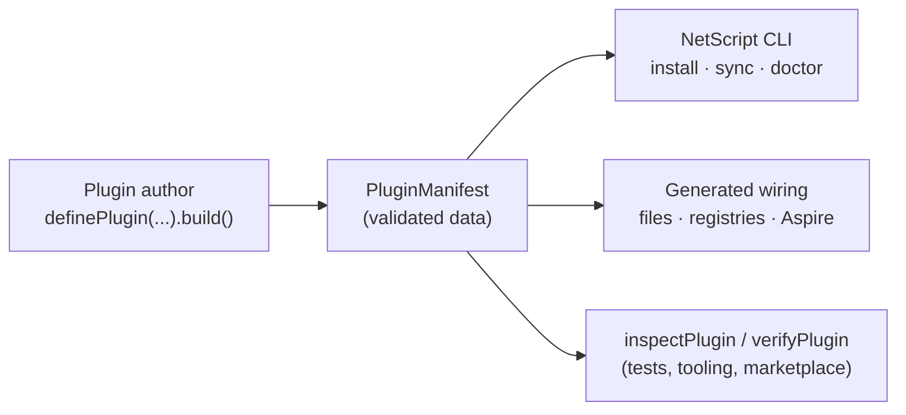

# @netscript/plugin

[](https://jsr.io/@netscript/plugin)
[](https://github.com/rickylabs/netscript/actions/workflows/ci.yml)
[](https://rickylabs.github.io/netscript/)

**The plugin authoring contract for NetScript: a fluent `definePlugin` builder producing type-safe
manifests that host tooling turns into runtime files, services, and Aspire resources.**

Every NetScript plugin — workers, sagas, triggers, streams, auth, AI, and yours — is at its core a
manifest: plain, validated data declaring what the plugin contributes to an app. This package is
where that contract lives. `definePlugin` gives authors a chainable, type-narrowing builder;
`inspectPlugin` and `verifyPlugin` give hosts and tests a way to interrogate any manifest without
executing it. If you are building a plugin or a tool that consumes plugins, this is the package you
build against.

Because manifests are data, the whole ecosystem stays inspectable: the CLI scaffolds from them,
Aspire wiring is generated from them, and marketplace tooling reads them — all without running
plugin code.

## Why authors use it

- **A builder that catches mistakes at compile time** — `definePlugin(name, version)` returns a
  chainable, type-narrowing `PluginBuilder`; `.build()` yields a schema-validated `PluginManifest`
  with typed `PluginError` classes for invalid or duplicate definitions.
- **A rich contribution vocabulary** — declare services, background processors, stream topics,
  database schemas, migrations, runtime-config topics, and telemetry as typed contribution axes.
- **Typed cross-plugin dependencies** — `.withDependencies({...})` registers sibling plugins by
  alias and threads a `DependencyContext` into contribution callbacks.
- **Inspection without execution** — `inspectPlugin` returns a JSON-stable report for a manifest,
  registry, or path target; `verifyPlugin` checks a manifest against declared expectations.
- **Focused subpaths for every consumer** — host tooling, CLI command groups, discovery, abstract
  bases, protocol, templates, and test fixtures each get their own entrypoint, so nobody imports
  more than they need.

## Architecture



## Install

```bash
deno add jsr:@netscript/plugin
```

For version pins in configuration, use the `@<version>` placeholder pinned to your installed CLI;
bare `jsr:@netscript/*` specifiers do not resolve on the pre-release line.

## Quick example

```typescript
import { definePlugin, inspectPlugin } from '@netscript/plugin';

const plugin = definePlugin('@example/billing', '0.0.1-alpha.0')
  .withDescription('Billing service and invoice processor.')
  .withService({
    name: 'billing-api',
    entrypoint: 'services/api/main.ts',
  })
  .build();

console.log(inspectPlugin(plugin).summary);
```

Contribution methods such as `.withService(...)` accumulate plain data; `.build()` validates the
whole manifest at once, so a malformed contribution fails the build with a typed error rather than
surfacing later inside a host.

## Public surface

| Entry             | What it gives you                                                                                                  |
| ----------------- | ------------------------------------------------------------------------------------------------------------------ |
| `.`               | `definePlugin`, `PluginBuilder`, `inspectPlugin`, `verifyPlugin`, the manifest schema, and the typed error classes |
| `./adapter`       | The adapter seam deployable plugins expose and hosts drive                                                         |
| `./config`        | Configuration surfaces for host tooling                                                                            |
| `./cli`           | Plugin CLI command-group plumbing and argument parsing                                                             |
| `./sdk`           | Plugin discovery for external tooling                                                                              |
| `./contract-base` | The base oRPC contract every plugin API contract extends                                                           |
| `./abstracts`     | Abstract bases marking plugin extension points                                                                     |
| `./testing`       | Fixtures for exercising manifests and adapters in tests                                                            |
| `./loader`        | The host-side plugin loader entrypoint                                                                             |

The always-current symbol list is
[`deno doc jsr:@netscript/plugin@<version>`](https://jsr.io/@netscript/plugin/doc) (pin `<version>`
on the pre-release line, as above).

## Docs

- **Plugin reference — builder, contributions, and inspection**:
  [rickylabs.github.io/netscript/reference/plugin/](https://rickylabs.github.io/netscript/reference/plugin/)
- **Orchestration & Runtime — how manifests become running apps**:
  [rickylabs.github.io/netscript/orchestration-runtime/](https://rickylabs.github.io/netscript/orchestration-runtime/)
- **How-to — author a plugin**:
  [rickylabs.github.io/netscript/how-to/author-a-plugin/](https://rickylabs.github.io/netscript/how-to/author-a-plugin/)
- **API docs on JSR**: [jsr.io/@netscript/plugin/doc](https://jsr.io/@netscript/plugin/doc)

## Compatibility

Manifests and the builder are plain TypeScript — importable in any TypeScript environment, including
Node.js and Bun via JSR's npm compatibility. The loader and CLI plumbing target Deno 2.9+, matching
the NetScript hosts that consume them.

## License

Apache-2.0 — see [LICENSE](https://github.com/rickylabs/netscript/blob/main/LICENSE). Published to
JSR with cryptographically verified provenance.
