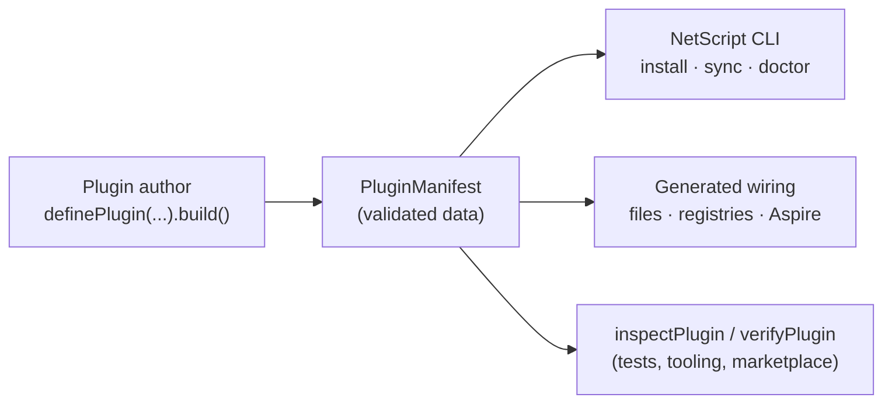

# @netscript/plugin

[](https://jsr.io/@netscript/plugin)
[](https://github.com/rickylabs/netscript/actions/workflows/ci.yml)
[](https://rickylabs.github.io/netscript/)

**The plugin authoring contract for NetScript: a fluent `definePlugin` builder producing type-safe
manifests that host tooling turns into runtime files, services, and Aspire resources.**

Every NetScript plugin — workers, sagas, triggers, streams, auth, AI, and yours — is at its core a
manifest: plain, validated data declaring what the plugin contributes to an app. This package is
where that contract lives. `definePlugin` gives authors a chainable, type-narrowing builder;
`inspectPlugin` and `verifyPlugin` give hosts and tests a way to interrogate any manifest without
executing it. If you are building a plugin or a tool that consumes plugins, this is the package you
build against.

Because manifests are data, the whole ecosystem stays inspectable: the CLI scaffolds from them,
Aspire wiring is generated from them, and marketplace tooling reads them — all without running
plugin code.

## Why authors use it

- **A builder that catches mistakes at compile time** — `definePlugin(name, version)` returns a
  chainable, type-narrowing `PluginBuilder`; `.build()` yields a schema-validated `PluginManifest`
  with typed `PluginError` classes for invalid or duplicate definitions.
- **A rich contribution vocabulary** — declare services, background processors, stream topics,
  database schemas, migrations, runtime-config topics, and telemetry as typed contribution axes.
- **Typed cross-plugin dependencies** — `.withDependencies({...})` registers sibling plugins by
  alias and threads a `DependencyContext` into contribution callbacks.
- **Inspection without execution** — `inspectPlugin` returns a JSON-stable report for a manifest,
  registry, or path target; `verifyPlugin` checks a manifest against declared expectations.
- **One service identity contract** — `Principal` and `ServiceHandlerContext` are owned by
  `@netscript/service`; the plugin root and `./service` entrypoint re-export those same types rather
  than defining plugin-local copies.
- **Focused subpaths for every consumer** — host tooling, CLI command groups, discovery, abstract
  bases, protocol, templates, and test fixtures each get their own entrypoint, so nobody imports
  more than they need.

## Architecture


```mermaid
flowchart LR
    A["Plugin author<br/>definePlugin(...).build()"] --> M["PluginManifest<br/>(validated data)"]
    M --> C["NetScript CLI<br/>install · sync · doctor"]
    M --> G["Generated wiring<br/>files · registries · Aspire"]
    M --> I["inspectPlugin / verifyPlugin<br/>(tests, tooling, marketplace)"]
```

## Install

```bash
deno add jsr:@netscript/plugin@<version>
```

Pin `<version>` to match your installed CLI; bare `jsr:@netscript/*` specifiers do not resolve on
the pre-release line.

## Quick example

```typescript
import { definePlugin, inspectPlugin } from '@netscript/plugin';

const plugin = definePlugin('@example/billing', '0.0.1-alpha.0')
  .withDescription('Billing service and invoice processor.')
  .withService({
    name: 'billing-api',
    entrypoint: 'services/api/main.ts',
  })
  .build();

console.log(inspectPlugin(plugin).summary);
```

Contribution methods such as `.withService(...)` accumulate plain data; `.build()` validates the
whole manifest at once, so a malformed contribution fails the build with a typed error rather than
surfacing later inside a host.

## Service identity types

Plugin authors can import service identity types from the plugin surface when a contribution names
them directly:

```ts
import type { Principal, ServiceHandlerContext } from '@netscript/plugin';

type BillingContext = ServiceHandlerContext<{ readonly tenantId: string }>;

function requirePrincipal(context: BillingContext): Principal {
  if (!context.principal) {
    throw new Error('authenticated principal required');
  }
  return context.principal;
}
```

These are re-exports of the public `@netscript/service` contracts. The service package remains the
owner, and `ServiceHandlerContext.principal` remains optional so unguarded handlers and existing
plugin services are unaffected. Narrow the principal in handlers that require identity; do not add
a second plugin-specific principal shape.

## Public surface

| Entry             | What it gives you                                                                                                  |
| ----------------- | ------------------------------------------------------------------------------------------------------------------ |
| `.`               | `definePlugin`, `PluginBuilder`, `inspectPlugin`, `verifyPlugin`, `Principal`, `ServiceHandlerContext`, the manifest schema, and the typed error classes |
| `./adapter`       | The adapter seam deployable plugins expose and hosts drive                                                         |
| `./config`        | Configuration surfaces for host tooling                                                                            |
| `./cli`           | Plugin CLI command-group plumbing and argument parsing                                                             |
| `./sdk`           | Plugin discovery for external tooling                                                                              |
| `./contract-base` | The base oRPC contract every plugin API contract extends                                                           |
| `./abstracts`     | Abstract bases marking plugin extension points                                                                     |
| `./testing`       | Fixtures for exercising manifests and adapters in tests                                                            |
| `./loader`        | The host-side plugin loader entrypoint                                                                             |
| `./service`       | Plugin service composition plus the service-owned `Principal` and `ServiceHandlerContext` types                     |

The always-current symbol list is
[`deno doc jsr:@netscript/plugin@<version>`](https://jsr.io/@netscript/plugin/doc) (pin `<version>`
on the pre-release line, as above).

## Extend SDK discovery

Each plugin owns its discovery declaration. Its generated control-plane module exports the factory
name and registry axis that `AstExtractor` reads from the same files it already walks:

```typescript
export const NETSCRIPT_CONTRIBUTION_BUILDERS = [
  { callee: 'defineChannelSync', axis: 'channel-syncs' },
] as const;
```

External tooling can also add a plugin's contribution factory to one discovery run without changing
source files:

```typescript
import { type AstExtractorOptions, startWalker } from '@netscript/plugin/sdk';

const options = {
  additionalBuilders: [
    { callee: 'defineChannelSync', axis: 'channel-syncs' },
  ],
} satisfies AstExtractorOptions;

const registries = await startWalker('.', options);
```

Official plugins emit the same declaration during install or sync; plugin core contains no
plugin-specific factory table. Additional mappings are snapshotted per extractor instance.
Malformed identifiers, blank axes, duplicate callees, and a recognizable contribution factory call
without a matching declaration throw a `TypeError` instead of silently omitting contributions.

This changes the migration boundary for projects scaffolded before `0.0.7`: re-run plugin sync or
update so each plugin's control-plane module receives its declaration before using no-argument
discovery. Passing `additionalBuilders` is the explicit compatibility path when regeneration is not
available.

## Docs

- **Plugin reference — builder, contributions, and inspection**:
  [rickylabs.github.io/netscript/reference/plugin/](https://rickylabs.github.io/netscript/reference/plugin/)
- **Orchestration & Runtime — how manifests become running apps**:
  [rickylabs.github.io/netscript/orchestration-runtime/](https://rickylabs.github.io/netscript/orchestration-runtime/)
- **How-to — author a plugin**:
  [rickylabs.github.io/netscript/how-to/author-a-plugin/](https://rickylabs.github.io/netscript/how-to/author-a-plugin/)
- **API docs on JSR**: [jsr.io/@netscript/plugin/doc](https://jsr.io/@netscript/plugin/doc)

## Compatibility

Manifests and the builder are plain TypeScript — importable in any TypeScript environment, including
Node.js and Bun via JSR's npm compatibility. The loader and CLI plumbing target Deno 2.9+, matching
the NetScript hosts that consume them.

## License

Apache-2.0 — see [LICENSE](https://github.com/rickylabs/netscript/blob/main/LICENSE). Published to
JSR with cryptographically verified provenance.

## Explicit service authentication

`createPluginService` requires `auth`. Guarded services pass native service-auth options;
JavaScript callers receive a `TypeError` for missing or ambiguous policies before a builder is
constructed. TypeScript callers must migrate their service configuration.

```ts
import { createPluginService } from '@netscript/plugin/service';
import { createAuthServiceAuthenticator } from '@netscript/plugin-auth/authenticator';
import { createContractAuthorizer } from '@netscript/service/auth';
import { mountPluginContract } from '@netscript/plugin/contract-base';
import { contract, contractMount, router } from './router.ts';

const service = createPluginService(router, {
  name: 'reports',
  auth: {
    authn: {
      authenticator: createAuthServiceAuthenticator({ serviceName: 'auth', timeoutMs: 10_000 }),
    },
    authz: { authorizer: createContractAuthorizer(mountPluginContract(contract, contractMount)) },
  },
});
```

The contract must declare the required access metadata, and the plugin must declare its auth
service dependency. The builder resolves procedure policy across REST and RPC; do not infer a
procedure's required scope from the transport's HTTP method.

`contractMount` is the same `{ version, namespace }` value used to assemble the router.
`mountPluginContract` prefixes REST paths and nests RPC keys without changing the source contract,
its access metadata, or its errors. Passing the flat contract to the authorizer would deny mounted
requests because their paths differ. The generator exports one mount constant in `handlers.ts`
and shares it with the authorizer; preserve that single authority when adapting the scaffold.

For a deliberately public service, record the reason instead:

```ts
const service = createPluginService(router, {
  name: 'public-status',
  auth: { public: true, reason: 'Public status API without protected operations' },
});
```

Never combine public and guarded fields. Public reasons must be nonblank. Options pass through
unchanged: a custom nonempty `allowAnonymous` list replaces the native default. The builder's
built-in health routes remain public because they are registered before auth middleware; raw
routes are installed after it and follow the configured guards.

The existing first-party public declarations record unfinished adoption, not proof that those
services are guarded. Their credential propagation, session seeding, per-service access policy
and auth discovery work remain under #1383; auth signout authorization remains under #1384.
This source change does not imply availability in an existing published package.
