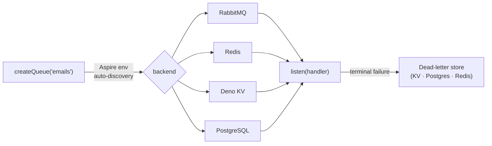

# @netscript/queue

[](https://jsr.io/@netscript/queue)
[](https://github.com/rickylabs/netscript/actions/workflows/ci.yml)
[](https://rickylabs.github.io/netscript/)

**A provider-agnostic message queue for NetScript: enqueue and drain background jobs through one
`MessageQueue` contract, auto-discovering a RabbitMQ, Redis, or Deno KV backend from the Aspire
environment.**

Queue code has a habit of marrying its broker: the day you move from Deno KV to RabbitMQ, every
`enqueue` and every consumer changes. `@netscript/queue` keeps the contract and the broker separate.
`createQueue('emails')` inspects the Aspire environment, picks the best available backend, and
returns a `MessageQueue<T>` whose call sites are identical from an in-memory test run to a
production broker. Validation, dead-lettering, and error taxonomy are part of the contract, not
afterthoughts bolted onto one adapter.

## Why teams use it

- **One contract, four backends** — every adapter implements the same `MessageQueue<T>` interface,
  so `enqueue` and `listen` never change when the broker does.
- **Backend auto-discovery** — `createQueue` resolves RabbitMQ, then Redis, then Deno KV from Aspire
  service URLs and environment variables; pin one explicitly with `QueueProvider` plus
  `QueueConnectionOptions`.
- **Typed queues** — `createTypedQueue` adds schema validation on enqueue and dequeue, routing
  invalid messages to discard, throw, or the dead-letter store.
- **Durable dead letters** — terminal failures are recorded through the `DeadLetterStorePort`
  contract, with KV, PostgreSQL, and Redis stores published under dedicated sub-path exports.
- **Lazy adapter graph** — the root export carries only factories, ports, errors, and validation
  helpers; Redis and RabbitMQ drivers load on first use, so common imports stay light.
- **Structured failure taxonomy** — `QueueError` subclasses (`QueueConnectionError`,
  `QueueValidationError`, `QueueHandlerError`, …) and `QueueErrorCode` make failures matchable
  instead of string-parsed.

## Architecture



## Install

```bash
deno add jsr:@netscript/queue@<version>
```

Pin `<version>` to match your installed CLI; bare `jsr:@netscript/*` specifiers do not resolve on
the pre-release line.

## Quick example

```typescript
import { createQueue } from '@netscript/queue';

declare function sendWelcomeEmail(to: string, body: string): Promise<void>;

// Auto-discovers a backend (RabbitMQ → Redis → Deno KV) from the Aspire environment.
const queue = createQueue<{ to: string; body: string }>('emails');

await queue.enqueue({ to: 'user@example.com', body: 'Welcome to NetScript.' });

await queue.listen(async (message) => {
  await sendWelcomeEmail(message.to, message.body);
});
```

For runtime schema validation at enqueue and dequeue time, define the contract with a Zod schema and
build a typed queue:

```typescript
import { z } from 'zod';
import { createTypedQueue } from '@netscript/queue';

const NotificationSchema = z.object({
  type: z.enum(['email', 'sms']),
  to: z.string(),
  body: z.string(),
});

const queue = createTypedQueue('notifications', NotificationSchema, {
  onValidationError: 'dlq',
});
```

## Public surface

| Entry                                   | What it gives you                                                                                    |
| --------------------------------------- | ---------------------------------------------------------------------------------------------------- |
| `.`                                     | `createQueue`, `createTypedQueue`, `createParallelQueue`, validation helpers, errors, contract types |
| `./ports`                               | Contract types only (`MessageQueue`, `DeadLetterStorePort`, options)                                 |
| `./adapters/deno-kv`                    | Deno KV adapter (native queue operations)                                                            |
| `./adapters/kv-polling`                 | Deno KV polling adapter for hosts without native queue support                                       |
| `./adapters/redis`                      | Redis adapter                                                                                        |
| `./adapters/amqp`                       | RabbitMQ (AMQP) adapter                                                                              |
| `./adapters/postgres`                   | PostgreSQL adapter                                                                                   |
| `./adapters/*-dead-letter-store`        | Durable dead-letter stores for KV, PostgreSQL, and Redis                                             |
| `./validation`, `./errors`, `./testing` | Validation helpers, error taxonomy, test utilities                                                   |

The always-current symbol list is
[`deno doc jsr:@netscript/queue@<version>`](https://jsr.io/@netscript/queue/doc) (pin `<version>` on
the pre-release line, as above).

## Docs

- **Reference — factories, adapters, and exports**:
  [rickylabs.github.io/netscript/reference/queue/](https://rickylabs.github.io/netscript/reference/queue/)
- **Background Processing — how queues fit the background stack**:
  [rickylabs.github.io/netscript/background-processing/](https://rickylabs.github.io/netscript/background-processing/)
- **How-to: choose a queue provider**:
  [rickylabs.github.io/netscript/how-to/choose-a-queue-provider/](https://rickylabs.github.io/netscript/how-to/choose-a-queue-provider/)
- **API docs on JSR**: [jsr.io/@netscript/queue/doc](https://jsr.io/@netscript/queue/doc)

## Compatibility

Designed for Deno. The Deno KV backend needs the `kv` unstable feature (`--unstable-kv`); Redis,
RabbitMQ, and PostgreSQL backends need `--allow-net` plus `--allow-env` for discovery. Backend
auto-discovery reads Aspire-style service environment variables and falls back to Deno KV when no
broker is advertised.

## License

Apache-2.0 — see [LICENSE](https://github.com/rickylabs/netscript/blob/main/LICENSE). Published to
JSR with cryptographically verified provenance.
