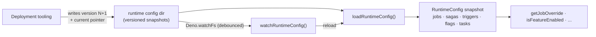

# @netscript/runtime-config

[](https://jsr.io/@netscript/runtime-config)
[](https://github.com/rickylabs/netscript/actions/workflows/ci.yml)
[](https://rickylabs.github.io/netscript/)

**Hot-reloadable runtime overrides for NetScript services: load job, saga, trigger, feature-flag,
and task overrides from a versioned config directory and reload them through a file watcher without
restarting the process.**

Project configuration (`@netscript/config`) is fixed at startup; runtime configuration is the layer
operators change while the process runs — disable a misbehaving job, flip a feature flag, retune a
trigger — without a deploy. `loadRuntimeConfig()` reads a versioned snapshot from the runtime config
directory, every accessor resolves overrides against that typed snapshot, and `watchRuntimeConfig()`
reloads it when deployment tooling writes a new version. Missing files resolve to empty defaults, so
a service boots cleanly before any override exists.

## Why teams use it

- **Versioned snapshot loading** — `loadRuntimeConfig()` reads a `current` pointer file and resolves
  the active job, saga, trigger, feature-flag, and task override files for that version.
- **Empty-default startup** — a missing runtime directory, pointer, or topic file yields empty
  defaults, so a service can boot before deployment tooling writes any overrides.
- **Debounced hot reload** — `watchRuntimeConfig()` watches the config directory with `Deno.watchFs`
  and invokes a consumer callback after debounced reloads, cancellable through an `AbortSignal`.
- **Typed override accessors** — `getJobOverride`, `getSagaOverride`, `getTriggerOverride`,
  `getRuntimeTask`, and `isFeatureEnabled` resolve overrides by ID against a typed `RuntimeConfig`
  snapshot.
- **Caller-owned diagnostics** — `summarizeRuntimeConfig()` returns a structured
  `RuntimeConfigSummary` of active overrides without emitting any presentation output.

## Architecture



The write side is owned by deployment tooling: it drops a new versioned override set and flips the
`current` pointer. The read side — this package — only ever loads, watches, and resolves; the
consumer callback owns what happens on reload.

## Install

```bash
deno add jsr:@netscript/runtime-config@<version>
```

Pin `<version>` to match your installed CLI; bare `jsr:@netscript/*` specifiers do not resolve on
the pre-release line.

## Quick example

```typescript
import {
  getJobOverride,
  isFeatureEnabled,
  loadRuntimeConfig,
  summarizeRuntimeConfig,
  watchRuntimeConfig,
} from '@netscript/runtime-config';

// Load the active override snapshot. Missing files resolve to empty
// defaults, so startup never blocks on config.
const config = await loadRuntimeConfig();

// Feature flags fall back to the provided default when no override exists.
if (isFeatureEnabled(config, 'email-worker', true)) {
  const cleanup = getJobOverride(config, 'cleanup');
  if (cleanup?.enabled === false) {
    // A runtime override has disabled the scheduled cleanup job.
  }
}

// Reload when operators roll out new overrides; the callback owns reporting.
const controller = new AbortController();
watchRuntimeConfig(async (next) => {
  const summary = summarizeRuntimeConfig(next, '[runtime-config]');
  for (const message of summary.messages) console.info(message);
}, { signal: controller.signal });
```

## Public surface

One entrypoint carries the package: the loader (`loadRuntimeConfig`), the watcher
(`watchRuntimeConfig`), the typed accessors (`getJobOverride`, `getSagaOverride`,
`getTriggerOverride`, `getRuntimeTask`, `isFeatureEnabled`), the diagnostics helper
(`summarizeRuntimeConfig`), and the `RuntimeConfig` / override types with the
`RUNTIME_CONFIG_TOPICS` and `RUNTIME_TASK_RUNTIMES` constants.

The always-current symbol list is
[`deno doc jsr:@netscript/runtime-config@<version>`](https://jsr.io/@netscript/runtime-config/doc)
(pin `<version>` on the pre-release line, as above).

## Docs

- **Reference — loader, watcher, and accessor APIs**:
  [rickylabs.github.io/netscript/reference/runtime-config/](https://rickylabs.github.io/netscript/reference/runtime-config/)
- **Orchestration & Runtime — runtime config in the bigger picture**:
  [rickylabs.github.io/netscript/orchestration-runtime/](https://rickylabs.github.io/netscript/orchestration-runtime/)
- **How-to: roll out runtime overrides**:
  [rickylabs.github.io/netscript/how-to/roll-out-runtime-overrides/](https://rickylabs.github.io/netscript/how-to/roll-out-runtime-overrides/)
- **API docs on JSR**:
  [jsr.io/@netscript/runtime-config/doc](https://jsr.io/@netscript/runtime-config/doc)

## Compatibility

Requires Deno 2+ — the loader needs `--allow-read` on the runtime config directory, and
`watchRuntimeConfig` additionally uses `Deno.watchFs`. Node.js and Bun are not supported as runtimes
for the watcher; the types are runtime-neutral.

## License

Apache-2.0 — see [LICENSE](https://github.com/rickylabs/netscript/blob/main/LICENSE). Published to
JSR with cryptographically verified provenance.
