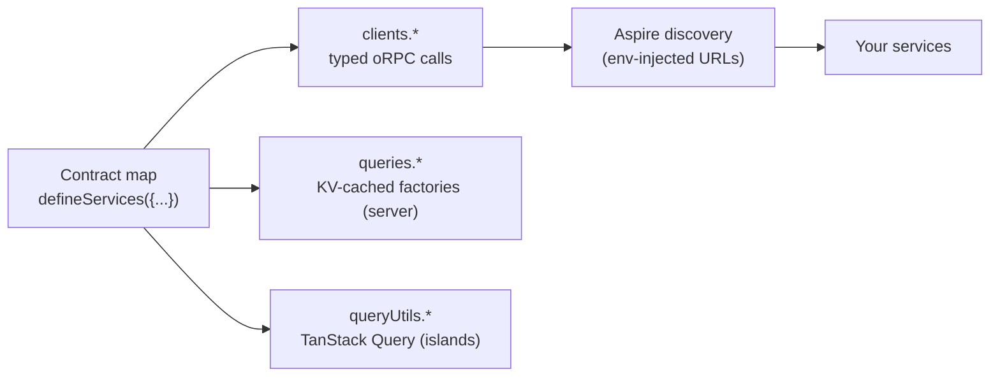

# @netscript/sdk

[](https://jsr.io/@netscript/sdk)
[](https://github.com/rickylabs/netscript/actions/workflows/ci.yml)
[](https://rickylabs.github.io/netscript/)

**The client surface of a NetScript app: typed oRPC service clients, cache-aware query factories,
and TanStack Query utilities derived from one shared contract map, with service URLs resolved
through Aspire discovery.**

Calling your own services should not mean hand-writing fetch wrappers, duplicating types, and
hardcoding ports. This package derives the entire client surface from the contracts your services
already publish: one `defineServices` call over a contract map yields fully inferred oRPC clients,
server-side cache-backed query factories, and browser-side TanStack Query utilities — all sharing
the same input and output types, none of them duplicated.

Where a service lives is not your problem either. Clients resolve URLs lazily through the
environment your orchestrator injects, so the same code runs against local processes, containers,
and deployed endpoints without a registry or a config file.

## Why teams use it

- **One contract map, three surfaces** — `defineServices` assembles typed clients, query factories,
  and query utils from a single service map; each entry defaults its service name and query path to
  the map key.
- **Typed service clients** — `createServiceClient` builds a fully inferred oRPC client from a
  shared contract router; input and output types come from the contract, never from you.
- **Aspire service discovery** — `./discovery` resolves service URLs and database/KV connections
  from orchestrator-injected environment variables, lazily at call time.
- **Cache-aware query factories** — `createQueryFactory` generates server-side query helpers backed
  by the shared KV cache with stale-while-revalidate semantics.
- **TanStack Query integration** — `createNetScriptQueryClient` and `createServiceQueryUtils` give
  browser and island code server-first defaults, invalidation bridging, and KV-backed persistence.
- **Distributed tracing built in** — every client call is wrapped in an outbound span and carries
  the W3C `traceparent` header, so client and server spans join one distributed trace.
- **Native auto-update configuration** — `./auto-update` validates the app-pinned release endpoint
  and Ed25519 key, resolves the current Deno Desktop `os-arch` release URL, and exposes typed
  staged/manual and rollback events.
- **Type-safe Desktop RPC** — `./desktop` adapts a per-window Deno bind channel to a real
  MessagePort and oRPC link, preserving the existing service contract without ambient webview
  declarations.

## Architecture



## Install

```bash
deno add jsr:@netscript/sdk@<version>
```

Pin `<version>` to match your installed CLI; bare `jsr:@netscript/*` specifiers do not resolve on
the pre-release line. Scaffolded NetScript workspaces carry the pinned entry in their import map:

```json
{
  "imports": {
    "@netscript/sdk": "jsr:@netscript/sdk@<version>"
  }
}
```

## Quick example

```ts
import { defineServices } from '@netscript/sdk';
import { ordersContract } from './contracts/orders.ts';

// One contract map wires clients, server query factories, and frontend query utils.
const { clients, queries, queryUtils } = defineServices({
  orders: { contract: ordersContract },
});

// Direct oRPC call through the typed, discovery-aware service client.
const order = await clients.orders.get({ id: 'ord_123' });

// Cache-aware query factory for server or framework-neutral code.
const ordersQuery = queries.orders;

// TanStack Query utilities for browser / island consumers:
// key, options, infiniteKey, infiniteOptions, mutationKey, mutationOptions.
const ordersQueryUtils = queryUtils.orders;
```

Drop to a focused subpath when an app only needs part of the surface — `./client`, `./query`, and
`./query-client` carry the three pieces individually.

### Desktop RPC bindings

Inside a Deno Desktop webview, reuse the same contract as the runtime router without declaring a
parallel bindings surface:

```ts
import { createDesktopServiceClient } from '@netscript/sdk/desktop';
import { ordersContract } from './contracts/orders.ts';

const orders = createDesktopServiceClient({ contract: ordersContract });
const order = await orders.get({ id: 'ord_123' });
```

The SDK resolves the default `__netscript_rpc__` webview binding lazily, adapts it to oRPC's
MessagePort link, and preserves oRPC's default string/binary serialization (`Uint8Array` is the only
native binary payload). Bind handlers execute with the Deno process's permissions, so runtime
routers must validate inputs and authorization like any other privileged entrypoint. The matching
runtime composition is `bindDesktopRpcWindow({ window, router, context })` from
`@netscript/fresh/desktop`; browser and Aspire processes receive an inert disabled lifecycle.

### Desktop auto-update

Window-only applications can start signed native update checks through the stable SDK seam:

```ts
import { startAutoUpdate } from '@netscript/sdk/auto-update';

const update = startAutoUpdate({
  release: {
    baseUrl: 'https://releases.example.com/my-app',
    publicKey: 'base64-ed25519-public-key',
    manualUpdateUrl: 'https://example.com/downloads/my-app',
  },
  policy: { checkOnLaunch: true, intervalMs: 60 * 60 * 1_000 },
  onUpdateReady(event) {
    if (event.applyMode === 'manual') {
      console.error(`Install the staged update from ${event.manualUpdateUrl}`);
    }
  },
  onRollback(event) {
    console.error(`Update rolled back: ${event.reason}`);
  },
});

if (update.status === 'disabled') {
  console.error(`Native updates unavailable: ${update.reason}`);
}
```

The release and manual-installer URLs must use HTTPS. The native Deno Desktop runtime owns manifest
fetching, Ed25519 verification, patch staging, and writable-install checks; under plain `deno run`
the seam returns `disabled` without network access. Windows currently reports a staged update
through the manual-installer event because the runtime cannot apply it automatically there; macOS
and Linux apply on relaunch.

## API at a glance

| Entry            | What it gives you                                                                 |
| ---------------- | --------------------------------------------------------------------------------- |
| `.`              | `defineServices` plus re-exports of the full surface below                        |
| `./client`       | `createServiceClient`, `isDefinedError`                                           |
| `./discovery`    | `getServiceUrl`, `getServiceInfo`, `getPostgresConnection`, `getKvConnection`, …  |
| `./query`        | `createQueryFactory`, `createQueryFactories`, `createCompositeQuery`              |
| `./query-client` | `createNetScriptQueryClient`, `createServiceQueryUtils`, `createKvCachePersister` |
| `./cache`        | `KvCacheStore`, `cacheQuery`, cache-provider wiring                               |
| `./collections`  | `createQueryCollection` — live client-side collections                            |
| `./streams`      | `createStreamProducer`, `defineStreamSchema`, durable-stream helpers              |
| `./telemetry`    | `otelMiddleware` — the outbound-tracing middleware type surface                   |
| `./auto-update`  | `startAutoUpdate`, `createReleaseClient` — signed native Deno Desktop updates     |
| `./desktop`      | `createDesktopServiceClient`, `createDesktopRpcLink` — contract-true webview RPC  |

The always-current symbol list is
[`deno doc jsr:@netscript/sdk@<version>`](https://jsr.io/@netscript/sdk/doc).

## Docs

- **Services & SDK — the pillar this package implements**:
  [rickylabs.github.io/netscript/services-sdk/](https://rickylabs.github.io/netscript/services-sdk/)
- **Reference**:
  [rickylabs.github.io/netscript/reference/sdk/](https://rickylabs.github.io/netscript/reference/sdk/)
- **How-to — discover services**:
  [rickylabs.github.io/netscript/how-to/discover-services/](https://rickylabs.github.io/netscript/how-to/discover-services/)
- **API docs on JSR**: [jsr.io/@netscript/sdk/doc](https://jsr.io/@netscript/sdk/doc)

## Compatibility

Runs on Deno 2.x on the server and in the browser: the client, query-client, and collections
surfaces run in islands, while discovery and KV-backed caching read `Deno.env` / `Deno.openKv` and
belong on the server (use `--unstable-kv` where KV types are checked).

## License

Apache-2.0 — see [LICENSE](https://github.com/rickylabs/netscript/blob/main/LICENSE). Published to
JSR with cryptographically verified provenance.
