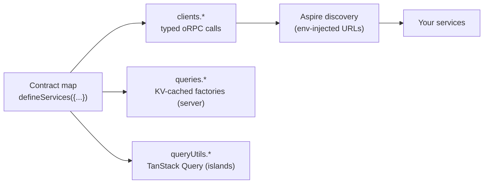

# @netscript/sdk

[](https://jsr.io/@netscript/sdk)
[](https://github.com/rickylabs/netscript/actions/workflows/ci.yml)
[](https://rickylabs.github.io/netscript/)

**The client surface of a NetScript app: typed oRPC service clients, cache-aware query factories,
and TanStack Query utilities derived from one shared contract map, with service URLs resolved
through Aspire discovery.**

Calling your own services should not mean hand-writing fetch wrappers, duplicating types, and
hardcoding ports. This package derives the entire client surface from the contracts your services
already publish: one `defineServices` call over a contract map yields fully inferred oRPC clients,
server-side cache-backed query factories, and browser-side TanStack Query utilities — all sharing
the same input and output types, none of them duplicated.

Where a service lives is not your problem either. Clients resolve URLs lazily through the
environment your orchestrator injects, so the same code runs against local processes, containers,
and deployed endpoints without a registry or a config file.

## Why teams use it

- **One contract map, three surfaces** — `defineServices` assembles typed clients, query factories,
  and query utils from a single service map; each entry defaults its service name and query path to
  the map key.
- **Typed service clients** — `createServiceClient` builds a fully inferred oRPC client from a
  shared contract router; input and output types come from the contract, never from you.
- **Aspire service discovery** — `./discovery` resolves service URLs and database/KV connections
  from orchestrator-injected environment variables, lazily at call time.
- **Cache-aware query factories** — `createQueryFactories` is the golden path: one call over a
  resource-to-config map returns server-side query helpers for every resource, backed by the shared
  KV cache with stale-while-revalidate semantics. Each generated action takes its input directly —
  `queryOptions(input)`. `createQueryFactory` builds the same helpers for a single resource.
- **TanStack Query integration** — `createNetScriptQueryClient` gives browser and island code
  server-first defaults, invalidation bridging, and KV-backed persistence.
- **Distributed tracing built in** — every client call is wrapped in an outbound span and carries
  the W3C `traceparent` header, so client and server spans join one distributed trace.
- **Native auto-update configuration** — `./auto-update` validates the app-pinned release endpoint
  and Ed25519 key, resolves the current Deno Desktop `os-arch` release URL, and exposes typed
  staged/manual and rollback events.
- **Type-safe Desktop RPC** — `./desktop` adapts a per-window Deno bind channel to a real
  MessagePort and oRPC link, preserving the existing service contract without ambient webview
  declarations.

## Architecture


```mermaid
flowchart LR
    M["Contract map<br/>defineServices({...})"] --> C["clients.*<br/>typed oRPC calls"]
    M --> Q["queries.*<br/>KV-cached factories (server)"]
    M --> U["queryUtils.*<br/>TanStack Query (islands)"]
    C --> D["Aspire discovery<br/>(env-injected URLs)"]
    D --> S["Your services"]
```

## Install

```bash
deno add jsr:@netscript/sdk@<version>
```

Pin `<version>` to match your installed CLI; bare `jsr:@netscript/*` specifiers do not resolve on
the pre-release line. Scaffolded NetScript workspaces carry the pinned entry in their import map:

```json
{
  "imports": {
    "@netscript/sdk": "jsr:@netscript/sdk@<version>"
  }
}
```

## Quick example

```ts
import { defineServices } from '@netscript/sdk';
import { ordersContract } from './contracts/orders.ts';

// One contract map wires clients, server query factories, and frontend query utils.
const { clients, queries, queryUtils } = defineServices({
  orders: { contract: ordersContract },
});

// Direct oRPC call through the typed, discovery-aware service client.
const order = await clients.orders.get({ id: 'ord_123' });

// Cache-aware query factory for server or framework-neutral code.
const ordersQuery = queries.orders;

// TanStack Query utilities for browser / island consumers:
// key, options, infiniteKey, infiniteOptions, mutationKey, mutationOptions.
const ordersQueryUtils = queryUtils.orders;
```

Drop to a focused subpath when an app only needs part of the surface — `./client`, `./query`, and
`./query-client` carry the three pieces individually.

### Two query dialects — pick one per data layer

`queries.*` and `queryUtils.*` are not interchangeable, and their call shapes differ by exactly one
pair of braces.

|                      | `queries.*` (`createQueryFactories`)                                                                      | `queryUtils.*` (`createServiceQueryUtils`)                        |
| -------------------- | --------------------------------------------------------------------------------------------------------- | ----------------------------------------------------------------- |
| Call shape           | `queryOptions(input)`                                                                                     | `queryOptions({ input })`                                         |
| Server KV cache tier | yes — stale-while-revalidate, `prefetch`, `getCachedData`, `invalidate`                                   | **no**                                                            |
| Use it for           | the golden path: server and framework-neutral code, and islands that should read through the shared cache | a thin oRPC-to-TanStack remap when no server cache tier is wanted |

Prefer `queries.*`. Reach for `queryUtils.*` only when the narrower surface is what you actually
want, and do not mix the two call shapes within one data layer: they address different key spaces,
which is why `./query-client` ships `toClientKeyPrefix` and `bridgeInvalidation` to cross between
them deliberately.

### Cache provider topology reports

`CacheStore` implementations return bounded topology evidence with every lookup, write, and
invalidation. A provider descriptor names a stable lowercase system (`deno-kv`, `redis`, `memory`,
or an extension's documented identifier) and a default tier (`l1`, `l2`, or `durable`). Read reports
contain a non-empty lookup chain ordered by `lookupIndex`; write and invalidation reports contain
bounded per-tier effects and a `topologyComplete` marker.

This is a pre-1.0 provider contract migration: custom `CacheStore` implementations must return the
new report objects, and custom `CacheProvider` implementations must expose a descriptor. Registering
a provider with `setCacheProvider()` stores a package-owned forwarding boundary instead of the raw
object, so the telemetry wrapper added at that boundary cannot be skipped by direct retrieval. The
reports contain operation facts only. Raw cache keys, serialized inputs, values, URLs, and user data
must never be copied into a descriptor or report.

`CacheQuery` turns those reports into one INTERNAL span per logical `cache.read`, `cache.write`, or
`cache.invalidate` operation. Consulted tiers are ordered `cache.lookup` events; write-through and
promotion are `cache.write` and `cache.promote` events; prefix invalidation aggregates repeated keys
to at most one event per tier. A one-, two-, or three-tier ordinary read therefore adds exactly one
span to a request trace (the 41-span evidence trace for this contract becomes 42, not 44). A stale
background refresh may add one explicitly parented `cache.write` completion span.

Generated contract queries use the normalized `resource.action` namespace. Composite queries use a
static `operationId` from `defaultOptions`, or the fixed `composite` fallback; direct `CacheQuery`
calls accept a static `operationId`, or use a fixed direct-method fallback. Operation ids are
lowercase, separator-normalized, and capped at 80 characters. They are contract metadata: never
construct one from query props, tenant/user ids, cache keys, values, or URLs.

Cache telemetry admits at most 256 distinct normalized operation namespaces per process. The first
new namespace beyond that budget is collapsed to the fixed `overflow` namespace and named once in
a `cache.namespace.overflow` span event; later over-budget namespaces also collapse to `overflow`
without retaining or emitting their original ids. Composite construction only normalizes its
static default. Admission happens when a real cache operation opens a span, so construction alone
does not consume the process budget.

Topology evidence validation is fail-safe. Missing, unbounded, or malformed provider evidence marks
the active cache span with `outcome=error` and `topology_complete=false`, but it does not turn an
otherwise successful loader, write, or invalidation into an application exception. Invalid reports
are not partially emitted: an invalidation report is staged and merged only after the complete
report validates. Provider descriptors are likewise validated inside the active span so malformed
observability data remains visible without preventing the application operation.

`backend_executed` is measured only when the `queryFn` closure is entered. It is `false` for a fresh
hit, cache-only read, provider failure before the loader, and the losing trace in an in-flight join
(`inflight_joined=true`); it becomes `true` for cold, blocking-stale, background-revalidation, and
loader-error paths. Misses, durations, and revalidation flags are never proxies for loader entry.

Custom high-level `CacheProvider` objects registered without the package-owned `CacheQuery` marker
still receive a logical span from the registration boundary. Because that interface cannot prove an
internal tier chain, a successful operation reports `topology_complete=false` with no `outcome`;
`outcome=error` is reported only when the operation throws. The boundary still measures loader
entry. Migrate such providers to a `CacheStore` with mandatory reports and register a `CacheQuery`
to produce complete topology.

### Desktop RPC bindings

Inside a Deno Desktop webview, reuse the same contract as the runtime router without declaring a
parallel bindings surface:

```ts
import { createDesktopServiceClient } from '@netscript/sdk/desktop';
import { ordersContract } from './contracts/orders.ts';

const orders = createDesktopServiceClient({ contract: ordersContract });
const order = await orders.get({ id: 'ord_123' });
```

The SDK resolves the default `__netscript_rpc__` webview binding lazily, adapts it to oRPC's
MessagePort link, and preserves oRPC's default string/binary serialization (`Uint8Array` is the only
native binary payload). Bind handlers execute with the Deno process's permissions, so runtime
routers must validate inputs and authorization like any other privileged entrypoint. The matching
runtime composition is `bindDesktopRpcWindow({ window, router, context })` from
`@netscript/fresh/desktop`; browser and Aspire processes receive an inert disabled lifecycle.

### Desktop auto-update

Window-only applications can start signed native update checks through the stable SDK seam:

```ts
import { startAutoUpdate } from '@netscript/sdk/auto-update';

const update = startAutoUpdate({
  release: {
    baseUrl: 'https://releases.example.com/my-app',
    publicKey: 'base64-ed25519-public-key',
    manualUpdateUrl: 'https://example.com/downloads/my-app',
  },
  policy: { checkOnLaunch: true, intervalMs: 60 * 60 * 1_000 },
  onUpdateReady(event) {
    if (event.applyMode === 'manual') {
      console.error(`Install the staged update from ${event.manualUpdateUrl}`);
    }
  },
  onRollback(event) {
    console.error(`Update rolled back: ${event.reason}`);
  },
});

if (update.status === 'disabled') {
  console.error(`Native updates unavailable: ${update.reason}`);
}
```

The release and manual-installer URLs must use HTTPS. The native Deno Desktop runtime owns manifest
fetching, Ed25519 verification, patch staging, and writable-install checks; under plain `deno run`
the seam returns `disabled` without network access. Windows currently reports a staged update
through the manual-installer event because the runtime cannot apply it automatically there; macOS
and Linux apply on relaunch.

## API at a glance

| Entry            | What it gives you                                                                 |
| ---------------- | --------------------------------------------------------------------------------- |
| `.`              | `defineServices` plus re-exports of the full surface below                        |
| `./client`       | `createServiceClient`, `isDefinedError`                                           |
| `./discovery`    | `getServiceUrl`, `getServiceInfo`, `getPostgresConnection`, `getKvConnection`, …  |
| `./query`        | `createQueryFactory`, `createQueryFactories`, `createCompositeQuery`              |
| `./query-client` | `createNetScriptQueryClient`, `createServiceQueryUtils`, `createKvCachePersister` |
| `./cache`        | `KvCacheStore`, `cacheQuery`, cache-provider wiring                               |
| `./collections`  | `createQueryCollection` — live client-side collections                            |
| `./streams`      | `createStreamProducer`, `defineStreamSchema`, durable-stream helpers              |
| `./telemetry`    | `otelMiddleware` — the outbound-tracing middleware type surface                   |
| `./auto-update`  | `startAutoUpdate`, `createReleaseClient` — signed native Deno Desktop updates     |
| `./desktop`      | `createDesktopServiceClient`, `createDesktopRpcLink` — contract-true webview RPC  |

The always-current symbol list is
[`deno doc jsr:@netscript/sdk@<version>`](https://jsr.io/@netscript/sdk/doc).

## Docs

- **Services & SDK — the pillar this package implements**:
  [rickylabs.github.io/netscript/services-sdk/](https://rickylabs.github.io/netscript/services-sdk/)
- **Reference**:
  [rickylabs.github.io/netscript/reference/sdk/](https://rickylabs.github.io/netscript/reference/sdk/)
- **How-to — discover services**:
  [rickylabs.github.io/netscript/how-to/discover-services/](https://rickylabs.github.io/netscript/how-to/discover-services/)
- **API docs on JSR**: [jsr.io/@netscript/sdk/doc](https://jsr.io/@netscript/sdk/doc)

## Compatibility

Runs on Deno 2.x on the server and in the browser: the client, query-client, and collections
surfaces run in islands, while discovery and KV-backed caching read `Deno.env` / `Deno.openKv` and
belong on the server (use `--unstable-kv` where KV types are checked).

## License

Apache-2.0 — see [LICENSE](https://github.com/rickylabs/netscript/blob/main/LICENSE). Published to
JSR with cryptographically verified provenance.
