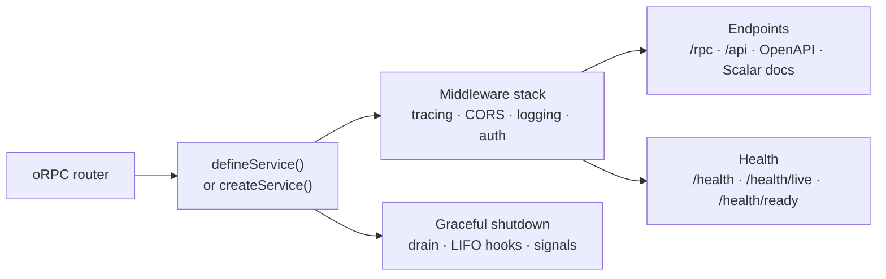

# @netscript/service

[](https://jsr.io/@netscript/service)
[](https://github.com/rickylabs/netscript/actions/workflows/ci.yml)
[](https://rickylabs.github.io/netscript/)

**The service runtime for NetScript: turn an oRPC router into a running Hono service with health
probes, OpenAPI, Scalar docs, request tracing, and graceful shutdown — in one call.**

A production service is never just its handlers. It needs CORS, request logging, an OpenAPI
document, live/ready health probes an orchestrator can poll, tracing on every request, and a
shutdown path that drains in-flight work. This package materializes all of it from the oRPC router
you already have: `defineService()` stands up the full runtime in one call, and `createService()`
composes the same stages explicitly when a service needs a bespoke stack.

Authentication and authorization ship as an opt-in subpath with provider-agnostic ports, so a
service that needs guarding adds it without dragging auth machinery into every service that does
not.

## Why it stands out

- **One-call preset** — `defineService(router, options)` wires CORS, logging, OpenAPI JSON, Scalar
  docs, RPC, service info, and health, then starts the listener and returns a `RunningService`
  handle with `addr` and an idempotent `stop()`.
- **Fluent builder** — `createService(router, config)` composes the same stages step by step, then
  `serve()` starts a listener or `build()` returns a mountable app.
- **Health probes** — `withHealth()` adds `/health`, `/health/live`, and `/health/ready`;
  `healthChecks.database`, `.kv`, `.service`, and `.custom` cover common dependencies.
- **Graceful lifecycle** — `onShutdown()` registers LIFO teardown hooks; `serve()` drains in-flight
  requests, installs `SIGINT`/`SIGTERM` handlers, and accepts an external `AbortSignal`.
- **Tracing on every request** — the builder registers tracing middleware as the outermost layer on
  every service, so each request gets a server span with W3C propagation and the service name
  recorded, with no per-service wiring.
- **Opt-in auth** — `./auth` ships authentication and authorization ports plus static-credential,
  trusted-header, and scope-authorizer factories, kept off the import graph until used.

## Architecture



## Install

```bash
deno add jsr:@netscript/service@<version>
```

Pin `<version>` (for example `0.0.1-beta.10`): bare `jsr:@netscript/*` specifiers do not resolve on
the pre-release line. Generated NetScript service entrypoints already import the pinned entry.

## Quick example

```typescript
import { defineService } from '@netscript/service';
import { router } from './router.ts';

// One call materializes the Hono + oRPC runtime and starts the listener:
// CORS, request logging, OpenAPI JSON, Scalar docs, RPC, service info, and health.
const service = await defineService(router, {
  name: 'users',
  version: '1.0.0',
  port: 3001,
  openapi: { title: 'Users API', description: 'User management service' },
});

// RunningService handle: addr + idempotent graceful stop() for tests and supervisors.
console.log(`listening on :${service.addr.port}`);
await service.stop();
```

Reach for `createService()` when a service needs explicit, stage-by-stage composition — and pull in
`./auth` to guard it:

```ts
import { createService } from '@netscript/service';
import {
  createScopeAuthorizer,
  createStaticCredentialAuthenticator,
} from '@netscript/service/auth';

const authenticator = createStaticCredentialAuthenticator({
  credentials: {
    'local-token': { subject: 'service:orders', scopes: ['orders:read'], roles: ['service'] },
  },
});

const authorizer = createScopeAuthorizer({
  rules: [{
    match: (request) => request.path.startsWith('/api/orders'),
    requireScopes: ['orders:read'],
  }],
});

const running = await createService(router, { name: 'orders', version: '1.0.0' })
  .withAuthn({ authenticator })
  .withAuthz({ authorizer })
  .withRPC()
  .withHealth()
  .serve({ port: 3001 });

await running.stop();
```

The `defineService()` preset accepts the same ports through its `auth` option, so generated
entrypoints opt in without leaving the one-call surface:

```ts
import { defineService } from '@netscript/service';
import { createScopeAuthorizer, createTrustedHeaderAuthenticator } from '@netscript/service/auth';

const running = await defineService(router, {
  name: 'orders',
  port: 3001,
  auth: {
    authn: {
      authenticator: createTrustedHeaderAuthenticator({
        subjectHeader: 'x-authenticated-user',
        scopesHeader: 'x-authenticated-scopes',
      }),
    },
    authz: {
      authorizer: createScopeAuthorizer({
        rules: [{
          match: (request) => request.path.startsWith('/api/orders'),
          requireScopes: ['orders:read'],
        }],
      }),
    },
  },
});

await running.stop();
```

## API at a glance

| Entry    | What it gives you                                                                                                                                     |
| -------- | ----------------------------------------------------------------------------------------------------------------------------------------------------- |
| `.`      | `defineService`, `createService`, `healthChecks`, `HEALTH_STATUS`, handler factories (`createRPCHandler`, `createOpenAPISpec`, `createScalarDocs`, …) |
| `./auth` | `createStaticCredentialAuthenticator`, `createTrustedHeaderAuthenticator`, `createScopeAuthorizer`, and the authn/authz port types                    |

The always-current symbol list is
[`deno doc jsr:@netscript/service@<version>`](https://jsr.io/@netscript/service/doc).

## Docs

- **Services & SDK — the pillar this package implements**:
  [rickylabs.github.io/netscript/services-sdk/](https://rickylabs.github.io/netscript/services-sdk/)
- **Reference**:
  [rickylabs.github.io/netscript/reference/service/](https://rickylabs.github.io/netscript/reference/service/)
- **How-to — add a service**:
  [rickylabs.github.io/netscript/how-to/add-a-service/](https://rickylabs.github.io/netscript/how-to/add-a-service/)
- **API docs on JSR**: [jsr.io/@netscript/service/doc](https://jsr.io/@netscript/service/doc)

## Compatibility

Requires Deno 2.x — the runtime listens through `Deno.serve` and installs `Deno.addSignalListener`
handlers. Services need `--allow-net` (listener and health probes) and `--allow-env`; database and
KV health checks add the permissions of the client they probe.

## License

Apache-2.0 — see [LICENSE](https://github.com/rickylabs/netscript/blob/main/LICENSE). Published to
JSR with cryptographically verified provenance.
