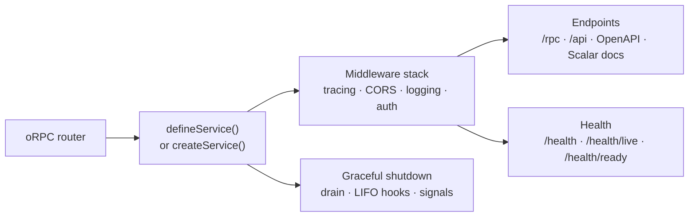

# @netscript/service

[](https://jsr.io/@netscript/service)
[](https://github.com/rickylabs/netscript/actions/workflows/ci.yml)
[](https://rickylabs.github.io/netscript/)

**The service runtime for NetScript: turn an oRPC router into a running Hono service with health
probes, OpenAPI, Scalar docs, request tracing, and graceful shutdown — in one call.**

A production service is never just its handlers. It needs CORS, request logging, an OpenAPI
document, live/ready health probes an orchestrator can poll, tracing on every request, and a
shutdown path that drains in-flight work. This package materializes all of it from the oRPC router
you already have: `defineService()` stands up the full runtime in one call, and `createService()`
composes the same stages explicitly when a service needs a bespoke stack.

Authentication and authorization ship as an opt-in subpath with provider-agnostic ports, so a
service that needs guarding adds it without dragging auth machinery into every service that does
not.

## Why teams use it

- **One-call preset** — `defineService(router, options)` wires CORS, logging, OpenAPI JSON, Scalar
  docs, RPC, service info, and health, then starts the listener and returns a `RunningService`
  handle with `addr` and an idempotent `stop()`.
- **Fluent builder** — `createService(router, config)` composes the same stages step by step, then
  `serve()` starts a listener or `build()` returns a mountable app.
- **Health probes** — `withHealth()` adds `/health`, `/health/live`, and `/health/ready`;
  `healthChecks.database`, `.kv`, `.service`, and `.custom` cover common dependencies.
- **Graceful lifecycle** — `onShutdown()` registers LIFO teardown hooks; `serve()` drains in-flight
  requests, installs `SIGINT`/`SIGTERM` handlers, and accepts an external `AbortSignal`.
- **One app-wide budget** — `createRuntimeHost()` invokes existing service, worker, queue, and
  database drains in deterministic phase order and returns one aggregate report.
- **Tracing on every request** — the builder registers tracing middleware as the outermost layer on
  every service, so each request gets a server span with W3C propagation and the service name
  recorded, with no per-service wiring.
- **Opt-in auth** — `./auth` ships authentication and authorization ports plus static-credential,
  trusted-header, contract-policy, and scope-authorizer factories, kept off the import graph until
  used.

## Architecture


```mermaid
flowchart LR
    R["oRPC router"] --> D["defineService()<br/>or createService()"]
    D --> M["Middleware stack<br/>tracing · CORS · logging · auth"]
    M --> E["Endpoints<br/>/rpc · /api · OpenAPI · Scalar docs"]
    M --> H["Health<br/>/health · /health/live · /health/ready"]
    D --> G["Graceful shutdown<br/>drain · LIFO hooks · signals"]
```

## Install

```bash
deno add jsr:@netscript/service@<version>
```

Pin `<version>` to match your installed CLI; bare `jsr:@netscript/*` specifiers do not resolve on
the pre-release line. Generated NetScript service entrypoints already import the pinned entry.

## Quick example

```typescript
import { defineService } from '@netscript/service';
import { router } from './router.ts';

// One call materializes the Hono + oRPC runtime and starts the listener:
// CORS, request logging, OpenAPI JSON, Scalar docs, RPC, service info, and health.
const service = await defineService(router, {
  name: 'users',
  version: '1.0.0',
  port: 3001,
  openapi: { title: 'Users API', description: 'User management service' },
});

// RunningService handle: addr + idempotent graceful stop() for tests and supervisors.
console.log(`listening on :${service.addr.port}`);
await service.stop();
```

Compose every in-process runtime behind one bounded shutdown handle without replacing its own drain:

```ts
import { createRuntimeHost } from '@netscript/service';

const host = createRuntimeHost({
  timeoutMs: 15_000,
  drains: [
    { id: 'api', phase: 'service', drain: () => service.stop() },
    { id: 'jobs', phase: 'workers', drain: () => workers.stop('shutdown') },
    { id: 'messages', phase: 'queue', drain: () => queue.stop() },
    { id: 'primary-db', phase: 'database', drain: () => database.disconnect() },
  ],
});

const report = await host.shutdown('SIGTERM');
```

The host drains `service → workers → queue → database`, preserving registration order inside each
phase. Rejected drains are reported and do not prevent later phases. If the one shared budget
expires, the active outcome is `timed-out`, remaining drains are `skipped`, and `shutdown()` returns
without waiting indefinitely for the slow resource.

Reach for `createService()` when a service needs explicit, stage-by-stage composition. The primary
authorization pattern declares access on the contract procedure and opts the application into
enforcement with `createContractAuthorizer()`:

```ts
import { createService } from '@netscript/service';
import {
  createContractAuthorizer,
  createStaticCredentialAuthenticator,
} from '@netscript/service/auth';
import { OrdersContractV1 } from '@example/contracts';
import { router } from './router.ts';

const authenticator = createStaticCredentialAuthenticator({
  credentials: {
    'local-token': { subject: 'service:orders', scopes: ['orders:read'], roles: ['service'] },
  },
});

// OrdersContractV1 declares procedure-local metadata such as:
// .meta({ access: {
//   authentication: 'required',
//   authorization: { scopes: ['orders:read'], roles: ['service'] },
// } })
const authorizer = createContractAuthorizer(OrdersContractV1);

const running = await createService(router, { name: 'orders', version: '1.0.0' })
  .withRPC()
  .withAuthn({ authenticator })
  .withAuthz({ authorizer })
  .withHealth()
  .serve({ port: 3001 });

await running.stop();
```

This migration is opt-in. Existing unguarded services, generated scaffolds, and services that use
`createScopeAuthorizer()` by itself keep their current behavior. Fail-closed contract enforcement
begins only when the application supplies the result of
`createContractAuthorizer(contract, { fallback? })` to `.withAuthz()`.

Contract metadata is authoritative. For a request that matches a contract procedure, a
match-aware fallback is consulted only when that procedure has no access metadata. If neither the
metadata nor a fallback rule matches, the request is denied even when the fallback's standalone
`denyByDefault` setting would otherwise allow it. A fallback can neither make a declared public
procedure private nor weaken declared scopes or roles. The builder binds one resolver to its actual
REST path, RPC path, RPC aliases, and deprecated RPC route aliases, then shares that resolver with
both authentication and authorization middleware.

`createScopeAuthorizer()` remains supported and is not deprecated. Use it standalone for a legacy
path-prefix policy, or pass it as the match-aware migration fallback for procedures that do not yet
declare metadata:

```ts
import { createContractAuthorizer, createScopeAuthorizer } from '@netscript/service/auth';

const legacyFallback = createScopeAuthorizer({
  rules: [{
    match: (request) => request.path.startsWith('/api/legacy-orders'),
    requireScopes: ['orders:read'],
  }],
  denyByDefault: false,
});

const authorizer = createContractAuthorizer(OrdersContractV1, {
  fallback: legacyFallback,
});
```

`authentication: 'optional'` is declared for future support, currently rejected. Construction of
`createContractAuthorizer()` throws
`[netscript.service.contract-policy] optional authentication is unsupported: <procedure>`; the
error is raised while the contract is traversed, not on the first request.

The `defineService()` preset accepts the same ports through its `auth` option. The following legacy
path-prefix form remains valid and behavior-compatible; new services should prefer contract
metadata plus `createContractAuthorizer()` as shown above:

```ts
import { defineService } from '@netscript/service';
import { createScopeAuthorizer, createTrustedHeaderAuthenticator } from '@netscript/service/auth';

const running = await defineService(router, {
  name: 'orders',
  port: 3001,
  auth: {
    authn: {
      authenticator: createTrustedHeaderAuthenticator({
        subjectHeader: 'x-authenticated-user',
        scopesHeader: 'x-authenticated-scopes',
      }),
    },
    authz: {
      authorizer: createScopeAuthorizer({
        rules: [{
          match: (request) => request.path.startsWith('/api/orders'),
          requireScopes: ['orders:read'],
        }],
      }),
    },
  },
});

await running.stop();
```

## Principal and handler context

`@netscript/service` owns both `Principal` and `ServiceHandlerContext<TCustom>`. A principal carries
the authenticated `subject`, readonly `scopes` and `roles`, the authentication `scheme`, and a
readonly verified `claims` bag. `ServiceHandlerContext<TCustom>` combines a custom context factory's
readonly fields with optional framework-owned `db`, `traceHeaders`, and `principal` fields.

`principal` is intentionally optional because auth is configured at runtime. A handler that needs
identity narrows it before use; contract policy guarantees the runtime gate, not per-procedure
TypeScript auth typestate.

## OpenAPI access projection

`createOpenAPISpec()` projects declared contract access without rewriting other operation fields:

| Contract declaration | OpenAPI operation |
| --- | --- |
| `authentication: 'none'` | `security: []` |
| `authentication: 'required'` | `security: [{ bearerAuth: scopes }]` |
| Required `authorization.roles` | `x-netscript-roles: roles` |
| `authentication: 'optional'` | `security: [{}, { bearerAuth: [] }]` |
| No authentication declaration | No generated operation-level `security` field |

The generated `bearerAuth` component is `{ type: 'http', scheme: 'bearer' }`. Optional remains
visible in documentation even though the first runtime adapter rejects it at construction.

## API at a glance

| Entry    | What it gives you                                                                                                                                     |
| -------- | ----------------------------------------------------------------------------------------------------------------------------------------------------- |
| `.`      | `defineService`, `createService`, `createRuntimeHost`, `Principal`, `ServiceHandlerContext`, `healthChecks`, `HEALTH_STATUS`, and handler factories (`createRPCHandler`, `createOpenAPISpec`, `createScalarDocs`, …) |
| `./auth` | `createStaticCredentialAuthenticator`, `createTrustedHeaderAuthenticator`, `createContractAuthorizer`, `createScopeAuthorizer`, and the authn/authz and contract-policy types |

The always-current symbol list is
[`deno doc jsr:@netscript/service@<version>`](https://jsr.io/@netscript/service/doc).

## Docs

- **Services & SDK — the pillar this package implements**:
  [rickylabs.github.io/netscript/services-sdk/](https://rickylabs.github.io/netscript/services-sdk/)
- **Reference**:
  [rickylabs.github.io/netscript/reference/service/](https://rickylabs.github.io/netscript/reference/service/)
- **How-to — add a service**:
  [rickylabs.github.io/netscript/how-to/add-a-service/](https://rickylabs.github.io/netscript/how-to/add-a-service/)
- **API docs on JSR**: [jsr.io/@netscript/service/doc](https://jsr.io/@netscript/service/doc)

## Compatibility

Requires Deno 2.x — the runtime listens through `Deno.serve` and installs `Deno.addSignalListener`
handlers. Services need `--allow-net` (listener and health probes) and `--allow-env`; database and
KV health checks add the permissions of the client they probe.

## License

Apache-2.0 — see [LICENSE](https://github.com/rickylabs/netscript/blob/main/LICENSE). Published to
JSR with cryptographically verified provenance.
