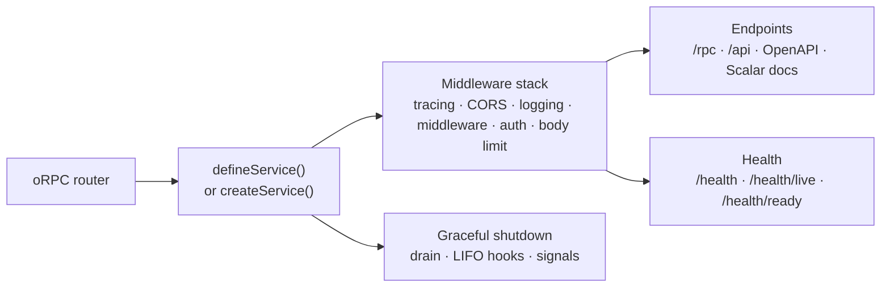

# @netscript/service

[](https://jsr.io/@netscript/service)
[](https://github.com/rickylabs/netscript/actions/workflows/ci.yml)
[](https://rickylabs.github.io/netscript/)

**The service runtime for NetScript: turn an oRPC router into a running Hono service with health
probes, OpenAPI, Scalar docs, request tracing, and graceful shutdown — in one call.**

A production service is never just its handlers. It needs CORS, request logging, an OpenAPI
document, live/ready health probes an orchestrator can poll, tracing on every request, and a
shutdown path that drains in-flight work. This package materializes all of it from the oRPC router
you already have: `defineService()` stands up the full runtime in one call, and `createService()`
composes the same stages explicitly when a service needs a bespoke stack.

Authentication and authorization ship as an opt-in subpath with provider-agnostic ports, so a
service that needs guarding adds it without dragging auth machinery into every service that does
not.

## Why teams use it

- **One-call preset** — `defineService(router, options)` wires CORS, logging, OpenAPI JSON, Scalar
  docs, RPC, service info, and health, then starts the listener and returns a `RunningService`
  handle with `addr` and an idempotent `stop()`.
- **Fluent builder** — `createService(router, config)` composes the same stages step by step, then
  `serve()` starts a listener or `build()` returns a mountable app.
- **Health probes** — `withHealth()` adds `/health`, `/health/live`, and `/health/ready`;
  `healthChecks.database`, `.kv`, `.service`, and `.custom` cover common dependencies.
- **Graceful lifecycle** — `onShutdown()` registers LIFO teardown hooks; `serve()` drains in-flight
  requests, installs `SIGINT`/`SIGTERM` handlers, and accepts an external `AbortSignal`.
- **Explicit bind address** — `serve({ hostname })` and `defineService(router, { hostname })` bind
  one interface, such as `'127.0.0.1'` for a loopback-only listener, on both the plain and the TLS
  listener; omitting it keeps the all-interfaces default.
- **Middleware slot and body limit** — `defineService(router, { middleware, bodyLimit })` installs
  caller middleware after CORS and logging and before auth, and an opt-in request-body limit that
  answers oversized bodies with a typed JSON `413` on both the RPC and OpenAPI projections.
- **One app-wide budget** — `createRuntimeHost()` invokes existing service, worker, queue, and
  database drains in deterministic phase order and returns one aggregate report.
- **Tracing on every request** — the builder registers tracing middleware as the outermost layer on
  every service, so each request gets a server span with W3C propagation and the service name
  recorded, with no per-service wiring.
- **Opt-in auth** — `./auth` ships authentication and authorization ports plus static-credential,
  trusted-header, contract-policy, and scope-authorizer factories, kept off the import graph until
  used.

## Architecture


```mermaid
flowchart LR
    R["oRPC router"] --> D["defineService()<br/>or createService()"]
    D --> M["Middleware stack<br/>tracing · CORS · logging · middleware · auth · body limit"]
    M --> E["Endpoints<br/>/rpc · /api · OpenAPI · Scalar docs"]
    M --> H["Health<br/>/health · /health/live · /health/ready"]
    D --> G["Graceful shutdown<br/>drain · LIFO hooks · signals"]
```

## Install

```bash
deno add jsr:@netscript/service@<version>
```

Pin `<version>` to match your installed CLI; bare `jsr:@netscript/*` specifiers do not resolve on
the pre-release line. Generated NetScript service entrypoints already import the pinned entry.

## Quick example

```typescript
import { defineService } from '@netscript/service';
import { router } from './router.ts';

// One call materializes the Hono + oRPC runtime and starts the listener:
// CORS, request logging, OpenAPI JSON, Scalar docs, RPC, service info, and health.
const service = await defineService(router, {
  name: 'users',
  version: '1.0.0',
  port: 3001,
  openapi: { title: 'Users API', description: 'User management service' },
});

// RunningService handle: addr + idempotent graceful stop() for tests and supervisors.
console.log(`listening on :${service.addr.port}`);
await service.stop();
```

Compose every in-process runtime behind one bounded shutdown handle without replacing its own drain:

```ts
import { createRuntimeHost } from '@netscript/service';

// Your own components — the host only needs something to call.
declare const service: { stop(): Promise<void> };
declare const workers: { stop(reason: string): Promise<void> };
declare const queue: { stop(): Promise<void> };
declare const database: { disconnect(): Promise<void> };

const host = createRuntimeHost({
  timeoutMs: 15_000,
  drains: [
    { id: 'api', phase: 'service', drain: () => service.stop() },
    { id: 'jobs', phase: 'workers', drain: () => workers.stop('shutdown') },
    { id: 'messages', phase: 'queue', drain: () => queue.stop() },
    { id: 'primary-db', phase: 'database', drain: () => database.disconnect() },
  ],
});

const report = await host.shutdown('SIGTERM');
```

The host drains `service → workers → queue → database`, preserving registration order inside each
phase. Rejected drains are reported and do not prevent later phases. If the one shared budget
expires, the active outcome is `timed-out`, remaining drains are `skipped`, and `shutdown()` returns
without waiting indefinitely for the slow resource.

Reach for `createService()` when a service needs explicit, stage-by-stage composition. The primary
authorization pattern declares access on the contract procedure and opts the application into
enforcement with `createContractAuthorizer()`:

```ts
import { createService } from '@netscript/service';
import {
  createContractAuthorizer,
  createStaticCredentialAuthenticator,
} from '@netscript/service/auth';
import { OrdersContractV1 } from '@example/contracts';
import { router } from './router.ts';

const authenticator = createStaticCredentialAuthenticator({
  credentials: {
    'local-token': { subject: 'service:orders', scopes: ['orders:read'], roles: ['service'] },
  },
});

// OrdersContractV1 declares procedure-local metadata such as:
// .meta({ access: {
//   authentication: 'required',
//   authorization: { scopes: ['orders:read'], roles: ['service'] },
// } })
const authorizer = createContractAuthorizer(OrdersContractV1);

const running = await createService(router, { name: 'orders', version: '1.0.0' })
  .withRPC()
  .withAuthn({ authenticator })
  .withAuthz({ authorizer })
  .withHealth()
  .serve({ port: 3001 });

await running.stop();
```

Authentication rejection and verifier failure have different HTTP meanings. An authenticator that
returns `{ ok: false, reason }` produces `401 UNAUTHORIZED`. An authenticator that throws or rejects
produces `503 SERVICE_UNAVAILABLE` with the fixed message `Authentication service unavailable`;
exception details are not sent to the caller. The protected handler does not run in either case.
Clients should not clear a session merely because its verifier is unavailable. Errors from
downstream handlers remain owned by the application's error handler, outside the authentication
catch boundary.

This migration is opt-in. Existing unguarded services, generated scaffolds, and services that use
`createScopeAuthorizer()` by itself keep their current behavior. Fail-closed contract enforcement
begins only when the application supplies the result of
`createContractAuthorizer(contract, { fallback? })` to `.withAuthz()`.

Contract metadata is authoritative. For a request that matches a contract procedure, a match-aware
fallback is consulted only when that procedure has no access metadata. If neither the metadata nor a
fallback rule matches, the request is denied even when the fallback's standalone `denyByDefault`
setting would otherwise allow it. A fallback can neither make a declared public procedure private
nor weaken declared scopes or roles. The builder binds one resolver to its actual REST path, RPC
path, RPC aliases, and deprecated RPC route aliases, then shares that resolver with both
authentication and authorization middleware.

`createScopeAuthorizer()` remains supported and is not deprecated. Use it standalone for a legacy
path-prefix policy, or pass it as the match-aware migration fallback for procedures that do not yet
declare metadata:

```ts
import { createContractAuthorizer, createScopeAuthorizer } from '@netscript/service/auth';
import type { ContractPolicyContract } from '@netscript/service/auth';

declare const OrdersContractV1: ContractPolicyContract;

const legacyFallback = createScopeAuthorizer({
  rules: [{
    match: (request) => request.path.startsWith('/api/legacy-orders'),
    requireScopes: ['orders:read'],
  }],
  denyByDefault: false,
});

const authorizer = createContractAuthorizer(OrdersContractV1, {
  fallback: legacyFallback,
});
```

`authentication: 'optional'` is declared for future support, currently rejected. Construction of
`createContractAuthorizer()` throws
`[netscript.service.contract-policy] optional authentication is unsupported: <procedure>`; the error
is raised while the contract is traversed, not on the first request.

A raw route added with `.route(method, path, handler)` under the guarded prefix matches no
procedure, so it is denied with `authz.no-contract-procedure` until it is declared. Declare it with
`rawRoutes`:

```ts
import { createContractAuthorizer } from '@netscript/service/auth';
import type { ContractPolicyContract } from '@netscript/service/auth';

declare const OrdersContractV1: ContractPolicyContract;

const authorizer = createContractAuthorizer(OrdersContractV1, {
  rawRoutes: [{ path: '/api/tools/mcp', authentication: 'required' }],
});
```

A declared raw route always requires authentication, even outside `protect`. It is never a public
bypass. It may add `authorization: { scopes?, roles? }`. Matching is exact: `/api/tools/mcp` does
not cover `/api/tools/mcp-admin` or `/api/tools/mcp/nested`. Construction rejects wildcard or
parameter paths, a non-`'required'` authentication and duplicates. `.build()` rejects a raw path
that overlaps the REST or RPC projection.

The `defineService()` preset accepts the same ports through its `auth` option. The following legacy
path-prefix form remains valid and behavior-compatible; new services should prefer contract metadata
plus `createContractAuthorizer()` as shown above:

```ts
import { defineService, type ServiceRouter } from '@netscript/service';
import { createScopeAuthorizer, createTrustedHeaderAuthenticator } from '@netscript/service/auth';

declare const router: ServiceRouter;

const running = await defineService(router, {
  name: 'orders',
  port: 3001,
  auth: {
    authn: {
      authenticator: createTrustedHeaderAuthenticator({
        subjectHeader: 'x-authenticated-user',
        scopesHeader: 'x-authenticated-scopes',
      }),
    },
    authz: {
      authorizer: createScopeAuthorizer({
        rules: [{
          match: (request) => request.path.startsWith('/api/orders'),
          requireScopes: ['orders:read'],
        }],
      }),
    },
  },
});

await running.stop();
```

## Principal and handler context

`@netscript/service` owns both `Principal` and `ServiceHandlerContext<TCustom>`. A principal carries
the authenticated `subject`, readonly `scopes` and `roles`, the authentication `scheme`, and a
readonly verified `claims` bag. `ServiceHandlerContext<TCustom>` combines a custom context factory's
readonly fields with optional framework-owned `db`, `traceHeaders`, and `principal` fields.

`principal` is intentionally optional because auth is configured at runtime. A handler that needs
identity narrows it before use; contract policy guarantees the runtime gate, not per-procedure
TypeScript auth typestate.

## OpenAPI access projection

`createOpenAPISpec()` projects declared contract access without rewriting other operation fields:

| Contract declaration           | OpenAPI operation                             |
| ------------------------------ | --------------------------------------------- |
| `authentication: 'none'`       | `security: []`                                |
| `authentication: 'required'`   | `security: [{ bearerAuth: scopes }]`          |
| Required `authorization.roles` | `x-netscript-roles: roles`                    |
| `authentication: 'optional'`   | `security: [{}, { bearerAuth: [] }]`          |
| No authentication declaration  | No generated operation-level `security` field |

The generated `bearerAuth` component is `{ type: 'http', scheme: 'bearer' }`. Optional remains
visible in documentation even though the first runtime adapter rejects it at construction.

## API at a glance

| Entry    | What it gives you                                                                                                                                                                                                    |
| -------- | -------------------------------------------------------------------------------------------------------------------------------------------------------------------------------------------------------------------- |
| `.`      | `defineService`, `createService`, `createRuntimeHost`, `Principal`, `ServiceHandlerContext`, `healthChecks`, `HEALTH_STATUS`, and handler factories (`createRPCHandler`, `createOpenAPISpec`, `createScalarDocs`, …) |
| `./auth` | `createStaticCredentialAuthenticator`, `createTrustedHeaderAuthenticator`, `createContractAuthorizer`, `createScopeAuthorizer`, and the authn/authz and contract-policy types                                        |

The always-current symbol list is
[`deno doc jsr:@netscript/service@<version>`](https://jsr.io/@netscript/service/doc).

## Docs

- **Services & SDK — the pillar this package implements**:
  [rickylabs.github.io/netscript/services-sdk/](https://rickylabs.github.io/netscript/services-sdk/)
- **Reference**:
  [rickylabs.github.io/netscript/reference/service/](https://rickylabs.github.io/netscript/reference/service/)
- **How-to — add a service**:
  [rickylabs.github.io/netscript/how-to/add-a-service/](https://rickylabs.github.io/netscript/how-to/add-a-service/)
- **API docs on JSR**: [jsr.io/@netscript/service/doc](https://jsr.io/@netscript/service/doc)

## Compatibility

Requires Deno 2.x — the runtime listens through `Deno.serve` and installs `Deno.addSignalListener`
handlers. Services need `--allow-net` (listener and health probes) and `--allow-env`; database and
KV health checks add the permissions of the client they probe.

## License

Apache-2.0 — see [LICENSE](https://github.com/rickylabs/netscript/blob/main/LICENSE). Published to
JSR with cryptographically verified provenance.

## Command definitions and canonical codecs

`@netscript/service/commands` defines immutable commands without executing them. Their handlers
remain privately bound to the exact original definition, and copied or forged definitions are
refused. Importing, defining and encoding commands require no permissions and start no resource.
Execution delegates to the explicitly supplied store and business operations and their permissions.

```typescript
import { defineCommand, jsonCodec } from '@netscript/service/commands';
import { z } from 'zod';

const updateItem = defineCommand({
  name: 'items.update',
  definitionVersion: 1,
  idempotency: {
    scope: () => 'items',
    fingerprint: (input: { id: string }) => input,
    response: jsonCodec(z.object({ updated: z.boolean() })),
  },
  records: { audit: 'required', outbox: 'optional' },
  handle: async () => ({ updated: true }),
});
```

Names use lowercase dot/hyphen segments, start with a letter, and contain 1–120 characters.
`definitionVersion` is a positive safe integer and marks replay compatibility. Change it when
identity, command meaning or response decoding changes. Changing a name or scope creates a new
receipt namespace; retain the old definition through the retry window or migrate receipt keys before
deploying that change. Required idempotency is the default; `mode: 'optional'` explicitly permits
commands without a key. Audit and outbox policies are `required`, `optional` or `forbidden`.

| Surface                                          | Purpose                                                                              |
| ------------------------------------------------ | ------------------------------------------------------------------------------------ |
| `CommandActor` / `CommandEnvelope<Input>`        | Narrow durable origin, input and transport identity; expected version uses a string  |
| `CommandDefinition` / `CommandDefinitionSpec`    | Opaque result and definition-time handler specification                              |
| `CommandContext`                                 | Transaction client, injected clock/IDs and synchronous audit/outbox intent recorders |
| `CommandFailure` / `CommandError`                | Frozen safe failure vocabulary; serialized errors omit message, stack and cause      |
| `CommandCodec<T>` / `jsonCodec(schema, limits?)` | Synchronous Standard Schema validation in both directions                            |
| `canonicalCommandJson(value, limits?)`           | Deterministic RFC 8785 canonical text                                                |
| `parseCanonicalCommandJson(text, limits?)`       | Bounded stored-text parsing with exact canonical round-trip verification             |

Actor roles, scopes and claims stay outside the durable envelope. Authentication/authorization
happen before execution. Credential scheme, correlation and trace are transport/audit data, excluded
from semantic request identity. Application/business errors retain their existing mapping. Only the
three client-actionable failures map through `@netscript/contracts/commands`; other failures use the
application's validation/internal/service-unavailable handling.

The internal canonical protocol is `jcs-v1`: ECMAScript number/string serialization, UTF-16
lexicographic property order and no Unicode normalization. The default safeguards are 64 nested
containers, 10,000 aggregate value nodes/object keys and 1 MiB of UTF-8 canonical text. Optional
`depth`, `items` and `bytes` limits may only tighten those ceilings. Stored text is bounded before
parsing and must reserialize exactly; duplicates, whitespace, alternative numeric spellings, escaped
equivalents and different key order are refused as corrupt/noncanonical material.

Codecs reject nonfinite numbers, lone surrogates in values or keys, sparse arrays, undefined,
functions, symbols, BigInt, Date, class instances, cycles and accessors. A `jsonCodec` schema must
validate synchronously: a returned Promise/thenable is refused with a synchronous-validation
configuration diagnostic. No async validation result or unvalidated schema output crosses this codec
boundary. Custom codecs must also return valid bounded I-JSON before persistence.

`jsonCodec()` requires synchronous validation that preserves canonical JSON identity. Neutral
transforms are accepted; coercion, field stripping and value-changing transforms are rejected,
preventing a response from changing when a stored receipt is decoded.

## Command execution

Compose `createCommandExecutor({ store, clock?, ids?, telemetry?, receiptClaimWaitMs?, limits? })`
with a database-owned `CommandStorePort<TTx>`. The focused `/commands` export keeps the root
surface unchanged. Execution performs one local interactive transaction; it never retries its
handler or sends buffered messages. Authorize the actor before calling it and keep remote effects
outside the handler. The testing store demonstrates semantics and certifies no real provider.

```typescript
import { createCommandExecutor, defineCommand, jsonCodec } from '@netscript/service/commands';
import type { CommandStorePort } from '@netscript/database/commands';
import { z } from 'zod';

type Business = { update(id: string): Promise<void> };
declare const store: CommandStorePort<Business>;
const update = defineCommand<'items.update', { id: string }, { updated: boolean }, Business>({
  name: 'items.update', definitionVersion: 1,
  idempotency: {
    scope: () => 'items', fingerprint: (input) => input,
    response: jsonCodec(z.object({ updated: z.boolean() })),
  },
  records: { audit: 'required', outbox: 'optional' },
  handle: async (ctx) => {
    await ctx.tx.update(ctx.envelope.input.id);
    ctx.audit({ action: 'updated', subject: { type: 'item', id: ctx.envelope.input.id } });
    return { updated: true };
  },
});
const executor = createCommandExecutor({ store });
const result = await executor.execute(update, {
  input: { id: 'item' }, actor: { kind: 'system', subject: 'maintenance' },
  correlationId: 'update', idempotencyKey: 'fixture-key-00001',
});
result.value;
```

The executor validates, detaches and deeply freezes bounded I-JSON input and a narrowed actor
before calling scope and fingerprint once. Request SHA-256 covers command, definitionVersion,
scope, selected input, actor kind/subject and expectedVersion or null. A separate SHA-256 hashes
the key. Scheme, correlation, W3C context and raw key are excluded from request material. Keys
are 16–256 UTF-8 bytes; scope and remaining identity/header strings are 1–256 bytes. Trace context
uses W3C known-field validation, retains opaque future fields, and permits empty tracestate members.
Traceparent rejects HTTP control bytes (including CR, LF, NUL and DEL), while preserving
allowed HTAB, SP and opaque obs-text in unknown future fields.

Defaults are 64 audit intents, 64 delivery intents and 64 KiB **aggregate** canonical side-row
bytes, including persisted metadata. Configuration only tightens those ceilings. Each transaction
receives a finite five-second timeout and validated provider claim-wait policy. Recorders perform
no IO and detach canonical JSON immediately. Required/forbidden/count/byte policy and response
codec validation all precede flush. Audit, outbox and receipt completion flush in that order using
one bound handle; their execution ID is the winning receipt ID. Optional unkeyed attempts still
have an execution ID but skip claim/completion.

Replay rechecks hash, version, completeness, canonical text and decoding, then returns the original
correlation and performs no handler or side writes. Busy issues no later query and surfaces
`in_progress` only after rollback. Abort checkpoints likewise await the store's rollback result.
Application errors preserve identity; typed database `CommandStoreError` classifications translate
to bounded service failures without reading driver text. Successful values and optional finite
telemetry completion are reported only after commit. `CommandTelemetryPort` is an extension seam;
this package supplies no OpenTelemetry implementation or production fault controls.

## Command store testing

`@netscript/service/commands/testing` exports `createMemoryCommandStore()` for semantic unit tests.
Each store owns its state; business writes, receipt completion, audit and outbox intents share one
commit. `snapshot()` returns detached frozen collections and detached timestamps.
`holdBeforeCommit()` exposes a one-use boundary barrier. `seedReceipt()` and
`writeBusinessOutsideTransaction()` are explicit corruption and atomicity negative controls. No
testing control belongs in a production executor constructor.

```ts
import { createMemoryCommandStore } from '@netscript/service/commands/testing';
const store = createMemoryCommandStore();
await store.transaction({ receiptClaimWaitMs: 0 }, async ({ business }) => {
  business.compareAndSet('version', undefined, '1');
});
const committed = store.snapshot();
```

No permissions are required. This fake simulates Serializable interactive transactions using the
existing sqlite provider vocabulary; it certifies no SQLite or other real provider. Receipt
contention returns immediate terminal busy (supported wait is zero). Stale drafts fail without
retry, and bounded timeout/cooperative cancellation revoke the transaction handle before failure
settles. Concurrent transactions touching disjoint rows may also conflict because the fake uses one
revision for its complete state. Native providers require their own provider conformance. See
`@netscript/database/commands` for the raw store contract.

`createCommandFaultController()` arms one-use failures at the seven command boundaries.
`createTestingCommandExecutor(options, controller)` runs the same executor algorithm through a
private per-instance seam; a controller binds once and keeps only its latest 128 visits. Production
`createCommandExecutor(options)` has no fault parameter or global hook. Precommit faults roll back
business, receipt, audit and outbox together. `after_commit_before_return` models a lost response:
all rows remain committed and the same-key retry replays without another handler or side record.

`runCommandConformance(createFixture)` accepts a fresh `CommandConformanceFixture<TTx>` factory.
The store and row types belong to the database package; the business handle stays generic. Supply
bound write/CAS operations, detached committed inspection, corrupt receipt seeding and an explicit
outside-write negative control. `createMemoryCommandConformanceFixture()` is the simulated default.
The finite matrix covers named faults, replay/mismatch, scope/name/version changes, malformed replay,
cancellation, CAS, callback re-entry, no retry, terminal busy, isolation, policies and ordered flush.
It includes concurrent replay and recovery after a rolled-back leader. Replacing the fixture's bound
write with its outside-write control must fail the same-commit assertion. Real adapters still need
provider-specific driver, lock, timeout and pooled session qualification.

```ts
import {
  createMemoryCommandConformanceFixture,
  runCommandConformance,
} from '@netscript/service/commands/testing';
const report = await runCommandConformance(createMemoryCommandConformanceFixture);
```

`assertCommandDeterminism(definition, envelope, samples)` evaluates actual identity logic 2–32
times (default four), each over equivalent detached deeply frozen input/actor material. It detects
scope or fingerprint closure changes that affect sampled identity, without executing the handler
or store. Its `sampled_equivalence` report is finite evidence, not a universal purity guarantee;
command authors remain responsible for excluding clocks, randomness, mutable globals and IO.

## Durable command outbox relay

Import `createCommandOutboxRelay` and its options from `@netscript/service/commands/relay`.
Database owns raw persistence; service decodes bounded canonical I-JSON, validates W3C fields,
resolves a copied sink registry and supervises a bounded drain. Construction starts no timer,
resource or queue. Schedule `drainOnce` with your existing scheduler and await `stop` on shutdown.

```ts
import { createCommandOutboxRelay } from '@netscript/service/commands/relay';
import type { CommandOutboxRelayStore, CommandOutboxSink } from '@netscript/service/commands/relay';

declare const store: CommandOutboxRelayStore;
declare const sink: CommandOutboxSink;
const relay = createCommandOutboxRelay({
  store, sinks: new Map([[sink.id, sink]]),
  clock: { now: () => new Date() }, ids: { next: () => crypto.randomUUID() },
  batchSize: 16, concurrency: 4, leaseMs: 30000,
  maxAttempts: 10, maxRetryDelayMs: 60000,
  classify: () => 'unavailable',
  retryAt: (attempt, now) => new Date(now.getTime() + Math.min(1000 * attempt, 60000)),
});
await relay.drainOnce();
await relay.stop();
```

Overlapping drains serialize under one concurrency ceiling. Stop prevents new claims, signals
active publishers and waits for all active and queued drains, including publishers that ignore
cancellation. Aborted claimed rows are released only through their owned token; expired ownership
remains for a later claim. Caller cancellation is cooperative and passed to provider/sink operations.
Finite provider timeouts and sink timeouts belong to their supplied boundaries.

A generic sink may resolve void at its documented acceptance boundary. Checked worker sinks return
only normalized `{ identity, acceptedAt }`; service validates and snapshots both before database
settlement. Payload/trace corruption or missing sinks become `misconfigured`; unchecked acceptance
becomes `invalid_response`. The six closed failure classes are persisted without exception text.
Invalid retry policies retain terminal `misconfigured` state rather than losing ownership. Claim or
uncertain settlement failures surface to your scheduler; an uncertain settlement is not repaired by
releasing a possibly committed lease.

Publish always precedes settlement. A crash after acceptance and before durable publication marking
redelivers the stable outbox ID/dedupe key. This is at-least-once delivery. One effective operation
requires an independently idempotent downstream persistence boundary. The semantic fixture proves
its own applied-key persistence explicitly; it does not certify a remote transport.

Supply optional `telemetry` and explicit `provider` for the structurally compatible C4 relay/publish
adapter. Start inputs select only command name/version, provider, isolation and finite idempotency;
raw identities, topic, payload and errors are excluded. Deferred publication restores the validated
persisted parent; the active producer context is injected for downstream consumers. Observer setup,
finish and end errors do not change the once-only operation result. Import/construction needs no
permissions; supplied provider/sinks need their consumer-owned permissions.

## Command telemetry

Command execution can use `createOtelCommandTelemetryPort` from `@netscript/telemetry/commands`,
configured with the registered command definitions. Its structural port traces early rejected and
cancelled attempts as well as committed/replayed attempts. Definitions are verified before tracing;
validation and identity occur once within the observed operation. Completion observer failures do
not replace committed results. Command spans join through native span context and deliberately
exclude envelope identities, keys, hashes, payloads and correlation IDs.
