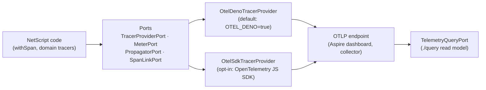

# @netscript/telemetry

[](https://jsr.io/@netscript/telemetry)
[](https://github.com/rickylabs/netscript/actions/workflows/ci.yml)
[](https://rickylabs.github.io/netscript/)

**OpenTelemetry tracing for NetScript: connect scheduler, queue, worker, RPC, and SSE spans into one
distributed trace through explicit ports and adapters — with W3C propagation, fan-in span links, and
a telemetry query read model.**

A background job in NetScript may cross a scheduler tick, a queue message, a worker, and a spawned
subprocess before it answers an RPC call — and the trace should survive the whole journey. This
package makes that a first-party concern: domain tracers name spans by subsystem, context
propagation carries the trace across message headers and `Deno.Command` boundaries, fan-in span
links group many producer traces into one consumer span, and first-party oRPC and Hono
instrumentation follows upstream semantic conventions. A query subpath reads the same telemetry back
for diagnostics and agent tooling.

## Why teams use it

- **Domain tracers** — `getJobTracer`, `getQueueTracer`, `getWorkerTracer`, `getSchedulerTracer`,
  `getSagaTracer`, `getSSETracer`, and `getKVTracer` return cached, canonically named tracers so
  spans group by NetScript subsystem.
- **Span helpers, no raw SDK** — `withSpan`, `withSpanSync`, `createSpan`, and `addSpanEvent` wrap
  OpenTelemetry-compatible `Span` and `Context` types so callers never touch the SDK directly.
- **W3C propagation everywhere** — `injectContext` / `extractContext` carry trace context through
  message headers; `createJobTraceEnv` / `extractJobTraceContext` and `initJobTracing` thread it
  across `Deno.Command` job subprocesses.
- **Fan-in span links** — `createFanInLinks` turns upstream `traceparent` / `tracestate` headers
  into span links, so many producer traces link into one consumer span instead of being re-parented.
- **First-party integrations** — `./orpc` ships a `TracingPlugin` backed by the upstream
  `@orpc/otel` instrumentation; `./hono` wraps Hono's own `@hono/otel` middleware and layers
  NetScript service naming on top; `./instrumentation` covers queue, worker, scheduler, and job
  execution plus worker metrics.
- **Query read model** — `./query` publishes the `TelemetryQueryPort` contract, Standard Schema
  query-filter validators, and the Aspire-backed reader (`createAspireTelemetryQuery`), so tools can
  read traces, logs, and metrics back out.
- **Testable by construction** — `./testing` ships `InMemorySpanRecorder`, a `Tracer` that records
  spans in memory for unit assertions.

## Architecture



The package separates **ports** (what NetScript code programs against) from **adapters** (what
actually emits telemetry). `createTelemetryProvider` selects a provider adapter — Deno's built-in
OTLP exporter by default, so tracing works with zero SDK dependencies, or an SDK-backed binding that
also unlocks attribute-preserving span links. Application code only ever sees the port types.

## Install

```bash
deno add jsr:@netscript/telemetry@<version>
```

Pin `<version>` to match your installed CLI; bare `jsr:@netscript/*` specifiers do not resolve on
the pre-release line.

## Quick example

```typescript
import { withSpan } from '@netscript/telemetry/tracer';
import { createInMemorySpanRecorder } from '@netscript/telemetry/testing';

// Any Tracer works here — a domain tracer like getJobTracer() in an app;
// the in-memory recorder makes the span observable without an OTLP endpoint.
const tracer = createInMemorySpanRecorder();

const total = await withSpan(tracer, 'job.import', async (span) => {
  span.setAttribute('netscript.job.source', 'erp-sync');
  return 42;
});

const [snapshot] = tracer.snapshots();
console.log(total, snapshot?.name, snapshot?.attributes['netscript.job.source']);
// 42 "job.import" "erp-sync"
```

To continue a worker's trace inside a spawned job subprocess, extract the propagated context at the
start of the job script:

```typescript
import { initJobTracing } from '@netscript/telemetry';
import { getJobTracer, withSpan } from '@netscript/telemetry/tracer';

const parentContext = initJobTracing();

await withSpan(
  getJobTracer(),
  'job.main',
  (span) => {
    span.setAttribute('netscript.job.step', 'processing');
    // ... job logic
  },
  { parentContext: parentContext ?? undefined },
);
```

## Attribute convention

The NetScript telemetry convention splits attribute ownership in two:

- **Upstream semconv keys** are used wherever OpenTelemetry defines them — `rpc.*` for RPC spans,
  `gen_ai.*` for AI/agent spans, `server.*` / `messaging.*` for HTTP and messaging.
- **NetScript-owned attributes** live under the single proprietary root `netscript.*` — queue-only
  concepts such as delivery count, priority, delay, and DLQ live under `netscript.messaging.*`, and
  correlated spans share `netscript.correlation.id`.

Attribute builders under `./attributes` (`createJobAttributes`, `createMessagingAttributes`,
`createSagaAttributes`, `createGenAiAttributes`, …) apply the split, and `SpanNames` fixes the
canonical span-name vocabulary. The full convention — span naming, SpanKind, status, propagation,
and the required `OTEL_SEMCONV_STABILITY_OPT_IN` value — is on the
[convention page](https://rickylabs.github.io/netscript/reference/telemetry/convention/).

## Public surface

| Entry               | What it gives you                                       |
| ------------------- | ------------------------------------------------------- |
| `.`                 | Primary tracing surface, registry, `inspectTelemetry`   |
| `./tracer`          | Domain tracers, span helpers, fan-in span links         |
| `./config`          | Env-driven configuration + Standard Schema validation   |
| `./context`         | W3C context propagation                                 |
| `./attributes`      | `netscript.*` / semconv attribute builders, `SpanNames` |
| `./instrumentation` | Queue/worker/scheduler/job instrumentation + metrics    |
| `./registry`        | Instrumentation registry facade                         |
| `./orpc`            | oRPC tracing/error plugins (`@orpc/otel`-backed)        |
| `./hono`            | Hono tracing middleware (`@hono/otel`-backed)           |
| `./ai`              | OpenTelemetry adapter for the `@netscript/ai` runtime   |
| `./otel`            | Provider ports + OpenTelemetry adapters                 |
| `./query`           | Read-model contracts + Aspire telemetry reader          |
| `./testing`         | In-memory span recorder for tests                       |

The `./ai` subpath injects GenAI telemetry into the AI runtime without adding an OTel dependency to
`@netscript/ai`: `createAiRuntime({ telemetry: createOtelAiTelemetryPort() })` turns agent-loop chat
operations into `gen_ai.chat` spans with provider-reported token usage.

The always-current symbol list is
[`deno doc jsr:@netscript/telemetry@<version>`](https://jsr.io/@netscript/telemetry/doc) (pin
`<version>` on the pre-release line, as above).

## Docs

- **Reference — tracers, propagation, instrumentation, and query**:
  [rickylabs.github.io/netscript/reference/telemetry/](https://rickylabs.github.io/netscript/reference/telemetry/)
- **Telemetry convention — attribute ownership and span naming rules**:
  [rickylabs.github.io/netscript/reference/telemetry/convention/](https://rickylabs.github.io/netscript/reference/telemetry/convention/)
- **Observability — how traces surface in the Aspire dashboard**:
  [rickylabs.github.io/netscript/observability/](https://rickylabs.github.io/netscript/observability/)
- **API docs on JSR**: [jsr.io/@netscript/telemetry/doc](https://jsr.io/@netscript/telemetry/doc)

## Compatibility

Requires Deno 2+. The default provider binds to Deno's built-in OTLP exporter — set `OTEL_DENO=true`
and point `OTEL_EXPORTER_OTLP_ENDPOINT` at a collector (the NetScript scaffold wires the Aspire
dashboard for you); no OpenTelemetry SDK dependency is needed. Apps that bring the OpenTelemetry JS
SDK can opt into the SDK-backed provider for attribute-preserving span links. Reading
environment-driven configuration needs `--allow-env`.

## License

Apache-2.0 — see [LICENSE](https://github.com/rickylabs/netscript/blob/main/LICENSE). Published to
JSR with cryptographically verified provenance.
