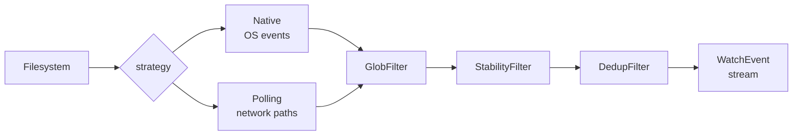

# @netscript/watchers

[](https://jsr.io/@netscript/watchers)
[](https://github.com/rickylabs/netscript/actions/workflows/ci.yml)
[](https://rickylabs.github.io/netscript/)

**A composable file-watching runtime for NetScript that turns filesystem changes into a normalized
event stream — auto-selecting native OS notifications or polling and filtering every event through a
glob, stability, and dedup pipeline.**

Raw filesystem watching lies to you: native events fire mid-write, network shares drop notifications
entirely, and editors emit bursts of duplicates for one save. `@netscript/watchers` absorbs all of
that. `createWatcher` picks the right strategy per path — native events locally, polling on network
mounts — and yields a `WatchEvent` only after it clears a configurable filter pipeline: glob
patterns to select files, a stability window so half-written uploads never surface, and content-hash
dedup so one logical change is one event. The result is the event stream a processing pipeline
actually wants to consume.

## Why teams use it

- **Auto-selected strategy** — `FileWatcher` chooses native OS notifications for local paths and
  polling for network shares; set `forcePolling: true` for SMB/NFS mounts where native events are
  unreliable.
- **Composable filter pipeline** — events flow through `GlobFilter` (filename patterns),
  `StabilityFilter` (waits for writes to finish), and `DedupFilter` (skips repeated content hashes)
  in configured order.
- **Deterministic shutdown** — `watch()` is an async generator, `stop()` is idempotent, and a
  supplied `AbortSignal` chains into the watcher's internal controller, so a host runtime can bind
  watcher lifetime to a larger supervisor.
- **Resilient filesystem access** — `safeReadFile`, `safeStat`, and `computeContentHash` swallow
  only missing/inaccessible errors, and `AccessFailureTracker` surfaces persistent per-path
  failures.
- **Typed event contract** — `WatchEvent`, `WatcherOptions`, `EventKind`, and `WatchStrategy` model
  the surface, so consumers like NetScript's file-watch trigger ingress build on a stable contract.

## Architecture



## Install

```bash
deno add jsr:@netscript/watchers@<version>
```

Pin `<version>` to match your installed CLI; bare `jsr:@netscript/*` specifiers do not resolve on
the pre-release line.

## Quick example

```typescript
import { createWatcher } from '@netscript/watchers';

const watcher = createWatcher({
  paths: ['./incoming'],
  patterns: ['*.csv'],
  events: ['create', 'modify'],
  stabilityThreshold: { checkIntervalMs: 1000, stableChecks: 3 },
});

for await (const event of watcher.watch()) {
  console.log(`${event.kind}: ${event.path}`);
  watcher.stop();
}
```

The loop yields each `*.csv` created or modified under `./incoming` — but only after the file has
stayed unchanged for three consecutive checks, so downstream processing never reads a half-written
upload.

## Public surface

| Symbol group                                                             | What it gives you                          |
| ------------------------------------------------------------------------ | ------------------------------------------ |
| `createWatcher`, `FileWatcher`                                           | The watcher runtime and its factory        |
| `GlobFilter`, `StabilityFilter`, `DedupFilter`                           | The composable filter pipeline             |
| `NativeStrategy`, `PollingStrategy`, `HybridStrategy`                    | Watch strategies behind the auto-selection |
| `safeReadFile`, `safeStat`, `computeContentHash`, `AccessFailureTracker` | Resilient filesystem helpers               |
| `WatchEvent`, `WatcherOptions`, `EventKind`, `WatchStrategy`             | The typed event contract                   |

The always-current symbol list is
[`deno doc jsr:@netscript/watchers@<version>`](https://jsr.io/@netscript/watchers/doc) (pin
`<version>` on the pre-release line, as above).

## Docs

- **Reference — watcher options, filters, and exports**:
  [rickylabs.github.io/netscript/reference/watchers/](https://rickylabs.github.io/netscript/reference/watchers/)
- **Background Processing — where watchers fit the background stack**:
  [rickylabs.github.io/netscript/background-processing/](https://rickylabs.github.io/netscript/background-processing/)
- **Triggers — the file-watch ingress built on this package**:
  [rickylabs.github.io/netscript/reference/triggers/](https://rickylabs.github.io/netscript/reference/triggers/)
- **API docs on JSR**: [jsr.io/@netscript/watchers/doc](https://jsr.io/@netscript/watchers/doc)

## Compatibility

Designed for Deno; watching needs `--allow-read` on the watched paths. Native OS notifications are
used where the platform provides them; use `forcePolling` for network filesystems.

## License

Apache-2.0 — see [LICENSE](https://github.com/rickylabs/netscript/blob/main/LICENSE). Published to
JSR with cryptographically verified provenance.
