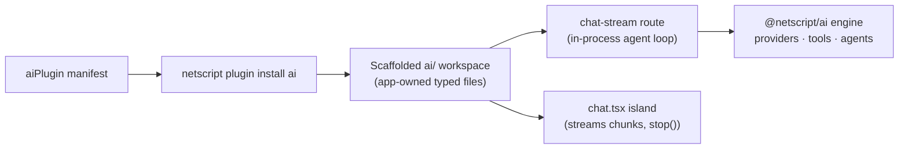

# @netscript/plugin-ai

[](https://jsr.io/@netscript/plugin-ai)
[](https://github.com/rickylabs/netscript/actions/workflows/ci.yml)
[](https://rickylabs.github.io/netscript/)

**The AI plugin for NetScript: one install scaffolds an app-owned, in-process chat, tool, and agent
surface — typed userland files that call the AI engine directly, with no gateway in between.**

Most AI integrations bolt a proxy service onto your app and hide the interesting code behind it.
`@netscript/plugin-ai` takes the opposite stance: `netscript plugin install ai` emits a small set of
typed files under `ai/` — a composition root, a model registry, a streaming chat route, a chat
island, and starter tool and agent stubs — and every one of them is yours to edit. The generated
route calls the AI engine inside your app's own server process; no AI gateway or extra network hop
is scaffolded.

The plugin itself ships no runtime AI logic. The engine lives in
[`@netscript/ai`](https://jsr.io/@netscript/ai) and the durable-chat runtime in
[`@netscript/fresh`](https://jsr.io/@netscript/fresh); the scaffolded files import those installed
dependencies directly, so upgrading the engine never means regenerating your code.

## Why teams use it

- **App-owned output** — every scaffolded file is a typed wrapper importing the installed
  dependency, never a copy of framework source; edit them like any other file in your repo.
- **Fully in-process by default** — the generated chat stream route runs the agent loop inside your
  server, keeping latency, secrets, and observability in one place.
- **Streaming with cancellation** — the chat route threads the request's `AbortSignal` into the
  agent loop and the chat connection exposes `stop()`, so clients can cancel a generation
  mid-stream.
- **Typed model registry** — `ai/models.ts` centralizes provider ids and `provider:model-id` refs;
  change models by editing data, not routes.
- **MCP client-side, where it belongs** — the scaffolded tool registry (`ai/mcp/registry.ts`)
  bridges MCP client transports from `@netscript/ai/mcp` into your tools; the plugin scaffolds no
  MCP server.
- **Opt-in persistence** — thread persistence is a flag away, backed by a Deno KV thread store.

## Architecture



## Install

From the root of a NetScript project:

```bash
netscript plugin install ai --name ai
```

To consume the plugin programmatically (custom hosts, tests, tooling), add it as a library:

```bash
deno add jsr:@netscript/plugin-ai
```

For version pins in configuration, use the `@<version>` placeholder pinned to your installed CLI;
bare `jsr:@netscript/*` specifiers do not resolve on the pre-release line.

## Quick example

Install the plugin and inspect what it emitted:

```bash
$ netscript plugin install ai --name ai
Installed ai plugin "ai" on port 8095.
Created 7 plugin files.
Regenerated 12 Aspire helper files.
```

| File                       | Purpose                                                  |
| -------------------------- | -------------------------------------------------------- |
| `ai/ai.ts`                 | Composition root: wires `@netscript/ai` once.            |
| `ai/models.ts`             | Provider ids + `provider:model-id` refs (edit freely).   |
| `ai/routes/chat-stream.ts` | In-process POST route: runs the agent loop directly.     |
| `ai/routes/chat.tsx`       | Chat island rendering streamed assistant parts.          |
| `ai/tools/echo.ts`         | Starter Standard-Schema tool over `@netscript/ai/tools`. |
| `ai/agents/assistant.ts`   | Starter bounded agent loop over `@netscript/ai/agent`.   |
| `ai/mcp/registry.ts`       | Tool registry bridging MCP client transports.            |

As a library, the manifest is inspectable data, and the adapter connector previews exactly what an
install will emit:

```typescript
import { aiPlugin } from '@netscript/plugin-ai';
import { aiAdapterPlugin } from '@netscript/plugin-ai/adapter';
import { collectInstallArtifacts } from '@netscript/plugin/adapter';

console.log(aiPlugin.name); // "@netscript/plugin-ai"

// Paths emitted by the default (in-process) install topology.
for (const artifact of collectInstallArtifacts(aiAdapterPlugin)) {
  console.log(artifact.path); // e.g. "ai/ai.ts", "ai/routes/chat-stream.ts"
}

// Add-only resources hosts can scaffold incrementally (tool, agent, thread-store).
console.log(aiAdapterPlugin.resources?.map((resource) => resource.name));
```

## Public surface

| Entry         | What it gives you                                                  |
| ------------- | ------------------------------------------------------------------ |
| `.`           | `aiPlugin` plus the `AI_PLUGIN_ID` / `AI_WORKSPACE_NAME` constants |
| `./adapter`   | The adapter connector hosts drive to install and add resources     |
| `./contracts` | The versioned `/v1/ai` contract from `@netscript/plugin-ai-core`   |
| `./scaffold`  | The plugin-owned scaffolder `netscript plugin install ai` executes |

The always-current symbol list is
[`deno doc jsr:@netscript/plugin-ai@<version>`](https://jsr.io/@netscript/plugin-ai/doc) (pin
`<version>` on the pre-release line, as above).

## Docs

- **AI plugin reference — scaffold surface and resources**:
  [rickylabs.github.io/netscript/reference/plugin-ai/](https://rickylabs.github.io/netscript/reference/plugin-ai/)
- **AI engine reference — providers, tools, agents, MCP client**:
  [rickylabs.github.io/netscript/reference/ai/](https://rickylabs.github.io/netscript/reference/ai/)
- **API docs on JSR**: [jsr.io/@netscript/plugin-ai/doc](https://jsr.io/@netscript/plugin-ai/doc)

## Compatibility

The scaffolded surface runs wherever your NetScript app runs (Deno 2.9+); thread persistence uses
Deno KV. The manifest and contracts are plain data and types, importable in any TypeScript
environment. Provider API keys are read by your app's own configuration — the plugin stores no
credentials.

## License

Apache-2.0 — see [LICENSE](https://github.com/rickylabs/netscript/blob/main/LICENSE). Published to
JSR with cryptographically verified provenance.
