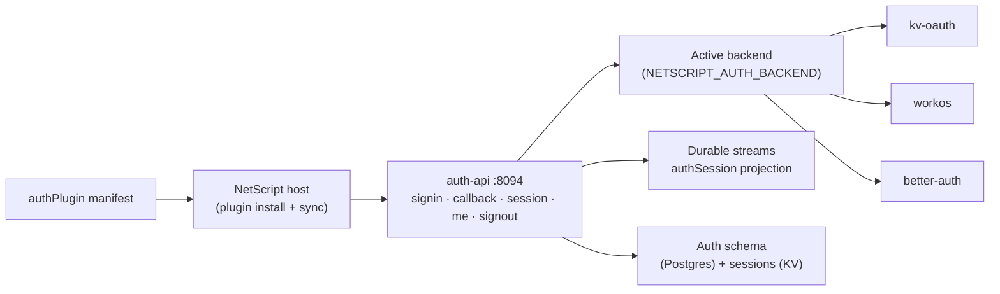

# @netscript/plugin-auth

[](https://jsr.io/@netscript/plugin-auth)
[](https://github.com/rickylabs/netscript/actions/workflows/ci.yml)
[](https://rickylabs.github.io/netscript/)

**The authentication plugin for NetScript: one install wires a unified auth API, pluggable backends,
the auth database schema, and durable session streams into your app.**

Authentication is the feature every app needs and no team wants to rebuild — providers, sessions,
cookies, schema, and the operational glue around all four. `@netscript/plugin-auth` ships it as one
declarative manifest: `netscript plugin install auth` scaffolds the auth workspace, registers the
`auth-api` service, provisions the auth schema and session storage, and adds everything to your
Aspire AppHost. Your app talks to one versioned auth API; which identity backend answers is a
configuration choice, not a rewrite.

The manifest is plain data. Hosts read it to generate files and wiring; nothing executes until your
app boots. The domain schemas, backend port, and v1 contract live in
[`@netscript/plugin-auth-core`](https://jsr.io/@netscript/plugin-auth-core) — this package binds
them to a NetScript host.

## Why teams use it

- **One auth API, swappable backends** — the `auth-api` service (default port `8094`) exposes
  `signin`, `callback`, `signout`, `session`, and `me` over a versioned v1 contract, backed by a
  single active backend selected via `NETSCRIPT_AUTH_BACKEND`: `kv-oauth` (interactive OAuth/OIDC),
  `workos`, or `better-auth`.
- **Capability differences surface, not crash** — operations a backend does not support return typed
  auth-provider errors at the API boundary instead of failing deep in a handler.
- **Schema included** — the plugin ships the auth-owned Prisma schema, so generated workspaces
  provision auth tables alongside the rest of the database.
- **Durable session streams** — the browser-safe `./streams` subpath builds a durable-stream
  projection for the `authSession` entity, with server-side emit helpers on `./streams/server`.
- **Provisioning recorded up front** — auth requires Postgres (schema) and Deno KV (sessions); the
  install records both from the manifest so `netscript db` and Aspire provision them for you.

## Architecture



## Install

From the root of a NetScript project:

```bash
netscript plugin install auth --name auth
```

The plugin owns its setup — the CLI ships no embedded templates. The scaffolder wires the auth API
service, the auth database schema, session streams, and Aspire resources into your workspace, then
pins the matching `@netscript/*` versions.

To consume the plugin programmatically (custom hosts, tests, tooling), add it as a library:

```bash
deno add jsr:@netscript/plugin-auth
```

For version pins in configuration, use the `@<version>` placeholder pinned to your installed CLI;
bare `jsr:@netscript/*` specifiers do not resolve on the pre-release line.

## Quick example

Install the plugin:

```bash
$ netscript plugin install auth --name auth
Installed auth plugin "auth" on port 8094.
Created 1 plugin files.
Regenerated 12 Aspire helper files.
```

As a library, the manifest is inspectable data — verify the contributions it brings before the app
boots its services:

```typescript
import { inspectPlugin } from '@netscript/plugin';
import { authPlugin } from '@netscript/plugin-auth';

const inspection = inspectPlugin(authPlugin);

if (inspection.details.contributionGroups === 0) {
  throw new Error('auth service contribution is required');
}

console.log(
  inspection.target,
  inspection.details.version,
  inspection.details.contributionGroups,
);
```

## Public surface

| Entry              | What it gives you                                                    |
| ------------------ | -------------------------------------------------------------------- |
| `.`                | `authPlugin` plus the `AUTH_*` identity and service constants        |
| `./services`       | The auth API service composition (`auth-api`, port `8094`)           |
| `./streams`        | Browser-safe durable-stream projection for the `authSession` entity  |
| `./streams/server` | Server-side session-stream emit helpers                              |
| `./contracts`      | The versioned auth API contract generated registries bind against    |
| `./scaffold`       | The plugin-owned scaffolder `netscript plugin install auth` executes |

The always-current symbol list is
[`deno doc jsr:@netscript/plugin-auth@<version>`](https://jsr.io/@netscript/plugin-auth/doc) (pin
`<version>` on the pre-release line, as above).

## Docs

- **Auth plugin reference — service, backends, and contract**:
  [rickylabs.github.io/netscript/reference/plugin-auth/](https://rickylabs.github.io/netscript/reference/plugin-auth/)
- **Identity & Access — the full authentication story**:
  [rickylabs.github.io/netscript/identity-access/](https://rickylabs.github.io/netscript/identity-access/)
- **How-to — add authentication to an app**:
  [rickylabs.github.io/netscript/how-to/add-authentication/](https://rickylabs.github.io/netscript/how-to/add-authentication/)
- **API docs on JSR**:
  [jsr.io/@netscript/plugin-auth/doc](https://jsr.io/@netscript/plugin-auth/doc)

## Compatibility

The auth API service requires Deno 2.9+ and needs Postgres for the auth schema and Deno KV for
sessions (both provisioned through `netscript db` and Aspire). The manifest and the browser-safe
`./streams` subpath are importable in any TypeScript environment.

## License

Apache-2.0 — see [LICENSE](https://github.com/rickylabs/netscript/blob/main/LICENSE). Published to
JSR with cryptographically verified provenance.
